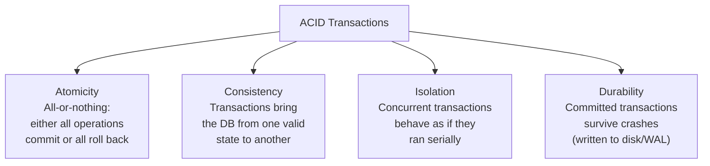
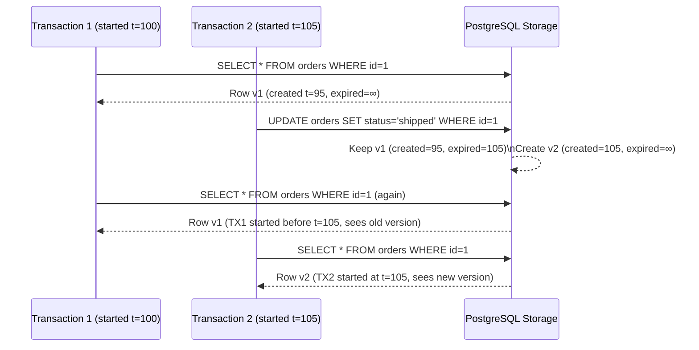
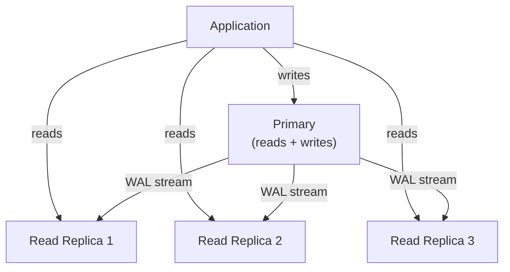

# SQL Databases

Relational databases have been the backbone of software systems for 50 years — and they're still the right choice for the majority of applications. Understanding them deeply, beyond basic CRUD, is what enables you to build systems that are both correct and performant under real load.

> **The interview reality:** SQL databases appear in nearly every system design. The questions that separate candidates: How do you handle transactions? When does normalization hurt you? How do you scale reads? What breaks at 10M rows?

---

## The Relational Model

Data is organized into **tables** (relations) with typed columns. Rows represent individual records. Tables are linked via **foreign keys** — references to the primary key of another table.

```
users                          orders
─────────────────────         ────────────────────────────────
id  | name    | email         id  | user_id | total | status
────|─────────|──────         ────|─────────|───────|───────
1   | Alice   | a@x.com       1   | 1       | 49.99 | shipped
2   | Bob     | b@x.com       2   | 1       | 12.50 | pending
3   | Carol   | c@x.com       3   | 2       | 99.00 | shipped
                               ↑
                          FK → users.id
```

SQL lets you query across tables:

```sql
SELECT u.name, SUM(o.total) AS lifetime_value
FROM users u
JOIN orders o ON u.id = o.user_id
WHERE o.status = 'shipped'
GROUP BY u.id, u.name
HAVING SUM(o.total) > 100
ORDER BY lifetime_value DESC;
```

---

## ACID — The Guarantee That Matters

ACID is the set of properties that make relational databases safe for critical data:



### Atomicity in Practice

A bank transfer is the canonical example:

```sql
BEGIN;
  UPDATE accounts SET balance = balance - 500 WHERE id = 1; -- debit Alice
  UPDATE accounts SET balance = balance + 500 WHERE id = 2; -- credit Bob
COMMIT;
```

If the server crashes between the two UPDATE statements, the transaction rolls back completely. Alice keeps her $500. No money disappears. **Without ACID, this is a catastrophic bug.**

### Isolation Levels

The "I" in ACID has degrees — a spectrum between full isolation (safe but slow) and looser isolation (fast but with anomalies):

| Level                | Dirty Read  | Non-Repeatable Read | Phantom Read | Notes                |
| -------------------- | ----------- | ------------------- | ------------ | -------------------- |
| **Read Uncommitted** | ✅ Possible | ✅ Possible         | ✅ Possible  | Fastest, dangerous   |
| **Read Committed**   | ❌          | ✅ Possible         | ✅ Possible  | PostgreSQL default   |
| **Repeatable Read**  | ❌          | ❌                  | ✅ Possible  | MySQL InnoDB default |
| **Serializable**     | ❌          | ❌                  | ❌           | Safest, slowest      |

**Anomaly definitions:**

- **Dirty Read:** Reading uncommitted data from another transaction
- **Non-Repeatable Read:** Re-reading the same row gets different results (another transaction committed between reads)
- **Phantom Read:** Re-running a query returns different rows (another transaction inserted/deleted rows)

**Production reality:** Most apps use **Read Committed** (PostgreSQL default). Serializable is only needed for the most complex financial logic. The performance difference between levels is significant at high concurrency.

---

## Data Normalization

Normalization organizes data to reduce redundancy and ensure integrity.

### Before Normalization (Denormalized)

```
orders
id | customer_name | customer_email | product_name | product_price | quantity
───|───────────────|────────────────|──────────────|───────────────|─────────
1  | Alice         | a@x.com        | Laptop       | 999.99        | 1
2  | Alice         | a@x.com        | Mouse        | 29.99         | 2
3  | Bob           | b@x.com        | Laptop       | 999.99        | 1
```

**Problems:** Alice's email duplicated in every row. Price stored per order — price changes create inconsistency. Updating Alice's email requires updating N rows.

### After Normalization (3NF)

```
users           products           orders           order_items
──────────      ──────────────     ──────────       ─────────────────────
id | name |..   id | name | price  id | user_id     id | order_id | product_id | qty
───|──────|     ───|──────|──────  ───|─────────    ───|──────────|────────────|────
1  | Alice      1  | Laptop| 999   1  | 1           1  | 1        | 1          | 1
2  | Bob        2  | Mouse | 29    2  | 2           2  | 1        | 2          | 2
```

Each fact lives in exactly one place. Update Alice's email once → consistent everywhere.

### When to Denormalize

Normalization is correct but joins have a cost. At high read volume, denormalization trades write complexity for read speed:

```sql
-- Normalized: requires join on every read
SELECT u.name, p.name, oi.quantity
FROM order_items oi
JOIN orders o ON oi.order_id = o.id
JOIN users u ON o.user_id = u.id
JOIN products p ON oi.product_id = p.id;

-- Denormalized: user_name and product_name stored in order_items
-- One table scan, no joins → 5–50x faster at scale
```

**Rule of thumb:** Normalize first. Denormalize specific query paths when profiling shows join overhead is a real bottleneck — not before.

---

## Transactions — Production Patterns

### Optimistic vs Pessimistic Locking

**Pessimistic locking** assumes conflict will happen — locks the row before reading:

```sql
BEGIN;
SELECT * FROM inventory WHERE product_id = 42 FOR UPDATE; -- row lock
-- Only this transaction can read this row now
UPDATE inventory SET quantity = quantity - 1 WHERE product_id = 42;
COMMIT;
```

**Optimistic locking** assumes conflict is rare — uses a version column to detect it:

```sql
-- Read with version
SELECT quantity, version FROM inventory WHERE product_id = 42;
-- Got: quantity=10, version=5

-- Update only if version hasn't changed
UPDATE inventory
SET quantity = 9, version = 6
WHERE product_id = 42 AND version = 5;

-- If 0 rows affected → someone else updated first → retry
```

|                 | Pessimistic                   | Optimistic                       |
| --------------- | ----------------------------- | -------------------------------- |
| **When to use** | High conflict, must not retry | Low conflict, retries acceptable |
| **Throughput**  | Lower (locks block readers)   | Higher (no blocking)             |
| **Complexity**  | Lower                         | Higher (retry logic)             |
| **Risk**        | Deadlock                      | Retry storms under high conflict |

---

## PostgreSQL Internals — What Engineers Must Know

PostgreSQL is the most feature-complete open-source relational database. Understanding its internals drives better design decisions.

### MVCC — Multi-Version Concurrency Control

PostgreSQL never overwrites rows in place. Instead, it creates **new versions** of rows:



**Consequence:** Readers never block writers. Writers never block readers. This is why PostgreSQL handles high concurrency so well.

**VACUUM:** Old row versions (dead tuples) must be cleaned up. PostgreSQL's autovacuum does this in the background. **Table bloat** occurs if vacuum can't keep up — a real operational concern at high update rates.

### Write-Ahead Log (WAL)

Before any data page is modified, the change is written to the WAL (a sequential log file). This is how durability (the "D" in ACID) works:

```
Crash at any point: WAL has the full history of committed changes
Recovery: Replay WAL from last checkpoint → database is consistent
```

WAL is also the mechanism for **replication** — replicas consume the primary's WAL to stay in sync.

### EXPLAIN ANALYZE — Your Most Important Tool

```sql
EXPLAIN ANALYZE
SELECT * FROM orders WHERE user_id = 42 AND status = 'pending';

-- Output:
-- Seq Scan on orders  (cost=0.00..8542.00 rows=12 width=64)
--                     (actual time=0.082..89.451 rows=12 loops=1)
--   Filter: ((user_id = 42) AND ((status)::text = 'pending'::text))
--   Rows Removed by Filter: 183241
-- Planning Time: 0.3 ms
-- Execution Time: 89.5 ms    ← 89ms because it scanned 183K rows!
```

This tells you: **Sequential scan on 183K rows to return 12**. An index on `(user_id, status)` would drop this to microseconds.

---

## Scaling SQL Databases

### Read Replicas

Add read-only replicas to distribute read load. Writes go to primary; reads go to replicas:



**Replication lag:** Replicas are slightly behind the primary (typically milliseconds, sometimes seconds under load). Reading your own writes immediately after writing can return stale data. Solutions: read from primary for user-sensitive data, use `synchronous_commit`, or tolerate the lag.

### Connection Pooling

PostgreSQL processes are expensive — each connection forks a new OS process (~5–10MB). At 1000 concurrent connections, the database is overwhelmed just managing connections.

**PgBouncer** pools connections:

```
Application (500 connections) → PgBouncer → PostgreSQL (50 connections)
```

PgBouncer queues application requests and reuses a small pool of actual database connections. This is non-optional at production scale.

### Vertical Scaling (Bigger Machine)

Increase CPU, RAM, and I/O on the database server. Works well up to a point. A single PostgreSQL instance on a 128-core machine with NVMe storage can handle hundreds of thousands of TPS for the right workload. Don't assume you need horizontal sharding prematurely.

### Horizontal Sharding

When a single node can't handle the write load or data volume, **shard** — distribute data across multiple database instances. This adds significant complexity (no cross-shard joins, distributed transactions become hard). See [Database Sharding](./database-sharding.md).

---

## Common Pitfalls and Production Lessons

### N+1 Query Problem

```python
# BAD: N+1 queries
users = db.query("SELECT * FROM users LIMIT 100")
for user in users:
    orders = db.query(f"SELECT * FROM orders WHERE user_id = {user.id}")
    # 100 users = 101 queries total!

# GOOD: One query with JOIN
db.query("""
    SELECT u.*, o.*
    FROM users u
    LEFT JOIN orders o ON u.id = o.user_id
    LIMIT 100
""")
```

### Missing Indexes on Foreign Keys

PostgreSQL does not automatically create indexes on foreign key columns. A query like `DELETE FROM users WHERE id=42` triggers a sequential scan on every table with a FK to users:

```sql
-- Always index foreign key columns
CREATE INDEX idx_orders_user_id ON orders(user_id);
CREATE INDEX idx_comments_post_id ON comments(post_id);
```

### Unbounded Queries

```sql
-- NEVER in production: no LIMIT, large table
SELECT * FROM events WHERE user_id = 42;  -- returns 500K rows, OOMs app server

-- Always add LIMIT + pagination
SELECT * FROM events WHERE user_id = 42 ORDER BY created_at DESC LIMIT 100 OFFSET 0;
```

### Long-Running Transactions

Transactions that stay open for seconds or minutes hold locks and bloat WAL files. Application-level retries often re-open stale transactions. Set `statement_timeout` and `idle_in_transaction_session_timeout`:

```sql
SET statement_timeout = '5s';                    -- Abort queries taking >5s
SET idle_in_transaction_session_timeout = '30s'; -- Close idle transactions
```

---

## Interview Talking Points

**1. When would you choose PostgreSQL over a NoSQL database?**

> "When I have clear relationships between entities and need complex queries across them. When ACID transactions are required — financial data, inventory, anything where partial writes are catastrophic. PostgreSQL's rich feature set (JSON support, full-text search, partitioning) means it covers a wide range before I need to reach for a specialized database."

**2. How do you scale a SQL database?**

> "In order: First, optimize queries (indexes, EXPLAIN ANALYZE). Then add a connection pooler (PgBouncer). Then add read replicas for read-heavy workloads. Then vertically scale the primary. Finally, if write volume exceeds a single node, shard — but this is a last resort due to the complexity cost."

**3. What's the difference between isolation levels?**

> "Read Committed (PostgreSQL default) prevents dirty reads — you only see committed data — but you can get non-repeatable reads if data changes between reads in the same transaction. Serializable prevents all anomalies but uses significantly more locking, reducing throughput. For most applications, Read Committed is the right balance."

---

## Key Takeaways

- **ACID** is what makes SQL databases trustworthy for financial, transactional, and critical data
- **Normalization** reduces redundancy; **denormalization** improves read performance — know when each is appropriate
- **MVCC** in PostgreSQL means readers never block writers — crucial for high concurrency
- **Indexes** are the primary performance lever — always check EXPLAIN ANALYZE before adding application-level hacks
- **Connection pooling** (PgBouncer) is non-negotiable at production scale
- Scale SQL in order: **optimize → replicate reads → scale vertically → shard** (sharding is the last resort, not the first idea)
