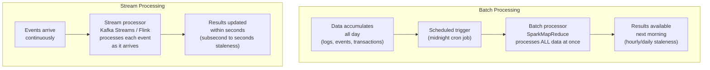
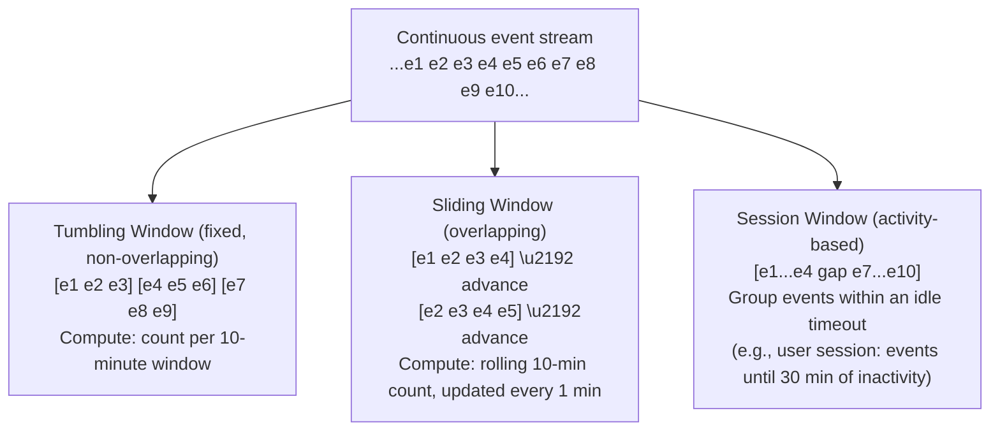
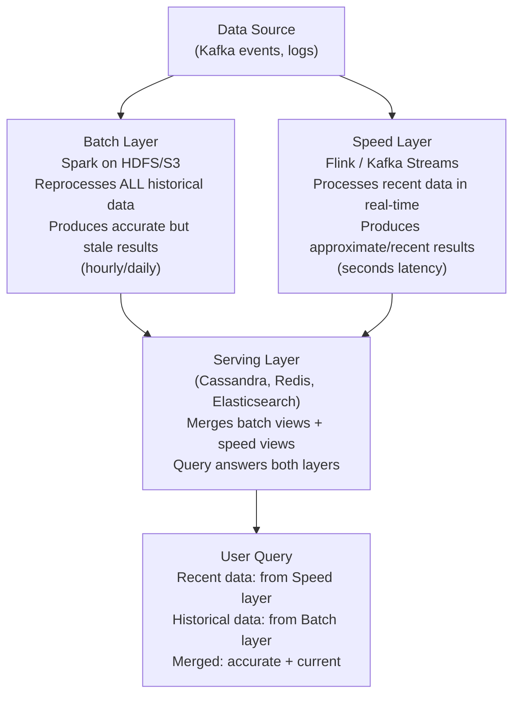
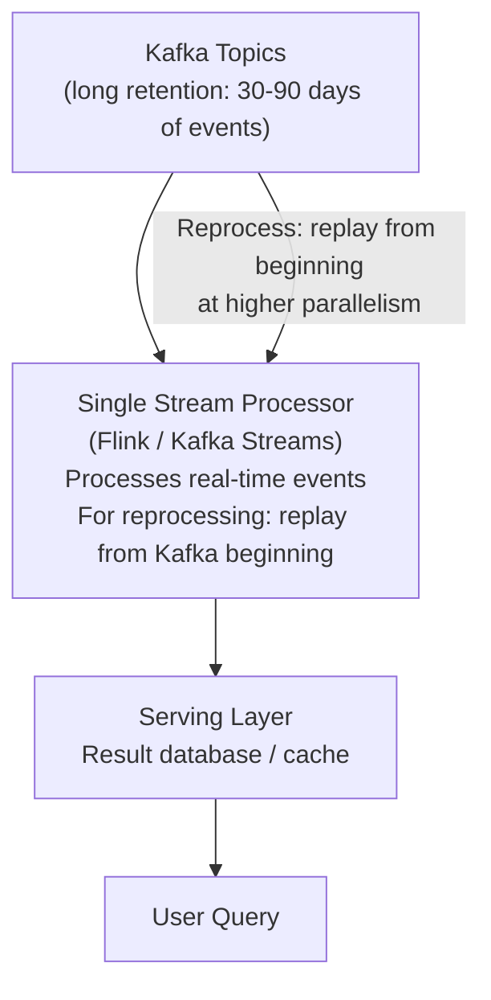

# Batch vs Stream Processing

Batch processing collects data over a period of time and processes it all at once — like a nightly ETL job that aggregates the day's transactions. Stream processing handles data continuously as it arrives — like a real-time fraud detection system that evaluates every transaction the moment it occurs. The choice between them determines how fresh your analytics are, how complex your infrastructure is, and what failure modes you must handle.

> **Why this matters in interviews:** Data processing architecture comes up in any system that handles analytics, recommendations, feeds, fraud detection, or reporting. Interviewers ask: "How would you design a real-time dashboard for monitoring user activity?" or "How would you build a recommendation engine?" The answer hinges on whether you can tolerate batch-interval staleness or need true real-time processing — and whether your system needs the Lambda or Kappa architecture to get both.

---

## The Fundamental Difference

---

## Batch Processing — Deep Dive

Batch systems process bounded datasets — a finite collection of records — typically on a schedule (hourly, daily, weekly).

**Characteristics:**
- High latency (hours to days between data collection and result)
- High throughput — can process petabytes by parallelizing across many machines
- Simpler failure model — can retry the entire job if it fails
- Full dataset available — can compute exact aggregations, sort, join arbitrarily

**Classic stack:**
- **Hadoop MapReduce:** Pioneered large-scale batch processing (2004). Map phase processes records in parallel; Reduce phase aggregates. Wrote intermediate results to HDFS disk — fault-tolerant but slow.
- **Apache Spark:** In-memory successor to MapReduce. Reads from HDFS/S3, processes in distributed RAM, writes results. 10-100× faster than MapReduce for iterative workloads (ML training, graph algorithms).
- **dbt (Data Build Tool):** SQL-based transformation framework for data warehouses — modern batch ETL.

**Batch use cases:**
- Nightly billing run — compute all charges for the month
- Daily ML model retraining — train on yesterday's data
- Weekly data warehouse ETL — transform and load from operational DB to OLAP warehouse
- Monthly financial reports — aggregate transactions for compliance

---

## Stream Processing — Deep Dive

Stream systems process unbounded datasets — a theoretically infinite sequence of events — as they arrive.

**Characteristics:**
- Low latency (subsecond to seconds)
- Requires windowing to compute aggregations over time
- Complex failure model — must handle late-arriving data, duplicate events, out-of-order events
- Results are approximate or windowed rather than over the full dataset

**Classic stack:**
- **Apache Kafka:** The message backbone for streaming — high-throughput, durable log. Kafka Streams is a library for stateful stream processing on top of Kafka topics.
- **Apache Flink:** Stateful, fault-tolerant stream processing with exactly-once semantics. Industry standard for serious stream processing.
- **Apache Spark Structured Streaming:** Micro-batch streaming built on Spark — processes tiny batches (100ms intervals) rather than truly event-by-event.
- **AWS Kinesis / Google Dataflow / Azure Stream Analytics:** Managed cloud streaming options.

**Stream use cases:**
- Fraud detection — evaluate every card transaction within 100ms
- Real-time dashboards — live user activity metrics
- Recommendation feed updates — re-rank recommendations when user likes a post
- IoT sensor alerting — alert within seconds of temperature threshold breach
- Ride-sharing matching — match driver to rider in real time

---

## Windowing in Stream Processing

Since you cannot wait for "all data" in an infinite stream, you compute aggregations over **windows**:

---

## Lambda Architecture — Both at Once

Lambda architecture runs batch and stream pipelines in parallel to get both accuracy and low latency:

**Lambda was pioneered by Nathan Marz (Storm creator) around 2012.** The batch layer is authoritative and accurate; the speed layer is approximate but current. Queries merge both.

**Lambda's problem:** Two codebases for the same logic — one for Spark (batch), one for Flink (stream). They diverge. Bugs in one are not in the other. Operational complexity is high.

---

## Kappa Architecture — Stream Only

Kappa (proposed by Jay Kreps, Kafka co-creator) simplifies Lambda by eliminating the batch layer entirely:

**Reprocessing in Kappa:** Instead of a separate batch pipeline, retain events in Kafka for 30-90 days. To recompute (e.g., after a bug fix or algorithm change), launch a new stream processing job, replay from the beginning of the Kafka topic, write to a new output table, and swap the serving layer to the new table when caught up. Then kill the old job.

**Kappa is simpler:** One codebase, one infrastructure paradigm. The tradeoff: Kafka must retain enough history, and reprocessing takes time (hours for months of history). Not suitable if you need instant reprocessing of years of data.

---

## Comparison

| Dimension | Batch | Stream |
|---|---|---|
| **Latency** | Hours to days | Seconds to milliseconds |
| **Throughput** | Very high (petabytes) | High (millions of events/sec) |
| **Complexity** | Lower — retry on failure, bounded dataset | Higher — late data, exactly-once, windowing |
| **Accuracy** | Exact — processes all data | Approximate — windowed, may miss late arrivals |
| **Cost** | Efficient — scheduled runs | Higher — always-on infrastructure |
| **Failure recovery** | Rerun the job | Checkpointing + replay from offset |
| **Use cases** | ETL, ML training, billing, reports | Fraud, monitoring, real-time feeds, IoT |

---

## Real-World Examples

| Company | Batch | Stream | Architecture |
|---|---|---|---|
| **LinkedIn** | Nightly job: "People you may know" computation | Real-time: feed ranking, notification triggers | Lambda |
| **Uber** | Nightly billing reconciliation, ML model training | Real-time: surge pricing, ETA computation, fraud detection | Both |
| **Netflix** | Daily recommendation model retraining | Real-time: play event tracking, A/B test metrics | Kappa (Flink + Kafka) |
| **Twitter** | Daily analytics aggregation | Real-time: trending topics (every 5 minutes) | Lambda |

---

## Interview Talking Points

**1. When would you choose batch processing over stream processing?**
> "I choose batch processing when: the use case tolerates latency (daily reports, nightly billing, monthly reconciliation), when I need exact aggregations over the full dataset (financial auditing — you cannot have approximate numbers), when the computation is complex and expensive (ML model training on the full history, graph algorithms), or when the engineering team is smaller and wants simpler infrastructure. A nightly billing job that charges customers needs to be exact and auditable — batch over the full day's transactions is the right call. Streaming for billing would require stateful windowing, late event handling, and exactl-once guarantees that add significant complexity. I also choose batch as a starting point — many systems start batch and only add streaming when the latency requirement tightens. The operational cost of always-on stream infrastructure is real."

**2. Explain the Lambda architecture and why the Kappa architecture emerged as an alternative.**
> "Lambda architecture runs batch and streaming pipelines in parallel. The batch layer (Spark) processes all historical data on a schedule and produces authoritative results. The speed layer (Flink or Kafka Streams) processes recent events in real time and produces approximate or partial results. Queries to the serving layer merge both. The motivation: get both accuracy (from batch) and low latency (from stream). The problem Lambda solved was elegant, but the implementation is painful: you maintain two completely separate codebases implementing the same business logic — one for Spark, one for Flink. They inevitably diverge. A bug fix in the batch layer needs a separate fix in the stream layer. The Kappa architecture, proposed by Jay Kreps, eliminates the batch layer entirely. Everything is a stream. Historical reprocessing is handled by replaying Kafka topic history through the stream processor. One codebase, one paradigm, one infrastructure stack. The tradeoff: Kafka must retain history (expensive for very long retention), and reprocessing takes time for large histories. For most modern systems, Kappa is simpler and preferable."

**3. How does a stream processing system handle late-arriving events?**
> "Late events are a fundamental challenge in stream processing. Events can arrive out of order due to network delays, mobile clients that were offline, or processing backlogs. The challenge: if you close a 10-minute window and then an event arrives 3 minutes late that belongs to that window, what do you do? Three strategies: First, watermarks — Flink and other engines maintain a watermark (the estimated current time in the stream) and allow a configurable late-event grace period. Events arriving before the watermark are processed normally; events arriving after the watermark but within the grace period trigger a window update; events beyond the grace period are dropped or sent to a side output for separate handling. Second, accumulating windows — keep windows open longer and emit updates as late events arrive, accepting multiple outputs per window. Third, reprocessing — for exact reconciliation, batch-reprocess the relevant time range from the raw event log after a grace period. Which approach depends on the use case: fraud detection (low grace period — real-time decisions are what matter), analytics dashboards (longer grace period — accuracy preferred), billing (batch reconciliation — must be exact)."

**4. How would you design a real-time fraud detection system?**
> "Fraud detection is a textbook stream processing problem. The architecture: card transaction events flow into Kafka the moment they occur. A Flink stream processing job consumes from Kafka with a target latency under 100ms. The Flink job evaluates each transaction against fraud rules: Has this card had 5+ transactions in the last 60 seconds (velocity check)? Is this transaction from a country different from the last 3 transactions in 10 minutes (geo-velocity)? Is the amount 10\u00d7 larger than this card's average? These windowed aggregations are maintained in Flink's state store. For ML-based scoring, the Flink job calls a feature store (low-latency Redis-backed) to retrieve precomputed features and invokes an ML model scoring service. The result (approve/deny/flag) is written back to Kafka, which triggers the payment authorization response. Separately, a batch job runs nightly to retrain the ML model on the full history of labeled fraud cases. This is Lambda: stream for the real-time decision, batch for model training."

---

## Key Takeaways

- **Batch processing** is simple, accurate, and high-throughput — ideal for scheduled ETL, billing, ML training, reports; accepts hours/days of latency
- **Stream processing** is complex but enables real-time decisions — ideal for fraud detection, live dashboards, IoT alerting; delivers seconds/milliseconds latency
- **Windowing** is fundamental to stream aggregation: tumbling (non-overlapping), sliding (overlapping), session (activity-based)
- **Lambda architecture** runs both batch and stream in parallel — authoritative batch + real-time stream merged at query time; costly to maintain two codebases
- **Kappa architecture** eliminates batch by replaying Kafka history through the stream processor — simpler but requires long Kafka retention and reprocessing time
- **Late events** require watermarks, grace periods, and side output handling — not optional in real-world streaming
- **Exactly-once semantics** in Flink uses distributed snapshots (checkpointing) — enables fault-tolerant stream processing without data loss or duplication
