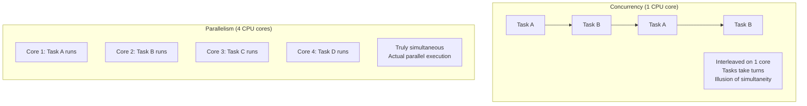
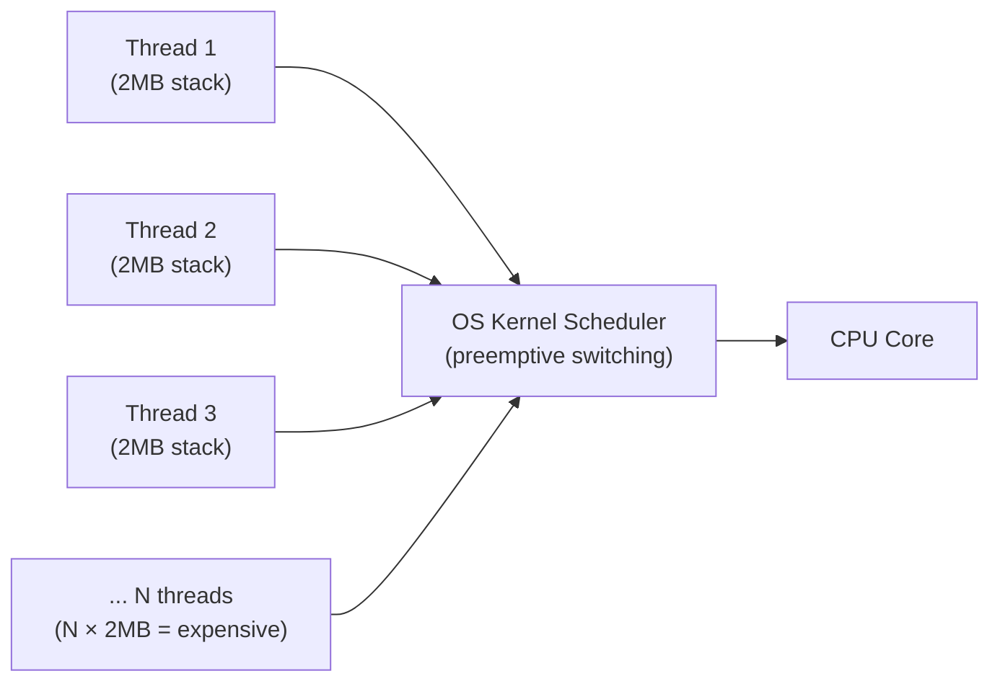
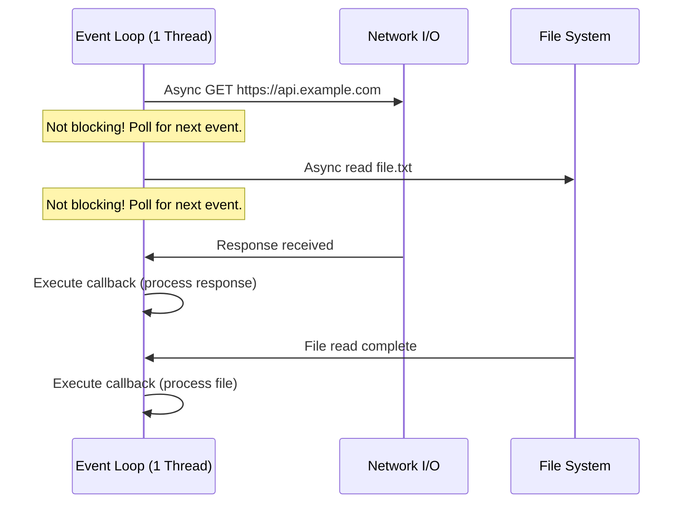
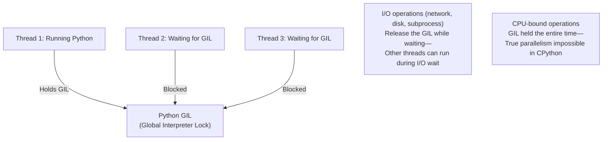

# Concurrency vs Parallelism

Concurrency and parallelism are both about doing multiple things, but they describe fundamentally different concepts. Concurrency is about **dealing** with multiple tasks — the structure of a program that handles multiple things at once, potentially through interleaving on a single CPU core. Parallelism is about **doing** multiple things simultaneously — actual simultaneous execution on multiple CPU cores or machines. Rob Pike (Go co-creator) put it best: "Concurrency is about dealing with lots of things at once. Parallelism is about doing lots of things at once."

> **Why this matters in interviews:** Concurrency and parallelism are foundational to understanding why Node.js can handle 100,000 simultaneous connections on one thread, how Python's GIL limits true parallelism, why goroutines are cheap, and how to correctly use mutexes and semaphores to prevent race conditions. Interviewers ask these questions for backend engineering roles and system design that involves high-concurrency services.

---

## Concurrency vs Parallelism — Visualized



**Concurrency without parallelism:** A single-threaded Node.js server handling 10,000 HTTP connections — the event loop rapidly switches between handling I/O events from each connection. It is concurrent (deals with 10,000 connections) but not parallel (executes one thing at a time on one thread).

**Parallelism without concurrency:** A batch job that splits a 1-billion-row dataset into 16 partitions and processes each on a separate CPU core simultaneously. Each core does one thing; 16 things happen at once.

**Both:** A multi-threaded application with 8 threads running on 8 CPU cores, where each thread handles multiple async I/O operations via callbacks.

---

## Concurrency Models

### 1. OS Threads (Traditional)

Each concurrent task is an OS thread. The OS scheduler preemptively switches between threads:



**Pros:** Simple mental model, true parallelism on multi-core.  
**Cons:** Expensive — each OS thread has 1-8MB stack; context switching overhead (save/restore registers, TLB flush); 10,000 threads = 10-80GB RAM just for stacks.

**Used by:** Java (traditional thread-per-request), Apache (worker MPM), C/C++ servers.

### 2. Event Loop / Async I/O (Node.js, Python asyncio)

A single thread handles many concurrent operations by using non-blocking I/O. While waiting for I/O (network, disk), the event loop picks up the next ready task:



**Pros:** Handles massive concurrency (100,000+ connections) on a single thread with very low memory overhead. No context switching overhead.  
**Cons:** CPU-bound tasks block the event loop and starve all other connections. Not parallel — can only use one CPU core without a cluster/worker thread approach.

**Used by:** Node.js, Python asyncio, Nginx (event-driven worker model).

### 3. Goroutines (Go)

Go's goroutines are user-space threads scheduled by the Go runtime — much cheaper than OS threads:

```go
// Start 10,000 goroutines — each has a 2KB initial stack (not 2MB)
for i := 0; i < 10000; i++ {
    go func(id int) {
        // Each goroutine handles one request
        result, err := http.Get("https://api.example.com/data")
        processResult(result)
    }(i)
}
```

**Goroutine vs OS thread:**

| Property | OS Thread | Goroutine |
|---|---|---|
| **Stack size** | 1-8 MB | 2 KB (grows dynamically) |
| **Creation time** | ~1 µs | ~0.3 µs |
| **Context switch** | ~1-10 µs | ~0.2 µs |
| **Practical limit** | ~10,000 | ~1,000,000+ |
| **Scheduler** | OS kernel | Go runtime (M:N scheduling) |

Go's runtime multiplexes M goroutines onto N OS threads (M:N scheduling). When a goroutine blocks on I/O, the runtime moves another goroutine onto that OS thread — no OS context switch required.

---

## The Python GIL — Concurrency Without Parallelism

CPython (the reference Python implementation) has a Global Interpreter Lock (GIL): only one thread can execute Python bytecode at a time, even on a multi-core machine:



**Implications:**
- Python threads are fine for I/O-bound concurrency (network requests, file I/O) — the GIL is released during I/O waits, allowing other threads to run
- Python threads cannot achieve true CPU parallelism — `multiprocessing` module spawns separate processes (each with its own GIL) for CPU-bound parallelism
- `asyncio` sidesteps the GIL issue by using a single thread with cooperative concurrency

```python
import asyncio
import aiohttp

# Concurrent I/O with asyncio (no GIL problem for I/O)
async def fetch(session, url):
    async with session.get(url) as response:
        return await response.json()

async def main():
    async with aiohttp.ClientSession() as session:
        tasks = [fetch(session, f"https://api.example.com/item/{i}") for i in range(100)]
        results = await asyncio.gather(*tasks)  # 100 concurrent requests, 1 thread
```

---

## Race Conditions and Synchronization Primitives

Concurrency introduces shared state problems when multiple concurrent tasks access the same data:

```python
# Race condition: two threads increment a counter
counter = 0

def increment():
    global counter
    # This is NOT atomic! Three separate operations:
    # 1. Read counter (counter = 5)
    # 2. Add 1 (result = 6)
    # 3. Write back (counter = 6)
    # If two threads run simultaneously, both might read 5 and write 6
    # Result: counter = 6 instead of 7 (lost update!)
    counter = counter + 1
```

### Mutex (Mutual Exclusion Lock)

```python
import threading

counter = 0
lock = threading.Lock()

def safe_increment():
    global counter
    with lock:          # Acquire lock — only one thread enters at a time
        counter += 1    # Safe: exclusive access guaranteed
    # Lock released automatically when exiting with block
```

### Semaphore — Limiting Concurrency

A semaphore allows N concurrent accessors (not just 1 like a mutex):

```python
import asyncio

# Allow at most 10 concurrent database connections
db_semaphore = asyncio.Semaphore(10)

async def query_with_rate_limit(sql):
    async with db_semaphore:  # Blocks if 10 others are already running
        return await db.execute(sql)

# Even if 1000 coroutines call this, at most 10 run simultaneously
```

### Common Concurrency Bugs

| Bug | Description | Prevention |
|---|---|---|
| **Race condition** | Concurrent access to shared mutable state produces inconsistent results | Use locks, atomic operations, or immutable data |
| **Deadlock** | Two threads each hold a lock the other needs, waiting forever | Always acquire locks in the same order; use lock timeouts |
| **Livelock** | Threads keep responding to each other but no progress is made | Randomize retry timing; prioritize one party |
| **Starvation** | A thread never gets CPU time because others always preempt | Fair scheduling, priority queues |
| **Priority inversion** | Low-priority thread holds lock needed by high-priority thread | Priority inheritance protocols |

---

## Amdahl's Law — Limits of Parallelism

Amdahl's Law quantifies the maximum speedup from parallelizing a computation:

$$S(n) = \frac{1}{(1-p) + \frac{p}{n}}$$

- $S(n)$ = speedup with $n$ processors
- $p$ = fraction of the program that can be parallelized
- $(1-p)$ = fraction that must remain sequential

**Example:** If 80% of a program can be parallelized ($p = 0.8$) and you have 4 processors ($n = 4$):
$$S(4) = \frac{1}{0.2 + 0.2} = 2.5\times$$

With infinite processors: $S(\infty) = \frac{1}{1-0.8} = 5\times$

**The implication:** If 20% of your code is inherently sequential (database writes, final aggregation), no amount of parallelism can make the overall program more than 5× faster than single-threaded. Optimizing the sequential bottleneck often provides more value than adding more parallel workers.

---

## Interview Talking Points

**1. What is the difference between concurrency and parallelism?**
> "Concurrency is about the structure of a program — how it handles multiple tasks that may overlap in time. Parallelism is about execution — multiple tasks literally running simultaneously on different CPU cores. A single-threaded Node.js server is concurrent: the event loop handles thousands of connections by interleaving their I/O events on one thread, but only executes one thing at a time. A multi-core Go server running goroutines is both concurrent and parallel: goroutines overlap in structure, and the Go runtime schedules them across multiple OS threads running on multiple CPU cores simultaneously. The key test: concurrency can be implemented on a single CPU core (via context switching or cooperative async); parallelism requires multiple CPU cores or multiple machines."

**2. How does Node.js handle 100,000 concurrent connections on a single thread?**
> "Node.js uses an event-loop model with non-blocking I/O. When a request comes in and needs to make a database call, Node.js initiates the async I/O call and immediately returns to the event loop to handle other events — it does not block the thread waiting for the database response. The OS handles the I/O asynchronously and notifies the Node.js process via the event loop when the data is ready. Node.js then executes the callback. This means 100,000 connections can be 'in flight' simultaneously from the event loop's perspective — each waiting for its I/O to complete. The single thread is never idle because there is always another I/O completion event to handle. The limitation: any CPU-bound operation (cryptography, image processing, complex computation) blocks the entire event loop and starves all 100,000 connections. For CPU-bound work in Node.js, you use worker threads (separate thread pool) or child processes."

**3. What is the Python GIL and how does it affect concurrent Python programs?**
> "The GIL — Global Interpreter Lock — is a mutex in CPython that ensures only one thread executes Python bytecode at a time. It was introduced to simplify CPython's memory management (reference counting is not thread-safe without it). The practical effect: Python threads cannot achieve true CPU parallelism. On an 8-core machine, a Python program using 8 threads still uses at most one CPU core for Python execution at any time. The GIL is released during I/O operations (network calls, file I/O, subprocess calls), so for I/O-bound concurrent work, Python threads are effective. For CPU-bound parallelism, you must use the `multiprocessing` module, which spawns separate processes each with their own GIL and Python interpreter. `asyncio` is the modern preferred approach for I/O-bound concurrency — single-threaded cooperative concurrency that avoids the GIL problem entirely while handling thousands of concurrent I/O operations."

**4. What is a deadlock and how do you prevent it?**
> "A deadlock occurs when two or more threads are blocked forever, each waiting for a resource held by another. Classic example: Thread A holds Lock 1 and waits for Lock 2. Thread B holds Lock 2 and waits for Lock 1. Neither can proceed. Prevention strategies: First, lock ordering — always acquire multiple locks in a globally consistent order (e.g., always acquire Lock 1 before Lock 2). If all threads follow this order, the circular dependency that causes deadlock cannot form. Second, lock timeouts — use `tryLock(timeout)` instead of blocking `lock()`. If the timeout expires without acquiring the lock, release any held locks, wait a random backoff period, and retry. Third, avoid holding locks across I/O operations — holding a lock while making a network call means the lock is held for potentially seconds, significantly increasing the chance of contention and deadlock. Fourth, prefer lock-free data structures and atomic operations for simple cases — many concurrency bugs disappear when you eliminate locks by using immutable data and atomic compare-and-swap operations."

---

## Key Takeaways

- **Concurrency** = dealing with multiple tasks (structure); **Parallelism** = doing multiple tasks simultaneously (execution) — concurrency enables parallelism but is not the same thing
- **Event loop** (Node.js, Python asyncio) = high concurrency on 1 thread via non-blocking I/O; no parallelism but very scalable for I/O-bound work
- **OS threads** = true parallelism on multi-core; expensive (1-8MB stack each), limited to ~10,000 threads
- **Goroutines** = cheap user-space threads (2KB stack, M:N scheduling); enables 1,000,000+ concurrent goroutines with parallelism
- **Python GIL** = only one thread runs Python bytecode at a time; I/O-bound threads fine, CPU-bound needs `multiprocessing`
- **Race conditions** = concurrent access to shared mutable state without synchronization; prevented by mutexes, atomic operations, or immutable data
- **Deadlock prevention:** consistent lock ordering, lock timeouts, avoid holding locks across I/O
- **Amdahl's Law:** the sequential fraction of a program limits the maximum speedup from parallelism — optimize the bottleneck, not just add more cores
