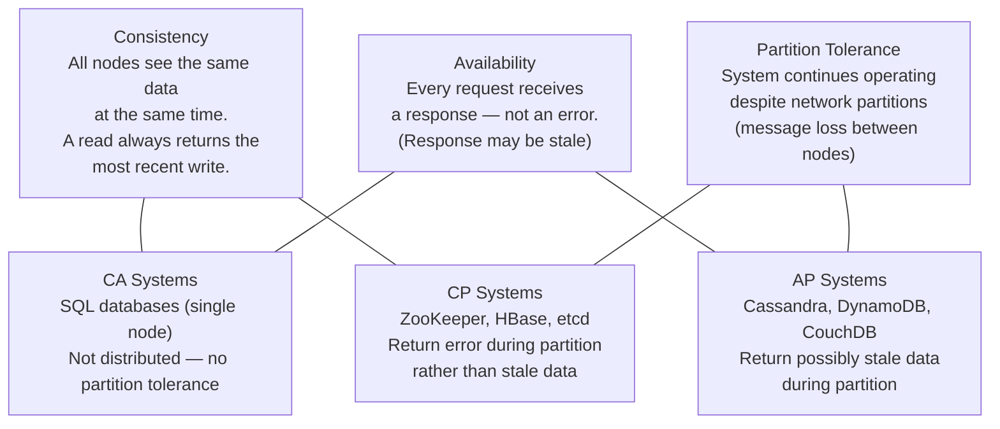
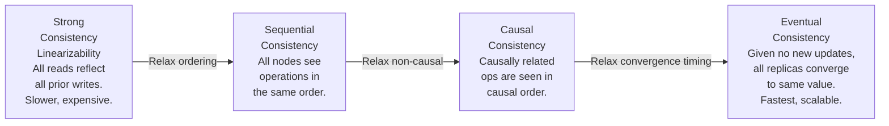
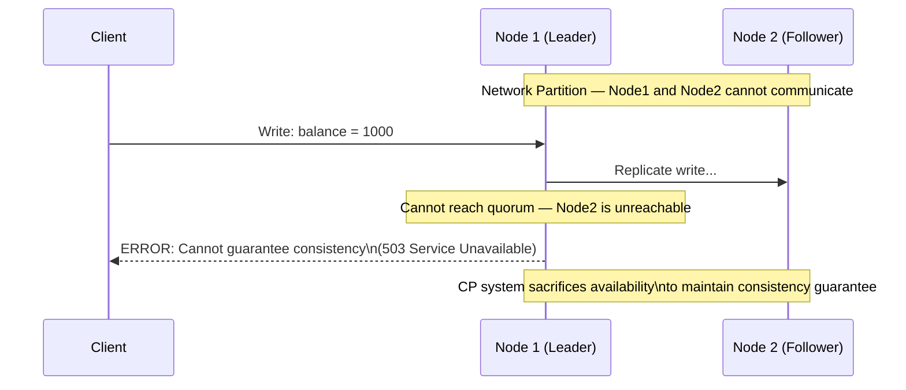
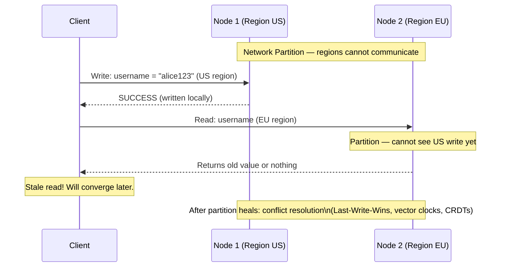
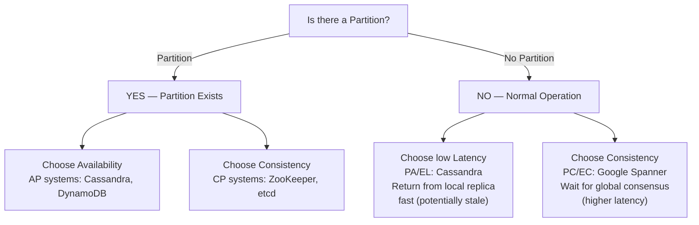

# Consistency vs Availability

Consistency and availability are two of the most fundamental tensions in distributed systems design. When a network partition occurs — when nodes in a distributed system cannot communicate with each other — you must choose: do you return potentially stale data and stay available, or do you reject the request and stay consistent? This tradeoff, formalized by Eric Brewer's CAP theorem, governs every architectural decision involving distributed databases, caches, and multi-region deployments.

> **Why this matters in interviews:** The CAP theorem is perhaps the most commonly referenced concept in system design interviews. Understanding it deeply — including its nuances, the PACELC extension, and the spectrum of consistency models — separates strong candidates from weak ones. Interviewers ask which databases you would choose for a banking system vs a social feed and why, which directly maps to this tradeoff.

---

## The CAP Theorem

Brewer's CAP theorem states that a distributed system can guarantee at most **two of three** properties simultaneously:



**The key insight: Partition tolerance is not optional.** In any distributed system (multiple nodes, multiple data centers), network partitions will happen — cables fail, switches crash, GCP/AWS regions lose connectivity. You cannot design around partitions; you must decide how to handle them. So the real choice is always **CP vs AP** during a partition.

---

## Consistency Models — A Spectrum

"Consistent" is not binary. There is a spectrum from strongest to weakest:



| Model | Guarantee | Example Systems | Latency |
|---|---|---|---|
| **Linearizable** | Every op appears instantaneous; reads always see latest write | etcd, ZooKeeper, Google Spanner | Highest |
| **Sequential** | All nodes see ops in same order, but not necessarily wall-clock ordered | Some distributed locks | High |
| **Causal** | Causally related operations are ordered | MongoDB (causal sessions), some CRDTs | Medium |
| **Read-your-writes** | After a write, the same client always reads that value | DynamoDB (strongly consistent reads) | Medium |
| **Eventual** | No ordering guarantee — replicas converge eventually | Cassandra, DynamoDB (default), DNS | Lowest |

---

## CP Systems — Consistency Over Availability

CP systems reject requests (return errors or wait) during network partitions rather than return stale data:



**Real CP systems:**
- **ZooKeeper / etcd:** Distributed coordination services. Use Raft consensus — a write only succeeds when a quorum of nodes acknowledges it. During a partition, the minority partition rejects writes.
- **HBase:** Uses ZooKeeper for coordination — inherits CP properties
- **Google Spanner:** Achieves linearizability globally using TrueTime (synchronized atomic clocks)
- **Traditional RDBMS (single node or with synchronous replication):** Master rejects writes if synchronous replica is unreachable

**When to choose CP:** Financial transactions, inventory management, distributed locks, leader election, any system where stale data causes real-world harm (double-spending, overselling).

---

## AP Systems — Availability Over Consistency

AP systems continue accepting reads and writes during partitions, potentially returning stale data:



**Real AP systems:**
- **Cassandra:** Tunable consistency — you choose the consistency level (ONE, QUORUM, ALL) per operation. Default is AP.
- **DynamoDB:** Eventually consistent reads by default; optional strongly consistent reads (at 2× the read capacity cost)
- **CouchDB / Couchbase:** Optimistic replication, conflict detection via revision vectors
- **DNS:** Classic AP system — TTL-based caching means stale data is the norm

**When to choose AP:** Social media feeds, product catalog browsing, session data, shopping cart (with conflict resolution), DNS — anywhere that stale data is tolerable and downtime is not.

---

## PACELC — The Complete Model

CAP only addresses behavior during partitions. Eric Abadi's **PACELC** model extends it to normal operation:

> **PAC:** If Partition (P) → choose between Availability (A) or Consistency (C)  
> **ELC:** Else (no partition, normal operation) → choose between Latency (L) or Consistency (C)



| System | PAC | ELC | Behavior |
|---|---|---|---|
| **Cassandra** | AP | EL | Max availability + low latency; trades consistency |
| **ZooKeeper** | CP | EC | Strong consistency always; higher latency |
| **DynamoDB (default)** | AP | EL | Eventually consistent; fast reads |
| **DynamoDB (strong read)** | AP | EC | Consistent reads; double the cost |
| **Google Spanner** | CP | EC | Global strong consistency; accepts higher latency |
| **MySQL (async replication)** | PA | EL | Available with stale replica reads |
| **MySQL (sync replication)** | PC | EC | Consistent; blocks on replica failure |

---

## Tunable Consistency: Cassandra's Model

Cassandra makes consistency/availability a per-request choice through configurable **read and write consistency levels**:

```
Consistency Levels (N=3 total replicas):
  ONE:    Response from 1 replica (fastest, least consistent)
  QUORUM: Response from ⌈N/2⌉+1 = 2 replicas (balanced)
  ALL:    Response from all 3 replicas (most consistent, slowest)

For strong consistency: Write(QUORUM) + Read(QUORUM) guarantees
 write replicas + read replicas > total replicas
```

This means you can run Cassandra as effectively CP for critical operations (QUORUM reads and writes) while defaulting to AP for bulk analytics queries (ONE read level).

---

## Conflict Resolution Strategies

AP systems that allow divergent writes must resolve conflicts when partitions heal:

| Strategy | How It Works | Tradeoff |
|---|---|---|
| **Last-Write-Wins (LWW)** | Highest timestamp wins | Simple; loses concurrent writes |
| **Vector Clocks** | Track causal order of writes; detect true conflicts | Complex; can still have conflicts to resolve |
| **CRDTs** | Data structures that merge automatically (counters, sets) | No conflicts by design; limited data types |
| **Application-level merge** | App defines custom merge logic | Flexible; requires domain knowledge |
| **Multi-version** | Keep all versions; let user/app choose | User frustration; complex |

**Real example:** Amazon's Dynamo paper (2007) describes using vector clocks with application-level conflict resolution for shopping cart merges — if a user adds items from two devices simultaneously during a partition, both item lists are merged rather than one being discarded.

---

## Interview Talking Points

**1. Explain the CAP theorem and its practical implications.**
> "CAP theorem says a distributed system can have at most two of: Consistency (all nodes return the latest data), Availability (every request gets a response), and Partition Tolerance (system works despite network splits). The key practical insight is that network partitions are a fact of life in distributed systems — cables fail, datacenters lose connectivity. So you always need partition tolerance, and the real choice is CP vs AP during a partition. CP systems like ZooKeeper and etcd reject requests rather than return stale data — they wait for quorum. AP systems like Cassandra and DynamoDB stay available and return potentially stale data, reconciling divergent replicas after the partition heals. The right choice depends on the domain: financial transactions demand CP (stale data causes overdrafts, double-spending), while social feeds are fine with AP (seeing a post 2 seconds late is acceptable)."

**2. What is eventual consistency and when is it appropriate?**
> "Eventual consistency means that if no new updates are made, all replicas will converge to the same value — eventually. The system makes no promises about how long convergence takes or whether reads in the interim will be consistent. It is appropriate when the business consequence of temporarily stale data is low. Social media feeds, product catalogs, DNS, analytics dashboards, recommendation systems — all are excellent eventual consistency use cases. The performance benefits are significant: eventual consistency allows local reads without cross-region coordination, enabling sub-millisecond latency at global scale. What it is not appropriate for: anything with financial atomicity requirements, inventory that must not be oversold, or any system where seeing old data causes correctness violations (not just UX inconvenience)."

**3. How would you design a system that requires both high availability and strong consistency?**
> "The honest answer is that true global strong consistency with high availability is very expensive. Google Spanner achieves it by combining atomic clocks (TrueTime API) with Paxos consensus — allowing them to bound clock skew and reason about global ordering without inter-datacenter round trips for every transaction. For most teams, the practical approach is to architect the system so strong consistency is only required where it matters. A typical e-commerce site: the product catalog and reviews can be AP with eventual consistency. The inventory count that gates purchases needs CP guarantees. The payment transaction needs ACID with synchronous replication. The shopping cart can be AP with CRDT-style conflict resolution (merge concurrent additions). Zone your data by consistency requirement, and use different storage systems for different zones."

**4. What is the PACELC model and how does it extend CAP?**
> "CAP only analyzes behavior during partitions, but partitions are rare in well-engineered systems — maybe 0.01% of the time. PACELC asks what the system chooses the other 99.99% of the time: does it optimize for Latency or Consistency during normal operation? This is often more practically relevant. DynamoDB optimized for latency: reads return from the nearest replica immediately. Spanner optimizes for consistency: every read waits for a globally synchronized timestamp. Both are available (AP) during normal operation, but with very different latency profiles. PACELC helps you reason about everyday system behavior, not just fault behavior. When I'm choosing a database, I think: during a partition, can I afford to be unavailable? During normal operation, can I afford the latency of cross-datacenter coordination? The answers lead me to the right choice."

---

## Key Takeaways

- **CAP Theorem:** A distributed system can guarantee at most 2 of 3: Consistency, Availability, Partition Tolerance — but partitions always happen, so the real choice is **CP vs AP**
- **CP systems** (ZooKeeper, etcd, Spanner) reject requests during partitions — chosen for financial, coordination, and inventory systems
- **AP systems** (Cassandra, DynamoDB, CouchDB) return stale data during partitions — chosen for social, analytics, catalog, and session systems
- **Consistency is a spectrum:** linearizable → sequential → causal → read-your-writes → eventual — choose the weakest that your business requirements allow
- **PACELC extends CAP:** during normal operation, the tradeoff is Latency vs Consistency — equally important as partition behavior
- **Tunable consistency** (Cassandra's QUORUM) lets you make CP/AP decisions per operation
- **Conflict resolution strategies** (LWW, vector clocks, CRDTs) are required for AP systems to handle divergent writes
