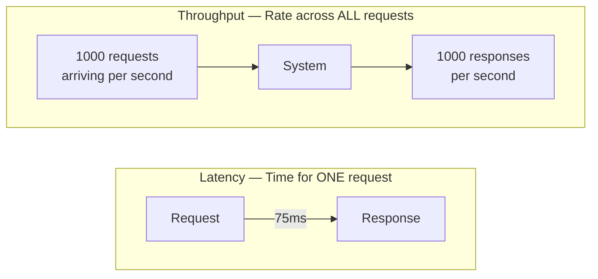
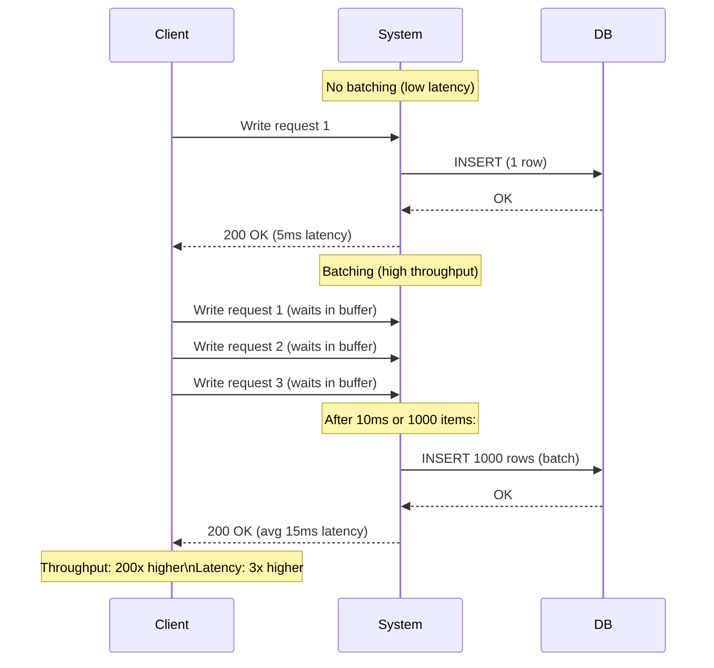

# Latency vs Throughput

Latency and throughput are the two primary dimensions of performance in any system — and optimizing for one often degrades the other. Latency is the time it takes for a single operation to complete: from the moment a request is sent to when the response arrives. Throughput is the rate at which a system processes work: requests per second, messages per second, or bytes per second. Understanding their relationship, and deliberately choosing which to optimize for, is one of the most important decisions in system architecture.

> **Why this matters in interviews:** Performance requirements drive virtually every architecture decision. When an interviewer asks "how would you design a real-time bidding system?" vs "how would you design a batch ETL pipeline?", they are asking about different points on the latency-throughput spectrum. Senior engineers are expected to articulate these tradeoffs explicitly and justify their choices with concrete numbers.

---

## Definitions and Intuition



**Latency** is measured in time units: milliseconds, microseconds. It is experienced by each individual user. A low-latency API returns in 10ms; a high-latency one returns in 2 seconds.

**Throughput** is measured in operations per unit time: req/s, MB/s, messages/s. It is a property of the system as a whole. A high-throughput message queue processes 1 million messages per second even if each individual message takes 10ms to process.

---

## The Fundamental Tension: Little's Law

**Little's Law** (from queuing theory) defines the relationship precisely:

$$L = \lambda \times W$$

- $L$ = average number of items in the system (queue + being processed)
- $\lambda$ = throughput (arrival/departure rate)
- $W$ = average latency (time each item spends in the system)

**Rearranging:** $W = L / \lambda$

If you want to increase throughput ($\lambda$) without increasing latency ($W$), you must reduce the number of items in the system ($L$) — meaning less work in progress, smaller queues, and more parallelism. This is why batching increases throughput but increases latency: you hold items in a queue ($L$ grows) until a batch is full, improving throughput $\lambda$ but increasing wait time $W$.

---

## Why Optimizing One Often Hurts the Other

### Batching: Throughput ↑, Latency ↑



### Parallelism: Throughput ↑, Latency May Improve

More parallel workers increase throughput. If work can be parallelized, it also reduces individual request latency. But coordination overhead (synchronization, load balancing overhead) reduces the gains and adds latency floor.

### Buffering / Queuing: Throughput ↑, Latency ↑

Buffering smooths out demand spikes and allows the system to process at its natural throughput. But each item waits in the queue — adding latency. This is the fundamental design of message queues like Kafka.

---

## Latency-Sensitive Systems

Systems where individual response time directly impacts user experience or correctness:

| System | Target Latency | Why |
|---|---|---|
| **Real-time bidding (RTB)** | < 10ms | Ad auctions have hard deadlines |
| **High-frequency trading** | Microseconds | Latency = profit margin |
| **Search autocomplete** | < 100ms | User expects instant suggestions |
| **API gateway** | < 50ms | Adds to every downstream request |
| **Gaming (multiplayer)** | < 20ms | Imperceptible input lag threshold |

**Techniques to reduce latency:**
- Co-locate compute and data (avoid network hops)
- In-memory storage (Redis) over disk I/O
- Connection pooling (eliminate TCP handshake per request)
- Edge/CDN caching (serve from nearby PoP)
- Async I/O (don't block threads on network waits)
- Avoid N+1 queries (parallel I/O, DataLoader patterns)
- Hedged requests (send duplicate to two replicas, take first response)

---

## Throughput-Sensitive Systems

Systems where processing volume is the primary goal and individual item latency is secondary:

| System | Target Throughput | Why |
|---|---|---|
| **Log ingestion** | 10M events/sec | Volume of application telemetry |
| **Kafka consumer** | 1M messages/sec | Event streaming backbone |
| **ETL pipeline** | TB/hour | Nightly data warehouse load |
| **Video transcoding** | 1000 videos/hour | Batch media processing |
| **ML training** | Max GPU utilization | Training time matters, not per-sample latency |

**Techniques to increase throughput:**
- Batching writes and reads
- Async/non-blocking processing (don't waste CPU waiting)
- Horizontal scaling (more workers)
- Efficient serialization (Protobuf instead of JSON)
- Compression (reduce I/O bandwidth)
- Connection multiplexing (HTTP/2, gRPC streaming)

---

## Latency Numbers Every Engineer Should Know

| Operation | Approximate Latency |
|---|---|
| L1 cache reference | 1 ns |
| L2 cache reference | 5 ns |
| Main memory (RAM) read | 100 ns |
| SSD random read | 100 µs |
| HDD seek + read | 10 ms |
| Same-datacenter network round trip | 0.5 ms |
| Cross-region (US East ↔ US West) | 40-60 ms |
| Cross-continent (US ↔ Europe) | 80-120 ms |
| Redis GET (same datacenter) | 0.5-1 ms |
| PostgreSQL query (indexed, in memory) | 1-5 ms |
| PostgreSQL query (disk I/O) | 10-100 ms |

These numbers reveal architectural implications: a function that calls the database 10 times sequentially adds 10-100ms per call × 10 = 100ms-1s latency floor. This is why N+1 query elimination and caching matter so much.

---

## Measuring: Percentiles Matter More Than Averages

```
Request latencies for 1,000 requests:
  P50 (median):   12ms   — half of users see this or better
  P75:            25ms
  P95:            145ms  — 1 in 20 requests
  P99:            892ms  — 1 in 100 requests
  P99.9:          4,200ms — 1 in 1000 requests ("the tail")
  Average:        28ms   — average is MISLEADING here
```

The average (28ms) looks fine, but 1% of users experience 892ms latency. At 1000 requests/second, that's 10 users per second with near-1-second responses. Optimizing for average latency while ignoring tail latency results in systems that feel slow to a significant fraction of users.

**SLA targets should always be percentile-based:** `P99 < 200ms`, not `average < 50ms`.

---

## Interview Talking Points

**1. Explain the tradeoff between latency and throughput with a concrete example.**
> "Consider a database write API. If we write each request individually to PostgreSQL, each write takes 5ms — low latency. If we buffer writes and flush in batches of 1,000 every 50ms, throughput increases 100× because we amortize the I/O overhead across many writes. But latency increases: items wait up to 50ms in the buffer before being written. The choice depends on the use case: a payment confirmation API needs low latency (the user is waiting for the response). A click event tracking API can tolerate 50ms batch delay because nobody is waiting synchronously for click events to be persisted. Little's Law formalizes this: $L = \lambda \times W$. To increase throughput without increasing latency, you must reduce concurrent work in progress — which means more parallelism rather than batching."

**2. Why do percentiles matter more than average latency?**
> "Averages hide the distribution. A system with P50=5ms and P99=2,000ms has an average of maybe 25ms — looks fast. But 1% of users experience 2-second responses. At 10,000 requests/second, that's 100 users every second with 2-second waits. The average masks this completely. Tail latency (P99, P99.9) is particularly important because of the fan-out effect in microservices: if a user request touches 10 services in parallel, the total latency is the maximum of those 10. If each service has P99=200ms, the combined P99 is much worse than 200ms. At Netflix, if their recommendation service has P99.9=1s, that affects 1 in 1000 users — still millions of users per day at Netflix's scale. I always define SLAs as percentile-based: P95 < 100ms, P99 < 500ms."

**3. How would you design a system for maximum throughput vs minimum latency?**
> "For maximum throughput: I'd use asynchronous processing — accept the request immediately, enqueue it, and process in large batches. Batching amortizes I/O overhead: 1,000 database inserts in a batch costs 10× less than 1,000 individual inserts. I'd use horizontal scaling with efficient parallelism — many workers consuming from a queue. I'd minimize serialization overhead (Protobuf over JSON). I'd use compression to reduce network bandwidth. The tradeoff: individual items wait in queue, so latency increases. For minimum latency: I'd eliminate every queue and buffer — synchronous processing, direct database writes. I'd use in-memory data stores (Redis) instead of disk-based. I'd co-locate compute with data to minimize network hops. I'd use connection pools to eliminate TCP setup. I'd parallelize independent I/O operations. The tradeoff: throughput is limited by what a single request path can handle."

**4. What is tail latency and how do hedged requests address it?**
> "Tail latency refers to the high-percentile latencies — P99, P99.9 — that affect a small fraction of requests. They are caused by garbage collection pauses, disk I/O spikes, CPU scheduling jitter, or occasionally slow network paths. Hedged requests, described in Google's Spanner and Bigtable papers, address tail latency by sending the same request to two replicas after a brief initial delay (say, 5ms). Whichever replica responds first wins; the slower response is ignored. If 1% of requests are slow (GC pause on one replica), hedging reduces P99 dramatically because both replicas being slow simultaneously is much rarer (0.01% = 1% × 1%). The cost is slightly increased load (approximately 1-5% more requests to replicas), which is usually acceptable. Google uses this extensively — their internal systems send a speculative secondary request to another replica when the first doesn't respond within the P95 threshold."

---

## Key Takeaways

- **Latency** = time for one operation; **throughput** = operations per unit time — often in tension
- **Little's Law:** $L = \lambda \times W$ — throughput × latency = concurrent items in system
- **Batching** dramatically increases throughput by amortizing I/O overhead — at the cost of increased latency
- **Measure percentiles, not averages:** P95, P99, P99.9 reveal the experience of real users; averages hide tail latency
- **Latency-sensitive systems** (RTB, trading, search, gaming) need in-memory storage, connection pooling, co-location, and parallel I/O
- **Throughput-sensitive systems** (ETL, log ingestion, ML training) need batching, async processing, and horizontal parallelism
- **Tail latency** in microservices compounds across fan-out calls — hedged requests reduce tail latency at modest throughput cost
- **Latency numbers:** RAM (100ns), SSD (100µs), network same-DC (0.5ms), cross-region (40-120ms) — these constrain every architecture
