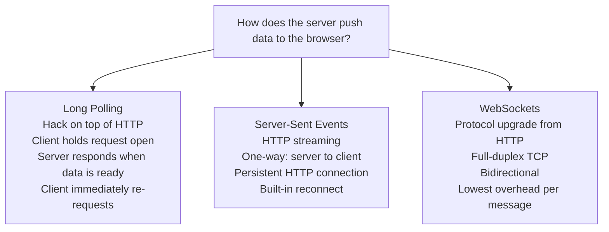
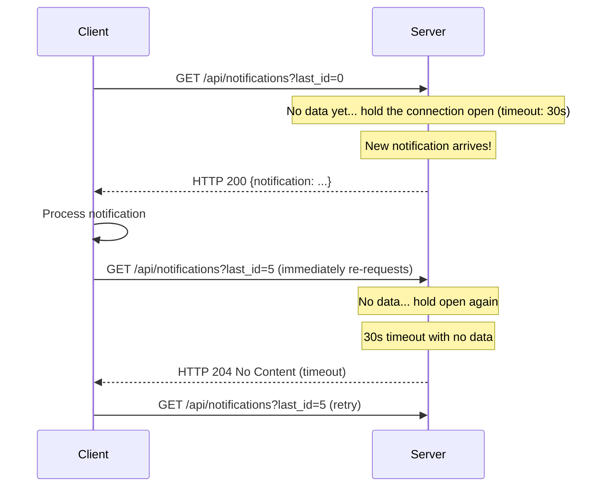
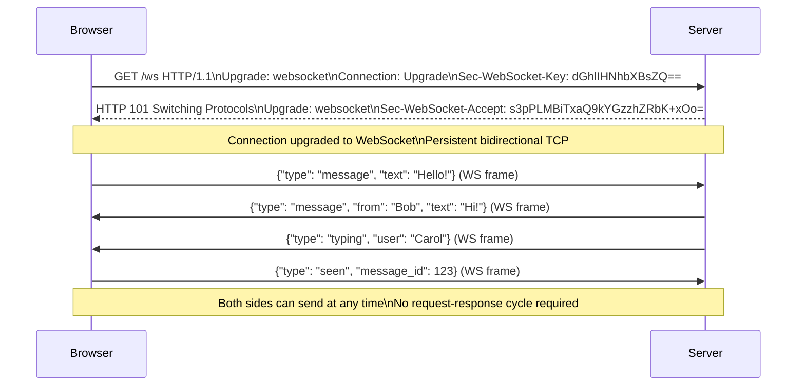
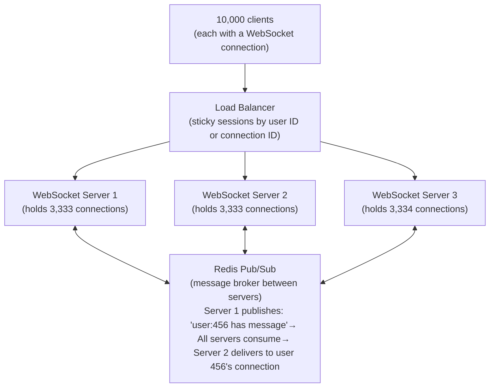

# Long Polling vs WebSockets

Real-time communication — pushing data from server to client the moment it is available — requires choosing between several approaches: long polling (a clever use of HTTP), WebSockets (a persistent full-duplex TCP connection), and Server-Sent Events (SSE, a one-way HTTP streaming mechanism). The choice determines connection overhead, infrastructure complexity, proxy/firewall compatibility, and how bidirectional the communication needs to be.

> **Why this matters in interviews:** Real-time features (live chat, collaborative editing, notifications, dashboards, order tracking) come up in almost every consumer-app system design. Interviewers specifically ask which protocol to use and why. Knowing the tradeoffs between long polling (simple, HTTP-compatible), WebSockets (bidirectional, efficient), and SSE (simpler than WebSockets for server-to-client) is essential.

---

## The Problem: HTTP Is Request-Response

HTTP is fundamentally pull-based: the client sends a request, the server responds. The server cannot proactively send data to the client without a prior request. Real-time applications need the opposite: the server must push updates to clients as soon as they occur.

Three solutions evolved:



---

## Long Polling

Long polling simulates push using regular HTTP by holding requests open:



**Long polling implementation (server side):**

```python
@app.get("/api/notifications")
async def long_poll_notifications(last_id: int, user_id: str):
    timeout = 30  # seconds
    deadline = time.time() + timeout
    
    while time.time() < deadline:
        # Check if new notifications exist since last_id
        notifications = db.query(
            "SELECT * FROM notifications WHERE user_id=? AND id>? LIMIT 10",
            user_id, last_id
        )
        if notifications:
            return {"notifications": notifications}
        
        await asyncio.sleep(0.5)  # Poll DB every 500ms
    
    return Response(status_code=204)  # No Content — client should retry
```

**Advantages of long polling:**
- Works everywhere HTTP works — no firewall or proxy issues
- Simple to implement — standard HTTP
- Stateless server-side (each poll is an independent request)
- Easy to load balance (any server handles any request)

**Disadvantages:**
- Each message requires a full HTTP request-response cycle
- High overhead: TCP setup, HTTP headers (hundreds of bytes), repeated authentication
- Database polling (in naive implementations) causes load
- Latency floor: slightly higher than WebSockets
- Many open connections if thousands of clients are polling simultaneously

---

## Server-Sent Events (SSE)

SSE uses a single persistent HTTP connection over which the server streams events to the client. The protocol is simple text-based:

```
# Response headers
Content-Type: text/event-stream
Cache-Control: no-cache
Connection: keep-alive

# Event stream (newline-delimited)
data: {"type": "notification", "message": "New comment"}

data: {"type": "price_update", "symbol": "AAPL", "price": 189.45}
id: 1234
event: price_update

: heartbeat

```

```javascript
// Browser-side SSE (native API)
const eventSource = new EventSource('/api/stream');

eventSource.onmessage = (event) => {
    const data = JSON.parse(event.data);
    updateUI(data);
};

eventSource.onerror = () => {
    // EventSource automatically reconnects with the last event ID
    // Sending 'Last-Event-ID' header on reconnect
};
```

**SSE advantages:**
- Works over regular HTTP/1.1 and HTTP/2 — no protocol upgrade
- Built-in automatic reconnection (browser EventSource API)
- Built-in event ID for resuming after disconnection
- Much lower overhead than long polling (one connection, no repeated request setup)
- Simple server implementation

**SSE limitations:**
- **One-way only** — server-to-client. Client messages still require separate HTTP requests.
- HTTP/1.1 limits: 6 connections per domain in browsers (SSE uses one of them)
- Some corporate proxies and older load balancers buffer responses, breaking streaming

---

## WebSockets

WebSocket is a separate protocol that starts as HTTP and upgrades to a persistent full-duplex TCP connection:



**WebSocket frame overhead:** A WebSocket data frame has only 2-14 bytes of overhead vs hundreds of bytes for an HTTP request. For high-frequency small messages (game state updates, trading prices, collaborative cursor positions), this difference is significant.

**WebSocket advantages:**
- True full-duplex: client and server send independently at any time
- Lowest message overhead (binary frames, no HTTP headers per message)
- Low latency: no round-trip to establish per-message
- Native browser support (WebSocket API)

**WebSocket disadvantages:**
- **Stateful connection:** The connection is pinned to one server. Scaling and load balancing require sticky sessions or a message broker (Redis pub/sub) to fan out messages across servers
- **Firewall/proxy issues:** Some corporate proxies block non-HTTP traffic or have short idle timeouts that kill WebSocket connections
- **Reconnection complexity:** Must implement manual reconnection logic; no built-in resume (need application-level sequence numbers)
- **More complex infrastructure:** Connection state must be managed; graceful server restarts drain connections

---

## Comparison

| Dimension | Long Polling | SSE | WebSockets |
|---|---|---|---|
| **Direction** | Server → Client (simulated) | Server → Client | Full-duplex |
| **Protocol** | HTTP | HTTP | WebSocket (upgrade from HTTP) |
| **Connection overhead** | High (new request per message) | Low (persistent) | Lowest (binary frames) |
| **Proxy compatibility** | Excellent | Good (some proxies buffer) | Mixed (some block) |
| **Browser support** | Universal | All modern browsers | All modern browsers |
| **Auto-reconnect** | Application-level | Built-in (EventSource) | Application-level |
| **Load balancing** | Easy (stateless) | Medium (sticky preferred) | Hard (must use sticky + message broker) |
| **Server complexity** | Low | Low | Higher |
| **Best for** | Simple notifications, legacy compat | Live feeds, dashboards | Chat, gaming, collaborative editing |

---

## When to Use Each

**Long polling:** Legacy systems, corporate proxy environments, simple notification delivery where real-time latency is not critical. Acceptable fallback when WebSockets are blocked.

**SSE:** Live data feeds (stock prices, social media feeds, deployment logs), server-push notifications, progress indicators. The natural choice when communication is one-way (server pushes, client reacts). Facebook uses SSE for its real-time notifications for good reasons: simple, HTTP-compatible, one-way is sufficient.

**WebSockets:** Live chat, multiplayer gaming, collaborative document editing (Google Docs-style), financial trading UIs, real-time collaborative tools. Required when the client must also send messages to the server in real time with low overhead.

---

## Scaling WebSockets

WebSockets are the hardest to scale because each connection is stateful and pinned to one server:



Each WebSocket server holds its connections in memory. If user 123 is connected to Server 1 and user 456 sends them a message while connected to Server 2, Server 2 must publish the message to Redis, and Server 1 (which holds user 123's connection) subscribes and delivers it. This Redis pub/sub fan-out is the standard pattern for scaling WebSockets horizontally.

---

## Interview Talking Points

**1. Compare long polling, SSE, and WebSockets for a real-time chat application.**
> "For a real-time chat application, WebSockets are the clear choice. Chat requires full-duplex communication: users send messages (client to server) and receive messages from others (server to client) continuously. SSE only handles server-to-client — you'd still need separate HTTP requests for users to send messages, adding latency and overhead. Long polling works but has high per-message overhead: every delivered message requires a full HTTP round trip. WebSockets maintain a persistent TCP connection with binary frame overhead of 2-14 bytes per message, compared to hundreds of bytes for HTTP headers. The connection is established once; after that, both client and server can send at any time with minimum overhead. The tradeoff is scaling complexity: WebSocket connections are stateful, so load balancers need sticky sessions, and a Redis pub/sub layer is needed to fan messages across multiple WebSocket servers. For chat at Slack's scale (millions of connections), this infrastructure is worth the investment."

**2. When would you choose SSE over WebSockets?**
> "SSE is the right choice when communication is genuinely one-directional: server pushes updates, client only reads. Examples: live deployment logs streaming to a dashboard, real-time sports scores updating a scoreboard, cryptocurrency prices updating a display, social media notification counts. SSE works over regular HTTP with no protocol upgrade — it is simpler to implement, simpler to proxy through CDNs and load balancers (no sticky sessions needed), and has built-in reconnection with last-event-ID for resuming streams. The browser's EventSource API handles reconnection automatically. The engineering simplicity argument is significant: SSE requires almost no additional infrastructure beyond a web server that can stream chunked responses. WebSockets require connection state management, sticky sessions or a message broker for horizontal scaling, manual reconnection logic, and more complex server infrastructure. If your use case is genuinely one-way, SSE is the simpler, more HTTP-native choice."

**3. How do you scale a WebSocket-based system to handle millions of concurrent connections?**
> "Scaling WebSockets is fundamentally a stateful connection management problem. Each WebSocket connection is pinned to one server instance — you cannot freely load balance to any server. My architecture: First, the load balancer must support sticky sessions (consistent hashing by connection ID or user ID ensures the same user always routes to the same server). Second, each WebSocket server instance maintains its connected users in memory. Third, a message broker (Redis pub/sub or Kafka) connects all server instances: when user A (connected to Server 1) sends a message to user B (connected to Server 2), Server 1 publishes to Redis, and Server 2 (which subscribes to all messages for its connected users) receives and delivers it. This pattern scales horizontally — add more WebSocket server instances as connection count grows. Each server handles 50,000 to 100,000 concurrent connections with event-loop based servers (Node.js, Go). For 1 million connections, that's 10-20 server instances plus a Redis cluster. Additionally, consider separate connection and message tiers: a dedicated connection tier handles raw WebSockets, and a message processing tier behind it handles business logic."

**4. What is the role of heartbeats in WebSocket connections?**
> "WebSocket connections can silently die without either side knowing. Intermediaries (proxies, NAT gateways, load balancers) have idle timeouts — if no data flows for 60-90 seconds, they close the TCP connection without notifying either endpoint. The application layers think they're still connected; they're not. Heartbeats solve this: the server sends a ping frame every 30 seconds (shorter than typical proxy idle timeouts), and the client responds with a pong frame. If no pong arrives within a timeout window, the connection is detected as dead and the client reconnects. WebSocket protocol has built-in ping/pong frames for this purpose. At the application level, I also implement application-layer heartbeats — a small JSON message every 30 seconds that also serves as a signal for the client to show 'connected' status vs 'reconnecting'. Client-side, the reconnection logic uses exponential backoff: attempt immediately, then 1 second, 2 seconds, 4 seconds, up to 30 seconds maximum, resetting to fast retries after a successful connection."

---

## Key Takeaways

- **Long polling** simulates push using standard HTTP — highly compatible but high per-message overhead
- **SSE** streams events over a persistent HTTP connection, one-way (server to client) — simpler than WebSockets, with built-in reconnection
- **WebSockets** provide true full-duplex over a single TCP connection — lowest latency and overhead, required for bidirectional real-time apps
- **Choose WebSockets** for chat, gaming, collaborative editing, real-time trading UIs
- **Choose SSE** for live feeds, dashboards, notifications, deployment logs — when communication is one-way
- **Choose long polling** for legacy compatibility or corporate proxy environments that block WebSockets
- **Scaling WebSockets** requires sticky sessions + Redis pub/sub fan-out across server instances
- **Heartbeats** are essential for WebSockets — proxy/NAT idle timeouts silently kill connections
