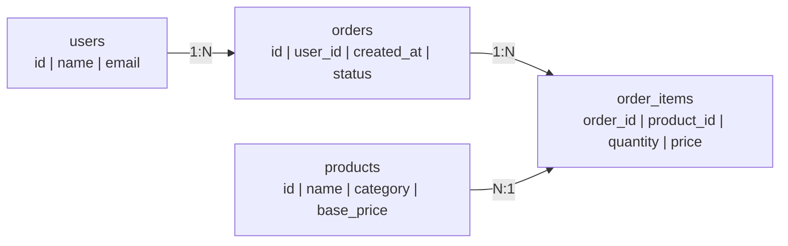
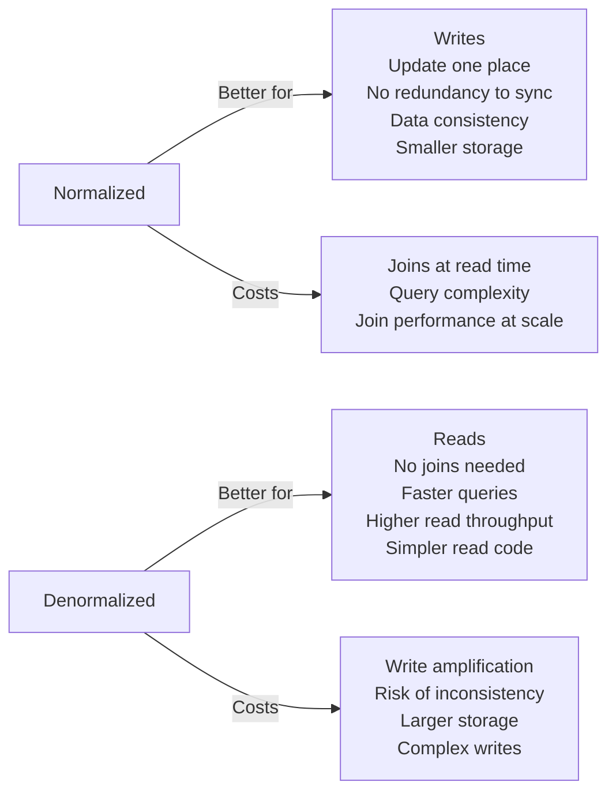
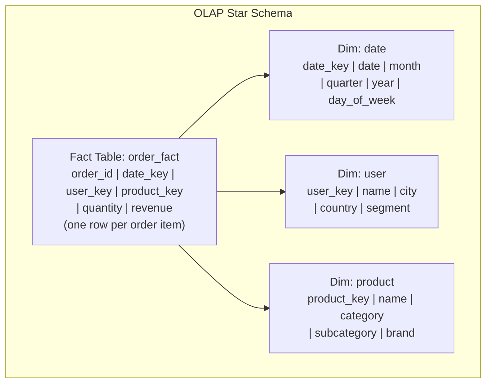
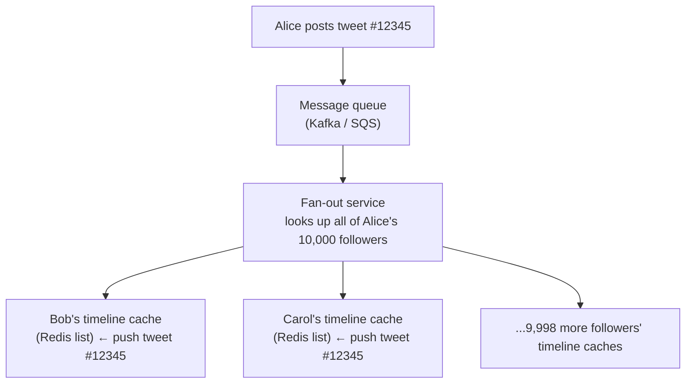

# Normalization vs Denormalization

Normalization is the process of organizing a relational database to minimize data redundancy by separating data into related tables and linking them with foreign keys. Denormalization deliberately reintroduces redundancy by combining tables or duplicating data to reduce the number of joins required at query time. The tradeoff is fundamental: normalized databases are easier to write to and maintain; denormalized databases are faster to read from. This choice directly impacts query performance, write complexity, storage cost, and data consistency.

> **Why this matters in interviews:** Normalization vs denormalization appears in every database design discussion and is the foundation of understanding OLTP vs OLAP schemas. Interviewers ask you to design a database schema and then ask: "How would you optimize this for read performance?" or "What is the tradeoff between data redundancy and query performance?" Understanding fan-out write patterns, materialized views, and when denormalization is necessary shows database design maturity.

---

## Normalization — Eliminate Redundancy

Normalized schemas store each fact exactly once. Related data is accessed via joins:



**Normal Forms:**

| Normal Form | Rule | Violation Example |
|---|---|---|
| **1NF** | No repeating groups; atomic values | `tags: "python,java,go"` in one column |
| **2NF** | No partial dependency on composite key | `order_items` storing `product_name` (depends only on product_id, not on order_id) |
| **3NF** | No transitive dependency | `orders` storing `user_city` (depends on user_id → city, not directly on order_id) |
| **BCNF** | Every determinant is a candidate key | Rare edge cases in multi-valued dependencies |

**Query to get a user's order history with product names (normalized):**

```sql
SELECT u.name, o.created_at, p.name AS product, oi.quantity, oi.price
FROM users u
JOIN orders o ON o.user_id = u.id
JOIN order_items oi ON oi.order_id = o.id
JOIN products p ON p.id = oi.product_id
WHERE u.id = 123
ORDER BY o.created_at DESC;
```

Four-table join. At small scale: fast, milliseconds. At massive scale (hundreds of millions of rows): can be slow and CPU-intensive.

---

## Denormalization — Optimize for Read Performance

Denormalization duplicates data to eliminate joins at read time:

```sql
-- Denormalized order_items (stores redundant data)
CREATE TABLE order_items_denorm (
    order_id      INT,
    user_id       INT,          -- Redundant (could join to orders)
    user_name     VARCHAR(100), -- Redundant (could join to users)
    product_id    INT,
    product_name  VARCHAR(200), -- Redundant (could join to products)
    category      VARCHAR(100), -- Redundant
    quantity      INT,
    price         DECIMAL(10,2)
);

-- Now the query becomes:
SELECT user_name, created_at, product_name, quantity, price
FROM order_items_denorm
WHERE user_id = 123
ORDER BY created_at DESC;
-- Single table scan, no joins, extremely fast
```

**Write amplification tradeoff:** When a product's name changes, you must update every row in `order_items_denorm` that references that product. With millions of orders, this is a massive update. Normalized schema: update one row in `products` table; all queries automatically see the new name.

---

## The Core Tradeoff



| Dimension | Normalized | Denormalized |
|---|---|---|
| **Read performance** | Slower (joins) | Faster (no joins) |
| **Write performance** | Faster (update one place) | Slower (update all copies) |
| **Storage** | Smaller (no duplication) | Larger (redundant data) |
| **Data consistency** | Guaranteed (single source of truth) | Must maintain manually or accept staleness |
| **Query complexity** | Higher (multi-table JOINs) | Lower (single table scans) |
| **Best for** | OLTP (frequent writes, complex queries) | OLAP, read-heavy analytics, caching layers |

---

## OLTP vs OLAP Schema Design

**OLTP (Online Transaction Processing):** High-frequency, low-latency writes. Normalized (3NF) to avoid write anomalies.

**OLAP (Online Analytical Processing):** Read-heavy analytics. Denormalized into star or snowflake schemas for query performance.



**Analytics query on star schema:**
```sql
-- Revenue by product category and quarter (no application joins needed)
SELECT p.category, d.quarter, SUM(f.revenue) AS total_revenue
FROM order_fact f
JOIN dim_product p ON f.product_key = p.product_key
JOIN dim_date d ON f.date_key = d.date_key
WHERE d.year = 2024
GROUP BY p.category, d.quarter
ORDER BY total_revenue DESC;
```

Star schema joins are simple (one level to dimension tables) and optimized by columnar storage in data warehouses (BigQuery, Redshift, Snowflake).

---

## Application-Level Denormalization Patterns

### Fan-Out Write (Social Media Feed)

When Alice posts a tweet, Twitter "fans out" the post to the timelines (home feeds) of all her followers. This is extreme denormalization: the same tweet ID is written to the timeline cache of every follower:



**Why:** Reading a timeline (the most frequent operation) becomes a simple Redis list read. No joins, no aggregation. The cost is write amplification: one tweet triggers 10,000 writes.

**The exception:** If Alice has 50 million followers (a celebrity), fan-out is too expensive. Twitter handles this with a **pull-on-read** hybrid: for users with >1M followers, timelines are composed at read time by merging the celebrity's tweets into the follower's pre-computed timeline.

### Materialized Views

A materialized view pre-computes an expensive query and stores the result as a table. Reads are instant; the view must be refreshed when source data changes:

```sql
-- Expensive query to compute daily: run once, store result
CREATE MATERIALIZED VIEW daily_category_revenue AS
SELECT p.category, DATE(o.created_at) AS date, SUM(oi.price * oi.quantity) AS revenue
FROM order_items oi
JOIN products p ON oi.product_id = p.id
JOIN orders o ON oi.order_id = o.id
GROUP BY p.category, DATE(o.created_at);

-- Dashboard reads: instant
SELECT * FROM daily_category_revenue WHERE date = '2024-05-01';

-- Refresh nightly
REFRESH MATERIALIZED VIEW CONCURRENTLY daily_category_revenue;
```

---

## Interview Talking Points

**1. When would you denormalize a database schema?**
> "I denormalize when I have a measured read performance problem that joins are causing, or when I'm designing for a specific high-frequency read pattern that I know in advance. The signals: query profiling shows that a JOIN across millions of rows is the bottleneck; a read-heavy feature (like a home feed or product listing) has strict SLA requirements that normalized queries can't meet; or I'm designing an analytics schema where ad-hoc aggregations over billions of rows need to be fast. Before denormalizing, I try all the non-redundancy options: proper indexes, covering indexes, query optimization, read replicas, caching. Denormalization should be a last resort because it introduces write amplification and consistency risk. When I do denormalize, I document the invariants I'm maintaining (e.g., 'product_name in order_items is updated whenever products.name changes via a trigger or application logic') to prevent drift."

**2. What is write amplification in the context of denormalization?**
> "Write amplification is when a single logical write triggers multiple physical writes because denormalized data must be updated in multiple places. Example: a normalized schema stores a user's email in one row in the users table. A denormalized schema might store the email in orders, in order_items, in audit_logs, and in a search index. When the user updates their email, you must update all four locations atomically to maintain consistency. This is write amplification of 4×. In social media feed fan-out, a celebrity with 10 million followers creates 10 million write amplification for a single tweet. The tradeoff: you pay the write cost once per event to avoid paying the join cost on every read. For read-heavy systems (social feeds are read 100× more than written), this trade often makes sense. For write-heavy systems (IoT sensor writes), write amplification is unacceptable."

**3. What is the difference between an OLTP and OLAP database schema?**
> "OLTP (Online Transaction Processing) schemas are normalized, typically to 3NF. They optimize for write performance, data consistency, and transactional integrity. The schema mirrors the domain model: users, orders, products as separate tables with foreign keys. Individual rows are frequently inserted, updated, and deleted. OLAP (Online Analytical Processing) schemas are denormalized into star or snowflake schemas. A central fact table (one row per event: order, click, impression) is surrounded by dimension tables (product, user, date, location). The schema is designed for analytical query patterns: GROUP BY category, year; SUM(revenue) across millions of rows. Analytical queries join large fact tables against small dimension tables — star schema joins are predictable and optimize well. Data warehouses like BigQuery, Redshift, and Snowflake use columnar storage that aligns perfectly with star schema queries — reading only the columns needed for an aggregation is dramatically faster than row-based storage."

**4. How does Twitter/X design its home timeline to handle the fan-out problem?**
> "Twitter's home timeline is a classic denormalization design problem. The naive approach: when you load your timeline, query all tweets from all users you follow, sort by time, and return the top 20. For a user following 1,000 accounts, that's a massive join across millions of tweets on every timeline load — too slow at scale. Twitter's solution (described in their engineering blog) is fan-out on write: when a user posts a tweet, a fan-out service pushes the tweet ID to the Redis timeline cache of every follower. Reading a timeline becomes a simple Redis list lookup — O(1), sub-millisecond. The write cost is proportional to follower count. This works for most users but breaks for celebrities: Lady Gaga with 40 million followers would cause 40 million Redis writes per tweet, creating a 'hotspot' that delays timeline delivery. Twitter's hybrid solution: for accounts below ~1M followers, fan-out on write. For mega-celebrities, skip fan-out. When you load your timeline, merge the pre-computed timeline (fan-out from regular accounts) with real-time queries for celebrity tweets you follow. This hybrid strategy is the real-world pragmatic answer to the theoretical tradeoff."

---

## Key Takeaways

- **Normalization** eliminates redundancy — single source of truth, fast writes, consistent updates, at the cost of joins at read time
- **Denormalization** duplicates data to eliminate joins — fast reads, at the cost of write amplification and consistency risk
- **Write amplification:** updating denormalized data requires updating all copies — cost grows with the degree of denormalization
- **OLTP schemas** are normalized (3NF) for write performance and data integrity
- **OLAP schemas** use star/snowflake denormalized design for analytical query performance in data warehouses
- **Fan-out write** (social timelines) is extreme denormalization: one write event triggers N writes to N followers' caches for O(1) reads
- **Materialized views** pre-compute expensive aggregations, refreshed on a schedule — read instantly, pay the cost at refresh time
- **Always profile before denormalizing:** proper indexing often solves the read problem without introducing redundancy
