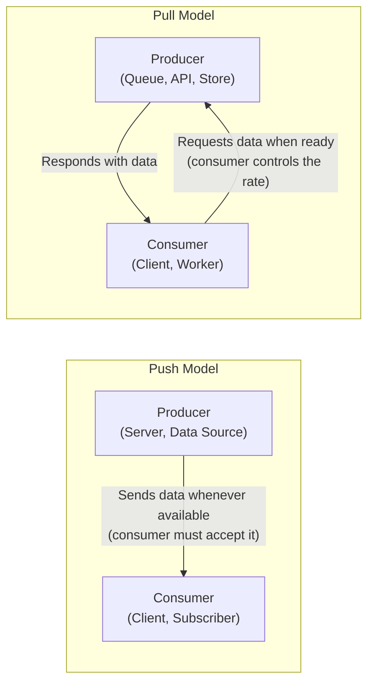
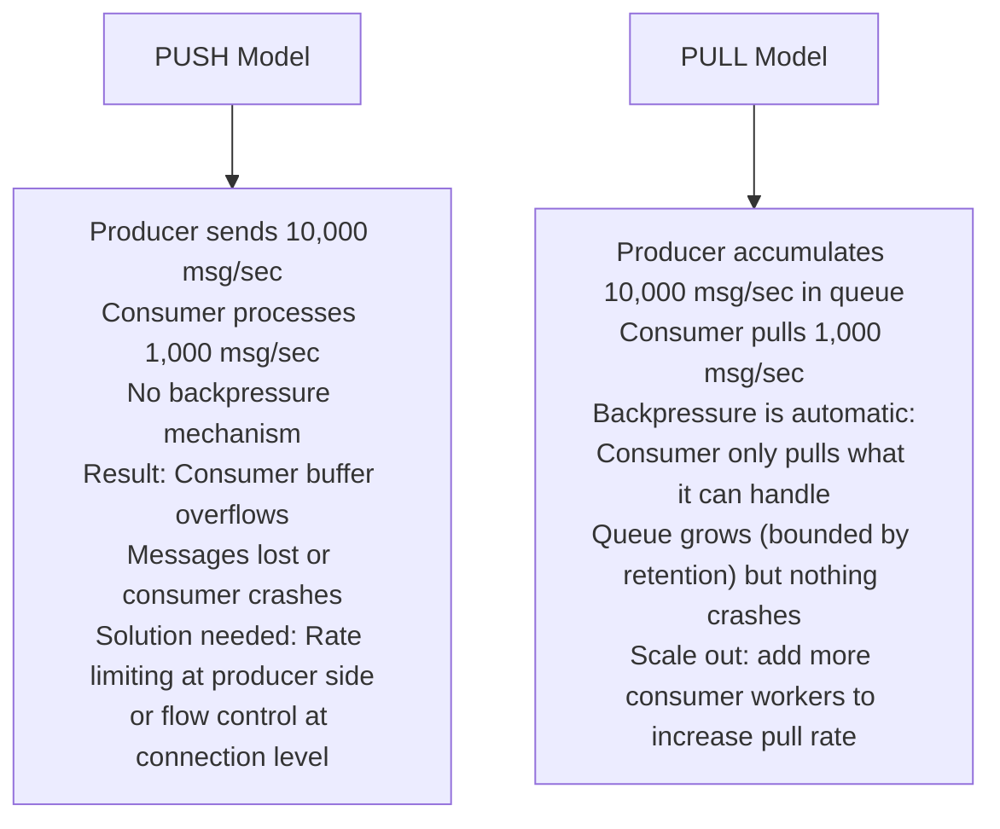
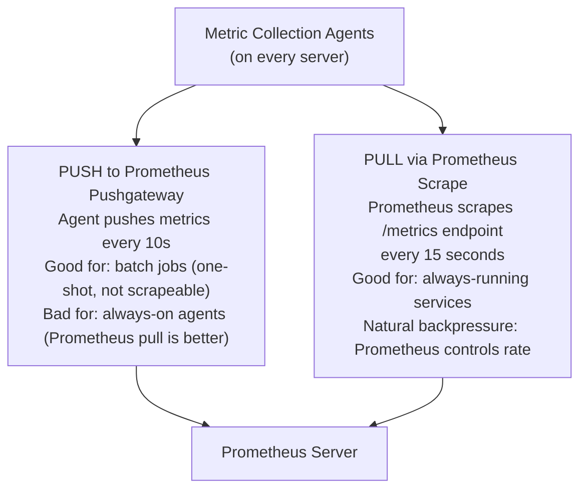

# Push vs Pull

Push and pull are two fundamental models for how data flows between producers and consumers in distributed systems. In a push model, the producer sends data to consumers as soon as it is available — proactively. In a pull model, consumers request data from the producer when they are ready — reactively. The choice between them determines how your system handles backpressure, latency, resource utilization, and the coupling between producers and consumers.

> **Why this matters in interviews:** Push vs pull is a recurring design question with implications across message queues, CDNs, webhooks, streaming systems, and monitoring pipelines. When you design a real-time notification system, a data pipeline, or a monitoring stack, you must explicitly choose. Interviewers look for the ability to articulate backpressure handling, the latency difference, and when each model breaks down.

---

## Core Models

---

## Push Model

The producer initiates the data transfer. The consumer must be ready to receive.

**Examples:**
- **Webhooks:** GitHub sends an HTTP POST to your server immediately when a PR is merged
- **Server-Sent Events (SSE):** Server pushes real-time updates to browser over HTTP
- **WebSockets:** Server pushes messages to clients (bidirectional)
- **Push notifications:** APNs/FCM sends a notification to a mobile device
- **Email (SMTP):** Sending server pushes to receiving server
- **Kafka (producer side):** Producers push messages to Kafka brokers

**Push advantages:**
- Low latency — consumer gets data immediately when available
- Simple consumer — just handle incoming events, no polling logic
- Efficient when events are infrequent — no wasted poll cycles

**Push disadvantages:**
- **No backpressure control:** Producer can overwhelm a slow consumer. If the consumer processes 100 msg/sec but the producer sends 10,000 msg/sec, the consumer's buffer fills up and messages are lost or the consumer crashes
- **Consumer must always be available:** If the consumer is down when a push arrives, the message is lost (unless the producer retries)
- **Tight coupling:** Producer must know the consumer's endpoint

---

## Pull Model

The consumer requests data when it is ready to process it.

**Examples:**
- **Kafka (consumer side):** Consumers pull from Kafka brokers at their own pace
- **SQS:** Workers poll the queue for messages
- **HTTP polling:** Client repeatedly calls `GET /api/status` every 5 seconds
- **RSS feeds:** RSS readers poll the feed URL periodically
- **Database replication slaves:** Replicas pull WAL logs from the primary
- **Email (IMAP):** Client polls the mail server for new messages

**Pull advantages:**
- **Natural backpressure:** Consumer only pulls when it has capacity. If processing is slow, the consumer simply doesn't pull the next batch. The queue accumulates, but the consumer is not overwhelmed.
- **Consumer resilience:** If the consumer is down, messages wait in the queue. When it recovers, it pulls and processes normally.
- **Consumer controls its rate:** Autoscaling becomes natural — add more consumer workers to increase pull rate

**Pull disadvantages:**
- Polling overhead — if you poll every second and events are infrequent, 99% of polls return empty
- Latency floor — the consumer only gets data at its next poll interval, not instantly
- More complex consumer logic — must implement polling loop, handle empty responses, manage offsets

---

## Backpressure: The Critical Difference

Backpressure is the mechanism by which a consumer signals to a producer that it cannot keep up with the production rate:

Kafka is explicitly designed as a pull system because of this. Consumers maintain their own offsets and pull at their own pace. A slow consumer simply lags behind; it does not cause the producer or broker to slow down, and it does not lose messages (within the retention window).

---

## Webhooks vs Polling APIs

A practical comparison that comes up in API design:

| Dimension | Webhooks (Push) | Polling (Pull) |
|---|---|---|
| **Latency** | Near-zero (event-driven) | Up to poll interval (seconds to minutes) |
| **Consumer availability** | Consumer must have a public endpoint | Consumer can be behind NAT/firewall |
| **Reliability** | Consumer must handle retries from provider | Consumer controls retry logic |
| **Server load** | Low (only sends when events occur) | Higher (handles many empty polls) |
| **Setup complexity** | Consumer must expose HTTPS endpoint | Simple HTTP GET calls |
| **Failure handling** | Provider must retry if consumer is down | Consumer retries itself |
| **Example** | GitHub webhooks, Stripe payment events | GitHub API polling, S3 event polling |

**Hybrid pattern:** Many platforms offer both. Stripe sends webhooks for real-time event processing and also allows polling `GET /events` for reconciliation, missed webhooks, or consumers behind firewalls. The polling API is the reliable fallback; the webhook is the low-latency primary.

---

## Real-World Design Decision: Monitoring Pipeline

Prometheus chose the pull model for good reasons: the monitoring system (Prometheus) controls the scrape rate, making it resilient to agent spikes. If an agent is slow, Prometheus simply gets fewer data points — it does not crash. The pull model also makes service discovery easier: Prometheus discovers services and pulls from them; services don't need to know where Prometheus is.

---

## Interview Talking Points

**1. What is backpressure and why does the pull model handle it better than push?**
> "Backpressure is the mechanism by which a slow consumer signals to a faster producer to slow down. In a push model, the producer sends data at its own rate regardless of the consumer's processing speed. If the producer sends 10,000 messages per second and the consumer can only process 1,000, the consumer's buffer fills up. Without explicit flow control (like TCP's window mechanism or gRPC's flow control), messages are dropped or the consumer runs out of memory. In a pull model, backpressure is automatic: the consumer only pulls when it has capacity. If processing is slow, the consumer doesn't issue the next pull. The queue accumulates, but nothing crashes. This is why Kafka uses a pull model for consumers — each consumer group maintains its own offset and pulls at its own pace. A slow consumer lags but doesn't lose messages or cause the broker to slow down. Fixing slow consumers is as simple as adding more consumer instances to a consumer group."

**2. When would you choose webhooks over a polling API?**
> "Webhooks are ideal when: the consumer needs near-real-time notification (payment events, CI/CD build completion, inventory alerts), when events are infrequent (polling every 30 seconds for events that happen once an hour wastes resources), and when the consumer has a public HTTPS endpoint. Polling is better when: the consumer is behind a NAT or firewall and cannot receive inbound connections (corporate networks, IoT devices), when you need reconciliation after a missed webhook (always poll as a fallback), or when event ordering matters and you need to process them in sequence yourself. In practice, I design webhook-first with a polling fallback. Stripe's approach is the model: webhooks for real-time processing, but also expose `GET /events` so consumers can poll for missed events, replay history, or recover from outages. The webhook is the fast path; the polling API is the reliable fallback for idempotent reconciliation."

**3. How do you design a reliable webhook delivery system?**
> "Webhook reliability requires handling the fundamental problem: your consumer might be down or slow when you need to deliver. My design: First, async delivery — never deliver webhooks synchronously in the request path. Write the event to a database outbox, then a background worker delivers to the consumer's endpoint. Second, retry with exponential backoff — if the consumer returns a non-2xx response or times out, retry after 1 minute, 5 minutes, 30 minutes, 1 hour, up to some maximum (24 hours or 10 attempts). Third, dead letter queue — after maximum retries, move to a DLQ with an alert so engineers can investigate. Fourth, idempotency — deliver each event with a unique event ID in a header (like `Stripe-Signature` with an event ID). Consumers must be idempotent because retries cause duplicate deliveries. Fifth, signature verification — HMAC-sign the payload and include the signature in a header. Consumers verify the signature to confirm the event came from your server, preventing webhook spoofing attacks."

**4. Kafka is described as a push model for producers but pull for consumers. Why?**
> "This hybrid design is intentional and powerful. Producers push to Kafka brokers immediately when events are ready — no buffering at the producer side, low latency to broker commit. This allows producers to fire events at full speed without caring about consumer throughput. Kafka brokers durably store events in the commit log. Consumers then pull from brokers at their own pace, maintaining their own offset (position in the log). This pull model gives consumers complete control: a slow consumer just has a higher lag but doesn't lose messages or cause producer backpressure. Multiple consumer groups can read the same topic independently, each at their own rate. The design also enables time travel: a consumer can reset its offset to replay historical data. If Kafka used push to consumers, you'd need per-consumer flow control at the broker, per-consumer buffers, and complex coordination when consumers restart — the pull model eliminates all of this by making consumers responsible for their own position."

---

## Key Takeaways

- **Push:** Producer sends data proactively — low latency, but no natural backpressure; consumer can be overwhelmed
- **Pull:** Consumer requests data when ready — natural backpressure, resilient to consumer slowness, but polling overhead
- **Backpressure** is the critical advantage of pull — the consumer controls its own rate without coordination with the producer
- **Webhooks (push)** are ideal for real-time event notification; **polling APIs (pull)** are ideal for consumers behind firewalls or needing reconciliation
- **Kafka:** producers push to brokers (low latency), consumers pull from brokers (natural backpressure) — best of both worlds
- **Prometheus** uses pull (scraping) to give the monitoring system control over load and service discovery
- **Reliable webhooks** require async delivery, exponential backoff retries, dead letter queues, and HMAC signature verification
