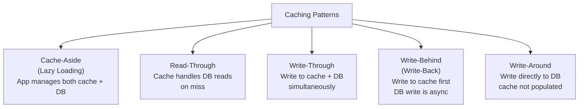
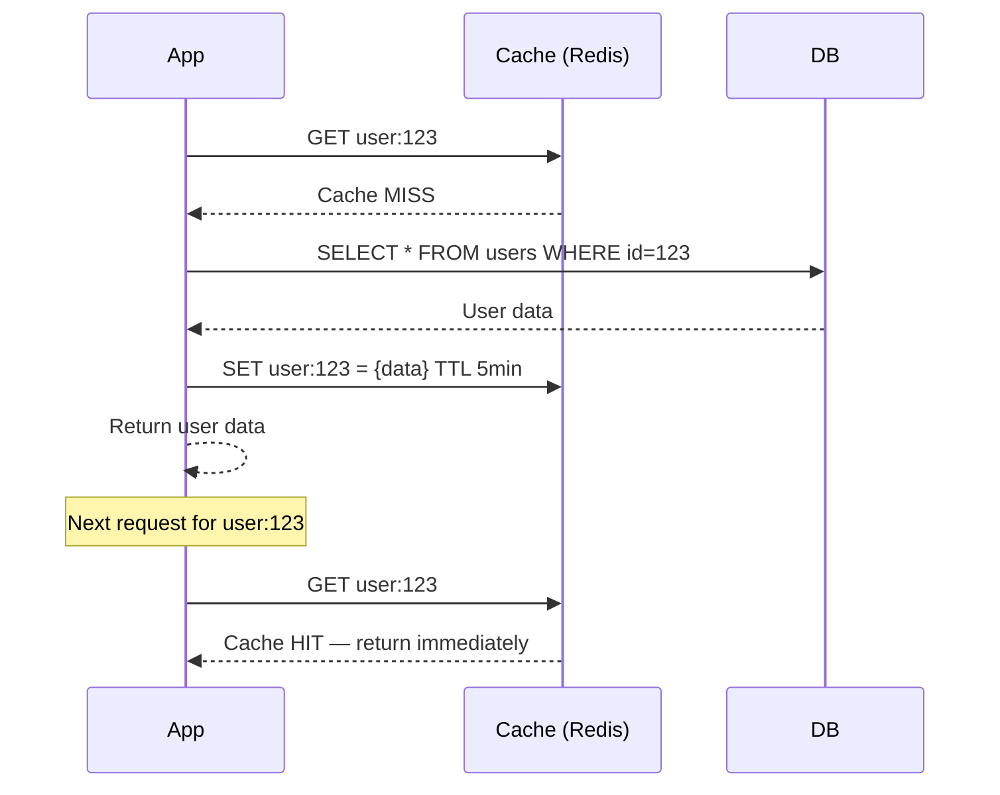
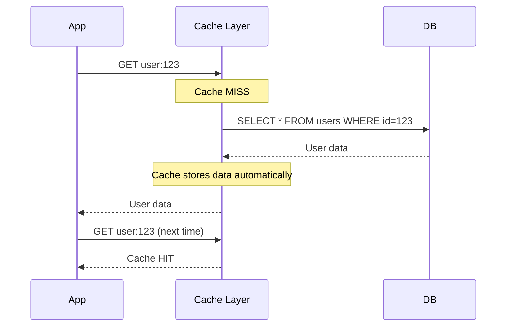
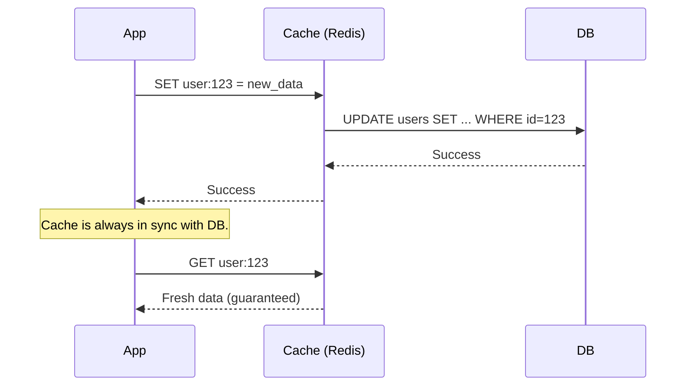
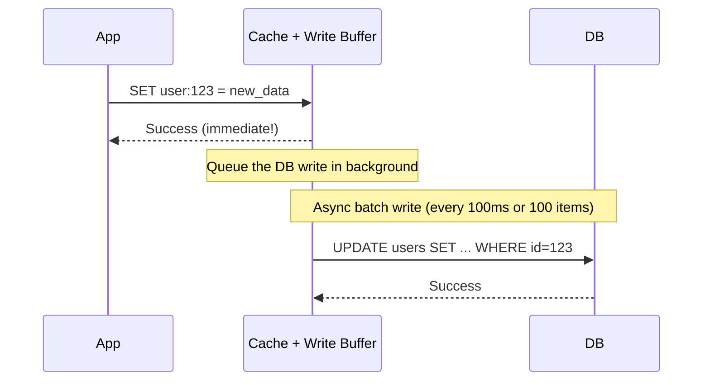
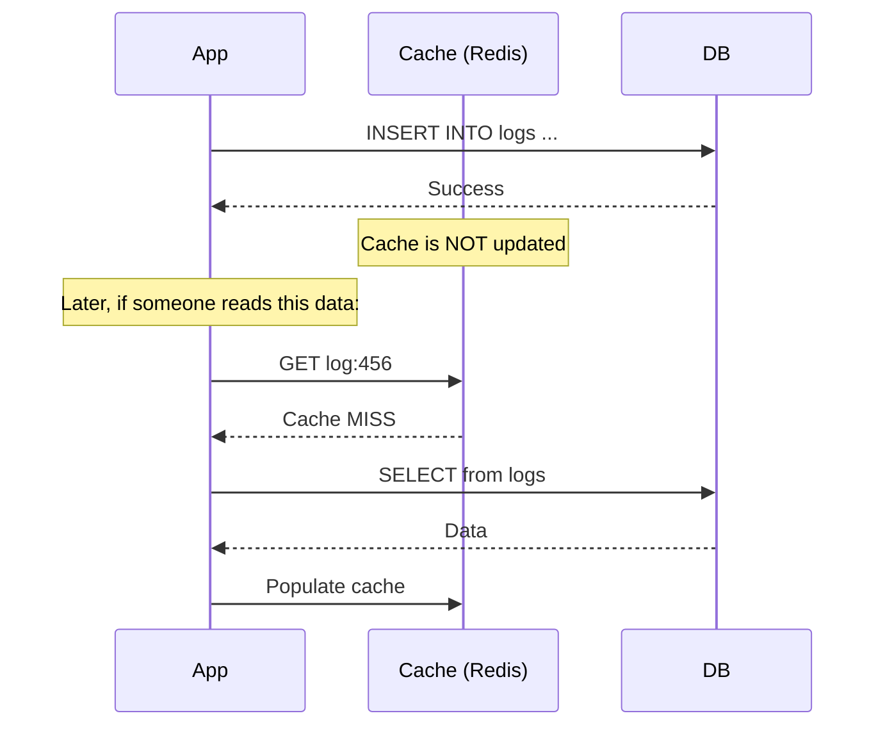

# Read-Through vs Write-Through Cache

Caching is one of the most powerful performance optimization tools in system design, but the strategy for keeping the cache in sync with the underlying database is not obvious. The five primary caching patterns — cache-aside, read-through, write-through, write-behind, and write-around — each make different tradeoffs around consistency, complexity, latency, and freshness. Choosing the wrong one results in stale data, thundering herd problems, or write amplification. Choosing the right one for your access pattern is a hallmark of systems thinking.

> **Why this matters in interviews:** Caching strategy is a standard interview topic. Interviewers ask "how would you cache this?" and then probe: what happens on a cache miss? How do you handle stale data? What happens when the cache restarts? What if the write to DB succeeds but the cache update fails? Each strategy has specific failure modes that sophisticated engineers are expected to reason through.

---

## The Five Caching Patterns



---

## Pattern 1: Cache-Aside (Lazy Loading)

The most common pattern. The application manages both the cache and the database:



**Read code:**

```python
def get_user(user_id: str) -> User:
    cache_key = f"user:{user_id}"
    
    # 1. Try cache first
    cached = redis.get(cache_key)
    if cached:
        return User.parse_raw(cached)
    
    # 2. Cache miss: fetch from DB
    user = db.query("SELECT * FROM users WHERE id = ?", user_id)
    
    # 3. Populate cache for next time
    redis.setex(cache_key, 300, user.json())  # TTL = 5 minutes
    
    return user
```

**Advantages:**
- Only data that is actually requested gets cached (no wasted memory)
- If cache crashes, the system still works — just slower (falls back to DB)
- Cache and DB data models can differ

**Disadvantages:**
- **Cache miss penalty:** First access is always slow (DB round trip + cache population)
- **Stale data:** If the DB is updated outside the application (manual SQL, migration), the cache holds stale data until TTL expires
- **Race condition (cache stampede):** If 10,000 requests arrive simultaneously for the same uncached key, all of them hit the DB at once before any can populate the cache. Solution: distributed lock or probabilistic early refresh.
- **Write invalidation:** When you update a user, you must also invalidate the cache (`redis.delete(cache_key)`). If this step is missed, staleness occurs.

---

## Pattern 2: Read-Through

The cache sits in front of the database and handles its own population on cache miss. The application only talks to the cache:



The application is unaware of whether the response came from cache or DB. The cache library or middleware handles the miss logic.

**Libraries that implement read-through:** Ehcache, Caffeine (Java), Hibernate second-level cache.

**Advantages over cache-aside:** Simpler application code — no cache miss handling logic in the app layer.

**Disadvantages:** Same stale data problem; same cache miss penalty; harder to customize the DB query for complex lookups.

---

## Pattern 3: Write-Through

Every write goes to both the cache and the database synchronously before returning to the caller:



**Advantages:**
- Cache is always fresh — no stale data after writes
- No need to manually invalidate cache entries after updates
- Reads after writes are always cache hits with current data

**Disadvantages:**
- **Write latency:** Every write waits for both cache write and DB write to complete — higher write latency than DB-only writes
- **Write amplification:** Every write touches two systems — higher total write operations
- **Wasted cache space:** Data written and never read is still cached — poor cache utilization for write-heavy, read-light data
- **Complexity:** What happens if the DB write fails after the cache write succeeds? Must implement rollback.

**Best combination:** Write-through for writes + cache-aside for reads. The cache is always fresh, and reads are fast.

---

## Pattern 4: Write-Behind (Write-Back)

Writes go to the cache immediately; the database write happens asynchronously in the background:



**Advantages:**
- Extremely low write latency — the user gets a response as soon as the cache writes
- High write throughput — batch writes to DB reduce I/O pressure
- Naturally handles write bursts (queue absorbs spikes)

**Disadvantages:**
- **Data loss risk:** If the cache crashes before the background write completes, data is lost. This is unacceptable for financial or critical data.
- **Consistency risk:** The DB might be stale by seconds or minutes. Any system reading directly from the DB (analytics, other services) sees old data.
- **Complexity:** Failure handling, retry logic, ordering guarantees for the async writes.

**When to use write-behind:** Gaming leaderboards, analytics counters, shopping cart with eventual persistence — any use case where losing a few seconds of writes is acceptable in exchange for low latency.

---

## Pattern 5: Write-Around

Writes go directly to the database, bypassing the cache. The cache is populated only when data is subsequently read:



**Best for:** Write-once, read-infrequently data like application logs, audit trails, media uploads, and archival data. No point caching data that is written once and rarely read. Populating the cache with write-around data would cause cache churn (frequently evicting useful data to make room for rarely-read data).

---

## Cache Invalidation Strategies

Cache invalidation is notoriously hard (Phil Karlton: "There are only two hard things in Computer Science: cache invalidation and naming things."):

| Strategy | How It Works | Staleness Window | Best For |
|---|---|---|---|
| **TTL (Time-To-Live)** | Cache entry expires after N seconds | Up to TTL duration | Product catalogs, user profiles, semi-static data |
| **Event-driven invalidation** | DB write triggers cache delete | Near-zero (race window) | Frequently updated, consistency-critical data |
| **Write-through** | Every write updates cache | Zero (always fresh) | Small hot datasets with frequent reads after writes |
| **Cache-bust on deploy** | New cache key version on each deploy | Stale until TTL if not invalidated | Feature flags, configuration |

**Event-driven invalidation code:**

```python
def update_user(user_id: str, data: dict) -> User:
    # Update DB
    user = db.execute("UPDATE users SET ... WHERE id=?", user_id, data)
    
    # Invalidate cache AFTER successful DB write
    redis.delete(f"user:{user_id}")
    
    # Next read will miss and re-populate from DB
    return user

# Issue: race condition
# 1. Thread A reads user:123 — cache miss, reading from DB
# 2. Thread B updates user:123, invalidates cache
# 3. Thread A populates cache with STALE data from step 1
# Solution: cache-aside with very short TTL, or distributed lock during population
```

---

## Thundering Herd / Cache Stampede

When a popular cache entry expires, thousands of simultaneous requests all miss and hit the database:

```python
# Prevention 1: Probabilistic Early Refresh (PER)
import random
import math

def get_with_probabilistic_refresh(key: str, beta: float = 1.0):
    data, ttl, delta = cache.get_with_metadata(key)
    # Refresh early based on remaining TTL and last fetch time
    if data and -delta * beta * math.log(random.random()) < ttl:
        return data  # Still fresh, return cached value
    
    # Fetch and refresh before it expires
    fresh = db.fetch(key)
    cache.set(key, fresh, ttl=300)
    return fresh

# Prevention 2: Lock + Single Fetch
lock_key = f"lock:{key}"
if redis.set(lock_key, "1", nx=True, ex=5):  # Only one thread gets the lock
    try:
        data = db.fetch(key)
        redis.setex(key, 300, data)
    finally:
        redis.delete(lock_key)
else:
    time.sleep(0.1)  # Wait for lock holder to populate cache
    data = redis.get(key)  # Should be populated now
```

---

## Pattern Comparison

| Pattern | Write Latency | Read Latency | Data Freshness | Data Loss Risk | Best For |
|---|---|---|---|---|---|
| **Cache-Aside** | Low (DB only) | Low (after first miss) | Eventual (TTL) | None | Most read-heavy applications |
| **Read-Through** | Low (DB only) | Low (after first miss) | Eventual (TTL) | None | Simplified app code |
| **Write-Through** | Higher (cache + DB) | Very low (always cached) | Always fresh | None | Consistency-critical reads |
| **Write-Behind** | Very low (cache only) | Very low | Slight lag | Yes (if cache crashes) | Low-latency write-heavy apps |
| **Write-Around** | Low (DB only) | Higher (no cache) | N/A (not cached) | None | Write-once, read-rarely data |

---

## Interview Talking Points

**1. What is the cache-aside pattern and what are its failure modes?**
> "Cache-aside is the most common caching pattern: the application first checks the cache; on a miss, it fetches from the database and populates the cache for future requests. It's lazy loading — only data that is actually requested gets cached, which is cache-memory efficient. The primary failure modes: First, the cache stampede (thundering herd): when a popular entry expires, thousands of simultaneous requests all miss and hit the database simultaneously. Mitigation: probabilistic early expiration, distributed locking during population, or staggered TTLs. Second, stale data after writes: if the application updates the database but forgets to invalidate the cache, readers see stale data until TTL expires. Mitigation: always pair database writes with cache invalidation. Third, cold start: when the cache restarts, all data must be re-fetched from the database — sudden spike in database load. Mitigation: gradual cache warming, database read replicas."

**2. When would you use write-through caching?**
> "Write-through caching ensures the cache is always in sync with the database by writing to both simultaneously on every update. I use it when read-after-write consistency is critical — a user updates their profile and immediately expects to see the updated version when they refresh. With cache-aside and event-driven invalidation, there's a brief window between the database write and the cache invalidation where a concurrent read might serve stale data. Write-through eliminates this window. The tradeoff is write latency: every write must complete both the cache write and the database write before returning. For write-heavy systems, this doubles write latency. The pattern also wastes cache space for data that is written but rarely read. Write-through is best combined with cache-aside for reads: always write to both (write-through), but for the initial read, still follow cache-aside logic. The combination gives you always-fresh cache entries without the write-heavy systems penalty."

**3. What is the difference between write-through and write-behind caching?**
> "Write-through writes to both cache and database synchronously before returning to the caller. The write is not complete until both succeed. Guarantees consistency and no data loss but adds write latency — the caller waits for both writes. Write-behind (write-back) writes to the cache immediately and returns success to the caller; the database write happens asynchronously in the background. The write is 'complete' from the caller's perspective as soon as the cache write succeeds. This gives extremely low write latency and high write throughput — the background process batches database writes for efficiency. The critical tradeoff is data durability: if the cache system crashes before the background write completes, those writes are lost. This makes write-behind unsuitable for financial transactions, user account data, or any data where loss is unacceptable. It's appropriate for analytics counters, leaderboard scores, activity logs, and shopping cart data where losing a few seconds of writes is acceptable."

**4. How do you handle cache invalidation for frequently updated data?**
> "Cache invalidation is one of the genuinely hard problems in engineering. My strategy depends on the consistency requirement. For data that can tolerate seconds of staleness: short TTL (30-60 seconds) with cache-aside. The data refreshes automatically within one TTL window. For data requiring near-real-time freshness: event-driven invalidation. Every database write triggers a cache delete via application code or a database change-data-capture (CDC) stream. The cache entry is invalidated immediately; the next read repopulates from the fresh DB state. For data with complex dependencies (invalidating 'all cached queries that touch this user'): use a versioned cache key. Increment the user's version counter on every update; cache keys embed the version. Old cache entries become unreachable and expire naturally. The tradeoff: version-based keys require the version to be fetched on every cache lookup, adding one Redis round trip. For truly high-consistency requirements, skip the cache for that data path entirely and accept the database read latency."

---

## Key Takeaways

- **Cache-aside** is the most common pattern — application checks cache, falls back to DB, populates cache on miss; lazy, memory-efficient
- **Read-through** is like cache-aside but the cache library handles miss logic — simpler application code
- **Write-through** writes to cache + DB synchronously — always-fresh cache, higher write latency
- **Write-behind** writes to cache immediately, DB async — lowest write latency, risk of data loss on cache crash
- **Write-around** bypasses cache on write — best for write-once, read-rarely data (logs, archives)
- **Cache stampede** (thundering herd) occurs when popular entry expires and thousands of requests hit DB simultaneously — mitigate with probabilistic early refresh or distributed locking
- **Cache invalidation strategies:** TTL (simple, eventual), event-driven invalidation (near-real-time), write-through (always-fresh)
- **Write-behind is dangerous for critical data** — async DB writes can be lost if cache crashes before flush
