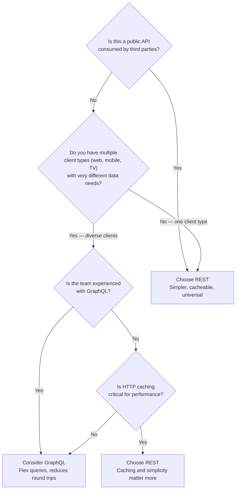

# REST vs GraphQL

REST (Representational State Transfer) is an architectural style that exposes resources via hierarchical URLs and HTTP verbs — it has been the dominant API paradigm for two decades. GraphQL is a query language for APIs developed by Facebook in 2012, open-sourced in 2015 — it exposes a single endpoint where clients specify exactly what data they need. The choice between them shapes how your API scales with client diversity, how you handle data-fetching efficiency, and how much flexibility you give frontend teams.

> **Why this matters in interviews:** API design comes up in almost every system design question that involves a client-facing backend. Interviewers expect you to know when REST's simplicity wins and when GraphQL's flexibility pays off. The patterns of over-fetching, under-fetching, and the N+1 problem in GraphQL (and how DataLoader solves it) are specific concepts that show depth of knowledge.

---

## The Over-Fetching and Under-Fetching Problem

The core motivation for GraphQL is solving two REST inefficiencies:

### Over-Fetching — Getting More Than You Need

```
REST: GET /api/users/123
Response:
{
  "id": 123,
  "name": "Alice Smith",
  "email": "alice@example.com",       ← mobile app doesn't need this
  "phone": "+1-555-0100",              ← mobile app doesn't need this
  "address": { ... },                  ← mobile app doesn't need this
  "created_at": "2020-01-15",          ← mobile app doesn't need this
  "subscription_tier": "premium",
  "profile_picture_url": "..."
}

Mobile app only needed: id, name, profile_picture_url
Wasted bandwidth: ~80% of the payload
```

### Under-Fetching — Multiple Requests for Related Data

```
To show a user's profile page with their last 3 posts and each post's like count:

REST requires:
  GET /api/users/123          (user data)
  GET /api/users/123/posts    (posts list)  
  GET /api/posts/1/likes      (post 1 likes)
  GET /api/posts/2/likes      (post 2 likes)
  GET /api/posts/3/likes      (post 3 likes)

= 5 HTTP requests, 5 round trips

GraphQL requires:
  1 request, specifying exactly what you need
```

---

## GraphQL — How It Works

GraphQL exposes a single endpoint (`/graphql`) and a typed schema. Clients send queries describing exactly the data they need:

```graphql
# GraphQL Schema (server defines this)
type User {
  id: ID!
  name: String!
  email: String!
  posts(last: Int): [Post]
}

type Post {
  id: ID!
  title: String!
  likeCount: Int!
  createdAt: String!
}

type Query {
  user(id: ID!): User
}
```

```graphql
# Client sends this query (requesting only what it needs)
query GetUserProfile {
  user(id: "123") {
    name
    profilePictureUrl
    posts(last: 3) {
      title
      likeCount
    }
  }
}
```

```json
# Server returns exactly this — no more, no less
{
  "data": {
    "user": {
      "name": "Alice Smith",
      "profilePictureUrl": "https://cdn.../alice.jpg",
      "posts": [
        {"title": "My First Post", "likeCount": 47},
        {"title": "GraphQL Tips", "likeCount": 183},
        {"title": "System Design", "likeCount": 92}
      ]
    }
  }
}
```

---

## The N+1 Problem in GraphQL

The most critical GraphQL performance pitfall: naive resolver implementation causes an explosion of database queries:

```python
# GraphQL resolver: get posts, then for each post get its author
# If there are 100 posts:

def resolve_posts(root, info):
    return db.query("SELECT * FROM posts LIMIT 100")  # 1 query

def resolve_author(post, info):
    return db.query("SELECT * FROM users WHERE id = ?", post.author_id)
    # Called ONCE per post = 100 queries!
    # Total: 1 + 100 = 101 queries for what should be 2 queries
```

**DataLoader solves this** by batching and caching resolver calls:

```python
from strawberry.dataloader import DataLoader

async def load_users(user_ids: list[str]) -> list[User]:
    # Called ONCE with all 100 author IDs batched together
    users = await db.query(
        "SELECT * FROM users WHERE id = ANY(?)", user_ids
    )
    user_map = {u.id: u for u in users}
    return [user_map.get(uid) for uid in user_ids]

user_loader = DataLoader(load_fn=load_users)

def resolve_author(post, info):
    return user_loader.load(post.author_id)  # Batched automatically
    # All 100 post.author_id lookups become a single SQL query
```

---

## REST — Strengths and Patterns

REST has dominated for decades because of its simplicity and alignment with HTTP:

```
GET    /api/orders          → List orders
GET    /api/orders/123      → Get order 123
POST   /api/orders          → Create order
PUT    /api/orders/123      → Update order 123
DELETE /api/orders/123      → Delete order 123
```

**REST strengths:**
- HTTP caching is built-in — `GET` responses can be cached by CDN, browser, and proxy (GraphQL POST cannot)
- Universal tooling — every language, framework, and tool understands REST
- Simple mental model — resources and CRUD operations map directly to URLs
- Easy to version (`/api/v1/`, `/api/v2/`)
- File uploads, binary data, and streaming are straightforward
- No query language to learn — curl-friendly

---

## Comparison

| Dimension | REST | GraphQL |
|---|---|---|
| **Endpoints** | Multiple (one per resource) | Single (`/graphql`) |
| **Over-fetching** | Common — fixed response shape | Eliminated — client requests exact fields |
| **Under-fetching** | Common — multiple round trips | Eliminated — one query fetches nested data |
| **HTTP caching** | Native (GET is cacheable) | Hard — POST to single endpoint, custom caching needed |
| **Type system** | Optional (OpenAPI spec) | Built-in (schema is mandatory) |
| **Versioning** | URL-based (`/v1/`, `/v2/`) | Schema evolution (deprecated fields, additive changes) |
| **Learning curve** | Low — widely understood | Higher — query language, resolvers, DataLoader |
| **Tooling** | Excellent (Postman, Swagger) | Very good (GraphQL Playground, Apollo Studio) |
| **File uploads** | Native multipart | Non-standard (workarounds required) |
| **Error handling** | HTTP status codes (4xx, 5xx) | Always 200 + errors in response body |

---

## When to Choose Each



**Choose GraphQL when:**
- Multiple client types (iOS, Android, Web, Smart TV) with very different data requirements
- Rapid frontend iteration — frontend teams can get exactly what they need without backend changes
- Complex, deeply nested data with many optional fields
- Internal APIs for your own frontend teams (Facebook, GitHub, Shopify, Twitter all use GraphQL internally)

**Choose REST when:**
- Public API consumed by third parties (easier to document, understand, and SDK-generate)
- HTTP caching is critical (CDN-cached public endpoints)
- Simple CRUD operations — the GraphQL overhead is not worth it
- File upload/binary data handling
- Team is more experienced with REST

---

## Interview Talking Points

**1. What problems does GraphQL solve that REST cannot?**
> "GraphQL solves two specific REST problems: over-fetching and under-fetching. Over-fetching is when REST returns more data than the client needs — a mobile app asking for a user profile gets 15 fields but only displays 3, wasting bandwidth. Under-fetching is when you need multiple round trips to assemble a view — showing a profile page might require 5 REST requests for user data, posts, and like counts. GraphQL's query language lets the client declare exactly what it needs in a single request. The server resolves the query, fetching data from multiple data sources, and returns exactly the requested shape. This is especially valuable when you have multiple client types — iOS, Android, web — with different data needs. Rather than building different REST endpoints for each client or over-serving everyone with the maximal payload, GraphQL lets each client request exactly what it needs with one schema."

**2. What is the N+1 problem in GraphQL and how is it solved?**
> "The N+1 problem occurs when a GraphQL query asks for a list of N items, and each item triggers a separate database call to resolve a related field. Fetch 100 posts, and each post's author resolver issues its own SQL query — 100 queries for what should be 2. The naive resolver pattern causes this. DataLoader (originally developed by Facebook) solves it with batching and caching. DataLoader collects all resolver calls within a single event loop tick, then issues one batched query for all IDs at once. Instead of 100 individual `SELECT * FROM users WHERE id = ?`, it issues one `SELECT * FROM users WHERE id = ANY([id1, id2, ..., id100])`. The responses are distributed back to the individual resolvers. DataLoader also caches: if the same author appears in multiple posts, it's only fetched once. This transforms O(N+1) queries into O(1) queries — the difference between a 10-second and 50ms response for large lists."

**3. How do you version a GraphQL API?**
> "GraphQL's recommended approach is schema evolution without versioning. Because clients request only the fields they need, you can add new fields to existing types without breaking existing clients — they simply don't request the new fields. For removing fields, you use the `@deprecated` directive to mark a field as deprecated (with a reason and migration suggestion), keep it working for a grace period, then remove it after monitoring shows zero usage. This avoids the REST versioning problem where you maintain /v1 indefinitely because some client refuses to upgrade. The tradeoff: GraphQL schema evolution requires discipline. Renaming a field is a breaking change — you must add the new name and deprecate the old. For truly breaking schema changes, some teams run schema federation (Apollo Federation) where multiple subgraph schemas compose into one — individual subgraphs can version independently while the federated graph presents a unified view."

**4. Why is caching harder in GraphQL than REST, and how do you address it?**
> "REST GET requests are naturally cacheable — the URL is the cache key. CDNs and browsers cache `GET /api/products/123` automatically. GraphQL typically uses POST to a single `/graphql` endpoint, and POST is not cached by default. The request body (the query) is the actual cache key, but CDNs don't inspect request bodies. Solutions: First, persisted queries — hash the query at build time, send only the hash to the server, which looks up the full query. The hash-based URL can be cached via CDN GET. Second, client-side caching — Apollo Client and Relay have normalized in-memory caches that merge overlapping queries; fetching the same user from two different queries hits the cache on the second. Third, response caching with cache hints — the server annotates fields with cache directives (max-age, scope), and CDN or application middleware caches the full response. Fourth, the simple answer: for truly public high-traffic endpoints (product detail pages, search results), REST with CDN caching is often still the better choice. GraphQL shines for authenticated, user-specific data that can't be publicly cached anyway."

---

## Key Takeaways

- **REST** uses multiple resource endpoints with HTTP verbs — simple, cacheable, universally understood, ideal for public APIs
- **GraphQL** uses a single endpoint with a query language — eliminates over-fetching and under-fetching, ideal for diverse client types
- **Over-fetching:** REST returns fixed shapes; mobile clients receive data they don't need — GraphQL requests only required fields
- **Under-fetching:** Assembling complex views in REST requires multiple round trips — GraphQL fetches nested data in one request
- **The N+1 problem** is GraphQL's most critical performance pitfall — always use DataLoader for batching resolver calls
- **HTTP caching** is natural with REST (GET + URL as key); requires extra work with GraphQL (persisted queries, client-side normalized cache)
- **Choose GraphQL** for multiple diverse clients, rapid frontend iteration, complex nested data
- **Choose REST** for public third-party APIs, simple CRUD, CDN caching requirements, file uploads
