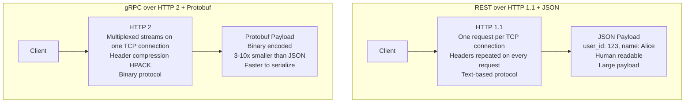
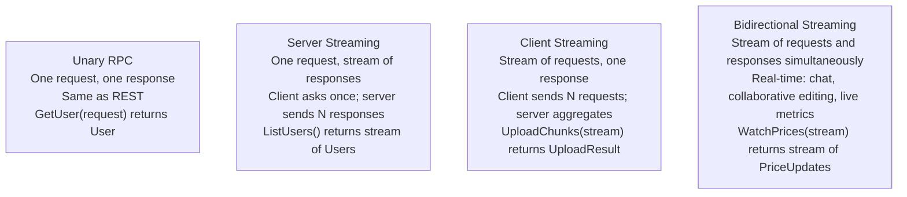
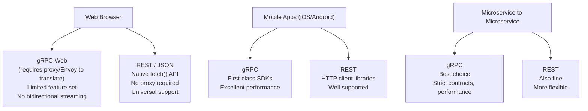

# REST vs gRPC

REST over HTTP/1.1 with JSON is the most widely used API communication style — human-readable, easy to debug, and universally supported. gRPC is a high-performance RPC framework developed by Google that uses HTTP/2 for transport and Protocol Buffers for serialization — it is faster, more efficient, and provides a strict contract between services, but requires more tooling. The choice between them is primarily about whether you are building a public-facing API or internal microservice communication.

> **Why this matters in interviews:** When designing microservice architectures, the communication mechanism between services is a key design decision. Interviewers ask about synchronous inter-service communication specifically, and gRPC vs REST is the central comparison. Knowing the performance difference (2-10× faster with gRPC), the streaming capabilities, and the browser compatibility limitations shows production engineering experience.

---

## How They Differ at the Transport Layer



---

## Protocol Buffers — The Contract-First Approach

gRPC uses Protocol Buffers (protobuf) as its Interface Definition Language (IDL). You define services and messages in `.proto` files, then generate client and server code for any supported language:

```protobuf
// user.proto
syntax = "proto3";

package user;

service UserService {
  rpc GetUser (GetUserRequest) returns (User);
  rpc ListUsers (ListUsersRequest) returns (stream User);  // server streaming
  rpc UpdateUser (User) returns (User);
  rpc WatchUser (GetUserRequest) returns (stream UserEvent);  // server push
}

message GetUserRequest {
  string user_id = 1;
}

message User {
  string id = 1;
  string name = 2;
  string email = 3;
  int64 created_at = 4;  // Unix timestamp
}

message ListUsersRequest {
  int32 page_size = 1;
  string page_token = 2;
}

message UserEvent {
  string user_id = 1;
  string event_type = 2;  // "profile_updated", "account_suspended"
}
```

Run `protoc --go_out=. user.proto` to generate Go client/server stubs. The generated code handles serialization, deserialization, and type-safe method calls. The `.proto` file becomes the source of truth — both client and server are generated from the same contract.

---

## gRPC Streaming Modes

gRPC's superpower over REST is native bidirectional streaming over a single HTTP/2 connection:



Bidirectional streaming enables use cases that are very hard with REST: real-time dashboards pushing data to many clients simultaneously, multiplayer game state synchronization, live collaborative document editing.

---

## Performance Comparison

| Dimension               | REST + JSON                                         | gRPC + Protobuf                        | Difference                  |
| ----------------------- | --------------------------------------------------- | -------------------------------------- | --------------------------- |
| **Serialization speed** | Moderate (text parsing)                             | Very fast (binary)                     | 5-10× faster                |
| **Payload size**        | Large (human-readable)                              | Small (binary)                         | 3-10× smaller               |
| **Connection overhead** | HTTP/1.1 (new connection per request or keep-alive) | HTTP/2 (multiplexed on one connection) | Significantly less overhead |
| **Header overhead**     | Repeated on every request                           | HPACK compressed                       | ~80% reduction              |
| **Latency**             | Good                                                | Excellent                              | 2-5× lower in benchmarks    |
| **Throughput**          | Good                                                | Excellent                              | 5-10× higher in benchmarks  |

**Real numbers from Uber (published 2021):** Switching internal microservices from HTTP+JSON to gRPC reduced P99 latency by 50% and CPU usage by 30% for their high-frequency services.

---

## Browser and Ecosystem Compatibility



**gRPC-Web** requires a proxy (typically Envoy sidecar) to translate between the browser's HTTP/1.1 and gRPC's HTTP/2. It does not support bidirectional streaming from browsers. For browser-facing APIs, REST remains the simpler choice.

---

## Comparison Summary

| Dimension           | REST + JSON                              | gRPC + Protobuf                                         |
| ------------------- | ---------------------------------------- | ------------------------------------------------------- |
| **Protocol**        | HTTP/1.1 or HTTP/2                       | HTTP/2                                                  |
| **Serialization**   | JSON (text, human-readable)              | Protobuf (binary, schema-defined)                       |
| **API contract**    | Optional (OpenAPI/Swagger)               | Mandatory (`.proto` file)                               |
| **Browser support** | Native                                   | Requires gRPC-Web + proxy                               |
| **Streaming**       | SSE (server-to-client only) or WebSocket | Native 4-way streaming                                  |
| **Code generation** | Optional (OpenAPI codegen)               | Native and essential                                    |
| **Debugging**       | Easy — curl, Postman, browser DevTools   | Harder — binary protocol, need grpcurl                  |
| **Error handling**  | HTTP status codes (standardized)         | gRPC status codes (16 defined codes)                    |
| **Versioning**      | URL versioning, header versioning        | Additive proto changes (backward compatible)            |
| **Best for**        | Public APIs, browser clients, simplicity | Internal microservices, performance-critical, streaming |

---

## When to Choose Each

**Choose REST when:**

- Public API that third parties will consume — they expect REST, have existing HTTP clients
- Browser-based frontend is the primary client — no gRPC-Web proxy complexity
- Human debugging and exploration matter (curl, Postman, browser DevTools)
- Caching at CDN or HTTP proxy layer is important
- Team is less experienced with protobuf and code generation
- Simple CRUD operations with no performance bottleneck

**Choose gRPC when:**

- Internal microservice-to-microservice communication
- Performance is critical — high throughput, low latency, many calls per second
- Strong API contracts are important — the protobuf schema enforces compatibility at compile time
- Streaming is needed — real-time data push, large file upload in chunks, bidirectional chat
- Polyglot microservices — generate type-safe clients for Go, Python, Java, Rust from one `.proto` file

---

## Interview Talking Points

**1. Why is gRPC faster than REST, and when does this performance difference matter?**

> "gRPC is faster for three reasons. First, Protocol Buffers binary serialization is 3-10× smaller than JSON and 5-10× faster to encode/decode — no string parsing, just direct binary memory mapping. Second, HTTP/2 multiplexes multiple requests on a single TCP connection with header compression, eliminating connection setup overhead for high-frequency calls. Third, gRPC allows streaming, so instead of 1,000 separate request-response cycles, you can maintain one stream and push 1,000 events. The performance difference matters most when services make many calls per second to each other. If Service A calls Service B 10,000 times per second, the CPU and latency savings are significant. If it's 10 calls per second, the difference is negligible and REST's simplicity wins. I apply gRPC between high-frequency internal services and REST for all public APIs."

**2. What are Protocol Buffers and why are they valuable beyond performance?**

> "Protocol Buffers are a language-neutral, platform-neutral interface definition language and binary serialization format. You define messages and services in a `.proto` file, run the protoc compiler, and get type-safe client and server code in any language. The performance benefit (smaller, faster binary format) is real, but the contract benefit is arguably more valuable at scale. The `.proto` file is the authoritative schema — both client and server are generated from the same source. If I change the server's User message to remove the email field, the compilation of the client stubs fails, catching the breaking change at build time rather than at runtime production failure. Field numbers in proto3 allow additive backward-compatible changes: adding new fields doesn't break old clients (they ignore unknown fields). This schema-first approach enforces API discipline across polyglot teams working in Go, Python, Java, and Rust."

**3. When would you NOT use gRPC for internal microservices?**

> "gRPC's tooling for debugging is significantly worse than REST. With REST, I can curl any endpoint, inspect responses in the browser, use Postman — very low friction. With gRPC, I need grpcurl, need the proto descriptor available, and the binary encoding makes traffic inspection harder in Wireshark or tcpdump. For teams in early-stage development where rapid iteration and debugging speed matter more than raw performance, REST is often the better developer experience. Additionally, some API gateway and service mesh tools have better REST support than gRPC. If you need gRPC-Web for browser access, you must deploy and maintain an Envoy proxy — operational complexity not present with REST. My rule of thumb: new microservices at companies with fewer than 50 engineers should start with REST. The performance optimization of switching to gRPC can be applied later when you have a measured bottleneck and a mature operations team."

**4. How do you handle backward compatibility in gRPC APIs?**

> "Protobuf is designed for backward-compatible evolution with a few rules. Safe changes: adding new fields with new field numbers (old clients ignore unknown fields; old servers leave new fields at default values), adding new RPC methods, adding enum values. Breaking changes: removing or renaming fields (old clients have no default for the removed field), changing field types incompatibly, changing field numbers (the number is how protobuf identifies fields in binary encoding, not the name). The strategy is: never remove or renumber fields — instead mark them `reserved` to prevent reuse. Never change field types. For removing a feature, add a new field alongside the old one, migrate clients to the new field, then mark the old field deprecated (and later reserved). For major version changes, you can namespace with package versions in the proto file (e.g., `package user.v2`) and run both versions simultaneously during the migration window, which is the equivalent of REST's URL versioning."

---

## Key Takeaways

- **REST + JSON** is human-readable, universally supported, browser-native, and simple — ideal for public APIs
- **gRPC + Protobuf** is binary, schema-first, 2-10× faster, and has native streaming — ideal for internal microservice communication
- **Protocol Buffers** provide a mandatory typed contract — breaking changes caught at compile time, not runtime
- **HTTP/2** multiplexing and HPACK header compression reduce connection and header overhead significantly
- **gRPC streaming** (4 modes) enables real-time data push, bidirectional communication, and large transfers — native vs REST's workarounds
- **Browser compatibility:** gRPC requires gRPC-Web + Envoy proxy — REST is simpler for browser clients
- **Debugging REST:** curl, Postman, browser DevTools; **Debugging gRPC:** grpcurl, binary traffic, higher friction
- **Choose REST** for public APIs, browser clients, simple CRUD; **choose gRPC** for internal high-frequency microservice calls, performance-critical paths, streaming needs
