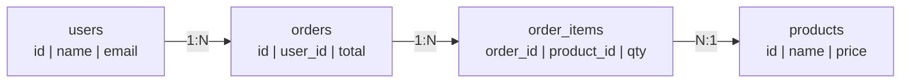
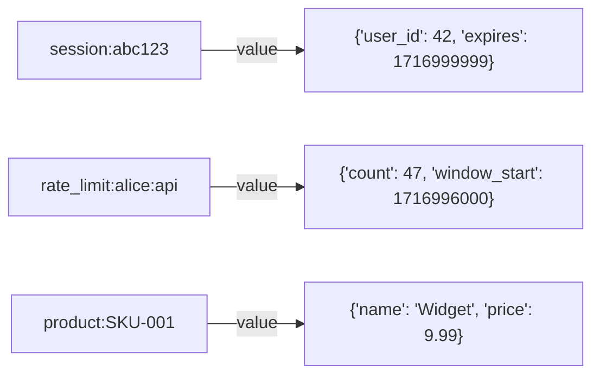
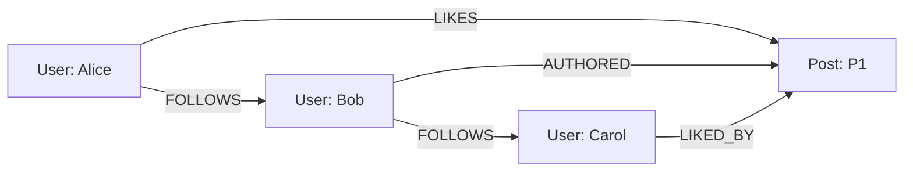
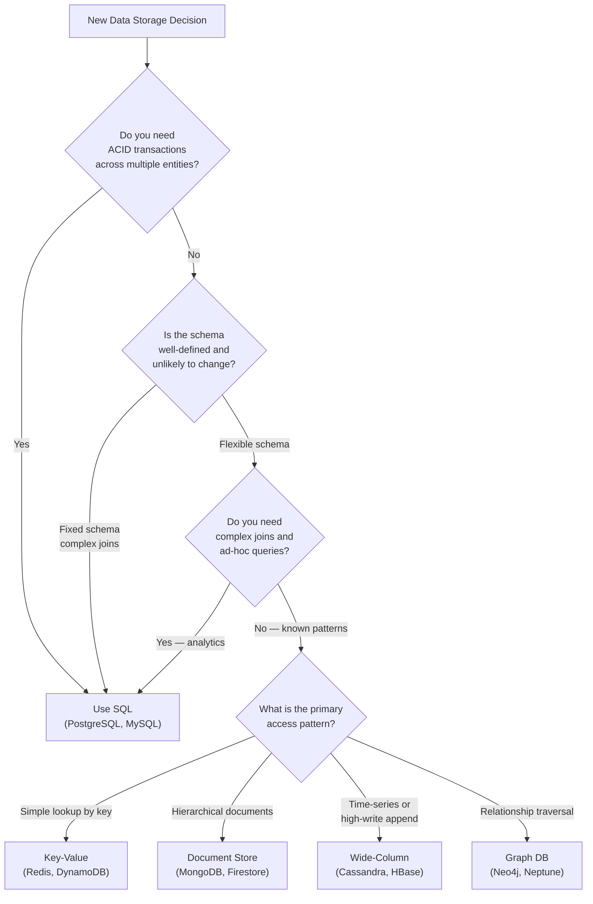

# SQL vs NoSQL

The choice between relational (SQL) and non-relational (NoSQL) databases is one of the most consequential architectural decisions in system design. SQL databases organize data into structured tables with strict schemas and powerful query languages built on decades of research. NoSQL databases — a broad family including document, key-value, wide-column, and graph stores — sacrifice some relational features in exchange for flexible schemas, horizontal scalability, and optimized access patterns for specific workloads. Neither is universally better; the right choice depends entirely on your data model, query patterns, and scaling requirements.

> **Why this matters in interviews:** Nearly every system design question involves a database choice. Interviewers expect you to articulate *why* you choose a database, not just *what* you choose. "I'd use PostgreSQL because it's reliable" is a weak answer. "I'd use PostgreSQL for the transactional order processing, and Cassandra for the time-series event log because it needs time-range queries at high write throughput without joins" shows engineering judgment.

---

## Core Philosophies

```mermaid
graph TD
    subgraph "SQL / Relational"
        S1["Structured tables with fixed schema"]
        S2["Relations via foreign keys and JOINs"]
        S3["ACID transactions across multiple tables"]
        S4["Vertical scaling (bigger machines)"]
        S5["Powerful ad-hoc queries (SQL)"]
        S1---S2---S3---S4---S5
    end

    subgraph "NoSQL / Non-Relational"
        N1["Flexible schema (schema-per-document or schemaless)"]
        N2["Data often denormalized and co-located"]
        N3["Usually BASE — eventual consistency"]
        N4["Horizontal scaling (more machines)"]
        N5["Optimized for specific access patterns"]
        N1---N2---N3---N4---N5
    end
```



---

## ACID vs BASE

| Property | ACID (SQL) | BASE (NoSQL) |
|---|---|---|
| **A — Atomicity** | All operations in a transaction succeed or all fail | Not guaranteed across operations |
| **C — Consistency** | Database always moves from one valid state to another | **Basically Available** — system is always available |
| **I — Isolation** | Concurrent transactions don't interfere | **Soft state** — state may change without input (replication) |
| **D — Durability** | Committed data survives crashes | **Eventual consistency** — data converges over time |

ACID is the foundation of financial systems, inventory, and any domain where data correctness is non-negotiable. BASE is the foundation of high-scale systems where availability and partition tolerance are prioritized over immediate consistency.

---

## SQL Database Characteristics

SQL databases (PostgreSQL, MySQL, Oracle, SQL Server) excel when:



**Strengths:**
- **Joins:** Query across related tables without denormalizing data
- **ACID transactions:** Transfer $100 from account A to B atomically — either both happen or neither does
- **Flexible queries:** Ad-hoc analytics, complex aggregations, window functions — SQL can answer questions you haven't anticipated at schema design time
- **Referential integrity:** Foreign key constraints guarantee data consistency at the database level
- **Mature ecosystem:** Decades of tooling, ORMs, query optimizers, and operational knowledge

**Limitations:**
- **Schema changes are painful at scale:** Adding a column to a 500-million-row table locks it (historically; online DDL mitigates this)
- **Horizontal write scaling is hard:** Sharding SQL databases is complex; joins across shards become expensive or impossible
- **Fixed schema:** Data that doesn't fit the schema requires alter table migrations

**When to choose SQL:** Financial transactions, e-commerce order processing, user account management, anything requiring complex relational queries, regulated industries requiring ACID guarantees.

---

## NoSQL Database Types

### Key-Value Stores (Redis, DynamoDB, Memcached)



**Best for:** Session storage, caching, rate limiting counters, feature flags, leaderboards (Redis sorted sets), pub/sub messaging.  
**Not for:** Complex queries, relationships, aggregations.

### Document Stores (MongoDB, Firestore, CouchDB)

Data stored as JSON/BSON documents — the document contains all related data, avoiding joins:

```json
{
  "_id": "order_123",
  "user_id": "user_456",
  "status": "shipped",
  "items": [
    {"product_id": "SKU-001", "name": "Widget", "qty": 2, "price": 9.99},
    {"product_id": "SKU-002", "name": "Gadget", "qty": 1, "price": 29.99}
  ],
  "shipping_address": {
    "street": "123 Main St",
    "city": "Austin",
    "zip": "78701"
  },
  "created_at": "2024-05-01T10:00:00Z"
}
```

**Best for:** Content management, catalogs, user profiles, hierarchical data, evolving schemas.  
**Not for:** Multi-document transactions (improving, but historically weak), complex cross-document joins.

### Wide-Column Stores (Cassandra, HBase, Bigtable)

Data organized by row key and column families — optimized for time-series and high-throughput writes:

```
Row Key: user_123#2024-05-01
  column_family: events {
    "2024-05-01T10:00:00Z": "login",
    "2024-05-01T10:05:00Z": "view_product_SKU-001",
    "2024-05-01T10:07:30Z": "add_to_cart",
    "2024-05-01T10:15:00Z": "checkout"
  }
```

**Best for:** Time-series data, IoT sensor readings, activity logs, analytics at petabyte scale, high-throughput writes distributed across nodes.  
**Not for:** Complex joins, ad-hoc queries, small datasets.

### Graph Databases (Neo4j, Amazon Neptune, ArangoDB)

Data modeled as nodes and edges — optimal for relationship traversal:



**Query:** "Find all posts liked by people Alice follows" — trivially expressed as a graph traversal; nightmarishly complex as SQL JOINs.

**Best for:** Social graphs, recommendation engines, fraud detection, knowledge graphs, network topology.  
**Not for:** Standard CRUD, bulk analytics, time-series.

---

## Scaling Comparison

| Dimension | SQL | NoSQL |
|---|---|---|
| **Vertical scaling** | Excellent — add more RAM/CPU to one machine | Good — less critical due to horizontal design |
| **Horizontal read scaling** | Read replicas (standard pattern) | Native — designed for horizontal reads |
| **Horizontal write scaling** | Hard — complex sharding, no cross-shard joins | Native — most NoSQL designed for write distribution |
| **Typical scale** | Hundreds of millions of rows (with tuning) | Billions of records (horizontal sharding built-in) |
| **Write throughput** | ~10K-100K writes/sec (high-end with tuning) | 1M+ writes/sec (Cassandra at scale) |

---

## Decision Framework



---

## Real-World Database Choices

| System | Database | Why |
|---|---|---|
| **Netflix metadata** | MySQL + Cassandra | MySQL for transactional user data; Cassandra for viewing history at scale |
| **Twitter timeline** | Redis + MySQL | Redis for in-memory home timeline cache; MySQL for user/tweet storage |
| **Uber trips** | MySQL + Schemaless (Cassandra-based) | MySQL for mutable trip state; Schemaless for immutable append-only trip events |
| **Airbnb listings** | MySQL | Complex queries, ACID for bookings |
| **LinkedIn connections** | Oracle + Espresso (document) + Voldemort (KV) | Polyglot persistence for different needs |
| **Instagram** | PostgreSQL | Relational data model with strong tooling |
| **Facebook Messenger** | HBase (wide-column) | Billions of messages, time-ordered per conversation |

---

## Interview Talking Points

**1. When would you choose SQL over NoSQL?**
> "I choose SQL when: the data has clear relationships that benefit from JOINs (users → orders → products), when the operations require ACID transactions across multiple entities (a payment deducting from one account and crediting another must be atomic), when I need complex ad-hoc queries and the query patterns aren't fully known upfront (analytics dashboards, admin panels), or when the team and organization have strong SQL expertise. PostgreSQL specifically is my default choice — it handles relational workloads excellently, has excellent JSON support for semi-structured data, scales well with read replicas, and has decades of production reliability. I only move away from SQL when I hit a specific wall: write throughput that exceeds what vertical scaling can provide, extremely high cardinality time-series data, or a data model that is fundamentally graph-shaped."

**2. When would you choose Cassandra over PostgreSQL?**
> "Cassandra excels at three things: very high write throughput distributed across many nodes, time-series or time-ordered data by row key, and active-active multi-region replication. I'd choose Cassandra for a user activity event log that receives 500K events per second and needs to be queryable by user ID and time range — Cassandra's partitioning by user_id and clustering by timestamp makes this extremely efficient. PostgreSQL at that write volume would require complex sharding and would struggle with cross-shard queries. The tradeoff I accept with Cassandra: no ad-hoc queries (must design tables around query patterns), no JOINs, eventual consistency by default, and operational complexity. A common mistake: choosing Cassandra because of 'scale' when your data is actually 10 million rows that PostgreSQL handles trivially. Always start with PostgreSQL; migrate to Cassandra when you have a proven bottleneck."

**3. What is polyglot persistence and when would you use it?**
> "Polyglot persistence means using different databases for different parts of the same system, each chosen for the specific requirements of that data. A real example: an e-commerce platform might use PostgreSQL for orders and user accounts (ACID, complex queries), Redis for session storage and shopping carts (sub-millisecond lookup by key), Elasticsearch for product search (full-text search, faceted filtering), Cassandra for product view events and analytics (high-volume time-series writes), and Neo4j for product recommendations (graph traversal for 'users who bought X also bought Y'). The benefit: each component is optimally designed for its specific access pattern. The cost: operational complexity — five different databases to manage, monitor, backup, and scale. I apply polyglot persistence when a single database genuinely cannot meet the requirements of all components, not as a default. The additional operational burden must be justified by genuine performance or capability requirements."

**4. How do you handle schema migrations in SQL databases at scale?**
> "Schema migrations in SQL at scale are genuinely hard. The naive approach — `ALTER TABLE users ADD COLUMN phone_number VARCHAR(20)` — on a 500-million-row table acquires an exclusive lock and takes hours. Modern approaches: First, use online DDL — MySQL 8 and PostgreSQL support non-blocking DDL for many operations using shadow table techniques. Second, blue-green schema migrations: deploy code that works with both old and new schema, run the migration online, verify, then remove old column support. Third, ghost/pt-online-schema-change: tools that create a shadow table, copy data in batches, and swap atomically. Fourth — and this is where NoSQL shines — document stores sidestep the problem. MongoDB documents can have different fields without a table lock. New code reads both old and new format; a background job migrates old documents. For truly massive tables, I prefer the expand-contract migration pattern: add column (nullable, no lock), backfill in batches as background job, make non-nullable after backfill completes, finally remove old column."

---

## Key Takeaways

- **SQL** excels at structured relational data, ACID transactions, complex JOINs, and flexible ad-hoc queries — default choice for most applications
- **NoSQL** is a family, not a monolith: key-value (Redis), document (MongoDB), wide-column (Cassandra), graph (Neo4j) — each optimized for specific patterns
- **ACID vs BASE:** SQL guarantees atomicity/consistency/isolation/durability; NoSQL typically offers basic availability, soft state, eventual consistency
- **Horizontal write scaling** is the primary advantage of NoSQL — Cassandra can distribute millions of writes/sec across hundreds of nodes
- **Schema flexibility** in document stores enables evolving data models without table locks or downtime
- **Polyglot persistence** — use SQL for transactions, Redis for caching, Cassandra for events, Elasticsearch for search — is common in large systems
- **Start with PostgreSQL**; migrate to NoSQL when you have a specific, proven bottleneck — not preemptively
