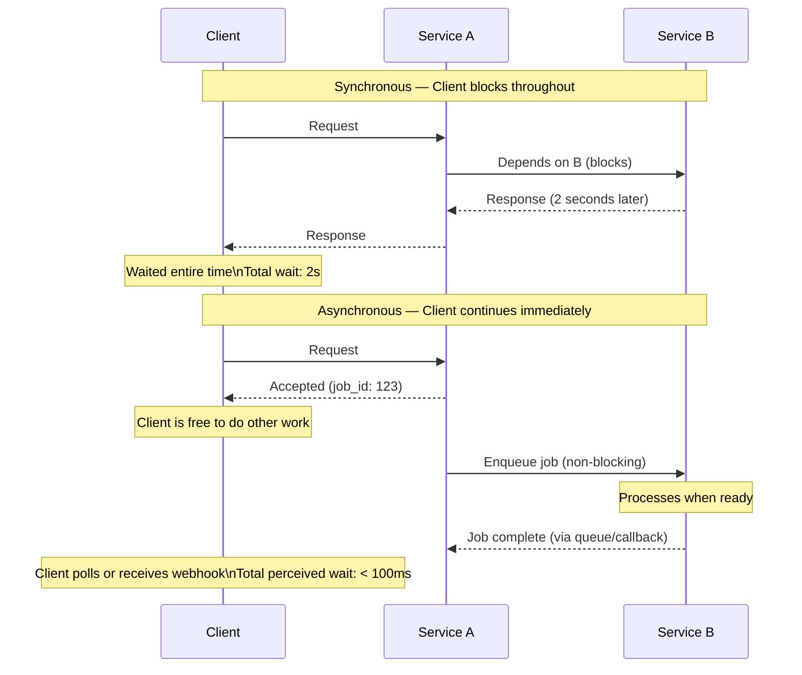
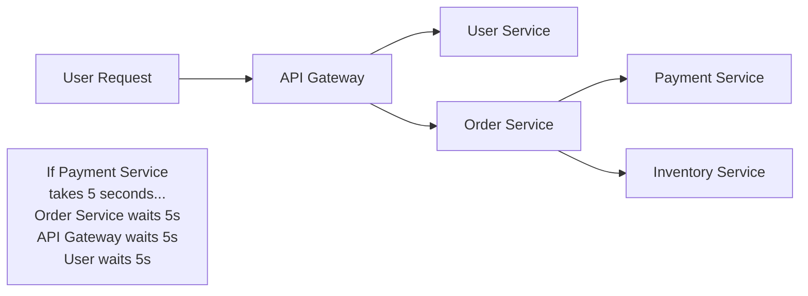
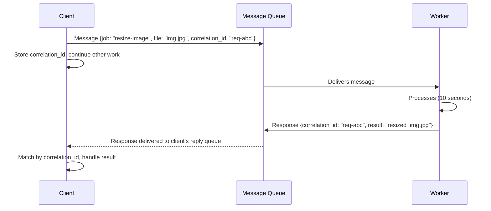
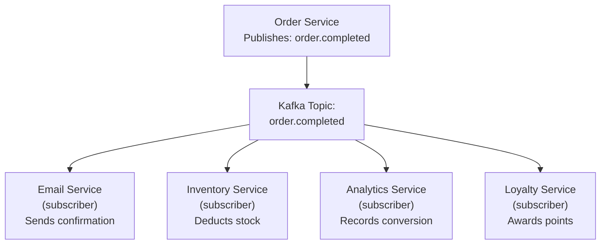
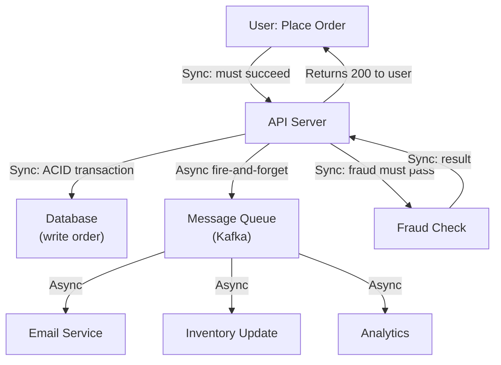

# Synchronous vs Asynchronous

Synchronous communication blocks the caller until the operation completes — the caller sends a request and waits for the response before doing anything else. Asynchronous communication allows the caller to continue other work while waiting — the response arrives via callback, event, or polling. This distinction shapes how systems handle load, failures, and coupling between services, and choosing between them is one of the most consequential architectural decisions in system design.

> **Why this matters in interviews:** Sync vs async is a fundamental architectural axis. When you design a checkout flow, an image processing pipeline, or a notification system, you must explicitly decide which operations should be synchronous (blocking the user) and which should be async (fire-and-forget or deferred). Interviewers probe this to test whether you think about user experience, failure isolation, and system decoupling holistically.

---

## The Core Difference



---

## Synchronous Patterns

### Request-Response (HTTP/REST, gRPC)

The simplest and most natural pattern. Client sends a request; blocks; receives response. Everything is coupled in time.

**Advantages:**
- Simple to reason about: linear code flow
- Error handling is straightforward: if the request fails, you know immediately
- Strong consistency: response confirms the operation completed
- Easy to test and debug

**Disadvantages:**
- **Cascading failures:** If Service B is slow, Service A becomes slow, which makes the client slow. One slow dependency degrades the entire call chain
- **Resource blocking:** Threads are held open waiting for I/O — limits concurrency
- **Tight coupling:** Service A must be available and performant for Service B's calls to succeed
- **Timeout complexity:** How long should Service A wait before giving up? Too short → unnecessary failures; too long → resources held indefinitely



---

## Asynchronous Patterns

### Fire-and-Forget

Caller sends a message and does not wait for or care about the result. Used for non-critical notifications, logging, and audit events:

```python
def place_order(order):
    # Synchronous: create the order in DB
    order_id = db.create_order(order)
    
    # Asynchronous fire-and-forget: send confirmation email
    # Don't block the response on email delivery
    event_bus.publish("order.created", {
        "order_id": order_id,
        "user_email": order.email
    })  # Returns immediately — email service consumes this later
    
    return {"order_id": order_id, "status": "confirmed"}  # Fast response to user
```

### Request-Reply Async (Correlation ID)

Caller sends a message with a correlation ID; response comes back via a reply queue:



### Publish-Subscribe (Event-Driven)

Producers emit events to a topic; multiple consumers react independently:



**The key property:** The Order Service does not know about any of the subscribers. Adding a new subscriber (e.g., a fraud detection service) requires zero changes to the Order Service. This is **loose coupling** — one of the primary benefits of async event-driven architecture.

---

## Failure Handling: The Critical Difference

| Scenario | Synchronous | Asynchronous |
|---|---|---|
| **Email service down** | Order placement fails (user sees error) | Order placed; email retried when service recovers |
| **Inventory service slow (5s)** | User waits 5+ seconds at checkout | Inventory update happens after order response |
| **Payment service crashes mid-request** | Uncertain state — payment may have charged but order not created | Message remains in queue; worker retries with idempotency key |
| **10× traffic spike** | All services must scale simultaneously | Queue absorbs spike; workers process at their own rate |

**Async systems are more resilient to partial failures** because the message queue acts as a buffer. The sender succeeds even if the receiver is temporarily unavailable. The receiver processes when it recovers.

**But async adds complexity:** you must handle duplicate message delivery (idempotency), out-of-order processing, and dead letter queues for poison messages.

---

## When to Choose Sync vs Async

| Use Sync When | Use Async When |
|---|---|
| User is waiting for the result (checkout confirmation, login) | Work can complete after the user response (email, analytics) |
| Strong consistency required (payment deduction, inventory reservation) | Decoupling between services is valuable |
| Simple error handling needed (know immediately if it failed) | Processing load varies and needs buffering |
| Low latency critical (<100ms SLA) | Long-running jobs (video transcoding, ML training) |
| Two services always need to co-evolve | Services should scale and fail independently |

---

## Hybrid Architecture: The Practical Pattern

Most production systems use sync for the user-facing critical path and async for everything else:



The user gets a fast response (synchronous database write + fraud check). All downstream effects (email, inventory sync, analytics) happen asynchronously without blocking the user.

---

## Interview Talking Points

**1. When should you use asynchronous communication between microservices?**
> "I use async communication when: the downstream operation does not need to complete before responding to the user (sending a confirmation email can happen after the order is confirmed), when decoupling the services' availability and scaling is valuable (the email service going down should not prevent orders from being placed), or when the operation is long-running (video transcoding, report generation, ML inference). The key test is: does the user or the business workflow need the result of this operation before moving forward? If yes, keep it synchronous. If no, make it async. A practical example: in a checkout flow, the payment charge must be synchronous (user must know if it succeeded), the order record creation must be synchronous (user needs the order ID), but sending the confirmation email, updating analytics, and awarding loyalty points can all be async events. This makes the synchronous critical path much faster and more resilient."

**2. What are the challenges of asynchronous systems and how do you address them?**
> "The main challenges: First, idempotency — message queues guarantee at-least-once delivery, so your consumers must handle duplicate messages correctly. I use an idempotency key (the message ID or a business-level ID) to detect and skip already-processed messages. Second, ordering — messages may arrive out of order, especially with parallel consumers. If order matters, use a single consumer per partition (Kafka partitioning by entity ID guarantees ordering within a partition). Third, dead letter queues — some messages will fail processing repeatedly (malformed data, downstream service bug). These must go to a dead letter queue for inspection and reprocessing rather than blocking the queue forever. Fourth, eventual consistency — downstream consumers may lag, causing temporary inconsistencies visible to the user. I address this by setting user expectations (show a spinner for async operations) or using read-your-writes caching to make the state update appear immediate."

**3. How does async architecture help with traffic spikes?**
> "A message queue acts as a buffer that decouples production rate from consumption rate. During a traffic spike, producers write messages to the queue at whatever rate they arrive. The queue absorbs the spike. Consumers process at their natural throughput — limited by their compute and database capacity. Without the queue, a 10× traffic spike would require all downstream services to scale 10× simultaneously or start failing. With a queue, only the API layer that accepts incoming requests needs to handle the spike. The downstream services drain the queue at their own pace — maybe taking 5 minutes to process a 30-second spike. This pattern is used by every large e-commerce platform for flash sales: the order service writes to a queue immediately, and the inventory, payment, and fulfillment services consume at controlled rates. The user gets an immediate 'order queued' confirmation rather than a 503 error."

**4. Describe the outbox pattern and why it's important for async systems.**
> "The outbox pattern solves a fundamental problem in async systems: how do you atomically update your database AND publish a message to a queue? Without it, you might update the DB and then the message publish crashes — the downstream consumers never know about the update. Or the message publishes but the DB write fails — consumers process an event that was never actually committed. The outbox pattern: instead of publishing directly to Kafka, write the event as a row in an 'outbox' table in the same database transaction as your business data write. A separate relay process reads from the outbox table and publishes to Kafka, then marks the row as published. Because the outbox write is part of the same ACID transaction as the business write, it's atomic. If the relay crashes, it replays from the last unpublished row on restart. This guarantees exactly the at-least-once delivery semantics that consumers already handle via idempotency — the event is never lost."

---

## Key Takeaways

- **Sync** blocks the caller until completion — simple, consistent, but creates tight coupling and cascading failure risk
- **Async** lets the caller continue immediately — adds resilience and decoupling but requires idempotency and dead letter queue handling
- **Fire-and-forget** for non-critical side effects (email, analytics, notifications)
- **Pub/sub** for loose coupling between services — producer has no knowledge of consumers; new consumers can be added with zero producer changes
- **Async buffers traffic spikes:** queue absorbs bursts, consumers process at controlled rates
- **Critical user-facing path should stay synchronous** (payment, order creation, authentication); delegate everything else to async
- **Outbox pattern** ensures atomic DB write + event publication — prevents message loss without distributed transactions
- **Idempotency keys** are mandatory for async systems — queues guarantee at-least-once delivery, consumers must be safe to call multiple times
