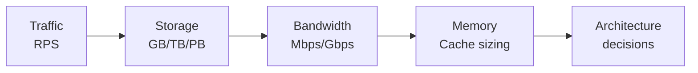

# Back-of-Envelope Calculations

A back-of-envelope (BOE) calculation is a quick, approximate estimate done with simple arithmetic. In system design, it answers the most critical early question:

> **What order of magnitude are we dealing with — and what architecture does that imply?**

You don't need spreadsheets or exact numbers. You need to be within one order of magnitude, and you need to do it in under 3 minutes.

---

## Why BOE Calculations Matter

The same feature requires radically different architecture at different scales:

| Scale         | Architecture                                               |
| ------------- | ---------------------------------------------------------- |
| 100 RPS       | Single server, single database                             |
| 10,000 RPS    | Load balancer + multiple servers + read replicas           |
| 100,000 RPS   | Caching layer, sharding, CDN                               |
| 1,000,000 RPS | Full distributed system, horizontal sharding, multi-region |

Without estimation, you might design a distributed system for an app that 500 people use — or worse, a single-server system for millions of users.

---

## The Four Things You Always Estimate



---

## Step-by-Step Process

### Step 1 — Get the base numbers from the interviewer

```
DAU (Daily Active Users):        ?
Requests per user per day:       ?
Data size per request:           ?
Read : Write ratio:              ?
```

### Step 2 — Calculate Traffic (RPS)

```
Total requests/day = DAU × requests per user
RPS (average)      = Total requests/day ÷ 86,400
RPS (peak)         = Average RPS × 2 to 3
```

### Step 3 — Calculate Storage

```
Storage/day = writes per day × data size per record
Total storage = storage/day × retention period × replication factor
```

### Step 4 — Calculate Bandwidth

```
Inbound bandwidth  = write RPS × request size
Outbound bandwidth = read RPS × response size
```

### Step 5 — Calculate Cache Memory

```
Cache memory = hot data fraction × total working set
              (typically top 20% of data serves 80% of reads)
```

---

## Reference Numbers Cheat Sheet

### Time

```
1 minute  =        60 sec
1 hour    =     3,600 sec
1 day     =    86,400 sec  ≈ 10⁵
1 month   = 2,500,000 sec  ≈ 2.5 × 10⁶
1 year    =31,500,000 sec  ≈ 3 × 10⁷
```

### Storage Units

```
1 KB = 1,000 bytes     (or 1,024 for binary)
1 MB = 1,000 KB
1 GB = 1,000 MB
1 TB = 1,000 GB
1 PB = 1,000 TB
```

### Common Data Sizes

```
UUID / user ID:          16 bytes
Short text (tweet):     280 bytes
Average URL record:     500 bytes
Web page (HTML):          2 MB
Compressed image:       300 KB – 1 MB
HD photo (JPEG):          3 – 8 MB
1-min audio (MP3):        1 MB
1-min video (720p):      10 MB
1-hr video (1080p):       2 GB
```

### Throughput Benchmarks

```
Single web server:           ~10,000 RPS
Single PostgreSQL:            ~5,000 QPS (simple queries)
Single Redis:             ~100,000 ops/sec
Single Kafka broker:      ~500,000 msg/sec
Single SSD:               ~100,000 IOPS
```

---

## Worked Examples

### Example 1: Twitter

**Given:** 300M DAU, each user reads 50 tweets/day, posts 1 tweet/week

**Traffic:**

```
Read requests/day  = 300M × 50   = 15B reads/day
Read RPS (avg)     = 15B ÷ 86,400 ≈ 174,000 RPS
Write requests/day = 300M ÷ 7    ≈ 43M writes/day
Write RPS (avg)    = 43M ÷ 86,400 ≈ 500 RPS
Read : Write       ≈ 350:1 → extremely read-heavy
```

**Storage:**

```
Tweet size                 = 280 bytes text + 500 bytes metadata ≈ 1 KB
Tweets/day                 = 43M
Storage/day                = 43M × 1 KB = 43 GB/day
With media (30% have imgs) = +43M × 0.3 × 500 KB ≈ 6.5 TB/day
10-year storage (text only)= 43 GB × 3,650 ≈ 157 TB
Replication (3x)           = ~470 TB for text
```

**Conclusions:**

- 174K read RPS → need aggressive caching, not just a database
- 350:1 read/write → fan-out on write strategy for feed generation
- Petabytes of storage → object storage for media, not relational DB

---

### Example 2: YouTube

**Given:** 2B DAU, each user watches 5 videos/day, 500 hours of video uploaded per minute

**Traffic:**

```
Video views/day   = 2B × 5 = 10B views/day
View RPS          = 10B ÷ 86,400 ≈ 116,000 RPS
Upload rate       = 500 hrs/min × 60 min/hr × 10 MB/min ≈ 300 GB/min uploaded
                  = 5 GB/sec inbound
```

**Bandwidth (outbound):**

```
Avg video bitrate = 5 Mbps (1080p)
Concurrent viewers = 116,000 (at any given second, some fraction are mid-stream)
Active streams at any moment ≈ 10M (from DAU spread across day)
Bandwidth = 10M × 5 Mbps = 50 Tbps outbound
```

**Storage:**

```
Upload/day            = 500 × 60 × 24 hrs = 720,000 hrs/day
Storage (raw)         = 720,000 × 2 GB/hr = 1.44 PB/day (raw)
After transcoding (5 resolutions + compression): ~3–5 GB per hr of video
Final storage/day     ≈ 720,000 × 4 GB = 2.88 PB/day
```

**Conclusions:**

- 50 Tbps outbound → only achievable with a massive global CDN
- Multi-petabyte daily ingestion → distributed object storage (not file servers)
- 5 encoding variants per video → async processing pipeline, not synchronous upload

---

### Example 3: URL Shortener

**Given:** 100M DAU, 10 redirects/user/day, 1 new URL per user per week

**Traffic:**

```
Redirects/day   = 100M × 10 = 1B reads/day
Read RPS (avg)  = 1B ÷ 86,400 ≈ 11,600 RPS
Read RPS (peak) = ~35,000 RPS
Writes/day      = 100M ÷ 7 ≈ 14M writes/day
Write RPS       = 14M ÷ 86,400 ≈ 162 RPS
Read:Write      = ~70:1
```

**Storage:**

```
URL record size = 500 bytes (short code + long URL + metadata)
Writes/day      = 14M
Storage/day     = 14M × 500 bytes = 7 GB/day
5-year total    = 7 GB × 365 × 5 = 12.8 TB
With replication (3x) = ~38 TB
```

**Cache sizing:**

```
Working set (hot URLs) = top 20% of URLs = 12.8 TB × 0.2 = 2.56 TB
Redis node size        = 256 GB typical
Nodes needed           = 2.56 TB ÷ 256 GB ≈ 10 Redis nodes
```

**Conclusions:**

- 35K peak RPS reads → Redis cache essential (DB alone can't handle it)
- 162 write RPS → single write DB is fine for now
- 38 TB total → standard relational DB can handle this with proper sharding

---

## Common Estimation Mistakes

| Mistake                       | Example                               | Fix                                         |
| ----------------------------- | ------------------------------------- | ------------------------------------------- |
| Using average instead of peak | "1,200 RPS average"                   | Multiply by 2–3 for peak                    |
| Forgetting replication        | "10 TB storage"                       | Multiply by replication factor (3x typical) |
| Ignoring media                | "1 KB per user record"                | Ask if there are images/videos              |
| Wrong time unit               | Computing per hour instead of per day | Always normalize to per-second              |
| Not stating assumptions       | Just showing numbers                  | Say "I'll assume 80/20 read-write split"    |

---

## The Quick Reference Card

Print this mentally before every interview:

```
Given DAU and requests/user:
  RPS = DAU × requests ÷ 86,400
  Peak = RPS × 3

Given writes/day and record size:
  Storage/day = writes × size
  Total = storage/day × retention × 3 (replication)

Given read RPS and response size:
  Bandwidth = RPS × response_size

Cache sizing:
  = 20% × total working set
```

---

## Key Takeaways

- BOE calculations need to be **accurate to one order of magnitude** — exactness is not the goal
- Always **state your assumptions** explicitly and get confirmation before computing
- The single most important conversion: **1 day ≈ 86,400 seconds**
- Always estimate **peak traffic (2–3x average)** — systems fail at peak, not average load
- Let the numbers **drive architectural conclusions** — that's the entire point of estimation
