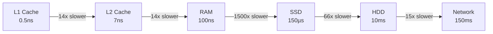
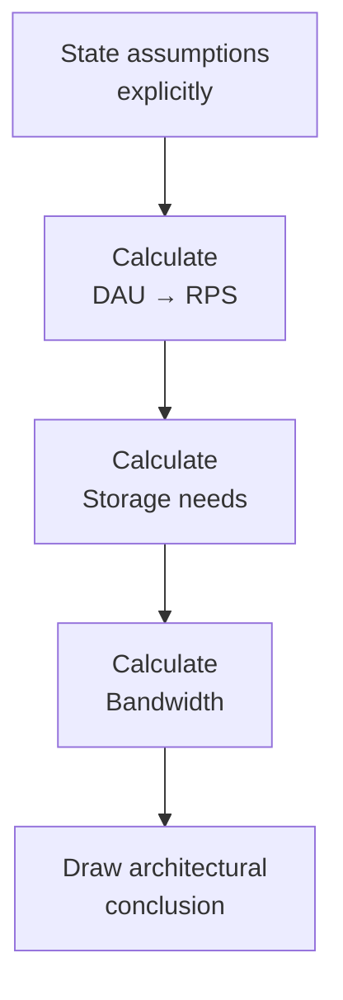

# Estimation Techniques

System design isn't just about architecture — it's about **reasoning under uncertainty**. Estimation tells you whether a single database is enough or you need a distributed cluster, whether one server handles the load or you need a fleet.

> **A 10x error in estimation leads to a completely different architecture. Nail your numbers.**

---

## The Mental Model: Powers of 2

Everything in computing maps to powers of 2. Memorize this table — it's your calculator:

| Power | Value       | Approximate | What it means |
| ----- | ----------- | ----------- | ------------- |
| 2¹⁰   | 1,024       | ~1 thousand | 1 KB          |
| 2²⁰   | 1,048,576   | ~1 million  | 1 MB          |
| 2³⁰   | ~1 billion  | ~1 GB       | 1 GB          |
| 2⁴⁰   | ~1 trillion | ~1 TB       | 1 TB          |

When you see "1 billion requests/day," your brain should immediately compute: **~10,000 requests/second**.

---

## Time Conversions You Must Know Cold

```
1 minute  =    60 seconds
1 hour    =  3,600 seconds
1 day     = 86,400 seconds  ≈ 100,000 seconds (for quick math)
1 month   = 2,592,000 seconds ≈ 2.5 million seconds
1 year    = 31,536,000 seconds ≈ 30 million seconds
```

**The key shortcut:** 1 day ≈ 10⁵ seconds. This converts DAU-based estimates to RPS instantly.

---

## Latency Numbers Every Engineer Should Know

These are the numbers that separate engineers who understand systems from those who don't. Credited to Jeff Dean (Google):

| Operation                            | Latency | Relative     |
| ------------------------------------ | ------- | ------------ |
| L1 cache reference                   | 0.5 ns  | 1x           |
| L2 cache reference                   | 7 ns    | 14x          |
| Main memory (RAM) access             | 100 ns  | 200x         |
| SSD random read                      | 150 µs  | 300,000x     |
| HDD random seek                      | 10 ms   | 20,000,000x  |
| Network round-trip (same datacenter) | 500 µs  | 1,000,000x   |
| Network round-trip (cross-continent) | 150 ms  | 300,000,000x |

**Why this matters:** Reading from disk is 100,000x slower than reading from cache. This is why Redis exists.



---

## Throughput Benchmarks

Use these as starting points. Real-world numbers vary by hardware and query complexity:

| System                             | Typical Throughput                       |
| ---------------------------------- | ---------------------------------------- |
| Single web server (simple API)     | 5,000–10,000 RPS                         |
| Single PostgreSQL (simple queries) | 1,000–5,000 QPS                          |
| Single Redis instance              | 100,000–1,000,000 ops/sec                |
| Single Kafka broker                | 100,000–1,000,000 messages/sec           |
| Single SSD                         | 100,000 IOPS random, 500 MB/s sequential |
| 1 Gbps network link                | ~125 MB/s                                |
| 10 Gbps network link               | ~1.25 GB/s                               |

---

## Storage Size Estimates

### Common Data Sizes

| Data type                 | Size       |
| ------------------------- | ---------- |
| ASCII character           | 1 byte     |
| Unicode character (UTF-8) | 1–4 bytes  |
| Integer (32-bit)          | 4 bytes    |
| Long (64-bit)             | 8 bytes    |
| UUID                      | 16 bytes   |
| Typical tweet             | ~280 bytes |
| Short URL record          | ~500 bytes |
| Average webpage           | ~2 MB      |
| High-res photo            | 5–10 MB    |
| 1-minute compressed video | ~10 MB     |
| 1-hour HD video           | ~1–2 GB    |

### Storage Estimation Formula

```
Total storage = (data size per record) × (records per day) × (retention days) × (replication factor)
```

**Example:** WhatsApp messages

```
Message size:           ~100 bytes
Messages per day:       100 billion
Storage per day:        100B × 100 bytes = 10 TB/day
Retention:              30 days
Replication factor:     3
Total:                  10 TB × 30 × 3 = 900 TB ≈ 1 PB/month
```

---

## Network Bandwidth Estimation

```
Bandwidth = (requests per second) × (data size per request)
```

**Example:** YouTube video streaming

```
DAU:                  50 million
Users watching video: 10% = 5 million concurrent
Avg video bitrate:    5 Mbps (HD)
Total bandwidth:      5M × 5 Mbps = 25 Tbps
```

This is why YouTube needs one of the world's largest CDN infrastructures.

---

## The SLA ↔ Downtime Table

When your interviewer says "five nines," you should immediately know what that means:

| Availability           | Annual downtime | Monthly downtime | Use case                |
| ---------------------- | --------------- | ---------------- | ----------------------- |
| 99% ("two nines")      | 3.65 days       | 7.3 hours        | Batch jobs, dev tools   |
| 99.9% ("three nines")  | 8.7 hours       | 43.8 minutes     | Internal tools          |
| 99.99% ("four nines")  | 52.6 minutes    | 4.4 minutes      | Consumer apps           |
| 99.999% ("five nines") | 5.3 minutes     | 26 seconds       | Telecom, payments       |
| 99.9999% ("six nines") | 31 seconds      | 2.6 seconds      | Safety-critical systems |

> **Note:** 99.99% sounds close to 99.999%, but the difference is 47 minutes vs 5 minutes of downtime per year — a 10x difference that completely changes your operational requirements.

---

## Request Rate Estimation Formulas

### DAU → RPS

```
RPS = (DAU × requests per user per day) / 86,400
Peak RPS ≈ RPS × 2–3 (traffic isn't uniform)
```

### Read/Write Ratio

Always ask — it determines your storage and caching strategy:

| System                 | Typical ratio     |
| ---------------------- | ----------------- |
| Twitter feed           | 100:1 read-heavy  |
| URL shortener          | 100:1 read-heavy  |
| Log ingestion pipeline | 1:100 write-heavy |
| Messaging app          | ~1:1 balanced     |
| Search engine          | 1000:1 read-heavy |

---

## Worked Example: Instagram

Let's estimate Instagram end-to-end:

**Given:**

- 1 billion DAU
- Each user views 20 photos/day, uploads 1 photo/week

**Traffic:**

```
Photo views/day:    1B × 20 = 20B views/day
View RPS:           20B / 86,400 ≈ 231,000 RPS
Photo uploads/day:  1B / 7 ≈ 143M uploads/day
Upload RPS:         143M / 86,400 ≈ 1,655 RPS
Read:Write ratio:   ~140:1
```

**Storage:**

```
Photo size (compressed): 500 KB
Uploads per day:         143M
Storage per day:         143M × 500KB = 71.5 TB/day
With replication (3x):   214.5 TB/day
Per year:                ~78 PB
```

**Bandwidth (reads):**

```
231,000 RPS × 500 KB = 115 GB/s outbound bandwidth
```

This immediately tells you: Instagram needs a massive CDN, object storage (not a relational DB for photos), and significant horizontal scaling for the read path.

---

## The Estimation Mindset

Interviewers don't expect perfect numbers. They want to see:

1. **Structured approach** — DAU → RPS → storage → bandwidth in order
2. **Reasonable assumptions** — state them explicitly
3. **Order of magnitude accuracy** — being off by 2x is fine; being off by 1,000x is not
4. **Insight from numbers** — "this is read-heavy, so we should cache aggressively"



---

## Key Takeaways

- **Memorize: 1 day ≈ 86,400 seconds** — this converts user counts to RPS instantly
- **Cache exists because RAM is 1,500x faster than SSD** — never forget the latency table
- **Peak load is 2–3x average** — always design for peak, not average
- **Storage grows fast** — 100 bytes × 1 billion users × 365 days = 36.5 TB without replication
- Numbers should **drive architectural decisions** — if you're at 100K RPS, you need horizontal scaling; at 10M RPS, you need sharding
