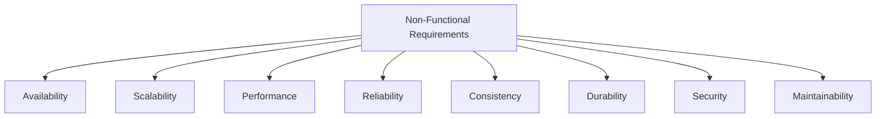
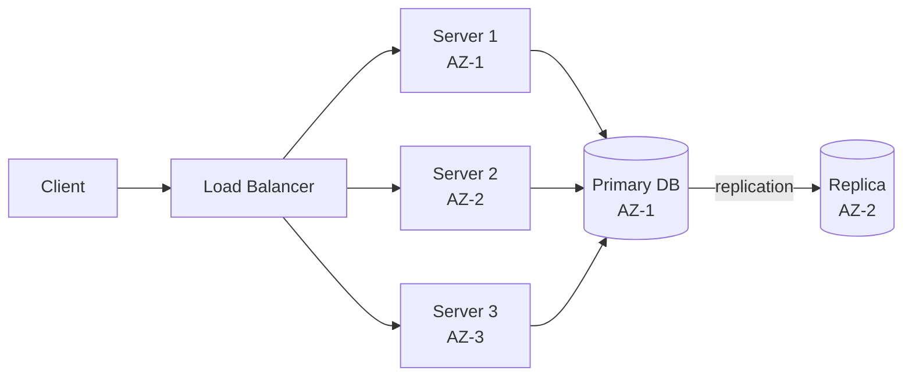
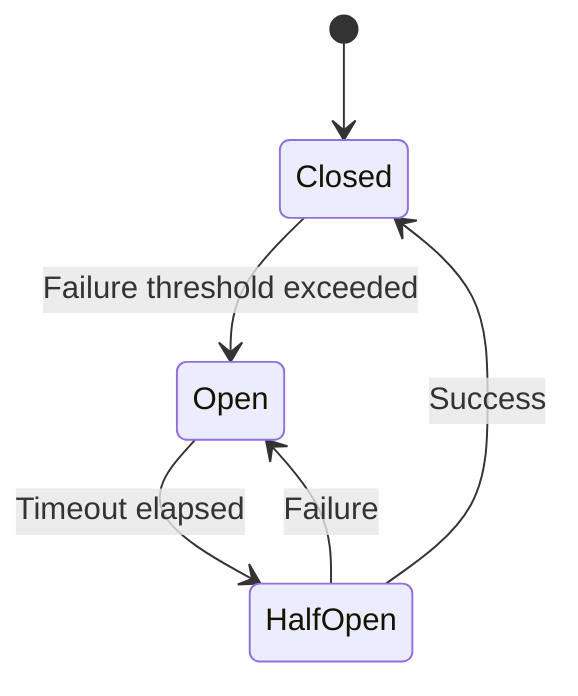
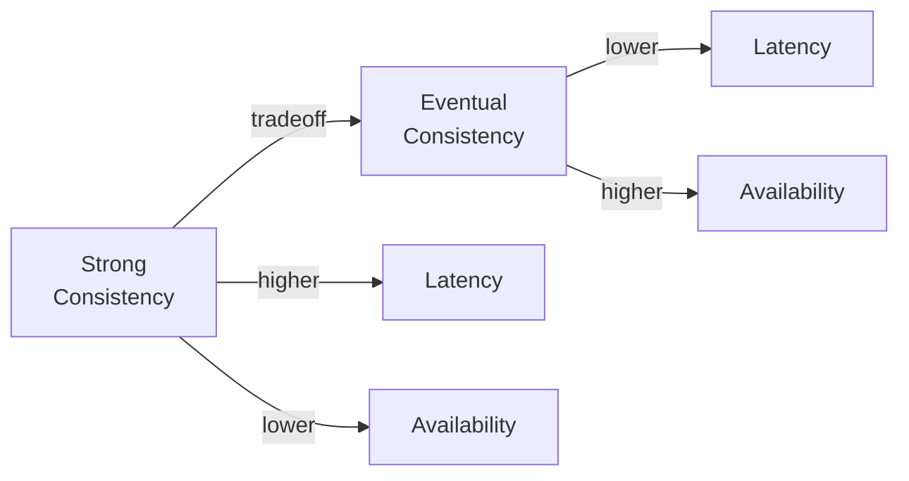

# Non-Functional Requirements

Non-functional requirements (NFRs) define **how well** a system performs its job — not what it does, but the quality constraints it must meet. They're the invisible architecture drivers that most engineers underestimate until production breaks.

> **Functional requirements define correctness. Non-functional requirements define excellence.**

In interviews, a complete NFR analysis separates a 5/5 answer from a 3/5 answer.

---

## The Core NFRs



---

## 1. Availability

Availability is the percentage of time a system is operational and accessible.

```
Availability = Uptime / (Uptime + Downtime)
```

| Availability | Annual downtime | Design implication               |
| ------------ | --------------- | -------------------------------- |
| 99%          | 3.65 days       | Single server, no redundancy     |
| 99.9%        | 8.7 hours       | Basic redundancy, health checks  |
| 99.99%       | 52 min          | Active-active failover, multi-AZ |
| 99.999%      | 5.3 min         | Multi-region, auto-recovery      |

### Achieving High Availability

The key patterns:

- **Redundancy** — no single point of failure (SPOF)
- **Health checks + auto-restart** — detect and recover from failures automatically
- **Load balancing** — distribute across multiple instances
- **Multi-AZ deployment** — survive datacenter failures
- **Circuit breakers** — prevent cascading failures



> **Interview tip:** When asked about availability, always identify and eliminate single points of failure. Walk through the architecture and ask: "What happens if this component dies?"

---

## 2. Scalability

Scalability is the ability to handle increased load by adding resources — without requiring a redesign.

### Vertical vs. Horizontal Scaling

|                | Vertical (Scale Up)    | Horizontal (Scale Out) |
| -------------- | ---------------------- | ---------------------- |
| **Method**     | Bigger machine         | More machines          |
| **Limit**      | Hardware ceiling       | Nearly unlimited       |
| **Complexity** | Simple                 | Complex (distributed)  |
| **Cost**       | Expensive per unit     | Cheaper at scale       |
| **Downtime**   | Usually required       | Zero downtime          |
| **Best for**   | Databases (short-term) | Web/app servers        |

### Scalability Dimensions

- **Read scalability** — add read replicas, caches, CDNs
- **Write scalability** — sharding, partitioning, CQRS
- **Storage scalability** — distributed storage, object stores
- **Compute scalability** — horizontal pod autoscaling, serverless

---

## 3. Performance

Performance has two primary dimensions:

### Latency

The time to complete a single operation.

| Latency target | User experience                               |
| -------------- | --------------------------------------------- |
| < 100ms        | Instantaneous — user feels no delay           |
| 100ms – 1s     | Slight delay — acceptable for most operations |
| 1s – 3s        | Noticeable — user attention starts to drift   |
| > 3s           | Frustrating — users start abandoning          |
| > 10s          | Unacceptable — users leave                    |

Always measure latency at percentiles, not averages:

- **p50** — median user experience
- **p95** — 95% of users experience this or better
- **p99** — the "tail latency" — what your worst 1% experiences
- **p999** — critical for SLA guarantees

> **Why averages lie:** If 99% of requests take 10ms and 1% take 10,000ms, the average is ~110ms — which sounds fine but hides a serious problem affecting 1 in 100 users.

### Throughput

The number of operations the system handles per unit time (RPS, QPS, messages/sec).

Throughput and latency are related but distinct:

- You can have **high throughput, high latency** (batch processing)
- You can have **low throughput, low latency** (a fast but limited system)
- The goal is usually **high throughput AND low latency** — which requires careful design

---

## 4. Reliability

Reliability is the system's ability to **perform its function correctly over time**, even in the presence of failures.

Key metrics:

- **MTBF** (Mean Time Between Failures) — how often it fails
- **MTTR** (Mean Time To Recovery) — how quickly it recovers
- **Error rate** — percentage of requests that fail

### Reliability Patterns

| Pattern              | What it does                              |
| -------------------- | ----------------------------------------- |
| Retries with backoff | Automatically retry transient failures    |
| Circuit breaker      | Stop calling a failing service            |
| Bulkhead             | Isolate failures to prevent cascade       |
| Timeout              | Don't wait forever for a response         |
| Fallback             | Return cached/default value on failure    |
| Dead letter queue    | Preserve failed messages for reprocessing |



_Circuit breaker state machine_

---

## 5. Consistency

Consistency defines what data a user sees and when they see it after a write occurs.

### The Consistency Spectrum



| Model                    | Guarantee                                   | Use case                  |
| ------------------------ | ------------------------------------------- | ------------------------- |
| **Strong consistency**   | Read always returns latest write            | Bank balances, inventory  |
| **Read-your-writes**     | You always see your own writes              | User profile updates      |
| **Monotonic reads**      | Never see older data on repeated reads      | Session data              |
| **Eventual consistency** | Will converge, but may be stale             | Social feeds, like counts |
| **Causal consistency**   | Causally related operations appear in order | Comments on posts         |

### The CAP Theorem

In a distributed system, you can only guarantee **two** of:

- **C**onsistency — every read returns the latest write
- **A**vailability — every request gets a response
- **P**artition tolerance — system works despite network splits

Since network partitions are unavoidable in distributed systems, the real choice is between **CP** and **AP**:

|                  | CP (Consistent + Partition Tolerant) | AP (Available + Partition Tolerant) |
| ---------------- | ------------------------------------ | ----------------------------------- |
| **On partition** | Rejects requests to stay consistent  | Returns possibly stale data         |
| **Examples**     | HBase, Zookeeper, etcd               | Cassandra, DynamoDB, CouchDB        |
| **When to use**  | Financial data, inventory            | Social data, recommendations        |

---

## 6. Durability

Durability guarantees that **committed data is never lost**, even if the system crashes immediately after the write.

### Durability vs. Availability

These are often confused:

- **Durability** = data is not lost (permanent storage)
- **Availability** = system is accessible (uptime)

A system can be highly available but lose data (in-memory cache). A system can be durable but temporarily unavailable (database under maintenance).

### Achieving Durability

- **Write-ahead logging (WAL)** — write to log before applying changes
- **Replication** — store copies on multiple nodes/disks
- **Checksums** — detect data corruption
- **Backups** — point-in-time recovery capability

> **The 3-2-1 rule:** Keep 3 copies of data, on 2 different media, with 1 offsite. AWS uses similar principles with multi-AZ and cross-region replication.

---

## 7. Security

Security NFRs are often underspecified but always evaluated in production systems.

### Key Security Requirements

| Requirement      | Mechanism                                 |
| ---------------- | ----------------------------------------- |
| Authentication   | JWT, OAuth 2.0, session tokens            |
| Authorization    | RBAC, ABAC, ACLs                          |
| Data in transit  | TLS 1.3 everywhere                        |
| Data at rest     | AES-256 encryption                        |
| Rate limiting    | API gateway, token bucket                 |
| Input validation | Sanitize all user input                   |
| Audit logging    | Immutable log of all sensitive operations |

---

## 8. Maintainability

A system that works but can't be understood, debugged, or extended is a liability.

Maintainability encompasses:

- **Observability** — logs, metrics, distributed tracing
- **Testability** — unit tests, integration tests, chaos engineering
- **Deployability** — CI/CD pipelines, blue-green deployments, canary releases
- **Documentation** — runbooks, API docs, architecture decision records (ADRs)

---

## NFRs Drive Architecture Decisions

NFRs aren't just checkboxes — each one shapes your design:

| NFR constraint       | Architectural consequence                 |
| -------------------- | ----------------------------------------- |
| 99.999% availability | Multi-region active-active deployment     |
| < 50ms p99 latency   | In-memory caching layer required          |
| Strong consistency   | SQL over NoSQL; single-leader replication |
| 10M writes/sec       | Sharding, LSM-tree storage engines        |
| Zero data loss       | Synchronous replication; WAL              |
| SOC2 compliance      | Encryption everywhere; audit logs         |

---

## The NFR Checklist for Interviews

Before finalizing your design, run through this checklist:

```
□ Availability: What's the uptime target? Where are the SPOFs?
□ Scalability: What's the scale today and at 10x?
□ Performance: What are the latency and throughput targets?
□ Consistency: Strong or eventual? What's the tradeoff?
□ Durability: Can we lose any data? What's the RPO?
□ Security: Authentication? Encryption? Rate limiting?
□ Maintainability: How do we monitor, alert, and debug this?
```

---

## Key Takeaways

- NFRs often **matter more than functional requirements** for architecture — a 99.999% availability target vs 99% changes everything
- **Latency, throughput, availability, and consistency are all in tension** — optimizing one often degrades another
- Always measure latency at **p99, not average** — averages mask tail latency problems
- The real CAP choice is **CP vs AP** — partition tolerance is not optional in distributed systems
- NFRs should be **explicit and quantified** — "fast" and "reliable" are not NFRs; "< 100ms p99" and "99.99% availability" are
