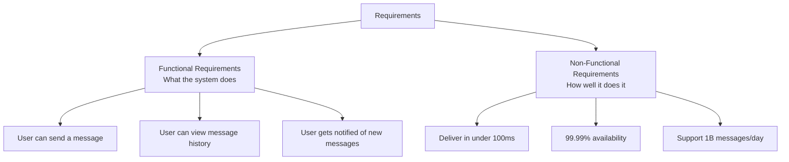
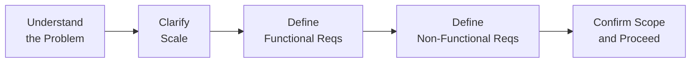

# Requirements Gathering

The single biggest mistake engineers make in system design interviews — and in real projects — is jumping straight into architecture before understanding what needs to be built.

> **Requirements are the contract between the problem and your solution. A brilliant architecture built on wrong requirements is still a failure.**

---

## Why Requirements Gathering is Non-Negotiable

Consider designing a "messaging system." That's wildly ambiguous:

- Is it SMS? In-app chat? Email? Push notifications?
- Should messages persist forever or expire?
- Is it one-to-one, group chat, or broadcast?
- Does it need end-to-end encryption?
- What's the expected scale — 1,000 users or 1 billion?

Each answer fundamentally changes the architecture. Spending 5 minutes clarifying requirements saves 40 minutes of designing the wrong system.

---

## Functional vs. Non-Functional Requirements

Every system has two types of requirements. Confusing them is a red flag in interviews.



| Type               | Question it answers        | Examples                                       |
| ------------------ | -------------------------- | ---------------------------------------------- |
| **Functional**     | What does the system _do_? | Send message, create user, search content      |
| **Non-Functional** | How _well_ does it do it?  | Latency, availability, consistency, durability |

---

## Functional Requirements

These define the **features and behaviors** of the system. In an interview, extract them by asking:

### The Right Questions to Ask

**Core features:**

- What are the primary use cases? What does a user actually _do_?
- What operations need to be supported (create, read, update, delete)?
- Are there different types of users (admin, regular user, guest)?

**Data and content:**

- What kind of data does the system handle — text, images, video, files?
- Do users own their data? Can they delete it?
- Is there user-generated content that needs moderation?

**Interactions:**

- Is this a real-time system (chat, live video) or async (email, notifications)?
- Are there dependencies between operations (e.g., can't comment without a post)?

### Defining Scope

In a 45-minute interview, you can't design everything. Explicitly agree on what's in scope:

```
✅ In scope:
  - Send and receive one-to-one messages
  - Message delivery status (sent, delivered, read)
  - Message history (last 30 days)

❌ Out of scope:
  - Group messaging
  - Voice/video calls
  - Message search
  - End-to-end encryption
```

This isn't admitting defeat — it's demonstrating focus and prioritization.

---

## Non-Functional Requirements

These define the **quality attributes** of the system. They're often more impactful on architecture than functional requirements.

### The Core NFRs to Always Address

| NFR              | Key question                         | Typical target      |
| ---------------- | ------------------------------------ | ------------------- |
| **Availability** | What % uptime is required?           | 99.9% – 99.999%     |
| **Consistency**  | Can users see stale data?            | Strong vs. eventual |
| **Latency**      | What's the acceptable response time? | < 100ms for reads   |
| **Throughput**   | How many requests per second?        | Depends on scale    |
| **Durability**   | Can we afford to lose data?          | Usually never       |
| **Scalability**  | Must it handle 10x growth?           | Usually yes         |
| **Security**     | Auth, encryption, compliance needs?  | Context-dependent   |

### The Consistency Question is Critical

For almost every distributed system, you must explicitly ask:

> _"Is strong consistency required, or is eventual consistency acceptable?"_

- **Strong consistency:** Every user sees the same data at the same time. Required for bank balances, inventory counts.
- **Eventual consistency:** Users may briefly see stale data, but it will eventually converge. Acceptable for social feeds, like counts, recommendation systems.

Eventual consistency is far easier to build at scale — but it's not always appropriate.

---

## The FURPS+ Model

A professional framework for capturing requirements comprehensively:

| Category           | Covers                                                  |
| ------------------ | ------------------------------------------------------- |
| **F**unctionality  | Features, capabilities, security                        |
| **U**sability      | UX, accessibility, documentation                        |
| **R**eliability    | Availability, failure rate, recoverability              |
| **P**erformance    | Response time, throughput, capacity                     |
| **S**upportability | Maintainability, portability, testability               |
| **+**              | Design, implementation, interface, physical constraints |

In a system design interview you focus on **F, R, P** — these drive architectural decisions.

---

## A Structured Interview Approach

Here's a battle-tested template for the first 5 minutes of any system design interview:



### Phase 1 — Understand the problem (1 min)

Restate the problem in your own words.

> _"So we're building a URL shortener — users paste a long URL, get a short code, and visiting that short URL redirects them to the original. Is that the core of it?"_

### Phase 2 — Clarify scale (2 min)

```
"How many DAU are we targeting?"
"What's the expected read/write ratio?"
"Are we designing for current scale or 5-year scale?"
```

### Phase 3 — Lock in functional requirements (1 min)

List the 3–5 core features. Get explicit confirmation.

### Phase 4 — Lock in non-functional requirements (1 min)

```
"I'll assume we need high availability (99.9%+).
 Latency should be under 100ms for reads.
 Consistency can be eventual for the feed but
 strong for financial operations. Does that sound right?"
```

---

## Real-World Example: Designing Twitter

**Without requirements gathering, you might assume:**

- Design the tweet posting and feed system

**With good requirements gathering, you discover:**

- 300M DAU, 500M tweets/day → write-heavy at massive scale
- Feed reading happens 10x more than writing → optimize reads
- Celebrities have 100M followers → fan-out is a hard problem
- Tweets are immutable → simplifies storage
- Strong consistency not required for feeds → eventual is fine
- Search is out of scope for this discussion

These answers completely reshape the architecture. The fan-out problem alone drives the entire feed generation strategy.

---

## Common Mistakes to Avoid

| Mistake                       | Impact                             | Fix                                                   |
| ----------------------------- | ---------------------------------- | ----------------------------------------------------- |
| Jumping to design immediately | Solving the wrong problem          | Always spend 5 min on requirements                    |
| Ignoring NFRs                 | Architecture won't hold at scale   | Explicitly address availability, latency, consistency |
| Treating all data the same    | Wrong storage choices              | Ask about access patterns and consistency needs       |
| Not confirming scope          | Wasted time on irrelevant features | List in-scope and out-of-scope explicitly             |
| Assuming requirements         | Missing critical constraints       | Ask, don't assume                                     |

---

## Key Takeaways

- **Requirements come first** — architecture is downstream of requirements, not the other way around
- **Functional requirements** define what the system does; **non-functional requirements** define how well it does it
- Always explicitly ask about **consistency requirements** — it's the most impactful architectural decision in distributed systems
- In interviews, **5 minutes of requirements gathering prevents 40 minutes of wrong design**
- Confirm scope explicitly — list what's in and out of scope before drawing a single box
