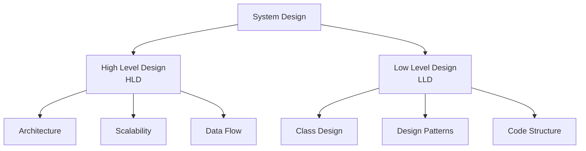
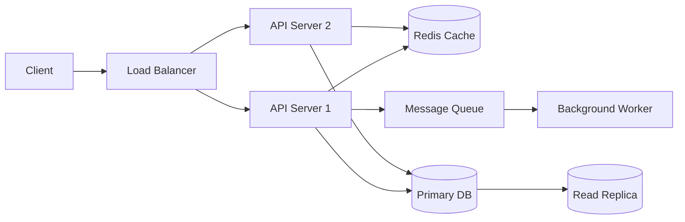

# What is System Design?

System design is the process of defining the **architecture, components, modules, interfaces, and data flow** of a system to satisfy specified requirements. At its core, it answers one question:

> **How do you build software that works at scale — reliably, efficiently, and maintainably?**

In interviews, system design tests your ability to think like an architect: make informed tradeoffs, anticipate failure modes, and reason about scale before writing a single line of code.

---

## Why System Design Matters

A feature that works for 100 users often breaks at 1,000,000. The code doesn't change — the _system around it_ does.

| Scale      | What breaks                                            |
| ---------- | ------------------------------------------------------ |
| 1K users   | Nothing. A single server is fine.                      |
| 100K users | Database becomes a bottleneck                          |
| 1M users   | Single server can't handle traffic                     |
| 10M users  | Network, storage, and consistency become hard problems |
| 1B+ users  | Everything is a distributed systems problem            |

This is why companies like Google, Meta, and Amazon spend enormous effort on system design — and why they test it heavily in senior engineering interviews.

---

## The Two Pillars: HLD and LLD

System design splits into two complementary disciplines:



**High Level Design (HLD)** — the _what_ and _why_:

- How do components communicate?
- Where does data live?
- How do we handle 10M requests/day?

**Low Level Design (LLD)** — the _how_:

- What classes and interfaces do we need?
- Which design patterns apply?
- How is business logic structured?

Both matter. HLD without LLD produces systems that are architecturally sound but unmaintainable. LLD without HLD produces clean code that can't scale.

---

## Core Goals of System Design

Every design decision is a tradeoff between these properties:

### 1. Scalability

The ability to handle increased load by adding resources.

- **Vertical scaling** — bigger machine (CPU, RAM). Simple but has a ceiling.
- **Horizontal scaling** — more machines. Complex but nearly unlimited.

### 2. Reliability

The system continues working correctly even when components fail.

> **Real-world target:** Amazon targets 99.99% availability = ~52 minutes downtime/year. At their scale, that's still millions of failed requests.

### 3. Availability vs. Consistency

The fundamental tension in distributed systems (CAP Theorem):

| Property            | Meaning                             | Example                |
| ------------------- | ----------------------------------- | ---------------------- |
| Consistency         | Every read returns the latest write | Bank balance           |
| Availability        | System always responds              | DNS lookup             |
| Partition Tolerance | Works despite network failures      | Any distributed system |

You can only guarantee two of the three. Most real systems choose **AP** (availability + partition tolerance) and handle eventual consistency in the application layer.

### 4. Performance

- **Latency** — how long a single request takes (p50, p95, p99)
- **Throughput** — how many requests the system handles per second

### 5. Maintainability

Can a new engineer understand, debug, and extend this system in 3 months?

---

## The System Design Process

When approaching any design problem — in interviews or real life — follow this framework:


### Step 1 — Clarify Requirements

Never start designing immediately. Ask:

- How many users? What's the read/write ratio?
- What's the acceptable latency? Any SLA?
- Do we need strong consistency or is eventual consistency fine?
- What features are in scope for this discussion?

### Step 2 — Estimate Scale

Back-of-envelope math grounds your design:

```
Daily Active Users (DAU):     10 million
Requests per user per day:    10
Total requests/day:           100 million
Requests per second (RPS):    100M / 86,400 ≈ 1,200 RPS
Peak RPS (3x):                ~3,600 RPS
```

This tells you immediately: _"I need more than one server."_

### Step 3 — Define the API

Before touching databases or queues, define what the system exposes:

```
POST /messages          → send a message
GET  /messages/{id}     → fetch a message
GET  /inbox/{userId}    → fetch user's inbox
```

APIs are contracts. Getting them right early prevents expensive refactors.

### Step 4 — Design the Data Model

What entities exist? How do they relate? What are the access patterns?

```
User       { id, name, email, created_at }
Message    { id, sender_id, receiver_id, content, timestamp }
Inbox      { user_id, message_id, read, deleted }
```

Choose storage based on access patterns — not familiarity.

### Step 5 — High-Level Architecture

Now draw the boxes:



### Step 6 — Deep Dive on Bottlenecks

Identify the hot paths and stress-test them mentally:

- What happens if the database gets 10,000 writes/second?
- What if a cache node goes down?
- What if the message queue backs up?

---

## Common Building Blocks

Every large system is built from the same set of components. Learn these deeply:

| Component      | Purpose                      | Examples                     |
| -------------- | ---------------------------- | ---------------------------- |
| Load Balancer  | Distribute traffic           | Nginx, AWS ALB               |
| Cache          | Reduce latency, offload DB   | Redis, Memcached             |
| Database       | Persist data                 | PostgreSQL, MySQL, Cassandra |
| Message Queue  | Async processing, decoupling | Kafka, RabbitMQ, SQS         |
| CDN            | Serve static assets globally | Cloudflare, AWS CloudFront   |
| API Gateway    | Auth, rate limiting, routing | Kong, AWS API Gateway        |
| Search         | Full-text search             | Elasticsearch, Solr          |
| Object Storage | Files, images, videos        | S3, GCS                      |

---

## A Real-World Example: Designing a URL Shortener

Even a "simple" system like TinyURL demonstrates core design thinking:

**Requirements:** Shorten URLs, redirect users, handle 1B redirects/day

**Scale estimation:**

```
1B redirects/day = ~11,600 RPS reads
10M new URLs/day = ~115 RPS writes
Read:Write ratio = ~100:1 → heavily read-optimized
```

**Key decisions and their tradeoffs:**

| Decision       | Option A       | Option B      | Choice                       |
| -------------- | -------------- | ------------- | ---------------------------- |
| ID generation  | Auto-increment | Base62 hash   | Base62 (non-guessable)       |
| Storage        | SQL            | NoSQL         | SQL (simple, ACID)           |
| Redirect cache | No cache       | Redis TTL     | Redis (absorbs 99% of reads) |
| Redirect type  | 301 Permanent  | 302 Temporary | 302 (enables analytics)      |

This is system design in practice: **every decision is a tradeoff**, and the right answer depends on your requirements.

---

## What Interviewers Actually Look For

In a 45-minute system design interview, you won't finish designing a complete system — and that's fine. Interviewers evaluate:

1. **Structured thinking** — Do you follow a logical process?
2. **Requirement gathering** — Do you ask clarifying questions before diving in?
3. **Scale awareness** — Do you understand what changes at 10x, 100x, 1000x scale?
4. **Tradeoff reasoning** — Can you explain _why_ you chose one approach over another?
5. **Breadth of knowledge** — Are you aware of the building blocks (caches, queues, sharding)?
6. **Communication** — Can you explain complex ideas clearly?

> **Interview tip:** Think out loud. A wrong answer explained well beats a right answer with no reasoning. Interviewers want to see how you think, not just what you know.

---

## Key Takeaways

- System design is about **making informed tradeoffs** between scalability, reliability, consistency, performance, and maintainability
- Every large system is built from the same **building blocks** — learn them deeply rather than memorizing specific designs
- Always **clarify requirements and estimate scale** before drawing any architecture — it changes everything
- HLD and LLD are complementary — great engineers are strong in both
- In interviews, **structured thinking and clear tradeoff reasoning** matter more than having the "perfect" answer
