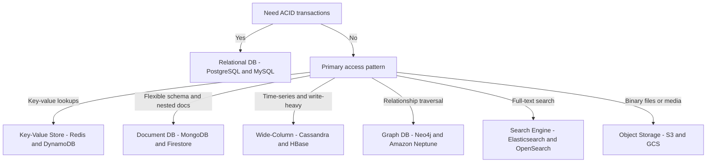

# HLD Cheat Sheet

The ultimate quick-reference for system design interviews. Numbers, patterns, algorithms, and component choices — everything you need at a glance. Memorize the key numbers. Internalize the decision frameworks. Use the pattern table to quickly identify which building blocks apply to any problem.

---

## Essential Numbers to Memorize

### Time Units

| Operation                        | Latency           |
| -------------------------------- | ----------------- |
| L1 cache reference               | 1 ns              |
| L2 cache reference               | 4 ns              |
| L3 cache reference               | 40 ns             |
| Main memory (RAM) access         | 100 ns            |
| SSD random read (NVMe)           | 100 µs (0.1 ms)   |
| SSD sequential read (NVMe)       | 1 GB/s throughput |
| HDD seek                         | 10 ms             |
| Same datacenter round trip       | 0.5 ms            |
| Cross-region (US East → US West) | 40 ms             |
| Cross-continent (US → Europe)    | 80-100 ms         |
| DNS lookup                       | 10-100 ms         |
| TCP connection setup             | 1 × RTT           |
| TLS handshake (1.3)              | 1 × RTT           |
| Redis GET/SET                    | < 1 ms            |
| PostgreSQL indexed query         | 1-10 ms           |

### Data Size Units

| Unit                        | Value                        |
| --------------------------- | ---------------------------- |
| 1 KB                        | 10³ bytes                    |
| 1 MB                        | 10⁶ bytes                    |
| 1 GB                        | 10⁹ bytes                    |
| 1 TB                        | 10¹² bytes                   |
| 1 PB                        | 10¹⁵ bytes                   |
| ASCII character             | 1 byte                       |
| UTF-8 character             | 1–4 bytes                    |
| UUID                        | 16 bytes (binary) / 36 chars |
| Integer (32-bit)            | 4 bytes                      |
| Long (64-bit)               | 8 bytes                      |
| Average tweet               | ~280 bytes + metadata ≈ 1 KB |
| Average photo (compressed)  | ~300 KB                      |
| Average video (1 min, 720p) | ~30 MB                       |

### Throughput Benchmarks

| Component                 | Throughput           |
| ------------------------- | -------------------- |
| Single PostgreSQL primary | 5K–10K writes/sec    |
| Single Cassandra node     | 50K–100K writes/sec  |
| Single Redis node         | 100K–1M ops/sec      |
| Single Kafka broker       | 100K–1M messages/sec |
| Single Nginx server       | 10K–50K RPS          |
| Single app server (light) | 1K–5K RPS            |
| CDN edge pop              | Millions of RPS      |

### Availability SLAs

| SLA               | Monthly Downtime | Annual Downtime |
| ----------------- | ---------------- | --------------- |
| 99% (two 9s)      | 7.2 hours        | 3.65 days       |
| 99.9% (three 9s)  | 43.8 minutes     | 8.76 hours      |
| 99.99% (four 9s)  | 4.4 minutes      | 52.6 minutes    |
| 99.999% (five 9s) | 26 seconds       | 5.26 minutes    |

---

## Back-of-Envelope Estimation Template

```
Given: X MAU, Y DAU, Z requests per user per day

Traffic:
  QPS (average) = Y × Z / 86,400
  QPS (peak)    = QPS × 3 (peak factor)

Storage (per year):
  Writes/day = Y × writes_per_user
  Storage/day = Writes/day × avg_item_size
  Storage/year = Storage/day × 365
  5-year total = Storage/year × 5

Network bandwidth:
  Outbound = peak_read_QPS × avg_response_size

Cache:
  Cache 20% of daily reads in memory
  Memory needed = 20% × daily_reads × avg_item_size
```

---

## Database Decision Framework



---

## Caching Pattern Quick Reference

| Pattern           | When to Use                                       | Write Operation                           | Read Operation                               |
| ----------------- | ------------------------------------------------- | ----------------------------------------- | -------------------------------------------- |
| **Cache-aside**   | Read-heavy, occasional writes                     | Write to DB only; invalidate/update cache | Check cache; miss → read DB → populate cache |
| **Write-through** | Consistency critical; frequent reads after writes | Write to cache AND DB                     | Always a cache hit after first write         |
| **Write-behind**  | High write throughput; durability not critical    | Write to cache; async flush to DB         | Cache hit                                    |
| **Read-through**  | Simplified app code                               | Write to DB                               | Cache fetches from DB on miss automatically  |
| **Write-around**  | Write-once, read-rarely (logs, archives)          | Write to DB only; skip cache              | Cache miss on first read                     |

---

## Rate Limiting Algorithms

| Algorithm                  | Allows Burst?            | Memory Use               | Accuracy                      | Best For                 |
| -------------------------- | ------------------------ | ------------------------ | ----------------------------- | ------------------------ |
| **Token bucket**           | Yes (up to bucket size)  | Low                      | Precise                       | APIs with bursty traffic |
| **Leaky bucket**           | No (fixed drain rate)    | Low                      | Precise                       | Smooth output rate       |
| **Fixed window counter**   | Yes (at window boundary) | Very low                 | Approx (2× burst at boundary) | Simple rate limiting     |
| **Sliding window log**     | No                       | High (stores timestamps) | Exact                         | Strict rate limiting     |
| **Sliding window counter** | Slightly                 | Low                      | Approx (weighted prev window) | Best balance             |

**Distributed rate limiting:** Store counters in Redis. Use Lua scripts for atomic read-increment-check operations.

---

## Load Balancing Algorithms

| Algorithm                     | How It Works                                   | Best For                                           |
| ----------------------------- | ---------------------------------------------- | -------------------------------------------------- |
| **Round Robin**               | Rotate through servers sequentially            | Uniform server capacity, stateless services        |
| **Weighted Round Robin**      | Servers get proportional traffic               | Mixed server capacities                            |
| **Least Connections**         | Route to server with fewest active connections | Long-lived connections (WebSocket, gRPC streaming) |
| **IP Hash / Consistent Hash** | Hash client IP → same server                   | Sticky sessions, cache locality                    |
| **Random**                    | Pick a random healthy server                   | Simple, stateless, surprisingly effective          |
| **Resource-based**            | Route based on server CPU/memory metrics       | Compute-heavy workloads                            |

---

## Unique ID Generation Options

| Method                | Format                                 | Sortable? | Coordination?         | Best For                             |
| --------------------- | -------------------------------------- | --------- | --------------------- | ------------------------------------ |
| **DB Auto-increment** | 1, 2, 3...                             | Yes       | Central DB            | Simple single-DB systems             |
| **UUID v4**           | `550e8400-e29b-41d4-a716-446655440000` | No        | None                  | Distributed, no time-ordering needed |
| **UUID v7**           | Time-ordered UUID                      | Yes       | None                  | Modern replacement for Snowflake     |
| **Twitter Snowflake** | 64-bit int (time + machine + seq)      | Yes       | Machine ID assignment | High-throughput distributed systems  |
| **ULID**              | `01ARZ3NDEKTSV4RRFFQ69G5FAV`           | Yes       | None                  | URL-safe, sortable, no coordination  |
| **NanoID**            | `V1StGXR8_Z5jdHi6B-myT`                | No        | None                  | Shorter than UUID, URL-safe          |

**Snowflake format (64-bit):**

```
[41 bits: milliseconds since epoch]
[10 bits: machine/datacenter ID]
[12 bits: sequence number (4096/ms/machine)]
```

---

## Consistency Models (Strongest → Weakest)

| Model                        | Guarantee                                              | Example                                 |
| ---------------------------- | ------------------------------------------------------ | --------------------------------------- |
| **Linearizability** (strict) | Reads see the latest write; all ops appear atomic      | etcd, ZooKeeper, Google Spanner         |
| **Sequential consistency**   | All processes see operations in the same order         | Raft-based systems                      |
| **Causal consistency**       | Causally related writes seen in order                  | MongoDB (causal sessions)               |
| **Read-your-writes**         | You always see your own writes                         | Most SQL databases with sticky sessions |
| **Eventual consistency**     | All replicas converge eventually                       | Cassandra (ANY consistency), DynamoDB   |
| **BASE**                     | Basically Available, Soft state, Eventually consistent | NoSQL at scale                          |

---

## Common Design Patterns Quick Reference

| Pattern              | Problem It Solves                                          | Key Components                                                  |
| -------------------- | ---------------------------------------------------------- | --------------------------------------------------------------- |
| **CQRS**             | Read and write have different scaling needs                | Separate read model and write model                             |
| **Event Sourcing**   | Need full audit trail; rebuild state from events           | Append-only event log                                           |
| **Saga**             | Distributed transactions across microservices              | Choreography or orchestration of compensating transactions      |
| **Outbox Pattern**   | Reliable event publishing with DB write                    | Outbox table in same DB; separate publisher reads and publishes |
| **Circuit Breaker**  | Prevent cascade failures to failing services               | Closed → Open → Half-Open state machine                         |
| **Bulkhead**         | Isolate failures; prevent one service from starving others | Thread pool isolation per downstream service                    |
| **Sidecar**          | Add cross-cutting concerns without modifying service       | Proxy container for mTLS, metrics, tracing (Envoy)              |
| **Fan-out on write** | Fast reads for social feeds                                | Write to N follower caches on each post                         |
| **Read Replica**     | Scale read throughput                                      | Route SELECT to replicas; writes to primary                     |
| **Sharding**         | Scale write throughput beyond single-node limits           | Partition data by shard key across N nodes                      |

---

## API Design Quick Decisions

| Decision       | Options                            | Choose When                                                                                        |
| -------------- | ---------------------------------- | -------------------------------------------------------------------------------------------------- |
| **Protocol**   | REST, gRPC, GraphQL                | REST: public API, caching; gRPC: internal microservices, streaming; GraphQL: flexible client needs |
| **Pagination** | Offset, Cursor, Keyset             | Cursor/Keyset for feeds (scalable); Offset for admin (stable order)                                |
| **Auth**       | JWT, Session, API Key, OAuth       | JWT: stateless APIs; Session: web apps with server-side rendering; API Key: machine-to-machine     |
| **Versioning** | URL path (/v1/), Header, Subdomain | URL path is simplest and most visible                                                              |
| **Format**     | JSON, Protobuf, MessagePack        | JSON: default; Protobuf: high-throughput internal services                                         |

---

## Replication and Consistency Tradeoffs

**Quorum formula:**

- N = replication factor
- W = writes required for success
- R = reads required for success
- **Strong consistency:** W + R > N (e.g., N=3, W=2, R=2)
- **High availability:** W=1, R=1 (fast but stale reads possible)

| Config (N=3)       | W   | R   | Read Freshness | Write Availability              |
| ------------------ | --- | --- | -------------- | ------------------------------- |
| Strong consistency | 2   | 2   | Always fresh   | Tolerates 1 failure             |
| High availability  | 1   | 1   | May be stale   | Tolerates 2 failures            |
| Write optimized    | 1   | 3   | Always fresh   | Tolerates 2 failures for writes |
| Read optimized     | 3   | 1   | May be stale   | Must write to all 3             |

---

## Message Queue Patterns

| Pattern                     | Description                                   | When to Use                             |
| --------------------------- | --------------------------------------------- | --------------------------------------- |
| **Work queue**              | Messages distributed to N competing consumers | Background job processing               |
| **Pub/Sub**                 | Each subscriber gets every message            | Fan-out: notifications, event streaming |
| **Dead-letter queue (DLQ)** | Failed messages sent here after N retries     | Debugging, manual replay                |
| **FIFO queue**              | Strict ordering guaranteed                    | Payment processing, audit logs          |
| **Delay queue**             | Messages visible after a delay                | Retry with backoff, scheduled tasks     |

**At-least-once vs exactly-once:**

- **At-least-once:** Default in most queues; consumer must be idempotent
- **Exactly-once:** Kafka transactions, SQS FIFO with deduplication; higher overhead

---

## Storage Selection Reference

| Data                                  | Store                           | Why                                        |
| ------------------------------------- | ------------------------------- | ------------------------------------------ |
| User accounts, orders, payments       | PostgreSQL / MySQL              | ACID, complex queries, FK integrity        |
| Sessions, tokens, rate limit counters | Redis                           | Sub-ms latency, TTL, in-memory             |
| Product catalog, CMS content          | MongoDB                         | Flexible schema, nested documents          |
| User activity, metrics, logs          | Cassandra / ClickHouse          | Write-heavy, append-only, time-range scans |
| Social graph (followers)              | Redis Sorted Set or PostgreSQL  | Fast set operations or graph traversal     |
| Search index                          | Elasticsearch                   | Full-text search, faceting, relevance      |
| Images, video, files                  | S3 / GCS                        | Cheap, durable, CDN-compatible             |
| ML features, recommendations          | Redis / BigTable                | Low-latency key-value reads                |
| Analytics, data warehouse             | BigQuery / Redshift / Snowflake | Columnar, OLAP, massive parallel scan      |

---

## Key Takeaways

- **Latency matters in ordering:** Memory (100ns) → SSD (100µs) → Network (0.5ms-100ms). Design to minimize cross-region calls on hot paths.
- **3-9s availability (99.9%) = 8.76 hours/year downtime** — know the SLAs for common requirements
- **Peak = 3× average** — always design for peak, not average load
- **Right-size your DB choice** — don't use Cassandra for 1K RPS; don't use PostgreSQL for 1M writes/sec
- **W + R > N for strong consistency** — the quorum rule is fundamental to every distributed storage system
- **Idempotency is non-optional** for financial, deduplication, and notification systems
- **Cache hit rate drives economics** — a 99% cache hit rate means 100× less database load than 0% caching
