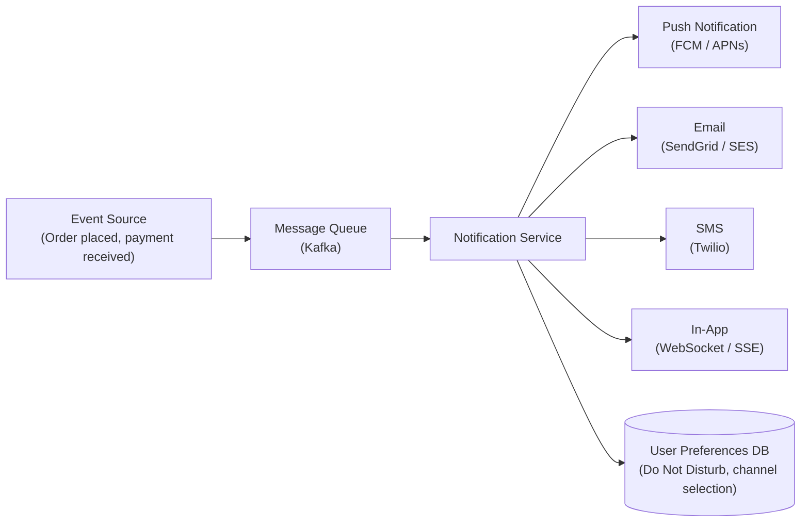
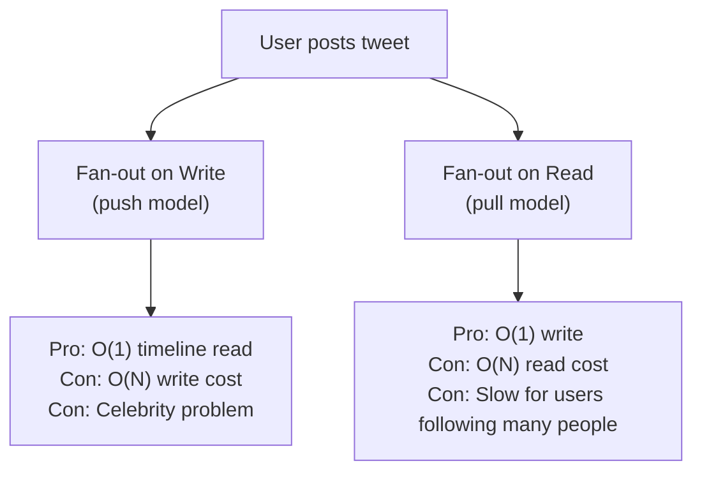
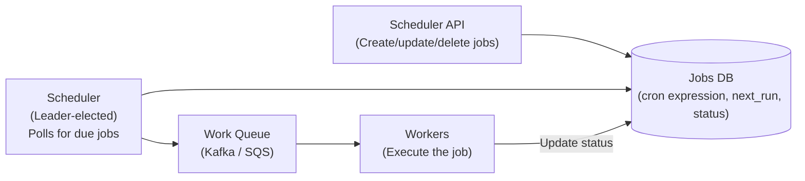
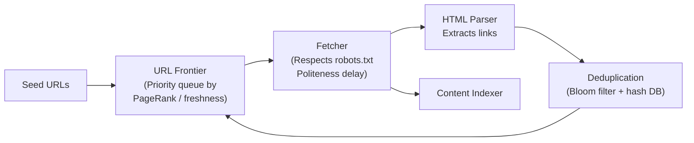

# Common HLD Interview Questions

This guide covers the most frequently asked system design questions in technical interviews at top-tier companies (Google, Meta, Amazon, Uber, Microsoft, Stripe, etc.), grouped by difficulty and domain. For each question, you'll find the core technical challenges, the most important design decisions, and what interviewers are actually probing. Use this as a study map — deep-dive into each topic before your interview.

> **How to use this guide:** For each question, spend time designing it yourself first. Then compare your design against the key challenges listed. The goal is to develop intuition for the patterns that repeat across problems, not to memorize specific designs.

---

## Easy — Foundational Problems

These questions test fundamental system design patterns. They appear at L4/L5 level interviews and as warm-ups for harder questions.

### 1. URL Shortener (TinyURL / bit.ly)

**Core challenge:** Generating unique short codes, handling massive redirect throughput, caching.

| Component | Decision | Why |
|---|---|---|
| Short code generation | Base62 encode a sequence ID or hash | 6-char base62 = 56 billion URLs; counter-based avoids collisions |
| Database | Key-value store (Redis/DynamoDB) | Simple lookup: `short_code → long_url`; no joins needed |
| Redirect | 301 (permanent) vs 302 (temporary) | 302 lets you track clicks; 301 is cached by browser |
| Read scaling | Cache short_code→URL in CDN/Redis | Redirects are 100:1 read-heavy; cache hit rate ~99% |
| Custom aliases | Check uniqueness before insertion | Must handle conflicts gracefully |

**What interviewers probe:** How do you ensure uniqueness at scale? How do you handle 100,000 redirects/second?

---

### 2. Rate Limiter

**Core challenge:** Distributed rate limiting across multiple API server instances.

**Algorithms to compare:**

| Algorithm | Pros | Cons |
|---|---|---|
| **Token bucket** | Allows bursts up to bucket size; smooth rate | Slightly complex implementation |
| **Fixed window counter** | Simple; memory efficient | Allows 2× the rate at window boundary |
| **Sliding window log** | Precise; no boundary problem | High memory (stores all request timestamps) |
| **Sliding window counter** | Approximate sliding window; low memory | Slightly inaccurate by design |

**Distributed implementation:** Use Redis with `INCR` + `EXPIRE` for fixed window, or a Lua script for atomic token bucket operations. A single Redis instance is a bottleneck — shard by user_id.

**What interviewers probe:** Where do you store counters? How do you handle Redis failure? What's the race condition in naive counter increment?

---

### 3. Distributed Key-Value Store

**Core challenge:** Consistent hashing for data distribution, replication for durability, conflict resolution for concurrent writes.

**Key design decisions:**
- **Consistent hashing:** Distribute keys across nodes; add/remove nodes with minimal key remapping
- **Replication factor N:** Write to N nodes; read from R nodes; W + R > N for strong consistency
- **Conflict resolution:** Last-Write-Wins (LWW) using timestamps, or Vector Clocks for causality tracking
- **Gossip protocol:** Nodes exchange state; failure detection; no central coordinator
- **Hinted handoff:** If a node is down, write is temporarily stored elsewhere and forwarded when it recovers

**Real-world references:** Amazon DynamoDB, Apache Cassandra, Riak

---

### 4. Distributed Cache

**Core challenge:** Cache eviction, consistency between cache and database, cache stampede.

**Key design decisions:**
- **Cache-aside vs write-through:** Cache-aside for read-heavy; write-through for consistency
- **Eviction policy:** LRU (most common), LFU (for access-frequency-based eviction), TTL
- **Consistent hashing:** Shard cache data across nodes; minimize key rehashing when nodes change
- **Cache stampede prevention:** Mutex lock during population, probabilistic early refresh, request coalescing

---

### 5. Notification Service

**Core challenge:** Fan-out to millions of users, multiple delivery channels, reliability.



**Key challenges:**
- **At-least-once delivery:** Retry with exponential backoff + idempotency keys
- **User preferences:** Respect DND windows, channel preferences, unsubscribes
- **Rate limiting:** Don't spam users; aggregate notifications when possible
- **Failure handling:** Dead-letter queue for undeliverable notifications

---

## Medium — Core Interview Problems

These are the most frequently asked questions at L5/L6 interviews. Each tests a specific combination of design patterns.

### 6. Design WhatsApp / Messaging System

**Core challenge:** Message delivery guarantees, end-to-end encryption, online/offline presence, group messaging.

**Message delivery states:**
```
→ Sent (server received)
→ Delivered (recipient's device received)
→ Read (recipient opened)
```

**Key design decisions:**
- **WebSocket connections:** Persistent connections for online users; push via APNs/FCM for offline
- **Message storage:** Each message stored per user (denormalized); efficient inbox lookup
- **Group messaging:** Fanout to all group members; large groups (1,000+) need async fanout queue
- **End-to-end encryption:** Signal Protocol; server never sees plaintext; key exchange challenge
- **Offline delivery:** Store-and-forward; messages queued until device reconnects

**What interviewers probe:** How do you guarantee exactly-once delivery? How do you handle message ordering in groups?

---

### 7. Design Twitter / Social Feed

**Core challenge:** Home timeline generation, fan-out at scale, celebrity problem.

**The fan-out decision:**



**Production answer:** Hybrid — fan-out on write for regular users; fan-out on read for celebrities (>1M followers).

**What interviewers probe:** How do you build the timeline? What happens when Lady Gaga posts? How do you handle deleted tweets that were already fanned out?

---

### 8. Design YouTube / Netflix (Video Streaming)

**Core challenge:** Video upload pipeline, transcoding, CDN delivery, adaptive bitrate streaming.

**Video processing pipeline:**
```
Raw upload → Object storage (S3)
           → Transcoding pipeline (FFmpeg workers)
           → Multiple resolutions: 360p, 480p, 720p, 1080p, 4K
           → Multiple formats: H.264, H.265, VP9, AV1
           → Upload to CDN edge nodes
           → Metadata stored in database
```

**Adaptive bitrate streaming (HLS/DASH):** Client requests manifest file listing available segments and resolutions. Player switches quality based on network speed — seamlessly.

**What interviewers probe:** How does video transcoding scale? How do you choose which CDN node to serve from? What's the chunked upload strategy for large files?

---

### 9. Design Google Search Typeahead / Autocomplete

**Core challenge:** Sub-100ms response time, top-K suggestions, personalization, updating suggestions as trends change.

**Data structures:**
- **Trie:** Prefix tree for fast prefix lookup; impractical at full scale (100B+ terms)
- **Inverted index on prefixes:** Pre-compute top-K suggestions for every 2-3 char prefix; store in Redis/Memcached

**At scale:** Partition the trie by prefix (a-f on shard 1, g-m on shard 2, etc.). Update suggestion frequency counts via Kafka stream from search logs.

**What interviewers probe:** How do you update the trie without downtime? How do you handle trending queries that appear suddenly?

---

### 10. Design a Payment System

**Core challenge:** Exactly-once semantics, consistency, idempotency, reconciliation.

**Critical requirements:**
- **Idempotency:** Every payment request must have an idempotency key. If the same request is retried (network timeout), process it only once.
- **Exactly-once:** Combine idempotency + distributed transactions (or Saga pattern)
- **Double-entry bookkeeping:** Every debit has a corresponding credit; balance = sum of all entries
- **Reconciliation:** Periodic batch job compares internal records with payment processor records

**What interviewers probe:** What happens if the network request to Stripe succeeds but you crash before recording it? How do you handle partial failures in a multi-step payment flow?

---

### 11. Design Uber / Ride-Sharing

**Core challenge:** Real-time location tracking, matching algorithm, surge pricing, geospatial queries.

**Location architecture:**
```
Driver sends GPS update every 5 seconds
→ Location service updates Redis (geospatial index: GEOADD)
→ Rider requests ride → Location service finds nearby drivers
  (GEORADIUS: find all drivers within 5km)
→ Matching service picks best driver
  (distance, rating, ETA, driver preference)
```

**Geospatial indexing:** Use **geohash** or **QuadTree** to divide the map into cells. Drivers are indexed by cell. Searching nearby drivers = search current cell + adjacent cells.

**What interviewers probe:** How do you handle 1M drivers updating location every 5 seconds? How does surge pricing work? What if the matching service assigns the same driver to two riders simultaneously?

---

### 12. Design Instagram

**Core challenge:** Photo upload and storage, feed generation, social graph.

**Key components:**
- **Photo storage:** S3 for originals, multiple resized versions (thumbnail, medium, full)
- **Feed generation:** Hybrid fan-out (same as Twitter)
- **Social graph:** Follow graph stored in a graph database or sharded SQL table
- **Discovery:** Explore page uses ML ranking, not just chronological feed

**What interviewers probe:** How does the CDN serve photos to users in different countries? How is the explore feed personalized?

---

### 13. Design Discord

**Core challenge:** Real-time messaging in servers/channels, presence system, voice/video.

**Key differences from WhatsApp:**
- **Servers with channels:** Guild (server) → channels → messages. Messages persist indefinitely by default.
- **Presence at scale:** Millions of users showing online/offline status requires efficient pub/sub.
- **Voice channels:** WebRTC for peer-to-peer media; TURN servers for NAT traversal.

**Message storage:** Cassandra — optimized for time-series data, high write throughput, range scans on `(server_id, channel_id, message_id)`.

---

### 14. Design a Distributed Job Scheduler

**Core challenge:** At-least-once execution, no missed jobs, no duplicate execution, failure recovery.



**Key challenges:**
- **Leader election:** ZooKeeper or etcd to elect a single scheduler leader (prevents duplicate scheduling)
- **At-least-once:** Job is re-queued if not acknowledged within timeout
- **Idempotent jobs:** Workers must handle duplicate execution gracefully
- **Failure recovery:** If a worker crashes mid-job, the scheduler detects timeout and re-queues

---

## Hard — Advanced Architecture Problems

### 15. Design Google Maps

**Core challenge:** Map tile rendering, routing algorithms, live traffic.

- **Map storage:** World map split into tiles at each zoom level (zoom 0 = 1 tile, zoom 20 = trillions of tiles)
- **Tile serving:** Pre-rendered tiles served from CDN; invalidated when map data changes
- **Routing:** Graph with 100B+ nodes (road intersections). A* or Dijkstra with hierarchical routing (use major highways first for long distances)
- **Live traffic:** Aggregate GPS data from millions of phones; estimate travel times per road segment
- **ETA:** ML model trained on historical traffic patterns by time of day, day of week, weather

---

### 16. Design Google Docs (Collaborative Editing)

**Core challenge:** Real-time collaborative editing, conflict resolution, offline support.

**Conflict resolution strategies:**

| Approach | How It Works | Used By |
|---|---|---|
| **Operational Transformation (OT)** | Transform concurrent operations to maintain consistency | Google Docs (original) |
| **CRDTs (Conflict-free Replicated Data Types)** | Data structures that merge without conflicts | Figma, Notion, Automerge |
| **Last-Write-Wins** | Simple but loses concurrent edits | Not suitable for collaborative text |

**Architecture:** Each user has a WebSocket connection to a document server. Operations are sent to the server, persisted to an operation log, and broadcast to all other connected clients. OT ensures that after transformation, all clients converge to the same document state.

---

### 17. Design Zoom / Video Conferencing

**Core challenge:** Low-latency video/audio, scalability to millions of meetings, network adaptation.

- **Media servers:** Selective Forwarding Unit (SFU) vs Multipoint Control Unit (MCU)
  - SFU (Zoom's approach): Each participant sends one stream to SFU; SFU forwards to all others. Scales better.
  - MCU: Server mixes all streams into one. Lower client bandwidth but high server CPU.
- **WebRTC:** STUN/TURN for NAT traversal; SRTP for encrypted media
- **Quality adaptation:** Simulcast — send multiple resolution streams; server selects which to forward based on each receiver's bandwidth
- **Recording:** SFU archives individual streams; cloud rendering composes the recording asynchronously

---

### 18. Design Google Web Crawler

**Core challenge:** Politeness (don't DDoS websites), deduplication, scale (billions of URLs), URL frontier management.



**Key challenges:**
- **Politeness:** One crawler per domain; respect `Crawl-delay` in robots.txt
- **Deduplication:** URL seen? Bloom filter (fast, small, false positives OK). Content seen? SimHash for near-duplicate detection.
- **URL frontier:** Priority queue — prioritize high-PageRank, frequently-updated pages

---

## Patterns That Repeat Across Problems

| Pattern | Problems It Appears In |
|---|---|
| **Fan-out (write vs read)** | Twitter, Instagram, notification service, Discord |
| **Consistent hashing** | Distributed cache, key-value store, URL shortener |
| **Event-driven (Kafka)** | Notification service, job scheduler, analytics, payments |
| **Leader election** | Job scheduler, distributed locking, single-writer scenarios |
| **Idempotency + at-least-once** | Payment systems, job schedulers, notification delivery |
| **CDN + object storage** | YouTube, Instagram, Spotify, any media system |
| **Geospatial indexing** | Uber, Yelp, Airbnb, food delivery |
| **WebSockets + pub/sub** | WhatsApp, Discord, real-time features in any app |
| **Saga / outbox pattern** | Payments, e-commerce order management, distributed transactions |

---

## Key Takeaways

- **Most systems share 80% of the same components** — load balancer, API servers, cache, database, queue. Master the core components and their tradeoffs.
- **The hard problems are at the boundaries** — fan-out, consistency under failure, exactly-once semantics, geospatial queries.
- **Every "hard" problem has a standard industry solution** — learn the pattern (consistent hashing, vector clocks, Saga, OT/CRDT) and apply it to new problems.
- **Read the engineering blogs:** Netflix Tech Blog, Uber Engineering, Discord Engineering, Cloudflare Blog — real systems with real tradeoffs documented in detail.
- **Focus on 5-6 deep designs** rather than shallow coverage of 20 problems. Depth beats breadth in senior-level interviews.
