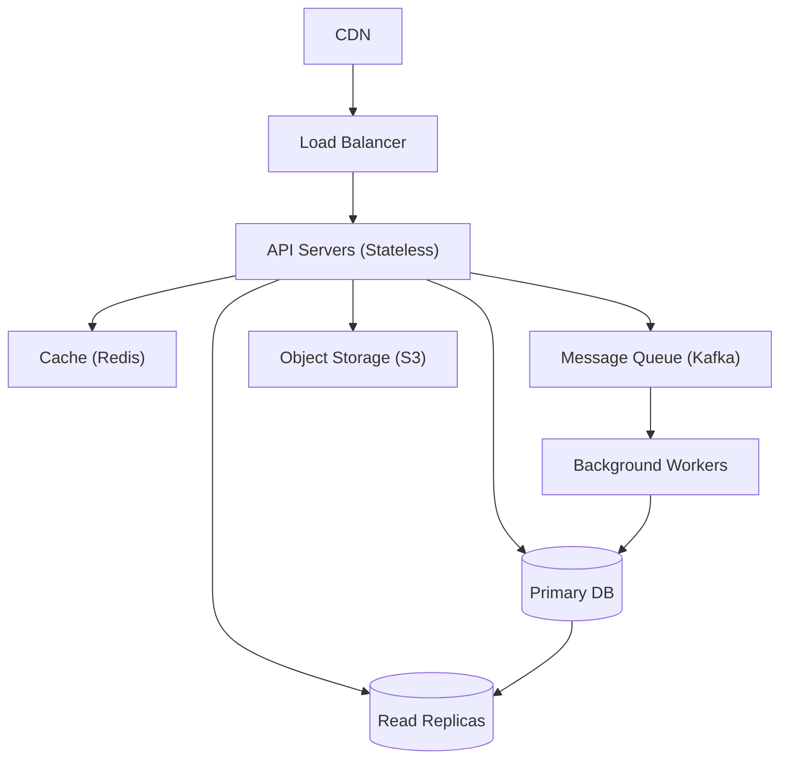

# Design Checklist

This checklist is your quality gate for any system design. Use it before, during, and after designing a system to ensure you've addressed all critical dimensions. In an interview, run through this mentally as you design. In a real-world design review, use it to catch gaps before your RFC goes to the team. A senior engineer is distinguished not by knowing more patterns, but by knowing what they forgot to think about.

> **How to use:** Go through each section during your design. Check off items you've addressed. For anything unchecked, consciously decide whether it's in scope — then explicitly state "I'm deferring X for now because [reason]."

---

## Phase 1: Requirements

```
[ ] Identified the 3-5 core functional requirements
[ ] Stated which features are OUT of scope
[ ] Confirmed the read/write ratio (read-heavy? write-heavy? equal?)
[ ] Confirmed the user scale (DAU, MAU)
[ ] Confirmed latency requirements (P99 < 100ms? real-time? batch OK?)
[ ] Confirmed consistency requirements (strong? eventual?)
[ ] Confirmed availability requirements (99.9%? 99.99%?)
[ ] Confirmed durability requirements (zero data loss? best-effort OK?)
[ ] Confirmed geographic scope (single region? multi-region? global?)
[ ] Checked if there are regulatory constraints (GDPR, PCI-DSS, HIPAA)
```

---

## Phase 2: Scale Estimation

```
[ ] Estimated read RPS (peak)
[ ] Estimated write RPS (peak)
[ ] Estimated storage needed (1 year, 5 years)
[ ] Estimated network bandwidth
[ ] Estimated cache size needed
[ ] Stated your assumptions and approximation method
[ ] Cross-checked: do the numbers justify your architecture choices?
```

**Quick sanity checks:**
- Does your database handle the write QPS? (PostgreSQL: ~5K-10K writes/sec; Cassandra: ~100K writes/sec)
- Does your API server fleet handle peak RPS? (1 server: ~1K-5K RPS for compute-light endpoints)
- Does your cache have enough memory for the hot dataset?

---

## Phase 3: API Design

```
[ ] Defined endpoints / message formats for all core features
[ ] Chose pagination strategy (cursor-based for feeds, offset for admin)
[ ] Defined authentication mechanism (JWT, session, API key, OAuth)
[ ] Considered rate limiting on API (per user? per IP? per endpoint?)
[ ] Defined error response format (HTTP status codes + error body)
[ ] Considered API versioning (v1/, Accept header, or none if internal)
[ ] Thought about backward compatibility (additive changes only)
```

---

## Phase 4: Data Model

```
[ ] Defined the core entities and their relationships
[ ] Chose the right database type for each entity:
    - SQL (ACID, complex queries, moderate write volume)
    - Key-value (simple lookup by ID, high throughput)
    - Wide-column (time-series, write-heavy, flexible schema)
    - Document (nested/hierarchical data, flexible schema)
    - Graph (relationship traversal: social graph, recommendations)
    - Object storage (binary files, media, backups)
[ ] Defined indexes for expected query patterns
[ ] Considered normalization vs. denormalization based on read/write ratio
[ ] Accounted for data growth (partitioning/sharding strategy)
[ ] Defined data retention policy (TTL, archival, deletion)
[ ] Considered data privacy (PII fields, encryption at rest)
```

**Schema red flags:**
- ❌ Storing comma-separated IDs in a column
- ❌ Querying by a non-indexed column on a large table
- ❌ Using a single `data` JSON blob for everything (sacrifices queryability)
- ❌ No timestamp fields (created_at, updated_at are nearly always needed)

---

## Phase 5: High-Level Architecture

```
[ ] Included client layer (web, mobile, or both)
[ ] Considered CDN for static assets / cacheable API responses
[ ] Included load balancer (with health checks, algorithm choice)
[ ] Application servers are stateless (session in Redis, not server memory)
[ ] Defined caching strategy (what to cache, TTL, invalidation approach)
[ ] Included message queue for async processing (where appropriate)
[ ] Separated concerns: read path vs. write path if they have different scaling needs
[ ] Data flows make sense end-to-end (trace a request from client to database and back)
```



---

## Phase 6: Reliability & Fault Tolerance

```
[ ] No single points of failure (SPOF identified and mitigated)
[ ] Database has replication (primary + at least 1 replica)
[ ] Cache failure doesn't bring down the system (fallback to DB)
[ ] Defined behavior when the message queue is full or down
[ ] Retry strategy defined (exponential backoff + jitter + max retries)
[ ] Circuit breaker pattern in place for external service calls
[ ] Graceful degradation: what features degrade first under load?
[ ] Health checks configured for all services
[ ] Defined RTO (Recovery Time Objective) and RPO (Recovery Point Objective)
[ ] Considered database backup strategy (full + incremental + point-in-time)
```

**Failure scenario checklist:**
- What happens if a database primary fails? → Replica promotion (automatic with RDS Multi-AZ, or manual)
- What happens if the cache fails? → Fall through to database
- What happens if a worker crashes mid-job? → Job re-queued after visibility timeout
- What happens if a downstream API is slow? → Circuit breaker opens; fail fast with cached/default response

---

## Phase 7: Scalability

```
[ ] API servers can scale horizontally (stateless)
[ ] Identified the database write bottleneck and plan to address it
    (read replicas, sharding, CQRS, eventual consistency)
[ ] Cache reduces read load on database
[ ] Async processing offloads non-critical work from the critical path
[ ] Message queue smooths write bursts (absorbs spikes)
[ ] CDN serves cacheable content without hitting origin servers
[ ] Considered connection pooling (PgBouncer, HikariCP) to protect database
[ ] Defined sharding key (if applicable) and justified the choice
[ ] Considered hot partitions (celebrity user, popular product) and mitigations
```

---

## Phase 8: Security

```
[ ] All API endpoints require authentication
[ ] Authorization checks: can this user access this resource? (IDOR prevention)
[ ] Input validation on all user-provided data
[ ] Sensitive data encrypted at rest (database encryption, field-level for PII)
[ ] Data encrypted in transit (HTTPS / TLS 1.3 everywhere)
[ ] API rate limiting to prevent abuse and DDoS
[ ] Secrets managed via vault (not hardcoded, not in environment variables)
[ ] CORS configured correctly (allowlist, not wildcard)
[ ] Audit logging for sensitive operations (logins, payments, data exports)
[ ] Considered SQL injection, XSS, CSRF for any web-facing surface
```

---

## Phase 9: Observability

```
[ ] Defined key metrics to monitor:
    - Request rate (RPS)
    - Error rate (4xx, 5xx)
    - Latency (P50, P95, P99)
    - Database query time
    - Cache hit rate
    - Queue depth
[ ] Structured logging with correlation IDs (trace requests across services)
[ ] Distributed tracing (Jaeger, Datadog APM, X-Ray)
[ ] Alerting on SLO breaches (error rate > 0.1%, P99 > 500ms)
[ ] Dashboards for on-call engineers
[ ] Runbooks for common failure scenarios
```

---

## Phase 10: Operational Concerns

```
[ ] Deployment strategy defined (blue-green? canary? rolling?)
[ ] Database migrations are backward-compatible (no breaking schema changes)
[ ] Feature flags for gradual rollout of risky changes
[ ] Capacity planning: how much headroom before the next scaling milestone?
[ ] Cost estimation: storage, compute, data transfer — is it sustainable?
[ ] On-call rotation and incident response process defined
```

---

## Interview-Specific Checklist

```
[ ] Started with requirements clarification before drawing anything
[ ] Stated scale estimates with math (not just "it'll be big")
[ ] Defined the API before the internals
[ ] Drew a complete high-level diagram (all components visible)
[ ] Traced at least one request end-to-end through the system
[ ] Identified the hardest technical challenge and went deep on it
[ ] Articulated at least 2-3 tradeoffs with explicit reasoning
[ ] Addressed how the system scales (horizontal scaling, sharding, etc.)
[ ] Discussed at least one failure scenario and the mitigation
[ ] Left time to review and discuss with the interviewer
```

---

## Key Takeaways

- **Requirements first** — every other decision flows from what you're building and at what scale
- **No single point of failure** — every stateful component needs a replica or failover
- **Stateless application servers** — enables horizontal scaling; externalize all state to Redis/database
- **Async everything non-critical** — email, notifications, analytics processing should never block the API response
- **Security is not optional** — authentication, authorization, and input validation on every surface
- **Observability is part of the design** — a system you can't monitor is a system you can't operate
- **Document your tradeoffs** — the "why not X" is as important as the "why Y"
