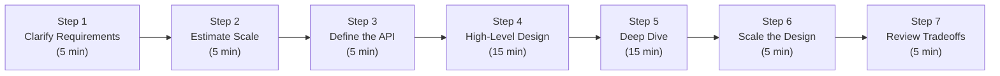
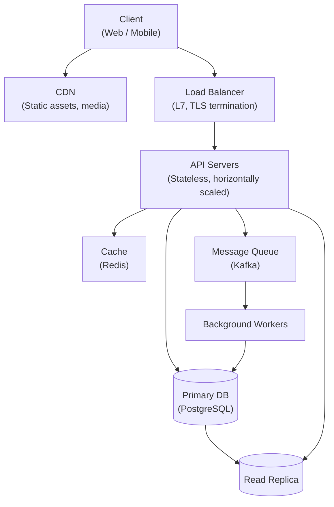
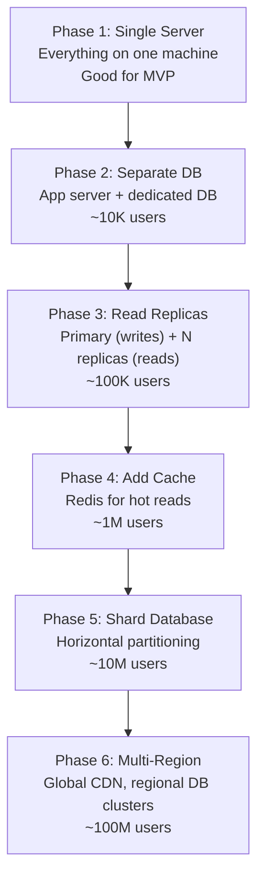

# Problem-Solving Framework

A system design interview is a 45-60 minute open-ended conversation, not a quiz with a correct answer. The interviewer is evaluating your thought process, communication, ability to navigate ambiguity, and engineering judgment. The candidates who perform best don't have memorized solutions — they have a reliable framework for decomposing any problem systematically. This guide gives you that framework: a repeatable 7-step process that works for any system design question at any level.

> **What interviewers are really evaluating:** Can you drive the conversation without being led? Do you ask the right clarifying questions? Do you think in tradeoffs, not absolutes? Can you go deep on the components that matter? Do you communicate clearly while designing?

---

## The 7-Step Framework



**Time allocation for a 45-minute interview:**
- Steps 1-3 (requirements, estimation, API): ~15 minutes
- Step 4 (high-level design): ~15 minutes
- Step 5 (deep dive): ~10 minutes
- Steps 6-7 (scaling, tradeoffs): ~5 minutes

---

## Step 1: Clarify Requirements (5 min)

Never start designing before you understand what you're building. The question is always underspecified by design — the interviewer wants to see if you ask smart questions.

### Functional Requirements

Functional requirements define **what the system does** — the core features:

```
Question: "Design Twitter"

Clarifying questions:
- Should I support both reading and writing tweets?
- Do I need to support following/followers?
- Should I design the home timeline (feed)?
- Do I need direct messages?
- What about trending topics, hashtags, media uploads?
- Is this read-heavy or write-heavy? (Twitter: ~100:1 read/write ratio)
- Mobile app, web, or both?
```

**The goal:** Narrow the scope to 3-5 core features you can realistically design in 45 minutes. Write them on the whiteboard/doc and explicitly state: *"I'm going to focus on: (1) posting tweets, (2) following users, (3) home timeline feed."*

### Non-Functional Requirements

Non-functional requirements define **how the system behaves** — performance, reliability, consistency:

```
- Scale: How many users? DAU? Read/write ratio?
- Latency: What's acceptable? Real-time (<100ms) or batch (minutes)?
- Availability: 99.9% (8.7h downtime/year) or 99.99% (52 min/year)?
- Consistency: Strong (banking) or eventual (social feed)?
- Durability: Is data loss acceptable at any scale?
- Geographic distribution: Single region or global?
```

> **Interview tip:** If the interviewer says "assume 100M DAU," write that down and build your whole design around it. If they don't give numbers, state your assumptions explicitly: *"I'll assume 10M DAU, growing to 100M, with roughly 10:1 read/write ratio. Let me know if you want different numbers."*

---

## Step 2: Estimate Scale (5 min)

Back-of-envelope calculations ground your design decisions in reality. They tell you whether you need one database server or 100, whether you can store data in memory or need distributed storage.

### The Key Metrics to Estimate

**Traffic:**
```
DAU = 10M users
Assuming each user makes 10 requests/day:
RPS = 10M × 10 / 86,400 ≈ 1,200 RPS average
Peak RPS = 3× average ≈ 3,600 RPS (2-3× peak factor)
```

**Storage:**
```
Tweet: 280 chars × 2 bytes = 560 bytes ≈ 1KB with metadata
10M users × 2 tweets/day = 20M tweets/day
20M × 1KB = 20GB/day
20GB × 365 = 7.3TB/year
5-year retention = 36TB
```

**Bandwidth:**
```
Read: 3,600 RPS × 10KB avg response = 36MB/s = ~290 Gbps
(CDN handles most of this for static content)
```

**Memory (caching 20% of reads in Redis):**
```
20% of daily reads cached
Estimate data set size → RAM needed
```

### Key Numbers to Memorize

| Unit | Value |
|---|---|
| Seconds in a day | 86,400 |
| Bytes in a KB | 1,024 |
| Bytes in a MB | 1,048,576 ≈ 10^6 |
| Bytes in a GB | ~10^9 |
| Bytes in a TB | ~10^12 |
| Peak = N× average | 2-3× for most systems |
| Character (UTF-8) | 1-4 bytes |
| UUID | 36 chars = 36 bytes |

> **Interview tip:** Show your work. "10M users, 10 requests each, so 100M requests per day, divide by 86,400 seconds, approximately 1,200 RPS." Interviewers care about your reasoning, not the exact number.

---

## Step 3: Define the API (5 min)

Define the interface before designing the internals. The API contract forces you to think clearly about inputs, outputs, and edge cases.

```
For Twitter:

POST /tweets
  Body: { content: string, media_ids?: string[] }
  Auth: Bearer token
  Response: { tweet_id: string, created_at: timestamp }

GET /feed
  Query: ?cursor=<last_tweet_id>&limit=20
  Auth: Bearer token
  Response: { tweets: Tweet[], next_cursor: string }

POST /follow
  Body: { user_id: string }
  Auth: Bearer token
  Response: 200 OK

GET /users/:id/tweets
  Query: ?cursor=<last_tweet_id>&limit=20
  Response: { tweets: Tweet[], next_cursor: string }
```

**Why define the API early:**
- Clarifies the exact data flows you need to design
- Forces you to think about pagination strategy
- Surfaces authentication/authorization requirements
- Gives you a checklist for the design: every endpoint needs a path through the system

> **Note on pagination:** Always use cursor-based pagination (not offset-based) for feeds. `offset=1000` forces the database to scan 1000 rows to skip them. A cursor (`WHERE id < :last_seen_id ORDER BY id DESC LIMIT 20`) is O(log n) with an index.

---

## Step 4: High-Level Architecture (15 min)

Draw the high-level diagram first — clients, load balancers, services, databases, caches, queues. Don't get into implementation details yet.



**Standard components to consider:**
- **Client layer:** Web, mobile, or both
- **CDN:** Static assets, media, potentially cached API responses
- **Load balancer:** Route traffic, SSL termination, health checks
- **API servers:** Stateless application logic
- **Cache:** Redis for hot data, session storage
- **Database:** Primary for writes, replicas for reads
- **Message queue:** Async processing, decoupling services
- **Background workers:** Fan-out, notifications, batch jobs
- **Object storage:** S3 for media/files

**Walk through a core flow end-to-end:** *"When a user posts a tweet, the request hits the load balancer, routes to an API server, which writes to the primary database, publishes an event to Kafka, and the fan-out worker reads from Kafka to push the tweet ID to each follower's Redis timeline list."*

---

## Step 5: Deep Dive on Components (15 min)

The interviewer will direct you to a specific component for deep dive — or ask you to propose one. Go deep on the hardest/most interesting parts of the system.

**Common deep-dive areas:**

| Component | What Interviewers Probe |
|---|---|
| **Database schema** | Table design, indexes, normalization decisions, query patterns |
| **Feed/timeline** | Fan-out on write vs read, cache strategy, celebrity problem |
| **Search** | Inverted index, full-text search, ranking signals |
| **Caching** | Cache-aside vs write-through, eviction policy, cache invalidation |
| **Messaging/queue** | At-least-once vs exactly-once, consumer groups, ordering |
| **Rate limiting** | Token bucket vs leaky bucket, distributed rate limiting |
| **Unique ID generation** | UUID vs Snowflake vs database auto-increment |
| **Distributed transactions** | Two-phase commit, Saga pattern, outbox pattern |

**Deep dive example — unique ID generation:**

```
Options:
1. Database auto-increment: Simple but single point of failure, no horizontal scale
2. UUID v4: Globally unique, no coordination needed, but 128-bit, not sortable, poor DB index performance
3. Twitter Snowflake: 64-bit, time-sortable, encodes datacenter + machine ID + sequence
   Format: [41 bits timestamp][5 bits datacenter][5 bits machine][12 bits sequence]
   
   Advantages: Sortable by time, 64-bit (fits in BIGINT), 4096 IDs/ms per machine
   Disadvantages: Clock skew risk, requires machine ID assignment
4. ULID: Like UUID but sortable; base32 encoded
```

---

## Step 6: Scale the Design (5 min)

Start simple, then explain how you'd scale each component:



**Scaling patterns to mention:**
- **Horizontal scaling:** Stateless API servers behind a load balancer
- **Database read replicas:** Route SELECT queries to replicas, writes to primary
- **Caching:** Redis/Memcached for hot data; CDN for static content
- **Database sharding:** Partition by user_id hash or range for write scaling
- **Message queues:** Decouple services; absorb write bursts
- **Async processing:** Move non-critical work off the critical path
- **Multi-region:** CDN + geographically distributed database clusters

---

## Step 7: Review Tradeoffs (5 min)

Show that you understand the design has tradeoffs — there is no perfect architecture:

```
Fan-out on write (Twitter home timeline):
✅ Fast reads: O(1) Redis list fetch per timeline
❌ Write amplification: 1 tweet × N followers = N writes
❌ Celebrity problem: Lady Gaga has 40M followers → 40M writes per tweet

Decision: Fan-out on write for regular users (<1M followers)
         Pull-on-read for celebrities (merge at query time)
         Hybrid is the production reality

SQL vs NoSQL for user profiles:
✅ SQL (PostgreSQL): ACID, strong consistency, flexible queries
✅ NoSQL (Cassandra): Horizontal scaling, high write throughput

Decision: SQL for user data (ACID guarantees needed, moderate scale)
          Cassandra for timelines (write-heavy, eventual consistency acceptable)
```

---

## Common Interview Anti-Patterns to Avoid

| Anti-Pattern | What to Do Instead |
|---|---|
| Starting to design without asking questions | Always clarify requirements first — take 5 minutes |
| Going too deep too early | Sketch the high-level first, then deep dive |
| Presenting only one option | Always say "I can go with X or Y — let me explain the tradeoff" |
| Ignoring non-functional requirements | Explicitly address availability, consistency, latency |
| Forgetting failure modes | "What happens if this service is down? What if the database is slow?" |
| Designing without numbers | Tie every decision to a scale estimate |
| Passive — waiting for the interviewer to direct | Drive the conversation; say "Now I want to deep dive on X" |

---

## Interview Communication Templates

**Opening:** *"Before I start designing, let me clarify a few things. Are we building for [functional feature]? What's the expected scale — DAU, read/write ratio? What are the availability requirements?"*

**After requirements:** *"Based on that, the core features I'll design are: X, Y, Z. I'll assume 10M DAU, 1,000 RPS peak, and we need 99.9% availability with eventual consistency for the feed."*

**Transitioning to deep dive:** *"I've covered the high-level architecture. The most interesting technical challenge here is [X]. I'd like to deep dive on that — is that where you want to go, or is there another area you're curious about?"*

**Discussing tradeoffs:** *"I chose [X] here because [reason]. The downside is [tradeoff], which I'd handle by [mitigation]. An alternative would be [Y], which works better if [condition]."*

**When stuck:** *"Let me think through this. The constraint is [X], which means [implication]. I think the right approach is [Y] because [reason], but I want to validate my assumption about [Z] — am I thinking about that correctly?"*

---

## Key Takeaways

- **Drive the conversation** — the best candidates direct the interview, not just respond
- **Clarify before designing** — spend 5 minutes on requirements; wrong requirements = wasted design
- **Estimate with math** — tie every design decision to a number; "we need sharding because we'll have 36TB in 5 years"
- **High-level first, then deep** — never optimize before you've established the overall architecture
- **Think in tradeoffs** — every decision has a cost; articulate what you're giving up
- **Address NFRs explicitly** — availability, consistency, latency are as important as functionality
- **Ask for direction** — "Would you like to go deeper on X, or should I move to Y?" shows collaboration
- **Practice the framework** — internalize the 7 steps until they're automatic, so you can focus on problem-solving
