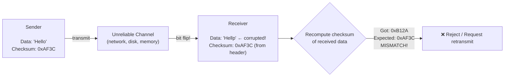
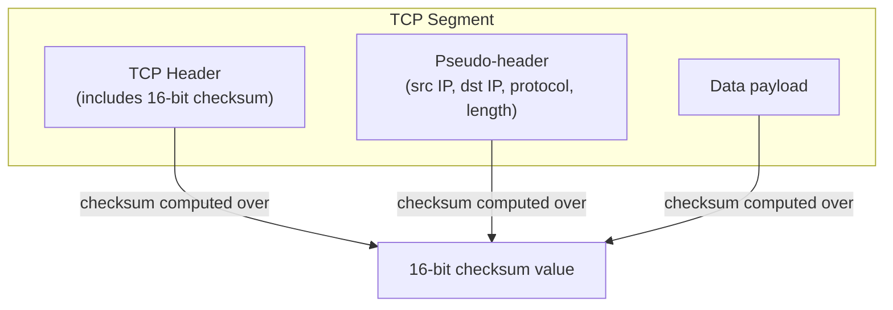
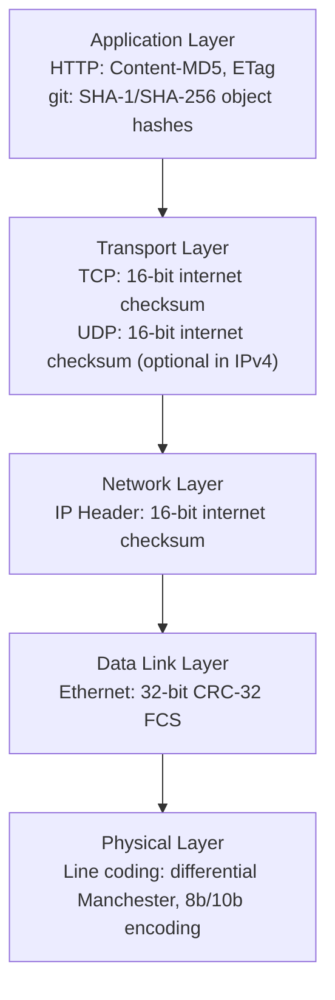
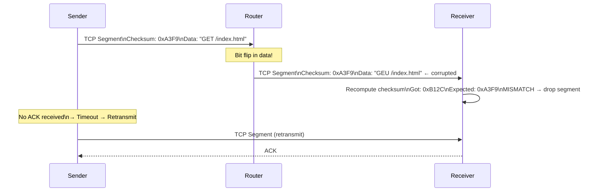
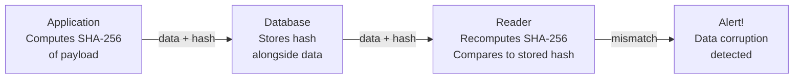

# Checksums

A checksum is a small, fixed-size value computed from a block of data. It acts as a digital fingerprint: if the data changes — even by a single bit — the checksum changes. Checksums are one of the oldest and most widely used tools in computing, embedded in every TCP packet you send, every file you download, every Docker image you pull.

> **The core guarantee:** If the checksum matches, the data is (with very high probability) intact. If it doesn't match, the data is definitely corrupted.

---

## The Problem Checksums Solve

Data corruption happens everywhere:

- **Transmission errors:** Cosmic rays, electromagnetic interference, hardware faults
- **Storage degradation:** Bit rot in spinning disks (silent data corruption)
- **Memory errors:** DRAM bit flips (ECC memory exists for this reason)
- **Network packet loss/corruption:** Flipped bits in transit

Without checksums, corrupted data is silently accepted as valid. With checksums, corruption is detected — and the system can request retransmission or reject the bad data.



---

## How Checksums Work

The simplest possible checksum: sum all bytes, take the result modulo 256:

```
Data: [0x48, 0x65, 0x6C, 0x6C, 0x6F]  ('Hello')

Sum:  0x48 + 0x65 + 0x6C + 0x6C + 0x6F = 0x214
Checksum (mod 256): 0x14

Sent: [0x48, 0x65, 0x6C, 0x6C, 0x6F, 0x14]
                                        ↑ appended checksum
```

Receiver re-computes the sum of all bytes (including the checksum). If the result is 0 (or matches the expected value), data is intact.

**Simple checksums are weak:** They miss transposition errors (swapping bytes) and certain multi-bit errors. Real-world checksums use far more sophisticated mathematics.

---

## Checksum Algorithms — From Simple to Cryptographic

### CRC — Cyclic Redundancy Check

CRC is the workhorse of network and storage checksums. It uses polynomial division over GF(2) (binary field) — far more reliable than simple addition.

**CRC variants:**

| Variant | Bits | Used In                                    |
| ------- | ---- | ------------------------------------------ |
| CRC-8   | 8    | Simple embedded systems                    |
| CRC-16  | 16   | Modbus, USB data packets                   |
| CRC-32  | 32   | Ethernet frames, ZIP files, gzip, PNG      |
| CRC-32C | 32   | iSCSI, SCTP, BTRFS (Castagnoli polynomial) |
| CRC-64  | 64   | ECMA standard, Linux ext4 journal          |

**CRC-32 is everywhere:**

- Every Ethernet frame is protected by a 4-byte CRC-32 FCS (Frame Check Sequence)
- ZIP archives use CRC-32 to detect corruption
- The gzip format includes a CRC-32 of the decompressed data
- PNG image chunks each carry a CRC-32

**CRC properties:**

- Extremely fast (hardware-accelerated in modern CPUs via `CRC32` instruction)
- Detects all single-bit and double-bit errors
- Detects all burst errors shorter than the CRC width
- **Not cryptographically secure** — an attacker can craft data with a specific CRC

### Adler-32

A faster alternative to CRC-32, used in zlib compression (which is inside gzip, PNG, HTTP compression):

```
Adler-32 maintains two 16-bit sums:
  A = 1 + sum of all bytes (mod 65521)
  B = sum of all A values (mod 65521)

Adler-32 = (B << 16) | A
```

Faster than CRC-32 for software implementation, but slightly weaker (less reliable detection). Modern systems typically use CRC-32 with hardware acceleration instead.

### Internet Checksum (RFC 1071)

Used in IP headers, TCP, and UDP. It's a 16-bit one's complement sum of 16-bit words:

```
IP Header checksum computation:
  1. Set checksum field to 0
  2. Sum all 16-bit words in the header
  3. Add carry bits back in
  4. Take one's complement (~result)
  5. Store in checksum field

Verification:
  Sum all 16-bit words including checksum
  Result should be 0xFFFF (all ones in one's complement)
```

**Weakness:** Insensitive to swapped bytes within a 16-bit word. This is why TCP also includes a pseudo-header in its checksum (source IP, destination IP, protocol, length) to detect routing errors.



---

## Checksums vs Hash Functions vs Digital Signatures

These are often confused. They serve different purposes:

|                           | Checksum                  | Cryptographic Hash             | Digital Signature              |
| ------------------------- | ------------------------- | ------------------------------ | ------------------------------ |
| **Purpose**               | Error detection           | Integrity + identity           | Authenticity + non-repudiation |
| **Output size**           | 8–64 bits                 | 128–512 bits                   | 256–4096 bits                  |
| **Speed**                 | Extremely fast            | Fast                           | Slow                           |
| **Collision resistant**   | No                        | Yes                            | Yes                            |
| **Forgeable by attacker** | Yes                       | Computationally hard           | No (without private key)       |
| **Examples**              | CRC-32, Adler-32          | MD5, SHA-256, SHA-3            | RSA, ECDSA                     |
| **Use case**              | Network packets, disk I/O | File integrity, git, passwords | TLS certificates, code signing |

### MD5 — Fast but Broken

MD5 produces a 128-bit (32 hex character) hash. It was once widely used for file integrity verification:

```bash
$ md5sum ubuntu-22.04.iso
4b76b1c57adf2e7b7e0cf47c7f9a5c5e  ubuntu-22.04.iso
```

**MD5 is cryptographically broken:** Researchers demonstrated collision attacks in 2004 — two different inputs can produce the same MD5 hash. Never use MD5 for security purposes (password storage, digital signatures, security-critical integrity checks). It remains acceptable for **non-security checksums** (detecting accidental corruption, not malicious tampering).

### SHA Family — The Modern Standard

| Algorithm      | Output   | Speed           | Status                                          |
| -------------- | -------- | --------------- | ----------------------------------------------- |
| SHA-1          | 160 bits | Fast            | Deprecated (collisions found 2017)              |
| SHA-256        | 256 bits | Fast            | Current standard — use this                     |
| SHA-384        | 384 bits | Slightly slower | High-security applications                      |
| SHA-512        | 512 bits | Slightly slower | Very high security                              |
| SHA-3 (Keccak) | Variable | Moderate        | Alternative design (different algorithm family) |

**SHA-256 is the workhorse of modern computing:** TLS certificates, HTTPS, Bitcoin proof-of-work, git commits, JWT signatures, Docker image layers — all use SHA-256.

```bash
$ sha256sum ubuntu-22.04.iso
5e38b55d57d94ff029719342357325ed3bda38fa80054f9330dc789cd2d43931  ubuntu-22.04.iso
```

---

## Checksums in the Network Stack

Every layer of the TCP/IP stack has its own error detection:



**Why multiple layers?** Each layer protects its own header against corruption. The Ethernet FCS protects the entire frame. The IP checksum protects only the IP header. The TCP checksum protects the TCP header + data + pseudo-header. They're complementary, not redundant.

**Important:** TCP checksum is a weak 16-bit check. It does not protect against all errors in large data transfers. For data integrity in storage or long-distance transmission, application-level checksums (SHA-256) are used in addition.

---

## Real-World Checksum Applications

### Git — Content-Addressed Storage

Git uses SHA-1 (transitioning to SHA-256) to identify every object:

```bash
# Every commit, tree, blob, and tag is identified by its SHA-1
$ git log --oneline
a3f9b12 (HEAD) Add user authentication
c7d8e45 Fix database connection pool
...

# The hash IS the content fingerprint
$ echo "Hello, World!" | git hash-object --stdin
8ab686eafeb1f44702738c8b0f24f2567c36da6d

# Change one character → completely different hash
$ echo "Hello, World?" | git hash-object --stdin
4a0bb0a5c97a81b78f27e0e9d6bcafcf21e50bdf
```

**Why this matters:** Git's correctness guarantee comes from SHA-1. If any byte in a file, commit, or tree object is corrupted, its hash changes — and git detects the corruption. The entire history is tamper-evident.

### Docker Images

Docker image layers are content-addressed by SHA-256:

```bash
$ docker pull nginx
latest: Pulling from library/nginx
a2abf6c4d29d: Pull complete
Digest: sha256:0d17b565c37bcbd895e9d92315a3c2d421f5dd09b76e55b2a5c9e94bc4a1b3e7

$ docker inspect nginx | grep -A2 '"Id"'
"Id": "sha256:0d17b565c37bcb..."
```

Each layer's SHA-256 is computed from its content. This provides:

- **Deduplication:** Same layer in different images is stored once (same hash = same content)
- **Integrity:** A tampered layer has a different hash → pull is rejected
- **Caching:** Build cache invalidation is hash-based

### Amazon S3 — ETag and Integrity

S3 provides an `ETag` header for every object — typically the MD5 of the content (for objects smaller than 5GB, not multipart):

```
HTTP/1.1 200 OK
ETag: "d8e8fca2dc0f896fd7cb4cb0031ba249"
Content-MD5: 2NFsot0PiW/XzEywAxuiSQ==
```

In 2022, AWS added full end-to-end integrity checking with SHA-256, SHA-1, and CRC-32/CRC-32C:

```bash
# Upload with SHA-256 checksum
aws s3api put-object \
  --bucket my-bucket \
  --key my-file.txt \
  --body my-file.txt \
  --checksum-algorithm SHA256
```

This catches the "1-in-10-billion" silent data corruption events that happen at S3's scale.

### TCP Checksum in Action

Every TCP segment carries a 16-bit checksum. A corrupted segment is silently discarded — the sender retransmits after timeout:



### File Transfer Integrity (rsync, scp, cloud sync)

```bash
# After transferring a large file, verify with sha256sum
$ sha256sum large-database-backup.sql.gz
e3b0c44298fc1c149afb f4c8996fb92427ae41e4  large-database-backup.sql.gz

# Compare with sender's hash
sender_hash="e3b0c44298fc1c149afbf4c8996fb92427ae41e4649b934ca495991b7852b855"
received_hash=$(sha256sum large-database-backup.sql.gz | cut -d' ' -f1)

if [ "$sender_hash" = "$received_hash" ]; then
  echo "File integrity verified ✓"
else
  echo "CORRUPTION DETECTED — re-transfer required"
fi
```

### Package Management

Every Linux package manager verifies checksums before installation:

```bash
# APT verifies SHA-256 of downloaded packages against repository metadata
$ apt-get install nginx
...
SHA256:a2abf6c4d29d... OK   # Package passes integrity check

# npm lock file contains SHA-512 hashes for every package
# (package-lock.json)
"integrity": "sha512-0BHR1c8K..."
```

---

## Designing for Data Integrity at Scale

### End-to-End Checksum Strategy

At large scale, silent data corruption is a real threat. Google's "Corruptor" experiment found that even with hardware ECC memory and checksummed storage, data corruption events occurred regularly at Google's scale. The defense is **end-to-end checksumming**:



**The principle:** Don't trust any layer to be correct. Compute checksums at the application layer and verify end-to-end — not just at the network layer.

### Bloom Filters vs Checksums

A common confusion in interviews: **Bloom filters** probabilistically answer "is this element in a set?" while **checksums** verify data integrity. They're different tools solving different problems.

---

## Interview Talking Points

### What the interviewer wants to hear

**1. Checksums vs hashing vs signatures**

> "A checksum like CRC-32 detects accidental corruption quickly — it's in every TCP packet and Ethernet frame. A cryptographic hash like SHA-256 provides integrity against both accidents and tampering — used in git, Docker, TLS. A digital signature additionally provides authenticity — only the private key holder could have signed it."

**2. Why multiple checksum layers?**

> "The Ethernet CRC catches link-layer corruption. The TCP checksum catches transmission errors. But both are relatively weak (16 and 32-bit). At the application layer, for critical data like backups or database files, we also compute SHA-256 to catch errors that slipped through lower layers — silent corruption events that do happen at scale."

**3. Git's integrity model**

> "Git is a content-addressed store. Every object — blob, tree, commit — is identified by its SHA-1 (moving to SHA-256). If any byte in any file is corrupted, its hash changes, and git detects the mismatch. The entire history is a chain of hashes — tamper one thing and the chain breaks."

**4. MD5 — still acceptable?**

> "MD5 is cryptographically broken — you can engineer two files with the same MD5 hash. Never use it for security: not for password hashing, not for verifying software downloads. For detecting accidental corruption (non-adversarial) where speed matters, it's still technically functional but SHA-256 is fast enough that there's no reason not to use it."

---

## Key Takeaways

- Checksums provide **error detection** — they can tell you data is corrupted but generally cannot correct it
- **CRC-32** is the standard for network and storage checksums — fast, hardware-accelerated, in every Ethernet frame and ZIP file
- **SHA-256** is the standard cryptographic hash — used in TLS, git, Docker, package managers
- **MD5** is broken for security purposes — never use for password hashing, software verification, or any adversarial context
- **Multiple layers** of checksums are not redundant — each layer catches errors the others might miss
- At massive scale (Google, AWS, Netflix), **application-layer checksumming** (SHA-256 of payload) is essential because hardware and network errors do occur despite lower-level protections
- Git's entire correctness model is built on SHA-1 hashes — understanding this is a great interview talking point on distributed systems integrity
