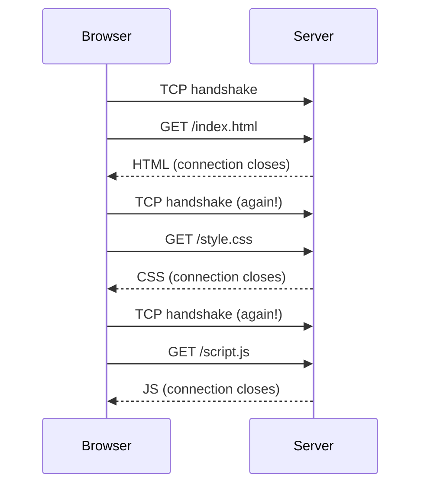
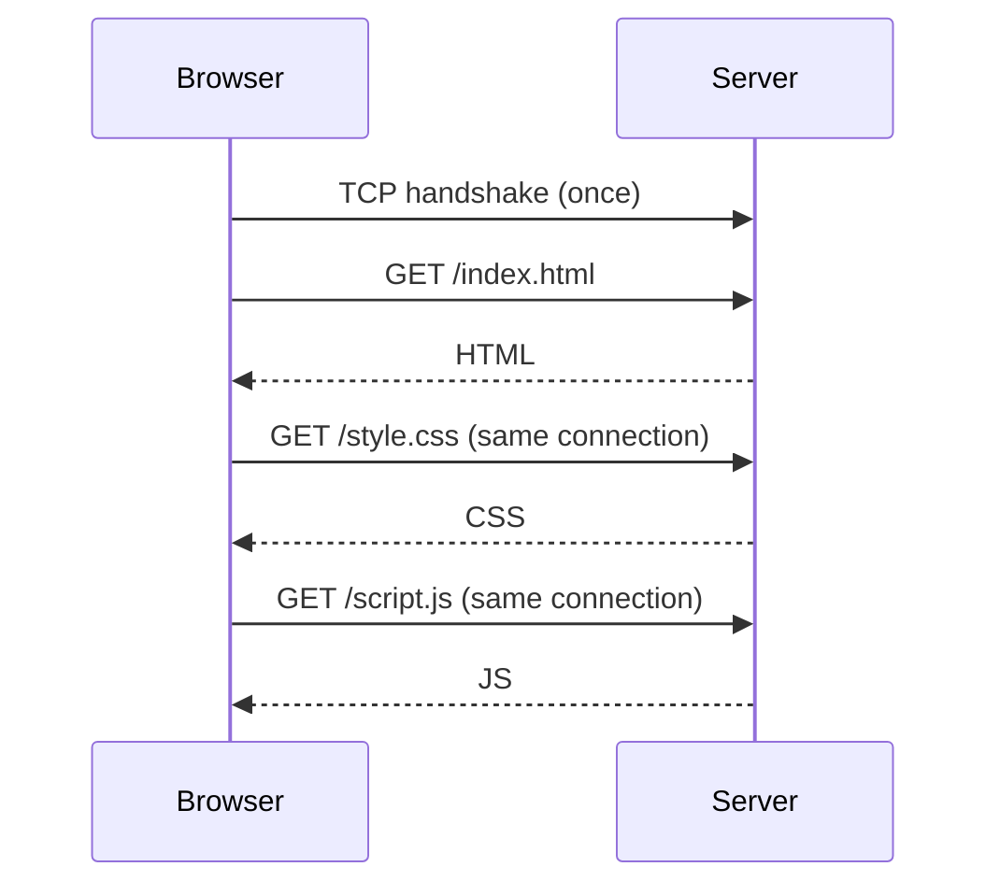
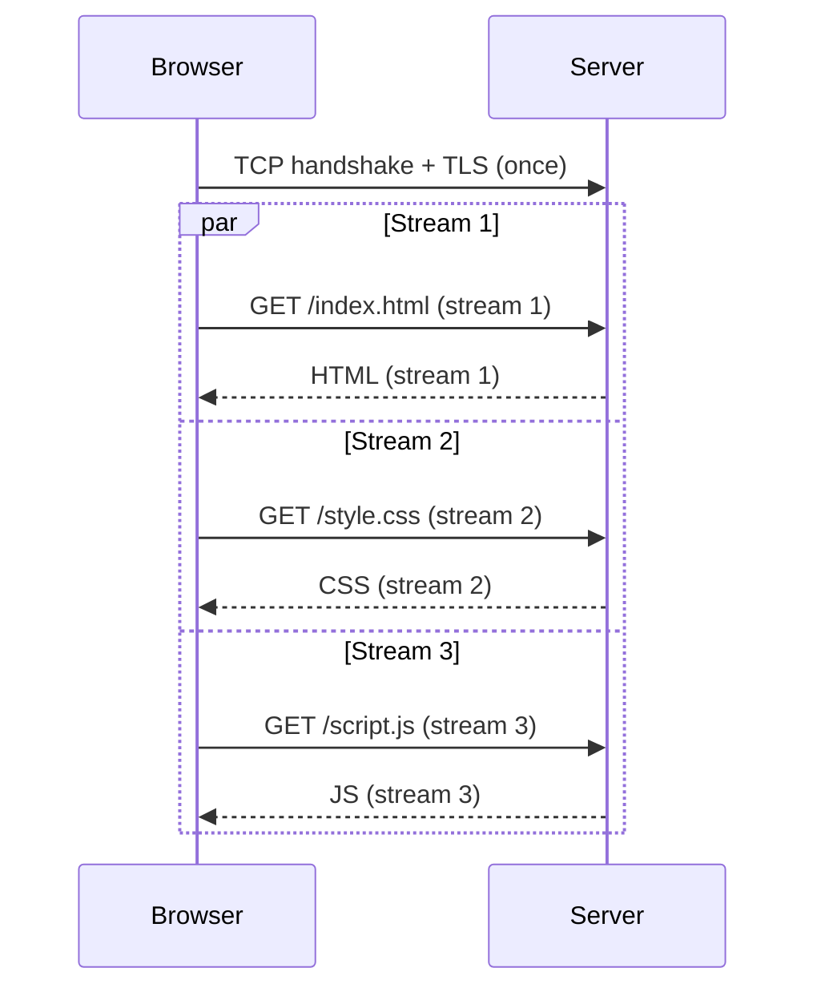
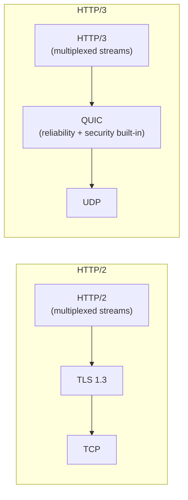
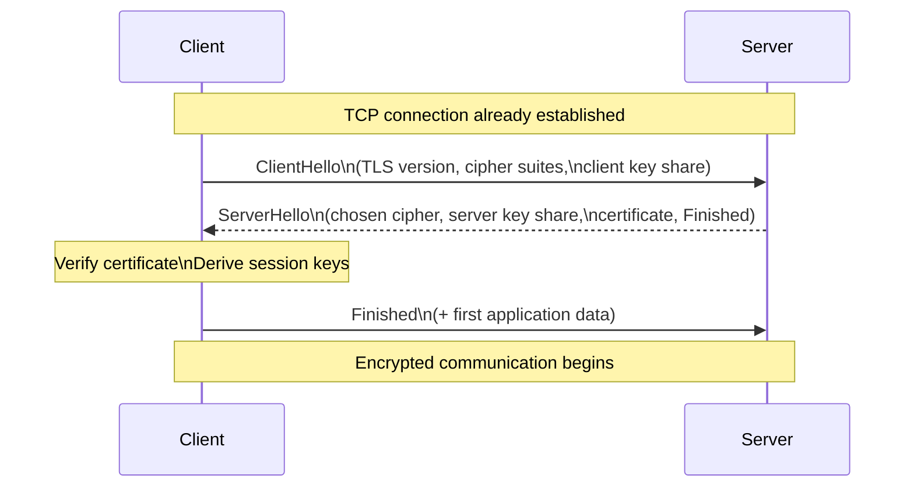
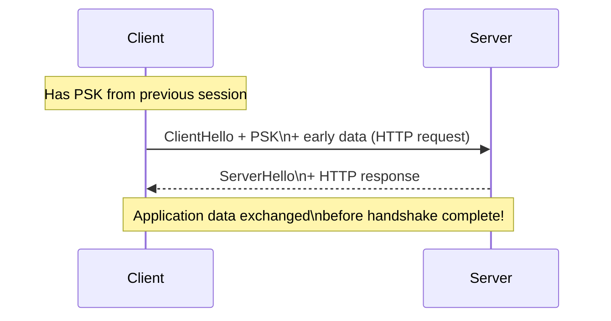
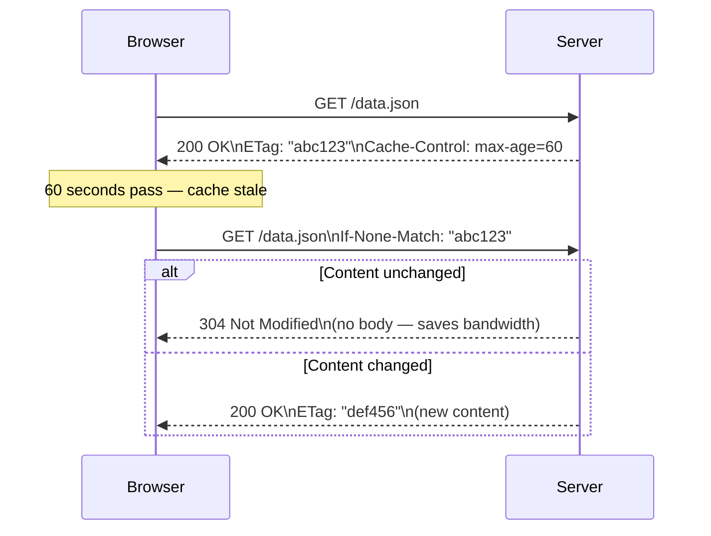
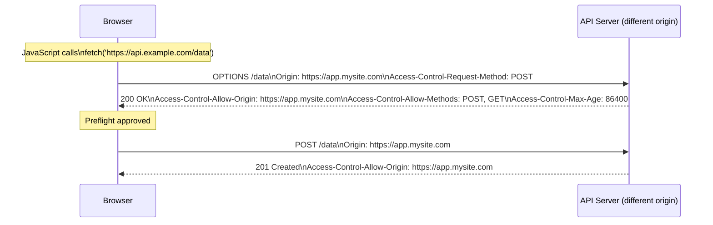

# HTTP / HTTPS

HTTP (HyperText Transfer Protocol) is the application-layer protocol that powers the web. Every API call, web page load, and microservice interaction you build likely runs over HTTP. Understanding its evolution from HTTP/1.0 to HTTP/3 is essential for making informed architecture decisions about performance, security, and scalability.

> **Why this matters in interviews:** HTTP version selection, connection management, caching headers, and TLS configuration are real-world engineering decisions. When asked "how would you reduce API latency?", knowing that HTTP/2 multiplexing eliminates connection overhead is a concrete answer.

---

## HTTP Fundamentals

HTTP is a **request-response protocol**: a client sends a request, a server returns a response. It's **stateless**: each request is independent — the server doesn't remember previous requests.

### Anatomy of an HTTP Request

```
POST /api/orders HTTP/1.1
Host: api.example.com
Content-Type: application/json
Authorization: Bearer eyJhbGci...
Content-Length: 89
User-Agent: MyApp/2.1

{"product_id": 42, "quantity": 2, "shipping_address": "123 Main St"}
```

**Components:**

- **Request line:** Method + Path + HTTP version
- **Headers:** Key-value metadata
- **Body:** Optional payload (POST, PUT, PATCH)

### Anatomy of an HTTP Response

```
HTTP/1.1 200 OK
Content-Type: application/json
Content-Length: 156
Cache-Control: private, max-age=0
X-Request-ID: a3f9b12c-...

{"order_id": "ord_123", "status": "created", "total": 49.99, ...}
```

---

## HTTP Methods

| Method      | Purpose                                     | Idempotent | Safe | Has Body |
| ----------- | ------------------------------------------- | ---------- | ---- | -------- |
| **GET**     | Retrieve resource                           | ✅         | ✅   | Rarely   |
| **POST**    | Create resource / trigger action            | ❌         | ❌   | ✅       |
| **PUT**     | Replace resource entirely                   | ✅         | ❌   | ✅       |
| **PATCH**   | Partially update resource                   | ❌         | ❌   | ✅       |
| **DELETE**  | Remove resource                             | ✅         | ❌   | Rarely   |
| **HEAD**    | GET without body (check existence/metadata) | ✅         | ✅   | No       |
| **OPTIONS** | Query supported methods (CORS preflight)    | ✅         | ✅   | Rarely   |

**Idempotent:** Calling it N times = same result as calling it once. Crucial for retry logic.  
**Safe:** Has no side effects — safe to call without worrying about data changes.

> **Interview tip:** "Why is GET idempotent but POST isn't?" — GET returns the same resource repeatedly. POST creates a new resource each time (submitting a form twice creates two orders).

---

## HTTP Status Codes

Every response carries a status code communicating the outcome:

| Range   | Category      | Common Examples                                                                                  |
| ------- | ------------- | ------------------------------------------------------------------------------------------------ |
| **1xx** | Informational | `100 Continue`, `101 Switching Protocols` (WebSocket upgrade)                                    |
| **2xx** | Success       | `200 OK`, `201 Created`, `204 No Content`                                                        |
| **3xx** | Redirection   | `301 Moved Permanently`, `302 Found`, `304 Not Modified`                                         |
| **4xx** | Client Error  | `400 Bad Request`, `401 Unauthorized`, `403 Forbidden`, `404 Not Found`, `429 Too Many Requests` |
| **5xx** | Server Error  | `500 Internal Server Error`, `502 Bad Gateway`, `503 Service Unavailable`, `504 Gateway Timeout` |

**Critical distinctions:**

- `401 Unauthorized` — not authenticated (no valid credentials)
- `403 Forbidden` — authenticated but not permitted
- `502 Bad Gateway` — your server got a bad response from upstream
- `503 Service Unavailable` — server is overloaded or down for maintenance
- `504 Gateway Timeout` — upstream server didn't respond in time

---

## The Evolution of HTTP

### HTTP/1.0 — One Request Per Connection (1996)

Each request opened a new TCP connection:



**Problem:** Loading a web page with 30 assets required 30 TCP handshakes + 30 TLS handshakes. Pure latency waste.

---

### HTTP/1.1 — Persistent Connections (1997)

Introduced `Connection: keep-alive` — reuse the TCP connection across multiple requests:



**Also introduced:** Pipelining (send multiple requests without waiting for responses). Sadly, pipelining was widely broken by proxies and disabled in most browsers.

**The HOL problem remains:** Requests on one connection are still serial — the second request can't be processed until the first response is received. Browsers worked around this by opening **6 parallel TCP connections per domain**.

**Other HTTP/1.1 improvements:** Chunked transfer encoding, host header (enabling virtual hosting), conditional requests (`If-Modified-Since`, `ETag`).

---

### HTTP/2 — Multiplexing Over One Connection (2015)

HTTP/2 is the biggest leap. It's a **binary protocol** (not text) and introduces **streams**:



**All on a single TCP connection, concurrently.**

**Key HTTP/2 features:**

**1. Multiplexing**  
Multiple request/response streams over one connection. No more 6-parallel-connections hack. No more HOL blocking at the HTTP layer (though TCP HOL blocking remains).

**2. Header Compression (HPACK)**  
HTTP headers are repetitive (User-Agent, Cookie, Host sent on every request). HPACK compresses headers using a shared dictionary — reducing overhead by 80–90%.

```
Request 1: Full headers (800 bytes)
Request 2: HPACK delta — only changed headers (~50 bytes)
Request 3: HPACK delta — only changed headers (~50 bytes)
```

**3. Server Push**  
Server proactively sends resources the browser will need:

```
Browser: GET /index.html
Server:  → sends HTML
Server:  → PUSH /style.css  (you'll need this)
Server:  → PUSH /script.js  (you'll need this too)
```

In practice, server push was difficult to use correctly and has been largely deprecated. HTTP Early Hints (`103`) is the modern alternative.

**4. Stream Prioritization**  
Clients assign priorities to streams. Critical CSS gets served before optional analytics scripts.

**5. Binary Protocol**  
HTTP/1.1 is text-based (human readable). HTTP/2 is binary — more efficient to parse, less error-prone.

---

### HTTP/3 — QUIC Replaces TCP (2022)

HTTP/2 over TCP still has TCP-level HOL blocking — if one TCP segment is lost, all HTTP/2 streams stall. HTTP/3 solves this by replacing TCP with QUIC (UDP-based):



**HTTP/3 improvements:**

- **No TCP HOL blocking** — each stream is independent; loss in one doesn't block others
- **0-RTT connection resumption** — returning clients send data in first packet (no handshake latency)
- **Connection migration** — survives IP changes (moving from WiFi to LTE doesn't break the connection)
- **Built-in TLS 1.3** — QUIC integrates encryption, eliminating the separate TLS handshake round-trip

**HTTP Version Comparison:**

| Feature                | HTTP/1.1    | HTTP/2          | HTTP/3                |
| ---------------------- | ----------- | --------------- | --------------------- |
| **Protocol**           | Text        | Binary          | Binary                |
| **Transport**          | TCP         | TCP             | QUIC (UDP)            |
| **Multiplexing**       | ❌ (serial) | ✅ (streams)    | ✅ (streams)          |
| **HOL blocking**       | HTTP + TCP  | TCP only        | None                  |
| **Header compression** | ❌          | HPACK           | QPACK                 |
| **Server Push**        | ❌          | ✅ (deprecated) | ❌ (removed)          |
| **Connection cost**    | 1 RTT + TLS | 1 RTT + TLS     | 1 RTT (or 0-RTT)      |
| **Adoption**           | Universal   | ~70% of web     | ~30% of web (growing) |

---

## HTTPS and TLS

HTTPS is HTTP + TLS (Transport Layer Security). TLS provides:

- **Encryption** — data is unreadable to eavesdroppers
- **Authentication** — server proves its identity via certificate
- **Integrity** — data cannot be tampered with in transit

### The TLS 1.3 Handshake

TLS 1.3 (the current standard) requires only **1 RTT** (down from 2 in TLS 1.2):



**Session resumption (0-RTT):** If client has previously connected to this server, it can include application data in the very first packet using a **Pre-Shared Key (PSK)**:



**0-RTT caveat:** Early data is susceptible to replay attacks — an attacker can replay the first packet. Only safe for idempotent requests (GET). Never use 0-RTT for state-changing operations.

### Certificate Validation

When a TLS connection is established, the client validates the server's certificate:

```
1. Server presents X.509 certificate (issued by a CA)
2. Client checks: Is this cert signed by a trusted CA? (Root store)
3. Client checks: Is the certificate for this domain (hostname verification)?
4. Client checks: Has the certificate expired?
5. Client checks: Is the certificate revoked? (OCSP / CRL)
6. If all pass → handshake proceeds
```

**Certificate pinning:** Mobile apps sometimes hardcode the expected certificate or public key. Even if an attacker installs a root CA on the device, the pinned cert won't match → connection fails. This is powerful security but complicates certificate rotation.

---

## Critical HTTP Headers

### Request Headers

| Header              | Purpose                               | Example                         |
| ------------------- | ------------------------------------- | ------------------------------- |
| `Host`              | Target server (mandatory in HTTP/1.1) | `api.example.com`               |
| `Authorization`     | Auth credentials                      | `Bearer eyJhbGci...`            |
| `Content-Type`      | Body format                           | `application/json`              |
| `Accept`            | Acceptable response formats           | `application/json, text/html`   |
| `Accept-Encoding`   | Compression support                   | `gzip, deflate, br`             |
| `User-Agent`        | Client identification                 | `Mozilla/5.0...`                |
| `If-None-Match`     | Conditional request (ETag)            | `"abc123"`                      |
| `If-Modified-Since` | Conditional request (date)            | `Thu, 01 Jun 2025 00:00:00 GMT` |
| `X-Forwarded-For`   | Original client IP (set by proxy)     | `203.0.113.45`                  |

### Response Headers

| Header                        | Purpose                     | Example                               |
| ----------------------------- | --------------------------- | ------------------------------------- |
| `Content-Type`                | Body format + charset       | `application/json; charset=utf-8`     |
| `Content-Encoding`            | Compression applied         | `gzip`                                |
| `Cache-Control`               | Caching directives          | `public, max-age=3600`                |
| `ETag`                        | Resource fingerprint        | `"d8e8fca2dc..."`                     |
| `Location`                    | Redirect target             | `https://new.example.com/`            |
| `Retry-After`                 | When to retry after 429/503 | `60` (seconds)                        |
| `Strict-Transport-Security`   | Force HTTPS                 | `max-age=31536000; includeSubDomains` |
| `X-Content-Type-Options`      | Prevent MIME sniffing       | `nosniff`                             |
| `Access-Control-Allow-Origin` | CORS allowed origins        | `https://app.example.com`             |

---

## HTTP Caching

HTTP has a built-in caching model that, when used correctly, dramatically reduces server load and latency.

### Cache-Control Directives

```
Cache-Control: public, max-age=86400
 └─ public:     CDNs and proxies can cache this
 └─ max-age:    Fresh for 86400 seconds (24 hours)

Cache-Control: private, max-age=300
 └─ private:    Only browser can cache (not CDN)
 └─ max-age:    Fresh for 5 minutes

Cache-Control: no-store
 └─ Never cache — sensitive data (banking, auth)

Cache-Control: no-cache
 └─ Can cache but must revalidate on every use

Cache-Control: public, max-age=31536000, immutable
 └─ immutable:  Never revalidate (content hash in URL)
```

### Conditional Requests

After a cached response expires, the browser doesn't throw it away — it revalidates:



A `304 Not Modified` response has no body — the browser uses its cached copy. This saves significant bandwidth for large responses.

---

## CORS — Cross-Origin Resource Sharing

The browser's Same-Origin Policy blocks JavaScript from making requests to a different origin (domain/port/protocol). CORS is the mechanism that allows controlled cross-origin access.

### Preflight Request

For non-simple requests (e.g., POST with JSON body), the browser sends a preflight `OPTIONS` request first:



**`Access-Control-Max-Age`** caches the preflight result — so subsequent calls don't repeat the OPTIONS round-trip.

> **Never use `Access-Control-Allow-Origin: *` for authenticated APIs** — it means any website can make requests using the user's cookies. Always specify exact allowed origins.

---

## Security Headers Checklist

Every production HTTPS deployment should include:

```http
Strict-Transport-Security: max-age=31536000; includeSubDomains; preload
X-Content-Type-Options: nosniff
X-Frame-Options: DENY
Content-Security-Policy: default-src 'self'; script-src 'self' 'nonce-xyz'
Referrer-Policy: strict-origin-when-cross-origin
Permissions-Policy: camera=(), microphone=(), geolocation=()
```

| Header                    | Prevents                                |
| ------------------------- | --------------------------------------- |
| `HSTS`                    | Downgrade attacks, mixed content        |
| `X-Content-Type-Options`  | MIME-type confusion attacks             |
| `X-Frame-Options`         | Clickjacking                            |
| `Content-Security-Policy` | XSS, data injection                     |
| `Referrer-Policy`         | Leaking sensitive URLs to third parties |

---

## HTTP in System Design Interviews

### What the interviewer wants to hear

**1. HTTP version selection**

> "For a public API, I'd ensure HTTP/2 is supported — it gives clients multiplexing and header compression for free, reducing latency for clients making concurrent requests. For mobile clients on lossy networks, HTTP/3 would be the long-term goal to eliminate TCP HOL blocking."

**2. Caching strategy**

> "Static assets with content-hashed filenames get `Cache-Control: public, max-age=31536000, immutable` — they never change, so they cache forever. API responses get `Cache-Control: private, max-age=60` or `no-store` for user-specific sensitive data."

**3. TLS in microservices**

> "At the edge, TLS terminates at the load balancer. Internal service-to-service traffic within the private VPC can run plain HTTP to reduce overhead — but if zero-trust is a requirement, mutual TLS (mTLS) ensures every internal call is authenticated and encrypted."

**4. Handling CORS**

> "The API Gateway handles CORS — it inspects the Origin header and adds the appropriate Allow headers. Individual microservices don't need to know about CORS. We whitelist specific origins rather than using wildcard to prevent cross-site credential leakage."

---

## Key Takeaways

- **HTTP/1.1** introduced persistent connections; **HTTP/2** added binary multiplexing; **HTTP/3** replaced TCP with QUIC
- **HTTP/2 multiplexing** eliminates the need for parallel connections and reduces latency significantly
- **HTTP/3 / QUIC** eliminates TCP head-of-line blocking and reduces handshake cost to 1 RTT (0-RTT for returning clients)
- **TLS 1.3** is the security standard — 1 RTT handshake, strong cipher suites only, forward secrecy built-in
- **Cache-Control headers** are your primary lever for CDN and browser caching — get them right and your origin sees a fraction of the traffic
- **CORS** is a browser security mechanism — always configure specific origins, never use `*` for authenticated APIs
- **Security headers** (HSTS, CSP, X-Frame-Options) are table stakes for any production HTTPS deployment
