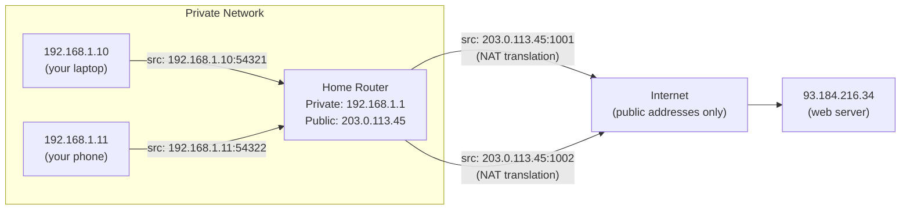
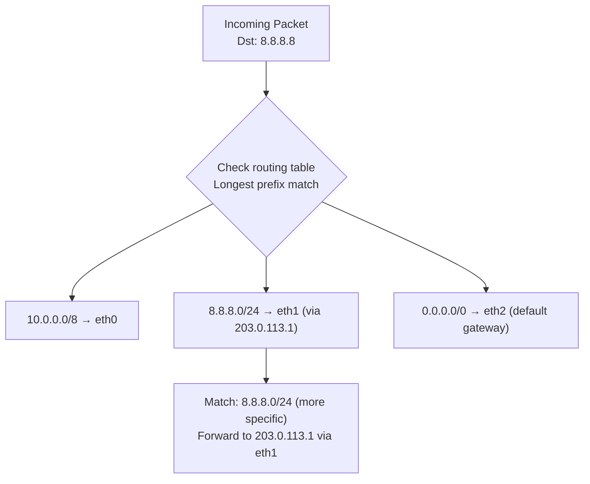
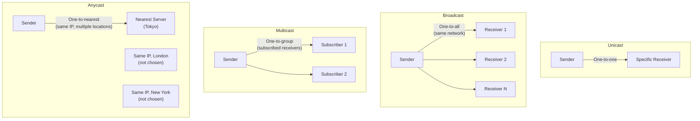
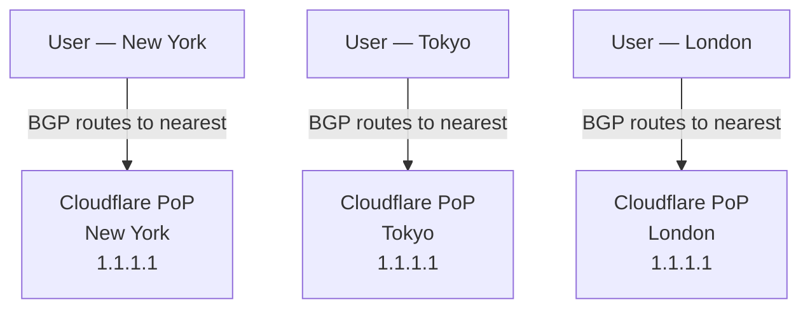
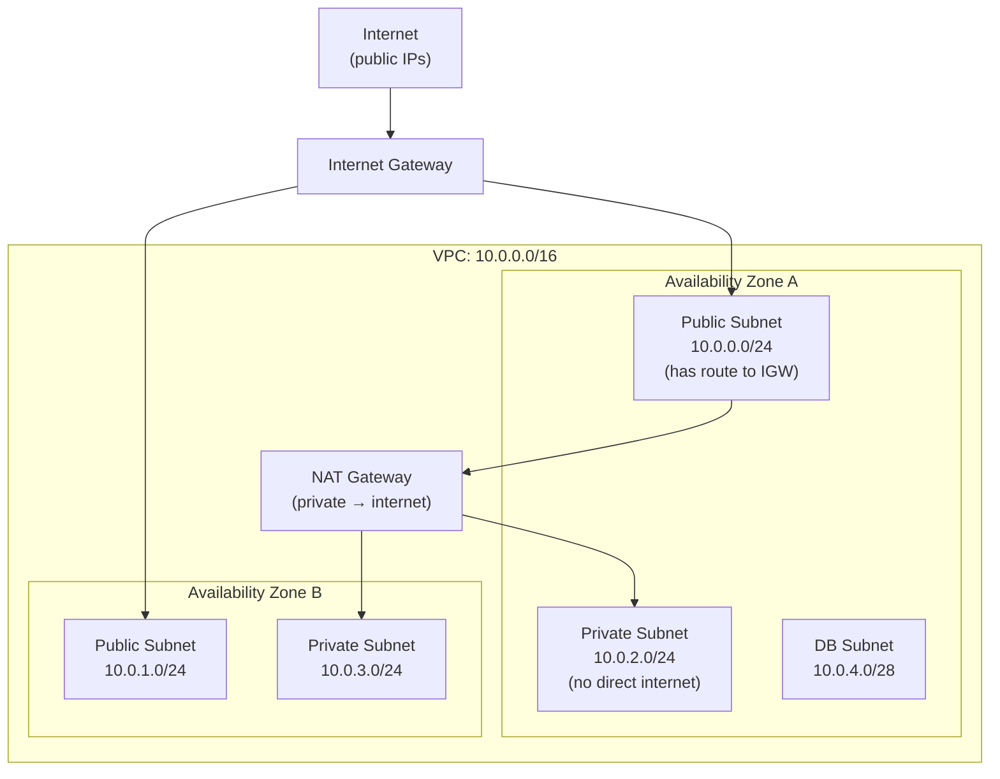

# IP Addresses

An IP address is the fundamental identifier for every device on a network. Every request you make, every packet you send, every connection you open is routed using IP addresses. Understanding how they work — their structure, types, and the routing mechanisms built around them — is foundational to system design, networking, and infrastructure engineering.

> **In system design interviews:** IP addressing comes up when discussing network architecture, multi-region deployments, anycast routing (CDNs, DNS), NAT, and how services are exposed to the internet. Engineers who understand subnetting and routing reason more clearly about network topology.

---

## IPv4 — The Foundation

An IPv4 address is a **32-bit number** written as four decimal octets separated by dots:

```
192.168.1.100
└─┘ └─┘ └┘ └─┘
 8   8   8   8   = 32 bits total

Range per octet: 0–255
Total addresses: 2³² = 4,294,967,296 (~4.3 billion)
```

### Binary Representation

Understanding binary helps with subnetting:

```
192         . 168         . 1           . 100
11000000    . 10101000    . 00000001    . 01100100
```

Every IP address decision (subnetting, CIDR, routing) is made in binary, then displayed in decimal for human readability.

---

## IPv4 Address Classes (Historical)

Originally, the IPv4 space was divided into classes based on the first octet:

| Class | Range   | Default Subnet      | Hosts per Network |
| ----- | ------- | ------------------- | ----------------- |
| **A** | 1–126   | /8 (255.0.0.0)      | 16,777,214        |
| **B** | 128–191 | /16 (255.255.0.0)   | 65,534            |
| **C** | 192–223 | /24 (255.255.255.0) | 254               |
| **D** | 224–239 | N/A                 | Multicast         |
| **E** | 240–255 | N/A                 | Reserved          |

Classful addressing was rigid and wasteful (a company needing 300 hosts got a Class B with 65K addresses). **CIDR** replaced it.

---

## CIDR — Classless Inter-Domain Routing

CIDR (introduced 1993) allows arbitrary-length prefix masks, making IP allocation far more efficient:

```
192.168.1.0/24
             └─ Prefix length (24 bits)

Network bits:  192.168.1  (first 24 bits — fixed)
Host bits:             x  (last 8 bits — varies)
Hosts available: 2⁸ - 2 = 254  (subtract network + broadcast addresses)
```

### CIDR Notation Cheat Sheet

| CIDR  | Hosts      | Subnet Mask     | Typical Use                   |
| ----- | ---------- | --------------- | ----------------------------- |
| `/8`  | 16,777,214 | 255.0.0.0       | Large ISP allocations         |
| `/16` | 65,534     | 255.255.0.0     | Large cloud VPCs              |
| `/24` | 254        | 255.255.255.0   | Office LAN, small subnet      |
| `/28` | 14         | 255.255.255.240 | Small service subnet          |
| `/30` | 2          | 255.255.255.252 | Point-to-point links          |
| `/32` | 1          | 255.255.255.255 | Single host (loopback, route) |

### Calculating CIDR Subnets

For `10.0.0.0/22`:

```
Prefix = 22 bits
Host bits = 32 - 22 = 10 bits
Hosts = 2¹⁰ - 2 = 1022 usable hosts

Network:   10.0.0.0
First host: 10.0.0.1
Last host:  10.0.3.254
Broadcast:  10.0.3.255
```

**Cloud VPC example (AWS):**

```
VPC: 10.0.0.0/16 (65,534 addresses)
├── Public subnet AZ-a:  10.0.0.0/24  (254 hosts)
├── Public subnet AZ-b:  10.0.1.0/24  (254 hosts)
├── Private subnet AZ-a: 10.0.2.0/24  (254 hosts)
├── Private subnet AZ-b: 10.0.3.0/24  (254 hosts)
└── DB subnet AZ-a:      10.0.4.0/28  (14 hosts)
```

---

## Special and Reserved IP Ranges

Not all IP addresses are routable on the public internet:

### Private Address Ranges (RFC 1918)

These are reserved for private networks and are **not routed on the internet**:

| Range                           | CIDR             | Typical Use                             |
| ------------------------------- | ---------------- | --------------------------------------- |
| `10.0.0.0 – 10.255.255.255`     | `10.0.0.0/8`     | Large corporate networks, cloud VPCs    |
| `172.16.0.0 – 172.31.255.255`   | `172.16.0.0/12`  | Docker default bridge (`172.17.0.0/16`) |
| `192.168.0.0 – 192.168.255.255` | `192.168.0.0/16` | Home routers, small office networks     |

Any packet with a private source or destination IP that reaches the public internet is dropped by routers — this is by design.

### Other Special Ranges

| Range             | Purpose                                               |
| ----------------- | ----------------------------------------------------- |
| `127.0.0.0/8`     | Loopback (localhost). `127.0.0.1` is your own machine |
| `0.0.0.0/0`       | Default route (matches all destinations)              |
| `169.254.0.0/16`  | Link-local (APIPA) — self-assigned when DHCP fails    |
| `224.0.0.0/4`     | Multicast (one-to-many)                               |
| `255.255.255.255` | Limited broadcast (to all hosts on local network)     |

---

## NAT — Network Address Translation

Private addresses can't be routed on the internet. NAT bridges the gap by translating private IPs to a public IP at the network boundary:



**NAT Translation Table:**

| Internal IP:Port   | External IP:Port  | Destination       |
| ------------------ | ----------------- | ----------------- |
| 192.168.1.10:54321 | 203.0.113.45:1001 | 93.184.216.34:443 |
| 192.168.1.11:54322 | 203.0.113.45:1002 | 93.184.216.34:443 |

When a response arrives at `203.0.113.45:1001`, the router looks up its NAT table and forwards to `192.168.1.10:54321`.

**NAT types:**

- **SNAT (Source NAT):** Changes source IP — most common (home routers, cloud outbound traffic)
- **DNAT (Destination NAT):** Changes destination IP — used for port forwarding, load balancing
- **PAT (Port Address Translation):** Many private IPs share one public IP using different ports (what home routers do)

**NAT problems:**

- Breaks peer-to-peer protocols (both sides behind NAT can't initiate connections to each other)
- Complicates VoIP, gaming, BitTorrent — requires STUN/TURN, UPnP, or manual port forwarding
- Statefulness — NAT state tables can exhaust under high connection volume

---

## IPv6 — The Solution to Address Exhaustion

IPv4 has ~4.3 billion addresses. The internet hit exhaustion in 2011 (IANA level). IPv6 provides:

**IPv6:** 128-bit addresses = $2^{128}$ = **340 undecillion addresses** (340 × 10³⁶)

```
IPv4: 93.184.216.34                        (dotted decimal, 32 bits)
IPv6: 2606:2800:220:1:248:1893:25c8:1946   (colon-hex, 128 bits)
```

### IPv6 Notation Rules

```
Full:        2001:0db8:0000:0000:0000:0000:0000:0001
Compressed:  2001:db8::1  (leading zeros dropped, consecutive zero groups → ::)

Loopback:    ::1           (equivalent to 127.0.0.1)
All zeros:   ::            (unspecified)
```

### Key IPv6 Benefits

| Feature                | IPv4                   | IPv6                                |
| ---------------------- | ---------------------- | ----------------------------------- |
| **Address space**      | 4.3 billion            | 340 undecillion                     |
| **NAT required**       | Yes (for private nets) | No (every device gets public IP)    |
| **Header complexity**  | Variable, complex      | Simplified fixed header             |
| **Auto-configuration** | DHCP required          | SLAAC (stateless, no server needed) |
| **IPSec**              | Optional               | Designed-in (built-in support)      |
| **Fragmentation**      | At routers             | Only at source                      |
| **Broadcast**          | Yes                    | Replaced by multicast/anycast       |

### IPv6 Adoption Reality

Despite being standardized in 1998, IPv6 adoption is gradual:

- ~40% of Google traffic is IPv6 (2025)
- Most major cloud providers support dual-stack (IPv4 + IPv6 simultaneously)
- Most modern OSes prefer IPv6 when available (Happy Eyeballs algorithm)

**Dual-stack:** Devices have both IPv4 and IPv6 addresses. The client uses whichever works. This is the transition path for most organizations.

---

## Routing — How Packets Find Their Destination

When a router receives a packet, it consults its **routing table** to decide where to forward it:



**Longest prefix match wins:** `8.8.8.0/24` beats `0.0.0.0/0` because `/24` is more specific than `/0`. This is how the internet routes trillions of packets — every router finds the most specific matching route.

### Routing Protocols

| Protocol                               | Type            | Use                                                          |
| -------------------------------------- | --------------- | ------------------------------------------------------------ |
| **BGP** (Border Gateway Protocol)      | Path vector     | Between ISPs / autonomous systems — the glue of the internet |
| **OSPF** (Open Shortest Path First)    | Link state      | Within a large network (ISP backbone, enterprise)            |
| **RIP** (Routing Information Protocol) | Distance vector | Legacy, small networks                                       |
| **EIGRP**                              | Hybrid (Cisco)  | Cisco enterprise networks                                    |
| **Static routes**                      | Manual          | Small networks, specific overrides                           |

**BGP is the most important for system design context:** It's how Cloudflare, AWS, and Google announce their IP prefixes to the internet. BGP hijacking (announcing someone else's prefix) is a real attack vector — it's how traffic gets misdirected at an ISP level.

---

## Unicast, Multicast, Anycast, Broadcast

These are four fundamental communication patterns at the IP layer:



| Type          | Addressing               | Scope              | Use Case                                                |
| ------------- | ------------------------ | ------------------ | ------------------------------------------------------- |
| **Unicast**   | One IP → one host        | Global             | Standard communication (HTTP, SSH)                      |
| **Broadcast** | 255.255.255.255          | Local network only | DHCP discover, ARP                                      |
| **Multicast** | 224.0.0.0/4              | Subscribed group   | Video streaming, routing protocols (OSPF)               |
| **Anycast**   | One IP → nearest of many | Global             | CDN edge nodes, DNS (1.1.1.1, 8.8.8.8), DDoS mitigation |

### Anycast — The CDN and DNS Secret

Anycast is the mechanism behind why `1.1.1.1` (Cloudflare DNS) and `8.8.8.8` (Google DNS) feel instantaneous worldwide:



The same IP address (`1.1.1.1`) is announced from 300+ locations. BGP routing automatically directs each user to their geographically nearest node. This requires no changes on the client — the internet's routing fabric handles it transparently.

---

## IP Addresses in Cloud Architecture

### AWS VPC Design Pattern



**Design principles:**

- **Public subnets** host load balancers, bastion hosts, NAT gateways (things that need direct internet access)
- **Private subnets** host application servers (reachable from LB, can reach internet via NAT)
- **DB subnets** are isolated — no route to internet, reachable only from app subnets
- **Multiple AZs** for high availability

### Elastic IPs (EIPs) and Floating IPs

In cloud environments, instance IPs change when instances restart. **Elastic IPs** (AWS) / **Floating IPs** (DigitalOcean) are static public IPs that you own and can remap to different instances:

```
Normal instance:  52.12.x.x  (changes on restart)
Elastic IP:       18.222.10.5 (yours permanently, reassignable)
```

Use EIPs for: bastion hosts, NAT gateways, anything that needs a stable IP for firewall allowlisting.

---

## Interview Talking Points

### What the interviewer wants to hear

**1. Subnet design for a new service**

> "I'd put the load balancer in a public subnet with an internet-facing IP. Application servers go in private subnets — they don't need direct internet exposure. The database in a dedicated DB subnet with no route to the internet whatsoever. Private subnets use a NAT gateway for outbound internet access (OS updates, third-party APIs)."

**2. Anycast for a global system**

> "For global DNS or a CDN, I'd use anycast — the same IP address is advertised from dozens of PoPs worldwide via BGP. The internet's routing infrastructure automatically directs each user to the nearest PoP. This is how Cloudflare's 1.1.1.1 serves the entire world at <10ms."

**3. IPv4 exhaustion and IPv6**

> "IPv4 is exhausted at the IANA level. Cloud providers get allocations via ARIN/RIPE but they're increasingly scarce. IPv6 gives each device a globally unique address, eliminating NAT. We'd run dual-stack — IPv6 where supported, IPv4 fallback — using Happy Eyeballs in clients."

**4. Private address space design**

> "I'd use `10.0.0.0/16` for the VPC with `/24` subnets per availability zone per tier. This gives 65K total addresses with room to grow. I'd avoid `192.168.0.0/16` to prevent overlap with developer home networks when VPN is used."

---

## Key Takeaways

- IPv4 addresses are **32-bit** (4.3B total); IPv6 are **128-bit** (essentially unlimited)
- **CIDR notation** (`/24`, `/16`) defines the split between network and host bits — essential for subnetting
- **Private ranges** (10.x, 172.16-31.x, 192.168.x) are not routed on the internet; **NAT** bridges private to public
- **Anycast** routes users to the nearest server sharing the same IP — the foundation of CDNs and global DNS
- **Routing uses longest-prefix match** — more specific routes (higher prefix) always win
- In cloud design, **public/private/DB subnet tiers** + **multi-AZ** is the standard network topology pattern
- **BGP** is the protocol that makes the global internet's routing work — and is a real attack surface (BGP hijacking)
