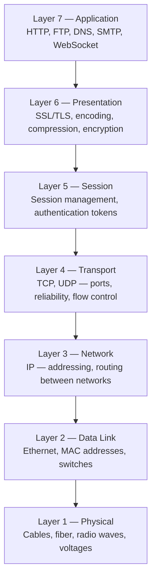
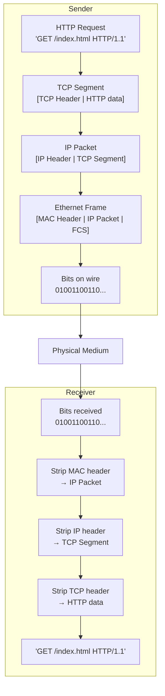
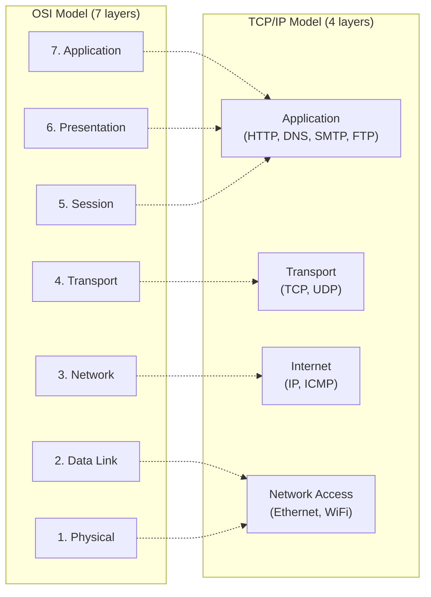

# OSI Model

The OSI (Open Systems Interconnection) model is a conceptual framework that standardizes how different network systems communicate. It divides network communication into **7 distinct layers**, each with a specific job. Every packet of data you send travels down all 7 layers on the sender's side, across the physical medium, and back up all 7 layers on the receiver's side.

> **Why it matters in interviews:** Engineers who understand the OSI model make better decisions. "Should this be handled at L4 or L7?" is a real question asked when choosing a load balancer. Understanding which layer a problem lives at is the first step to solving it.

---

## The 7 Layers



**Mnemonic (top-down):** **A**ll **P**eople **S**eem **T**o **N**eed **D**ata **P**rocessing  
**Mnemonic (bottom-up):** **P**lease **D**o **N**ot **T**hrow **S**ausage **P**izza **A**way

---

## Layer by Layer — Deep Dive

### Layer 1 — Physical

**What:** The raw transmission of bits over a physical medium. Volts on copper wire, pulses of light in fiber, radio waves in WiFi.

**Units:** Bits  
**Devices:** Cables, repeaters, hubs, network interface cards (NIC), fiber transceivers  
**Knows about:** Signal levels, bit timing, connector types — nothing about meaning

**Real-world:** Ethernet cables (Cat6), fiber optic strands, WiFi 6 radio hardware, coaxial cable for cable internet.

**What goes wrong here:** Physical damage (cut fiber), signal degradation (long cable runs), interference (EMI on copper), bad connectors.

---

### Layer 2 — Data Link

**What:** Packages bits into **frames** and provides node-to-node delivery within the same local network. Handles hardware (MAC) addressing and error detection at the local level.

**Units:** Frames  
**Devices:** Switches, bridges, network interface cards  
**Protocols:** Ethernet (802.3), WiFi (802.11), PPP  
**Address type:** MAC address (48-bit, e.g., `00:1A:2B:3C:4D:5E`)

**Key job:** Get a frame from one device to another device **on the same network segment** (same LAN).

**ARP — Address Resolution Protocol:**  
When your computer knows an IP address but needs the MAC address to send a frame, it broadcasts an ARP request:

```
"Who has IP 192.168.1.5? Tell 192.168.1.100"
→ 192.168.1.5 replies: "That's me, my MAC is AA:BB:CC:DD:EE:FF"
```

**What goes wrong here:** MAC address spoofing, broadcast storms, STP (Spanning Tree Protocol) loops, VLAN misconfiguration.

---

### Layer 3 — Network

**What:** Routes packets from source to destination **across multiple networks** using logical addressing (IP addresses). This is where the internet's global routing happens.

**Units:** Packets  
**Devices:** Routers, layer-3 switches  
**Protocols:** IP (IPv4/IPv6), ICMP, OSPF, BGP  
**Address type:** IP address (e.g., `93.184.216.34`)

**The key difference from L2:** L2 is local (same network). L3 crosses network boundaries — it's how a packet in Tokyo reaches a server in Virginia, hopping through dozens of routers.

**TTL (Time To Live):** Each IP packet has a TTL counter. Every router that forwards the packet decrements it by 1. When TTL hits 0, the packet is dropped and an ICMP "Time Exceeded" message is sent back. This prevents packets from looping forever.

```bash
# traceroute shows each L3 hop
$ traceroute google.com
 1  192.168.1.1       1ms     (your router)
 2  10.12.0.1         8ms     (ISP first hop)
 3  72.14.198.1      12ms     (ISP backbone)
 ...
12  142.250.82.14    22ms     (Google)
```

**What goes wrong here:** IP address exhaustion (why IPv6 exists), routing loops, BGP hijacking, ICMP floods.

---

### Layer 4 — Transport

**What:** End-to-end communication between **processes** on different hosts. Adds the concept of **ports** (so multiple applications on one IP can receive traffic), and provides reliability (TCP) or speed (UDP).

**Units:** Segments (TCP) / Datagrams (UDP)  
**Protocols:** TCP, UDP, SCTP  
**Key concepts:** Ports, multiplexing, flow control, congestion control, reliability

**Ports:** A 16-bit number (0–65535) that identifies a specific process on a host.

| Port  | Protocol   |
| ----- | ---------- |
| 22    | SSH        |
| 80    | HTTP       |
| 443   | HTTPS      |
| 5432  | PostgreSQL |
| 6379  | Redis      |
| 27017 | MongoDB    |

A connection is uniquely identified by the **5-tuple**: `(src IP, src port, dst IP, dst port, protocol)`

**This is why "L4 load balancer" and "L7 load balancer" matter** — an L4 LB sees IP+port. An L7 LB decodes the actual HTTP request.

**What goes wrong here:** Port exhaustion (too many connections), SYN floods (DDoS), TCP handshake timeouts, UDP packet loss in congested networks.

---

### Layer 5 — Session

**What:** Manages **sessions** — the logical connections between applications. Establishes, maintains, and terminates dialogues.

**Protocols:** NetBIOS, RPC, SIP (in session management role), SQL sessions  
**Real-world relevance:** Largely absorbed by modern application-layer protocols (HTTP/1.1 keep-alive, WebSocket sessions, TLS session resumption)

> **Practical note:** In modern networking, layers 5 and 6 are often considered part of "application layer" in the real world. You'll rarely hear engineers say "that's a layer 5 problem" — but knowing the model matters for interviews.

---

### Layer 6 — Presentation

**What:** Translates data between the application format and the network format. Handles **encryption/decryption**, encoding, and compression.

**Key responsibilities:**

- **Encryption:** TLS/SSL encrypts application data before transmission
- **Encoding:** Character encoding (UTF-8, ASCII), data format translation
- **Compression:** gzip, Brotli applied to data before sending

**TLS lives here conceptually** — it transforms plaintext application data into encrypted ciphertext before it hits the transport layer.

---

### Layer 7 — Application

**What:** The layer where user-facing protocols live. This is where your application code and network protocols meet.

**Protocols:** HTTP, HTTPS, FTP, SMTP, DNS, WebSocket, gRPC, MQTT  
**Knows about:** URLs, methods, headers, cookies, authentication, content type

**This is what L7 load balancers see:** The full HTTP request — URL path, headers, cookies, HTTP method — enabling content-based routing.

---

## Data Encapsulation — The Critical Concept

When you send an HTTP request, each layer **wraps** the data from the layer above with its own header. On the receiving end, each layer **unwraps** (strips its header) as the data goes up.



This is called **encapsulation** going down and **decapsulation** going up. Every layer only reads its own header and passes the payload to the next layer.

---

## Devices and Their OSI Layer

| Device                 | Operates At              | What It Sees                                   |
| ---------------------- | ------------------------ | ---------------------------------------------- |
| **Hub**                | L1 — Physical            | Raw bits, broadcasts to all ports              |
| **Switch**             | L2 — Data Link           | MAC addresses, forwards frames to correct port |
| **Router**             | L3 — Network             | IP addresses, routes packets between networks  |
| **Firewall**           | L3–L4 (basic), L7 (NGFW) | IP/port (basic), full HTTP content (Next-Gen)  |
| **Load Balancer (L4)** | L4 — Transport           | IP + port, TCP/UDP                             |
| **Load Balancer (L7)** | L7 — Application         | HTTP URL, headers, cookies                     |
| **CDN**                | L7 — Application         | HTTP requests, cache content                   |
| **API Gateway**        | L7 — Application         | Full HTTP request + auth tokens                |

---

## TCP/IP Model — The Practical Alternative

The OSI model is a teaching framework. In practice, the **TCP/IP model** (also called the Internet Model) is what's actually implemented:



OSI layers 5–7 collapse into the TCP/IP Application layer. Engineers use OSI for conceptual discussion and TCP/IP for implementation.

---

## Real-World Packet Journey

Let's trace what actually happens when you type `https://api.example.com/users` in a browser:

```
L7 — Application:  Browser constructs HTTP GET request with headers
L6 — Presentation: TLS encrypts the HTTP request
L5 — Session:      TLS session established (from earlier handshake)
L4 — Transport:    TCP wraps encrypted data, adds src/dst ports (443)
L3 — Network:      IP adds src IP (your IP) + dst IP (93.184.216.34)
L2 — Data Link:    Ethernet frames with MAC addresses for next hop
L1 — Physical:     Converted to electrical signals or light pulses → your router

... Router strips L2, re-frames for next hop, repeats across the internet ...

L1 → L2 → L3 → L4 → L6 → L7 on the server side
```

---

## Common Interview Questions

### Q: "What layer does a load balancer operate at?"

> "It depends on the type. An L4 load balancer operates at the Transport layer — it sees IP addresses and ports, routing TCP/UDP connections without reading content. An L7 load balancer operates at the Application layer — it parses HTTP headers, URLs, and cookies, enabling content-based routing. L7 is more powerful but slightly more overhead."

### Q: "What's the difference between a switch and a router?"

> "A switch operates at L2 — it forwards Ethernet frames within a local network using MAC addresses. It doesn't know about IP addresses. A router operates at L3 — it routes IP packets between different networks, making decisions based on IP destination addresses and routing tables."

### Q: "Where does TLS/SSL live in the OSI model?"

> "Technically L6 (Presentation), but in the TCP/IP model it sits between the Transport and Application layers. TLS establishes a secure session over TCP, then the application protocol (HTTP, SMTP, etc.) sends data through the encrypted tunnel."

### Q: "Why does a packet have both an IP address and a MAC address?"

> "IP addresses are for end-to-end routing across the internet (L3). MAC addresses are for hop-to-hop delivery within a local network segment (L2). When a packet travels across the internet, the IP addresses stay the same end-to-end, but the MAC addresses change at every router hop — the router strips the old L2 frame and re-wraps with new MAC addresses for the next segment."

---

## Key Takeaways

- The OSI model provides a **common vocabulary** — "is this an L3 or L4 problem?" is a real engineering question
- Data is **encapsulated going down** (each layer adds a header) and **decapsulated going up** (each layer strips its header)
- **L4 = Transport = ports + TCP/UDP.** L7 = Application = HTTP/gRPC content
- In practice, the **TCP/IP 4-layer model** maps more directly to real implementations
- Understanding OSI layers tells you **which device to configure** when something breaks:
  - No connectivity → check L1 (cable)
  - Can ping but can't route → check L3 (IP/routing)
  - Can connect but app fails → check L7 (HTTP, auth, headers)
