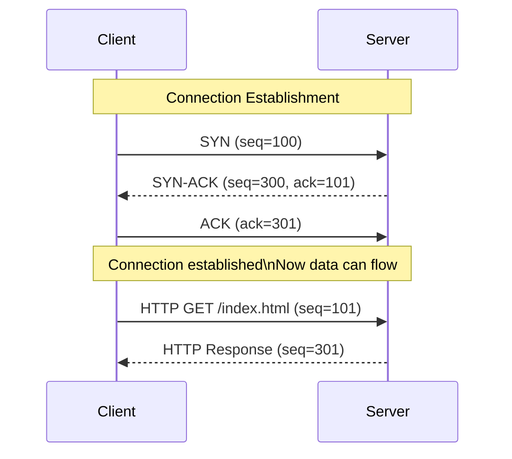
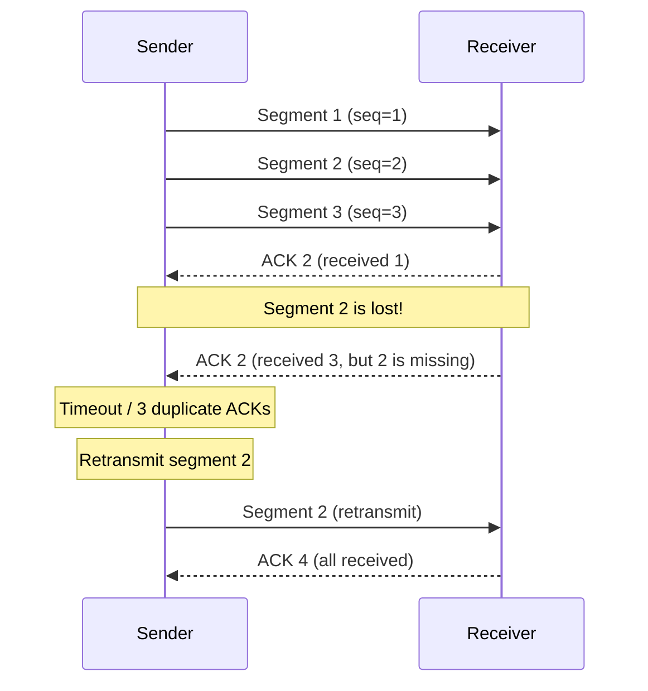
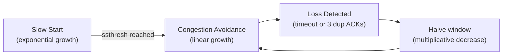
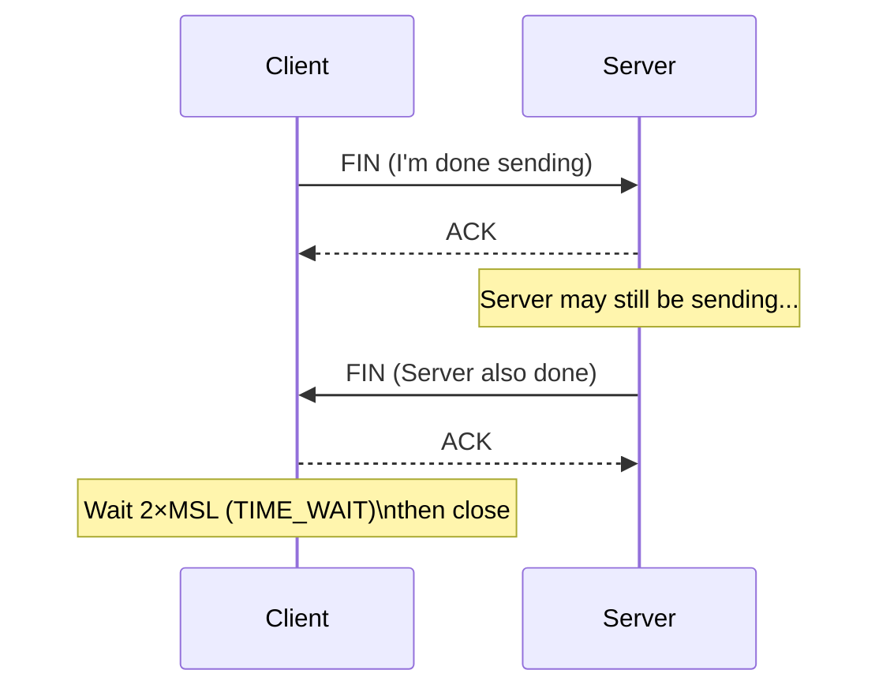
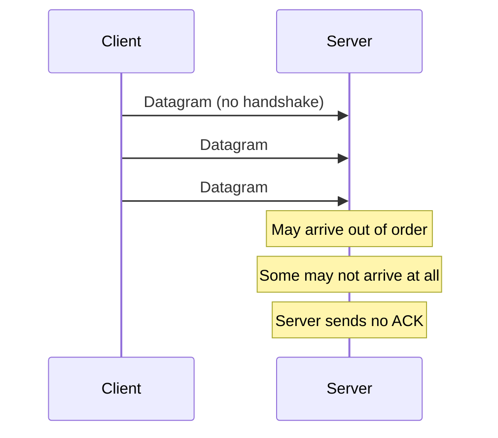
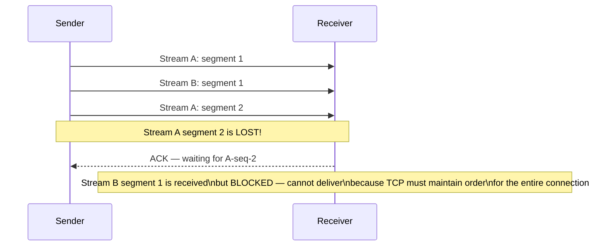
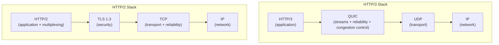
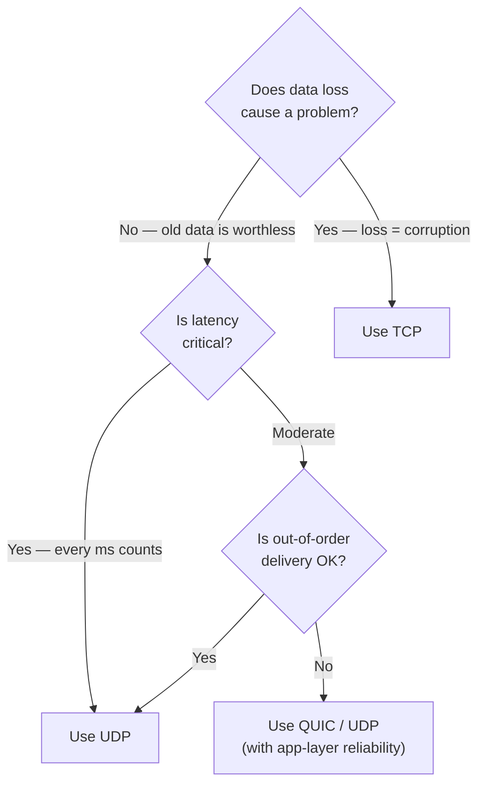

# TCP vs UDP

TCP and UDP are the two dominant transport-layer protocols. They both move data between processes on different hosts, but they make fundamentally different guarantees — and those differences determine which protocol you choose for every networked application you build.

> **The core tradeoff:** TCP gives you reliability at the cost of latency and overhead. UDP gives you speed at the cost of reliability. Real engineering is choosing the right one for your use case — and sometimes building reliability on top of UDP yourself.

---

## Side-by-Side Overview

| Property                | TCP                                   | UDP                                |
| ----------------------- | ------------------------------------- | ---------------------------------- |
| **Connection**          | Connection-oriented (3-way handshake) | Connectionless                     |
| **Reliability**         | Guaranteed delivery (retransmission)  | Best-effort, no guarantee          |
| **Ordering**            | In-order delivery guaranteed          | Out-of-order possible              |
| **Duplicate detection** | Yes                                   | No                                 |
| **Flow control**        | Yes (sliding window)                  | No                                 |
| **Congestion control**  | Yes (slow start, AIMD)                | No                                 |
| **Error checking**      | Checksum (required)                   | Checksum (optional in IPv4)        |
| **Header size**         | 20 bytes minimum                      | 8 bytes                            |
| **Speed**               | Slower (overhead)                     | Faster (minimal overhead)          |
| **Use cases**           | HTTP, Email, SSH, File transfer       | DNS, Video streaming, Gaming, VoIP |

---

## TCP — Transmission Control Protocol

### The Three-Way Handshake

Before any data is sent, TCP establishes a connection. This takes **1.5 round trips** (1 RTT before the first data byte can be sent):



**The flags:**

- **SYN** — "I want to connect, my starting sequence number is X"
- **SYN-ACK** — "OK, acknowledged X+1, my starting sequence is Y"
- **ACK** — "Acknowledged Y+1"

**The cost:** Every TCP connection costs 1 RTT before data transfer begins. At 100ms RTT (US→Europe), you pay 100ms just for the handshake. This is why HTTP/2 persistent connections and QUIC (0-RTT) matter so much.

### Reliable Delivery — Acknowledgements and Retransmission

Every TCP segment must be acknowledged. If no ACK is received within a timeout period, the segment is retransmitted:



**Retransmission triggers:**

- **Timeout:** No ACK received within RTO (Retransmission Timeout)
- **Fast retransmit:** 3 duplicate ACKs received → retransmit immediately without waiting for timeout

### Flow Control — Sliding Window

Prevents a fast sender from overwhelming a slow receiver. The receiver advertises how much buffer space it has (the **receive window**):

```
Receiver advertises: window = 65535 bytes
Sender can have at most 65535 bytes "in flight" unacknowledged at any time
```

As the receiver's application reads data and frees buffer space, it updates the window size. If the window is 0, the sender must stop until the receiver has room.

### Congestion Control

TCP detects network congestion by watching for packet loss and adjusts its sending rate:



**Algorithms:**

- **Slow Start:** Window doubles every RTT until threshold
- **Congestion Avoidance:** Window grows linearly (additive increase)
- **On loss:** Window halved (multiplicative decrease) → AIMD algorithm

This is why a sudden packet loss causes a significant throughput drop — TCP interprets loss as a congestion signal and backs off aggressively.

### The Four-Way Teardown

Closing a TCP connection takes 4 steps (either side can initiate):



**TIME_WAIT:** The closing side waits `2 × MSL` (Maximum Segment Lifetime, typically 60s–4min) before fully closing. This ensures any delayed packets from the old connection don't corrupt a new connection on the same 5-tuple.

**Problem at scale:** Millions of short-lived HTTP connections create massive TIME_WAIT state on servers. Solutions: `SO_REUSEADDR`, `TCP_LINGER`, or keeping connections alive with `Connection: keep-alive`.

---

## UDP — User Datagram Protocol

### Connectionless and Stateless

UDP has no handshake, no session, no state:



**The minimal 8-byte UDP header:**

```
 0      7 8     15 16    23 24    31
+--------+--------+--------+--------+
|  Source Port    |   Dest Port     |
+--------+--------+--------+--------+
|    Length       |    Checksum     |
+--------+--------+--------+--------+
|          Data octets ...          |
```

### Why UDP is Useful

UDP seems worse than TCP on paper. Why would you ever use it? Three reasons:

**1. Some applications don't need reliability**  
DNS queries: you send a query, either you get a response or you don't. If you don't get one quickly, you resend. You don't need TCP's complex session machinery for a 50-byte exchange.

**2. Latency matters more than reliability**  
Online gaming: if a player's position update from 100ms ago gets lost, retransmitting it is useless — you need the _current_ position. Better to just drop the old packet and send new ones.

**3. You build your own reliability layer**  
This is the most powerful pattern. UDP gives you a raw channel; you implement only the reliability features you actually need — without TCP's head-of-line blocking.

### Head-of-Line Blocking — TCP's Achilles Heel

Head-of-line blocking (HOL) is the most important reason to sometimes choose UDP over TCP:



In HTTP/2 over TCP, multiple streams share one TCP connection. If one TCP segment is lost, **all streams stall** — even those whose data arrived safely — because TCP must deliver everything in order. This is HOL blocking at the transport layer.

HTTP/3 over QUIC (UDP) solves this by making each stream independent at the application layer.

---

## QUIC — UDP Done Right

QUIC is the protocol that changed the game: it builds reliable, ordered, multiplexed streams on top of UDP, eliminating TCP's limitations. It's the transport layer for HTTP/3.



**QUIC advantages over TCP:**

| Feature                    | TCP + TLS                            | QUIC                             |
| -------------------------- | ------------------------------------ | -------------------------------- |
| **Handshake RTTs**         | 1 (TCP) + 1 (TLS 1.3) = 2 RTTs       | 1 RTT (or 0-RTT resumption)      |
| **HOL blocking**           | Yes (connection-level)               | No (stream-level isolation)      |
| **Connection migration**   | Breaks on IP change (mobile handoff) | Continues (connection ID-based)  |
| **Middlebox interference** | Firewalls can inspect/modify TCP     | Encrypted, opaque to middleboxes |
| **Deployment**             | OS-level (slow to update)            | User-space (fast to iterate)     |

**0-RTT resumption:** A returning client can send application data in the very first packet, before the handshake completes — the ultimate low-latency pattern.

**Real-world adoption:** ~60% of Google traffic uses QUIC. HTTP/3 (based on QUIC) is supported by all major browsers.

---

## Choosing TCP vs UDP



### TCP is the right choice when:

- Data integrity is critical (file transfer, HTTP, databases, SSH)
- Order matters and you can't tolerate gaps
- You're talking to services that already use TCP
- Simplicity of implementation matters

### UDP is the right choice when:

- Low latency beats reliability (gaming, live audio/video)
- Old data is worthless if it arrives late (real-time telemetry)
- You're building a custom protocol (DNS, DHCP, NTP)
- You need multicast (one sender, many receivers simultaneously)

### Real-World Protocol Choices

| Protocol                     | Transport                            | Reason                                      |
| ---------------------------- | ------------------------------------ | ------------------------------------------- |
| **HTTP/1.1, HTTP/2**         | TCP                                  | Reliable document transfer                  |
| **HTTP/3**                   | QUIC (UDP)                           | Low latency, no HOL blocking                |
| **DNS**                      | UDP (default), TCP (large responses) | Fast query/response, no connection overhead |
| **WebSocket**                | TCP                                  | Reliable bidirectional messaging            |
| **VoIP / Video calls**       | UDP                                  | Drop a frame, keep talking                  |
| **Online gaming**            | UDP                                  | Position updates are time-sensitive         |
| **Video streaming (HLS)**    | TCP                                  | Files delivered reliably via HTTP           |
| **Video streaming (WebRTC)** | UDP (SRTP)                           | Real-time peer-to-peer video                |
| **SSH / SFTP**               | TCP                                  | Must not corrupt shell commands or files    |
| **NTP**                      | UDP                                  | Single request/response, timing critical    |
| **DHCP**                     | UDP                                  | Broadcast-based, no IP yet to form TCP      |

---

## TCP Optimization in Production

### TCP Keep-Alive

By default, an idle TCP connection can be cleaned up by middleboxes (NAT, firewalls) after minutes of inactivity. Keep-alive probes prevent this:

```
net.ipv4.tcp_keepalive_time = 60   (send probe after 60s idle)
net.ipv4.tcp_keepalive_intvl = 10  (probe every 10s)
net.ipv4.tcp_keepalive_probes = 3  (drop connection after 3 failures)
```

### Connection Pooling

New TCP connections are expensive: 1 RTT for handshake + 1 RTT for TLS. Connection pooling reuses established connections:

- **HTTP/1.1 keep-alive:** Reuse connection for multiple requests serially
- **HTTP/2:** Multiple concurrent streams over one connection
- **Database connection pools:** HikariCP, pgBouncer

### Nagle's Algorithm

TCP by default buffers small writes and sends them together (reducing packet count). This is good for throughput but bad for latency:

```
Sending "Hello" as 5 one-byte writes:
  With Nagle:    Buffered → sent as one segment (more efficient, ~5ms delay)
  Without Nagle: Sent immediately as 5 segments (immediate, more packets)
```

For latency-sensitive applications (SSH, online gaming, interactive APIs), disable Nagle:

```
TCP_NODELAY = true   (socket option)
```

### Tune the Kernel TCP Stack

```bash
# Increase TCP buffer sizes for high-bandwidth networks
net.core.rmem_max = 134217728        # 128MB max receive buffer
net.core.wmem_max = 134217728        # 128MB max send buffer
net.ipv4.tcp_rmem = 4096 87380 134217728
net.ipv4.tcp_wmem = 4096 65536 134217728

# Enable TCP BBR congestion control (Google's algorithm — much better than CUBIC)
net.ipv4.tcp_congestion_control = bbr
```

---

## Interview Talking Points

### What the interviewer wants to hear

**1. Basic distinction**

> "TCP is connection-oriented and provides reliable, ordered delivery via acknowledgements and retransmission. UDP is connectionless and best-effort — no guarantees, but much lower overhead and latency."

**2. HOL blocking**

> "HTTP/2 uses TCP multiplexing, but if a single TCP segment is lost, all streams in the connection stall — that's head-of-line blocking. HTTP/3 uses QUIC over UDP, where each HTTP stream is independent, so loss in one stream doesn't affect others."

**3. The DNS UDP example**

> "DNS uses UDP by default because queries are small and stateless — a single datagram in each direction. If the response doesn't arrive, the client just resends. No need for the overhead of a TCP connection. But DNS over TCP is used for large responses (zone transfers, DNSSEC) that exceed 512 bytes."

**4. When you'd build on UDP**

> "For a real-time multiplayer game, I'd use UDP because position updates are time-sensitive — a retransmitted packet from 200ms ago is useless. I'd build sequence numbers and skip-ahead logic in my application layer, only retransmitting critical state (score changes, collision events), not position updates."

---

## Key Takeaways

- **TCP = reliability + ordering + flow/congestion control**, at the cost of latency and connection overhead
- **UDP = speed + simplicity**, at the cost of reliability and ordering guarantees
- **Head-of-line blocking** is TCP's critical weakness in multiplexed scenarios
- **QUIC (HTTP/3)** combines the best of both: UDP's speed + reliable, ordered, independent streams
- The right choice is **application-dependent**: file transfer → TCP; real-time streaming → UDP; modern web → HTTP/3/QUIC
- In production, **TCP tuning** (BBR, buffer sizes, TCP_NODELAY, connection pooling) delivers significant performance gains
