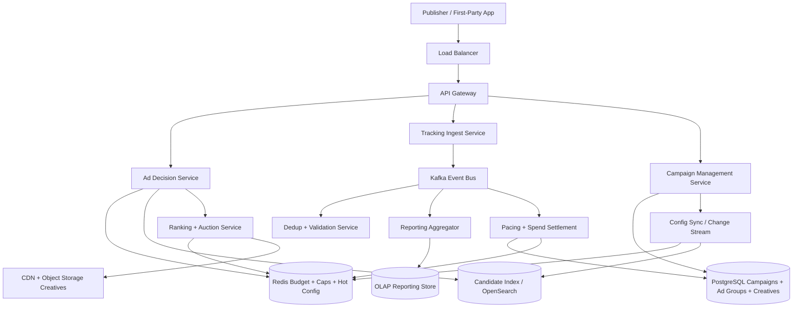
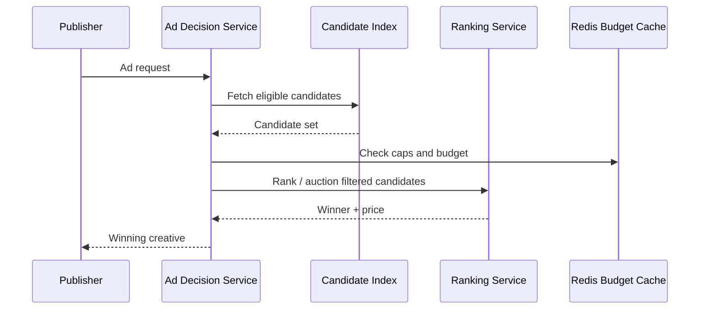
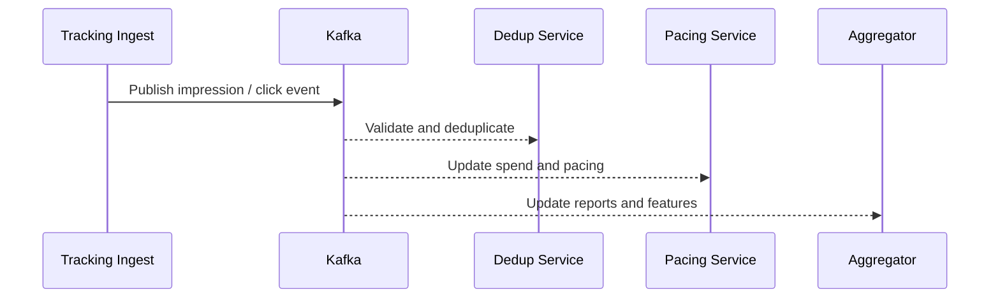
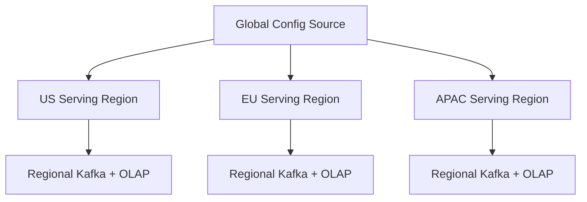

# Design Ad Platform

An ad platform is a classic system design interview problem because it combines a latency-critical online decision engine with a massive asynchronous data pipeline. The platform must decide, within a few tens of milliseconds, which ad to show for a given request while respecting targeting rules, budgets, pacing, frequency caps, and auction logic. At the same time, it must ingest huge volumes of impressions, clicks, conversions, and reporting events without losing money or overcounting spend.

At a high level, the system has two very different workloads. The first is the **ad-serving path**, where a request arrives and the platform must retrieve candidate campaigns, rank or auction them, reserve budget, and return the winning creative. The second is the **measurement and optimization path**, where the system processes events, updates reporting, trains ranking models, detects fraud, and refines pacing. A good design keeps the serving path small and predictable, then lets the analytics path scale independently.

---

## Functional Requirements

**In Scope:**
- Advertisers can create campaigns, ad groups, creatives, budgets, and targeting rules
- Publishers or first-party surfaces can request an ad decision for a placement
- The platform retrieves eligible ads and runs ranking or auction logic to pick a winner
- The system supports impression, click, and conversion tracking
- Budgets, pacing, frequency caps, and basic policy checks are enforced
- Advertisers can view campaign status, spend, and performance reports
- Operators can inspect serving errors, budget exhaustion, and event-pipeline lag
- The platform supports near-real-time configuration updates for campaigns and creatives

**Out of Scope:**
- Detailed billing reconciliation with external finance systems
- Full DSP/SSP interoperability across open internet exchanges in all protocol detail
- Rich creative-authoring tools or image/video editing features
- Full machine-learning training infrastructure implementation details
- Human moderation workflows beyond basic policy-state representation

---

## Non-Functional Requirements

| Property | Target | Reasoning |
|---|---|---|
| **Ad Decision Latency** | p99 < 100ms end-to-end; p99 < 30ms inside serving tier | ad requests sit directly on page-load or feed-render critical paths |
| **Availability** | 99.99% for serving and tracking ingestion | missed ads directly reduce revenue and degrade UX |
| **Freshness** | campaign changes visible within seconds | advertisers expect fast pause/resume and budget control |
| **Durability** | no loss of accepted tracking events or committed spend updates | inaccurate spend or event loss undermines trust and billing |
| **Consistency** | strong enough to avoid gross overspend; eventual for reporting and analytics | perfect global synchronization is too expensive on the hot path |
| **Scalability** | millions of ad requests/sec, tens of millions of events/sec | feeds and ad inventory create high read and write volume |
| **Isolation** | hot advertisers or placements should not degrade the whole fleet | a few campaigns often dominate traffic |
| **Cost Efficiency** | serving path must remain lightweight per request | ad margins can be thin, so decision cost matters |

**Key tradeoff:** the platform prioritizes **fast local serving with bounded overspend risk** over globally serialized budget updates on every request. Strong consistency is reserved for correctness-critical operations such as campaign edits and durable spend checkpoints, while short-term serving counters often use approximate or partitioned reservation models.

---

## Capacity Estimation

**Serving traffic:**
- Assume **5M ad requests/sec** at peak across all placements
- If each request considers **50-500 candidates**, naive per-request database scans are impossible; candidate retrieval must be index-driven and heavily cached
- Traffic is highly skewed: a few placements, geographies, or campaigns may dominate the peak

**Tracking traffic:**
- If the platform logs every impression and click, event ingestion can easily exceed **20M events/sec** at peak
- Conversions are lower-volume but more valuable and often delayed by minutes or hours
- Event deduplication is necessary because browsers, SDKs, and mobile networks retry aggressively

**Metadata volume:**
- Campaigns, targeting rules, and creatives are relatively small compared with event data
- The operational challenge is not raw metadata size but propagating configuration changes quickly and serving them cheaply

**Reporting volume:**
- Advertisers expect hourly or near-real-time aggregates by campaign, ad group, placement, device, geography, and audience slices
- Raw event retention grows quickly, so the system typically stores both a raw immutable log and aggregated rollups

**Operational profile:**
- Budget resets at midnight, campaign launches, and live events create synchronized spikes
- Creative files themselves should bypass the control plane and be served from object storage plus CDN

---

## Core Entities

| Entity | Purpose | Key Fields | Relationships |
|---|---|---|---|
| **AdvertiserAccount** | Owner of campaigns and spend | `account_id`, `name`, `billing_status`, `created_at` | owns campaigns and payment profiles |
| **Campaign** | Top-level budget and objective container | `campaign_id`, `account_id`, `objective`, `daily_budget`, `total_budget`, `status` | has many ad groups |
| **AdGroup** | Targeting and bid boundary | `ad_group_id`, `campaign_id`, `bid_strategy`, `targeting_spec`, `status` | has many creatives |
| **Creative** | Actual ad asset and metadata | `creative_id`, `ad_group_id`, `format`, `asset_uri`, `policy_state` | served when the group wins |
| **Placement** | Inventory slot requesting an ad | `placement_id`, `surface`, `size`, `allowed_formats` | receives one winning creative per request |
| **AdRequest** | Runtime serving request | `request_id`, `placement_id`, `user_context`, `geo`, `device`, `timestamp` | used to retrieve eligible candidates |
| **AuctionResult** | Winning decision record | `auction_id`, `request_id`, `winning_creative_id`, `clearing_price`, `rank_score` | ties serving to tracking and spend |
| **BudgetReservation** | Short-lived spend reservation | `reservation_id`, `campaign_id`, `amount`, `expires_at`, `state` | protects against overspend under concurrency |
| **TrackingEvent** | Impression, click, or conversion event | `event_id`, `request_id`, `event_type`, `creative_id`, `created_at` | linked to served ad decisions |
| **FrequencyCapState** | Per-user exposure limit state | `scope_key`, `creative_id`, `window`, `count`, `expires_at` | consulted during eligibility filtering |
| **ReportAggregate** | Precomputed metrics slice | `bucket_start`, `campaign_id`, `metric_set`, `dimensions` | derived from tracking events |

**Critical modeling decisions:**
- `AuctionResult` is immutable and should carry enough data to reproduce why an ad won, including bid, rank features, and clearing price.
- `BudgetReservation` is separate from final spend settlement. This lets the platform make fast serving decisions while reconciling durable spend asynchronously.
- `FrequencyCapState` is ephemeral and window-based, which makes it a good fit for TTL-backed storage rather than a primary relational table.

---

## Databases and Database Design

### Storage Tier Decisions

| Data | Access Pattern | Engine | Why |
|---|---|---|---|
| Campaigns, ad groups, budgets, policies | transactional writes, exact reads, admin queries | **PostgreSQL** | configuration and money-adjacent metadata fit well in relational storage |
| Candidate targeting index and serving metadata | high-QPS lookup by placement, geo, audience, device, keywords | **OpenSearch / inverted index + key-value caches** | candidate retrieval needs fast filtering across many dimensions |
| Frequency caps, pacing counters, budget reservations, hot config cache | sub-millisecond reads/writes, TTLs, hot keys | **Redis** | ideal for ephemeral counters, reservations, and near-real-time caches |
| Impression/click/conversion raw event log | append-heavy writes, long retention, replay | **Kafka + object storage lake** | durable ingestion and offline reprocessing |
| Reporting rollups and advertiser history | wide writes, time-bucketed analytics queries | **ClickHouse / Druid / BigQuery-style OLAP** | aggregations dominate reporting workloads |
| Creative binaries | large immutable media reads | **Object Storage + CDN** | keeps ad assets off the serving control plane |

This is intentionally polyglot. The serving tier needs **small exact config**, **fast multi-dimensional retrieval**, **ephemeral counters**, and **massive append-only event storage**. One database cannot serve all of those access patterns efficiently.

### Schema 1 - Campaign Metadata (PostgreSQL)

```sql
CREATE TABLE campaigns (
  campaign_id            UUID PRIMARY KEY DEFAULT gen_random_uuid(),
  account_id             UUID NOT NULL,
  name                   TEXT NOT NULL,
  objective              VARCHAR(32) NOT NULL,
  daily_budget_cents     BIGINT NOT NULL,
  total_budget_cents     BIGINT,
  start_time             TIMESTAMPTZ NOT NULL,
  end_time               TIMESTAMPTZ,
  status                 VARCHAR(16) NOT NULL,
  created_at             TIMESTAMPTZ DEFAULT NOW(),
  updated_at             TIMESTAMPTZ DEFAULT NOW()
);

CREATE INDEX idx_campaigns_account_status
  ON campaigns (account_id, status);
```

### Schema 2 - Ad Groups and Creatives (PostgreSQL)

```sql
CREATE TABLE ad_groups (
  ad_group_id            UUID PRIMARY KEY DEFAULT gen_random_uuid(),
  campaign_id            UUID NOT NULL REFERENCES campaigns(campaign_id),
  bid_strategy           VARCHAR(32) NOT NULL,
  max_bid_cents          BIGINT,
  targeting_spec_json    JSONB NOT NULL,
  status                 VARCHAR(16) NOT NULL,
  created_at             TIMESTAMPTZ DEFAULT NOW()
);

CREATE TABLE creatives (
  creative_id            UUID PRIMARY KEY DEFAULT gen_random_uuid(),
  ad_group_id            UUID NOT NULL REFERENCES ad_groups(ad_group_id),
  format                 VARCHAR(16) NOT NULL,
  asset_uri              TEXT NOT NULL,
  click_url              TEXT NOT NULL,
  policy_state           VARCHAR(16) NOT NULL,
  status                 VARCHAR(16) NOT NULL,
  created_at             TIMESTAMPTZ DEFAULT NOW()
);
```

### Schema 3 - Budget Reservation (Logical Redis Record)

```json
{
  "key": "budget:reserve:camp_123:req_987",
  "value": {
    "campaign_id": "camp_123",
    "amount_cents": 7,
    "expires_at": "2026-06-03T10:00:05Z",
    "state": "reserved"
  }
}
```

Reservations are intentionally short-lived. If the impression never materializes or the event pipeline later rejects the charge, the reservation can expire or be reconciled.

### Schema 4 - Tracking Event (Logical Kafka Payload)

```json
{
  "event_id": "evt_abc123",
  "request_id": "req_987",
  "auction_id": "auc_456",
  "campaign_id": "camp_123",
  "creative_id": "cr_789",
  "event_type": "impression",
  "price_cents": 7,
  "created_at": "2026-06-03T10:00:00Z"
}
```

### Schema 5 - Aggregated Reporting Table (OLAP)

```sql
CREATE TABLE report_aggregates_hourly (
  bucket_start           DateTime,
  campaign_id            String,
  ad_group_id            String,
  placement_id           String,
  country_code           String,
  device_type            String,
  impressions            UInt64,
  clicks                 UInt64,
  conversions            UInt64,
  spend_cents            UInt64
) ENGINE = MergeTree
PARTITION BY toDate(bucket_start)
ORDER BY (campaign_id, bucket_start, placement_id, country_code, device_type);
```

### Schema 6 - Candidate Index Document (OpenSearch)

```json
{
  "candidate_id": "cand_111",
  "campaign_id": "camp_123",
  "ad_group_id": "ag_222",
  "creative_id": "cr_789",
  "placement_types": ["feed_card", "banner_300x250"],
  "countries": ["US", "CA"],
  "devices": ["ios", "android", "web"],
  "audience_tags": ["sports", "travel"],
  "status": "active"
}
```

### Sharding and Replication Strategy

| Store | Shard Key | Strategy | Replication |
|---|---|---|---|
| PostgreSQL config | `account_id` or logical tenant partition | primary + replicas, then shard by tenant at scale | synchronous or semi-sync replicas |
| OpenSearch candidate index | `placement_type` or candidate document routing | inverted index with many shards | multi-node replicated clusters |
| Redis | `campaign_id`, `account_id`, `scope_key` | Redis Cluster | 1 replica per master |
| Kafka | `campaign_id`, `placement_id`, or `request_id` depending on topic | partitioned durable log | RF=3 |
| OLAP reports | time partitions + campaign clustering | distributed analytical engine | replicated storage shards |
| Object storage | `account/campaign/creative` namespace | regional bucket + CDN | multi-AZ durable storage |

**Consistency model:**
- Strong consistency for campaign edits, creative state, and durable spend checkpoints
- Bounded approximate consistency for live pacing counters, budget reservations, and frequency caps on the serving path
- Eventual consistency for reports, model features, and long-tail analytics

**Read/write patterns:**
- **Serving path:** fetch hot config and candidate set -> filter eligibility -> run ranking/auction -> reserve budget -> return winner
- **Tracking path:** impression and click events -> Kafka -> validation/dedup -> spend settlement -> rollups and model features
- **Config path:** advertiser updates campaign -> PostgreSQL source of truth -> change stream -> cache/index refresh across serving fleet

---

## API Design

**Create a campaign:**
```http
POST /v1/campaigns
Authorization: Bearer <jwt>

{
  "account_id": "acc_123",
  "name": "Summer Travel Push",
  "objective": "clicks",
  "daily_budget_cents": 500000,
  "start_time": "2026-06-04T00:00:00Z"
}

201 Created
{
  "campaign_id": "camp_123",
  "status": "draft"
}
```

**Create an ad group and creative:**
```http
POST /v1/ad-groups
Authorization: Bearer <jwt>

{
  "campaign_id": "camp_123",
  "bid_strategy": "cpc_manual",
  "max_bid_cents": 75,
  "targeting_spec": {
    "countries": ["US", "CA"],
    "devices": ["ios", "android"],
    "audience_tags": ["travel", "beach"]
  },
  "creative": {
    "format": "image",
    "asset_uri": "s3://ads/creative-789.jpg",
    "click_url": "https://example.com/deals"
  }
}

201 Created
{
  "ad_group_id": "ag_222",
  "creative_id": "cr_789",
  "status": "pending_review"
}
```

**Request an ad decision:**
```http
POST /v1/serve/ad-decision
Authorization: Bearer <publisher-token>

{
  "placement_id": "feed_home_top",
  "user_context": {
    "country": "US",
    "device": "ios",
    "audience_tags": ["travel", "sports"]
  },
  "page_context": {
    "surface": "home_feed"
  }
}

200 OK
{
  "request_id": "req_987",
  "auction_id": "auc_456",
  "creative_id": "cr_789",
  "asset_url": "https://cdn.example.com/creative-789.jpg",
  "impression_beacon": "https://trk.example.com/i/evt_abc123",
  "click_url": "https://trk.example.com/c/clk_111"
}
```

**Track an impression:**
```http
POST /v1/track/impression
Content-Type: application/json

{
  "event_id": "evt_abc123",
  "request_id": "req_987",
  "auction_id": "auc_456",
  "creative_id": "cr_789"
}

202 Accepted
```

**Track a click:**
```http
POST /v1/track/click
Content-Type: application/json

{
  "event_id": "clk_111",
  "request_id": "req_987",
  "auction_id": "auc_456",
  "creative_id": "cr_789"
}

202 Accepted
```

**Get campaign performance:**
```http
GET /v1/campaigns/camp_123/report?granularity=hour&from=2026-06-01T00:00:00Z&to=2026-06-03T00:00:00Z
Authorization: Bearer <jwt>

200 OK
{
  "campaign_id": "camp_123",
  "rows": [
    {
      "bucket_start": "2026-06-02T13:00:00Z",
      "impressions": 102340,
      "clicks": 1932,
      "spend_cents": 70812
    }
  ]
}
```

> Cursor-based or time-window pagination is preferred for large reporting exports. Offset pagination (`?page=N`) becomes unstable and expensive on large event-backed rollups.

**Real-time campaign update stream (optional SSE):**
```http
GET /v1/campaigns/camp_123/stream
Authorization: Bearer <jwt>
Accept: text/event-stream
```
This stream is optional for advertiser dashboards. The core ad-serving path does not require WebSockets; request-response APIs and asynchronous event ingestion are the dominant pattern.

---

## High-Level Design



**Component responsibilities:**

| Component | Role |
|---|---|
| **API Gateway** | Authentication, routing, throttling, and request normalization |
| **Campaign Management Service** | Creates and updates campaigns, targeting, creatives, and policy state |
| **Ad Decision Service** | Retrieves eligible candidates, checks caps and budgets, and orchestrates ranking |
| **Candidate Index** | Fast retrieval of ads eligible for a placement, geography, device, or audience filter |
| **Ranking + Auction Service** | Computes scores, applies bids and pacing, chooses the winner, and emits decision metadata |
| **Redis** | Holds hot config, frequency caps, pacing counters, budget reservations, and low-latency serving state |
| **Tracking Ingest Service** | Accepts impressions, clicks, and conversions for asynchronous processing |
| **Kafka** | Durable event backbone for validation, reporting, settlement, model features, and audit |
| **Dedup + Validation Service** | Removes duplicate or malformed events and guards against obvious fraud or replay |
| **Pacing + Spend Settlement** | Converts eligible events into spend updates and refreshes serving-side budget counters |
| **Reporting Aggregator / OLAP Store** | Builds advertiser-facing dashboards and exported reports |
| **CDN + Object Storage** | Serves creative assets without pulling bytes through the control plane |

**Ad decision flow:**
1. Client -> `POST /v1/serve/ad-decision` -> API Gateway -> Ad Decision Service
2. Ad Decision Service looks up eligible candidates from the serving index and hot config cache
3. Frequency caps, budget availability, pacing state, format compatibility, and policy checks filter the candidate set
4. Ranking + Auction Service computes rank score or auction value and selects the winner
5. The service creates a short-lived budget reservation, generates tracking IDs, and returns the winning creative metadata
6. When impression and click events arrive, Kafka drives validation, spend settlement, rollups, and downstream optimization without slowing the hot decision path

---

## Deep Dives

### 1. Candidate Retrieval and Auctioning: Required and Central

The hardest part of an ad platform is not storing campaign metadata; it is deciding, under tight latency, which ads are eligible and which one should win. A request may have hundreds of potential candidates, but the serving tier only has a few milliseconds to filter them by placement, geography, device, policy, budget, frequency cap, and targeting before applying ranking or auction logic.

That is why the serving path is usually split into retrieval and ranking. Retrieval narrows the search space quickly using indexes and caches. Ranking or auctioning then evaluates only the remaining candidates.



**Why the problem happens:** each request must be resolved quickly, but candidate space is large and multi-dimensional.

**Why it becomes difficult at scale:**
- targeting dimensions explode candidate combinations
- hot placements and geographies create bursty shared load
- budget and cap checks mean a high-score ad may still be ineligible at serve time

**Production-grade solutions:**
- use a retrieval tier with placement- and audience-aware indexes to shrink candidate sets quickly
- apply lightweight eligibility filters before expensive ranking features
- precompute hot features and cache frequently accessed campaign state
- keep the decision path stateless apart from fast counters and reservations

**Tradeoffs:** richer targeting and ranking improve relevance and monetization, but they directly increase serving latency and operational cost.

### 2. Kafka: Essential for Tracking, Reporting, and Optimization

Kafka is extremely valuable in an ad platform because impressions, clicks, conversions, pacing updates, fraud signals, and analytics all need the same event stream. But Kafka should not sit in the critical ad-response path between candidate selection and returning the winner. The decision must complete before the page or app times out.



**Why the problem happens:** one accepted event has many downstream consumers with very different SLAs.

**Why it becomes difficult at scale:**
- tracking volume often exceeds serving volume
- downstream systems such as billing, reports, and ML features can lag independently
- replay and backfill are necessary after bugs, fraud incidents, or late conversions

**Production-grade solutions:**
- publish immutable tracking events to Kafka immediately after ingest validation
- partition topics by campaign, account, or request family depending on consumer needs
- keep raw events for replay and build derived stores asynchronously
- never make advertiser dashboards or spend settlement block the ingestion endpoint itself

**Tradeoffs:** Kafka adds excellent durability and decoupling, but it is a downstream event backbone, not the source of immediate serve-time truth.

### 3. Redis: Budgets, Frequency Caps, and Hot Serving State

Redis is unusually useful in ad systems because so much of the serving path depends on small, hot, TTL-friendly state: pacing counters, budget reservations, frequency caps, and hot campaign metadata. Those checks must be fast enough to run on nearly every decision.

| Redis Use | Example Key | Why Redis Fits |
|---|---|---|
| **Budget counter** | `budget:camp_123:2026-06-03T10` | hot, frequently updated serving-side spend state |
| **Frequency cap** | `fc:user_42:cr_789:1d` | TTL-backed per-user exposure windows |
| **Reservation record** | `budget:reserve:camp_123:req_987` | short-lived claim used to bound overspend |
| **Hot config cache** | `campaign:camp_123:serving` | avoids relational lookups on every request |

**Why the problem happens:** the serving path needs cheap access to state that changes constantly and expires naturally.

**Why it becomes difficult at scale:**
- very hot campaigns can turn one budget key into a hotspot
- per-user frequency caps create huge key cardinality
- using only asynchronous spend updates can lead to overspend during bursts

**Production-grade solutions:**
- use partitioned counters and short-lived reservations instead of one globally serialized budget write per request
- shard hot keys and reconcile them periodically with durable spend checkpoints
- store only serving-critical state in Redis and rebuild it from durable sources when necessary
- expire frequency-cap windows automatically with TTLs instead of manual cleanup jobs

**Tradeoffs:** Redis makes the serving path viable, but it introduces approximate consistency and reconciliation complexity around money-like counters.

### 4. Budget Pacing and Overspend Control

Advertisers do not just want to spend their money; they want to spend it at the right rate. If the system shows all ads in the first ten minutes of the day, the campaign burns out early. If it spends too conservatively, the platform misses revenue and underdelivers promised inventory.

**Why the problem happens:** demand, traffic supply, and advertiser budgets fluctuate throughout the day.

**Why it becomes difficult at scale:**
- every serve decision potentially changes spend state
- exact global synchronization on every impression is too expensive for the latency budget
- campaigns with low budgets are especially sensitive to overspend noise

**Production-grade solutions:**
- maintain serving-side budget reservations or quotas per shard rather than centralizing every spend check
- replenish shard quotas periodically from a durable pacing service
- use smoothing algorithms that compare observed spend with expected spend curves by hour or minute
- reconcile reservations against actual billable events to release unused budget quickly

**Tradeoffs:** exact money accounting in the serving tier is too slow, but approximate serving control must be bounded carefully to avoid material overspend.

### 5. Frequency Capping, Personalization, and Privacy Constraints

Showing the same ad too many times hurts both user experience and advertiser value. Frequency caps are therefore central to eligibility. At the same time, the platform often uses audience or contextual signals for ranking, which introduces cardinality, privacy, and freshness challenges.

**Why the problem happens:** advertisers want reach and performance, but repeated exposure or stale audience state reduces efficiency.

**Why it becomes difficult at scale:**
- per-user-per-creative counters create a massive number of ephemeral keys
- user identity may be fragmented across devices, browsers, or privacy-constrained environments
- audience segments change continuously based on user activity or consent state

**Production-grade solutions:**
- implement TTL-backed cap windows keyed by a privacy-safe user or device scope
- prefer coarse-grained segments and contextual features on the hot path rather than expensive deep joins
- propagate consent and privacy state into serving eligibility before ranking runs
- degrade gracefully to contextual serving when identity is missing or unusable

**Tradeoffs:** richer personalization improves performance, but it increases serving complexity and privacy sensitivity.

### 6. Event Deduplication, Fraud, and Attribution

Ad tracking is noisy. Browsers retry, SDKs resend, malicious actors generate fake clicks, and conversions often arrive late or out of order. If the platform bills every raw event blindly, reports and spend become unreliable.

**Why the problem happens:** the internet is lossy, clients are untrusted, and attribution is inherently probabilistic.

**Why it becomes difficult at scale:**
- billions of events must be validated quickly without blocking ingestion
- exactly-once delivery from the client is unrealistic
- conversions may arrive long after the serving decision that caused them

**Production-grade solutions:**
- assign durable request and event IDs so ingestion can deduplicate retries
- validate referers, signatures, timestamps, and expected campaign relationships before billing or attribution
- separate raw-event retention from billable-event materialization so anti-fraud rules can evolve
- model attribution windows explicitly and accept that some conversions are delayed joins, not instant counters

**Tradeoffs:** aggressive filtering reduces fraud, but it risks dropping legitimate noisy traffic if heuristics are too strict.

### 7. WebSockets: Usually Optional, Not Central

Unlike collaborative editors or chat systems, an ad platform usually does not need WebSockets on the core serving path. Ad requests are short-lived request-response calls, and tracking is asynchronous fire-and-forget. Some operator consoles or advertiser dashboards may want live updates, but the platform itself is primarily built around HTTP serving plus streaming backbones such as Kafka.

**Why the problem happens:** stakeholders often assume every realtime-looking system needs persistent bidirectional connections.

**Why it becomes difficult at scale:**
- persistent dashboard connections add fanout and state management that do not help core ad delivery
- most advertisers do not need millisecond-by-millisecond campaign updates
- the serving fleet should stay stateless and easy to autoscale

**Production-grade solutions:**
- keep the serving API request-response and the tracking pipeline asynchronous
- use SSE or periodic polling for advertiser dashboards when near-real-time visibility is enough
- reserve WebSockets for specialized operator tooling only if truly needed
- push configuration changes to serving nodes through internal streams, not browser sockets

**Tradeoffs:** avoiding WebSockets keeps the system simpler and cheaper, but dashboards may be a little less live.

### 8. Multi-Region Serving and Configuration Freshness

Ad serving is usually global, but campaign configuration and budget state must remain coherent enough that advertisers can pause a campaign or update a creative quickly. A region serving stale paused campaigns is both a policy and billing problem.



**Why the problem happens:** global user traffic wants local latency, but advertisers expect near-global control over state changes.

**Why it becomes difficult at scale:**
- config propagation delays can cause stale decisions after campaign pause or policy blocks
- budget state may drift across regions during traffic bursts
- failover must avoid double counting or serving from old configs

**Production-grade solutions:**
- keep configuration in one authoritative source with fast change propagation into regional caches and indexes
- regionalize serving, but checkpoint spend and policy state frequently to a durable global control plane
- use versioned configs so serving nodes can reject or log stale local state explicitly
- prefer local serving with bounded temporary drift over global synchronous coordination on every ad request

**Tradeoffs:** full global synchronization is too expensive for ad latency, so the system accepts bounded drift and focuses on fast reconciliation and rapid config propagation.

### 9. Architecture Evolution

| Stage | Design | Why It Breaks | Next Step |
|---|---|---|---|
| **1. MVP** | Single ad server plus relational campaign tables | slow retrieval, no pacing safety, and poor reporting scalability | add serving cache, event bus, and reporting pipeline |
| **2. Growth** | Separate campaign management, ad serving, and Kafka tracking | hot campaigns and candidate retrieval become bottlenecks | add serving index, budget reservations, and Redis caps |
| **3. Scale** | Many regional serving fleets, OLAP rollups, and async spend settlement | budget hotspots, stale config, and fraud pressure increase | add quota partitioning, better reconciliation, and stronger validation |
| **4. Mature Platform** | Global multi-region serving with advanced ranking and robust controls | complexity grows at the edges, not in the basic serve loop | keep the serve loop small and evolve reporting, models, and fraud systems independently |

This is the interview pattern to emphasize: keep the ad-decision path small, cache-heavy, and latency-first; keep events immutable and Kafka-backed; and treat budgets, pacing, reporting, and optimization as deliberately decoupled systems around the serving core.
