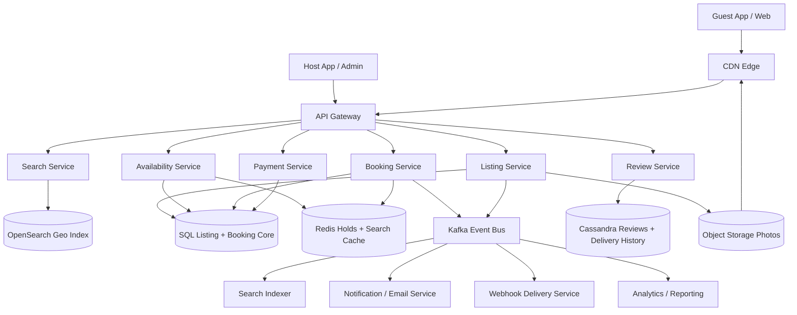
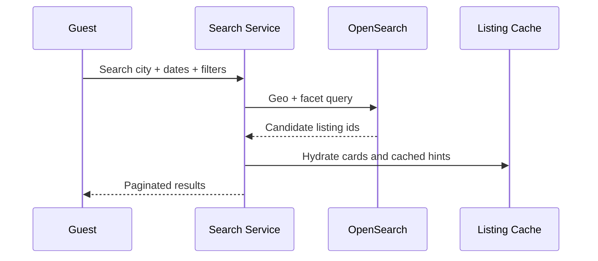
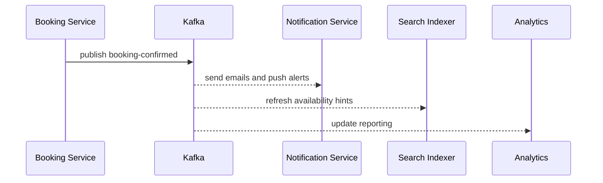
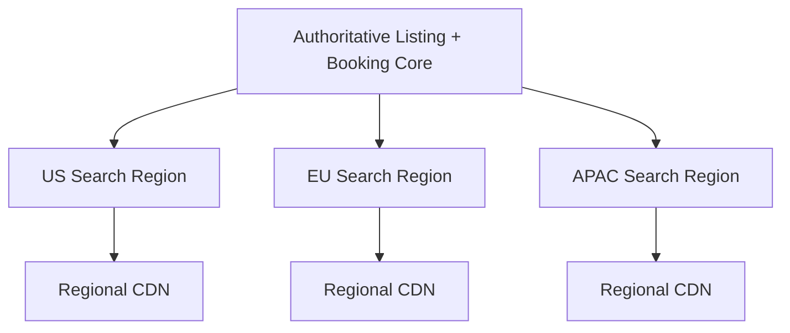

# Design Airbnb

Airbnb is a classic system design interview problem because it combines a marketplace search experience with inventory correctness and a global payments workflow. Guests expect fast discovery by city, map area, dates, price, and amenities. Hosts expect listing edits, pricing changes, calendar blocks, and booking requests to propagate quickly. The difficult part is that the platform must keep search broad and cache-friendly while ensuring the same listing cannot be double-booked for the same dates.

At a high level, the system has two very different workloads. The first is the **search and browse path**, where guests search locations, view listing cards, open listing details, and scroll large result sets. The second is the **booking path**, where the platform must validate availability, create short-lived holds, authorize payment, confirm a booking, and fan out side effects to calendars, notifications, reviews, analytics, and host tools. A good design keeps search fast and approximate, while making booking correctness strongly consistent at the listing-and-date level.

---

## Functional Requirements

**In Scope:**
- Hosts can create and update listings with photos, amenities, prices, rules, and availability
- Guests can search listings by location, date range, guest count, price, and filters
- Guests can view listing details, reviews, pricing breakdowns, and availability hints
- Guests can create a reservation hold and confirm a booking with payment authorization
- Hosts can block dates, update nightly pricing, and accept or manage reservations
- The system stores bookings, cancellations, refunds, and booking status changes
- Guests and hosts can read review summaries and submit reviews after stays
- Operators can inspect search freshness, booking failures, payment callback lag, and hot-market pressure

**Out of Scope:**
- Full airline, car rental, or activity marketplace flows
- Rich host-guest messaging and inbox internals
- Detailed fraud modeling, identity verification, or trust-and-safety workflows
- Full dynamic pricing model implementation details
- Tax remittance internals for every country and jurisdiction

---

## Non-Functional Requirements

| Property | Target | Reasoning |
|---|---|---|
| **Search Latency** | p99 < 250ms for location, date, and filter search | marketplace conversion depends on fast browse and map interaction |
| **Listing Detail Latency** | p99 < 150ms for cached detail reads excluding image bytes | users open many listings before booking |
| **Booking Create Latency** | p99 < 500ms before payment-provider round-trips | booking flow must feel reliable and deterministic |
| **Availability Correctness** | no overlapping confirmed bookings for the same listing and date | double booking is one of the most damaging marketplace failures |
| **Availability** | 99.99% for search and detail reads; 99.9% for booking writes | browse traffic is constant, booking writes are lower volume but correctness-critical |
| **Durability** | no loss of committed listing edits, booking records, or payment callbacks | lost bookings or listing changes are unacceptable |
| **Freshness** | listing edits and calendar changes reflected in search within seconds to minutes | hosts expect near-real-time updates, but exact global instant visibility is expensive |
| **Scalability** | millions of search requests/sec and strong seasonal or event-driven spikes | city events, holidays, and viral listings create localized hotspots |

**Key tradeoff:** the platform prioritizes **fast approximate search with strong booking correctness** over globally synchronized search updates on every calendar edit. Search indices and caches can lag slightly, but confirmed bookings and availability commits cannot.

---

## Capacity Estimation

**Marketplace scale assumptions:**
- Assume **10M active listings** globally across cities, homes, rooms, and unique stay types
- Assume **50M monthly active guests** and strong regional seasonality
- Traffic is highly skewed: a small set of cities, neighborhoods, and holiday windows drives a large share of search volume

**Search traffic:**
- Assume **1M search requests/sec** at peak across map exploration, date changes, filter updates, and pagination
- Search requests are often repeated rapidly while users move the map or tweak filters, so caching and query collapsing matter a lot
- The majority of search calls do not end in booking, which means the browse path must be cost-efficient

**Booking traffic:**
- Assume **20K booking attempts/sec** at peak during holiday periods or major local events
- Booking writes are far lower than browse reads, but each write is much more sensitive because availability, payment, and idempotency all matter
- Hot listings can receive many overlapping booking attempts for the same dates

**Asset traffic:**
- Listing photos dominate bytes but not application complexity
- Images and static assets should be served by object storage plus CDN, not by the application tier

**Operational profile:**
- New Year, city festivals, and summer travel seasons create intense market-local hotspots
- Hosts may bulk update prices or block dates, creating bursts of search-index refresh and cache invalidation work

---

## Core Entities

| Entity | Purpose | Key Fields | Relationships |
|---|---|---|---|
| **UserAccount** | Host or guest identity | `user_id`, `role_flags`, `status`, `created_at` | owns listings or bookings |
| **Listing** | Bookable property metadata | `listing_id`, `host_id`, `title`, `geo_point`, `capacity`, `status` | has calendar, photos, pricing, reviews |
| **ListingPhoto** | Listing media asset | `photo_id`, `listing_id`, `object_key`, `sort_order` | belongs to one listing |
| **CalendarDay** | Per-night availability and price unit | `listing_id`, `stay_date`, `status`, `nightly_price_cents`, `min_nights` | source of truth for reservation validation |
| **ReservationHold** | Short-lived checkout hold | `hold_id`, `listing_id`, `guest_id`, `checkin_date`, `checkout_date`, `expires_at`, `state` | becomes a booking or expires |
| **Booking** | Confirmed or canceled reservation | `booking_id`, `listing_id`, `guest_id`, `checkin_date`, `checkout_date`, `status`, `total_cents` | references payment and review windows |
| **PaymentTransaction** | Payment authorization or capture | `payment_id`, `booking_id`, `provider`, `amount_cents`, `status`, `provider_ref` | linked to one booking |
| **Review** | Post-stay rating and text | `review_id`, `booking_id`, `listing_id`, `author_id`, `rating`, `created_at` | visible on listing detail pages |
| **SearchDocument** | Denormalized listing document for browse | `listing_id`, `market_id`, `amenities`, `price_hint`, `availability_hint` | powers search and map results |
| **WebhookSubscription** | Integration sink for hosts or partner tools | `subscription_id`, `user_id`, `topic`, `target_url`, `status` | receives async event deliveries |

**Critical modeling decisions:**
- `CalendarDay` is the correctness boundary for availability. Search can use compressed or cached availability views, but booking must validate against authoritative per-night rows or equivalent segments.
- `ReservationHold` is separate from `Booking`. This lets the platform hold dates briefly during checkout without prematurely committing a reservation.
- `SearchDocument` is a denormalized read model. It should not be the source of truth for whether a booking is valid.

---

## Databases and Database Design

### Storage Tier Decisions

| Data | Access Pattern | Engine | Why |
|---|---|---|---|
| Listings, calendar days, reservation holds, bookings, payments | transactional writes, exact reads, overlapping-date validation | **PostgreSQL / MySQL** | booking correctness and relational integrity require ACID semantics |
| Marketplace search and map exploration | geospatial queries, text filters, facets, ranking | **OpenSearch** | inverted and geo indexes are ideal for location plus filter search |
| Search-result cache, availability hints, hold tokens, rate limits | sub-millisecond reads/writes, TTLs, hot-market keys | **Redis** | ideal for ephemeral serving state and hot caches |
| Review timelines, webhook delivery history, operational event logs | append-heavy writes, listing or host scoped reads | **Cassandra / ScyllaDB** | scales well for time-ordered histories |
| Catalog changes, booking events, webhooks, notifications, analytics | durable append-only backbone | **Kafka** | decouples booking/search core from many downstream consumers |
| Listing photos and static assets | large immutable objects | **Object Storage + CDN** | media bytes should bypass the app servers |

This is intentionally polyglot. Airbnb-like systems need **transactional booking state**, **fast geo search**, **ephemeral hold and cache state**, **durable fanout for side effects**, and **cheap global asset delivery**. One database cannot serve those patterns efficiently.

### Schema 1 - Listings and Photos (SQL)

```sql
CREATE TABLE listings (
  listing_id               UUID PRIMARY KEY DEFAULT gen_random_uuid(),
  host_id                  UUID NOT NULL,
  title                    TEXT NOT NULL,
  description_html         TEXT,
  lat                      NUMERIC(9,6) NOT NULL,
  lng                      NUMERIC(9,6) NOT NULL,
  capacity                 INT NOT NULL,
  home_type                VARCHAR(32) NOT NULL,
  status                   VARCHAR(16) NOT NULL,
  created_at               TIMESTAMPTZ DEFAULT NOW(),
  updated_at               TIMESTAMPTZ DEFAULT NOW()
);

CREATE TABLE listing_photos (
  photo_id                 UUID PRIMARY KEY DEFAULT gen_random_uuid(),
  listing_id               UUID NOT NULL REFERENCES listings(listing_id),
  object_key               TEXT NOT NULL,
  sort_order               INT NOT NULL,
  created_at               TIMESTAMPTZ DEFAULT NOW()
);

CREATE INDEX idx_listings_host_status
  ON listings (host_id, status, created_at DESC);
```

### Schema 2 - Calendar and Availability (SQL)

```sql
CREATE TABLE calendar_days (
  listing_id               UUID NOT NULL REFERENCES listings(listing_id),
  stay_date                DATE NOT NULL,
  status                   VARCHAR(16) NOT NULL,
  nightly_price_cents      BIGINT NOT NULL,
  min_nights               INT NOT NULL DEFAULT 1,
  updated_at               TIMESTAMPTZ DEFAULT NOW(),
  PRIMARY KEY (listing_id, stay_date)
);

CREATE INDEX idx_calendar_day_status
  ON calendar_days (stay_date, status);
```

### Schema 3 - Reservation Holds and Bookings (SQL)

```sql
CREATE TABLE reservation_holds (
  hold_id                  UUID PRIMARY KEY DEFAULT gen_random_uuid(),
  listing_id               UUID NOT NULL REFERENCES listings(listing_id),
  guest_id                 UUID NOT NULL,
  checkin_date             DATE NOT NULL,
  checkout_date            DATE NOT NULL,
  expires_at               TIMESTAMPTZ NOT NULL,
  state                    VARCHAR(16) NOT NULL,
  created_at               TIMESTAMPTZ DEFAULT NOW()
);

CREATE TABLE bookings (
  booking_id               UUID PRIMARY KEY DEFAULT gen_random_uuid(),
  listing_id               UUID NOT NULL REFERENCES listings(listing_id),
  guest_id                 UUID NOT NULL,
  hold_id                  UUID REFERENCES reservation_holds(hold_id),
  checkin_date             DATE NOT NULL,
  checkout_date            DATE NOT NULL,
  status                   VARCHAR(16) NOT NULL,
  total_cents              BIGINT NOT NULL,
  created_at               TIMESTAMPTZ DEFAULT NOW()
);

CREATE INDEX idx_bookings_listing_checkin
  ON bookings (listing_id, checkin_date DESC);
```

### Schema 4 - Reviews by Listing (Cassandra)

```sql
CREATE TABLE reviews_by_listing (
  listing_id               UUID,
  bucket_month             TEXT,
  created_at               TIMESTAMP,
  review_id                UUID,
  author_id                UUID,
  rating                   INT,
  body                     TEXT,
  PRIMARY KEY ((listing_id, bucket_month), created_at, review_id)
) WITH CLUSTERING ORDER BY (created_at DESC, review_id DESC);
```

Monthly buckets keep review partitions bounded for long-lived popular listings.

### Schema 5 - Search Document (OpenSearch)

```json
{
  "listing_id": "lst_123",
  "market_id": "san_francisco",
  "geo_point": { "lat": 37.7749, "lon": -122.4194 },
  "title": "Sunny loft near downtown",
  "capacity": 4,
  "amenities": ["wifi", "kitchen", "self_check_in"],
  "price_hint_cents": 18900,
  "availability_hint": true,
  "status": "active"
}
```

### Schema 6 - Hold Token (Logical Redis Record)

```json
{
  "key": "hold:listing:lst_123:2026-07-01:2026-07-04:guest_456",
  "value": {
    "hold_id": "hold_789",
    "expires_at": "2026-06-03T10:05:00Z",
    "status": "active"
  }
}
```

Holds are short-lived and rebuilt from durable booking state when needed, so Redis is a good helper but not the only source of truth.

### Sharding and Replication Strategy

| Store | Shard Key | Strategy | Replication |
|---|---|---|---|
| SQL booking core | `listing_id` or `market_id` | shard by market or listing hash; keep one authoritative writer per shard | primary + replicas, some synchronous for booking-critical paths |
| OpenSearch | `market_id` or listing routing key | geo-aware search shards with replicas | multi-node replicated clusters |
| Redis | `listing_id`, `market_id`, `guest_id` | Redis Cluster | 1 replica per master |
| Cassandra | `(listing_id, bucket_month)` or `(host_id, bucket_day)` | consistent hashing across nodes | RF=3, `LOCAL_QUORUM` |
| Kafka | `listing_id`, `host_id`, or `market_id` depending on topic | partitioned durable log | RF=3 |
| Object Storage | `listing_id/photos/...` namespace | regional bucket + CDN | multi-AZ durable storage |

**Consistency model:**
- Strong consistency for availability validation, hold creation, booking confirmation, and payment state transitions
- Eventual consistency for search refresh, review rollups, notifications, and analytics
- Best-effort low-latency consistency for search-result caches and availability hints

**Read/write patterns:**
- **Search path:** query OpenSearch by geo/date/filter -> hydrate listing cards from cache or listing service -> return paginated result set
- **Booking path:** validate durable calendar rows -> create short-lived hold -> authorize payment -> create booking -> mark calendar unavailable -> publish downstream events
- **Host mutation path:** listing or calendar edit -> SQL commit -> Kafka event -> search reindex, cache invalidation, notifications, and analytics

---

## API Design

**Search listings:**
```http
GET /v1/search?lat=37.7749&lng=-122.4194&radius_km=8&checkin=2026-07-01&checkout=2026-07-04&guests=2&cursor=srch_100&limit=20

200 OK
{
  "listings": [
    {
      "listing_id": "lst_123",
      "title": "Sunny loft near downtown",
      "price_hint_cents": 18900,
      "availability_hint": true,
      "rating_avg": 4.89
    }
  ],
  "next_cursor": "srch_101",
  "has_more": true
}
```

> Cursor-based pagination is preferred for geo search. Offset pagination (`?page=N`) becomes unstable and expensive for deep browse plus dynamic ranking and map filtering.

**Get listing details:**
```http
GET /v1/listings/lst_123?checkin=2026-07-01&checkout=2026-07-04&guests=2

200 OK
{
  "listing_id": "lst_123",
  "title": "Sunny loft near downtown",
  "nightly_price_cents": 18900,
  "cleaning_fee_cents": 2500,
  "availability_hint": true,
  "photo_urls": ["https://cdn.example.com/lst_123/1.jpg"]
}
```

**Create a reservation hold:**
```http
POST /v1/reservation-holds
Authorization: Bearer <jwt>
Idempotency-Key: hold-001

{
  "listing_id": "lst_123",
  "checkin_date": "2026-07-01",
  "checkout_date": "2026-07-04",
  "guest_count": 2
}

201 Created
{
  "hold_id": "hold_789",
  "expires_at": "2026-06-03T10:05:00Z",
  "price_quote_cents": 61200
}
```

**Confirm a booking:**
```http
POST /v1/bookings
Authorization: Bearer <jwt>
Idempotency-Key: booking-001

{
  "hold_id": "hold_789",
  "payment_method_id": "pm_555"
}

201 Created
{
  "booking_id": "bkg_999",
  "status": "confirmed",
  "total_cents": 61200
}
```

**Handle payment authorization callback:**
```http
POST /v1/payments/provider-callback
Content-Type: application/json

{
  "provider": "stripe",
  "provider_ref": "pi_123",
  "booking_id": "bkg_999",
  "status": "authorized"
}

202 Accepted
```

**Update listing calendar:**
```http
POST /v1/listings/lst_123/calendar/blocks
Authorization: Bearer <jwt>

{
  "from": "2026-07-10",
  "to": "2026-07-12",
  "reason": "host_blocked"
}

204 No Content
```

**Host booking updates stream (optional SSE):**
```http
GET /v1/hosts/me/bookings/stream
Authorization: Bearer <jwt>
Accept: text/event-stream
```
Store search and booking do not require WebSockets. SSE or polling is usually enough for host dashboards, while most guest actions fit ordinary request-response APIs.

---

## High-Level Design



**Component responsibilities:**

| Component | Role |
|---|---|
| **API Gateway** | Authentication, throttling, routing, and request validation |
| **Search Service** | Handles geo and filter search queries over a denormalized listing index |
| **Listing Service** | Manages listing metadata, amenities, photos, and host edits |
| **Availability Service** | Validates date ranges, manages calendar blocks, and creates short-lived holds |
| **Booking Service** | Creates bookings, enforces idempotency, and applies booking state transitions |
| **Payment Service** | Orchestrates provider interactions and payment callbacks |
| **Review Service** | Stores review timelines and summary data |
| **Redis** | Search-result cache, availability hints, hold tokens, and rate limits |
| **SQL Listing + Booking Core** | Source of truth for listings, calendars, bookings, payments, and host calendar edits |
| **Kafka** | Durable fanout for search indexing, notifications, webhooks, and analytics |
| **Webhook Delivery Service** | Retries merchant or partner callbacks for booking and listing events |
| **Object Storage + CDN** | Serves listing photos and static assets globally |

**Search and booking flow:**
1. Guest searches by location, dates, and filters through Search Service backed by OpenSearch and cache
2. Guest opens listing detail, which hydrates pricing hints, review summaries, and availability hints from the core services
3. Guest starts checkout; Availability Service validates authoritative calendar rows and creates a short-lived hold
4. Payment Service authorizes payment while the hold is active
5. Booking Service confirms the booking, commits unavailable calendar days, and stores payment state durably
6. Kafka publishes downstream events for email, search freshness, analytics, reviews eligibility, and partner webhooks without slowing the booking response

---

## Deep Dives

### 1. Search: Geo Indexing and Filtered Discovery Are Central

Search is the top of the funnel for the entire marketplace. Guests want location, dates, guest count, amenities, and price all in one fast interaction. The hard part is that location and filter search is broad, but exact bookability is narrow and correctness-critical. You cannot run exact calendar joins across millions of listings for every map pan or filter change.

That is why the platform usually separates **discovery search** from **booking validation**. Search uses denormalized geo documents with availability hints, price hints, and facet-friendly fields. Booking later validates against the source of truth.



**Why the problem happens:** guests need broad, low-latency search across large markets.

**Why it becomes difficult at scale:**
- location plus date-range plus amenity filtering is expensive
- map panning and repeated filter changes amplify read load heavily
- exact availability checks for every result would be too slow and expensive

**Production-grade solutions:**
- maintain denormalized search documents with geo fields, amenities, price hints, and coarse availability hints
- use OpenSearch for candidate retrieval and faceting rather than direct relational scans
- keep search result caches short-lived so hot markets do not thrash the index unnecessarily
- treat search as a fast approximation and revalidate exact availability during hold creation

**Tradeoffs:** fast search improves conversion, but it accepts short windows where browse results can show a listing that is no longer truly bookable.

### 2. Booking Correctness: Holds and Calendar Rows Matter Most

The hardest correctness problem in Airbnb is preventing overlapping bookings. A listing can be searched many times concurrently, but only one guest should be allowed to confirm the same nights. That means the platform needs short-lived holds and authoritative calendar writes.


**Why the problem happens:** popular listings and holiday dates attract many simultaneous attempts.

**Why it becomes difficult at scale:**
- a single listing can become a hotspot for one date range
- payment authorization takes time, so dates cannot stay globally free during checkout forever
- hosts may also block or edit the calendar while guests are checking out

**Production-grade solutions:**
- use authoritative per-day calendar rows or equivalent interval structures in the transactional store
- create short-lived holds with expiry instead of long blocking transactions during payment
- confirm bookings with idempotent APIs and compare against the current durable availability state
- serialize or partition booking-critical writes by `listing_id` so conflicts are local and manageable

**Tradeoffs:** holds reduce double-booking risk, but they add expiration logic and can temporarily hide availability from other guests even when payment later fails.

### 3. Kafka: Critical for Side Effects, Not for Booking Decisions

Kafka is extremely useful in Airbnb-like systems, but it should not decide whether a booking exists. That decision belongs in the transactional booking core. Kafka is valuable after commit for search refresh, emails, host notifications, review eligibility, analytics, partner webhooks, and fraud or trust pipelines.



**Why the problem happens:** one booking produces many downstream side effects with different SLAs.

**Why it becomes difficult at scale:**
- emails, webhooks, search indexing, and analytics can lag or fail independently
- holiday spikes create bursts of downstream work just when the booking core is busiest
- replay matters after bugs or schema changes in derived systems

**Production-grade solutions:**
- publish immutable listing and booking events only after the transactional commit succeeds
- partition Kafka by `listing_id` or `host_id` where local ordering is useful
- keep slow integrations entirely off the synchronous guest path
- support replay and dead-letter handling for flaky consumers such as third-party webhooks

**Tradeoffs:** Kafka adds operational overhead, but without it the platform would tightly couple guest checkout to many unreliable downstream systems.

### 4. Redis: Great for Hints and Holds, Not the Final Source of Truth

Redis is highly valuable here for hold tokens, search-result caches, rate limits, and availability hints. But Redis should not be the only source of truth for whether a listing is bookable. A cache miss or failover should degrade performance, not booking correctness.

| Redis Use | Example Key | Why Redis Fits |
|---|---|---|
| **Search cache** | `search:sf:2026-07-01:2026-07-04:2:wifi` | repeated browse queries are hot and short-lived |
| **Hold token** | `hold:listing:lst_123:2026-07-01:2026-07-04:guest_456` | checkout holds need TTL-based expiration |
| **Availability hint** | `avail_hint:listing:lst_123:2026-07` | helps search avoid expensive repeated recomputation |
| **Rate limiting** | `rl:host:usr_111:calendar_update` | protects hot listings and bulk edit abuse |

**Why the problem happens:** the platform repeatedly needs tiny amounts of hot, expiring state.

**Why it becomes difficult at scale:**
- hot cities and hot listings create concentrated cache pressure
- stale availability hints can mislead search if treated as authoritative
- expired holds and canceled checkouts must disappear promptly or stock gets stranded

**Production-grade solutions:**
- keep Redis for ephemeral performance state only and rebuild from the booking core on misses
- attach strict TTLs to holds and search caches
- use Redis as a fast pre-check before doing authoritative calendar validation in SQL
- shard or isolate hot-market caches when city-level traffic spikes dominate

**Tradeoffs:** Redis gives the browse and checkout path the latency profile it needs, but it adds invalidation complexity and must be paired with durable revalidation.

### 5. Pricing, Cleaning Fees, and Search Ranking Complexity

Airbnb search is not just about location. Guests care about nightly price, cleaning fee, cancellation policy, rating, amenities, and sometimes map proximity. Hosts care about smart pricing, availability rules, and minimum-stay settings. These all complicate both browse ranking and checkout pricing.

**Why the problem happens:** marketplace relevance depends on many signals besides pure proximity.

**Why it becomes difficult at scale:**
- total price depends on date range, fees, taxes, discounts, and stay rules
- search ranking wants a price hint quickly, while checkout wants exact totals
- hosts may update prices frequently, invalidating cached search snippets

**Production-grade solutions:**
- keep coarse price hints in the search index for browsing and exact pricing in the booking core for checkout
- recompute precise totals during hold creation or checkout, not on every search card render
- separate pricing rules from listing metadata so bulk price updates do not rewrite all listing fields
- use ranking features that tolerate slight lag in price or popularity signals while still surfacing relevant inventory

**Tradeoffs:** browse-time price estimation keeps search fast, but exact totals are inevitably a booking-time computation.

### 6. WebSockets: Usually Optional for Core Marketplace Flows

The core Airbnb experience does not require WebSockets. Search, listing detail, hold creation, booking, and payment callbacks all fit request-response APIs naturally. Hosts may want live updates on reservation events, but SSE or periodic polling is usually enough for admin dashboards.

**Why the problem happens:** many products feel realtime even when their primary flows are not connection-oriented.

**Why it becomes difficult at scale:**
- persistent sockets add connection-state cost for limited benefit on the guest path
- most guest and host actions already have clear request-response semantics
- notification freshness matters, but perfect millisecond live delivery is rarely necessary for bookings

**Production-grade solutions:**
- keep guest search and booking APIs stateless and cache-friendly
- use SSE or polling for host dashboards and operational admin panels when useful
- keep partner integrations on webhooks rather than realtime sockets
- reserve WebSockets for richer host-guest messaging or live collaboration features if those become separate products

**Tradeoffs:** avoiding WebSockets simplifies global scaling and keeps the core architecture easier to reason about, at the cost of slightly less immediate admin updates.

### 7. Hot Markets, Holidays, and Listing Hotspots

Marketplace traffic is not evenly distributed. A city event, holiday weekend, or viral listing can create intense contention on a small slice of inventory. Those hotspots stress search caches, map queries, calendar validation, and booking holds all at once.

**Why the problem happens:** demand clusters around geography and time windows.

**Why it becomes difficult at scale:**
- one market can generate a large share of traffic for a short period
- one listing can receive many simultaneous hold attempts for the same nights
- dynamic pricing and host edits often spike alongside guest demand

**Production-grade solutions:**
- partition caches and search shards by market so hotspots are localized
- use per-listing or per-market admission control during extreme demand spikes
- pre-warm hot-city search caches and image CDN layers before known seasonal events
- isolate high-traffic listings operationally if necessary so they do not dominate shared resources

**Tradeoffs:** hotspot isolation improves resilience, but it increases operational complexity and capacity fragmentation.

### 8. Multi-Region Serving and Authoritative Write Domains

Guests browse globally, so search and listing details should be served from nearby regions. But bookings and calendar writes need a clear source of truth. That usually means globally distributed read planes with more tightly controlled write authority for each listing or market.



**Why the problem happens:** guests want low-latency search, but booking correctness does not tolerate ambiguous active writers.

**Why it becomes difficult at scale:**
- cross-region write coordination increases hold and booking latency
- search freshness naturally lags behind authoritative calendar updates
- failover must not double-confirm a booking or lose payment callbacks

**Production-grade solutions:**
- replicate listing metadata and search indices regionally for fast reads
- keep each listing or market in one authoritative write domain for availability and bookings
- use idempotency keys and provider references to survive retries and regional failover events
- prioritize fast propagation for calendar, block, and cancellation changes that materially affect bookability

**Tradeoffs:** full global strong consistency is too expensive for browse traffic, so the system accepts read-side lag while keeping booking commits tightly controlled.

### 9. Architecture Evolution

| Stage | Design | Why It Breaks | Next Step |
|---|---|---|---|
| **1. MVP** | Single relational app with listings, search, and bookings together | geo search and image traffic overwhelm the core quickly | split search, move photos to object storage, add caches |
| **2. Growth** | Separate listing, booking, and search services with Kafka fanout | availability hotspots and search freshness become bottlenecks | add holds, Redis hints, and stronger market partitioning |
| **3. Scale** | Multi-region search, dedicated booking core, webhook and analytics pipelines | hot markets and seasonal spikes stress shared caches and shards | isolate hot markets, improve quotas, and regionalize read planes |
| **4. Mature Marketplace** | Global browse plane with tightly controlled booking writes and rich integrations | complexity shifts to operations, trust, and partner ecosystems | keep booking correctness small and evolve peripheral systems independently |

This is the interview pattern to emphasize: keep search broad, cached, and approximate; keep booking correctness narrow and transactional; use Kafka for side effects; and let Redis, OpenSearch, object storage, and regional caches scale the rest of the marketplace around that core.
