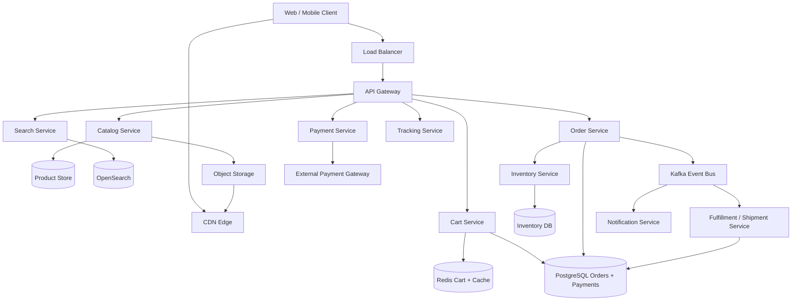
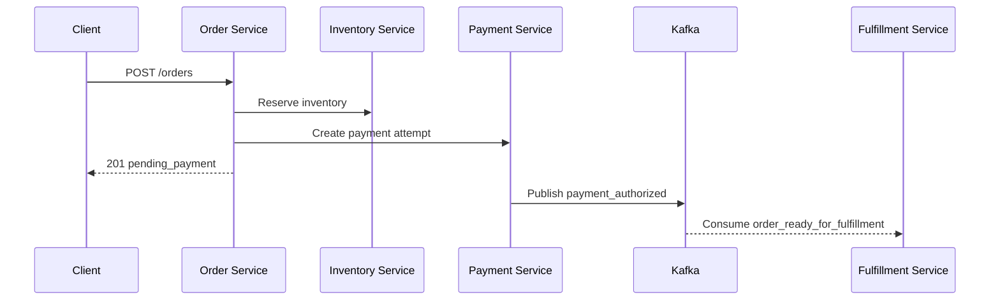
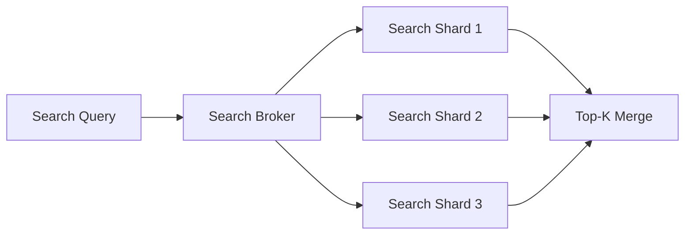
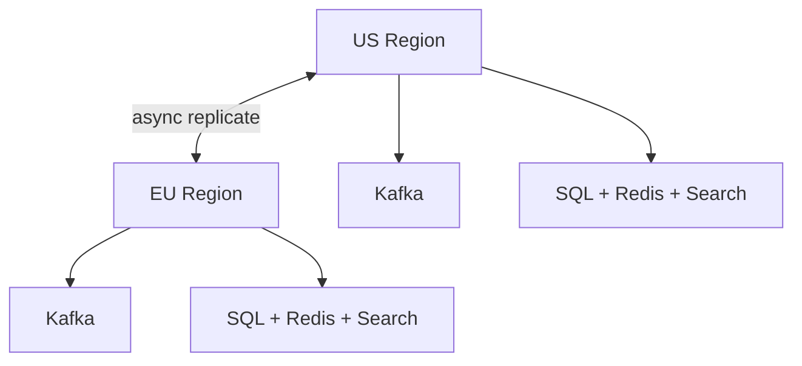

# Design Amazon/Flipkart

Amazon/Flipkart is a classic system design interview because it combines a massive **read-heavy product discovery system** with a correctness-sensitive **order and inventory pipeline**. The homepage, search, recommendations, pricing, cart, checkout, payment orchestration, and fulfillment network all look like one product to the user, but they behave like very different distributed systems underneath.

The surface looks simple: browse a product, add to cart, place an order. The depth lies in catalog scale, search freshness, inventory reservation, exactly-once order creation, hot-product spikes, cart durability, asynchronous fulfillment, and keeping the user-facing checkout path fast even when downstream systems are slow.

---

## Functional Requirements

**In Scope:**
- Browse product listings and product detail pages
- Search products with filters, sort, and pagination
- Add or remove items from cart and wishlist
- Place an order for one or more items
- Reserve inventory during checkout and update stock after purchase
- Support payments through an external payment gateway
- Track order status from placed to delivered
- Show personalized home feed and recommendations

**Out of Scope:**
- Seller onboarding and catalog ingestion tools
- Ad ranking and sponsored products
- Fraud model internals and risk-scoring pipelines
- Warehouse robotics and route optimization internals
- Live commerce and chat support

---

## Non-Functional Requirements

| Property | Target | Reasoning |
|---|---|---|
| **Product Search Latency** | p99 < 300ms | Discovery is the highest-volume path and directly affects conversion |
| **Cart Update Latency** | p99 < 100ms | Cart interactions must feel instant |
| **Checkout Latency** | p99 < 2s before payment redirect/confirmation | Users abandon slow checkout flows quickly |
| **Availability** | 99.99% for browse/search; 99.95% for checkout | Browse must stay highly available; checkout tolerates slightly stricter correctness paths |
| **Durability** | No lost orders, payments, or inventory reservations | Order correctness matters more than secondary counters |
| **Consistency** | Strong for inventory reservation, payment state, and order creation; eventual for search index, recommendation rows, and counters | Stale ratings are acceptable; overselling is not |
| **Scale** | 100M+ DAU, millions of SKUs, flash-sale spikes | Skew and burst traffic shape the architecture |
| **Reliability** | Graceful degradation during sale events and hot-product spikes | One viral product cannot take down checkout or catalog services |

**Key tradeoff:** the marketplace optimizes for **correct order placement over perfectly fresh secondary views**. A review count or search ranking can lag by seconds. Inventory reservation, payment state, and order creation cannot drift casually because they directly affect money and customer trust.

---

## Capacity Estimation

**Traffic:**
- Assume **100M DAU**
- 10 product page views/user/day -> **1B product reads/day** -> ~11.5K/sec average, ~100K/sec peak
- 100M search requests/day -> ~1.1K/sec average, ~10K/sec peak

**Cart and checkout:**
- 200M cart mutations/day -> ~2.3K/sec average, ~20K/sec peak
- 20M orders/day -> ~230 orders/sec average, **2-5K/sec peak** during major sales

**Catalog:**
- 100M active SKUs
- Product metadata and media pointers fit in tens of TB hot storage; images live in object storage/CDN

**Events:**
- Inventory changes, order state transitions, payment callbacks, shipment updates, and clickstream data produce **hundreds of thousands of events/sec** during sales

---

## Core Entities

| Entity | Purpose | Key Fields | Relationships |
|---|---|---|---|
| **User** | Buyer identity | `user_id`, `email`, `phone`, `default_address_id`, `created_at` | owns carts, orders, payments |
| **Product** | Searchable sellable item | `product_id`, `seller_id`, `title`, `category_id`, `price`, `status`, `updated_at` | has inventory, media, reviews |
| **InventoryItem** | Fulfillable stock for a SKU in one warehouse | `sku_id`, `warehouse_id`, `available_qty`, `reserved_qty`, `updated_at` | linked to a product and order lines |
| **Cart** | Mutable pre-checkout basket | `cart_id`, `user_id`, `state`, `updated_at` | has many cart items |
| **CartItem** | Product quantity inside a cart | `cart_id`, `sku_id`, `quantity`, `unit_price`, `added_at` | belongs to one cart |
| **Order** | Durable purchase record | `order_id`, `user_id`, `status`, `payment_status`, `total_amount`, `placed_at` | has many order items and shipment events |
| **OrderItem** | Line item inside an order | `order_id`, `sku_id`, `quantity`, `unit_price`, `reservation_id` | maps order to inventory |
| **PaymentAttempt** | Payment orchestration state | `payment_id`, `order_id`, `provider`, `status`, `idempotency_key`, `updated_at` | belongs to one order |
| **Shipment** | Delivery tracking state | `shipment_id`, `order_id`, `carrier`, `tracking_id`, `status`, `updated_at` | created after fulfillment allocation |

**Critical modeling decisions:**
- `Product` and `InventoryItem` are separate because search reads product metadata constantly, while inventory is a high-contention transactional dataset.
- `Cart` is mutable and user-scoped; `Order` is immutable after placement except for controlled state transitions.
- Recommendations, category pages, and search results are **derived views**. Orders, payments, and reservations are the source of truth.

---

## Databases and Database Design

### Storage Tier Decisions

| Data | Access Pattern | Engine | Why |
|---|---|---|---|
| Users, carts, orders, payments | transactional writes, exact reads, rich relationships | **PostgreSQL / MySQL** | checkout correctness and idempotent state transitions need ACID guarantees |
| Product catalog metadata | high read volume, moderate writes, key/value lookups | **Document store or wide-column store** | product attributes vary by category and scale better in denormalized form |
| Search index | full-text search, filters, facets, ranking | **OpenSearch / Elasticsearch** | inverted index is the right fit for product discovery |
| Inventory reservations | high contention, atomic decrements, warehouse-scoped updates | **PostgreSQL / NewSQL / strongly consistent KV** | overselling must be prevented with transactional semantics |
| Carts, sessions, recommendations cache | sub-millisecond reads, TTLs, hot keys | **Redis** | ideal for hot carts, rate limits, and cached rows |
| Order, payment, shipment events | append-only durable streams | **Kafka** | decouples checkout from fulfillment, notifications, and analytics |
| Product images and media | immutable blobs | **Object Storage + CDN** | cheapest and most scalable delivery path |

This is a deliberately polyglot design. Search, catalog, carts, inventory, and orders do not share the same access pattern, so forcing them into one database produces the wrong tradeoffs everywhere.

### Schema 1 - Users and Addresses (PostgreSQL)

```sql
CREATE TABLE users (
  user_id             UUID PRIMARY KEY DEFAULT gen_random_uuid(),
  email               VARCHAR(255) UNIQUE NOT NULL,
  phone               VARCHAR(20) UNIQUE,
  default_address_id  UUID,
  created_at          TIMESTAMPTZ DEFAULT NOW()
);

CREATE TABLE addresses (
  address_id          UUID PRIMARY KEY DEFAULT gen_random_uuid(),
  user_id             UUID NOT NULL REFERENCES users(user_id),
  line1               TEXT NOT NULL,
  city                VARCHAR(100) NOT NULL,
  state               VARCHAR(100) NOT NULL,
  postal_code         VARCHAR(20) NOT NULL,
  country_code        CHAR(2) NOT NULL,
  created_at          TIMESTAMPTZ DEFAULT NOW()
);

CREATE INDEX idx_addresses_user ON addresses (user_id);
```

### Schema 2 - Product Catalog (Document / Wide-Column)

```sql
CREATE TABLE products (
  product_id          UUID PRIMARY KEY,
  seller_id           UUID,
  title               TEXT,
  category_id         BIGINT,
  price_cents         BIGINT,
  currency            CHAR(3),
  status              TEXT,
  attributes_json     JSONB,
  media_keys          TEXT[],
  updated_at          TIMESTAMP
);
```

Product attributes vary wildly across categories, so a flexible schema is more practical than a fully normalized relational model for serving reads.

### Schema 3 - Inventory by SKU and Warehouse (PostgreSQL)

```sql
CREATE TABLE inventory_items (
  sku_id              UUID,
  warehouse_id        UUID,
  available_qty       INT NOT NULL,
  reserved_qty        INT NOT NULL DEFAULT 0,
  safety_stock        INT NOT NULL DEFAULT 0,
  updated_at          TIMESTAMPTZ DEFAULT NOW(),
  PRIMARY KEY (sku_id, warehouse_id)
);

CREATE INDEX idx_inventory_warehouse ON inventory_items (warehouse_id, sku_id);
```

This table stays small and transactional. It is updated by reservations, cancellations, returns, and warehouse reconciliation jobs.

### Schema 4 - Carts and Cart Items (PostgreSQL)

```sql
CREATE TABLE carts (
  cart_id              UUID PRIMARY KEY DEFAULT gen_random_uuid(),
  user_id              UUID NOT NULL REFERENCES users(user_id),
  state                VARCHAR(16) NOT NULL DEFAULT 'active',
  updated_at           TIMESTAMPTZ DEFAULT NOW()
);

CREATE TABLE cart_items (
  cart_id              UUID NOT NULL REFERENCES carts(cart_id),
  sku_id               UUID NOT NULL,
  quantity             INT NOT NULL,
  unit_price_cents     BIGINT NOT NULL,
  added_at             TIMESTAMPTZ DEFAULT NOW(),
  PRIMARY KEY (cart_id, sku_id)
);
```

### Schema 5 - Orders and Payments (PostgreSQL)

```sql
CREATE TABLE orders (
  order_id             UUID PRIMARY KEY DEFAULT gen_random_uuid(),
  user_id              UUID NOT NULL REFERENCES users(user_id),
  status               VARCHAR(20) NOT NULL,
  payment_status       VARCHAR(20) NOT NULL,
  total_amount_cents   BIGINT NOT NULL,
  placed_at            TIMESTAMPTZ DEFAULT NOW(),
  idempotency_key      VARCHAR(128) UNIQUE NOT NULL
);

CREATE TABLE order_items (
  order_id             UUID NOT NULL REFERENCES orders(order_id),
  sku_id               UUID NOT NULL,
  quantity             INT NOT NULL,
  unit_price_cents     BIGINT NOT NULL,
  reservation_id       UUID,
  PRIMARY KEY (order_id, sku_id)
);

CREATE TABLE payment_attempts (
  payment_id           UUID PRIMARY KEY DEFAULT gen_random_uuid(),
  order_id             UUID NOT NULL REFERENCES orders(order_id),
  provider             VARCHAR(32) NOT NULL,
  status               VARCHAR(20) NOT NULL,
  provider_ref         VARCHAR(128),
  idempotency_key      VARCHAR(128) UNIQUE NOT NULL,
  updated_at           TIMESTAMPTZ DEFAULT NOW()
);
```

The `idempotency_key` on both orders and payment attempts prevents double-charge and double-order creation during client retries.

### Schema 6 - Search Index Document (Logical)

```json
{
  "product_id": "prd_123",
  "title": "Noise Cancelling Headphones",
  "category_id": 42,
  "brand": "Acme",
  "price_cents": 9999,
  "rating": 4.4,
  "availability": true,
  "seller_score": 4.7,
  "updated_at": "2026-06-03T10:00:00Z"
}
```

The search index is denormalized intentionally so ranking and faceting do not require transactional joins during the browse path.

### Sharding and Replication Strategy

| Store | Shard Key | Strategy | Replication |
|---|---|---|---|
| Users / Carts / Orders | `user_id` or `order_id` | logical hash sharding after single-cluster growth | primary + read replicas |
| Products | `product_id` | document-partitioned serving store | 2-3 replicas |
| Inventory | `sku_id` | shard by SKU or warehouse region | synchronous replicas in-region |
| Search Index | index shard by term/doc range | replica groups for search fanout | 2-3 serving replicas |
| Redis | `user_id` or cache key hash | Redis Cluster | 1 replica per master |
| Kafka | topic partition key by entity type | partitioned durable log | RF=3 |

**Consistency model:**
- Strong consistency for inventory reservation, order creation, and payment state transitions
- Eventual consistency for catalog indexing, recommendations, counters, and shipment ETA views

**Read/write patterns:**
- **Browse path:** product/service metadata -> Redis/cache -> search index -> product detail aggregation
- **Checkout path:** cart -> inventory reservation -> order creation -> payment attempt -> Kafka events for downstream consumers
- **Fulfillment path:** order events -> warehouse allocation -> shipment tracking -> notifications

---

## API Design

**Search products:**
```http
GET /v1/search?q=iphone&category=mobiles&sort=popularity&cursor=eyJzY29yZSI6MTIzLjQ1fQ==&limit=20

200 OK
{
  "items": [
    {
      "product_id": "prd_101",
      "title": "iPhone 15 128GB",
      "price_cents": 7999900,
      "rating": 4.6,
      "availability": true
    }
  ],
  "next_cursor": "eyJzY29yZSI6MTE0LjIyfQ==",
  "has_more": true
}
```

> Cursor-based pagination on ranking cursor. Offset pagination (`?page=N`) becomes expensive and unstable for deep paging across distributed search shards.

**Get product details:**
```http
GET /v1/products/prd_101

200 OK
{
  "product_id": "prd_101",
  "title": "iPhone 15 128GB",
  "description": "Latest generation smartphone.",
  "price_cents": 7999900,
  "images": ["https://cdn.shop.example/prd_101_1.jpg"],
  "availability": true,
  "seller": { "seller_id": "sel_22", "name": "BestMobiles" }
}
```

**Add item to cart:**
```http
POST /v1/carts/{cart_id}/items
Authorization: Bearer <jwt>
Idempotency-Key: cart-6d7f-001

{
  "sku_id": "sku_555",
  "quantity": 1
}

200 OK
{
  "cart_id": "cart_123",
  "item_count": 3,
  "subtotal_cents": 8599700
}
```

**Create order:**
```http
POST /v1/orders
Authorization: Bearer <jwt>
Idempotency-Key: order-7c2a-001

{
  "cart_id": "cart_123",
  "address_id": "addr_456",
  "payment_method": "upi"
}

201 Created
{
  "order_id": "ord_789",
  "status": "pending_payment",
  "amount_cents": 8599700,
  "payment_id": "pay_001"
}
```

**Payment callback (internal/webhook):**
```http
POST /v1/payments/callback
Content-Type: application/json

{
  "payment_id": "pay_001",
  "provider_ref": "gw_abc",
  "status": "authorized"
}

202 Accepted
{ "status": "queued" }
```

**Track order:**
```http
GET /v1/orders/ord_789
Authorization: Bearer <jwt>

200 OK
{
  "order_id": "ord_789",
  "status": "shipped",
  "shipment": {
    "tracking_id": "trk_123",
    "carrier": "Ekart",
    "eta": "2026-06-05"
  }
}
```

**Real-time order tracking stream (SSE):**
```http
GET /v1/orders/ord_789/stream
Authorization: Bearer <jwt>
Accept: text/event-stream
```
Core shopping flows are request-response. Real-time push is optional and mostly useful for order tracking or operational dashboards.

---

## High-Level Design



**Component responsibilities:**

| Component | Role |
|---|---|
| **API Gateway** | Auth, rate limiting, routing, regional steering |
| **Catalog Service** | Product detail aggregation, media lookup, pricing view |
| **Search Service** | Product search, filters, facets, sort, and ranking |
| **Cart Service** | Mutable cart operations, cart pricing snapshot, cart caching |
| **Order Service** | Creates orders, manages order state transitions, emits order events |
| **Inventory Service** | Validates and reserves stock atomically |
| **Payment Service** | Creates payment attempts, handles provider callbacks, updates payment state |
| **Tracking Service** | Serves shipment status and delivery ETA |
| **Kafka** | Durable event backbone for orders, payments, fulfillment, and notifications |
| **Redis** | Hot carts, recommendation rows, metadata cache, rate-limit buckets |

**Checkout flow:**
1. Client → `POST /v1/orders` → Order Service
2. Order Service validates cart totals and asks Inventory Service to reserve stock atomically
3. Order Service creates `pending_payment` order row and payment attempt row in SQL using an idempotency key
4. Payment Service redirects to or talks to the payment gateway; callback updates payment status asynchronously
5. On payment success, Kafka fans the order event out to fulfillment, shipment allocation, and notification services

---

## Deep Dives

### 1. Kafka: Required for Order Lifecycle, Not for Synchronous Checkout

Kafka is required for a marketplace because one successful checkout creates many downstream side effects: fulfillment allocation, shipment creation, notification delivery, analytics, invoice generation, loyalty updates, and warehouse workflows. But Kafka should not sit in the middle of the synchronous order-creation transaction as the only source of truth for checkout success.

If the checkout path waited synchronously on every downstream dependency, user-facing latency would explode and every slow consumer would threaten order placement.



**Why the problem happens:** one order fans out to many systems with different SLAs.

**Why it becomes difficult at scale:**
- flash sales create order spikes and bursty event traffic
- retries from payment gateways and users can duplicate state transitions
- fulfillment and notification systems are slower than checkout and should not block it

**Production-grade solutions:**
- keep order creation transactional in SQL, then publish outbox events to Kafka
- separate topics such as `order.created`, `payment.authorized`, `shipment.updated`
- use idempotent consumers keyed by `order_id` or `payment_id`
- prioritize payment and fulfillment topics over low-priority analytics when lag grows

**Tradeoffs:** Kafka adds eventual consistency for downstream views, but it protects checkout and lets fulfillment scale independently.

### 2. Redis: Carts, Hot Products, and Cache Invalidation

Redis is required because e-commerce traffic is extremely read-heavy and bursty around a small number of products during promotions.

| Redis Use | Example Key | Why Redis Fits |
|---|---|---|
| **Cart cache** | `cart:{user_id}` | carts are small, mutable, and read frequently |
| **Product cache** | `product:{product_id}` | hot product details should not pound the catalog DB |
| **Home feed cache** | `home:{user_id}:v42` | recommendation rows are expensive to compute repeatedly |
| **Rate limiting** | `rl:user:{user_id}:checkout` | token buckets are cheap and fast |

**Why the problem happens:** hot products, repeated cart reads, and recommendation rows create heavy read concentration.

**Why it becomes difficult at scale:**
- promotions can make one product page receive huge read bursts
- stale cache entries can show old prices or availability
- cache stampedes can overload the catalog database during invalidation or deploys

**Production-grade solutions:**
- cache product and cart summaries with short TTLs and versioned keys
- use stale-while-revalidate for recommendation rows and non-critical product metadata
- invalidate price-sensitive fields more aggressively than long-lived static metadata
- coalesce cache misses so one hot product does not trigger a thundering herd

**Tradeoffs:** Redis dramatically improves read latency, but it introduces staleness windows. That is fine for recommendations and counts, but not for inventory reservation itself.

### 3. Fanout: Search, Recommendations, and Subscription-Like Feeds

Marketplaces have two main fanout problems:
- one search query fans out to many search shards and ranking filters
- one product or campaign update can affect millions of recommendation rows or category pages

This means the browse system behaves like a search engine in one place and like a feed system in another.



**Why the problem happens:** search and recommendations are both distributed top-k problems.

**Why it becomes difficult at scale:**
- deep paging and large faceted searches are expensive
- campaigns and price changes can invalidate many cached rows at once
- hot brand or category terms can dominate shard traffic

**Production-grade solutions:**
- use shard-local top-k and centralized merge instead of global scans
- cache popular search/filter combinations for short periods
- precompute recommendation rows for active users, but compute long-tail cases on read
- split promotional ranking and organic ranking pipelines so one does not destabilize the other

**Tradeoffs:** partial precomputation speeds reads, but it increases invalidation complexity when prices or stock change.

### 4. Hot Partitions, Inventory Contention, and Flash Sales

Hot products are the hardest operational problem in commerce. A flash sale can send enormous concurrency to a single SKU, and the system must not oversell.

**Why the problem happens:** popularity is highly skewed and promotions intentionally create synchronized demand.

**Why it becomes difficult at scale:**
- one SKU can dominate inventory writes and product reads
- payment success can arrive after the item is effectively sold out
- naive locking around inventory reduces throughput or causes deadlocks

**Production-grade solutions:**
- reserve inventory with atomic decrements and short reservation TTLs
- introduce queueing or token allocation for extremely hot flash-sale SKUs
- shard public counters and product read caches separately from the transactional inventory row
- use safety stock buffers and warehouse-level partitioning to reduce oversell risk

**Tradeoffs:** strict fairness is expensive in flash sales. Most real systems trade some user disappointment and queueing for inventory correctness and overall throughput.

### 5. WebSockets, Order Tracking, and Delivery Events

Core browsing, cart, and checkout flows do not require WebSockets. They fit request-response APIs well. The most natural real-time use case is **order tracking** after checkout, where users want to see shipment state changes without refreshing.

Physical delivery is also a long-running workflow with asynchronous events from warehouse, carrier, and last-mile systems.

**Why the problem happens:** shipment and delivery state changes arrive over minutes or days, not inside one synchronous request.

**Why it becomes difficult at scale:**
- shipment updates come from external carriers with inconsistent timing and duplicate callbacks
- a single order can move through many states and retries
- real-time customer updates should not block the shipment ingestion pipeline

**Production-grade solutions:**
- ingest carrier callbacks asynchronously through Kafka
- use SSE or WebSockets only for optional live order-tracking updates
- keep the source of truth in shipment state machines and serve push updates from derived event streams

**Tradeoffs:** real-time tracking improves UX, but the core commerce system should still work if push channels are degraded.

### 6. Ordering, Replication Lag, and Exactly-Once-Like Semantics

Commerce systems are full of retried operations: users double-click checkout, payment gateways retry callbacks, carriers resend webhooks, and workers restart mid-process. If order, payment, and inventory transitions are not idempotent, duplicates become real money bugs.

**Why the problem happens:** distributed systems retry by design, and external providers do not guarantee perfect exactly-once delivery.

**Why it becomes difficult at scale:**
- checkout spans multiple subsystems with different failure modes
- cross-region replication introduces lag for stock and order read replicas
- payment authorization and cancellation can race with inventory release

**Production-grade solutions:**
- use idempotency keys on checkout and payment APIs
- model order and payment state as explicit state machines with legal transitions only
- rely on transactional outbox/inbox patterns for event publication and consumption
- keep write ownership local per order/inventory partition and accept eventual read replica lag elsewhere

**Tradeoffs:** exactly-once behavior at the business level is usually achieved through idempotency and reconciliation, not through magical infrastructure guarantees.

### 7. Multi-Region Deployment, Queue Backpressure, and Rate Limiting

The marketplace must run across regions for low-latency browsing and regional fault tolerance, but not every component needs active-active writes. Catalog reads and search can be highly replicated. Order placement and inventory writes often need a clear ownership model per partition or region.



**Why the problem happens:** browse traffic is global, sale events are bursty, and payments/shipments are asynchronous.

**Why it becomes difficult at scale:**
- cross-region round trips are too expensive for checkout locks and synchronous reservations
- queue lag grows during flash sales or payment-provider incidents
- search, cart, and checkout endpoints attract bots, scalpers, and abusive automation

**Production-grade solutions:**
- serve browse/search from the nearest healthy region with replicated caches and indexes
- keep inventory/order write ownership partitioned by region, seller, or warehouse domain
- when backpressure rises, prioritize payment callbacks and inventory events over analytics consumers
- use Redis-backed token buckets for cart, search, and checkout rate limiting, and stricter controls for flash-sale SKUs

**Tradeoffs:** global exactness for every cart and inventory read is too expensive. Regional ownership plus eventual convergence is the practical choice.
