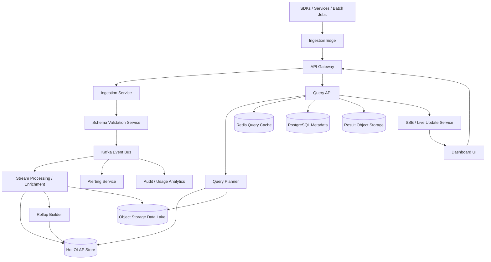
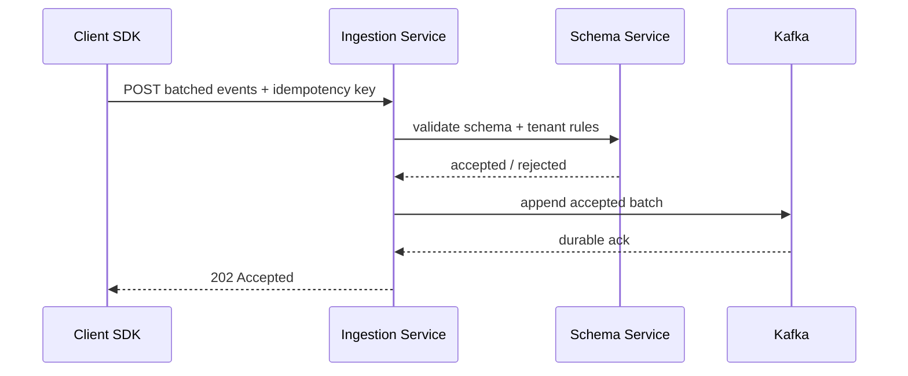
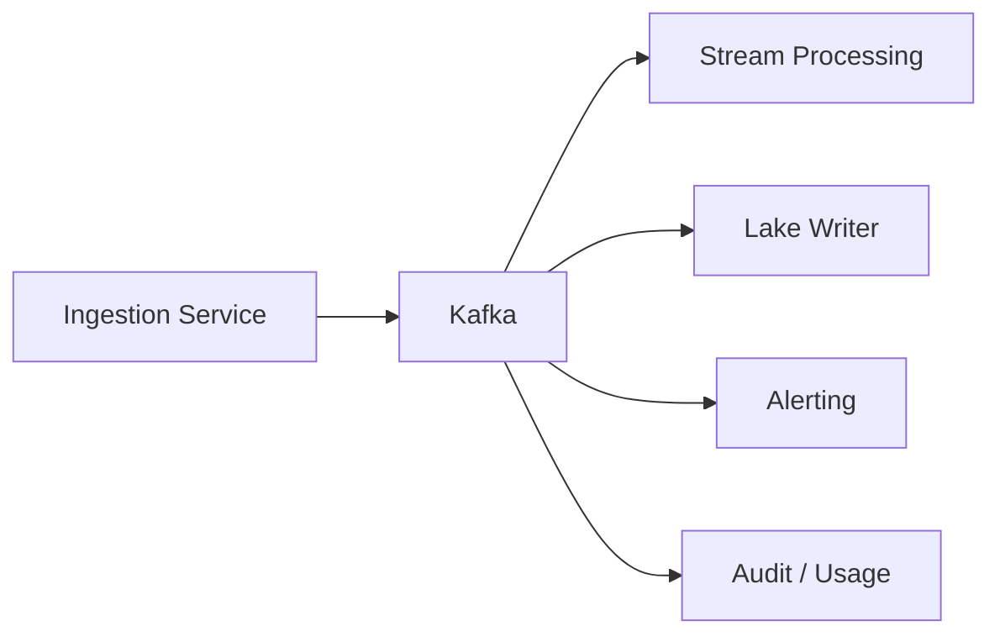
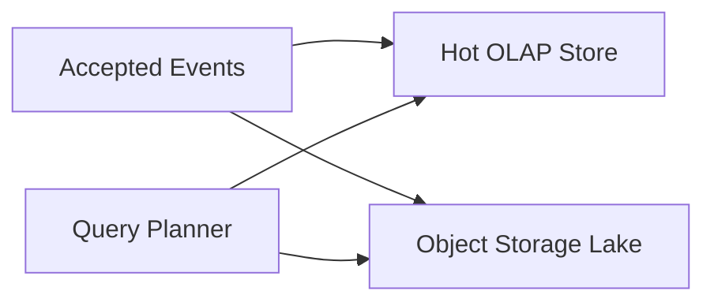
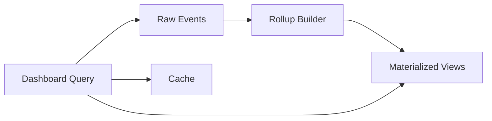
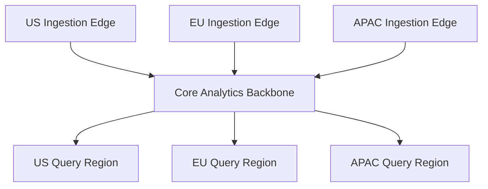

# Design Analytics Platform

Designing an analytics platform is a classic system design interview problem because it combines extremely high write throughput with low-latency analytical queries, dashboards, alerting, and long-term data retention. Product teams want event-level visibility into user behavior, funnels, retention, feature adoption, and revenue. Data teams want durable raw events, replayable pipelines, and trustworthy derived metrics. The hard part is that ingestion is append-heavy and bursty, while query workloads are filter-heavy, scan-heavy, and latency-sensitive.

At a high level, the system has three different workloads. The first is the **ingestion path**, where SDKs, services, and ETL jobs push large batches of events into the platform continuously. The second is the **processing path**, where events are validated, enriched, deduplicated, sessionized, and rolled up into derived metrics. The third is the **query path**, where dashboards, ad hoc explorations, alerts, and exports need fast answers over recent and historical data. A good design keeps ingestion cheap and durable, makes processing replayable, and serves queries from storage that is optimized for analytical scans rather than transactional reads.

---

## Functional Requirements

**In Scope:**
- Clients can ingest product, marketing, and backend events through SDKs, HTTP APIs, or batch imports
- Teams can define schemas, event properties, dimensions, metrics, and derived measures
- Users can run ad hoc analytical queries with filters, group-bys, time windows, and aggregations
- The platform can power dashboards for funnels, retention, cohort analysis, and time-series monitoring
- Users can configure alerts when derived metrics cross thresholds or anomalies are detected
- The system stores raw events durably and supports reprocessing or backfilling derived datasets
- Teams can export raw or aggregated data to downstream warehouses or object storage
- Operators can inspect ingestion lag, query latency, hot tenants, schema violations, and pipeline health

**Out of Scope:**
- Full spreadsheet-style BI modeling and semantic layers comparable to a complete enterprise BI suite
- Arbitrary machine-learning training pipelines and feature store internals
- Deep data-governance workflow tooling such as legal approval chains or catalog authoring systems
- Full log management for every infrastructure log use case
- End-to-end customer-data-platform identity graph complexity beyond the core analytics join model

---

## Non-Functional Requirements

| Property | Target | Reasoning |
|---|---|---|
| **Ingestion Latency** | p99 < 100ms at the ingestion edge before durable enqueue | clients expect event tracking to be lightweight and non-blocking |
| **Freshness** | streaming dashboards updated within 30 to 60 seconds for hot metrics | analytics loses value quickly if dashboards lag far behind reality |
| **Query Latency** | p95 < 2s for common dashboard queries; slower for large ad hoc scans | interactive exploration breaks down if every query becomes a long batch job |
| **Durability** | no event loss after an ingest request is acknowledged | analytics correctness depends on reliable append semantics |
| **Scalability** | tens of billions of events/day and large bursty tenants | product launches, ad campaigns, and scheduled jobs create strong spikes |
| **Isolation** | one noisy tenant or query should not degrade the whole platform | multi-tenant analytics platforms naturally create skewed workloads |
| **Retention** | hot recent data quickly queryable; cold historical data retained cheaply | recent analytics and long-term history have very different cost profiles |
| **Reprocessability** | the system must support backfills after schema, logic, or bug fixes | derived metrics change over time and pipelines must be replayable |

**Key tradeoff:** the platform prioritizes **durable, high-throughput append ingestion** and **fast low-latency analytical reads for hot data**, while accepting that very large historical scans, complex joins, or backfills may run more slowly on colder storage.

---

## Capacity Estimation

**Traffic assumptions:**
- Assume the platform ingests **20B events/day** across web SDKs, mobile SDKs, backend services, and batch imports
- That is roughly **230K events/sec average**, but real systems often see **10x peak bursts**, so the ingestion plane should tolerate **2M+ events/sec** during campaigns, launches, or delayed client flushes
- Events arrive in batches rather than one at a time, so the edge must optimize for compressed batched writes and cheap acknowledgements

**Event size assumptions:**
- Assume an average compressed event payload of about **800 bytes to 1.5KB** after metadata, dimensions, and identity fields
- At **20B events/day**, raw ingest volume can easily exceed **16TB to 30TB/day** before replication and indexes
- Retention multiplies this quickly, so the system should distinguish hot analytical storage from cheap cold storage early in the design

**Query assumptions:**
- Assume **5M dashboard queries/day** plus a smaller number of expensive ad hoc explorations and export jobs
- Dashboard traffic is read-heavy but repetitive, so caching and materialized rollups matter a lot
- Ad hoc queries are lower volume but can be much more expensive because they scan wide time ranges and high-cardinality dimensions

**Operational profile:**
- Tenant traffic is heavily skewed; one large customer can contribute more load than thousands of small tenants combined
- Late events, backfills, and schema changes create reprocessing pressure that is separate from normal ingest traffic
- Query hotspots typically cluster around recent time windows, top-level business metrics, and executive dashboards

---

## Core Entities

| Entity | Purpose | Key Fields | Relationships |
|---|---|---|---|
| **Tenant** | Multi-tenant boundary for data, billing, and quotas | `tenant_id`, `name`, `plan_tier`, `status` | owns event streams, users, metrics, and dashboards |
| **IngestionKey** | Authenticated write credential for SDKs and services | `key_id`, `tenant_id`, `source_type`, `status` | belongs to one tenant |
| **Event** | Immutable analytics record | `event_id`, `tenant_id`, `event_name`, `event_time`, `received_at`, `properties` | tied to user identity, session, and dimensions |
| **IdentityProfile** | Canonical analytics subject | `profile_id`, `tenant_id`, `user_key`, `traits` | links many events across devices or sessions |
| **Session** | Time-bounded user activity grouping | `session_id`, `tenant_id`, `profile_id`, `started_at`, `ended_at` | groups related events |
| **SchemaDefinition** | Event contract and validation rules | `schema_id`, `tenant_id`, `event_name`, `property_rules`, `version` | applied during ingestion and processing |
| **MetricDefinition** | Named derived measure | `metric_id`, `tenant_id`, `formula`, `dimensions`, `refresh_mode` | powers dashboards and alerts |
| **Dashboard** | Saved analytical view | `dashboard_id`, `tenant_id`, `title`, `widget_config` | references many metrics or saved queries |
| **QueryJob** | Submitted ad hoc analytical request | `query_id`, `tenant_id`, `status`, `time_range`, `query_spec` | reads from hot or cold storage |
| **RollupTable** | Pre-aggregated dataset for low-latency dashboards | `rollup_id`, `tenant_id`, `grain`, `dimensions`, `window` | derived from raw events |

**Critical modeling decisions:**
- `Event` is immutable and append-only. Corrections are usually expressed as compensating events or reprocessing, not in-place updates.
- `MetricDefinition` is separate from the raw event stream. This allows derived logic to evolve without mutating source events.
- `QueryJob` is distinct from dashboards because many exploratory queries are one-off and may require asynchronous execution or export workflows.

---

## Databases and Database Design

### Storage Tier Decisions

| Data | Access Pattern | Engine | Why |
|---|---|---|---|
| Tenants, users, ingestion keys, schemas, dashboards, metric metadata, query metadata | transactional writes, exact reads, authorization checks | **PostgreSQL / MySQL** | the control plane needs strong consistency and rich indexing |
| Event ingestion backbone, streaming fanout, backpressure buffers | durable append-only log | **Kafka** | ideal for high-throughput event ingestion, replay, and decoupling |
| Hot analytical queries over recent and medium-term data | scan-heavy aggregates, group-bys, filtering | **ClickHouse / Apache Pinot / Druid** | columnar OLAP storage is optimized for analytical workloads |
| Long-term raw events and cold history | cheap append, partitioned files, replay and backfills | **Object Storage + Iceberg / Delta Lake** | low-cost durable retention and reprocessing layer |
| Query cache, metadata cache, live dashboard cache, rate limits | sub-millisecond reads/writes, TTLs, hot keys | **Redis** | accelerates repetitive dashboard and metadata access |
| Query and export artifacts | large immutable result blobs | **Object Storage + CDN** | exports and cached results should not sit in transactional databases |

This is intentionally polyglot. An analytics platform needs **durable streaming ingest**, **transactional control-plane metadata**, **fast hot OLAP reads**, **cheap long-term retention**, and **ephemeral caching**. One database cannot optimize for all of those workloads at once.

### Schema 1 - Tenants and Ingestion Keys (SQL)

```sql
CREATE TABLE tenants (
  tenant_id                  UUID PRIMARY KEY DEFAULT gen_random_uuid(),
  name                       VARCHAR(255) NOT NULL,
  plan_tier                  VARCHAR(32) NOT NULL,
  status                     VARCHAR(16) NOT NULL,
  created_at                 TIMESTAMPTZ DEFAULT NOW()
);

CREATE TABLE ingestion_keys (
  key_id                     UUID PRIMARY KEY DEFAULT gen_random_uuid(),
  tenant_id                  UUID NOT NULL REFERENCES tenants(tenant_id),
  public_key                 TEXT NOT NULL UNIQUE,
  source_type                VARCHAR(32) NOT NULL,
  status                     VARCHAR(16) NOT NULL,
  created_at                 TIMESTAMPTZ DEFAULT NOW()
);
```

### Schema 2 - Metric and Dashboard Metadata (SQL)

```sql
CREATE TABLE metric_definitions (
  metric_id                  UUID PRIMARY KEY DEFAULT gen_random_uuid(),
  tenant_id                  UUID NOT NULL REFERENCES tenants(tenant_id),
  name                       VARCHAR(255) NOT NULL,
  formula_json               JSONB NOT NULL,
  refresh_mode               VARCHAR(16) NOT NULL,
  created_by                 UUID NOT NULL,
  created_at                 TIMESTAMPTZ DEFAULT NOW()
);

CREATE TABLE dashboards (
  dashboard_id               UUID PRIMARY KEY DEFAULT gen_random_uuid(),
  tenant_id                  UUID NOT NULL REFERENCES tenants(tenant_id),
  title                      VARCHAR(255) NOT NULL,
  widget_config_json         JSONB NOT NULL,
  created_by                 UUID NOT NULL,
  updated_at                 TIMESTAMPTZ DEFAULT NOW()
);
```

### Schema 3 - Query Jobs (SQL)

```sql
CREATE TABLE query_jobs (
  query_id                   UUID PRIMARY KEY DEFAULT gen_random_uuid(),
  tenant_id                  UUID NOT NULL REFERENCES tenants(tenant_id),
  requested_by               UUID NOT NULL,
  status                     VARCHAR(24) NOT NULL,
  time_range_start           TIMESTAMPTZ NOT NULL,
  time_range_end             TIMESTAMPTZ NOT NULL,
  query_spec_json            JSONB NOT NULL,
  result_ref                 TEXT,
  created_at                 TIMESTAMPTZ DEFAULT NOW(),
  finished_at                TIMESTAMPTZ
);
```

### Schema 4 - Hot Events Table (ClickHouse)

```sql
CREATE TABLE events_hot (
  tenant_id                  UUID,
  event_date                 Date,
  event_time                 DateTime,
  event_id                   UUID,
  profile_id                 UUID,
  session_id                 UUID,
  event_name                 LowCardinality(String),
  properties_json            String,
  received_at                DateTime
) ENGINE = MergeTree
PARTITION BY (tenant_id, event_date)
ORDER BY (tenant_id, event_name, event_time, event_id);
```

### Schema 5 - Hourly Metric Rollups (ClickHouse)

```sql
CREATE TABLE metric_rollups_hourly (
  tenant_id                  UUID,
  bucket_start               DateTime,
  metric_id                  UUID,
  dimension_key              String,
  value_sum                  Float64,
  value_count                UInt64,
  unique_users_hll           String
) ENGINE = SummingMergeTree
PARTITION BY toDate(bucket_start)
ORDER BY (tenant_id, metric_id, bucket_start, dimension_key);
```

### Schema 6 - Raw Event Lake Manifest (Object Storage JSON)

```json
{
  "tenant_id": "tenant_123",
  "partition": "dt=2026-06-03/hour=10",
  "source": "sdk-web",
  "files": [
    "s3://analytics-lake/raw/tenant_123/dt=2026-06-03/hour=10/part-001.parquet"
  ],
  "record_count": 1250000,
  "schema_version": 7
}
```

### Schema 7 - Query Cache Entry (Logical Redis Record)

```json
{
  "key": "query:tenant_123:sha256:abcd1234",
  "value": {
    "result_ref": "s3://analytics-results/query_777.json.gz",
    "expires_at": "2026-06-03T10:10:00Z",
    "row_count": 240
  }
}
```

### Sharding and Replication Strategy

| Store | Shard Key | Strategy | Replication |
|---|---|---|---|
| SQL control plane | `tenant_id` | logical tenant shards as account count grows | primary + replicas |
| Kafka | `tenant_id` or `event_name` depending on topic | partitioned durable event log with balanced hot-tenant handling | RF=3 |
| OLAP hot store | `tenant_id`, `event_date`, and local sort keys | distributed columnar shards with replicas | replicated OLAP cluster |
| Object Storage lake | `tenant_id/dt/hour` partition layout | immutable partitioned Parquet files | multi-AZ durable object storage |
| Redis | `tenant_id`, query hash, dashboard id | Redis Cluster with hot-dashboard isolation | 1 replica per master |
| Result storage | `tenant_id/query_id` namespace | object storage prefixes and lifecycle policies | multi-AZ durable storage |

**Consistency model:**
- Strong consistency for tenant metadata, access control, schema configuration, and saved dashboard definitions
- Durable ordered append for ingestion once events enter Kafka
- Eventual consistency for rollups, live dashboards, alerts, and materialized views
- Best-effort low-latency consistency for dashboard caches and live update streams

**Read/write patterns:**
- **Ingestion path:** batched events -> validation -> durable Kafka append -> asynchronous enrich, dedup, and hot/cold writes
- **Streaming analytics path:** Kafka -> stream processor -> rollups and derived metrics -> low-latency dashboards and alerts
- **Ad hoc query path:** query planner -> hot OLAP store and, if needed, lakehouse scan -> result materialization -> cache or export

---

## API Design

**Ingest an event batch:**
```http
POST /v1/events/batch
Authorization: Bearer <ingestion-key>
Idempotency-Key: batch-001

{
  "tenant_id": "tenant_123",
  "source": "sdk-web",
  "events": [
    {
      "event_id": "evt_001",
      "event_name": "checkout_started",
      "event_time": "2026-06-03T10:00:00Z",
      "profile_id": "usr_999",
      "properties": {
        "plan": "pro",
        "country": "IN"
      }
    }
  ]
}

202 Accepted
{
  "request_id": "ing_777",
  "accepted": 1,
  "rejected": 0,
  "status": "queued"
}
```

**Create a metric definition:**
```http
POST /v1/metrics
Authorization: Bearer <jwt>

{
  "tenant_id": "tenant_123",
  "name": "checkout_conversion_rate",
  "formula": {
    "type": "ratio",
    "numerator": "purchase_completed",
    "denominator": "checkout_started"
  },
  "dimensions": ["country", "plan"]
}

201 Created
{
  "metric_id": "met_123",
  "name": "checkout_conversion_rate",
  "refresh_mode": "streaming"
}
```

**Run an ad hoc query:**
```http
POST /v1/query-jobs
Authorization: Bearer <jwt>
Idempotency-Key: query-001

{
  "tenant_id": "tenant_123",
  "time_range": {
    "start": "2026-06-01T00:00:00Z",
    "end": "2026-06-03T00:00:00Z"
  },
  "dimensions": ["country"],
  "measures": ["unique_users", "purchase_completed"],
  "filters": [
    {
      "field": "plan",
      "op": "eq",
      "value": "pro"
    }
  ]
}

202 Accepted
{
  "query_id": "qry_999",
  "status": "running"
}
```

**Fetch query results (cursor-paginated):**
```http
GET /v1/query-jobs/qry_999/results?cursor=row_100&limit=100
Authorization: Bearer <jwt>

200 OK
{
  "query_id": "qry_999",
  "status": "completed",
  "rows": [
    {
      "country": "IN",
      "unique_users": 18220,
      "purchase_completed": 915
    }
  ],
  "next_cursor": "row_200",
  "has_more": true
}
```

> Cursor-based pagination on result row offsets or materialized chunk ids is preferred. Offset pagination (`?page=N`) becomes unstable and expensive for large analytical result sets and distributed scans.

**Create a dashboard:**
```http
POST /v1/dashboards
Authorization: Bearer <jwt>

{
  "tenant_id": "tenant_123",
  "title": "Growth Overview",
  "widgets": [
    {
      "metric_id": "met_123",
      "visualization": "timeseries"
    }
  ]
}

201 Created
{
  "dashboard_id": "dash_555",
  "title": "Growth Overview"
}
```

**Create an export:**
```http
POST /v1/exports
Authorization: Bearer <jwt>

{
  "tenant_id": "tenant_123",
  "source": "raw_events",
  "time_range": {
    "start": "2026-06-01T00:00:00Z",
    "end": "2026-06-02T00:00:00Z"
  },
  "format": "parquet"
}

202 Accepted
{
  "export_id": "exp_222",
  "status": "queued"
}
```

**Live dashboard stream (optional SSE):**
```http
GET /v1/dashboards/dash_555/stream
Authorization: Bearer <jwt>
Accept: text/event-stream
```
The core analytics platform does not require WebSockets for most workflows. REST is a good fit for ingestion configuration, query submission, and historical dashboard reads. SSE is usually enough for live dashboard refreshes and alert streams.

---

## High-Level Design



**Component responsibilities:**

| Component | Role |
|---|---|
| **API Gateway** | Authentication, rate limiting, request validation, and tenant routing |
| **Ingestion Service** | Accepts batched events, normalizes payloads, and acknowledges after durable enqueue |
| **Schema Validation Service** | Applies tenant schema rules, rejects malformed events, and tags schema versions |
| **Kafka** | Durable append-only ingestion backbone and replay buffer |
| **Stream Processing / Enrichment** | Deduplicates, enriches, sessionizes, and computes low-latency derived events |
| **Rollup Builder** | Maintains pre-aggregated metrics for fast dashboard queries |
| **Hot OLAP Store** | Serves recent and medium-term analytical queries with low latency |
| **Object Storage Data Lake** | Retains raw events and supports replay, backfills, and cheap long-term storage |
| **Query API / Planner** | Parses analytical queries, selects hot or cold paths, and materializes results |
| **Redis Query Cache** | Caches repetitive dashboard and query results for hot workloads |
| **PostgreSQL Metadata** | Stores tenants, metrics, dashboards, schemas, and query metadata |
| **Alerting Service** | Triggers threshold or anomaly-based notifications from streaming metrics |

**Ingestion and query flow:**
1. SDKs or services batch events and send them to the Ingestion Service through the API Gateway
2. The platform authenticates the tenant, validates schemas, and appends accepted events durably to Kafka
3. Stream processors enrich, deduplicate, and route events to both the hot OLAP store and the long-term lake
4. Rollup builders maintain pre-aggregated datasets for common dashboard metrics and alert conditions
5. Query API receives dashboard or ad hoc requests and chooses between cache, rollups, hot OLAP scans, or colder lake queries
6. Live dashboards can receive incremental refreshes through SSE, while historical dashboards and exports use standard REST flows

---

## Deep Dives

### 1. Ingestion: High Throughput and Idempotency Come First

The first hard problem in an analytics platform is ingestion. Clients emit events continuously, often in bursts after reconnects or mobile flush intervals. If the edge path is too heavy, it slows product traffic. If it is too weak, the platform loses or duplicates events under retries.



**Why the problem happens:** analytics traffic is high volume, bursty, and retry-heavy.

**Why it becomes difficult at scale:**
- mobile and browser SDKs often buffer and flush many events together
- network retries can produce duplicates if the platform has weak idempotency handling
- validation must be fast enough not to become the ingestion bottleneck

**Production-grade solutions:**
- require batched compressed writes from SDKs whenever possible
- acknowledge only after durable enqueue into Kafka or an equivalent append log
- use `event_id` and batch-level idempotency keys to deduplicate safely
- push expensive enrichment off the synchronous edge path

**Tradeoffs:** stronger validation and deduplication improve downstream trust, but too much synchronous work at ingest can damage write throughput.

### 2. Kafka: Required and Central

Kafka is usually central in an analytics platform because it cleanly separates acceptance of writes from downstream processing. Without a durable event log, stream processors, rollup builders, alerting, and lake writers would all need to keep up with the ingest edge directly, which is fragile and hard to replay.



**Why the problem happens:** one accepted event often feeds many downstream consumers with different SLAs.

**Why it becomes difficult at scale:**
- downstream systems such as OLAP writers or alerting can lag independently
- reprocessing is unavoidable after schema changes, bug fixes, or new metrics
- spikes can overwhelm direct fanout architectures if no durable buffer exists

**Production-grade solutions:**
- publish accepted events to Kafka immediately after light validation
- partition topics by `tenant_id`, event family, or another ordering-aware key
- keep enough retention in Kafka to recover short outages and replay recent pipelines
- use downstream consumers for enrichment, rollups, alerts, and lake writes rather than coupling them to ingest

**Tradeoffs:** Kafka adds operational complexity, but without it the platform becomes difficult to replay, scale, and isolate under pressure.

### 3. Hot Store Versus Cold Lake: One Tier Is Not Enough

Analytics users want both fast recent dashboards and long historical retention. A single hot analytical store for years of data becomes expensive. A single cold lake for every interactive query becomes too slow. The standard solution is a tiered architecture: hot OLAP for recent and popular workloads, plus object storage lakehouse for cheap history and backfills.



**Why the problem happens:** recent analytics and historical retention have completely different performance and cost profiles.

**Why it becomes difficult at scale:**
- hot scans want compressed columnar indexes and aggressive local storage
- cold history can span petabytes and must be stored cheaply
- users still expect a unified query experience over both tiers

**Production-grade solutions:**
- keep recent and commonly queried data in a columnar OLAP cluster
- write raw immutable event partitions to object storage in Parquet or a lakehouse table format
- use a query planner that can route to hot, cold, or mixed execution paths
- backfill or repopulate hot rollups from the lake when logic changes

**Tradeoffs:** tiered storage keeps cost under control, but it complicates query planning, freshness guarantees, and backfill operations.

### 4. Event Time, Late Events, and Backfills

Analytics correctness is rarely just about arrival order. Events may be delayed by offline mobile devices, queue retries, or third-party imports. If the platform aggregates only by `received_at`, daily metrics and retention curves become wrong. The system has to reason about both event time and processing time.

**Why the problem happens:** real user activity and network delivery are not synchronized.

**Why it becomes difficult at scale:**
- late events can update past windows long after dashboards were first computed
- some pipelines want near-real-time metrics while others need exact corrected history
- backfills can compete with live traffic for the same storage and compute resources

**Production-grade solutions:**
- store both `event_time` and `received_at` on every event
- use watermarks or bounded lateness windows in stream processing for live metrics
- support background correction jobs that recompute historical partitions when necessary
- clearly expose freshness and correction semantics in the product so users know what is provisional versus finalized

**Tradeoffs:** strict event-time correctness improves trust, but it makes streaming rollups and dashboard freshness more complex.

### 5. Query Serving: Pre-Aggregations Matter More Than Raw Scan Power

Dashboard traffic is repetitive. The same top-level metrics are queried over and over by executives, product managers, and alerting systems. If every request scans raw events from scratch, query cost and tail latency become unacceptable. Pre-aggregations, materialized views, and sketches are what make interactive analytics work at scale.



**Why the problem happens:** business dashboards are repetitive, but raw data volumes are enormous.

**Why it becomes difficult at scale:**
- high-cardinality dimensions such as user ids or URLs make naive grouping expensive
- unique-user queries are especially costly if recomputed exactly each time
- ad hoc exploration still needs flexibility beyond a fixed dashboard set

**Production-grade solutions:**
- maintain hourly and daily rollups for common dimensions and time windows
- use approximate sketches such as HyperLogLog when exact distinct counts are too expensive for interactive workloads
- route common dashboard queries to materialized views first
- fall back to raw scans only for truly exploratory or long-tail queries

**Tradeoffs:** aggressive pre-aggregation improves latency dramatically, but it increases pipeline complexity and may constrain some exploratory queries.

### 6. Redis: Useful for Caching, Not for Truth

Redis is helpful in analytics platforms, but it should remain a cache and coordination layer rather than the source of truth. Dashboard definitions, metadata, and repeated query results are good cache targets. Raw events, metric correctness, and long-term rollups are not.

| Redis Use | Example Key | Why Redis Fits |
|---|---|---|
| **Dashboard result cache** | `dash:tenant_123:dash_555:window_1h` | top dashboards are repeatedly queried with the same filters |
| **Query cache** | `query:tenant_123:sha256:abcd1234` | repeated ad hoc queries can avoid recomputation for a short TTL |
| **Metadata cache** | `metric:tenant_123:met_123` | metric definitions are read far more often than written |
| **Rate limiting** | `rl:tenant:tenant_123:query` | prevents noisy tenants from overwhelming query clusters |

**Why the problem happens:** many analytical reads are repetitive and tolerate short-lived caching.

**Why it becomes difficult at scale:**
- hot dashboards can create key hotspots
- stale cached results can confuse users if freshness semantics are unclear
- Redis can become expensive if it is used to cache very large result sets indiscriminately

**Production-grade solutions:**
- cache only popular small-to-medium result sets with explicit TTLs
- invalidate cache entries on schema or dashboard definition changes when necessary
- keep canonical event and rollup truth in OLAP stores and the lake
- rate limit expensive query patterns before they overload analytical backends

**Tradeoffs:** Redis improves tail latency and cluster efficiency, but over-caching can hide freshness issues and waste memory.

### 7. WebSockets: Usually Optional for Core Analytics

Most analytics workflows are request-response: ingest configuration, dashboard fetches, exports, schema updates, and saved queries. Live dashboards may benefit from push-based incremental refresh, but the core platform does not require WebSockets. SSE is often enough for lightweight live updates and alerts.

**Why the problem happens:** dashboards feel live, but the underlying analytical workflow is mostly pull-based.

**Why it becomes difficult at scale:**
- persistent connections add memory and routing cost without helping most reads
- live dashboards are usually a small subset of total product usage
- backpressure matters if many widgets refresh simultaneously during spikes

**Production-grade solutions:**
- keep ingestion, query submission, and historical reads on REST APIs
- use SSE for live metric updates and alert streams when needed
- reserve WebSockets only for richer collaborative or bidirectional analytical experiences if the product truly needs them
- keep live updates incremental rather than rerendering full dashboards constantly

**Tradeoffs:** avoiding WebSockets simplifies the platform, but some ultra-live observability experiences may need a stronger streaming channel.

### 8. Multi-Tenant Isolation and Hot Tenants

Multi-tenant analytics platforms almost always face skew. One enterprise tenant may send hundreds of thousands of events per second or run extremely expensive exploratory queries. Without isolation, a single tenant can degrade ingestion, storage compaction, or query latency for everyone else.

**Why the problem happens:** tenant sizes and usage patterns vary enormously.

**Why it becomes difficult at scale:**
- ingestion spikes and query spikes are often not correlated, so capacity planning is tricky
- a tenant can be quiet most of the day and suddenly burst because of a campaign or backfill
- high-cardinality dimensions or unbounded query windows create pathological scans

**Production-grade solutions:**
- partition Kafka and analytical storage so large tenants can be isolated cleanly
- enforce per-tenant quotas, concurrency limits, and export caps
- prioritize dashboard traffic over very expensive ad hoc jobs when clusters are busy
- route exceptional heavy tenants to dedicated infrastructure when they outgrow the shared pool

**Tradeoffs:** strong tenant isolation improves platform stability, but it adds scheduling, billing, and operational complexity.

### 9. Multi-Region Serving and Data Locality

Analytics platforms often serve global products, but data locality, privacy rules, and cost constraints make multi-region design tricky. Ingestion should be close to event sources to reduce latency and reduce cross-region bandwidth. Query planes often need regional routing, while retention and processing may still use a smaller number of core regions.



**Why the problem happens:** global event producers and regional compliance requirements pull the system in different directions.

**Why it becomes difficult at scale:**
- cross-region traffic is expensive at analytics volumes
- some tenants may require regional data residency for raw events
- backfills and query federation across regions can become slow and operationally complex

**Production-grade solutions:**
- terminate ingestion in regional edges and replicate or route into the right processing region
- keep tenant-level data residency and retention policies explicit in metadata
- replicate only derived or aggregated datasets globally when that is enough for user-facing dashboards
- use region-aware query routing so users hit the closest legal and warm read path

**Tradeoffs:** broader replication improves user latency and failover, but it increases storage cost and compliance complexity.

### 10. Architecture Evolution

| Stage | Design | Why It Breaks | Next Step |
|---|---|---|---|
| **1. MVP** | Single database plus background jobs for basic event counts and dashboards | write throughput, historical scans, and reprocessing quickly become painful | add Kafka, hot OLAP storage, and a separate metadata database |
| **2. Growth** | Dedicated ingest service, Kafka, stream processors, and a columnar store | hot tenants, backfills, and query skew create instability | add tiered storage, rollups, caches, and tenant isolation |
| **3. Scale** | Hot OLAP plus lakehouse, query planner, streaming alerts, and export pipeline | operational complexity shifts to freshness guarantees, cost, and multi-region control | regionalize ingest, isolate heavy tenants, and harden replay workflows |
| **4. Mature Platform** | Tiered storage, strong replayability, query caching, and policy-aware multi-region deployment | the hard part becomes governance, product semantics, and cost optimization rather than just throughput | keep ingestion durable and simple while evolving derived systems independently |

This is the interview pattern to emphasize: ingest events durably through Kafka, keep metadata transactional, split hot analytical reads from cheap long-term storage, pre-aggregate aggressively for dashboard latency, and design every downstream computation so it can be replayed safely when logic changes.
