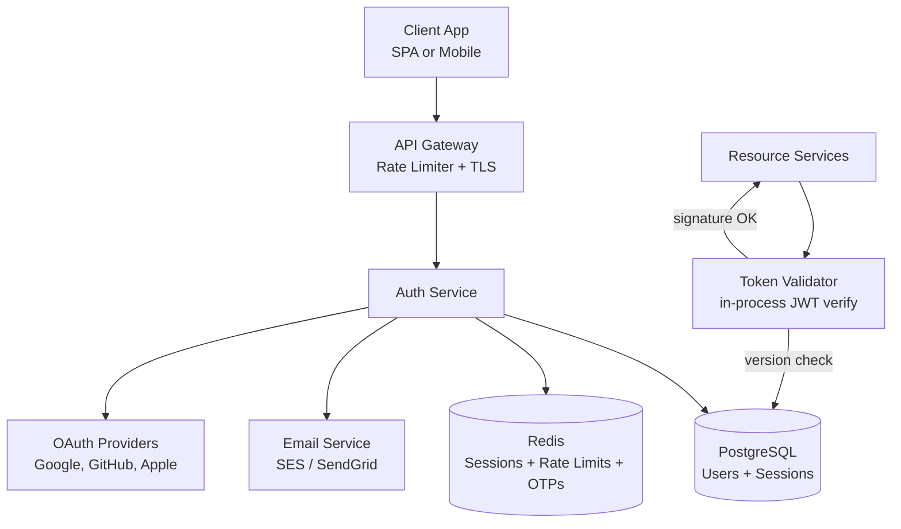
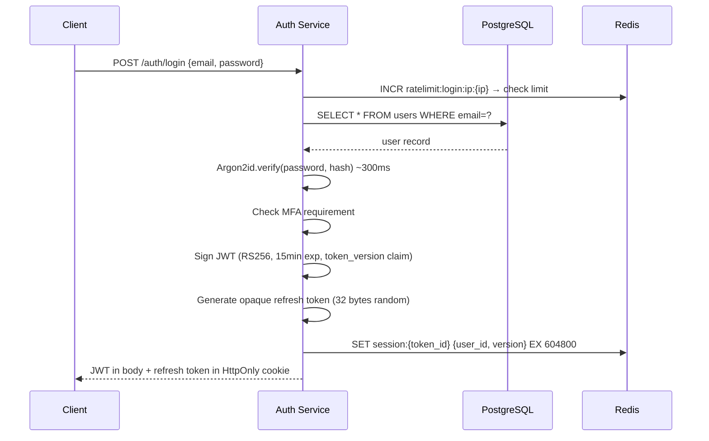
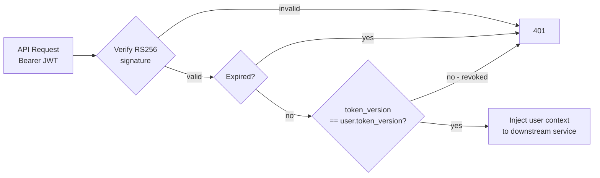
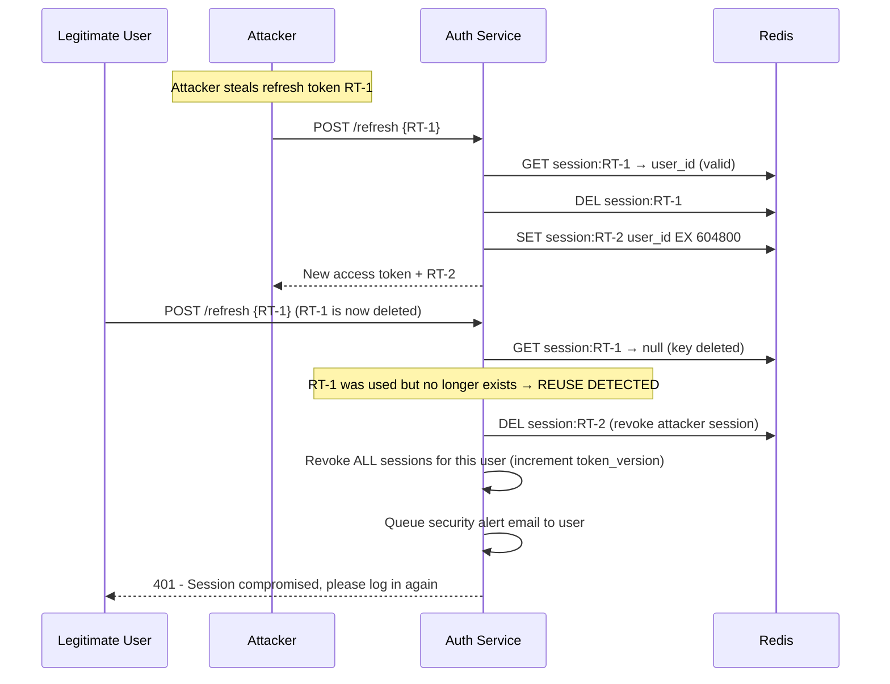
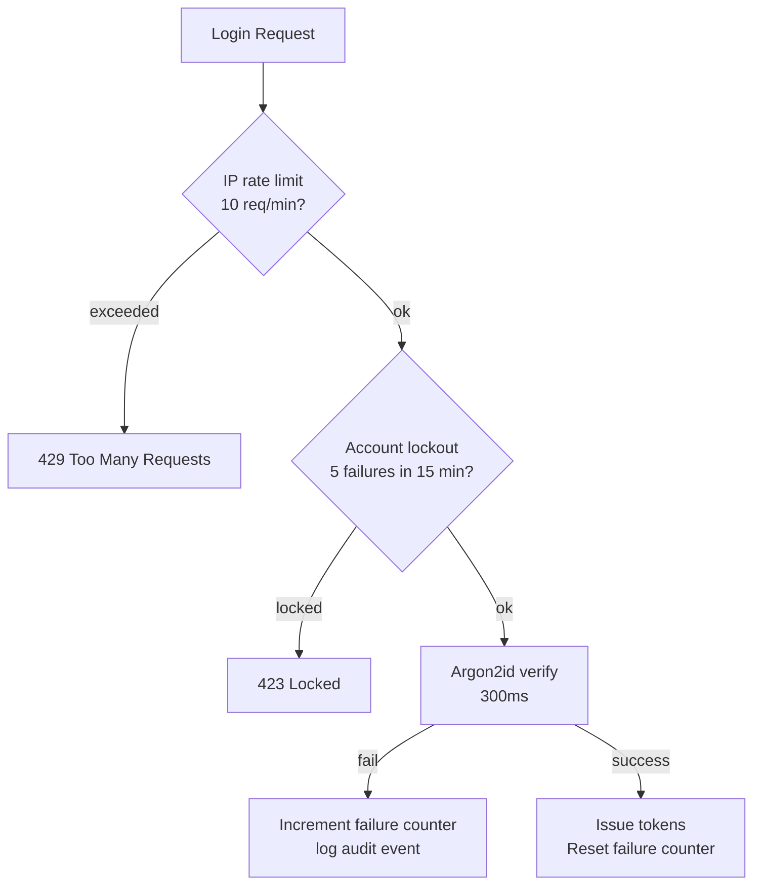
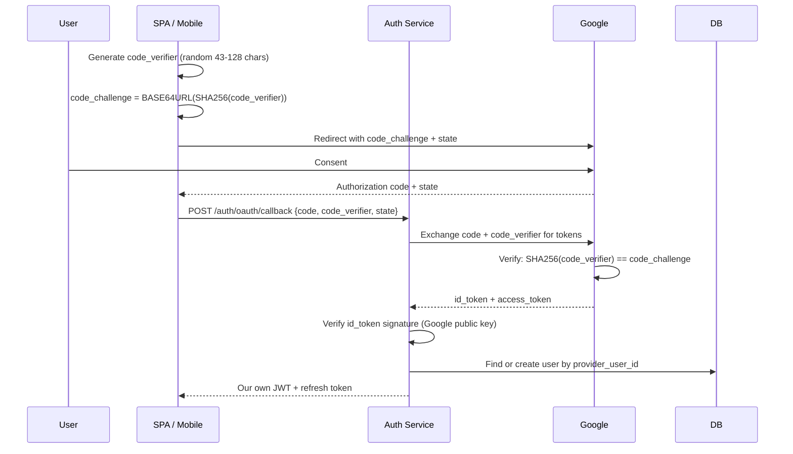

# Design an Authentication System

Authentication is the gateway to every feature your product offers — it answers the question "who are you?" before any other system can answer "what can you do?" It's asked in FAANG interviews because it sits at the intersection of security, scalability, and correctness. A wrong decision here doesn't just break a feature; it hands attackers the keys to your users' accounts.

The hard problems: how do you validate identity on every single API request without a database round trip? How do you revoke a stateless JWT? How do you detect that a refresh token was stolen? How do you survive 50K logins per second without your auth service becoming the bottleneck?

---

## Functional Requirements

**In Scope:**
- **Registration:** Create an account with email and password
- **Login:** Authenticate with email/password; return access + refresh tokens
- **Token refresh:** Exchange a valid refresh token for a new access/refresh token pair
- **Logout:** Invalidate the current session (revoke refresh token)
- **OAuth 2.0 / Social login:** "Sign in with Google / GitHub / Apple"
- **Multi-Factor Authentication (MFA):** TOTP-based 2FA enrollment and challenge
- **Password reset:** Initiate reset via email; consume a one-time reset link
- **Token introspection:** Resource services can verify an access token's validity

**Out of Scope:**
- Authorization (RBAC, ABAC, permissions) — auth*n* and auth*z* are separate systems
- User profile management (name, avatar, preferences)
- Account federation and SCIM provisioning (enterprise SSO directory sync)
- Biometric authentication (device-native; handled by platform, not backend)

---

## Non-Functional Requirements

| Property | Target | Reasoning |
|---|---|---|
| **Login Latency** | p99 < 150ms | Users are actively waiting; auth blocks every user session start |
| **Token Validation** | p99 < 5ms | Happens on every single API request across every service |
| **Availability** | 99.999% | Auth down = entire product down; no fallback possible |
| **Security** | Zero plaintext credentials stored; token compromise blast radius bounded | Non-negotiable; regulatory and user trust requirement |
| **Throughput** | 50K logins/sec peak; 5M token validations/sec | Global platform at peak; token validation is 100× more frequent than login |
| **Scalability** | Stateless token validation (no DB call per request) | At 5M validations/sec, a DB lookup per request is impossible |

**Key tradeoff:** The fundamental tension in auth system design is **stateless tokens** (JWTs — fast validation, no DB call, but hard to revoke) vs. **stateful tokens** (opaque tokens — instant revocation, but every validation needs a Redis lookup). The production answer is neither extreme: **short-lived JWTs + long-lived opaque refresh tokens in Redis** gives you fast validation with bounded revocation lag.

---

## Capacity Estimation

**Login events:**
- 200M registered users × 2 logins/day = 400M logins/day → **~4,600 logins/sec average; 50K/sec peak**

**Token validations:**
- Every API request validates the JWT locally (no network call if using asymmetric signing)
- 5M active users × 10 API calls/min = **~833K validations/sec** — handled in-process by resource services, not by the auth service

**Storage:**
- User records: 200M × 500 bytes = **~100 GB** — fits comfortably in a sharded PostgreSQL cluster
- Active refresh tokens (Redis): 200M users × 1 active session = 200M entries × 150 bytes = **~30 GB** — fits in a Redis cluster
- Password hashes: Argon2id output is 64 bytes + salt 32 bytes = 96 bytes/user — negligible

**Brute force rate limiting:**
- 50K login attempts/sec; 99% legitimate → ~500 malicious/sec
- Rate limiting is per-IP and per-account; Redis counters handle this at < 1ms per check

---

## Core Entities

| Entity | Purpose | Key Fields |
|---|---|---|
| **User** | Registered account with credentials | `user_id`, `email`, `password_hash`, `mfa_enabled`, `token_version`, `status` (active/locked/deleted), `created_at` |
| **Session** | A valid login session tied to a refresh token | `session_id`, `user_id`, `refresh_token_hash`, `device_info`, `ip_address`, `created_at`, `expires_at`, `revoked_at` |
| **OAuthIdentity** | A linked third-party identity (Google, GitHub) | `identity_id`, `user_id`, `provider`, `provider_user_id`, `provider_email`, `created_at` |
| **MFADevice** | An enrolled MFA method (TOTP authenticator app) | `device_id`, `user_id`, `type` (totp/sms), `encrypted_secret`, `created_at`, `last_used_at` |
| **AuditEvent** | Immutable log of auth events for security review | `event_id`, `type` (login/logout/password_reset/mfa_enroll), `user_id`, `ip`, `user_agent`, `success`, `timestamp` |

**Key design note:** `token_version` on the `User` entity is critical for bulk session revocation. When a user resets their password or requests "log out all devices," this version is incremented. JWTs carry this version in a claim and must match the current DB version — instant revocation without a token blacklist.

---

## Databases and Database Design

### Storage Tier Decisions

| Data | Access Pattern | Choice |
|---|---|---|
| User accounts | Low-write, point lookups by email or user_id | **PostgreSQL** |
| Sessions / refresh tokens | Write on login, delete on logout, TTL expiry | **Redis** (primary) + **PostgreSQL** (audit copy) |
| Rate limiting counters | High-write, TTL-based, approximate | **Redis** |
| OTP / reset tokens | Write-once, TTL 10 min, read-once | **Redis** |
| Audit log | Append-only, write-heavy | **PostgreSQL** (partitioned by month) |
| OAuth identities | Low-write, join with users | **PostgreSQL** |

### PostgreSQL — User Store

```sql
CREATE TABLE users (
  user_id        UUID         PRIMARY KEY DEFAULT gen_random_uuid(),
  email          TEXT         NOT NULL UNIQUE,
  password_hash  TEXT,                         -- NULL for OAuth-only accounts
  token_version  INT          NOT NULL DEFAULT 1,
  mfa_enabled    BOOLEAN      NOT NULL DEFAULT FALSE,
  status         TEXT         NOT NULL DEFAULT 'active',  -- active | locked | deleted
  created_at     TIMESTAMPTZ  DEFAULT NOW(),
  last_login_at  TIMESTAMPTZ
);

CREATE UNIQUE INDEX idx_users_email ON users (LOWER(email));  -- case-insensitive uniqueness

CREATE TABLE oauth_identities (
  identity_id      UUID  PRIMARY KEY DEFAULT gen_random_uuid(),
  user_id          UUID  NOT NULL REFERENCES users(user_id),
  provider         TEXT  NOT NULL,  -- 'google' | 'github' | 'apple'
  provider_user_id TEXT  NOT NULL,
  UNIQUE (provider, provider_user_id)
);
```

**Why PostgreSQL:** User credentials require **strong consistency and ACID transactions** — a race condition on email uniqueness (two concurrent registrations with the same email) must produce exactly one successful row. NoSQL databases make this guarantee harder. PostgreSQL's `UNIQUE INDEX` + serializable isolation handles this natively.

**Sharding:** At 200M users, a single PostgreSQL instance is fine (200M × 500 bytes = ~100 GB with indexes). If user-count grows to billions, shard by `user_id` range. Email lookups require a global secondary index or consistent hashing on `hash(email) → shard`.

### Redis — Session and Token Store

```
// Refresh token → session mapping
Key:   session:{token_id}              // token_id = first 32 chars of refresh token (used as lookup key)
Value: JSON { user_id, session_id, token_version, device_info, created_at }
TTL:   604800 (7 days)

// Rate limiting — login attempts
Key:   ratelimit:login:ip:{client_ip}  // per-IP sliding window
Key:   ratelimit:login:user:{email}    // per-account sliding window
Type:  String INCR + EXPIREAT

// Password reset token
Key:   reset:{token}
Value: user_id
TTL:   600 (10 minutes)

// MFA OTP code (for SMS-based MFA)
Key:   mfa_otp:{user_id}
Value: hashed_otp
TTL:   300 (5 minutes)
```

**Why Redis over PostgreSQL for sessions:** Token validation on every API call requires sub-millisecond lookups. PostgreSQL round trips are 1–5ms; Redis is < 0.5ms. At 833K validations/sec, that difference is the delta between feasible and not. Redis also provides native TTL management — sessions expire automatically without a background cleanup job.

### Password Hashing: Argon2id

**Never use MD5, SHA-1, SHA-256, or bcrypt without parameters** for password storage. These are either broken (MD5/SHA-1) or too fast at low cost factors. A GPU can compute 10 billion SHA-256 hashes per second — a leaked password database would be cracked in minutes.

```python
# Argon2id parameters (production recommendation)
argon2id.hash(
    password=user_password,
    time_cost=3,          # 3 iterations
    memory_cost=65536,    # 64 MB RAM
    parallelism=4,        # 4 threads
    hash_len=32           # 32 byte output
)
# Time per hash: ~300ms on a modern server
# GPU throughput: ~1,000 hashes/sec (vs. 10B SHA-256/sec)
# Makes offline brute force impractical even with a leaked DB
```

- **Argon2id over bcrypt:** Argon2id won the 2015 Password Hashing Competition; its memory cost (64 MB) makes GPU/ASIC attacks orders of magnitude more expensive than bcrypt
- **Salt:** Argon2id generates a random 16-byte salt per hash automatically — prevents rainbow table attacks
- **Cost factor planning:** 300ms per login is acceptable (users do this once per session); at 50K logins/sec peak you need ~15,000 login-hashing worker threads — reason to have a separate, horizontally scaled auth service

### Consistency Model

| Operation | Consistency | Reasoning |
|---|---|---|
| Registration (email uniqueness) | Serializable | Two concurrent registrations must not both succeed |
| Login | Read-committed (PostgreSQL) | Password hash doesn't change mid-request |
| Token validation (JWT) | None (local crypto) | Signature verification is entirely in-process |
| Token revocation | Eventual (Redis TTL + version check) | JWT revocation is bounded by access token TTL (15 min) |
| Session creation | Write-through to Redis | Must be immediately valid on next request |

---

## API Design

**Register a new account:**
```http
POST /v1/auth/register
{
  "email":    "alice@example.com",
  "password": "correct-horse-battery-staple"
}

201 Created
{
  "user_id":    "usr_abc123",
  "email":      "alice@example.com",
  "created_at": "2026-05-29T10:00:00Z"
}
// Sends verification email; no tokens issued until email verified
```

**Login with email/password:**
```http
POST /v1/auth/login
{
  "email":    "alice@example.com",
  "password": "correct-horse-battery-staple"
}

200 OK
Set-Cookie: refresh_token=<opaque>; HttpOnly; Secure; SameSite=Strict; Max-Age=604800
{
  "access_token":  "<JWT>",           // short-lived, 15 minutes, signed with RS256
  "token_type":    "Bearer",
  "expires_in":    900,
  "mfa_required":  false              // true if MFA enrolled → triggers 2FA challenge
}
```

**Refresh access token (silent refresh):**
```http
POST /v1/auth/refresh
Cookie: refresh_token=<opaque>

200 OK
Set-Cookie: refresh_token=<new_opaque>; HttpOnly; Secure; ...   // old token revoked, new issued
{
  "access_token": "<new_JWT>",
  "expires_in":   900
}

401 Unauthorized   // refresh token expired, revoked, or reuse detected
{ "error": "invalid_grant", "message": "Session expired. Please log in again." }
```

**Logout (revoke current session):**
```http
POST /v1/auth/logout
Authorization: Bearer <access_token>
Cookie: refresh_token=<opaque>

204 No Content
// Refresh token deleted from Redis; access token will expire naturally within 15 min
```

**MFA verification (second factor after password):**
```http
POST /v1/auth/mfa/verify
{
  "mfa_session_token": "<short-lived token from login step>",
  "totp_code":         "847293"
}

200 OK
{
  "access_token": "<JWT>",
  "expires_in":   900
}
```

---

## High-Level Design



**Login flow (password):**



**Token validation (every API request — in-process, no network call):**



**Component responsibilities:**
| Component | Role |
|---|---|
| **Auth Service** | Owns all auth logic; issues and revokes tokens; manages MFA, OAuth, password reset |
| **API Gateway** | TLS termination; enforces global rate limits; routes to auth vs. resource services |
| **Resource Services** | Validate JWT locally using the public key (no auth service call per request) |
| **Redis** | Session store; rate limiting counters; OTP codes; PKCE verifiers |
| **PostgreSQL** | User accounts, OAuth identities, audit log — source of truth |

---

## Deep Dives

### 1. JWT vs. Opaque Tokens: The Core Architecture Decision

**The problem:** Every API call must verify the caller's identity. If token validation requires a database call, at 5M validations/sec you need a Redis cluster capable of handling that load — expensive and adds ~0.5ms to every request.

**JWT (stateless):** The token *is* the session state. A resource service verifies the RS256 signature using the auth service's public key — pure cryptography, zero network calls. Token validation is O(1) and executes in-process.

**Opaque token (stateful):** A random 32-byte string. Meaningless without a Redis lookup (`GET session:{token_id}` → user context). Sub-millisecond but still requires a network call.

**Hybrid approach (production standard):**

```
Access token:   JWT, RS256, 15-minute TTL
                → Validated in-process by resource services; no auth service involved
                → Contains: user_id, email, roles[], token_version, exp, jti

Refresh token:  Opaque 32-byte hex string, 7-day TTL
                → Stored in Redis; exchanged for new JWT pair
                → Stored client-side in HttpOnly cookie (not localStorage)
                → Only the auth service ever reads this
```

- **Why RS256 (asymmetric) over HS256 (symmetric):** With HS256, every resource service must know the secret key — if any service is compromised, all tokens can be forged. With RS256, only the auth service holds the private key; resource services have the public key (safe to distribute).
- **Why HttpOnly cookie for refresh token:** `localStorage` is accessible by any JavaScript on the page — XSS vulnerabilities expose it. An HttpOnly cookie is invisible to JavaScript; it's only sent by the browser automatically, and `SameSite=Strict` prevents CSRF.

---

### 2. Token Revocation: The Hardest Problem with JWT

**The problem:** A JWT is valid until its expiry — you can't "un-sign" it. If a user's account is compromised, you want to invalidate their sessions immediately. But with stateless JWTs, the resource services don't call the auth service — they can't know a token was revoked.

**Three approaches, ranked by correctness vs. cost:**

**Approach 1 — Short TTL (15 minutes):** Accept that a compromised access token is valid for at most 15 minutes. After that, the attacker's refresh token call to get a new JWT fails because the session is revoked in Redis. **This is sufficient for most cases.** The blast radius is bounded: 15 minutes max.

**Approach 2 — Token version check (best for "log out everywhere"):**

```
JWT payload: { user_id: "abc", token_version: 3, exp: ... }
User table:  { user_id: "abc", token_version: 3 }

// Revoke all sessions: UPDATE users SET token_version = token_version + 1
// All existing JWTs now carry version 3; DB has version 4 → all fail validation
// Cost: one PostgreSQL read per request for services that need instant revocation
```

- Version is cached in Redis with a 60-second TTL per user → effectively one Redis read per user per minute instead of per request
- **Tradeoff:** 60-second window where old tokens are still valid after logout; usually acceptable

**Approach 3 — Blocklist in Redis (strongest):**

```
// On logout: SADD token_blocklist {jti_claim} with TTL = remaining JWT lifetime
// On validation: SISMEMBER token_blocklist {jti} → reject if found

// Memory: at 50K logouts/sec × 900s TTL = 45M entries × 50 bytes = ~2.25 GB
// Lookup: O(1) Redis SISMEMBER
```

- Provides immediate revocation for individual tokens
- **Tradeoff:** Every validation needs one Redis call, defeating the purpose of stateless JWT for high-throughput services. Only appropriate for high-security contexts (banking, admin portals).

---

### 3. Refresh Token Rotation and Theft Detection

**The problem:** If a refresh token is stolen (via XSS, network interception, or malware), the attacker can silently generate new access tokens indefinitely. The user never knows.

**Refresh token rotation with reuse detection:**



- Every refresh token use generates a new token and deletes the old one
- If the old token is presented again, it proves someone else already used it → all sessions revoked
- **Tradeoff:** If a legitimate refresh request fails mid-flight (network error), the token was consumed but the response lost — the user must log in again. This is an acceptable UX cost for the security gain.

---

### 4. MFA: TOTP Implementation

**TOTP (Time-based One-Time Password, RFC 6238)** generates a 6-digit code that changes every 30 seconds, derived from a shared secret and the current Unix timestamp. No server-side state needed for code generation.

```python
# Enrollment: generate shared secret
secret = base64.b32encode(os.urandom(20))  # 160-bit random secret
# Present to user as QR code: otpauth://totp/App:alice@example.com?secret=JBSWY3DPEHPK3PXP

# Stored in DB: AES-256 encrypted secret (not plaintext)
encrypted_secret = AES256.encrypt(secret, key=HSM_KEY)

# Validation on login:
import pyotp
totp = pyotp.TOTP(secret)
valid = totp.verify(user_code, valid_window=1)  # ±1 window for clock drift
```

- **Clock drift tolerance:** `valid_window=1` accepts codes from 30 seconds before and after the current window — handles up to 30 seconds of clock skew between user's phone and server
- **Replay prevention:** Once a code is accepted, store `{user_id: last_used_counter}` in Redis with 90-second TTL. Reject any code with the same counter value within the window.
- **Backup codes:** Generate 8 single-use 8-digit backup codes at enrollment; store as bcrypt hashes; allow recovery if phone is lost

---

### 5. Brute Force Protection: Rate Limiting Auth Endpoints

**The problem:** The login endpoint, password reset, and MFA verification are prime targets for automated attacks. Unlike most APIs, auth endpoints deal with credentials — a successful brute force has catastrophic consequences.

**Multi-layer defense:**



**Per-IP rate limiting (Redis sliding window):**
```
MULTI
  ZADD ratelimit:ip:{ip} {now_ms} {now_ms}    // add current timestamp
  ZREMRANGEBYSCORE ratelimit:ip:{ip} 0 {60s_ago}  // remove old entries
  ZCARD ratelimit:ip:{ip}                     // count in window
EXEC

If count > 10: return 429
```

**Per-account lockout:** After 5 consecutive failures within 15 minutes, lock the account for 15 minutes (temporary lock, not permanent). Log to audit table. Send email notification.

**Progressive delay:** After the first failure, add a 100ms artificial delay. After each subsequent failure, double the delay (up to 5 seconds). This makes automated attacks 50× slower without significantly impacting legitimate users.

**Important:** Always hash the password and *then* check the result — never short-circuit on "email not found." Timing differences between "user not found" and "wrong password" allow email enumeration attacks.

---

### 6. OAuth 2.0: Authorization Code Flow with PKCE

**Why PKCE for SPAs:** Traditional Authorization Code Flow relies on a `client_secret` to exchange the auth code for tokens. SPAs can't safely store secrets — they run in the browser. PKCE (Proof Key for Code Exchange) replaces the static secret with a per-request dynamic challenge.



- **State parameter:** A random nonce stored in sessionStorage; verified on callback to prevent CSRF on the OAuth redirect
- **No client secret in the browser:** PKCE's code_verifier proves the app initiated the flow, without a shared secret
- **ID token vs. access token:** We verify the **ID token** (JWT from Google) to get the user's identity; we don't use Google's access token — we issue our own tokens immediately after verification

---

## Summary: Key Engineering Decisions

| Decision | Choice | Why |
|---|---|---|
| Token format | JWT (access) + opaque (refresh) | Stateless validation at scale; instant refresh revocation |
| Token signing | RS256 asymmetric | Only auth service holds private key; resource services only need public key |
| Refresh token storage | Redis with 7-day TTL | Sub-millisecond session lookup; automatic expiry; cross-service sharing |
| Refresh token delivery | HttpOnly cookie | Not accessible to JavaScript; immune to XSS; SameSite prevents CSRF |
| Password hashing | Argon2id (64MB, 3 iterations) | GPU-resistant; memory-hard; PHC winner |
| Token revocation | Version-based (fast, bounded lag) + blocklist (opt-in) | Tiered: 15-min natural expiry for most; instant revocation for sensitive ops |
| Theft detection | Refresh token rotation + reuse detection | Compromised tokens surface automatically; all sessions revoked on detection |
| Brute force | Per-IP + per-account rate limiting + progressive delay | Defense in depth; enumeration-safe |
| OAuth | Authorization Code + PKCE | No client secrets in browser; standard for SPAs and mobile |

The central insight: **authentication at scale is fundamentally about bounding the blast radius of a credential compromise**. Short-lived JWTs, refresh token rotation, and MFA don't prevent breaches — they contain them. Every design decision is a tradeoff between the convenience of statelessness and the control of statefulness; the production answer is always a carefully chosen hybrid.
