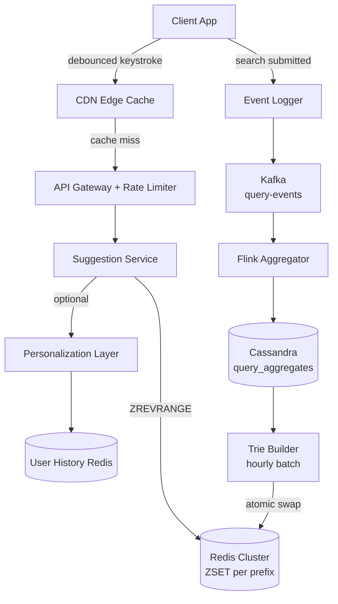
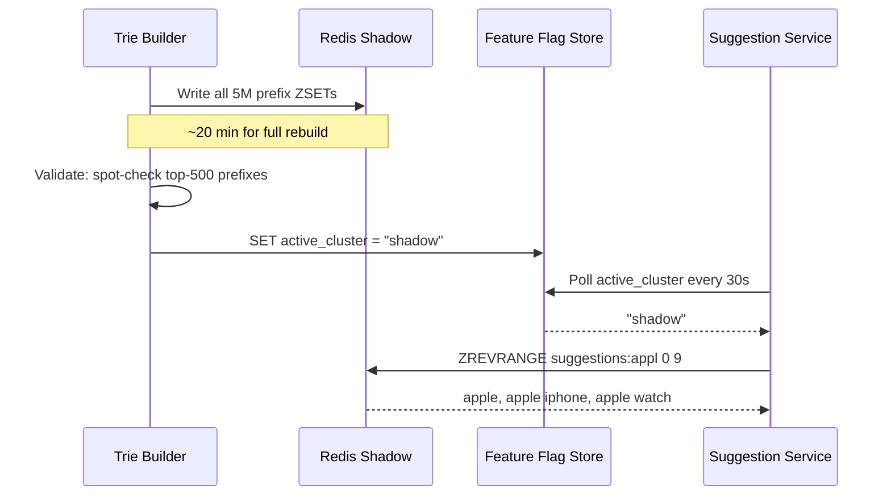
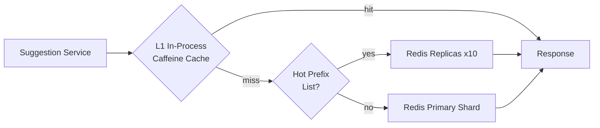
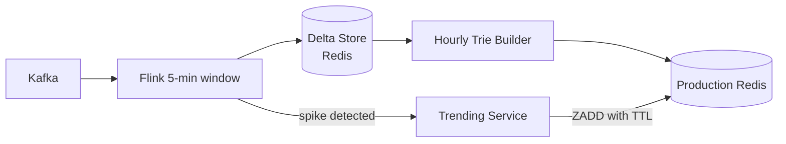

# Design Typeahead / Autocomplete Search

Typeahead (autocomplete) is the suggestion dropdown that appears as you type — "appl" → "apple", "apple iphone", "apple watch". Every major product ships it: Google, Amazon, YouTube, Twitter. It looks simple. It isn't.

The core challenge: serve top-k relevant completions for arbitrary prefixes in **< 100ms**, at **billions of requests per day**, while keeping suggestions fresh as queries trend in real time.

---

## Functional Requirements

**In Scope:**
- Return top-k search suggestions (k=10 default) for each keystroke prefix
- Rank suggestions by global query frequency and recency-weighted popularity
- Support trending query boost — viral queries surface within minutes
- Optional category filtering (e.g., `product`, `news`, `general`)

**Out of Scope:**
- Full-text search execution and results ranking (separate system — Elasticsearch/Solr)
- Deep personalization (discussed briefly in Deep Dives, not a core requirement)
- Spell correction or fuzzy prefix matching
- Multi-language or right-to-left autocomplete
- Click-through tracking or suggestion A/B testing

---

## Non-Functional Requirements

| Property | Target | Reasoning |
|---|---|---|
| **Latency** | p99 < 100ms end-to-end | Users perceive >150ms as laggy; suggestions must feel instant |
| **Availability** | 99.99% | Degraded UX if suggestions fail; safe fallback is empty suggestions |
| **Scale** | 500M DAU, ~25B requests/day | Every keystroke fires a request; debouncing reduces actual volume significantly |
| **Freshness** | Suggestions updated every 1–2 hours (with fast-path for trending) | Real-time rebuild is expensive; hourly batch + trending fast-path is the right tradeoff |
| **Read/Write Ratio** | ~1000:1 | Suggestion reads vastly outnumber trie writes |
| **Consistency** | Eventual | Stale suggestions by seconds are acceptable; correctness matters, not real-time precision |

**Key tradeoff:** Latency is the paramount constraint. Every architectural decision — data structure, caching strategy, sharding — is in service of sub-100ms responses at 1M+ req/sec peak load.

---

## Capacity Estimation

**Requests:**
- 500M DAU × 10 searches/day × 5 keystrokes/search = **25B autocomplete requests/day**
- Average throughput: ~290K req/sec; **peak: ~1M req/sec**

**Storage:**
- Unique queries in English: ~1B, but top 10M cover 99% of traffic
- Per prefix ZSET: top-20 suggestions × ~60 bytes/entry × 5M active prefixes ≈ **~6 GB** — fits in a Redis cluster
- After client debounce and CDN caching, only ~15% of keystrokes become real backend requests → effective load ~150K req/sec

**Cache math:**
- Top 50K prefixes ("ap", "app", "how", "wh") account for ~80% of requests
- These 50K prefix keys fit in < 50 MB of in-process cache — cache hit rate > 80% achievable per service instance

---

## Core Entities

| Entity | Purpose | Key Fields |
|---|---|---|
| **Query** | Canonical search string with its global popularity score | `query_id`, `query_text`, `frequency_score`, `last_updated` |
| **PrefixEntry** | Maps a prefix to its top-k candidate queries (denormalized read model) | `prefix`, `suggestions[]` (ordered by score) |
| **QueryLogEvent** | Raw event emitted when a user submits a completed search | `user_id`, `session_id`, `query_text`, `timestamp`, `source` |
| **AggregatedQuery** | Time-windowed query count used for frequency scoring | `query_text`, `window_start`, `granularity`, `count` |

**Relationships:**
- `PrefixEntry` is derived from `Query` — a denormalized read model, not a source of truth
- `QueryLogEvent` feeds the data pipeline → `AggregatedQuery` → trie rebuild
- The entire trie (Redis ZSET store) is a **cache/read model** — it can always be fully rebuilt from the aggregation store

---

## Databases and Database Design

### Storage Tier Decisions

| Data | Access Pattern | Choice |
|---|---|---|
| Trie / prefix index (hot path) | High-read, point lookup by prefix | **Redis Cluster (ZSET per prefix)** |
| Query frequency aggregates | Time-windowed, write-heavy aggregation | **Cassandra** |
| Raw query event log | Append-only, high-throughput ingest | **Kafka → S3 (cold archive)** |
| User search history (personalization) | Per-user lookup, low-latency reads | **Redis (per-user ZSET)** |

### The Trie as Redis Sorted Sets

The textbook data structure for autocomplete is an in-memory **trie** (prefix tree). A distributed trie is hard to shard, serialize, and update atomically. In production, we emulate prefix lookups with **Redis Sorted Sets (ZSET)**:

```
Key:    suggestions:{prefix}          e.g., suggestions:appl
Type:   ZSET
Score:  popularity score (higher = better)
Members: full query strings

ZADD suggestions:appl  9800  "apple"
ZADD suggestions:appl  8200  "apple iphone"
ZADD suggestions:appl  7400  "apple watch"
ZADD suggestions:appl  6100  "apple id login"

ZREVRANGE suggestions:appl 0 9    # → top 10 by score
```

**Why ZSET over raw trie:** A trie is inherently a single-node structure. To scale horizontally, you'd need to shard it and handle prefix queries that span shard boundaries — complex, fragile. Redis ZSETs are natively distributed via Redis Cluster, support O(log N) ranked reads, and allow atomic writes during incremental updates.

**Storage:** 1 ZSET per prefix × average 5 prefixes per unique query × top-10M active queries = 50M ZSETs, but the active set is far smaller. Storing top-20 candidates per prefix for 5M active prefixes = **~6 GB total** — comfortably fits in a 3-node Redis cluster.

### Cassandra — Query Frequency Store

```sql
CREATE TABLE query_aggregates (
  query_text    TEXT,
  window_start  TIMESTAMP,
  granularity   TEXT,       -- 'hour' | 'day' | 'week'
  count         COUNTER,
  PRIMARY KEY ((query_text, granularity), window_start)
) WITH CLUSTERING ORDER BY (window_start DESC);
```

- **Partition key:** `(query_text, granularity)` — fast lookup of all time windows for a given query
- **COUNTER type:** Native atomic increment; no read-modify-write races under high concurrency
- The Trie Builder reads this table to compute `score = 0.5 × daily_count + 0.3 × weekly_count + 0.2 × hourly_count`, rewarding recency without ignoring historical authority

### Consistency Model

| Operation | Consistency | Reasoning |
|---|---|---|
| Prefix lookup | Eventual | Redis replica may lag milliseconds — acceptable for suggestions |
| Trie update (full rebuild) | Atomic per cluster (blue/green) | Never serve a half-rebuilt trie |
| Query log ingestion | At-least-once (Kafka) | Idempotency handled in aggregator; duplicate events are noise, not errors |
| Query frequency counts | Eventually consistent | Cassandra COUNTER semantics; slight undercount is fine |

---

## API Design

**Get autocomplete suggestions:**
```http
GET /v1/suggestions?q=appl&limit=10&category=general
Authorization: Bearer <token>   // optional; enables personalization

200 OK
{
  "prefix": "appl",
  "suggestions": [
    { "query": "apple",         "score": 9800, "type": "popular"  },
    { "query": "apple iphone",  "score": 8200, "type": "popular"  },
    { "query": "apple watch",   "score": 7400, "type": "popular"  },
    { "query": "apple WWDC",    "score": 6900, "type": "trending" }
  ],
  "ttl": 300
}
```

**Log a completed search query (internal, async):**
```http
POST /internal/v1/query-events
{
  "user_id":    "u_abc123",
  "session_id": "s_xyz789",
  "query":      "apple watch series 10",
  "timestamp":  "2026-05-29T10:32:00Z",
  "source":     "search_bar"
}
// 202 Accepted — fire-and-forget to Kafka
```

**Get trending queries:**
```http
GET /v1/trending?category=news&window=1h&limit=10

200 OK
{
  "trending": [
    { "query": "apple WWDC 2026",    "delta_pct": 450 },
    { "query": "iphone 18 release",  "delta_pct": 280 }
  ]
}
```

**Admin: Trigger trie rebuild (internal, idempotent):**
```http
POST /internal/v1/trie/rebuild
{ "scope": "full" }
// 202 Accepted — enqueues rebuild job; safe to call multiple times
```

---

## High-Level Design

The system has two distinct planes: the **read plane** (serving suggestions in real time) and the **write plane** (the data pipeline keeping suggestions fresh).



**Read path (p99 target < 100ms):**
1. Client debounces keystrokes — fires request only after 150ms idle
2. CDN checks edge cache per prefix — popular prefixes like "ap" hit here > 90% of the time
3. Cache miss routes to the Suggestion Service → single `ZREVRANGE` Redis call → returns top-k
4. Optional Personalization Layer re-ranks by intersecting global results with user history

**Write path (freshness pipeline):**
1. Every submitted search emits a `QueryLogEvent` to Kafka (fire-and-forget, 202 response)
2. Flink aggregates counts in 5-minute, hourly, and daily windows → Cassandra
3. Every hour, Trie Builder reads Cassandra, computes scores, writes all ZSETs to a **shadow Redis cluster**
4. On validation pass, a feature flag atomically routes reads to the shadow cluster (blue/green swap)

**Component responsibilities:**
- **CDN:** Caches `(prefix, category)` → suggestion list. TTL 60s for trending prefixes, 5 min for cold
- **Suggestion Service:** Stateless, horizontally scaled pods. One Redis `ZREVRANGE` call per request
- **Flink Aggregator:** Windowed aggregation, session deduplication, trending spike detection
- **Trie Builder:** Offline batch job — rebuilds entire ZSET store; never writes directly to production

---

## Deep Dives

### 1. Offline Rebuild + Atomic Blue/Green Trie Swap

**The problem:** You can't incrementally update a live Redis trie without risking partial reads. During a rebuild, some prefix ZSETs hold fresh scores while others hold yesterday's — users get incoherent suggestions.

**Solution — Blue/Green cluster swap:**



- Full rebuild completes on the shadow cluster while production traffic hits the primary
- Validation catches anomalies (empty ZSETs, score drift) before the swap
- Flag flip propagates to all Suggestion Service instances within 30s
- Old primary becomes the next rebuild target — 2× Redis memory is the cost (~12 GB for two clusters)

**Why not incremental updates?** Incremental updates work for small changes (trending fast-path, covered below) but not for full frequency recalculation. The batch rebuild ensures a globally consistent scoring baseline every hour.

---

### 2. Sharding and the Hot Prefix Problem

**The problem:** Single-character or two-character prefixes ("a", "th", "wh") each receive millions of requests per second. A single Redis shard holding `suggestions:a` becomes a hotspot that saturates at ~100K req/sec.

**Layered mitigation strategy:**



**Layer 1 — In-process Caffeine LRU cache (most effective):**
- Each Suggestion Service pod caches top-5,000 prefix responses locally
- TTL: 60s for hot prefixes, 5 min for cold
- Hit rate: ~80–85% of Redis-bound requests; eliminates most Redis traffic
- Cost: ~5 MB of heap per pod

**Layer 2 — Redis read replicas for hot shards:**
- A static hot-prefix list (top 1,000 by frequency) is maintained in config
- Hot prefix lookups load-balance across 10 read replicas
- Turns a 1M req/sec single-shard hotspot into 100K req/sec per replica

**Layer 3 — CDN edge caching:**
- `GET /v1/suggestions?q=ap` responses are cacheable per (prefix, category)
- CDN hit rate for top-50K prefixes exceeds 85%

| Cache Layer | Hit Rate | Added Latency | TTL |
|---|---|---|---|
| Client debounce | Eliminates ~70% of keystrokes | 0 ms | n/a |
| CDN edge | ~85% of CDN-eligible requests | 5–10 ms | 60–300s |
| In-process Caffeine | ~80% of backend-bound requests | < 1 ms | 60s |
| Redis ZSET | All remaining misses | 1–3 ms | via trie rebuild |

---

### 3. Trending Queries: Fast-Path Without Polluting the Trie

**The problem:** A query that goes viral ("apple WWDC 2026") should appear in autocomplete within 5 minutes, not 60. But direct writes to the production trie during a partial rebuild cause the coherency problem described above.

**Hybrid fast-path + batch-path architecture:**



- **Fast path:** Flink detects queries with > 500% count increase in a 5-minute rolling window → Trending Service directly `ZADD`s the affected prefix ZSETs with a boosted temporary score and a **48-hour TTL key shadow** to auto-expire if the trend fades
- **Slow path:** Hourly batch rebuild recalculates permanent baseline scores from Cassandra aggregates, overwriting any stale trending boosts
- Fast path touches at most ~200 prefix keys for top-trending queries — negligible write load

**Score decay:** Trending boosts use exponential decay scoring:

```
trending_score = base_score × e^(-λ × age_hours)
```

Where `λ = 0.3` means a trending query's boost halves every ~2.3 hours. This prevents a brief 10-minute spike from surfacing a query for days.

**Tradeoff:** Fast path scores can temporarily be inconsistent with the baseline trie if a rebuild hasn't run yet. Acceptable — the window is < 1 hour and only affects trending queries, not the full suggestion set.

---

### 4. Personalization Without Breaking CDN Caching

**The problem:** CDN and in-process caches key on the prefix string. Personalization makes the response user-specific — caching breaks, and you lose 85% of your cache hit rate.

**Two-tier approach:**
- **L1 (global, cached):** The CDN and in-process cache serve the global top-k as before — no change to cache architecture
- **L2 (personalized, not cached):** The Suggestion Service fetches the user's recent queries from a per-user Redis ZSET and merges them into the global list

```
user_history:{user_id}   →   ZSET (query → timestamp as score)

// At response time:
global_results  = ZREVRANGE suggestions:appl 0 19      // top 20 global
user_history    = ZREVRANGEBYSCORE user_history:{uid}  // user's recent queries
personal_hits   = [q for q in user_history if q.startswith("appl")]

// Merge: personal hits at positions 0-2, global fills the rest
final = deduplicate(personal_hits[:2] + global_results)[:10]
```

- Personalization adds exactly one Redis call (1–2 ms) — within latency budget
- The expensive prefix lookup and all caching layers remain unchanged
- Only authenticated users get personalization; anonymous users get pure global results

**Tradeoff:** The merged list is not cached. For the ~30% of requests from authenticated users, you bypass the per-request CDN cache but still benefit from in-process global-results caching. Net latency increase: < 5 ms.

---

### 5. Rate Limiting

Autocomplete fires on every keystroke. A buggy client with no debouncing, or a malicious scraper enumerating prefixes, can send thousands of requests per second.

- **Client-side debounce:** 150ms idle window before firing — eliminates 70–80% of keystrokes for normal typists. This is the highest-leverage optimization and costs nothing server-side.
- **Minimum prefix length:** Reject `q` with `length < 2` — cuts volume nearly in half and removes low-value queries (`"a"` has near-useless suggestions)
- **API Gateway token bucket:** 50 req/sec per authenticated `user_id`; 20 req/sec per `client_ip` for anonymous requests. Burst capacity: 200 requests. Implemented at the gateway layer — Suggestion Service never sees overload.
- **Per-prefix circuit breaker:** If a specific prefix ZSET is missing in Redis (e.g., during a rebuild), return a graceful empty array (HTTP 200 with `suggestions: []`) rather than a 503 that breaks the UI

---

## Summary: Key Engineering Decisions

| Decision | Choice | Why |
|---|---|---|
| Data structure | Redis ZSET per prefix | Horizontally scalable, atomic updates, O(log N) ranked reads |
| Trie update strategy | Offline rebuild + blue/green swap | Zero partial-read risk; atomic promotion of a full consistent snapshot |
| Trending freshness | Fast-path ZADD + hourly rebuild | Balance between real-time freshness and trie coherence |
| Hot prefix mitigation | In-process Caffeine + read replicas | Eliminates Redis hotspots without topology changes |
| Personalization | Two-tier merge at query time | Preserves CDN/in-process caching for the global layer |
| Rate limiting | Client debounce + gateway token bucket | Handles abuse without service-level changes |

The autocomplete system is deceptively deep. The data structure is the cornerstone, but the real engineering is in keeping suggestions fresh without downtime, preventing hot shard saturation, and layering caches to absorb 1M req/sec while staying under 100ms. In interviews, the candidates who nail the **blue/green trie swap** and the **layered cache strategy** are the ones who get the offer.
