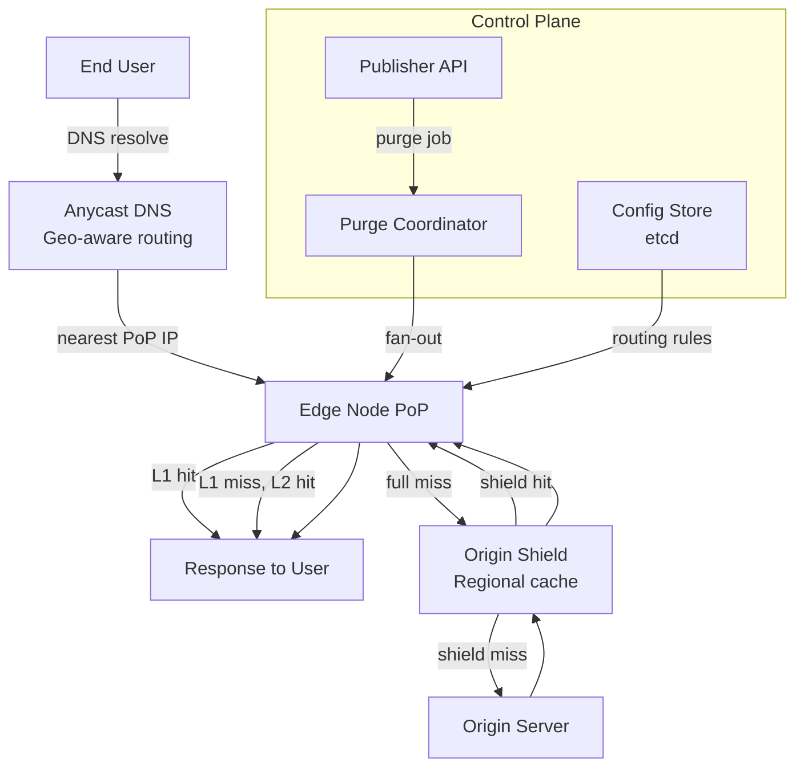
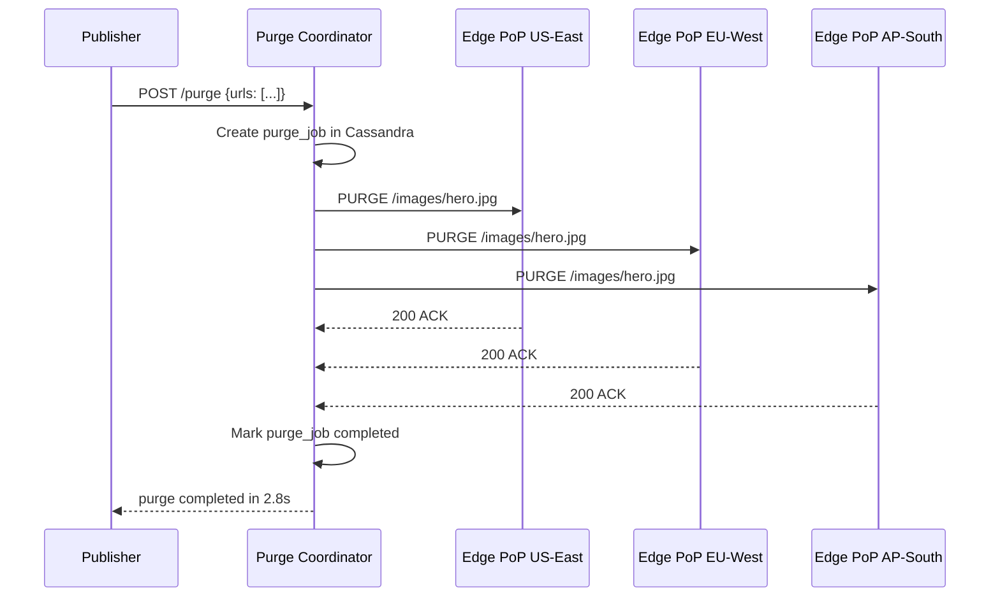
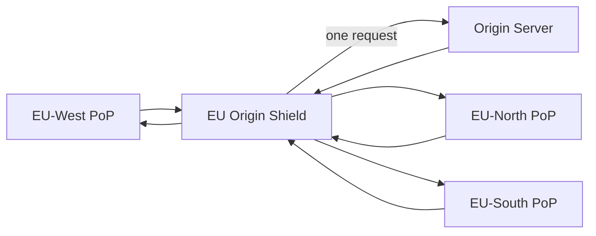
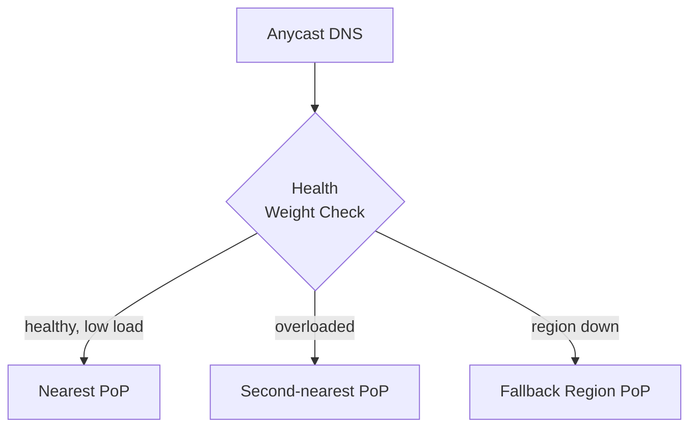
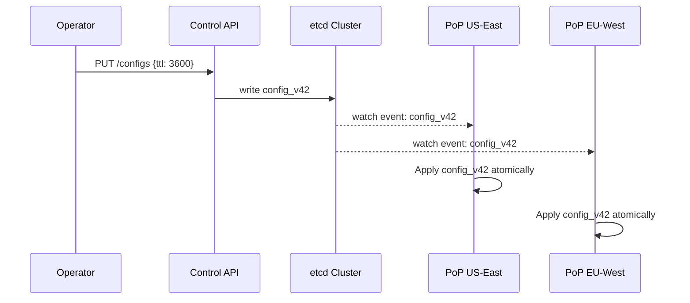

# Design a CDN (Content Delivery Network)

A CDN is a globally distributed network of cache servers (edge nodes) that serve content from locations geographically close to users — reducing latency, cutting origin load, and absorbing traffic spikes. Cloudflare, Akamai, AWS CloudFront, and Fastly serve petabytes of data daily through this architecture.

Designing a CDN from scratch tests your understanding of distributed caching at global scale, cache coherence across hundreds of nodes, intelligent routing, and origin protection. The hard parts aren't the HTTP caching — they're cache invalidation, routing users to the right edge, and keeping the edge healthy when origin is down.

---

## Functional Requirements

**In Scope:**
- Serve static assets (images, JS, CSS, video) from geographically distributed edge nodes
- Cache content at the edge based on HTTP cache headers (`Cache-Control`, `ETag`, `Last-Modified`)
- Route users to the nearest or best-performing edge node
- Cache invalidation: allow content publishers to purge stale content globally
- Origin pull: on cache miss, fetch content from origin and cache it at the edge
- Support both **push CDN** (content pre-loaded by publisher) and **pull CDN** (lazy load on first request)
- HTTPS/TLS termination at the edge

**Out of Scope:**
- Full WAF / DDoS scrubbing (though CDNs often provide this, it's a separate system)
- Video transcoding and adaptive bitrate streaming (that's a media processing pipeline)
- Dynamic content acceleration (covered briefly — it's fundamentally different from caching)
- Edge compute / serverless at the edge (Cloudflare Workers territory)

---

## Non-Functional Requirements

| Property | Target | Reasoning |
|---|---|---|
| **Latency** | p99 < 50ms for cached responses | Edge is close to user; uncached round-trips to origin add 100–500ms |
| **Cache Hit Rate** | > 90% globally | Below 90%, origin cost and latency savings evaporate |
| **Availability** | 99.99%+ per edge node; graceful degradation to origin on edge failure | Edge failures must be invisible to end users |
| **Throughput** | 10+ Tbps aggregate across the network | Video-heavy workloads drive enormous bandwidth |
| **Invalidation Latency** | Global purge completes within 5 seconds | Stale content served after a deploy or data correction is a product bug |
| **Durability** | None required at edge — edge is a cache, not a store | All durable storage is at origin |

**Key tradeoff:** High cache hit rate and low invalidation latency are in tension. Longer TTLs improve hit rate but make invalidation more expensive (more nodes to purge). The right default is **long TTL + explicit purge API** — set high TTLs on immutable assets (fingerprinted filenames), short TTLs on mutable URLs.

---

## Capacity Estimation

**Scale:**
- 1B requests/day → ~11,600 req/sec average; **500K req/sec peak** (major content push)
- 90% cache hit rate → only 50K req/sec reach origin
- Average response size: 500 KB (mix of images, scripts, video segments)
- Peak bandwidth: 500K req/sec × 500 KB × 10% (cache miss) = **25 Gbps to origin** — manageable with origin shielding

**Edge node sizing:**
- 200 edge nodes globally (PoP — Points of Presence)
- Each PoP: 50 TB SSD cache + 100 Gbps network capacity
- Total edge cache: 200 × 50 TB = **10 PB** — absorbs most of the internet's static content catalog

**Invalidation scale:**
- A single purge-all event touches 200 PoPs × broadcast message = 200 messages
- Per-key purge: 200 messages per cache key — must complete in < 5 seconds

---

## Core Entities

| Entity | Purpose | Key Fields |
|---|---|---|
| **CacheEntry** | A cached object stored at an edge node | `cache_key`, `content_bytes` (or pointer to disk), `etag`, `content_type`, `size_bytes`, `expires_at`, `created_at` |
| **OriginServer** | The upstream source of truth for content | `origin_id`, `hostname`, `pull_protocol`, `timeout_ms`, `health_state` |
| **CDNConfig** | Per-customer or per-path caching rules | `config_id`, `path_pattern`, `ttl_seconds`, `cache_headers_override`, `origin_id` |
| **EdgeNode (PoP)** | A physical cache server at a geographic location | `node_id`, `region`, `latitude`, `longitude`, `capacity_gb`, `health_state` |
| **PurgeJob** | A cache invalidation request targeting keys or patterns | `purge_id`, `scope` (key/prefix/all), `keys[]`, `submitted_at`, `completed_at`, `status` |

**Relationships:**
- `CacheEntry` lives on an `EdgeNode`; the same key may be cached across multiple PoPs
- `CDNConfig` maps URL patterns to origin servers and TTL rules
- `PurgeJob` fans out to all `EdgeNodes`; each node reports completion independently

---

## Databases and Database Design

The CDN's hot path — serving cached bytes — touches **no databases**. Databases exist only in the control plane (config management, purge coordination, analytics).

### Storage Tier Decisions

| Data | Access Pattern | Choice |
|---|---|---|
| Cached content (edge) | Extremely hot reads, write-once | **Local SSD on each edge node** |
| Edge metadata index | Per-node in-memory key → disk offset lookup | **In-process hash map (e.g., RocksDB)** |
| CDN configuration / routing rules | Low-write, globally consistent, read by all PoPs | **etcd / distributed KV (Consul)** |
| Purge job tracking | Write-heavy fan-out, per-node ack | **Cassandra** |
| Analytics / access logs | Append-only, high volume | **Kafka → ClickHouse** |

### Edge Node — Two-Layer Cache

Each edge node uses a two-layer cache to balance speed and capacity:

```
L1: In-memory LRU (hot working set)
    - Size: 64 GB RAM
    - Lookup: O(1) hash map
    - Hit latency: < 1ms

L2: SSD cache (warm content)
    - Size: 50 TB NVMe
    - Lookup: RocksDB key → byte offset
    - Hit latency: 2–5ms
```

- Content is promoted from L2 to L1 on repeated access (frequency-based promotion)
- On eviction from L1, content stays on L2 (cheaper to re-read from SSD than to re-fetch from origin)
- Cache eviction policy: **SLRU (Segmented LRU)** — separates recently-added from frequently-accessed to resist cache pollution from one-time large file sweeps

### Cassandra — Purge Job Tracking

```sql
CREATE TABLE purge_jobs (
  purge_id     UUID,
  node_id      TEXT,
  scope        TEXT,        -- 'key' | 'prefix' | 'tag' | 'all'
  keys         LIST<TEXT>,
  status       TEXT,        -- 'pending' | 'completed' | 'failed'
  submitted_at TIMESTAMP,
  ack_at       TIMESTAMP,
  PRIMARY KEY  ((purge_id), node_id)
);
```

- Partition key `purge_id` groups all per-node acks for a single purge request
- Fan-out coordinator waits for all `node_id` rows to transition to `completed` before returning success
- Cassandra's wide-row model suits this fan-out ack pattern perfectly

### Cache Key Design

Cache key design is critical — a poor key causes unnecessary misses or incorrect content served:

```
Standard key:   {scheme}://{host}{path}?{sorted_query_params}
e.g.:           https://cdn.example.com/images/hero.jpg

With Vary:      {scheme}://{host}{path}#{accept-encoding}
e.g.:           for gzip vs. brotli variants of the same resource

Immutable key:  https://cdn.example.com/assets/app.a3f9c1b2.js
(fingerprinted filename → infinite TTL, no invalidation ever needed)
```

**Rule:** Static assets with content-hashed filenames should have `Cache-Control: max-age=31536000, immutable`. Mutable URLs (e.g., `/api/feed`) should use short TTLs or bypass cache entirely.

---

## API Design

**Publisher API** — used by content teams and CI/CD pipelines to manage content:

**Purge by URL (single key):**
```http
POST /v1/purge
Authorization: Bearer <cdn_token>
{
  "scope": "url",
  "urls": [
    "https://cdn.example.com/images/hero.jpg",
    "https://cdn.example.com/styles/main.css"
  ]
}

202 Accepted
{
  "purge_id": "purge_abc123",
  "status":   "pending",
  "node_count": 200,
  "estimated_completion_ms": 3000
}
```

**Purge by tag (content group):**
```http
POST /v1/purge
{
  "scope": "tag",
  "tags":  ["product-images", "homepage"]
}
// Purges all cache entries tagged at upload time — powerful for CMS deployments
```

**Check purge status:**
```http
GET /v1/purge/{purge_id}

200 OK
{
  "purge_id":   "purge_abc123",
  "status":     "completed",
  "node_count": 200,
  "acked":      200,
  "duration_ms": 2840
}
```

**Configure caching rules for a path pattern:**
```http
PUT /v1/configs/{config_id}
{
  "path_pattern": "/images/*",
  "ttl_seconds":  86400,
  "origin":       "https://origin.example.com",
  "cache_by_headers": ["Accept-Encoding"]
}
```

**Prefetch content to edge (push CDN):**
```http
POST /v1/prefetch
{
  "urls": ["https://cdn.example.com/videos/launch-keynote.mp4"],
  "regions": ["us-east", "eu-west", "ap-southeast"]
}
// 202 Accepted — asynchronously warms edge caches in specified regions
```

---

## High-Level Design

The CDN architecture separates into **data plane** (serving cached bytes) and **control plane** (config, purge, routing).



**Request flow (cache hit — the 90% case):**
1. User's DNS query resolves to the nearest PoP via Anycast or GeoDNS
2. Edge node checks L1 (RAM) → L2 (SSD) — returns content with < 5ms latency
3. No origin involved; user gets the response from ~10–50ms away geographically

**Request flow (cache miss — the 10% case):**
1. Edge checks L1 → L2 → misses both
2. Edge forwards to **Origin Shield** (a regional mid-tier cache) — not directly to origin
3. If shield has it: returns to edge, edge caches it, serves user
4. If shield misses: pulls from origin, populates shield, then edge

**Component responsibilities:**
| Component | Role |
|---|---|
| **Anycast DNS** | Routes users to geographically nearest healthy PoP |
| **Edge Node** | L1/L2 cache; TLS termination; serves 90%+ of all requests |
| **Origin Shield** | Regional aggregation layer; collapses thundering herd on cache miss |
| **Purge Coordinator** | Fans out invalidation commands to all edge nodes; tracks acks |
| **Config Store (etcd)** | Distributes caching rules, TTLs, and origin mappings to all PoPs |

---

## Deep Dives

### 1. Cache Invalidation: The Hardest Problem in CDN Design

**The problem:** CDN cache entries are replicated across 200+ PoPs globally. When a publisher updates content (a product image, a critical CSS file, a privacy policy), stale bytes may still be served from edges for the duration of the TTL — which could be 24 hours.

**Why it's hard at scale:** You must propagate an invalidation signal to every edge node, confirm each node has purged its local copy, and handle failures (a node that's partitioned must catch up when it reconnects) — all within 5 seconds.

**Production approach: Fan-out with ack tracking:**



- Purge Coordinator sends invalidation messages in parallel to all PoPs (not sequentially)
- Each PoP deletes the cache key from L1 and L2 and ACKs
- Coordinator marks the job complete when all nodes ACK (or timeout after 10s with partial success)
- **At-least-once delivery via retry:** If a PoP is partitioned, the coordinator retries on reconnect; the PoP's reconciler checks a pending-purges queue on startup

**Surrogate keys / cache tags:** Instead of purging individual URLs (which requires knowing every URL that references an asset), publishers tag cache entries at insertion:

```http
// Origin response header
Surrogate-Key: product-123 category-shoes homepage-banner
```

A single `purge(tag="product-123")` invalidates all URLs tagged with that product across all PoPs — powerful for CMS, e-commerce, and news sites where one entity maps to dozens of URLs.

---

### 2. Origin Shield: Collapsing the Thundering Herd

**The problem:** When a popular asset isn't cached (cold start, TTL expiry, just invalidated), thousands of edge nodes may simultaneously miss the cache and simultaneously send requests to origin. This is a **thundering herd** — origin receives N × peak_edge_request_rate simultaneously.

**Example:** A new viral video is published. 200 PoPs each see 100 concurrent cache misses in the first second → 20,000 simultaneous requests to origin for the same byte range.

**Solution — Origin Shield (mid-tier regional cache):**



- All European PoPs route cache misses to a single **EU Origin Shield** node
- The shield implements **request coalescing**: if 100 PoPs miss the same cache key simultaneously, the shield sends exactly 1 request to origin and fans the response out to all 100 waiters
- Origin sees at most N_regions requests instead of N_pops requests — roughly 10× reduction
- Shield itself is a cache: once it has the content, subsequent PoP misses are served from shield without touching origin at all

**Tradeoff:** Origin Shield adds one network hop (~10–20ms) on cache miss. For the 10% of requests that miss cache, this is acceptable. For the 90% that hit the edge, there's zero added latency.

---

### 3. Routing: Getting Users to the Right Edge

**The problem:** "Nearest edge" isn't always the best edge. A geographically close PoP may be overloaded, degraded, or have a poor network path to the user. Routing purely on geography causes hot spots.

**Layer 1 — Anycast routing (network-layer):**
- All PoPs announce the same IP prefix via BGP
- The internet's BGP routing protocol naturally routes each user to the topologically closest PoP (fewest AS hops)
- No DNS lookup required — the IP is the same everywhere; routing happens at the network layer
- Failover is automatic: if a PoP withdraws its BGP announcement, traffic shifts to the next-closest

**Layer 2 — DNS-based geo-routing (fallback and fine-grained):**
- For customers who need more control, a geo-aware DNS resolver returns different IP addresses based on the resolver's region
- Allows routing `asia-users → ap-edge` even if BGP would route them elsewhere
- DNS TTL: 30–60 seconds — allows fast failover without waiting for BGP convergence

**Layer 3 — Real-time health-aware routing:**



- Each PoP continuously reports CPU utilization, active connections, and error rate to a **routing health service**
- DNS resolver weights PoPs by health score: an overloaded PoP gets reduced weight and fewer users directed to it
- A failed PoP is removed from routing within 10–30 seconds (DNS TTL + health check interval)

---

### 4. Cache Consistency: TTL Strategy and Revalidation

**The problem:** You want high cache hit rates (long TTLs) but also want stale content replaced quickly (short TTLs). These are fundamentally opposed.

**The answer: Separate content by mutability.**

| Content Type | Cache Strategy | TTL |
|---|---|---|
| Fingerprinted assets (`app.a3f9c1b2.js`) | `Cache-Control: max-age=31536000, immutable` | 1 year — never needs invalidation |
| Versioned API responses (`/v2/products/123`) | `Cache-Control: max-age=300` | 5 minutes — low miss rate acceptable |
| Mutable HTML pages (`/blog/post-slug`) | `Cache-Control: max-age=60, stale-while-revalidate=3600` | Serve stale while background-refreshing |
| Private/user-specific content | `Cache-Control: private, no-store` | Never cached at CDN |

**`stale-while-revalidate` (SWR):** The most powerful cache coherence primitive for mutable content:
- Serve the stale cached response immediately (no latency penalty)
- In the background, revalidate against origin
- Next request gets the fresh content
- Users almost never see staleness; origin load remains low

**`ETag` / `If-None-Match` revalidation:** Instead of re-fetching the full body on TTL expiry, the edge sends the cached ETag; origin returns `304 Not Modified` (no body) if content hasn't changed. Saves bandwidth on large assets that rarely change.

---

### 5. Multi-Region Consistency: Config Propagation

**The problem:** CDN configuration (TTL rules, origin hostnames, routing weights) must be consistent across 200+ PoPs. A stale routing config at one PoP could route traffic to the wrong origin or serve content with wrong TTLs.

**Solution — etcd with PoP watchers:**



- Config changes propagate to all PoPs within 1–2 seconds via etcd watch events
- Each PoP applies the new config atomically — in-flight requests use the old config; new requests use the new one
- Config version is stamped on each cache entry: when config changes the TTL for a path, entries cached under the old config are re-evaluated against the new TTL on next access (lazy re-evaluation — no mass eviction needed)

---

### 6. Rate Limiting and Hotspot Protection at the Edge

**The problem:** A single very popular asset (viral video, homepage asset during a Super Bowl ad) can overwhelm a single PoP with request volume far beyond its capacity — even with a 100% cache hit rate, the sheer connection count saturates the NIC or CPU.

**Solutions:**
- **Request coalescing at the edge:** If 10,000 concurrent requests arrive for the same uncached key, only 1 is forwarded to origin/shield; the other 9,999 wait and receive the same response when it arrives
- **Byte-range streaming:** Large files (video) are served in byte-range chunks so the edge starts streaming to clients while still fetching from origin — reduces time-to-first-byte
- **Connection limits per client IP:** Each edge enforces a maximum concurrent connections per source IP, preventing a single client from monopolizing edge resources
- **Edge-tier rate limiting:** Token bucket per `(client_ip, path)` — enforced in-process with no external state store; approximate limiting with local counters is sufficient at the edge

---

## Summary: Key Engineering Decisions

| Decision | Choice | Why |
|---|---|---|
| Edge cache storage | Two-tier (RAM L1 + SSD L2) | Maximizes hit rate at different cost points |
| Cache eviction | SLRU | Resists cache pollution from large one-time sweeps |
| Origin protection | Origin Shield with request coalescing | Reduces origin load by 10–100× during thundering herds |
| Routing | Anycast + health-weighted DNS | Network-layer routing with app-layer health awareness |
| Invalidation | Fan-out with Cassandra ack tracking + surrogate keys | Predictable global propagation time; tag-based purge for CMS workloads |
| Config distribution | etcd with PoP watchers | Sub-2s global propagation with strong consistency |
| TTL strategy | Long TTL for immutable + SWR for mutable | Maximizes hit rate without sacrificing content freshness |

The most important insight for CDN interviews: **a CDN is not just a cache — it's a globally distributed system that must itself be highly available, quickly consistent on invalidation, and capable of absorbing demand spikes that would kill any centralized origin.** The architecture decisions flow entirely from those three constraints.
