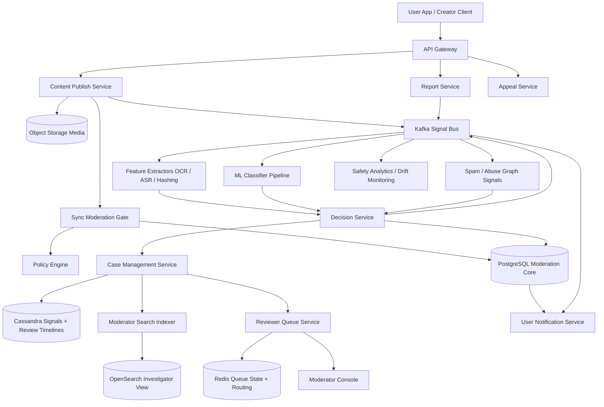
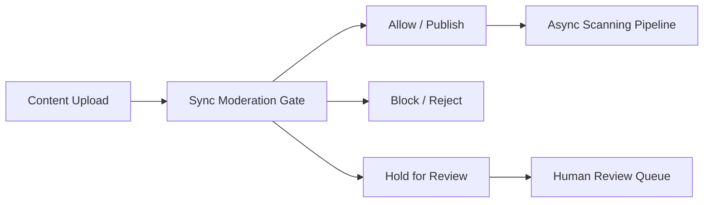
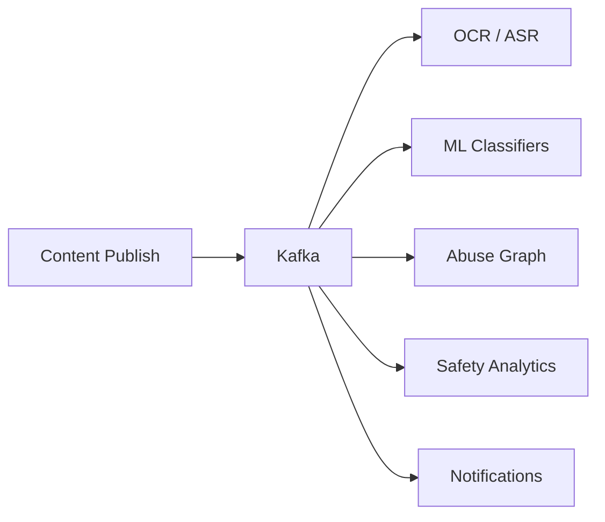
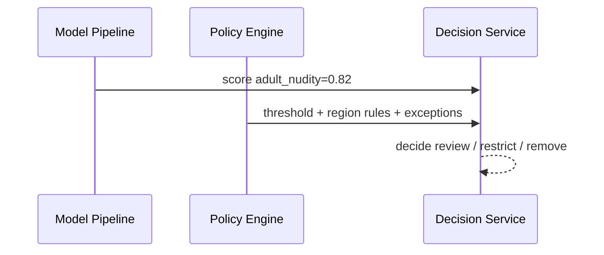
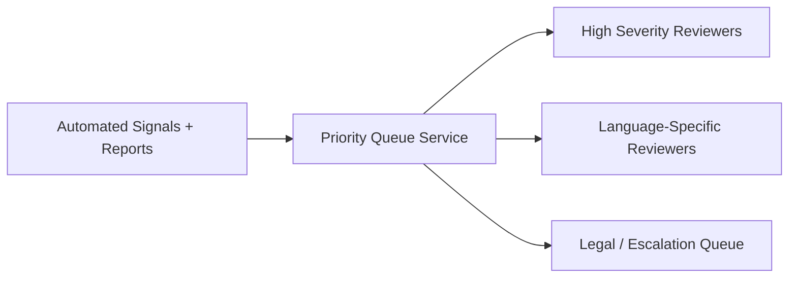
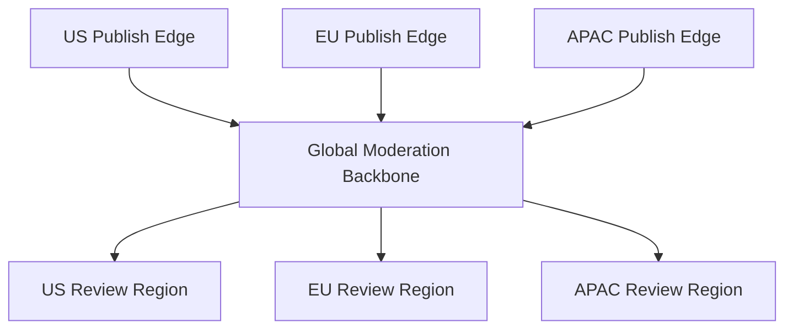

# Design Content Moderation

Designing a content moderation system is a classic system design interview problem because it sits at the intersection of safety, scale, machine learning, human operations, and legal compliance. Modern platforms accept text, images, video, audio, comments, messages, livestreams, and profile metadata at enormous scale. Users expect their uploads to succeed quickly and legitimate content to remain visible. Platforms also need to stop spam, harassment, nudity, violence, terrorism content, scams, child safety violations, and policy abuse before or soon after it reaches other users. The hard part is that moderation is never just one yes-or-no decision. It is a pipeline of signals, confidence thresholds, risk policies, human escalation, appeals, and enforcement actions.

At a high level, the system has three major workloads. The first is the **decision path**, where uploads or edits are evaluated synchronously or near-synchronously so the platform can allow, block, blur, throttle, or hold content for review. The second is the **post-publication analysis path**, where large-scale scanners, reports, and model refreshes revisit already-published content and update enforcement status. The third is the **operations path**, where moderators investigate queues, review evidence, take actions, and handle appeals with a durable audit trail. A good design keeps the user-facing moderation gate fast, makes downstream analysis replayable, and preserves a strongly consistent case and enforcement record even when models, policies, and evidence evolve.

---

## Functional Requirements

**In Scope:**
- The platform can moderate user-generated text, images, videos, audio, comments, and profile metadata
- Uploads can be evaluated synchronously before publication for the highest-risk policy categories
- The system supports asynchronous post-publication scanning for lower-priority or more expensive moderation checks
- Users can report content, creators, or comments, and those reports enter a moderation workflow
- Moderators can review queued cases, inspect evidence, and apply actions such as takedown, shadow restriction, age gating, or account suspension
- The platform stores model scores, policy matches, human decisions, and enforcement history with auditability
- Users can view moderation status where appropriate and submit appeals on eligible actions
- Operators can inspect queue lag, model drift, false-positive spikes, hot abuse campaigns, and reviewer productivity

**Out of Scope:**
- Full model-training internals for every classifier or embedding system
- Deep legal workflow tooling for government requests, litigation hold, or region-specific legal escalations
- End-to-end trust and safety organizational processes such as agent staffing, scheduling, or performance review systems
- Full advertiser-suitability policy engines separate from user-safety moderation
- Dedicated anti-virus or malware scanning design beyond acknowledging it as a possible signal source

---

## Non-Functional Requirements

| Property | Target | Reasoning |
|---|---|---|
| **Pre-Publish Decision Latency** | p99 < 300ms for lightweight synchronous checks; slower deep scans must move async | upload and posting UX breaks if moderation gates are too slow |
| **Safety Freshness** | high-risk harmful content should be blocked immediately or reviewed within minutes | dangerous content spreads quickly if moderation lags badly |
| **Recall for Severe Abuse** | prioritize high recall for child safety, terrorism, and severe violence categories | false negatives are much more costly for the highest-risk policies |
| **Precision for Benign Content** | avoid excessive false positives on normal uploads and comments | over-blocking damages user trust and creator retention |
| **Auditability** | every action must be explainable with policy, evidence, actor, and timestamp | moderation systems need strong support, compliance, and appealability |
| **Scalability** | handle billions of moderation signals/day across many content types | large platforms generate far more moderation signals than user-visible actions |
| **Availability** | core upload path should degrade gracefully when classifiers or review systems fail | the platform needs controlled fallback, not total posting collapse |
| **Isolation** | one abuse campaign, content type, or model failure should not degrade all moderation flows | moderation incidents are often localized but intense |

**Key tradeoff:** the system prioritizes **high recall and fast containment for severe abuse** while preserving **reasonable precision and low enough latency for normal user posting flows**. Expensive deep inspection and human review should not block every upload, but the highest-risk policies still need strong synchronous protection.

---

## Capacity Estimation

**Platform scale assumptions:**
- Assume the product receives **2B user-generated items/day** across posts, comments, profile edits, media uploads, and short video content
- That is about **23K content items/sec average**, but real peaks during events or regional spikes can be **10x higher**
- Each content item may generate several derived moderation signals, not just one moderation request

**Signal amplification assumptions:**
- A single uploaded video can produce text from OCR, audio transcripts from ASR, frame-level image signals, metadata checks, duplicate-hash lookups, user-risk lookups, and graph-based abuse signals
- That means **1 content item** can expand into **10 to 100+ internal moderation signals** depending on content type and policy scope
- Human reports, backfills, model reprocessing, and policy refreshes further amplify throughput on the asynchronous path

**Review workload assumptions:**
- Only a small fraction of all content should reach humans, but even **0.1% of 2B/day** is **2M human-review candidates/day**
- Review queues must therefore be prioritized by severity, confidence, virality, and legal or regulatory sensitivity
- Appeals and repeat-offender investigations create additional case-management load beyond raw content review

**Storage profile:**
- Raw media is large and usually lives in object storage, while moderation metadata, signals, and case histories are much smaller but extremely numerous
- Audit trails and evidence references require long retention in many categories
- Recent moderation decisions are read heavily by user-facing status pages, enforcement systems, and support teams

---

## Core Entities

| Entity | Purpose | Key Fields | Relationships |
|---|---|---|---|
| **ContentItem** | User-generated content under review | `content_id`, `author_id`, `content_type`, `visibility`, `created_at`, `status` | has many moderation signals and decisions |
| **ModerationSignal** | Automated or user-generated safety input | `signal_id`, `content_id`, `signal_type`, `score`, `model_version`, `created_at` | feeds the decision engine |
| **PolicyRule** | Platform rule or policy clause | `policy_id`, `name`, `severity`, `sync_enforced`, `region_scope` | referenced by signals and decisions |
| **ModerationDecision** | Final or intermediate system decision | `decision_id`, `content_id`, `policy_id`, `decision_type`, `confidence`, `actor_type` | may trigger enforcement or review |
| **ReviewCase** | Human-review unit of work | `case_id`, `content_id`, `priority`, `queue_name`, `status`, `assigned_to` | groups signals, evidence, and actions |
| **Report** | User or partner complaint | `report_id`, `content_id`, `reporter_id`, `reason`, `status` | can escalate a case or reprioritize review |
| **EnforcementAction** | Action applied to content or account | `action_id`, `target_type`, `target_id`, `action_type`, `duration`, `status` | follows a decision or reviewer judgment |
| **Appeal** | Request to revisit a moderation action | `appeal_id`, `action_id`, `submitted_by`, `reason`, `status` | linked to a prior enforcement action |
| **ReviewerAssignment** | Moderator work-routing record | `assignment_id`, `case_id`, `reviewer_id`, `queue_name`, `assigned_at` | controls human review workload |
| **EvidenceBundle** | Material gathered for a decision | `evidence_id`, `content_id`, `media_refs`, `transcript_ref`, `hashes`, `snapshot_ref` | attached to cases and decisions |

**Critical modeling decisions:**
- `ModerationSignal` is distinct from `ModerationDecision`. Signals are noisy evidence; decisions are policy outcomes.
- `ReviewCase` is separate from the content item because one case may aggregate multiple signals, reports, and related items around the same incident.
- `EnforcementAction` must be explicit and durable. It is not enough to mutate a content status field and lose the reason, actor, or policy basis.

---

## Databases and Database Design

### Storage Tier Decisions

| Data | Access Pattern | Engine | Why |
|---|---|---|---|
| Content metadata, policy rules, decisions, enforcement actions, appeals, reviewer assignments | transactional writes, exact reads, strong consistency | **PostgreSQL / MySQL** | the moderation control plane and case state need ACID semantics |
| Raw media, screenshots, evidence snapshots, classifier artifacts, transcripts | large immutable blobs | **Object Storage** | media and evidence are best handled as durable objects |
| High-volume signals, reports, review timelines, audit events | append-heavy writes, content-scoped or case-scoped reads | **Cassandra / ScyllaDB** | useful for large immutable histories and signal timelines |
| Signal pipeline, model outputs, report ingestion, downstream enforcement fanout | durable append-only backbone | **Kafka** | ideal for high-throughput moderation event pipelines and replay |
| Hot queue state, rate limits, reviewer routing hints, duplicate suppression | sub-millisecond reads/writes with TTLs | **Redis** | fits ephemeral operational state and queue counters |
| Moderator search across content, users, cases, and incidents | filter-heavy operational queries | **OpenSearch** | supports investigator workflows without overloading primary stores |

This is intentionally polyglot. A content moderation platform needs **strongly consistent case and action state**, **cheap durable blob storage for evidence**, **massive append-heavy signal history**, **durable event fanout**, and **fast ephemeral queue state**. One database does not serve those patterns efficiently.

### Schema 1 - Content Metadata and Decisions (SQL)

```sql
CREATE TABLE content_items (
	content_id                  UUID PRIMARY KEY DEFAULT gen_random_uuid(),
	author_id                   UUID NOT NULL,
	content_type                VARCHAR(32) NOT NULL,
	visibility                  VARCHAR(16) NOT NULL,
	moderation_status           VARCHAR(24) NOT NULL,
	created_at                  TIMESTAMPTZ DEFAULT NOW()
);

CREATE TABLE moderation_decisions (
	decision_id                 UUID PRIMARY KEY DEFAULT gen_random_uuid(),
	content_id                  UUID NOT NULL REFERENCES content_items(content_id),
	policy_id                   UUID NOT NULL,
	decision_type               VARCHAR(32) NOT NULL,
	confidence_score            DOUBLE PRECISION NOT NULL,
	actor_type                  VARCHAR(16) NOT NULL,
	actor_id                    UUID,
	created_at                  TIMESTAMPTZ DEFAULT NOW()
);
```

### Schema 2 - Review Cases and Enforcement (SQL)

```sql
CREATE TABLE review_cases (
	case_id                     UUID PRIMARY KEY DEFAULT gen_random_uuid(),
	content_id                  UUID NOT NULL REFERENCES content_items(content_id),
	queue_name                  VARCHAR(64) NOT NULL,
	priority                    INT NOT NULL,
	status                      VARCHAR(24) NOT NULL,
	assigned_to                 UUID,
	created_at                  TIMESTAMPTZ DEFAULT NOW()
);

CREATE TABLE enforcement_actions (
	action_id                   UUID PRIMARY KEY DEFAULT gen_random_uuid(),
	target_type                 VARCHAR(16) NOT NULL,
	target_id                   UUID NOT NULL,
	action_type                 VARCHAR(32) NOT NULL,
	duration_seconds            BIGINT,
	status                      VARCHAR(24) NOT NULL,
	reason_policy_id            UUID NOT NULL,
	created_at                  TIMESTAMPTZ DEFAULT NOW()
);
```

### Schema 3 - Moderation Signals by Content (Cassandra)

```sql
CREATE TABLE moderation_signals_by_content (
	content_id                   UUID,
	bucket_day                   TEXT,
	created_at                   TIMESTAMP,
	signal_id                    UUID,
	signal_type                  TEXT,
	score                        DOUBLE,
	model_version                TEXT,
	payload_json                 TEXT,
	PRIMARY KEY ((content_id, bucket_day), created_at, signal_id)
) WITH CLUSTERING ORDER BY (created_at DESC, signal_id DESC);
```

Daily buckets keep signal timelines bounded while preserving replay-friendly history.

### Schema 4 - Review Timeline by Case (Cassandra)

```sql
CREATE TABLE review_events_by_case (
	case_id                      UUID,
	created_at                   TIMESTAMP,
	event_id                     UUID,
	actor_type                   TEXT,
	event_type                   TEXT,
	payload_json                 TEXT,
	PRIMARY KEY ((case_id), created_at, event_id)
) WITH CLUSTERING ORDER BY (created_at DESC, event_id DESC);
```

### Schema 5 - Evidence Bundle Manifest (Object Storage JSON)

```json
{
	"content_id": "cnt_123",
	"image_refs": [
		"s3://moderation-evidence/cnt_123/frame-001.jpg"
	],
	"transcript_ref": "s3://moderation-evidence/cnt_123/transcript.json",
	"hashes": {
		"perceptual_hash": "abc123",
		"sha256": "def456"
	},
	"snapshot_created_at": "2026-06-03T10:00:00Z"
}
```

### Schema 6 - Queue State (Logical Redis Record)

```json
{
	"key": "queue:high_severity_video:summary",
	"value": {
		"pending_cases": 18200,
		"oldest_case_age_seconds": 94,
		"active_reviewers": 312,
		"expires_at": "2026-06-03T10:05:00Z"
	}
}
```

### Sharding and Replication Strategy

| Store | Shard Key | Strategy | Replication |
|---|---|---|---|
| SQL moderation core | `content_id`, `policy_scope`, or region-specific moderation shard | logical shards as content and reviewer volume grows | primary + replicas |
| Cassandra | `(content_id, bucket_day)` and `case_id` | consistent hashing across nodes | RF=3, `LOCAL_QUORUM` |
| Redis | `queue_name`, `reviewer_id`, `content_id` | Redis Cluster with hot-queue isolation | 1 replica per master |
| Kafka | `content_type`, `content_id`, or abuse campaign routing key | partitioned durable log | RF=3 |
| Object Storage | `content_id` and evidence namespace | immutable evidence bundles | multi-AZ durable storage |
| OpenSearch | author/content/date routing | replicated investigation search cluster | multi-node replicas |

**Consistency model:**
- Strong consistency for final moderation decisions, review-case status, appeals, and enforcement actions
- Durable ordered append for moderation signals and downstream fanout once events enter Kafka
- Eventual consistency for search indexes, analytics dashboards, and lower-priority rescans
- Best-effort low-latency consistency for queue summaries and ephemeral reviewer routing state in Redis

**Read/write patterns:**
- **Pre-publish path:** content submit -> lightweight synchronous checks -> block, allow, or hold for review -> return decision quickly
- **Post-publish path:** asynchronous model scans, reports, and graph signals -> decision engine -> possible review case or automated enforcement
- **Review path:** case queue -> moderator investigation -> durable action -> audit event log and user notification

---

## API Design

**Create a content item for moderation-aware publish:**
```http
POST /v1/content
Authorization: Bearer <jwt>
Idempotency-Key: post-001

{
	"content_type": "image_post",
	"caption": "Sunset from yesterday",
	"media_refs": ["media_123"],
	"visibility": "public"
}

202 Accepted
{
	"content_id": "cnt_123",
	"moderation_status": "pending_scan",
	"publish_state": "provisional"
}
```

**Request a signed upload URL for media evidence or content upload:**
```http
POST /v1/media/upload-url
Authorization: Bearer <jwt>

{
	"content_type": "image/jpeg",
	"size_bytes": 5242880
}

200 OK
{
	"upload_url": "https://s3.amazonaws.com/...",
	"media_id": "media_123",
	"expires_in": 300
}
```

**Report a content item:**
```http
POST /v1/reports
Authorization: Bearer <jwt>
Idempotency-Key: report-001

{
	"content_id": "cnt_123",
	"reason": "harassment",
	"details": "Targeted abuse in the caption"
}

201 Created
{
	"report_id": "rep_555",
	"status": "queued"
}
```

**Fetch moderation status for a creator-owned content item:**
```http
GET /v1/content/cnt_123/moderation-status
Authorization: Bearer <jwt>

200 OK
{
	"content_id": "cnt_123",
	"moderation_status": "under_review",
	"latest_decision": {
		"decision_type": "hold_for_review",
		"policy_name": "adult_nudity"
	}
}
```

**Appeal an enforcement action:**
```http
POST /v1/appeals
Authorization: Bearer <jwt>
Idempotency-Key: appeal-001

{
	"action_id": "act_999",
	"reason": "This was educational content"
}

201 Created
{
	"appeal_id": "apl_222",
	"status": "submitted"
}
```

**Moderator queue fetch (cursor-paginated):**
```http
GET /v1/moderation/queues/high_severity_video/cases?before_priority=9000&limit=50
Authorization: Bearer <moderator-jwt>

200 OK
{
	"cases": [
		{
			"case_id": "case_777",
			"content_id": "cnt_123",
			"priority": 8920,
			"status": "pending_review"
		}
	],
	"next_cursor": "8920",
	"has_more": true
}
```

> Cursor-based pagination on priority or timestamp is preferred. Offset pagination (`?page=N`) becomes unstable and expensive for large, constantly reprioritized moderator queues.

**Moderator live queue stream (optional SSE):**
```http
GET /v1/moderation/queues/high_severity_video/stream
Authorization: Bearer <moderator-jwt>
Accept: text/event-stream
```
The core content moderation system does not require WebSockets for every workflow. REST handles uploads, reports, queue fetches, and appeals. SSE is often sufficient for live moderator queue refreshes and enforcement dashboards, while the heavy content and decision pipelines remain event-driven and asynchronous.

---

## High-Level Design



**Component responsibilities:**

| Component | Role |
|---|---|
| **API Gateway** | Authentication, rate limiting, authorization, and request routing |
| **Content Publish Service** | Creates content metadata, issues upload flows, and triggers moderation-aware publish lifecycle |
| **Sync Moderation Gate** | Executes lightweight synchronous checks for high-risk policy categories before immediate publication |
| **Policy Engine** | Applies policy rules, thresholds, region-specific logic, and enforcement mappings |
| **Kafka Signal Bus** | Durable backbone for asynchronous moderation signals, reports, and downstream consumers |
| **Feature Extractors** | Derive OCR, ASR, hashes, embeddings, and other content-type-specific features |
| **ML Classifier Pipeline** | Runs automated classifiers and returns scores or labels for the decision engine |
| **Decision Service** | Aggregates signals, resolves thresholds, writes decisions, and opens review cases when needed |
| **Case Management Service** | Manages moderator queues, evidence bundles, assignments, and appeals |
| **Reviewer Queue Service** | Prioritizes and routes cases to the right human reviewers |
| **Redis** | Holds hot queue counters, reviewer routing hints, and ephemeral operational state |
| **OpenSearch Investigator View** | Supports moderator search across content, incidents, users, and historical actions |

**Moderation flow:**
1. User submits content or a report through the API Gateway
2. The publish path runs lightweight synchronous checks for the highest-risk policies and either blocks, allows, or holds content provisionally
3. Kafka fans out the content for heavier asynchronous extraction, model scoring, duplicate-hash lookups, and abuse-graph analysis
4. Decision Service combines those signals with policy rules and writes a durable decision into the moderation core
5. If confidence is low or severity is high, Case Management opens or reprioritizes a human-review case with evidence and queue metadata
6. Moderators act through the console, and every decision, action, and appeal remains durable and auditable for support, policy, and compliance workflows

---

## Deep Dives

### 1. Synchronous Versus Asynchronous Moderation

The first architectural decision is which moderation checks run before publication and which run after. If every upload waits on OCR, ASR, multi-modal classification, graph analysis, and human review, posting latency becomes unusable. If the platform does everything after publication, harmful content can spread too quickly. The system must split decisions by severity, cost, and confidence requirements.



**Why the problem happens:** moderation checks vary widely in cost and urgency.

**Why it becomes difficult at scale:**
- severe policies need near-immediate containment
- expensive deep media analysis takes too long for every user request
- low-confidence model scores often require human review or later evidence aggregation

**Production-grade solutions:**
- run fast, high-recall synchronous checks for the most dangerous policy categories
- publish low-risk content provisionally and subject it to asynchronous rescans
- route ambiguous or high-severity cases into prioritized review queues
- make the user-facing publish state explicit: allowed, blocked, under review, or limited distribution

**Tradeoffs:** more synchronous checking improves safety, but it increases user-facing latency and false-positive risk if thresholds are not tuned carefully.

### 2. Kafka: Required and Central

Kafka is usually central in a content moderation system because one submitted content item can fan out into many independent analyses: OCR, audio transcription, image classifiers, duplicate-hash checks, graph-based abuse signals, notification workflows, analytics, and later replay. Without a durable event log, the system would become tightly coupled and extremely hard to recover or backfill.



**Why the problem happens:** moderation is a multi-stage evidence pipeline rather than a single API lookup.

**Why it becomes difficult at scale:**
- different consumers have different compute costs and SLAs
- model reprocessing and policy changes require replay
- abuse campaigns can create enormous bursts in only certain content types or languages

**Production-grade solutions:**
- publish content and report events to Kafka immediately after lightweight ingest and metadata creation
- partition topics by content type, language, or content id depending on downstream ordering needs
- keep enough retention to recover short outages and enable selective replay for model or policy changes
- isolate heavy consumers so slow rescans do not block urgent abuse detection

**Tradeoffs:** Kafka adds operational complexity, but without it the moderation system becomes brittle, tightly coupled, and difficult to evolve safely.

### 3. Signals, Policies, and the Decision Engine Must Be Separate

Classifier scores are not policy decisions. A model may say an image has a 0.82 probability of nudity, but whether that results in removal, age-gating, or human review depends on policy, region, product surface, user age, and content context. The system should explicitly separate raw signals from the policy engine and decision layer.



**Why the problem happens:** policy is a product and legal choice, not just a model output.

**Why it becomes difficult at scale:**
- the same signal may mean different outcomes across regions or product surfaces
- model versions change more frequently than policy wording or appeals standards
- combining many signals without clear ownership produces opaque and inconsistent enforcement

**Production-grade solutions:**
- store signals and model versions separately from final moderation decisions
- centralize policy evaluation in a well-versioned policy engine or decision layer
- log which signals, thresholds, and policy version produced each final action
- support re-decision or replay when policy changes without pretending old models or rules never existed

**Tradeoffs:** separating signals from decisions improves auditability and flexibility, but it adds more explicit system boundaries and versioning complexity.

### 4. Human Review Queues: Prioritization Matters More Than Raw Throughput

No large platform can send every ambiguous item to humans without prioritization. Human review is expensive, slow, and limited. The moderation system therefore needs queues that order cases by severity, virality, reporter trust, user risk, region, and policy category.



**Why the problem happens:** high-risk ambiguous content requires human judgment, but reviewer capacity is finite.

**Why it becomes difficult at scale:**
- queue backlogs grow quickly during abuse waves or large world events
- some cases need specialized language, legal, or region expertise
- virality can turn a medium-confidence issue into a high-priority incident very quickly

**Production-grade solutions:**
- maintain policy-specific queues with dynamic priority scoring
- include virality and author-risk signals in queue ranking, not just model confidence
- expose queue lag, oldest-case age, and severity mix as first-class operational metrics
- support bulk actions and clustering for duplicate spam campaigns so reviewers do not inspect identical content one by one

**Tradeoffs:** strong prioritization improves safety outcomes, but it makes queue behavior more complex and can be hard to explain without good tooling and observability.

### 5. Object Storage and Evidence Preservation

Many moderation decisions depend on heavy or mutable evidence: original images, video frames, transcripts, thumbnails, OCR extracts, hashes, and screenshots of the user-visible state at the time of review. That evidence should not live inline in the transactional moderation database.

**Why the problem happens:** moderation requires durable evidence, but the underlying content may later be deleted, edited, or reprocessed.

**Why it becomes difficult at scale:**
- media evidence is large and expensive to store in row-based systems
- reviewers need stable evidence even if the source object changes or disappears
- appeal and legal workflows may require older snapshots long after the original event

**Production-grade solutions:**
- store raw and derived evidence artifacts in object storage with strong retention controls
- reference evidence through manifests from cases and decisions rather than embedding large blobs in SQL
- generate review-safe snapshots of dynamic content such as profiles, comments, or livestream frames
- enforce access controls and audit logging around sensitive evidence retrieval

**Tradeoffs:** evidence preservation improves auditability and appeal quality, but it raises storage cost, privacy sensitivity, and retention-management complexity.

### 6. Redis: Hot Queue State, Not Moderation Truth

Redis is very useful in moderation systems for queue counters, reviewer session routing, rate limits, duplicate-report suppression, and hot-content incident coordination. But it should not become the source of truth for whether content was removed or whether an appeal was accepted.

| Redis Use | Example Key | Why Redis Fits |
|---|---|---|
| **Queue summary** | `queue:high_severity_video:summary` | hot queue stats are read constantly by operations tools |
| **Rate limiting** | `rl:report:user_123` | prevents report spam and abuse of moderation APIs |
| **Reviewer routing** | `reviewer:mod_555:active_queue` | live routing state changes frequently and is ephemeral |
| **Incident coordination** | `incident:campaign_hash_abc` | helps cluster hot abuse campaigns quickly |

**Why the problem happens:** moderation operations depend on rapidly changing small state that must be read often.

**Why it becomes difficult at scale:**
- hot abuse campaigns can create key hotspots
- stale queue stats can mislead operations if TTLs or refresh logic are weak
- teams may accidentally treat Redis data as canonical instead of the SQL moderation core

**Production-grade solutions:**
- keep Redis limited to acceleration, coordination, and ephemeral queue state
- preserve final decision and enforcement truth in transactional stores
- use TTLs and background refreshes for hot queue summaries and incident markers
- rebuild operational state from durable logs if Redis is lost rather than trusting stale cache data

**Tradeoffs:** Redis improves responsiveness for operational tooling, but over-reliance creates subtle correctness and recovery risks.

### 7. WebSockets: Usually Optional for the Core System

Content moderation does not usually require WebSockets for the core decision path. Uploads, reports, decisions, and appeals work well over REST plus asynchronous event processing. Moderator consoles may benefit from live queue refresh, but SSE is often enough. The bulk of the system is asynchronous and queue-driven rather than socket-centric.

**Why the problem happens:** moderation feels dynamic operationally, but its core workflows are mostly request-response plus async processing.

**Why it becomes difficult at scale:**
- persistent connections add operational complexity without helping model pipelines or case state much
- most users only need status polling or notifications, not bidirectional realtime sessions
- moderator queue updates can often be batched or streamed one-way rather than requiring full socket semantics

**Production-grade solutions:**
- keep core moderation APIs and queue operations REST-based
- use SSE for live moderator dashboards or queue views when needed
- reserve WebSockets for specialized collaborative reviewer tools only if the product actually requires them
- make sure clients can recover canonical case state through idempotent fetch APIs at any time

**Tradeoffs:** avoiding WebSockets simplifies the platform, but some operational views may feel slightly less immediate without a richer live stream of updates.

### 8. Reports, Appeals, and User Trust

Moderation is not just automated enforcement. Users report content, creators ask why their content was restricted, and appeals can reverse bad decisions. Those workflows must be productized and durable, not bolted on as afterthoughts.

**Why the problem happens:** moderation errors and user complaints are inevitable at scale.

**Why it becomes difficult at scale:**
- report spam and brigading can distort queue priorities
- appeal volume rises sharply after visible policy changes or model regressions
- support and moderation teams need consistent explanations across automated and human decisions

**Production-grade solutions:**
- weight reports by trust, history, and abuse patterns rather than treating every report equally
- record decision reason, evidence, and policy version for every action so appeals are explainable
- create explicit appeal states and service levels rather than hiding them inside notes or support tickets
- separate one-off user complaints from confirmed high-severity abuse queues so operators preserve focus

**Tradeoffs:** richer report and appeal workflows improve fairness and trust, but they increase operational cost and demand stronger audit discipline.

### 9. Abuse Campaigns and Hot Incidents

Moderation load is not evenly distributed. Spam campaigns, coordinated harassment, political events, or new exploit patterns can generate sudden bursts in one language, region, or content surface. The architecture must isolate those incidents so they do not collapse the whole moderation stack.

**Why the problem happens:** abuse is adaptive and often coordinated rather than random.

**Why it becomes difficult at scale:**
- one campaign can flood reports, classifier inputs, and reviewer queues simultaneously
- hot content surfaces such as comments or livestream clips can create orders-of-magnitude spikes suddenly
- model drift or adversarial tactics may invalidate earlier thresholds without warning

**Production-grade solutions:**
- maintain incident clustering and campaign detection pipelines off the event stream
- isolate hot queues and allow temporary rule overrides or policy tuning for known incidents
- support bulk actions and duplicate suppression on obviously repeated abuse artifacts
- monitor false-positive and false-negative rates by policy, region, and content type continuously

**Tradeoffs:** incident-aware routing improves resilience and safety, but it adds operational tooling and dynamic policy complexity.

### 10. Multi-Region Serving and Data Locality

Large moderation systems are global, but legal and privacy constraints vary by region. Some evidence and reviewer workflows may need regional residency. The design should separate global platform logic from region-aware storage and review permissions.



**Why the problem happens:** content is global, but privacy, legal rules, and reviewer access constraints are often regional.

**Why it becomes difficult at scale:**
- cross-region evidence movement may violate policy or create unnecessary latency
- some policy rules differ materially by jurisdiction
- regional outages can disrupt both user-facing uploads and reviewer operations

**Production-grade solutions:**
- ingest content close to users, but route moderation events according to residency and policy requirements
- keep policy engine rules region-aware and versioned
- store sensitive evidence in region-appropriate object storage with controlled access
- replicate non-sensitive summaries and operational metadata more broadly than raw evidence blobs

**Tradeoffs:** region-aware moderation improves compliance and latency, but it makes policy, storage, and reviewer access control more complex.

### 11. Architecture Evolution

| Stage | Design | Why It Breaks | Next Step |
|---|---|---|---|
| **1. MVP** | Simple synchronous keyword and image checks plus a basic moderator queue | false positives, backlog growth, and media complexity quickly overwhelm the system | add Kafka pipelines, richer signals, and case management |
| **2. Growth** | Separate async scanning, review queues, policy engine, and object-storage evidence | abuse campaigns, policy churn, and reviewer scale stress coordination and observability | add incident clustering, search tooling, and replayable workflows |
| **3. Scale** | Multi-stage signal pipeline, region-aware policies, robust case system, and analytics | operational complexity shifts to queue quality, model drift, and regional compliance | isolate hot incidents, harden replay, and improve reviewer tooling |
| **4. Mature Platform** | Fully replayable moderation backbone with policy versioning, human review, appeals, and audit pipelines | the hard problems become governance, fairness, and cost rather than raw throughput | keep the decision core explicit and evolve models and tooling independently |

This is the interview pattern to emphasize: separate signals from decisions, use Kafka as the moderation backbone, keep high-risk synchronous checks narrow and fast, let heavier analysis run asynchronously, preserve durable case and enforcement state in the moderation core, and build reviewer queues, auditability, and replayability around that center.
