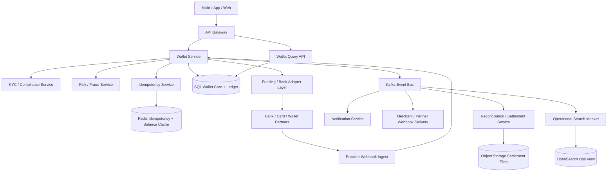
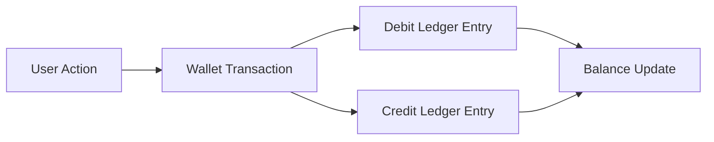
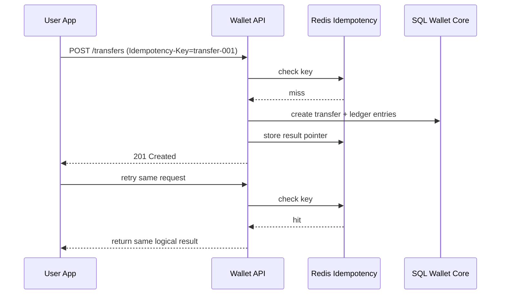
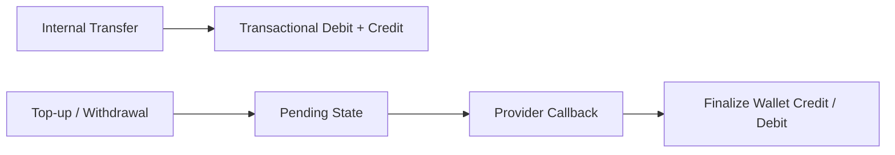
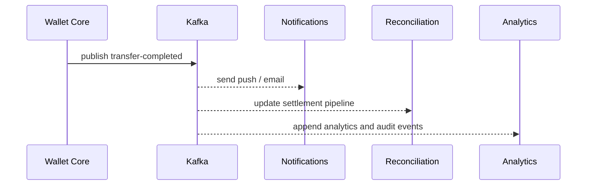
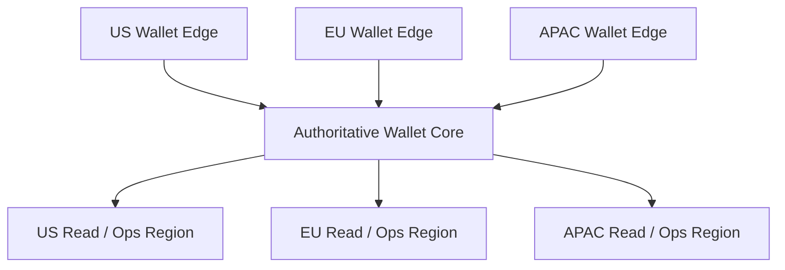

# Design Digital Wallet

Designing a digital wallet is a classic system design interview problem because it combines user-facing payments with balance management, strict money-state correctness, fraud controls, external bank integrations, and a durable ledger. Users expect the wallet to show the right balance instantly, let them add funds quickly, transfer money to other users, and pay merchants without duplicate debits. The difficulty is that wallet balances feel realtime, but the actual movement of money often depends on delayed bank rails, provider callbacks, chargebacks, and settlement jobs.

At a high level, the system has three distinct workloads. The first is the **wallet interaction path**, where users check balances, add money, transfer funds, pay merchants, and review transaction history. The second is the **money-state path**, where top-ups, transfers, holds, reversals, refunds, and withdrawals update the internal ledger and wallet balances. The third is the **external integration path**, where bank callbacks, KYC status changes, fraud decisions, and settlement files arrive asynchronously and must not corrupt the core source of truth. A good design keeps wallet balance transitions strongly consistent, makes every monetary write idempotent, and pushes notifications, analytics, and reconciliation off the synchronous money path.

---

## Functional Requirements

**In Scope:**
- Users can create and activate a wallet account linked to their profile
- Users can add money to the wallet using cards, bank accounts, or other linked funding sources
- Users can transfer wallet balance to other users instantly within the platform
- Users can pay merchants using wallet balance or a hybrid wallet plus external funding flow
- Users can withdraw eligible wallet balance back to linked bank accounts where supported
- The system stores transaction history, balance snapshots, funding source links, and payout status
- Operators can inspect failed transfers, top-up lag, webhook failures, suspicious behavior, and settlement mismatches
- The platform maintains an internal double-entry or equivalent ledger for all wallet balance movements

**Out of Scope:**
- Full core-banking internals for card networks or real-time payment rail operators
- Detailed regulatory compliance workflow documentation beyond essential KYC and AML state references
- Cryptocurrency custody or blockchain wallet internals
- Advanced personal finance features such as budgeting, lending, or wealth management
- Full merchant acquiring stack beyond the wallet payment surface and provider integrations it depends on

---

## Non-Functional Requirements

| Property | Target | Reasoning |
|---|---|---|
| **Balance Read Latency** | p99 < 100ms for wallet balance and recent transaction reads | balance is the primary user-visible surface and must feel instant |
| **Transfer Commit Latency** | p99 < 300ms for internal wallet-to-wallet transfers | peer transfers and merchant payments should feel immediate |
| **Correctness** | no double debit, double credit, or inconsistent balance under retries | money-state errors directly break user trust |
| **Durability** | no loss of ledger entries, wallet transactions, or provider callbacks after acknowledgement | wallets require defensible historical records |
| **Availability** | 99.99% for reads and core money APIs with graceful degradation for external rail failures | users expect wallet money to be accessible at all times |
| **Idempotency** | all unsafe money mutations must converge safely under retries | mobile clients, providers, and merchants all retry |
| **Auditability** | every balance change must be explainable from durable ledger history | support, finance, and compliance teams need traceability |
| **Scalability** | millions of active users and large campaign-driven spikes in payments and transfers | wallets often see synchronized spikes during salary days, sales, and promos |

**Key tradeoff:** the platform prioritizes **strongly consistent internal wallet balances and ledger integrity** over aggressive low-latency shortcuts. Reads can be cached carefully, but any operation that moves money must remain idempotent, transactional, and easy to reconcile later.

---

## Capacity Estimation

**User assumptions:**
- Assume **50M registered wallet users** and **8M daily active users**
- Peak concurrency may reach **1M active sessions** during promotions, bill-payment deadlines, or salary-credit periods
- Most sessions are balance checks and history reads, but the business-critical load comes from transfers, top-ups, and merchant payments

**Transaction assumptions:**
- Assume **25M money-moving transactions/day** across top-ups, merchant payments, refunds, withdrawals, and peer transfers
- That is roughly **290 transactions/sec average**, but peak windows can easily be **10x to 20x higher**
- Every logical transaction can expand into multiple writes: wallet transaction record, ledger entries, risk event, provider call record, and webhook events

**Read assumptions:**
- Balance reads and transaction-history loads outnumber writes by a wide margin
- Assume **200M balance or history reads/day**, especially after push notifications or transfers
- Hot users, merchants, and promo flows create extreme skew on a small number of accounts or destinations

**Operational profile:**
- External rails such as bank transfers and card top-ups have slower, more failure-prone behavior than internal wallet transfers
- Fraud-review workflows and KYC changes create asynchronous status transitions that may arrive after the user action began
- Reconciliation, settlement, and payout jobs create batch workloads that are separate from the realtime money path

---

## Core Entities

| Entity | Purpose | Key Fields | Relationships |
|---|---|---|---|
| **User** | Wallet owner identity | `user_id`, `phone`, `email`, `kyc_status` | owns one or more wallets and funding sources |
| **WalletAccount** | Stored-value account for a user | `wallet_id`, `user_id`, `currency`, `status`, `available_balance` | has transactions and ledger entries |
| **FundingSource** | Linked card or bank account token | `funding_source_id`, `user_id`, `provider_token_ref`, `type`, `status` | used for top-ups and withdrawals |
| **WalletTransaction** | User-visible money movement record | `transaction_id`, `wallet_id`, `transaction_type`, `amount`, `status`, `idempotency_key` | maps to one or more ledger entries |
| **Transfer** | Internal wallet-to-wallet movement | `transfer_id`, `source_wallet_id`, `destination_wallet_id`, `amount`, `status` | produces debit and credit entries |
| **MerchantPayment** | Wallet-based merchant checkout | `payment_id`, `wallet_id`, `merchant_id`, `amount`, `status`, `order_ref` | may use wallet-only or hybrid funding |
| **Refund** | Reversal back into the wallet | `refund_id`, `payment_id`, `wallet_id`, `amount`, `status` | tied to a prior payment or top-up |
| **LedgerEntry** | Accounting truth for balance changes | `entry_id`, `wallet_id`, `reference_type`, `reference_id`, `direction`, `amount` | multiple entries per business action |
| **SettlementBatch** | Aggregated provider or bank settlement artifact | `settlement_id`, `provider`, `window_start`, `window_end`, `status` | reconciles external movement with internal state |
| **WebhookDelivery** | Outbound event sent to merchants or partners | `delivery_id`, `event_type`, `destination`, `status`, `next_retry_at` | tracks asynchronous integration state |

**Critical modeling decisions:**
- `WalletTransaction` is not the accounting truth by itself. The wallet ledger must be the source of truth for money state and balance reconstruction.
- `Transfer` is separate from generic transaction history because a peer transfer creates both a debit and a credit and often needs richer participant metadata.
- `FundingSource` stores token references, never raw card or bank credentials, so the wallet system stays outside the most sensitive data surface wherever possible.

---

## Databases and Database Design

### Storage Tier Decisions

| Data | Access Pattern | Engine | Why |
|---|---|---|---|
| Users, wallets, funding sources, transactions, transfers, refunds, ledger metadata | transactional writes, exact reads, strong consistency | **PostgreSQL / MySQL** | wallet balance updates and money-state transitions need ACID semantics |
| Idempotency helpers, balance cache, short-lived locks, session state, rate limits | sub-millisecond reads/writes with TTLs | **Redis** | good fit for hot reads and duplicate suppression helpers |
| Transaction timelines, webhook history, support audit trails | append-heavy writes, wallet-scoped or user-scoped reads | **Cassandra / ScyllaDB** | useful for long immutable histories and support views |
| Money-movement events, notifications, webhook fanout, analytics, reconciliation pipelines | durable append-only backbone | **Kafka** | decouples the synchronous wallet core from downstream consumers |
| Settlement files, exports, reconciliation artifacts | immutable files and durable archives | **Object Storage** | settlement and compliance artifacts belong in cheap durable blob storage |
| Operational search over users, transactions, and investigations | filter-heavy operational queries | **OpenSearch** | helps support and risk teams without loading the primary database |

This is intentionally polyglot. A digital wallet needs **strongly consistent balance updates**, **fast hot-path helpers**, **durable asynchronous fanout**, **long-lived immutable histories**, and **blob storage for reconciliation artifacts**. A single database would force poor tradeoffs across those workloads.

### Schema 1 - Wallets and Funding Sources (SQL)

```sql
CREATE TABLE wallet_accounts (
  wallet_id                   UUID PRIMARY KEY DEFAULT gen_random_uuid(),
  user_id                     UUID NOT NULL,
  currency                    VARCHAR(8) NOT NULL,
  status                      VARCHAR(16) NOT NULL,
  available_balance_cents     BIGINT NOT NULL DEFAULT 0,
  created_at                  TIMESTAMPTZ DEFAULT NOW()
);

CREATE TABLE funding_sources (
  funding_source_id           UUID PRIMARY KEY DEFAULT gen_random_uuid(),
  user_id                     UUID NOT NULL,
  provider_token_ref          TEXT NOT NULL,
  source_type                 VARCHAR(32) NOT NULL,
  status                      VARCHAR(16) NOT NULL,
  created_at                  TIMESTAMPTZ DEFAULT NOW()
);
```

### Schema 2 - Wallet Transactions and Transfers (SQL)

```sql
CREATE TABLE wallet_transactions (
  transaction_id              UUID PRIMARY KEY DEFAULT gen_random_uuid(),
  wallet_id                   UUID NOT NULL REFERENCES wallet_accounts(wallet_id),
  transaction_type            VARCHAR(32) NOT NULL,
  amount_cents                BIGINT NOT NULL,
  currency                    VARCHAR(8) NOT NULL,
  status                      VARCHAR(24) NOT NULL,
  idempotency_key             TEXT NOT NULL,
  metadata_json               JSONB NOT NULL DEFAULT '{}'::jsonb,
  created_at                  TIMESTAMPTZ DEFAULT NOW(),
  UNIQUE (wallet_id, idempotency_key)
);

CREATE TABLE transfers (
  transfer_id                 UUID PRIMARY KEY DEFAULT gen_random_uuid(),
  source_wallet_id            UUID NOT NULL REFERENCES wallet_accounts(wallet_id),
  destination_wallet_id       UUID NOT NULL REFERENCES wallet_accounts(wallet_id),
  amount_cents                BIGINT NOT NULL,
  currency                    VARCHAR(8) NOT NULL,
  status                      VARCHAR(24) NOT NULL,
  created_at                  TIMESTAMPTZ DEFAULT NOW()
);
```

### Schema 3 - Ledger Entries (SQL)

```sql
CREATE TABLE ledger_entries (
  entry_id                    UUID PRIMARY KEY DEFAULT gen_random_uuid(),
  wallet_id                   UUID NOT NULL REFERENCES wallet_accounts(wallet_id),
  reference_type              VARCHAR(32) NOT NULL,
  reference_id                UUID NOT NULL,
  account_code                VARCHAR(64) NOT NULL,
  direction                   VARCHAR(8) NOT NULL,
  amount_cents                BIGINT NOT NULL,
  currency                    VARCHAR(8) NOT NULL,
  created_at                  TIMESTAMPTZ DEFAULT NOW()
);
```

### Schema 4 - Wallet Event Timeline (Cassandra)

```sql
CREATE TABLE wallet_events_by_wallet (
  wallet_id                   UUID,
  bucket_day                  TEXT,
  created_at                  TIMESTAMP,
  event_id                    UUID,
  event_type                  TEXT,
  actor_type                  TEXT,
  payload_json                TEXT,
  PRIMARY KEY ((wallet_id, bucket_day), created_at, event_id)
) WITH CLUSTERING ORDER BY (created_at DESC, event_id DESC);
```

Daily buckets keep very active wallets bounded and replay-friendly.

### Schema 5 - Settlement Manifest (Object Storage JSON)

```json
{
  "settlement_id": "set_123",
  "provider": "bank_partner_x",
  "window_start": "2026-06-03T00:00:00Z",
  "window_end": "2026-06-03T23:59:59Z",
  "files": [
    "s3://wallet-settlements/bank_partner_x/2026-06-03/report-001.csv"
  ],
  "expected_credit_cents": 182000000,
  "expected_debit_cents": 179500000
}
```

### Schema 6 - Idempotency Record (Logical Redis Record)

```json
{
  "key": "idem:wallet_123:transfer:req-001",
  "value": {
    "transaction_id": "txn_456",
    "status": "completed",
    "expires_at": "2026-06-04T10:00:00Z"
  }
}
```

### Sharding and Replication Strategy

| Store | Shard Key | Strategy | Replication |
|---|---|---|---|
| SQL wallet core | `wallet_id` or `user_region` | logical wallet shards as user count grows | primary + replicas with strong write durability |
| Redis | `wallet_id`, `user_id`, `idempotency_key` | Redis Cluster | 1 replica per master |
| Kafka | `wallet_id`, `user_id`, or `merchant_id` depending on topic | partitioned durable log | RF=3 |
| Cassandra | `(wallet_id, bucket_day)` | consistent hashing across nodes | RF=3, `LOCAL_QUORUM` |
| OpenSearch | wallet and date routing | replicated operational search cluster | multi-node replicas |
| Object Storage | provider/date or export namespace | immutable manifests and artifacts | multi-AZ durable storage |

**Consistency model:**
- Strong consistency for wallet balance transitions, internal transfers, merchant payments, refunds, and withdrawals
- Durable ordered append for downstream events once the wallet core commits and publishes to Kafka
- Eventual consistency for notifications, support indexes, analytics, and secondary operational dashboards
- Best-effort low-latency consistency for Redis-backed balance caches and idempotency helpers

**Read/write patterns:**
- **Internal transfer path:** validate source balance -> write debit and credit ledger entries transactionally -> update wallet balances -> return success immediately
- **Top-up path:** create pending wallet transaction -> call external provider -> finalize wallet credit only after successful provider outcome -> publish events
- **Settlement path:** import provider or bank reports -> compare against internal ledger and transactions -> create reconciliation exceptions if mismatched

---

## API Design

**Create a wallet:**
```http
POST /v1/wallets
Authorization: Bearer <jwt>

{
  "currency": "INR"
}

201 Created
{
  "wallet_id": "wal_123",
  "currency": "INR",
  "status": "active",
  "available_balance_cents": 0
}
```

**Get wallet balance:**
```http
GET /v1/wallets/wal_123
Authorization: Bearer <jwt>

200 OK
{
  "wallet_id": "wal_123",
  "currency": "INR",
  "available_balance_cents": 9200,
  "status": "active"
}
```

**Top up a wallet:**
```http
POST /v1/wallets/wal_123/top-ups
Authorization: Bearer <jwt>
Idempotency-Key: topup-001

{
  "funding_source_id": "fs_777",
  "amount_cents": 50000
}

202 Accepted
{
  "transaction_id": "txn_456",
  "status": "pending"
}
```

**Transfer funds to another user:**
```http
POST /v1/transfers
Authorization: Bearer <jwt>
Idempotency-Key: transfer-001

{
  "source_wallet_id": "wal_123",
  "destination_wallet_id": "wal_999",
  "amount_cents": 2500,
  "currency": "INR"
}

201 Created
{
  "transfer_id": "tr_333",
  "status": "completed"
}
```

**Pay a merchant with wallet balance:**
```http
POST /v1/merchant-payments
Authorization: Bearer <jwt>
Idempotency-Key: pay-001

{
  "wallet_id": "wal_123",
  "merchant_id": "mrc_555",
  "amount_cents": 3400,
  "order_ref": "ord_998"
}

201 Created
{
  "payment_id": "pay_222",
  "status": "completed"
}
```

**Handle provider webhook for top-up or withdrawal:**
```http
POST /v1/providers/bank-partner/webhook
X-Signature: abcdef123456

{
  "event_type": "topup.succeeded",
  "provider_ref": "prov_111",
  "transaction_id": "txn_456"
}

202 Accepted
```

**Fetch wallet transaction history (cursor-paginated):**
```http
GET /v1/wallets/wal_123/transactions?before=2026-06-03T10:00:00Z&limit=50
Authorization: Bearer <jwt>

200 OK
{
  "transactions": [
    {
      "transaction_id": "txn_456",
      "transaction_type": "top_up",
      "status": "completed",
      "amount_cents": 50000
    }
  ],
  "next_cursor": "2026-06-03T09:55:00Z",
  "has_more": true
}
```

> Cursor-based pagination on creation time is preferred. Offset pagination (`?page=N`) becomes unstable and expensive for large wallet histories and constantly arriving new transactions.

**Balance update stream (optional SSE):**
```http
GET /v1/wallets/wal_123/stream
Authorization: Bearer <jwt>
Accept: text/event-stream
```
The core digital-wallet product does not require WebSockets for standard money flows. REST plus push notifications and optional SSE are usually enough for balance refreshes, transaction completion, and merchant settlement views.

---

## High-Level Design



**Component responsibilities:**

| Component | Role |
|---|---|
| **API Gateway** | Authentication, rate limiting, request validation, and routing |
| **Wallet Service** | Owns wallet balance transitions, transfers, merchant payments, and transaction state |
| **Wallet Query API** | Serves balance reads, history, and transaction lookups efficiently |
| **KYC / Compliance Service** | Validates eligibility for top-ups, withdrawals, limits, and regulatory checks |
| **Risk / Fraud Service** | Scores suspicious transfers, velocity spikes, and merchant payment patterns |
| **Idempotency Service** | Prevents duplicate debits, credits, top-ups, and refunds under retries |
| **SQL Wallet Core + Ledger** | Source of truth for balances, transactions, and accounting entries |
| **Funding / Bank Adapter Layer** | Normalizes external provider APIs for cards, bank accounts, and payout rails |
| **Provider Webhook Ingest** | Verifies callback signatures and routes external outcomes into the wallet state machine |
| **Kafka** | Durable fanout for notifications, reconciliation, analytics, and partner webhooks |
| **Reconciliation / Settlement Service** | Matches provider-side reports with internal wallet and ledger state |
| **Redis** | Holds idempotency helpers, short-lived locks, and safe balance caches |

**Wallet money flow:**
1. User initiates a top-up, transfer, or merchant payment through the API Gateway
2. Wallet Service validates KYC, wallet status, balance rules, and idempotency before moving money
3. For internal transfers, the wallet core debits and credits affected wallets transactionally in SQL and writes matching ledger entries
4. For external top-ups or withdrawals, the provider adapter interacts with the bank or card partner and the wallet finalizes balance changes only after the provider outcome is accepted
5. Kafka publishes downstream events for notifications, merchant callbacks, analytics, and reconciliation without slowing the correctness-critical money commit path
6. Later provider callbacks and settlement jobs feed back into the same idempotent state machine rather than mutating balances out of band

---

## Deep Dives

### 1. Ledger and Balance Correctness: The Core Problem

The hardest problem in a digital wallet is not showing a balance in the UI. It is ensuring that every credit, debit, refund, transfer, and reversal is represented correctly and exactly once. If the balance drifts from the underlying accounting truth, the wallet quickly becomes impossible to trust or reconcile.



**Why the problem happens:** wallet balances are derived from many overlapping money movements, some internal and some external.

**Why it becomes difficult at scale:**
- retries can create duplicate requests from clients and providers
- refunds, chargebacks, and reversals may arrive much later than the original action
- supporting transfers, merchant payments, and withdrawals means different lifecycle rules for different transaction types

**Production-grade solutions:**
- model every money movement as append-only ledger entries plus a user-visible transaction record
- write ledger entries and balance changes atomically in the wallet core
- prevent balance from being derived only from mutable status fields or caches
- reconcile ledger totals regularly against wallet balance projections and external settlements

**Tradeoffs:** a real ledger adds complexity, but without it the wallet cannot support trustworthy balances, refunds, or audits.

### 2. Idempotency: Required for Every Unsafe Money Mutation

Mobile networks are unreliable, users retry aggressively, and providers resend callbacks. That means duplicate handling is not optional. Every top-up, transfer, payment, withdrawal, and refund endpoint must behave idempotently.



**Why the problem happens:** retries happen at the client, gateway, provider, and webhook-delivery layers.

**Why it becomes difficult at scale:**
- internal and external retries can overlap in unpredictable ways
- a request can time out after the provider processed it but before the client saw the response
- duplicate suppression must work across several kinds of operations, not just one endpoint

**Production-grade solutions:**
- require idempotency keys for all unsafe wallet mutations
- enforce uniqueness in the SQL core and use Redis as a fast duplicate lookup helper
- key provider callbacks by stable provider event ids and references
- return the previous logical result rather than attempting to re-execute side effects

**Tradeoffs:** idempotency adds lookup cost and storage overhead, but it is the main defense against double debit and duplicate top-up errors.

### 3. Internal Transfers Versus External Top-Ups and Withdrawals

An internal wallet-to-wallet transfer is fundamentally different from a top-up from a bank or a withdrawal back to a bank account. Internal transfers can be finalized synchronously inside the wallet core. External movements depend on systems the wallet does not control and may complete later.



**Why the problem happens:** not every money movement has the same finality model.

**Why it becomes difficult at scale:**
- external rails can fail, delay, or partially succeed
- users expect a simple unified transaction history across both synchronous and asynchronous flows
- incorrect early crediting can create balance risk if a provider later rejects the funding attempt

**Production-grade solutions:**
- finalize internal wallet transfers synchronously inside one transactional boundary
- treat external top-ups and withdrawals as pending until the provider outcome reaches a committed state
- surface explicit transaction states such as `pending`, `completed`, `failed`, and `reversed`
- reconcile provider outcomes continuously against internal pending transactions

**Tradeoffs:** delaying external finality protects the wallet from balance risk, but it means the UX must explain pending states clearly.

### 4. Kafka: Valuable, but Keep It Off the Balance Decision Path

Kafka is very useful in a digital wallet, but it should not decide whether a balance changed. The authoritative answer belongs in the transactional wallet core and ledger. Kafka becomes valuable after commit for notifications, merchant callbacks, analytics, fraud feedback, and reconciliation.



**Why the problem happens:** one completed wallet action creates many downstream side effects with different SLAs.

**Why it becomes difficult at scale:**
- notifications and partner callbacks can be slow or broken
- analytics and reconciliation often run behind realtime user expectations
- some events need replay after bugs, outages, or changed downstream logic

**Production-grade solutions:**
- publish immutable domain events only after the SQL commit succeeds
- partition Kafka by `wallet_id`, `user_id`, or `merchant_id` depending on ordering needs
- keep notifications, analytics, and reconciliation fully off the synchronous balance-update path
- support replay and dead-letter handling for unstable downstream consumers

**Tradeoffs:** Kafka improves decoupling and replayability, but it must remain downstream of the correctness-critical money state.

### 5. Redis: Useful for Speed, Unsafe as the Only Truth

Redis helps with balance caching, idempotency lookups, short-lived locks, and rate limiting, but it must never become the only source of truth for available balance or transaction state. If Redis is lost, the platform should get slower, not wrong.

| Redis Use | Example Key | Why Redis Fits |
|---|---|---|
| **Idempotency helper** | `idem:wallet_123:transfer:req-001` | duplicate suppression needs fast hot-path lookups |
| **Balance cache** | `wallet:wal_123:balance` | repeated balance reads benefit from short-lived cached values |
| **Short-lived lock** | `lock:wallet:wal_123:debit` | prevents conflicting concurrent money actions briefly |
| **Rate limiting** | `rl:user:usr_456:payments` | protects hot money APIs from abuse or buggy clients |

**Why the problem happens:** wallet traffic includes many repeated small reads and retry-heavy write attempts.

**Why it becomes difficult at scale:**
- popular wallets or merchant promotions can create hot keys and retry storms
- stale balance caches can confuse users if invalidation is weak
- long-lived locks can accidentally block legitimate spending if TTLs are wrong

**Production-grade solutions:**
- keep SQL and ledger validation as the hard correctness barrier
- use Redis only as an accelerator and short-lived coordination layer
- invalidate or refresh balance caches immediately after committed money-state changes
- keep lock TTLs small and always verify against durable state before making final decisions

**Tradeoffs:** Redis reduces latency and hot-path database pressure, but over-relying on it creates subtle money-correctness risks.

### 6. Fraud, KYC, and Limits: Wallets Need a Policy Layer

Wallet systems are attractive targets for abuse: mule accounts, velocity attacks, stolen cards, bonus abuse, and rapid cash-out flows. A wallet cannot be only a ledger and payment router. It needs policy checks around account eligibility, transaction limits, and suspicious patterns.

**Why the problem happens:** stored value and instant transfers make wallets an attractive abuse surface.

**Why it becomes difficult at scale:**
- fraud signals are often probabilistic and asynchronous
- false positives hurt legitimate users during sensitive money flows
- regulatory rules may vary by country, tier, identity verification level, and transaction amount

**Production-grade solutions:**
- evaluate KYC status, account tier, velocity limits, and fraud scores before approving risky actions
- support soft holds or manual review states for suspicious transactions
- separate hard money-state correctness from policy evaluation so the rules engine can evolve independently
- log fraud decisions and reasons for supportability and auditability

**Tradeoffs:** stronger risk controls reduce abuse loss, but they increase latency, false positives, and product complexity.

### 7. Reconciliation and Settlement: Money Outside the Wallet Still Matters

Even if internal transfers are instant, the wallet still depends on external settlement for top-ups, withdrawals, and merchant payouts. That means the internal ledger must be reconciled against bank or provider reports continuously. A user-visible completed transaction is not enough evidence that the external money rail behaved correctly.

**Why the problem happens:** internal balance movement and external final settlement are related but not identical.

**Why it becomes difficult at scale:**
- provider reports can be delayed, duplicated, corrected, or incomplete
- partial failures and retries complicate matching logic
- mismatches represent real financial exposure, not just reporting issues

**Production-grade solutions:**
- ingest settlement files into durable storage and compare them with internal transactions and ledger aggregates
- create explicit reconciliation jobs and exception queues for mismatches
- track pending external movements separately from finalized internal movements
- preserve immutable evidence for finance, support, and compliance teams

**Tradeoffs:** reconciliation adds batch complexity and operational overhead, but skipping it leaves the wallet blind to real money discrepancies.

### 8. WebSockets: Usually Optional for Core Wallet Flows

Most wallet workflows are request-response plus notifications. Users top up, transfer, pay, and then fetch current state or receive push updates. Some balance screens may benefit from live refresh, but the core wallet does not require WebSockets.

**Why the problem happens:** wallet actions feel realtime even though their core lifecycle is not socket-driven.

**Why it becomes difficult at scale:**
- persistent sockets add statefulness without helping most money mutations
- external rails and fraud checks are asynchronous anyway
- push notifications and SSE often satisfy the user need for refresh without a bidirectional connection

**Production-grade solutions:**
- keep the main user and merchant contract centered on REST APIs and webhooks
- use SSE or push notifications for balance refreshes or transaction completion when needed
- reserve WebSockets for internal ops consoles or special live experiences, not the default architecture
- design APIs so polling plus notifications is sufficient for the main lifecycle

**Tradeoffs:** avoiding WebSockets simplifies the platform, but some internal monitoring and live-support surfaces may be slightly less immediate.

### 9. Multi-Region Serving and Write Authority

Wallet products are often global, but money-state writes need a clear authority. Active-active writes without careful partitioning can create duplicate debits or divergent balances. In most practical systems, regional edges serve users close to them while a tighter authoritative write domain owns each wallet shard.



**Why the problem happens:** users want low-latency global access, but wallet correctness requires tightly controlled writes.

**Why it becomes difficult at scale:**
- cross-region retries and failovers can duplicate money mutations if idempotency is weak
- some funding sources and compliance rules are region-specific
- a wallet system is less tolerant of split-brain state than most consumer platforms

**Production-grade solutions:**
- terminate API traffic regionally close to users, but route unsafe writes to the authoritative shard for that wallet or region
- replicate read models and support indexes more broadly than the core balance-write path
- use strong idempotency keys and provider references across regional failovers
- keep compliance, settlement, and provider connectivity policies explicit per region

**Tradeoffs:** global edges improve latency, but the core balance-write path still needs one authoritative owner to remain safe.

### 10. Architecture Evolution

| Stage | Design | Why It Breaks | Next Step |
|---|---|---|---|
| **1. MVP** | Single database, simple top-up and transfer API, basic balance field | retries, refunds, and external callbacks quickly create duplicate and accounting problems | add ledger-backed balances, idempotency, and callback handling |
| **2. Growth** | Separate wallet service, provider adapters, notifications, and Kafka fanout | fraud, settlement mismatches, and merchant scale stress shared components | add reconciliation, stronger risk controls, and tenant isolation |
| **3. Scale** | Sharded wallet core, ledger-backed balances, reconciliation pipeline, and ops search | hot users, regional complexity, and provider diversity dominate operations | regionalize edges, shard write ownership, and harden failover and replay |
| **4. Mature Wallet Platform** | Strong wallet core, multiple funding rails, reconciliation controls, and rich observability | the hard problems shift to compliance breadth, abuse prevention, and cost | keep money-state logic small and evolve derived systems independently |

This is the interview pattern to emphasize: separate user-visible wallet transactions from ledger truth, make every money mutation idempotent, keep internal transfers strongly consistent, treat external rails as asynchronous and reconciliation-heavy, and use Kafka, Redis, notifications, and support indexes to scale everything around that correctness-critical wallet core.
