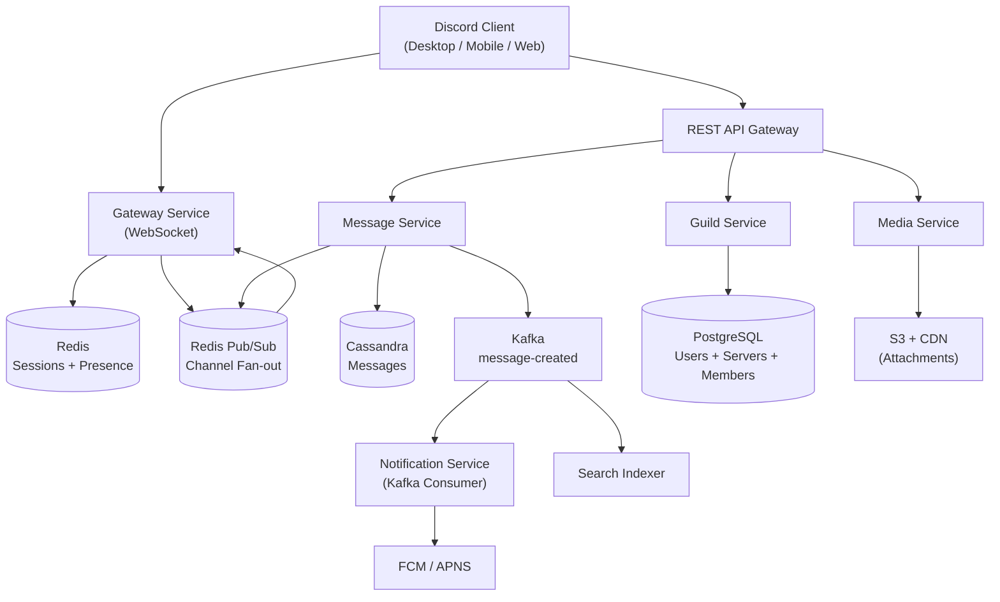
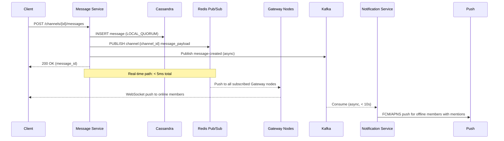
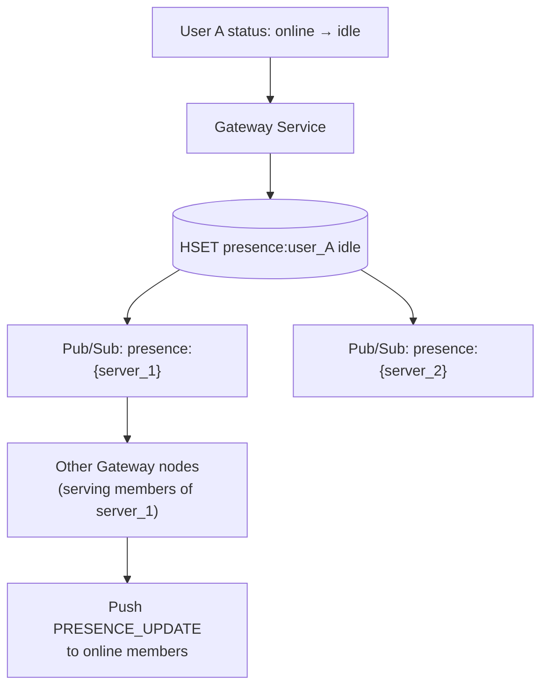
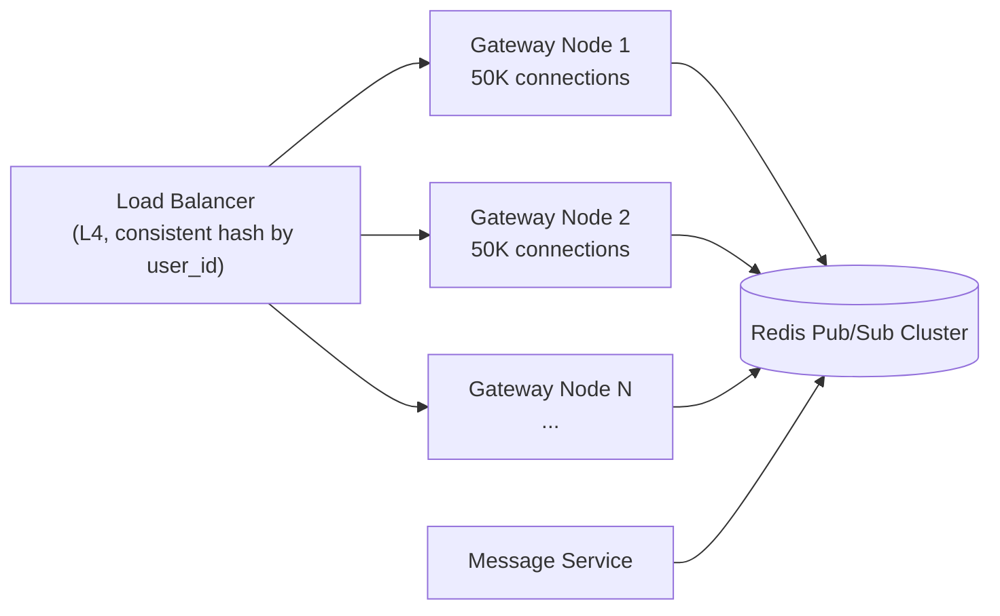
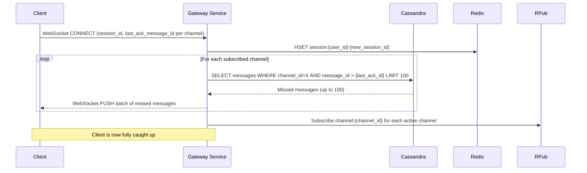
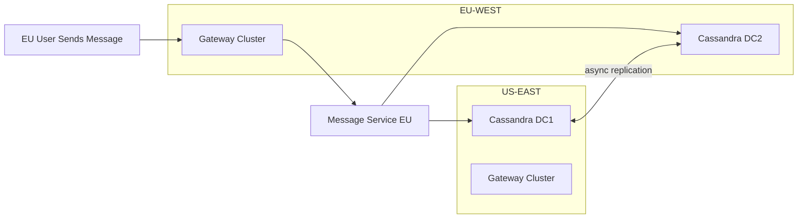

# Design Discord

Discord is a real-time communication platform with **200 million monthly active users**, **19 million active servers**, and billions of messages sent per day. Users join persistent **servers** (communities), organized into text channels and voice channels. They send messages, share media, and talk via low-latency audio/video — all in real time.

Discord looks like a chat app, but it is architecturally closer to a **multiplayer game server** than a messaging platform. The core challenge is: how do you deliver every message to thousands of simultaneously connected users in the same channel within milliseconds, maintain message ordering, handle offline delivery, and scale to millions of concurrent WebSocket connections — without dropping a single message?

This problem tests real-time fan-out at scale, WebSocket connection management, message ordering guarantees, Cassandra time-series storage, and the subtle challenge of **presence** — knowing who is online across millions of servers.

---

## Functional Requirements

**In Scope:**
- Send and receive text messages in server channels (persistent, paginated history)
- Direct Messages (DMs): 1:1 and group DMs (up to 10 users)
- Real-time message delivery to all online channel members
- Offline message delivery: users who reconnect see missed messages
- Join and leave servers; create and manage channels within a server
- Reactions: emoji reactions on messages
- File and image uploads in channels
- Presence: show online/offline/idle/DND status per user
- Push notifications for mentions (@user) and DMs when offline
- Voice channels: real-time audio (join/leave; not PSTN calling)

**Out of Scope:**
- Voice/video WebRTC media server design (separate infrastructure)
- Server discovery and recommendation algorithm
- Nitro subscription and payment billing
- Bot API and bot framework
- Moderation tools and content safety pipeline
- Screen sharing encoding pipeline

---

## Non-Functional Requirements

| Property | Target | Reasoning |
|---|---|---|
| **Message Delivery Latency** | p99 < 100ms (same region) | Real-time chat feel; > 200ms feels laggy |
| **Message Ordering** | Per-channel causal ordering | Messages in a channel must appear in send order for all users |
| **Availability** | 99.99% for message send and receive | Discord downtime during gaming sessions is highly visible and causes churn |
| **Durability** | Zero message loss after acknowledgment | Users expect chat history to be permanent |
| **Offline Delivery** | 100% — all messages visible on reconnect | Unlike ephemeral chat, Discord is a persistent archive |
| **Presence Freshness** | < 5s staleness | Showing a user as online 10 minutes after they left is confusing |
| **Concurrent Connections** | 8M+ simultaneous WebSocket connections | 200M MAU; peak concurrency ~4% of MAU |
| **Fan-out** | Up to 250K members per server (community servers) | A single message in a large server triggers 250K WebSocket pushes |

**The defining tradeoff:** Discord's fan-out is uniquely hard because servers have **shared, persistent channels** — unlike Twitter (followee → follower, asymmetric) or WhatsApp (1:1 or small group). A 250,000-member community server with an active #general channel means every message must fan out to potentially 250K concurrent connections. This is solved by a **Gateway → Session Server → Pub/Sub** architecture where the message never touches individual connections directly.

---

## Capacity Estimation

**Messages:**
- ~4B messages/day → ~46,000/sec average; ~140,000/sec peak (3×, evening gaming hours)
- Average message: ~500 bytes (text + metadata)
- 4B × 500B = **~2 TB/day** raw message data
- With attachments: ~100M file uploads/day × 500KB avg = **~50 TB/day** media

**WebSocket connections:**
- 200M MAU × ~4% peak concurrency = **~8M simultaneous WebSocket connections**
- Average server membership per user: ~7 servers
- 8M users × 7 servers = 56M server-user membership tuples in active memory

**Fan-out:**
- 46,000 messages/sec; average channel has 500 online members
- 46,000 × 500 = **~23M WebSocket pushes/sec** — the dominant write workload

**Presence updates:**
- Status change rate: ~1M presence events/min → ~17,000/sec

**Storage sizing:**
- Messages retained indefinitely; Cassandra time-series partitioned by month
- 2 TB/day × 365 = **~730 TB/year** of message data
- Cassandra RF=3 → **~2.2 PB/year** raw storage across cluster

---

## Core Entities

| Entity | Purpose | Key Fields |
|---|---|---|
| **User** | Account and profile | `user_id`, `username`, `discriminator`, `avatar_url`, `email`, `status` (online/idle/dnd/offline), `created_at` |
| **Server** (Guild) | A community with channels and members | `server_id`, `name`, `owner_id`, `icon_url`, `region`, `member_count`, `created_at` |
| **Channel** | A text or voice room within a server | `channel_id`, `server_id`, `name`, `type` (text/voice/dm), `position`, `last_message_id` |
| **Message** | A single chat message | `message_id` (Snowflake), `channel_id`, `author_id`, `content`, `attachments[]`, `embeds[]`, `reactions{}`, `edited_at`, `created_at` |
| **ServerMember** | A user's membership in a server | `server_id`, `user_id`, `roles[]`, `nickname`, `joined_at` |
| **Reaction** | An emoji reaction on a message | `message_id`, `emoji`, `user_ids[]` (or count) |
| **Attachment** | Uploaded file or image | `attachment_id`, `message_id`, `url`, `filename`, `size_bytes`, `content_type` |
| **Session** | An active WebSocket connection | `session_id`, `user_id`, `gateway_node`, `subscribed_channels[]`, `created_at` |
| **Presence** | User's current online status and activity | `user_id`, `status`, `activity`, `client_type` (desktop/mobile/web), `updated_at` |

**Critical modeling decisions:**
- `message_id` uses **Snowflake IDs** — 64-bit timestamp-based, globally unique, time-sortable. Range queries on `message_id` are equivalent to range queries on `created_at` — no secondary index needed for message history pagination.
- `Channel.last_message_id` is a **denormalized pointer** to the most recent message. Clients use this to detect unread messages without scanning message history: if `last_message_id > user's last_read_message_id`, the channel has unread messages.
- `Session` is an in-memory entity (Redis), not a database record — it represents a live WebSocket connection. Sessions expire when the connection drops.
- `Reaction` stores `user_ids[]` as a list (for "who reacted") and a separate count. For messages with many reactions, the list is capped and "X others" is shown.

---

## Databases and Database Design

### Storage Tier Decisions

| Data | Access Pattern | Engine | Why |
|---|---|---|---|
| Messages | Append-only writes; paginated reads by channel+time | **Cassandra** | Time-series; partition by `(channel_id, bucket)`; append-only fits LSM tree perfectly |
| Users | Point reads by `user_id` or `username`; low write volume | **PostgreSQL** | ACID; relational integrity; fits at 200M users with sharding |
| Servers and Channels | Read-heavy; infrequent updates | **PostgreSQL** | Simple relational model; 19M servers trivially fits |
| Server membership | Per-server scan (fan-out target list); per-user scan | **PostgreSQL** | Partition by `server_id` for fan-out; index on `user_id` for user's server list |
| Sessions (active connections) | Sub-ms read/write; ephemeral | **Redis** | In-memory; TTL-based expiry; `HSET session:{user_id}` |
| Presence | Frequent updates; per-server fan-out on change | **Redis** | Ephemeral; `HSET presence:{user_id}`; pub/sub for fan-out |
| Read state (last read per channel) | Per-user-channel write on every message read | **Redis** | High-frequency writes; eventual durability via periodic flush to PostgreSQL |
| Attachments / media | Write-once, read-many; global delivery | **S3 + CDN** | Object storage; CDN for edge delivery |
| Unread counts | Per-user-server badge counts | **Redis** | Atomic INCR; flush to PostgreSQL periodically |

### Schema 1 — Messages (Cassandra)

```sql
CREATE TABLE messages (
  channel_id   BIGINT,
  bucket       INT,          -- time bucket: Unix timestamp / 10_000_000 (~115 days per bucket)
  message_id   BIGINT,       -- Snowflake; sortable by time
  author_id    BIGINT,
  content      TEXT,
  attachments  LIST<TEXT>,   -- JSON attachment metadata
  reactions    MAP<TEXT, INT>,  -- emoji → count
  edited_at    TIMESTAMP,
  deleted_at   TIMESTAMP,
  PRIMARY KEY ((channel_id, bucket), message_id)
) WITH CLUSTERING ORDER BY (message_id DESC)
  AND compaction = { 'class': 'TimeWindowCompactionStrategy',
                     'compaction_window_unit': 'DAYS',
                     'compaction_window_size': 7 };
```

**Why the bucket:** Without bucketing, a channel with 5 years of history accumulates hundreds of millions of rows in a single Cassandra partition — unbounded growth, slow compaction, GC pressure. Bucketing by `Unix_timestamp / 10_000_000` caps each partition at ~115 days of messages. Pagination that crosses a bucket boundary queries two partitions — a minor tradeoff for manageable partition size.

**TimeWindowCompactionStrategy:** Discord's messages are a time-series — old messages are rarely written to (only edits and deletes). TWCS groups SSTables by time window and compacts them together, reducing write amplification compared to STCS. Old windows compact cleanly once and are never touched again.

### Schema 2 — Users and Servers (PostgreSQL)

```sql
CREATE TABLE users (
  user_id         BIGINT       PRIMARY KEY,    -- Snowflake
  username        VARCHAR(32)  NOT NULL,
  discriminator   CHAR(4)      NOT NULL,        -- the #0001 suffix; for uniqueness
  email           VARCHAR(255) UNIQUE NOT NULL,
  avatar_url      TEXT,
  created_at      TIMESTAMPTZ  DEFAULT NOW(),
  UNIQUE (username, discriminator)
);

CREATE TABLE servers (
  server_id    BIGINT       PRIMARY KEY,
  name         VARCHAR(100) NOT NULL,
  owner_id     BIGINT       NOT NULL REFERENCES users(user_id),
  icon_url     TEXT,
  region       VARCHAR(20),
  member_count INT          DEFAULT 0,
  created_at   TIMESTAMPTZ  DEFAULT NOW()
);

CREATE TABLE channels (
  channel_id  BIGINT       PRIMARY KEY,
  server_id   BIGINT       REFERENCES servers(server_id),
  name        VARCHAR(100) NOT NULL,
  type        SMALLINT     NOT NULL,   -- 0:text 1:voice 2:dm
  position    SMALLINT     NOT NULL,
  last_message_id BIGINT,
  created_at  TIMESTAMPTZ  DEFAULT NOW()
);
```

### Schema 3 — Server Membership (PostgreSQL)

```sql
CREATE TABLE server_members (
  server_id   BIGINT      NOT NULL,
  user_id     BIGINT      NOT NULL,
  nickname    VARCHAR(32),
  roles       BIGINT[]    DEFAULT '{}',
  joined_at   TIMESTAMPTZ DEFAULT NOW(),
  PRIMARY KEY (server_id, user_id)
);

-- For "what servers is user X in?" query (fan-out subscription at connect)
CREATE INDEX idx_members_user ON server_members (user_id, server_id);
```

`PRIMARY KEY (server_id, user_id)` — the hot read path for fan-out is "get all members of server X" — a single partition scan. `idx_members_user` enables the login-time query "get all servers this user belongs to" without a full table scan.

### Schema 4 — Sessions and Presence (Redis)

```
-- Active session per user (one per WebSocket connection; a user can have multiple)
HSET session:{user_id}:{session_id}
  gateway_node  "gateway-us-east-42"
  connected_at  "1717000000000"
  subscriptions "ch_1,ch_2,ch_3"     -- comma-separated channel IDs
EXPIRE session:{user_id}:{session_id} 300   -- 5-min TTL; refreshed on heartbeat

-- Presence state per user
HSET presence:{user_id}
  status       "online"    -- online | idle | dnd | offline
  activity     "Playing Valorant"
  client_type  "desktop"
  updated_at   "1717000000000"
EXPIRE presence:{user_id} 300
```

### Schema 5 — Read State (Redis → PostgreSQL)

```
-- Per-user, per-channel last-read message ID
HSET read_state:{user_id}   {channel_id}   {last_read_message_id}

-- Unread count badge per server
HSET unread:{user_id}   {server_id}   {unread_count}
HINCRBY unread:{user_id}   {server_id}   1    -- on each new message in any channel

-- Periodic flush (every 30s) to PostgreSQL for durability
-- If Redis restarts, rebuild from PostgreSQL snapshot
```

### Sharding and Replication

| Store | Shard Key | Replication |
|---|---|---|
| Cassandra (messages) | `(channel_id, bucket)` — Murmur3 | RF=3; LOCAL_QUORUM writes and reads; 2 DCs |
| PostgreSQL (users, servers, members) | `user_id` / `server_id` range sharding | Primary + 2 read replicas; synchronous replication |
| Redis (sessions, presence, read state) | `user_id` — Redis Cluster hash slots | 1 replica per shard; Sentinel for failover |
| S3 (attachments) | Managed (AWS object storage) | Cross-region replication |

---

## API Design

**Send a message:**
```http
POST /v1/channels/{channel_id}/messages
Authorization: Bearer <token>
Idempotency-Key: client-nonce-abc123

{
  "content": "Anyone up for ranked?",
  "attachments": []
}

200 OK
{
  "message_id": "1234567890123456789",
  "channel_id": "987654321",
  "author": { "user_id": "111", "username": "alice#0042" },
  "content": "Anyone up for ranked?",
  "created_at": "2026-05-29T10:00:00.000Z"
}
```

**Get message history (cursor-paginated, before a given message_id):**
```http
GET /v1/channels/{channel_id}/messages?limit=50&before=1234567890123456789
Authorization: Bearer <token>

200 OK
[
  {
    "message_id": "1234567890000000000",
    "author": { "user_id": "222", "username": "bob#1337" },
    "content": "Yeah let's go!",
    "reactions": { "👍": 3, "🎮": 1 },
    "created_at": "2026-05-29T09:59:55.000Z"
  },
  ...
]
// 50 messages; sorted DESC by message_id (newest first in the page, oldest at bottom)
```

**React to a message:**
```http
PUT /v1/channels/{channel_id}/messages/{message_id}/reactions/{emoji}/@me
Authorization: Bearer <token>

204 No Content
// UPSERT into reactions; idempotent — re-adding same reaction is no-op
```

**Mark channel as read:**
```http
POST /v1/channels/{channel_id}/messages/{message_id}/ack
Authorization: Bearer <token>

{ }

204 No Content
// HSET read_state:{user_id} {channel_id} {message_id} in Redis
// Resets unread badge count for this channel
```

**Get server with channels:**
```http
GET /v1/guilds/{server_id}
Authorization: Bearer <token>

200 OK
{
  "server_id": "987654321",
  "name": "Gaming Lounge",
  "member_count": 12540,
  "channels": [
    { "channel_id": "111", "name": "general", "type": 0, "last_message_id": "1234567890123456789" },
    { "channel_id": "222", "name": "voice-1", "type": 1 }
  ]
}
```

**Update presence:**
```http
-- Sent over WebSocket (not REST); part of the Gateway protocol
{ "op": 3, "d": { "status": "dnd", "activities": [{ "name": "Valorant", "type": 0 }] } }
// Server updates presence:{user_id} in Redis; fans out to all servers the user is in
```

---

## High-Level Design



**Component responsibilities:**

| Component | Role |
|---|---|
| **Gateway Service** | Maintains WebSocket connections; authenticates sessions; handles presence updates; subscribes to Redis Pub/Sub channels on behalf of connected users |
| **Message Service** | Validates and persists messages to Cassandra; fans out to Redis Pub/Sub; publishes to Kafka for async consumers |
| **Guild Service** | Manages servers, channels, membership; serves server/channel metadata |
| **Media Service** | Generates pre-signed S3 upload URLs; processes uploaded files; returns CDN URLs |
| **Notification Service** | Kafka consumer; sends push notifications for mentions and DMs to offline users |
| **Search Indexer** | Kafka consumer; indexes message content for in-server search |
| **Redis Pub/Sub** | The real-time message bus between Message Service (publisher) and Gateway nodes (subscribers) |

---

## Deep Dives

### 1. Kafka: Required, but Not for Real-Time Fan-out

Kafka is **required** in this system — but it is **not** the real-time fan-out mechanism. This is a common interview mistake to clarify.

**Why Kafka is not used for real-time fan-out:**

Kafka consumers introduce latency — even with low consumer lag, the message must be written to Kafka, consumed, and then pushed to WebSocket connections. Total added latency: 10–50ms. For Discord's < 100ms p99 target, this is unacceptable for the hot path.

**Why Redis Pub/Sub is used for real-time fan-out instead:**

Redis Pub/Sub delivers messages to all subscribers of a channel in < 1ms (in-memory, no disk). Message Service publishes once; all Gateway nodes subscribed to that channel receive it and push to their connected clients simultaneously.

**What Kafka is used for (async, non-real-time consumers):**

| Consumer | What It Does | SLA |
|---|---|---|
| **Notification Service** | Push to offline users via FCM/APNS | < 10s |
| **Search Indexer** | Index message into Elasticsearch | < 60s |
| **Analytics Pipeline** | Message volume, engagement metrics | Minutes |
| **Audit Log** | Security and compliance archival | Minutes |
| **Read State Service** | Flush Redis read state to PostgreSQL | < 30s |



**Tradeoff:** Redis Pub/Sub is not durable. If a Gateway node crashes between receiving the Pub/Sub message and pushing to the client, that client misses the message in real-time. They recover it on reconnect by fetching message history from Cassandra starting from their last-acknowledged `message_id`. This is the correct tradeoff — real-time delivery is best-effort; history is the source of truth.

---

### 2. Redis: Sessions, Presence, Pub/Sub, and Read State

Redis is doing four fundamentally different jobs in Discord's architecture.

**a) Sessions — Who Is Connected Where**

Each WebSocket connection registers a session:
```
HSET session:{user_id}:{session_id}
  gateway_node  "gw-node-42"
  subscriptions "ch_111,ch_222,ch_333"
EXPIRE session:{user_id}:{session_id} 300
```

Gateway nodes refresh the TTL every 90 seconds (heartbeat). On connection drop: TTL expires within 5 minutes → presence falls back to offline. The Message Service does not need to know which gateway node handles which user — Redis Pub/Sub handles the routing.

**b) Presence Fan-out — The Expensive Write**

When a user's status changes (online → idle → offline), Discord must notify every user in every shared server. A user in 7 servers with 1,000 members each means 7,000 presence update pushes per status change.



**Presence aggregation:** For large servers (250K members), pushing presence updates to all members is impractical. Discord uses **lazy presence**: presence updates are only pushed to online members who share a server with the user. This is computed by intersecting the user's server list with the set of users currently connected to Gateway nodes — using Redis Set intersection:

```
SINTERSTORE shared_online:{user_A}:{server_id}
  online_users:{server_id}     -- Set of online user_ids in this server
  friends:{user_A}             -- Set of user_A's friends (for DM presence)
```

For community servers > 75K members, presence tracking is **disabled entirely** — the server is too large to maintain per-user presence state. Members in these servers only see a member count, not individual online statuses.

**c) Redis Pub/Sub — The Real-Time Message Bus**

Each Discord text channel is a Redis Pub/Sub channel: `channel:{channel_id}`. When a user connects, their Gateway node subscribes to all channels in all servers they belong to.

**The subscription explosion problem:** A user in 7 servers, each with 20 channels = 140 Pub/Sub subscriptions per connected user. At 8M connected users: 8M × 140 = **1.12 billion subscriptions** across all Gateway nodes — managed by Redis Cluster.

**Mitigation:** Gateway nodes subscribe to channels **lazily** — only subscribing to channels the user has recently been active in (last 7 days). Inactive channels are subscribed on-demand (user opens the channel). This reduces average subscriptions per user from 140 to ~20.

**d) Read State and Unread Counts**

```
HSET read_state:{user_id}   {channel_id}   {last_read_message_id}
HINCRBY unread:{user_id}    {server_id}    1        -- on new message
HSET unread_channels:{user_id}  {channel_id}  1     -- mark channel as having unreads
```

Read state is written **on every message acknowledgment** — potentially thousands of times per day per user. Cassandra or PostgreSQL would be overloaded. Redis handles this trivially; a background job flushes to PostgreSQL every 30 seconds for durability. On Redis restart, read state is rebuilt from the PostgreSQL snapshot — at most 30 seconds of read state is lost (user may see already-read messages as unread briefly).

**Cache invalidation:** Explicit `HDEL read_state:{user_id} {channel_id}` on channel deletion. No TTL — read state should persist across sessions.

---

### 3. WebSocket Scaling: 8M Concurrent Connections

**The connection problem:** 8M WebSocket connections cannot all be on one server. Each connection holds ~100KB of memory (kernel socket buffer + application state) → 8M × 100KB = **800 GB RAM** for connections alone. This requires ~800 Gateway servers at 10K connections each, or ~160 at 50K connections (realistic with async I/O).

**Architecture:**



**Consistent hash routing:** The load balancer routes each `user_id` to the same Gateway node using consistent hashing. This means all of a user's devices (desktop + mobile) connect to the same Gateway node — simplifying multi-device state management and presence aggregation.

**Horizontal scaling:** Adding a Gateway node rehashes ~1/N of connections to the new node. Existing connections do not move — they stay on their current Gateway until disconnected. The consistent hash ring re-routes new connections only.

**Heartbeat and connection hygiene:** Clients send a heartbeat every 41.25 seconds (a deliberately un-round number to prevent thundering herd synchronization). Gateway nodes expect a heartbeat within 60 seconds; failure to receive triggers a `CLOSE` frame. Client reconnects with a `session_id` to resume — Gateway resubscribes to Redis Pub/Sub and fetches any messages missed during the disconnect from Cassandra.

---

### 4. Message Ordering: Snowflake IDs and Causal Guarantees

**The ordering problem:** Two users in the same channel send messages within milliseconds. Both messages are written to Cassandra `LOCAL_QUORUM`. The Cassandra writes complete in different orders on different replicas. Users A and B may see the messages in different orders.

**Discord's solution: Snowflake IDs as the ordering primitive**

```
| 41 bits: ms since Discord epoch | 10 bits: worker ID | 12 bits: sequence |
```

- Snowflake IDs are assigned **by the Message Service before the Cassandra write**
- The assignment is monotonically increasing within each Message Service worker
- Cassandra stores and retrieves messages ordered by `message_id DESC`
- All clients sort messages by `message_id` — same sort, same order, every time

**The gap problem:** Worker 1 assigns `message_id=1000` at T=0ms. Worker 2 assigns `message_id=1001` at T=1ms. Worker 2's Cassandra write completes at T=3ms; Worker 1's Cassandra write completes at T=5ms. A client fetching messages at T=4ms sees `message_id=1001` but not `message_id=1000` — a **gap**.

**Solution:** Clients use **read-your-writes consistency** for messages they send (they display optimistically before the Cassandra write confirms). For received messages, clients accept gaps and fill them on the next page fetch. Discord also uses a **message gap detector**: if the client sees `message_id=1001` and its previous known message was `message_id=998`, it fetches the gap from the REST API to fill it. In practice, gaps are rare and resolve within 50ms.

---

### 5. Offline Delivery and Session Resume

**The problem:** User A is offline. 500 messages are sent in channels they belong to. User A reconnects. How do they see the missed messages?

**Mechanism:**



**The 100-message cap:** Discord fetches at most 100 missed messages per channel on reconnect. If a user was offline for a week and missed 10,000 messages in a channel, they are not delivered 10,000 messages — instead, the client shows "You were offline. Catch up by scrolling up." This is a product decision (cognitive overload) as much as a technical one.

**Push notification for offline users:** When a message mentions `@user` or is a DM, the Notification Service (Kafka consumer) checks if the user has an active session in Redis. If `session:{user_id}` has no keys (no active connections), the user is offline — send FCM/APNS push notification. If the user is online, the Gateway already delivered the message in real-time — no push needed.

---

### 6. Hot Channels: The Large Server Problem

A server with 250K members and a highly active `#general` channel generates extraordinary write amplification: every message creates 250K WebSocket pushes.

**Why Redis Pub/Sub scales here:**

A single Redis Pub/Sub publish to `channel:{channel_id}` delivers to **all subscribed Gateway nodes simultaneously** — not to each user individually. If 160 Gateway nodes are subscribed to a hot channel, that is 160 Redis Pub/Sub messages per Discord message. Each Gateway node then fans out to its local connections for that channel.

```
Discord message → 1 Redis PUBLISH → 160 Gateway nodes → 250K WebSocket pushes
```

**The bottleneck shift:** The bottleneck is not Redis (1 publish) — it is the 160 Gateway nodes each doing concurrent WebSocket writes. Each Gateway node may have 1,500 connections subscribed to the hot channel. At 46,000 messages/sec system-wide and average 500 concurrent members per channel, no single channel dominates — hot channels are an outlier.

**Rate limiting hot channels:** Discord enforces a **slowmode** feature for large channels: a minimum time between messages per user (1s to 6h). This is enforced in the Message Service before the Cassandra write. Slowmode is the product-level solution to fan-out overload — it limits the message creation rate rather than the fan-out rate.

---

### 7. Multi-Region and Voice Regions

Discord offers **voice regions** — users can select which data center hosts their voice channel to minimize audio latency. Text channel data is stored globally with cross-region replication.

**Text message replication:**



- All message writes go to the **nearest regional Message Service**, which writes to Cassandra with `LOCAL_QUORUM` in the local DC
- Cassandra's multi-DC replication (RF=3 per DC) asynchronously replicates to the remote DC
- Reads use `LOCAL_QUORUM` — served from the local DC with no cross-region latency
- **Cross-region consistency:** A user in the EU and a user in the US in the same channel may briefly see different message states (< 200ms of replication lag). Snowflake ID ordering reconciles this — both will converge to the same message order once replication completes.

---

## Summary: Key Architectural Decisions

| Decision | Choice | Core Reason |
|---|---|---|
| Real-time fan-out | Redis Pub/Sub (not Kafka) | Sub-1ms delivery; Kafka adds unacceptable latency for real-time chat |
| Async consumers | Kafka | Notifications, search indexing, analytics — decoupled from hot path |
| Message storage | Cassandra with time-bucket partition key | Append-only time-series at 46K writes/sec; TWCS for clean compaction |
| Message ordering | Snowflake IDs, client-side sort by ID | No distributed coordination; time-sortable IDs eliminate need for vector clocks |
| Sessions | Redis HSET with 5-min TTL + heartbeat | Ephemeral; auto-expiry on disconnect; no cleanup job |
| Presence for large servers | Disabled > 75K members | Fan-out cost is prohibitive; product tradeoff for community servers |
| Offline delivery | Cassandra history fetch on reconnect, capped at 100 | Durability via database; real-time delivery is best-effort over Pub/Sub |
| Read state | Redis HSET + 30s PostgreSQL flush | Too many writes for PostgreSQL directly; Redis absorbs the write rate |
| WebSocket routing | Consistent hash by `user_id` | All devices of same user on same Gateway; simplifies multi-device state |
| Hot channels | Rate limiting (slowmode) + Gateway-side fan-out | Product-level throttle reduces fan-out; Gateway distributes the write load |
