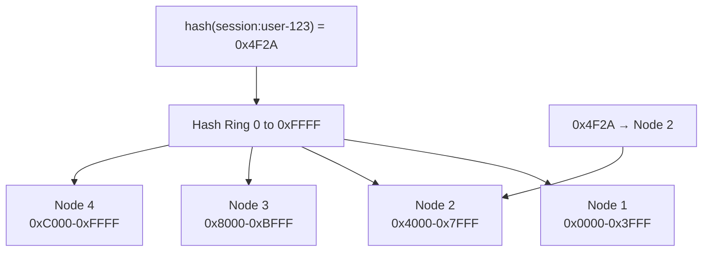
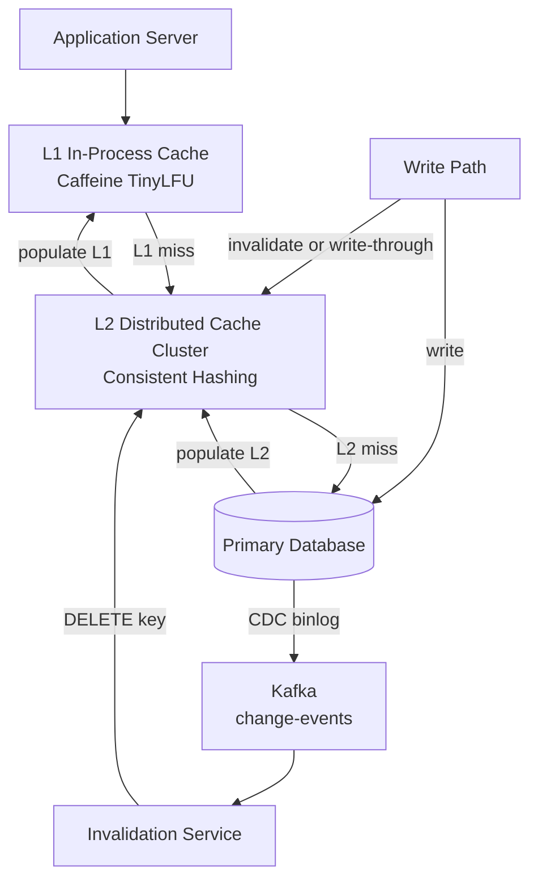
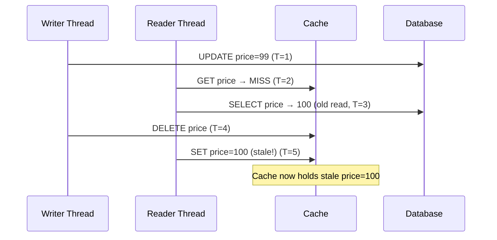
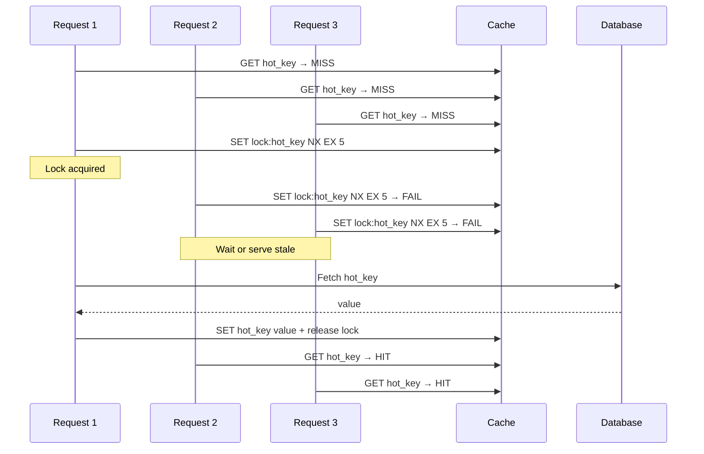
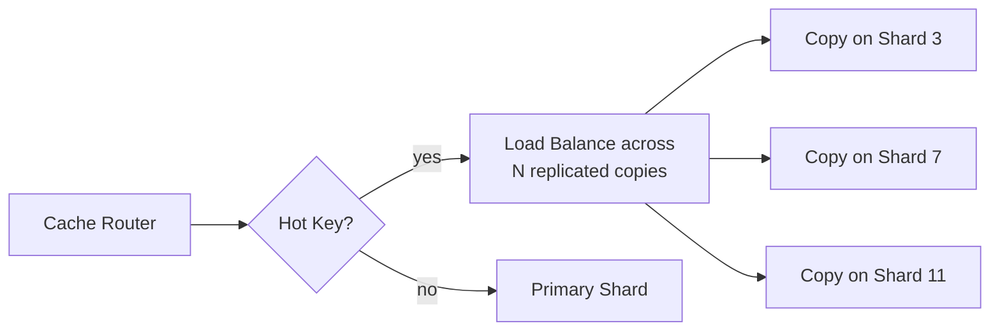
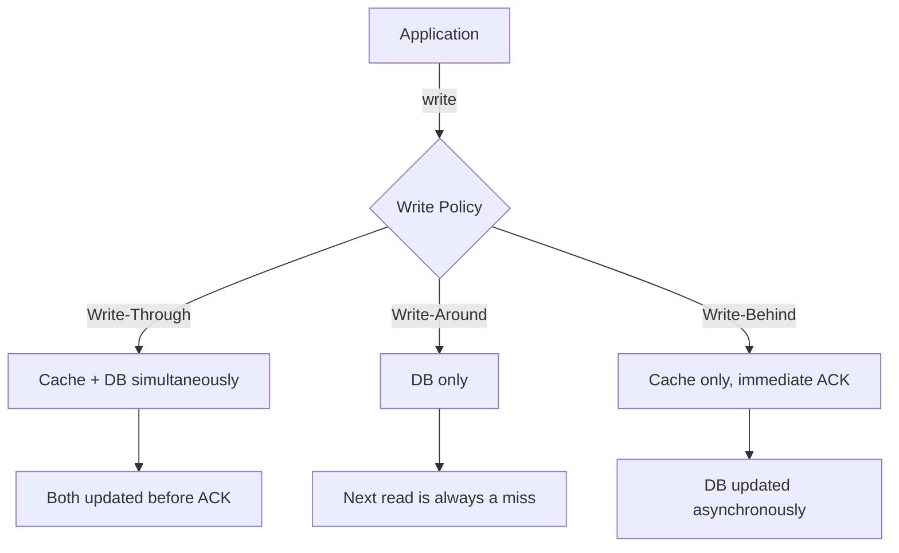
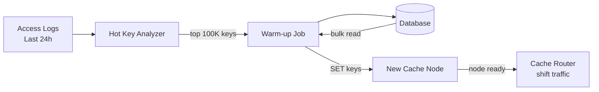

# Design a Distributed Cache

A distributed cache sits between your application and your database — absorbing read traffic, slashing latency from 50ms (DB round trip) to sub-millisecond, and protecting the database from being overwhelmed. Redis, Memcached, and Hazelcast are the production incarnations.

Designing a distributed cache from scratch is fundamentally different from designing a distributed KV store. A KV store is **durable** — it never loses data. A cache is **ephemeral** — data can be evicted at any time; the source of truth is always the origin store. This changes everything: no replication for durability, no WAL, no quorum. Instead the hard problems are **eviction at scale**, **cache invalidation correctness**, **thundering herds**, and **hot key saturation**.

The question tests whether you understand that a cache isn't just a fast KV store — it's a **read acceleration contract** with specific consistency guarantees, eviction semantics, and failure modes.

---

## Functional Requirements

**In Scope:**
- `SET(key, value, ttl)` — store a value with optional TTL; overwrites if key exists
- `GET(key)` — return value or `null` on miss; reset TTL on access (optional, LRU)
- `DELETE(key)` — explicitly evict a key
- Configurable eviction policies: LRU (default), LFU, TTL-only
- **Multi-level caching**: L1 (in-process, per-app-server) and L2 (shared remote cluster)
- Cache statistics endpoint: hit rate, miss rate, eviction count, memory usage per node
- Cluster mode: consistent hash-based key distribution across N cache nodes

**Out of Scope:**
- Durable persistence — cache loss is acceptable; origin DB is the source of truth
- Complex data types (sorted sets, streams) — that's Redis-specific; base cache stores opaque bytes
- Cross-region replication — cache is typically single-region; cross-region is the DB's concern
- Multi-key transactions or scripting

---

## Non-Functional Requirements

| Property | Target | Reasoning |
|---|---|---|
| **Read Latency** | p99 < 1ms for L2 remote cache | Cache is only useful if it's 50–1000× faster than the DB it fronts |
| **Write Latency** | p99 < 1ms for SET operations | Writes populate the cache; must not add meaningful overhead to the write path |
| **Hit Rate** | > 90% globally | Below 90%, the infrastructure cost is hard to justify |
| **Availability** | Best-effort; graceful degradation to DB on cache failure | A cache is not in the critical path of correctness — it's in the critical path of performance |
| **Scalability** | Add/remove nodes with < 10% key remapping impact | Consistent hashing minimizes redistribution on topology changes |
| **Memory Efficiency** | > 95% of node RAM available for key-value data | Overhead (metadata, pointers) should be minimal |
| **Eviction Fairness** | Hot keys should never be evicted under memory pressure | Eviction policy must protect frequently accessed data |

**Key tradeoff:** Unlike a database, a cache has no durability requirement. This simplifies the architecture dramatically — no WAL, no synchronous replication, no quorum. But it introduces a different class of problems: **what happens when the cache is empty?** Every miss sends a request to the DB, and a large-scale miss event can crash a database that was sized assuming a 90% cache hit rate.

---

## Capacity Estimation

**Scale:**
- 10M active keys, average value 1 KB → **~10 GB** per logical cache instance
- With RF=0 (no cache replication), 10 GB fits in 2–3 cache nodes at 4–6 GB usable per node
- Read throughput: 1M cache reads/sec → ~100K reads/sec per node at 10 nodes

**Memory overhead per entry:**
- Key string: average 50 bytes
- Value: average 1 KB
- LRU metadata (prev/next pointers + hash bucket): ~64 bytes overhead
- Per-entry total: ~1.1 KB → 10M entries ≈ **~11 GB** raw

**Eviction headroom:**
- Target: 80% max memory utilization — never let eviction pressure cause cascading misses
- At 10 GB data, provision **~13 GB** total cache memory across the cluster

---

## Core Entities

| Entity | Purpose | Key Fields |
|---|---|---|
| **CacheEntry** | A single cached item with lifecycle metadata | `key` (string), `value` (bytes), `ttl_ms`, `expires_at`, `last_accessed`, `access_count`, `size_bytes` |
| **CacheNode** | A physical server in the cache cluster | `node_id`, `ip`, `port`, `memory_total_mb`, `memory_used_mb`, `status`, `tokens[]` |
| **EvictionPolicy** | The strategy governing what gets removed under memory pressure | `type` (LRU/LFU/TinyLFU), `max_memory_bytes`, `eviction_batch_size` |
| **CacheShard** | A virtual partition of the keyspace on a node | `shard_id`, `node_id`, `token_range`, `entry_count`, `memory_bytes` |

**Important distinction:** A `CacheEntry` has no durability guarantee. It can vanish at any point due to TTL expiry, eviction, node failure, or restart. The application must always be able to reconstruct the value from the origin store on a miss. This is a **contract**, not a bug.

---

## Databases and Database Design

The distributed cache *is* the storage layer — its internals are the "database design" here.

### In-Memory Storage: Hash Map + Doubly Linked List (LRU)

The classic LRU cache is a combination of two data structures:

```
Hash Map:  key → ListNode pointer  (O(1) lookup)
Doubly Linked List: ordered by recency (most recent at head)

GET(key):
  1. hash_map.get(key) → node         // O(1)
  2. move node to head of list         // O(1)
  3. return node.value

SET(key, value):
  1. If key exists: update + move to head
  2. If not: create new node at head
  3. If memory full: evict from tail    // O(1)

MEMORY: O(N) where N = number of entries
```

This is the textbook implementation. Production systems add:
- **Segmented LRU (SLRU):** Two segments — probationary (new entries) and protected (frequently accessed). Entries graduate to protected on second access. Prevents a cache scan from evicting hot entries. Used in Linux page cache.
- **Per-shard locking:** Instead of one global lock, partition the hash map into 256 shards, each with its own lock. Reduces contention at 1M ops/sec by 256×.

### Eviction Policies: Why TinyLFU Wins

| Policy | Mechanism | Strength | Weakness |
|---|---|---|---|
| **LRU** | Evict least recently used | Simple; handles recency well | Cache scan (one-time reads) evicts hot data |
| **LFU** | Evict least frequently used | Hot data protected | Old items with high historical freq stay despite no recent access |
| **FIFO** | Evict oldest inserted entry | O(1), no metadata needed | Completely ignores access patterns |
| **TinyLFU (W-TinyLFU)** | Frequency sketch + window LRU | Near-optimal hit rate in all access patterns | Slightly higher implementation complexity |

**W-TinyLFU (used by Caffeine, the best Java cache):**
- New entries go into a **window LRU** (1% of capacity) — they get a chance to prove themselves
- To enter the **main cache** (99% of capacity), a new entry must have higher estimated frequency than the entry it would evict (checked via a Count-Min Sketch — a probabilistic frequency counter using 4 hash functions, ~8 bytes per counter)
- Items in the main cache use SLRU — recently accessed entries are protected
- Result: 10–30% higher hit rate than pure LRU for real-world access patterns (where some keys are much hotter than others)

### Consistent Hashing: Distributing Keys Across Nodes



- Key falls in Node 2's token range → routed to Node 2 by every client without coordination
- No master node: clients independently compute routing using a shared ring configuration
- **Virtual nodes (150 per physical node):** Ensures even distribution even with varied node capacities; new nodes take proportional slices from all existing nodes

**Node failure in a cache cluster:** Unlike a KV store, we don't reroute to a replica — we accept the miss. When Node 2 fails, its keys are temporarily inaccessible; requests miss and hit the DB. The node's keys gradually repopulate on the new node mapping as reads occur. No data loss because the DB is the source of truth.

### No Replication by Default — But Optional Hot Standby

For critical caches where even brief miss storms matter, each primary node can have a **hot standby replica** that replicates asynchronously:

- Hot standby receives every SET/DELETE asynchronously (fire-and-forget from primary)
- On primary failure, the client routing automatically shifts to the standby
- 1–5 second lag before standby catches up — some stale reads are possible during the failover window
- **Tradeoff:** 2× memory cost for the replication; adds ~0.5ms write latency for the async replication fan-out

---

## API Design

**SET — store a value:**
```http
POST /v1/cache/keys/{key}
X-TTL-Seconds: 3600

{
  "value": "<base64-encoded bytes>"
}

200 OK
{
  "key":        "session:user-abc123",
  "ttl_ms":     3600000,
  "expires_at": "2026-05-29T11:32:00Z",
  "node_id":    "cache-node-02"
}
```

**GET — retrieve a value:**
```http
GET /v1/cache/keys/{key}

200 OK
{
  "key":        "session:user-abc123",
  "value":      "<base64-encoded bytes>",
  "ttl_remaining_ms": 2847392,
  "hit":        true
}

204 No Content   // cache miss — key not found or expired
{ "hit": false }
```

**DELETE — explicit eviction:**
```http
DELETE /v1/cache/keys/{key}
204 No Content
```

**Batch GET (multi-key, reduces round trips):**
```http
POST /v1/cache/keys/mget
{
  "keys": ["session:abc", "cart:xyz", "user:123"]
}

200 OK
{
  "results": {
    "session:abc": { "value": "...", "hit": true  },
    "cart:xyz":    { "value": null,  "hit": false },
    "user:123":    { "value": "...", "hit": true  }
  },
  "hit_count": 2,
  "miss_count": 1
}
```

**Cluster stats (observability):**
```http
GET /v1/cache/stats

200 OK
{
  "global_hit_rate_pct": 94.3,
  "total_keys":          9847221,
  "memory_used_mb":      9124,
  "evictions_per_sec":   42,
  "nodes": [
    { "node_id": "cache-01", "memory_pct": 78, "hit_rate_pct": 95.1 },
    { "node_id": "cache-02", "memory_pct": 81, "hit_rate_pct": 93.6 }
  ]
}
```

---

## High-Level Design



**Request flow — read path:**
1. Application checks L1 (in-process Caffeine cache, ~256 MB per app server) — sub-microsecond
2. L1 miss → application calls L2 (distributed cache cluster) — ~0.5ms
3. L2 miss → application queries the database — ~30–50ms; populates L2 then L1 on the way back

**Write path (write-through + CDC):**
1. Application writes to the database
2. Simultaneously (or via CDC): invalidate or update the L2 cache key
3. L1 entries expire via TTL or are invalidated on next L2 read

**Component responsibilities:**
| Component | Role |
|---|---|
| **L1 Cache (in-process)** | Hottest keys served at < 1μs; no network; per-process; short TTL (10–30s) |
| **L2 Cache Cluster** | Shared across all app servers; consistent hashing; sub-ms; 10GB–10TB |
| **Cache Router (client-side)** | Computes which node owns each key; routes without central coordination |
| **Invalidation Service** | Consumes DB CDC events; deletes affected cache keys; prevents stale reads |
| **Monitoring** | Tracks hit rate, eviction pressure, node health; alerts on hit rate drops |

---

## Deep Dives

### 1. Cache Invalidation: The Hardest Problem

**The problem:** When the database is updated, the cache may hold the old value. Until the cache entry expires or is explicitly invalidated, reads return stale data. For most caches, some staleness is acceptable — but for critical data (prices, inventory, permissions), it's not.

**Four strategies, with honest tradeoffs:**

| Strategy | How it works | Staleness | Consistency Risk |
|---|---|---|---|
| **TTL expiry** | Cache entry expires after N seconds; next read fetches fresh | Up to TTL (e.g., 5 min) | Low — simple, predictable |
| **Write-through** | Every DB write also updates the cache synchronously | Zero (ideally) | Race condition on concurrent writes |
| **Explicit invalidation** | DELETE cache key on DB write; next read repopulates | Zero for key owner | Race condition: delete → read → stale write |
| **CDC-based invalidation** | DB binlog → Kafka → invalidation service deletes keys | ~1–2s (CDC lag) | Most robust; handles all writers |

**The cache invalidation race condition:**



The reader's DB query started *before* the writer's update but completed *after* the cache delete — it re-inserted stale data. This is why simple "write → delete cache" is insufficient.

**Production fix — Cache-Aside with version check:** Store a version number or `updated_at` timestamp with the cached value. On repopulation, only SET the cache if the DB row's version is newer than what's currently cached:

```
GET cache: returns {price: 100, version: 41}
DB returns: {price: 99, version: 42}
42 > 41 → safe to SET cache with new value
```

**Best practice:** For data where correctness matters, use **CDC-based invalidation**. The DB's WAL/binlog is the definitive record of changes; consuming it for cache invalidation is the most reliable approach and avoids the race condition entirely.

---

### 2. Thundering Herd: When the Cache Fails You

**The problem:** A popular cache key expires (TTL) or is explicitly deleted. Every one of thousands of concurrent requests simultaneously misses the cache and hits the database — a **thundering herd**. If the database is sized for 10% of traffic (because the cache handles 90%), receiving 100% of traffic instantly causes cascading failures.

**At scale:** A viral product launch, a trending news story, or a burst of search traffic for a trending keyword can drive 100K simultaneous requests for the same hot key. Database can't absorb 100K concurrent queries for the same item.

**Solution 1 — Mutex / Cache Lock:**



- `SETNX lock:{key}` with 5-second expiry: only one request wins the lock; others wait or serve stale
- Lock TTL prevents deadlock if the DB-fetching request crashes
- **Tradeoff:** Waiting requests add latency; serving stale data during the lock window may be acceptable for most use cases

**Solution 2 — Probabilistic Early Expiration (PER):**

Rather than letting the TTL be the exact expiry boundary, start randomly early-expiring the key as TTL approaches zero:

```
remaining_ttl = expires_at - now
staleness_window = ttl * 0.1   // last 10% of TTL
probability_of_refresh = staleness_window / remaining_ttl

// One request out of many stochastically triggers a refresh before mass expiry
// Spreads the DB refresh across a time window instead of all at once
```

- Elegant: no locks, no coordination; works purely probabilistically
- Used in Symfony's cache component and advocated by Martin Fowler
- **Tradeoff:** Doesn't completely prevent thundering herd; reduces it by spreading the load

**Solution 3 — Stale-While-Revalidate:**

Serve the stale cached value immediately; trigger an async background refresh for the next request:

- First request after TTL: serve stale, trigger async DB fetch, update cache
- All concurrent requests during the async refresh: get served the stale value (instant response)
- After the background fetch completes: all subsequent requests get fresh data

---

### 3. Hot Key Problem: When One Key Overwhelms a Shard

**The problem:** In any real-world system, access frequency follows a power-law distribution — a tiny fraction of keys receives the vast majority of requests. The top-selling product, the trending hashtag, the most-visited user profile. This key maps to one cache node via consistent hashing. That node's CPU and network become the bottleneck for millions of requests/second — regardless of how many other cache nodes exist.

**Detection:** Monitor per-key request rate on each cache node. Keys exceeding a threshold (e.g., > 100K reads/sec on a single node) are automatically flagged as "hot."



**Solution 1 — Key replication (read replicas for hot keys):**
- When a key is detected as hot, automatically create copies on N other shards
- Reads load-balance across all N copies (random selection or round-robin)
- Writes update all N copies — write amplification is N×, but writes for these keys are typically infrequent
- Copies expire together via the same TTL; no extra invalidation logic needed

**Solution 2 — Key sharding with client-side fan-out:**
- Store the hot key as N copies: `hot-key#0`, `hot-key#1`, ..., `hot-key#N-1`
- Each copy lives on a different shard (because the hash of the suffixed key differs)
- Reads: client randomly picks a suffix → different shard each time
- Writes: update all N copies (or use an async propagation service)
- **Tradeoff:** Client must know the key is sharded; the routing logic is client-side

**Solution 3 — L1 in-process caching (cheapest fix):**
- Hot keys are almost certainly going to be in every app server's L1 cache
- With L1 TTL of 10 seconds, each app server refreshes the hot key once every 10 seconds from L2
- For 1,000 app servers refreshing once per 10 seconds: 100 L2 requests/sec instead of 1M/sec
- **Tradeoff:** Up to 10 seconds staleness in L1; different app servers may serve slightly different versions of the same key during the TTL window

---

### 4. Write Policies: Choosing the Right Consistency Contract

The write policy determines how the cache stays synchronized with the database. Choosing wrong costs either consistency (stale data in production) or performance (cache doesn't help writes).



**Write-through:** Every write goes to cache AND DB before the operation is acknowledged. Cache is always consistent.
- ✅ Zero staleness; cache is always hot
- ❌ Write latency = DB write latency (cache write is fast; DB write dominates)
- Best for: read-heavy data that is written infrequently (user profiles, product metadata)

**Write-around:** Writes go directly to DB, bypassing the cache. Cache is populated only on read (read-through).
- ✅ Fast writes; cache only stores what's actually read
- ❌ First read after any write is always a cache miss; burst writes cause read miss storms
- Best for: write-heavy data that's rarely re-read (logs, events, one-time notifications)

**Write-behind (write-back):** Write to cache immediately (ACK the client); asynchronously flush to DB.
- ✅ Lowest write latency; batching can reduce DB load
- ❌ Data loss risk if cache crashes before DB flush; ordering guarantees are complex
- ❌ Stale reads from DB (bypassing cache) return pre-write data
- Best for: high-write-throughput workloads where transient loss is acceptable (analytics counters, activity streams)

**Production guidance:** Default to write-through for correctness. Use write-behind only when write latency is the primary bottleneck and you can tolerate the durability tradeoff.

---

### 5. Cache Warming: The Cold Start Problem

**The problem:** A new cache node starts empty. Every request is a miss. If you route production traffic to it immediately, the DB receives 100% of the node's traffic — potentially 10–20% of total traffic if the node covers 1/5 of the keyspace.

**Strategies:**

**Lazy warming (acceptable for most):** Simply start the node; cache fills organically over 10–30 minutes as requests come in. During the warm-up window, the DB receives elevated load. If the DB is provisioned with headroom, this is fine.

**Proactive seeding:** Before the node goes live, a warm-up service reads the top-K most popular keys from the DB (identified by historical access logs or query analytics) and pre-populates the cache. The node starts warm.



**Dual-read during ramp-up:** Route a percentage of traffic (e.g., 5%) to the new node; gradually increase to 100% over 15 minutes. The DB absorbs 5% of the node's traffic initially, not 100%.

**Tradeoff:** Proactive seeding requires knowing what's "hot" — which requires monitoring. For a cache that's been running for a while, hot key detection is easy. For a brand-new system, lazy warming is the only option.

---

## Summary: Key Engineering Decisions

| Decision | Choice | Why |
|---|---|---|
| Eviction policy | W-TinyLFU (TinyLFU for production) | Best hit rate for skewed access patterns; protects hot keys from scan pollution |
| Key distribution | Consistent hashing + vnodes | Minimal key remapping on topology changes; even distribution |
| No durability | Cache is always reconstructible from origin | Eliminates WAL, replication, and quorum overhead — cache is fast because it's simple |
| Cache invalidation | CDC-based invalidation via Kafka | Most reliable; avoids race conditions inherent in synchronous write + delete |
| Thundering herd | Mutex lock + stale-while-revalidate | Prevents DB overload on popular key expiry without significant latency cost |
| Hot keys | L1 in-process cache + N replicated copies | Eliminates hot-shard saturation at the cheapest point (L1) before it reaches the cluster |
| Write policy | Write-through (default); write-behind for high-write workloads | Correctness by default; performance when explicitly needed |
| Cold start | Proactive seeding + gradual traffic shift | Prevents miss storms on new node addition |

The core insight: **a cache is not a durable store that happens to be fast — it's a deliberately lossy read acceleration layer**. Every design decision (no replication, TTL over versioning, eviction over rejection) flows from accepting that the cache can lose data at any time and the application must always handle a miss gracefully. Design the miss path first; optimize the hit path second.
