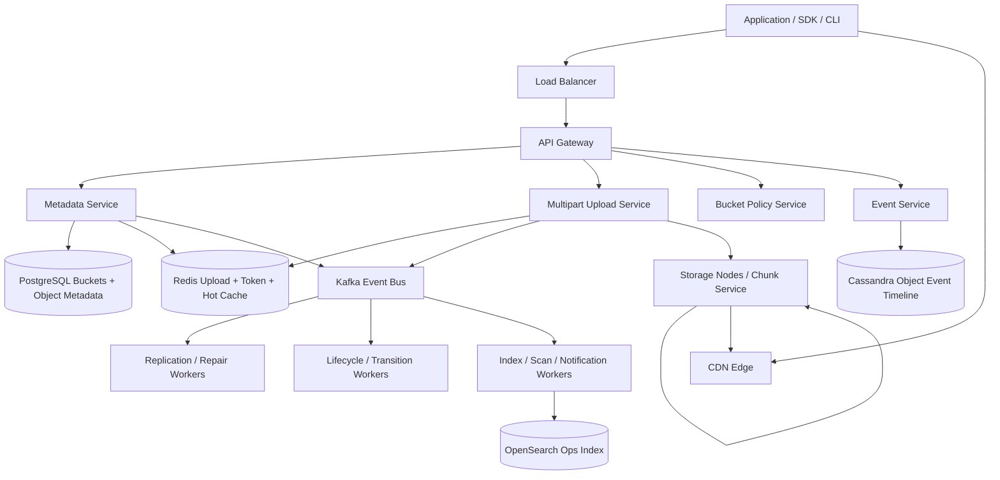
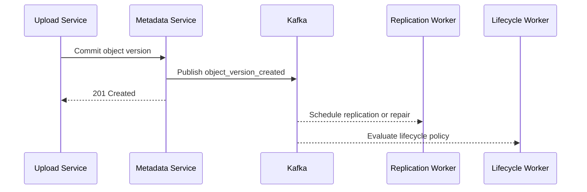
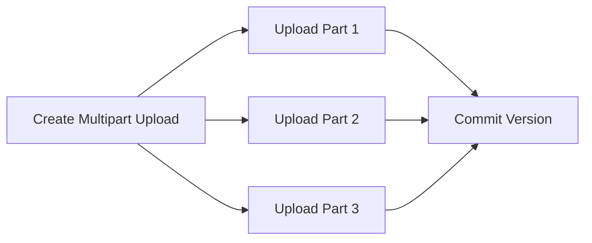
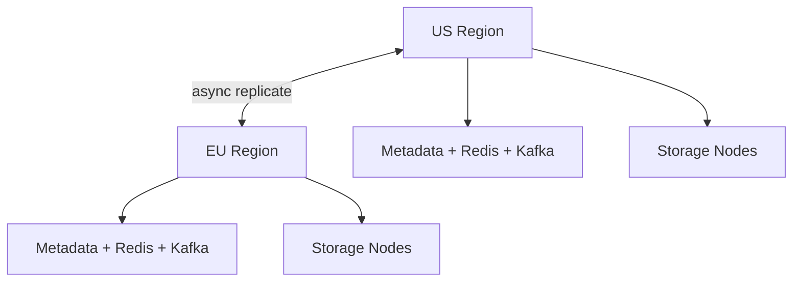

# Design Distributed Cloud Storage

Distributed cloud storage is a classic system design interview problem because it combines a durability-critical **object storage system** with a high-throughput **metadata, upload, replication, and lifecycle pipeline**. Users expect objects to survive hardware and regional failures, multipart uploads to resume, list and read operations to stay fast, and signed downloads to work globally without sending every byte through the control plane.

The surface looks simple: upload an object, store it in a bucket, and download it later. The depth lies in bucket metadata, object versioning, multipart upload coordination, metadata consistency, replication or erasure coding, hot-object caching, lifecycle policies, and separating the blob path from the metadata path so one does not overload the other.

---

## Functional Requirements

**In Scope:**
- Users can create buckets and store objects under keys
- The system supports `PUT`, `GET`, `HEAD`, `DELETE`, and `LIST` operations
- Large objects use multipart uploads with resumable part commits
- Objects can have metadata, versioning, and retention or lifecycle policies
- The platform supports pre-signed upload and download URLs
- The system can replicate or protect data across nodes, zones, or regions
- Internal consumers can fetch change events for indexing, scanning, or analytics
- Operators can inspect bucket, object, and replication health

**Out of Scope:**
- POSIX-style file system semantics and full directory locking
- Real-time collaborative editing on stored objects
- Deep cold-archive tape workflows and legal-hold policy engines
- Rich media transcoding or application-specific serving semantics
- Billing, chargeback, and quota-invoicing details

---

## Non-Functional Requirements

| Property | Target | Reasoning |
|---|---|---|
| **Metadata Latency** | p99 < 100ms for bucket/object metadata reads | Object control-plane calls should feel fast and predictable |
| **Upload Session Creation Latency** | p99 < 200ms | Multipart uploads should begin quickly before heavy byte transfer starts |
| **Read Start Latency** | p99 < 150ms to issue signed URL or object headers | Reads must begin quickly even for large objects |
| **Availability** | 99.99% for metadata and read/write authorization | Storage is often a critical dependency for many other systems |
| **Durability** | 11 nines or equivalent long-term object durability goal | The defining promise of cloud storage is not losing accepted objects |
| **Consistency** | Strong for object create/delete/version metadata; eventual for background replication metrics, lifecycle execution, and derived indexes | Stale analytics are acceptable; returning the wrong version after commit is not |
| **Scale** | Trillions of objects, EB-class data, millions of requests/sec | Both metadata fanout and blob storage economics shape the design |

**Key tradeoff:** distributed cloud storage prioritizes **durable object commits and correct metadata over perfectly fresh background views everywhere**. A lifecycle transition or replication metric that lags is acceptable. Losing an acknowledged object or exposing the wrong object version is not.

---

## Capacity Estimation

**Request traffic:**
- Assume **10M active customers and services** using the platform
- Aggregate request rate can exceed **1M+ requests/sec** across `GET`, `PUT`, `HEAD`, `LIST`, and multipart operations
- Read traffic usually dominates request count, but write traffic dominates durability and background replication cost

**Object scale:**
- Assume **100T+ stored objects** over time across all buckets and versions
- Object sizes are highly skewed: many tiny files exist, but a small fraction of large blobs dominates total bytes stored
- Metadata cardinality becomes a first-class systems challenge even when object bytes live in cheap storage

**Storage volume:**
- Total stored data can reach **exabytes** depending on retention and replication factor
- Replication or erasure-coding overhead adds significant extra physical storage beyond logical user bytes
- Background repair, lifecycle transitions, and replication can move large byte volumes even without customer reads

**Network bandwidth:**
- Ingress from multipart uploads and egress for reads can both be massive
- Hot objects or widely shared artifacts can create extreme read skew that must be handled at the edge or cache layer

---

## Core Entities

| Entity | Purpose | Key Fields | Relationships |
|---|---|---|---|
| **Bucket** | Logical namespace and policy boundary | `bucket_id`, `owner_id`, `name`, `region`, `versioning_enabled`, `created_at` | contains many object keys |
| **ObjectKey** | Stable logical object identity inside a bucket | `bucket_id`, `object_key`, `latest_version_id`, `deleted_at`, `updated_at` | has many object versions |
| **ObjectVersion** | Immutable committed version of an object | `version_id`, `bucket_id`, `object_key`, `size_bytes`, `etag`, `manifest_key`, `created_at` | belongs to one object key |
| **MultipartUpload** | Active resumable upload session | `upload_id`, `bucket_id`, `object_key`, `state`, `expires_at`, `created_at` | collects parts before commit |
| **ObjectPart** | Part metadata in a multipart upload | `upload_id`, `part_number`, `etag`, `size_bytes`, `blob_key` | belongs to one multipart upload |
| **LifecycleRule** | Retention or storage-class transition policy | `rule_id`, `bucket_id`, `prefix`, `action`, `effective_after_days` | applies to objects in a bucket |
| **ReplicationTask** | Background copy or repair action | `task_id`, `version_id`, `source_region`, `target_region`, `state`, `created_at` | derives from one committed object version |
| **ObjectEvent** | Append-only event for writes and deletes | `event_id`, `bucket_id`, `object_key`, `event_type`, `version_id`, `created_at` | drives indexing, scans, and downstream consumers |

**Critical modeling decisions:**
- `ObjectVersion` is immutable. Overwrites create a new version rather than mutating bytes in place.
- `MultipartUpload` is separate from committed object metadata so abandoned uploads do not surface as visible objects.
- `manifest_key` points to durable blob layout or erasure-coded chunk metadata, keeping large placement details out of hot metadata rows.

---

## Databases and Database Design

### Storage Tier Decisions

| Data | Access Pattern | Engine | Why |
|---|---|---|---|
| Buckets, object metadata, lifecycle rules, version pointers | transactional writes, exact reads, strong consistency | **PostgreSQL** | bucket/object metadata correctness and versioning need ACID guarantees |
| Object event journal and version timelines | append-heavy writes, bucket/object-scoped reads | **Cassandra / ScyllaDB** | efficient for very large write volume and timeline access |
| Multipart upload state, hot metadata cache, signed-token cache, rate limits | sub-millisecond reads/writes, TTLs, hot keys | **Redis** | ideal for ephemeral upload coordination and hot control-plane lookups |
| Object bytes and chunk manifests | immutable large blobs, write-once/read-many | **Object Storage Nodes + Erasure/Replica Backend** | optimized for durable large-byte storage |
| Metadata search and operator exploration | text and field filtering over buckets/keys | **OpenSearch / Elasticsearch** | useful for debugging and internal metadata search |
| Replication, lifecycle, antivirus, event fanout, analytics | durable append-only stream | **Kafka** | decouples committed metadata from background consumers |

This is intentionally polyglot. Cloud storage has distinct workloads: **strongly consistent metadata**, **massive immutable blob storage**, **ephemeral multipart state**, and **asynchronous protection and lifecycle workflows**.

### Schema 1 - Buckets and Object Keys (PostgreSQL)

```sql
CREATE TABLE buckets (
  bucket_id             UUID PRIMARY KEY DEFAULT gen_random_uuid(),
  owner_id              UUID NOT NULL,
  name                  TEXT NOT NULL UNIQUE,
  region                VARCHAR(32) NOT NULL,
  versioning_enabled    BOOLEAN NOT NULL DEFAULT FALSE,
  created_at            TIMESTAMPTZ DEFAULT NOW()
);

CREATE TABLE object_keys (
  bucket_id             UUID NOT NULL REFERENCES buckets(bucket_id),
  object_key            TEXT NOT NULL,
  latest_version_id     UUID,
  deleted_at            TIMESTAMPTZ,
  updated_at            TIMESTAMPTZ DEFAULT NOW(),
  PRIMARY KEY (bucket_id, object_key)
);
```

### Schema 2 - Object Versions (PostgreSQL)

```sql
CREATE TABLE object_versions (
  version_id            UUID PRIMARY KEY DEFAULT gen_random_uuid(),
  bucket_id             UUID NOT NULL REFERENCES buckets(bucket_id),
  object_key            TEXT NOT NULL,
  size_bytes            BIGINT NOT NULL,
  etag                  CHAR(64) NOT NULL,
  manifest_key          TEXT NOT NULL,
  storage_class         VARCHAR(32) NOT NULL DEFAULT 'standard',
  created_at            TIMESTAMPTZ DEFAULT NOW()
);

CREATE INDEX idx_object_versions_bucket_key
  ON object_versions (bucket_id, object_key, created_at DESC);
```

### Schema 3 - Multipart Uploads (PostgreSQL)

```sql
CREATE TABLE multipart_uploads (
  upload_id             UUID PRIMARY KEY DEFAULT gen_random_uuid(),
  bucket_id             UUID NOT NULL REFERENCES buckets(bucket_id),
  object_key            TEXT NOT NULL,
  state                 VARCHAR(16) NOT NULL,
  expires_at            TIMESTAMPTZ NOT NULL,
  created_at            TIMESTAMPTZ DEFAULT NOW()
);

CREATE TABLE multipart_parts (
  upload_id             UUID NOT NULL REFERENCES multipart_uploads(upload_id),
  part_number           INT NOT NULL,
  etag                  CHAR(64) NOT NULL,
  size_bytes            BIGINT NOT NULL,
  blob_key              TEXT NOT NULL,
  PRIMARY KEY (upload_id, part_number)
);
```

### Schema 4 - Object Event Timeline (Cassandra)

```sql
CREATE TABLE object_events_by_bucket (
  bucket_id             UUID,
  bucket_day            TEXT,
  event_seq             BIGINT,
  event_id              UUID,
  object_key            TEXT,
  event_type            TEXT,
  version_id            UUID,
  created_at            TIMESTAMP,
  PRIMARY KEY ((bucket_id, bucket_day), event_seq, event_id)
) WITH CLUSTERING ORDER BY (event_seq ASC, event_id ASC);
```

Daily buckets keep event partitions bounded while preserving ordered event replay.

### Schema 5 - Replication Tasks (Cassandra)

```sql
CREATE TABLE replication_tasks_by_region (
  target_region         TEXT,
  created_at            TIMESTAMP,
  task_id               UUID,
  version_id            UUID,
  state                 TEXT,
  PRIMARY KEY (target_region, created_at, task_id)
) WITH CLUSTERING ORDER BY (created_at ASC, task_id ASC);
```

### Schema 6 - Multipart Session State (Logical / Redis)

```json
{
  "key": "mpu:upl_789",
  "bucket_id": "bkt_123",
  "object_key": "videos/demo.mp4",
  "parts_uploaded": [1, 2, 3],
  "expected_part_size": 8388608,
  "expires_in": 86400
}
```

This state changes frequently and expires naturally, which makes Redis a better fit than the durable metadata store.

### Sharding and Replication Strategy

| Store | Shard Key | Strategy | Replication |
|---|---|---|---|
| Metadata tables | `bucket_id` or `owner_id` | logical hash sharding after single-cluster growth | primary + read replicas |
| Event and replication timelines | `bucket_id`, `target_region`, or `version_id` | consistent hashing across Cassandra nodes | RF=3, `LOCAL_QUORUM` writes |
| Redis | `upload_id`, `bucket_id`, `token` | Redis Cluster | 1 replica per master |
| Kafka | `bucket_id` or `version_id` | partitioned durable log | RF=3 |
| Blob backend | object/chunk key | erasure-coded or replicated placement groups | multi-node, multi-AZ durable placement |
| Search index | bucket / key prefix shards | shard by namespace and ops workload | 2-3 serving replicas |

**Consistency model:**
- Strong consistency for bucket/object metadata, version creation, deletes, and precondition checks
- Eventual consistency for lifecycle execution, replication completion, analytics, and derived metadata indexes

**Read/write patterns:**
- **Upload path:** create multipart session -> upload parts directly to storage nodes -> commit metadata transaction -> emit background events
- **Read path:** authorize object/version -> mint short-lived download URL or return redirect -> storage nodes or CDN serve bytes directly
- **Protection path:** committed version -> replication or erasure background task -> durable completion update -> metrics and lifecycle continue asynchronously

---

## API Design

**Create a bucket:**
```http
POST /v1/buckets
Authorization: Bearer <jwt>

{
  "name": "media-assets-prod",
  "region": "us-east-1",
  "versioning_enabled": true
}

201 Created
{
  "bucket_id": "bkt_123",
  "name": "media-assets-prod",
  "region": "us-east-1"
}
```

**Initiate multipart upload:**
```http
POST /v1/buckets/bkt_123/objects/uploads
Authorization: Bearer <jwt>

{
  "object_key": "videos/demo.mp4",
  "content_type": "video/mp4",
  "size_bytes": 524288000
}

201 Created
{
  "upload_id": "upl_789",
  "part_size_bytes": 8388608
}
```

**Request upload URL for a part:**
```http
POST /v1/uploads/upl_789/parts
Authorization: Bearer <jwt>

{
  "part_number": 1,
  "size_bytes": 8388608
}

200 OK
{
  "part_number": 1,
  "upload_url": "https://storage.example/upload/upl_789/1?sig=...",
  "expires_in": 300
}
```

**Complete multipart upload:**
```http
POST /v1/uploads/upl_789/complete
Authorization: Bearer <jwt>
Idempotency-Key: obj-6d7f-001

{
  "parts": [
    { "part_number": 1, "etag": "etag-1" },
    { "part_number": 2, "etag": "etag-2" }
  ]
}

201 Created
{
  "object_key": "videos/demo.mp4",
  "version_id": "ver_333",
  "etag": "sha256:abc123"
}
```

**Get a download URL:**
```http
GET /v1/buckets/bkt_123/objects/videos%2Fdemo.mp4/download-url
Authorization: Bearer <jwt>

200 OK
{
  "download_url": "https://cdn.storage.example/o/bkt_123/videos/demo.mp4?sig=...",
  "expires_in": 300,
  "version_id": "ver_333"
}
```

**List objects by prefix:**
```http
GET /v1/buckets/bkt_123/objects?prefix=videos/&cursor=eyJrZXkiOiJ2aWRlb3MvZGVtby5tcDQifQ==&limit=100

200 OK
{
  "items": [
    {
      "object_key": "videos/demo.mp4",
      "size_bytes": 524288000,
      "updated_at": "2026-06-03T10:00:00Z"
    }
  ],
  "next_cursor": "eyJrZXkiOiJ2aWRlb3MvZGVtbzIubXA0In0=",
  "has_more": true
}
```

> Cursor-based pagination on stable key ordering. Offset pagination (`?page=N`) becomes expensive and unstable for very large bucket listings.

**Object event stream (SSE, optional):**
```http
GET /v1/buckets/bkt_123/events/stream
Authorization: Bearer <jwt>
Accept: text/event-stream
```
Core storage does not require WebSockets. SSE is only useful for operator dashboards or advanced internal consumers that want low-latency object-change hints. Correctness should still rely on durable event journals and bucket metadata APIs.

---

## High-Level Design



**Component responsibilities:**

| Component | Role |
|---|---|
| **API Gateway** | Auth, routing, request validation, rate limiting, and signed URL issuance |
| **Metadata Service** | Bucket and object metadata management, version creation, preconditions, and listing |
| **Multipart Upload Service** | Upload session lifecycle, part coordination, and commit validation |
| **Bucket Policy Service** | Bucket-level settings, retention, lifecycle, and access policies |
| **Event Service** | Serves durable object-event streams and operator views |
| **Redis** | Multipart session state, hot metadata cache, download token cache, and rate limits |
| **Storage Nodes / Chunk Service** | Stores object bytes or chunk data with replication or erasure coding |
| **Kafka** | Durable backbone for replication, lifecycle, scanning, indexing, and notifications |
| **Replication / Repair Workers** | Enforce durability placement and heal missing or degraded replicas/fragments |
| **Lifecycle / Transition Workers** | Apply retention, expiration, and storage-class transitions asynchronously |

**Object write and read flow:**
1. Client creates a multipart upload session through the control plane
2. Client uploads parts directly to storage nodes using signed URLs, keeping the application tier off the heavy byte path
3. Metadata Service commits a new immutable object version transactionally and updates the latest version pointer
4. Background events trigger replication, repair, lifecycle, indexing, and scanning without delaying the write acknowledgment
5. Reads fetch metadata or a signed URL from the control plane, then stream bytes from storage nodes or CDN directly

---

## Deep Dives

### 1. Kafka: Required for Protection and Lifecycle Pipelines, Not for Blob Bytes

Kafka is required for a cloud storage system, but not because it stores object bytes. Blob transfer belongs on storage nodes and CDN paths, not on an event bus. Kafka is required because every committed object version can trigger replication, background repair, lifecycle transitions, virus scanning, event notifications, and analytics.

If the metadata commit path synchronously waited for every downstream consumer before acknowledging success, write latency and failure coupling would become unacceptable immediately.



**Why the problem happens:** one committed object version has many secondary consumers, but those consumers do not all belong in the hot write path.

**Why it becomes difficult at scale:**
- heavy write bursts create large replication and scanning backlogs
- lifecycle, replication, and analytics have very different SLAs
- replay matters after incidents because many protection states are derived from object events

**Production-grade solutions:**
- use topics such as `object.version_created`, `object.deleted`, and `replication.task_created`
- keep messages compact: bucket ID, object key, version ID, storage class, and manifest key rather than blob bytes
- prioritize durability-critical consumers like replication and repair over low-priority analytics when lag grows
- retain Kafka long enough to replay downstream protection workflows safely

**Tradeoffs:** Kafka adds operational overhead and eventual consistency for derived views, but it keeps the commit path fast and recoverable.

### 2. Redis: Multipart Sessions, Hot Metadata, and Signed Access Tokens

Redis is required because object storage has a large amount of ephemeral control-plane state that changes quickly or expires naturally.

| Redis Use | Example Key | Why Redis Fits |
|---|---|---|
| **Multipart session state** | `mpu:upl_789` | resumable upload progress needs low-latency mutable state |
| **Hot object metadata** | `obj:bkt_123:videos/demo.mp4` | popular reads should not always hit PostgreSQL |
| **Signed token cache** | `dl:token_abc` | short-lived read tokens need cheap validation |
| **Rate limiting** | `rl:bucket:bkt_123:put` | protects expensive metadata and token endpoints |

**Why the problem happens:** multipart uploads, signed URL issuance, and popular objects create bursty, low-latency control-plane demand.

**Why it becomes difficult at scale:**
- abandoned multipart uploads create lots of short-lived state
- hot objects can produce extreme metadata lookups even if bytes are served elsewhere
- stale tokens must expire quickly when permissions or policies change

**Production-grade solutions:**
- keep multipart upload manifests and token state in Redis with TTLs
- cache only hot object metadata and bucket policy summaries, not every cold row
- use short token lifetimes so revocation windows stay bounded
- separate upload session keys from metadata cache keys to avoid noisy churn evicting hot reads

**Tradeoffs:** Redis improves latency dramatically, but it introduces staleness and memory cost. That is acceptable for ephemeral helpers, not for authoritative metadata.

### 3. Multipart Uploads, Commit Semantics, and Idempotency

Large objects are the first real systems challenge. Clients upload from unreliable networks and should never need to restart a multi-GB object from byte zero after one transient failure.

The correct design is a multipart upload path where parts are uploaded independently, verified individually, and only become visible as one committed version after an explicit completion step.



**Why the problem happens:** network failures and very large objects are normal in cloud storage.

**Why it becomes difficult at scale:**
- clients retry parts and commit requests, which can create duplicate state without idempotency
- part metadata must remain durable long enough for resumability, but not forever
- partially uploaded data must never appear as a valid committed object version

**Production-grade solutions:**
- use explicit `upload_id` plus part numbers and checksums
- commit metadata only after all parts are verified and the manifest is sealed
- require idempotent completion using an `Idempotency-Key` or upload token
- garbage-collect abandoned multipart uploads and orphaned parts asynchronously

**Tradeoffs:** multipart uploads improve reliability, but they add complexity in session management, cleanup, and commit fencing.

### 4. Replication, Erasure Coding, and Repair

Durability is the defining property of cloud storage. The system needs a storage-protection strategy that survives disk, node, rack, or zone failure without making writes unbearably expensive.

The two common tools are replication and erasure coding. Replication is simple and fast but expensive in raw storage. Erasure coding is more storage-efficient but more complex for reads, writes, and repairs.

**Why the problem happens:** storage hardware fails continuously at scale.

**Why it becomes difficult at scale:**
- large fleets experience constant background bit rot, node loss, and transient unavailability
- repair traffic can become significant, especially after correlated failures
- small objects and hot reads interact differently with erasure coding than large cold objects do

**Production-grade solutions:**
- use replication for hot or small objects where latency matters most
- use erasure coding for colder or larger objects where storage efficiency matters more
- keep placement across failure domains such as racks, zones, or regions
- continuously audit fragments and schedule background repair based on missing or degraded placement

**Tradeoffs:** replication is simpler and faster but more expensive. Erasure coding reduces storage overhead but increases repair and read complexity.

### 5. Listing, Versioning, and Metadata Consistency

Metadata correctness is the real consistency challenge in object storage. A client may overwrite a key, delete a version, or list a prefix while concurrent writes are happening. The platform must define what users see and guarantee that committed versions do not disappear or reorder incorrectly.

**Why the problem happens:** object storage often exposes simple APIs, but those APIs still depend on globally meaningful bucket/key metadata.

**Why it becomes difficult at scale:**
- hot prefixes create many concurrent writes and list operations
- versioning means one logical key can point to many immutable versions
- stale caches or asynchronous index updates can confuse list consistency if boundaries are unclear

**Production-grade solutions:**
- make `PUT` and `DELETE` update metadata transactionally with clear version semantics
- keep object versions immutable and update only pointers or tombstones in the hot metadata row
- define list consistency explicitly and back it with ordered metadata storage rather than derived indexes alone
- treat search and operator indexes as eventually consistent, but keep bucket/key metadata authoritative

**Tradeoffs:** stronger metadata consistency makes the control plane more expensive, but it prevents the most damaging class of storage bugs: wrong object visibility or version state.

### 6. WebSockets and Offline Delivery: Usually Not Required

Core cloud storage does not require WebSockets. Upload initialization, part upload, commit, list, and download all fit request-response APIs naturally. The system is fundamentally a durable storage service, not a realtime interaction product.

Offline delivery is also not a core backend concern here. Clients can retry uploads and reads later, but the service itself does not need chat-like offline synchronization semantics.

**Why the problem happens:** teams sometimes add realtime infrastructure even when the product does not benefit materially from it.

**Why it becomes difficult at scale:**
- persistent connections add operational complexity without improving storage durability or read throughput
- most workflows already rely on durable object metadata and retryable transfer semantics
- SSE/WebSockets do not solve the real problems of commit correctness, lifecycle, or replication

**Production-grade solutions:**
- keep the storage API request-response and retry-friendly
- use optional event streams only for internal operators or advanced downstream consumers
- rely on durable object-event journals rather than volatile push channels for correctness

**Tradeoffs:** avoiding unnecessary realtime infrastructure keeps the storage system simpler and easier to operate.

### 7. Hot Objects, CDN Reads, and Multi-Region Replication

Most objects are cold. A few become extremely hot, especially public artifacts, software packages, or widely shared media. Those objects can dominate egress and metadata traffic.

**Why the problem happens:** read demand is highly skewed and often global.

**Why it becomes difficult at scale:**
- repeated origin reads are expensive and can overload storage nodes
- hot-object metadata can become a control-plane bottleneck even when bytes are cached at the edge
- cross-region replication and cache invalidation add freshness complexity when new versions replace older objects

**Production-grade solutions:**
- serve bytes from CDN or regional caches whenever policy allows
- use short-lived signed URLs so edge delivery stays cheap without bypassing authorization entirely
- replicate hot or critical objects across regions asynchronously based on policy or observed demand
- keep version-aware cache keys so new versions do not accidentally serve stale bytes

**Tradeoffs:** edge caching makes reads cheap and fast, but it requires disciplined versioning and token design to preserve correctness.

### 8. Multi-Region Recovery, Backpressure, and Repair Prioritization

Cloud storage is global, but metadata ownership and durability repair still need explicit boundaries. Synchronously coordinating every write across the world would make the hot path too expensive.



**Why the problem happens:** users want low-latency writes locally, but storage systems also need disaster recovery.

**Why it becomes difficult at scale:**
- cross-region round trips increase write latency materially
- repair, lifecycle, and replication backlogs can compete for I/O and bandwidth
- regional failures can leave large sets of under-replicated objects that need urgent repair

**Production-grade solutions:**
- keep one authoritative metadata owner per shard or bucket region, then replicate asynchronously to secondaries
- prioritize repair of under-replicated objects ahead of low-priority lifecycle transitions when backpressure rises
- make multipart completion and object version creation idempotent so failover retries do not create duplicate versions
- expose explicit durability health metrics instead of assuming replication completion is instantaneous everywhere

**Tradeoffs:** asynchronous replication and repair prioritization are cheaper and faster than globally serialized writes, but they require explicit recovery logic and health visibility.

### 9. Architecture Evolution

| Stage | Design | Why It Breaks | Next Step |
|---|---|---|---|
| **1. MVP** | Single-region metadata DB with replicated blob storage | hot reads, multipart uploads, and operator workflows overload one stack quickly | add dedicated multipart, CDN, and background event pipelines |
| **2. Growth** | Separate metadata, storage, Redis sessions, and background workers | lifecycle, repair, and replication couple too tightly to the write path | add Kafka and explicit durability workflows |
| **3. Scale** | Sharded metadata plus regional storage clusters and event timelines | hot objects and repair storms create local bottlenecks | add stronger caching, repair prioritization, and version-aware invalidation |
| **4. Global** | Multi-region storage with async metadata replication and explicit owners | exact global coordination is too expensive for the hot path | keep strong consistency only for authoritative metadata commits and converge derived views asynchronously |

This is the interview pattern to emphasize: keep bytes off the control plane, keep metadata and object-version commits correct, and let replication, lifecycle, and scanning evolve asynchronously around a durable core.
