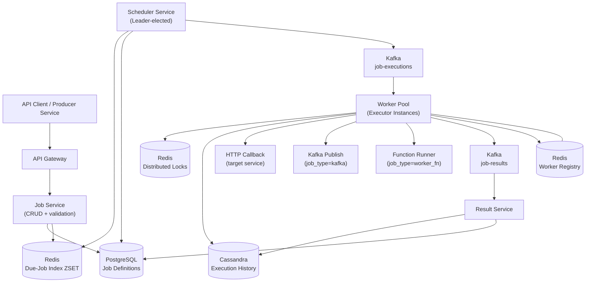
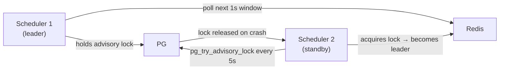
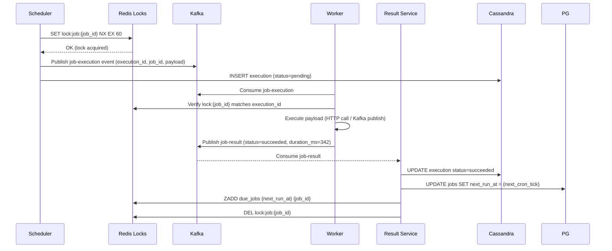
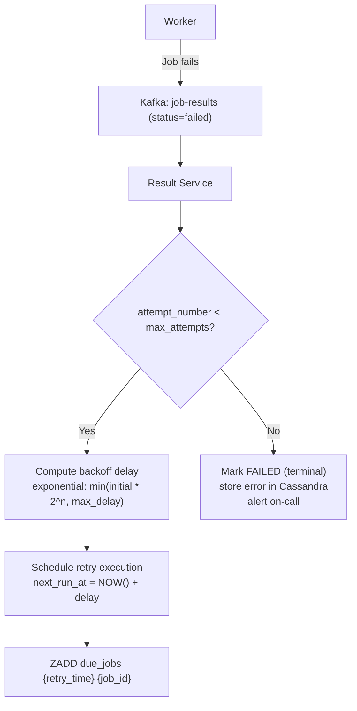
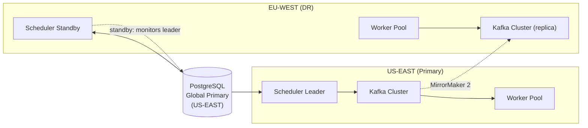

# Design a Distributed Job Scheduler

A distributed job scheduler is the invisible engine behind almost every large-scale system — the component that sends your weekly Discover Weekly, triggers fraud checks on transactions, computes Uber surge pricing every 5 minutes, and sends millions of promotional emails at exactly 9 AM. LinkedIn's Azkaban, Airflow, Quartz, and AWS EventBridge are all variants of this problem.

The engineering challenge is deceptively hard: **guaranteeing that every job runs exactly once, on time, even as machines crash, networks partition, and job volumes grow to millions per day** — without a single scheduler becoming a bottleneck or SPOF.

This problem tests distributed consensus, leader election, clock skew, idempotency, and the subtle but critical distinction between a job *being scheduled* and a job *completing successfully*.

---

## Functional Requirements

**In Scope:**
- **One-time jobs**: Execute a task once at a specified future timestamp
- **Recurring jobs**: Execute on a cron schedule (e.g., `0 9 * * 1` = every Monday at 9 AM)
- **Job CRUD**: Create, update, pause, resume, and delete jobs
- **Execution tracking**: Track job status — pending, running, succeeded, failed
- **Retry policy**: Configurable retry count and backoff strategy on failure
- **Job types**: HTTP callback (webhook), message queue publish, or arbitrary function execution (worker-based)
- **Observability**: Job execution history, last run status, next scheduled run

**Out of Scope:**
- Workflow orchestration / DAG dependencies (Airflow territory — separate problem)
- Real-time streaming computation (Flink/Spark Streaming)
- Long-running stateful jobs (HPC batch computing)
- Job priority queues with preemption
- Multi-tenant billing and quota management

---

## Non-Functional Requirements

| Property | Target | Reasoning |
|---|---|---|
| **Schedule Accuracy** | ± 1 second of target time | Business SLAs; fraud checks on stale data lose value; marketing sends should feel precise |
| **Throughput** | 100K job executions/min at peak | E-commerce flash sale triggers, social platform batch jobs |
| **Availability** | 99.99% for the scheduler core | A down scheduler stops all downstream pipelines; cascading failure |
| **Execution Guarantee** | At-least-once execution | Missed execution is worse than a duplicate (duplicate can be idempotent) |
| **Deduplication** | Idempotent execution by job workers | The scheduler guarantees dispatch; workers own idempotency |
| **Fault Tolerance** | Zero job loss on single node failure | Jobs must survive any single machine crash mid-execution |
| **Scalability** | Horizontal scaling of executor workers | Scheduler core can be vertically scaled + leader-replicated; workers scale out |
| **Latency** | Scheduler overhead < 100ms per job trigger | Trigger latency is not execution latency; execution time depends on the job |

**The defining tradeoff:** True exactly-once execution is impossible in a distributed system without coordination that defeats the purpose of scale. The correct contract is: **the scheduler guarantees at-least-once dispatch, and job handlers are required to be idempotent**. Design every job with this in mind — idempotency keys, deduplication checks, and safe re-execution.

---

## Capacity Estimation

**Job volume:**
- 10M registered jobs; 1M active recurring jobs; 100K one-time jobs per day
- 100K executions/min peak → **~1,667 executions/sec**
- Each execution record: ~1 KB → 1,667 KB/sec write to execution log

**Scheduler polling:**
- The scheduler scans for due jobs every second
- At 1M active jobs, scanning a naive `SELECT WHERE next_run <= NOW()` every second is fatal
- Practical: index on `next_run_at`; scan only the next 60-second window → ~1,700 due jobs/scan → manageable

**Storage:**
- Job definitions: 10M × 2 KB = **20 GB** (trivial, fits in a single PostgreSQL instance)
- Execution history (90-day retention): 1,667 jobs/sec × 86,400 sec/day × 90 days × 1 KB = **~13 TB** (requires time-series store or Cassandra)
- Next-run index: 1M active jobs × 50 bytes = **50 MB** — fits entirely in Redis

**Worker capacity:**
- Average job execution: 500ms; worker concurrency: 100 parallel jobs/worker
- Workers needed at peak: (1,667 jobs/sec × 0.5s) / 100 = **~9 workers** (trivial; scale to 100+ for safety margin and burst capacity)

---

## Core Entities

| Entity | Purpose | Key Fields |
|---|---|---|
| **Job** | Definition of what to run and when | `job_id`, `name`, `owner_id`, `job_type` (http/queue/worker), `payload`, `schedule` (cron/one-time), `next_run_at`, `status` (active/paused/deleted), `retry_policy{}`, `created_at`, `updated_at` |
| **JobExecution** | A single run instance of a Job | `execution_id`, `job_id`, `scheduled_at`, `started_at`, `completed_at`, `status` (pending/running/succeeded/failed/timed_out), `attempt_number`, `worker_id`, `error_message` |
| **RetryPolicy** | Configurable retry behavior | `max_attempts`, `backoff_type` (fixed/exponential), `initial_delay_sec`, `max_delay_sec`, `retry_on` (all/5xx/timeout) |
| **Worker** | An executor node available to run jobs | `worker_id`, `host`, `port`, `status` (active/draining/dead), `last_heartbeat`, `current_load`, `max_concurrency` |
| **Lock** | Distributed lock preventing double execution | `job_id`, `execution_id`, `locked_by` (worker_id), `expires_at`, `acquired_at` |

**Critical modeling decisions:**
- `Job` and `JobExecution` are separate tables. A Job is a template; an Execution is an instance. This separation is fundamental — without it, you cannot safely retry a failed execution, audit past runs, or pause a job without losing its history.
- `next_run_at` on Job is the core scheduling index. After each execution, the scheduler computes the next value from the cron expression and updates this field atomically. This is the single source of truth for "what runs next and when."
- `Lock` is the anti-double-execution primitive. It is not a permanent record — it expires after `execution_timeout`. Any lock older than its TTL is considered dead; the job can be re-claimed by another worker.

---

## Databases and Database Design

### Storage Tier Decisions

| Data | Access Pattern | Engine | Why |
|---|---|---|---|
| Job definitions | Point reads by `job_id`; range scan by `next_run_at` | **PostgreSQL** | ACID essential — job updates must be atomic with `next_run_at`; B-tree index on `next_run_at` |
| Execution history | Append-only, time-series, 90-day retention | **Cassandra** | High write throughput; partition by `(job_id, month)` for efficient history queries |
| Due-job index | Sub-second polling for jobs due in next 60s | **Redis Sorted Set** | O(log N) `ZRANGEBYSCORE`; push `next_run_at` as score; entire active job window fits in memory |
| Distributed locks | Short TTL key, CAS semantics | **Redis (SET NX EX)** | Atomic acquire + automatic expiry; no cleanup job needed |
| Worker registry | Heartbeat updates, active worker listing | **Redis HSET with TTL** | Ephemeral; workers re-register on startup; dead workers auto-expire |
| Job execution queue | Fan-out to worker pool | **Kafka** | Durability; backpressure; worker autoscaling signal; replay for failed dispatches |

### Schema 1 — Jobs (PostgreSQL)

```sql
CREATE TABLE jobs (
  job_id         UUID         PRIMARY KEY DEFAULT gen_random_uuid(),
  name           VARCHAR(255) NOT NULL,
  owner_id       UUID         NOT NULL,
  job_type       VARCHAR(20)  NOT NULL,   -- 'http' | 'kafka_publish' | 'worker_fn'
  payload        JSONB        NOT NULL,   -- { url, method, headers } or { topic, message } etc.
  schedule_type  VARCHAR(20)  NOT NULL,   -- 'cron' | 'one_time'
  cron_expr      VARCHAR(100),            -- '0 9 * * 1' — null for one_time
  next_run_at    TIMESTAMPTZ  NOT NULL,
  timezone       VARCHAR(64)  NOT NULL DEFAULT 'UTC',
  status         VARCHAR(20)  NOT NULL DEFAULT 'active',
  max_attempts   INT          NOT NULL DEFAULT 3,
  backoff_type   VARCHAR(20)  NOT NULL DEFAULT 'exponential',
  timeout_sec    INT          NOT NULL DEFAULT 30,
  created_at     TIMESTAMPTZ  DEFAULT NOW(),
  updated_at     TIMESTAMPTZ  DEFAULT NOW()
);

-- The critical index: scheduler polls this every second
CREATE INDEX idx_jobs_next_run
  ON jobs (next_run_at)
  WHERE status = 'active';
```

The partial index `WHERE status = 'active'` is essential — at 10M jobs with 1M active, the index only contains active jobs. Paused and deleted jobs are invisible to the scheduler without increasing index size.

### Schema 2 — Job Executions (Cassandra)

```sql
CREATE TABLE job_executions (
  job_id          UUID,
  year_month      TEXT,     -- '2026-05' partition bucketing
  scheduled_at    TIMESTAMP,
  execution_id    UUID,
  status          TEXT,     -- 'pending' | 'running' | 'succeeded' | 'failed' | 'timed_out'
  attempt_number  INT,
  worker_id       TEXT,
  started_at      TIMESTAMP,
  completed_at    TIMESTAMP,
  error_message   TEXT,
  PRIMARY KEY ((job_id, year_month), scheduled_at)
) WITH CLUSTERING ORDER BY (scheduled_at DESC)
  AND default_time_to_live = 7776000;  -- 90-day TTL
```

Partitioned by `(job_id, year_month)` to avoid unbounded partition growth on a high-frequency recurring job. A job running every minute for 5 years would accumulate 2.6M rows per partition — the monthly bucket caps this at ~44K rows.

### Schema 3 — Distributed Locks (Redis)

```
SET lock:job:{job_id}  {execution_id}:{worker_id}  NX  EX {timeout_sec}
→ OK   → lock acquired; this worker owns this execution
→ nil  → lock held by another worker; skip this job

-- Unlock (Lua script — atomic check-and-delete)
EVAL "
  if redis.call('GET', KEYS[1]) == ARGV[1] then
    return redis.call('DEL', KEYS[1])
  end
  return 0
" 1 lock:job:{job_id}  {execution_id}:{worker_id}
```

The lock value includes both `execution_id` and `worker_id` — preventing Worker B from accidentally releasing a lock held by Worker A (different execution IDs). The Lua script makes the check-and-delete atomic.

### Schema 4 — Due-Job Index (Redis Sorted Set)

```
-- Scheduler pushes jobs into Redis on startup and on job creation/update
ZADD due_jobs  {next_run_at_unix_ms}  {job_id}

-- Poller claims jobs due in the next 60 seconds
ZRANGEBYSCORE due_jobs  0  {now_ms + 60000}  LIMIT 0 1000

-- After claiming (acquiring lock), remove from the sorted set
ZREM due_jobs  {job_id}

-- After execution, re-add with updated next_run_at
ZADD due_jobs  {new_next_run_at_unix_ms}  {job_id}
```

The entire active-job window is a single O(log N) range query. With 1M active jobs, `ZADD` and `ZREM` are sub-millisecond.

### Schema 5 — Worker Registry (Redis)

```
-- Worker heartbeat (every 5 seconds)
HSET workers:{worker_id}  host "10.0.1.5"  port "8080"  load "42"  max_concurrency "100"
EXPIRE workers:{worker_id} 15   -- expires if heartbeat stops for 15s → worker is dead

-- Get all active workers
KEYS workers:*   -- avoid in prod; use a separate SMEMBERS worker_registry set
SMEMBERS worker_registry   -- set of active worker_ids, maintained by workers on join/leave
```

### Sharding and Replication

| Store | Shard Key | Replication |
|---|---|---|
| PostgreSQL (jobs) | `job_id` (range sharding if > 50M rows; single instance sufficient up to 10M) | Primary + 2 read replicas; synchronous replication for `next_run_at` updates |
| Cassandra (executions) | `(job_id, year_month)` partition key; Murmur3 | RF=3; LOCAL_QUORUM writes; 2 DCs |
| Redis (due-job index, locks, workers) | Redis Cluster; hash by key prefix | 1 replica per shard; Sentinel for failover |

---

## API Design

**Create a job:**
```http
POST /v1/jobs
Authorization: Bearer <token>

{
  "name": "weekly-digest-email",
  "job_type": "http",
  "payload": {
    "url": "https://internal.service/trigger/digest",
    "method": "POST",
    "headers": { "X-Internal-Key": "secret" }
  },
  "schedule_type": "cron",
  "cron_expr": "0 9 * * 1",
  "timezone": "America/New_York",
  "max_attempts": 3,
  "backoff_type": "exponential",
  "timeout_sec": 30
}

201 Created
{
  "job_id": "job_abc",
  "next_run_at": "2026-06-01T13:00:00Z",
  "status": "active"
}
```

**Get job details:**
```http
GET /v1/jobs/{job_id}

200 OK
{
  "job_id": "job_abc",
  "name": "weekly-digest-email",
  "status": "active",
  "cron_expr": "0 9 * * 1",
  "next_run_at": "2026-06-01T13:00:00Z",
  "last_execution": {
    "execution_id": "exec_xyz",
    "status": "succeeded",
    "started_at": "2026-05-26T13:00:01Z",
    "duration_ms": 342
  }
}
```

**Update or pause a job:**
```http
PATCH /v1/jobs/{job_id}
Authorization: Bearer <token>

{ "status": "paused" }

200 OK
{ "job_id": "job_abc", "status": "paused", "next_run_at": null }
// next_run_at set to null for paused jobs; removed from Redis due-job index
```

**Trigger a job immediately (ad-hoc execution):**
```http
POST /v1/jobs/{job_id}/trigger
Authorization: Bearer <token>

{}

202 Accepted
{
  "execution_id": "exec_new",
  "job_id": "job_abc",
  "status": "pending",
  "triggered_by": "manual"
}
// Bypasses next_run_at; creates a new JobExecution; publishes directly to Kafka
```

**Get execution history (cursor-paginated):**
```http
GET /v1/jobs/{job_id}/executions?limit=20&cursor=eyJ5...

200 OK
{
  "executions": [
    {
      "execution_id": "exec_xyz",
      "status": "succeeded",
      "attempt_number": 1,
      "scheduled_at": "2026-05-26T13:00:00Z",
      "started_at": "2026-05-26T13:00:01Z",
      "completed_at": "2026-05-26T13:00:01Z",
      "duration_ms": 342
    }
  ],
  "next_cursor": "eyJ5..."
}
```

**Delete a job:**
```http
DELETE /v1/jobs/{job_id}
Authorization: Bearer <token>

204 No Content
// Soft delete: status → 'deleted'; removed from Redis due-job index; existing running executions complete
```

---

## High-Level Design



**Component responsibilities:**

| Component | Role |
|---|---|
| **Job Service** | REST API for job CRUD; validates cron expressions; computes initial `next_run_at`; writes to PostgreSQL; syncs Redis due-job index |
| **Scheduler Service** | Leader-elected; polls Redis for due jobs every 1 second; acquires distributed locks; publishes `job_executions` to Kafka |
| **Worker Pool** | Kafka consumers; execute the actual job payload (HTTP call, queue publish, function run); report results back |
| **Result Service** | Kafka consumer on `job-results`; writes execution status to Cassandra; updates `jobs.next_run_at` in PostgreSQL; handles retry scheduling |
| **Worker Registry** | Redis HSET with TTL; workers register on startup, heartbeat every 5s; Scheduler uses registry for health checks |

---

## Deep Dives

### 1. Leader Election: The Single Hardest Problem

**Why it matters:** The Scheduler is the brain of the system. If two Scheduler instances both poll for due jobs simultaneously, both will attempt to dispatch the same jobs — causing double execution. If the Scheduler goes down with no failover, all job execution halts.

**Naive solution (wrong):** Run multiple Schedulers, each polling the DB independently. They will conflict on every job at every tick — catastrophic double-execution.

**Production solution — Leader Election via PostgreSQL Advisory Lock:**

```sql
-- Scheduler instance attempts to acquire advisory lock at startup
SELECT pg_try_advisory_lock(12345);  -- returns true (leader) or false (follower)

-- Leader holds lock for its lifetime; connection drop = automatic lock release
-- Followers poll pg_try_advisory_lock every 5 seconds
```

PostgreSQL advisory locks are session-scoped: when the leader's connection dies (crash, network partition), the lock is automatically released. A follower acquires it within 5 seconds. This gives you leader election with **zero external dependencies** — no ZooKeeper, no etcd, no Consul — for systems with a PostgreSQL instance already present.

**Alternative: Redis SETNX with TTL (Redlock pattern):**

```
SET scheduler:leader  {instance_id}  NX  EX 10
```

Leader renews every 5 seconds. If renewal fails (crash), TTL expires and a follower wins within 10 seconds. Simpler operationally but introduces split-brain risk if Redis network partitions during renewal — PostgreSQL advisory locks are safer for scheduler leadership.

**Tradeoff:** A single leader is a throughput bottleneck. At 1,667 jobs/sec, a single Scheduler polling PostgreSQL every second is fine. If throughput exceeds ~10K/sec, shard the due-job index by `job_id % N` and run N Schedulers, each owning a partition range — no leader needed, no conflicts.



---

### 2. Kafka: Job Dispatch and the Execution Pipeline

Kafka is required here — not for throughput (1,667/sec is manageable without Kafka) but for **durability and decoupling between the Scheduler and Workers**.

Without Kafka: Scheduler directly calls a Worker HTTP endpoint. If the Worker is slow, the Scheduler blocks. If the Worker crashes mid-execution, the Scheduler has no record of dispatch — it thinks the job was sent; the Worker thinks it never started.

**Topic design:**

| Topic | Partition Key | Consumers | Retention |
|---|---|---|---|
| `job-executions` | `job_id` | Worker Pool (consumer group) | 7 days |
| `job-results` | `job_id` | Result Service | 7 days |
| `job-retries` | `job_id` | Result Service → requeue to `job-executions` | 14 days |

**Why partition by `job_id`:** All executions of the same job land on the same partition, processed by the same Worker instance. This enables per-job ordered processing — critical for jobs that must not run concurrently with themselves (database migration jobs, lock-sensitive reports).



**Kafka offset commit strategy:** Workers commit Kafka offsets only after writing the job result to `job-results`. If a Worker crashes mid-execution, Kafka redelivers the message on restart — the Worker re-executes the job. The distributed lock (`EX 60`) prevents a second Worker from stealing the execution in the interim. After lock expiry, any Worker can re-claim.

**Backpressure:** If Workers are slow (downstream HTTP endpoints are overloaded), consumer lag grows. The Scheduler sees jobs backing up and stops polling new ones (Kafka consumer group lag metric → alert → autoscale Workers). Jobs are not lost — they sit in Kafka until Workers catch up.

---

### 3. Redis: Caching, Locking, and the Due-Job Window

Redis is the performance backbone. Three distinct patterns.

**a) Due-Job Sorted Set — O(log N) Polling**

Every active job has an entry: `ZADD due_jobs {next_run_at_unix_ms} {job_id}`.

The Scheduler polls with a 60-second lookahead:
```
ZRANGEBYSCORE due_jobs  0  {now_ms + 60000}  LIMIT 0 1000
```

This returns at most 1,000 jobs due in the next 60 seconds — the Scheduler processes them and publishes to Kafka. The 60-second window gives Workers headroom to pick up jobs even if Kafka has 10 seconds of lag.

**Why Redis over direct PostgreSQL polling:** PostgreSQL index scan every second is viable at 1M rows, but adds 5–50ms per poll depending on load. Redis `ZRANGEBYSCORE` returns 1,000 entries in < 1ms. More importantly, the Scheduler and the due-job index are decoupled — the Job Service updates Redis on any job change without coordinating with the Scheduler.

**Cache invalidation:** When a job is paused or deleted, the Job Service calls `ZREM due_jobs {job_id}`. This is the write-through delete path — always update Redis synchronously with PostgreSQL to prevent the Scheduler from dispatching a deleted job.

**b) Distributed Lock — NX + EX Pattern**

```
SET lock:job:{job_id}  {execution_id}:{worker_id}  NX  EX {timeout_sec + 10}
```

Lock TTL = `job timeout + 10 seconds`. If a job times out and the Worker crashes without releasing the lock, the lock expires automatically. The `+ 10` buffer prevents a race where a slow-but-succeeding job has its lock expire just before completing.

**The double-execution window:** Between lock expiry and re-acquisition by a new Worker, there is a brief window where both the original Worker (if it survived and is still running) and the new Worker may attempt execution. This is the unavoidable at-least-once gap. Workers must be idempotent — use `execution_id` as an idempotency key in downstream calls.

**c) Worker Registry — Ephemeral Presence**

```
HSET workers:{worker_id}  load 42  max_concurrency 100
EXPIRE workers:{worker_id} 15   -- heartbeat every 5s; 15s TTL = 3 missed heartbeats before dead
```

The Scheduler uses the registry not for dispatch (Kafka handles that) but for **load awareness**. If all workers are at `load = max_concurrency`, the Scheduler slows its Kafka publish rate — self-throttling against worker saturation.

**Cache invalidation summary:**

| Cache | Update | Invalidation | TTL |
|---|---|---|---|
| Due-job ZSET | ZADD on job create/update; ZREM on pause/delete | ZREM on status change | No TTL; manual management |
| Distributed lock | SET NX on execution claim | DEL after success/failure; EX for crash safety | timeout_sec + 10 |
| Worker registry | HSET on heartbeat | Auto-expiry on missed heartbeats | 15 seconds |

---

### 4. Clock Skew and Schedule Accuracy

**The problem:** The Scheduler runs on a machine whose system clock may drift. NTP corrects drift, but NTP sync can cause the clock to jump backward. If the Scheduler's clock jumps back 2 seconds, it will re-dispatch jobs it already dispatched during those 2 seconds — double execution.

**Why this matters at scale:** At 1,667 jobs/sec, a 2-second backward jump means 3,334 duplicate dispatches. Even with distributed locks, lock acquisition is non-atomic with Kafka publishing — there is a race.

**Production solutions:**

1. **Monotonic clock for all scheduling decisions.** Never use wall clock for "is this job due" comparisons. Use `CLOCK_MONOTONIC` (Linux) or equivalent, which never goes backward. Convert to wall clock only for user-facing display.

2. **Hybrid Logical Clocks (HLC)** for systems with multi-region Schedulers. HLC combines physical time with a logical counter — guarantees monotonicity across nodes without requiring synchronized clocks.

3. **Minimum execution gap:** Never dispatch the same `job_id` twice within `min_interval_sec` (set to job `timeout_sec`). Enforce in the distributed lock TTL — the lock prevents re-dispatch for at least `timeout_sec` seconds.

4. **The 60-second lookahead window already helps:** Jobs are dispatched up to 60 seconds early into Kafka. If the clock jumps back 2 seconds, the due-job window re-scan produces the same jobs — but the distributed lock (`SET NX`) prevents re-acquisition. Double execution is blocked.

---

### 5. Retry Architecture and Failure Handling

A job fails. What happens?



**Retry policy example:**
```json
{
  "max_attempts": 3,
  "backoff_type": "exponential",
  "initial_delay_sec": 10,
  "max_delay_sec": 300,
  "retry_on": ["all"]
}
```

Attempt 1 fails → retry in 10s. Attempt 2 fails → retry in 40s (`10 * 2^2`). Attempt 3 fails → terminal failure, write to DLQ, alert.

**Job timeout handling:** The Worker sets a timeout timer on job start. If the HTTP callback does not respond within `timeout_sec`, the Worker publishes `status=timed_out` to `job-results`. This is treated identically to a failure for retry purposes — the upstream service is responsible for making the HTTP handler idempotent.

**Poison pill detection:** If a job fails on every attempt across multiple scheduled runs (not just retries), it is a structural failure. Track failure rate per job over a rolling 24-hour window. At 3 consecutive scheduled runs failing, auto-pause the job and alert the owner — prevents indefinite resource waste.

---

### 6. Hot Partitions and Thundering Herd

**The thundering herd:** Every day at 9 AM (UTC), thousands of `cron_expr: "0 9 * * *"` jobs fire simultaneously. The Scheduler dispatches 10,000 jobs in the same second → 10,000 Kafka messages → 10,000 Worker tasks. Workers saturate.

**Why this is a real problem:** Popular cron schedules cluster at round times (midnight, hourly on the hour, Monday 9 AM). A naive Scheduler dispatches them all at once.

**Solutions:**

1. **Jitter injection:** For non-time-sensitive recurring jobs, add a random jitter (0–60 seconds) to `next_run_at` at schedule creation. Jobs that nominally fire at `09:00:00` actually fire between `09:00:00` and `09:01:00`. Smooths the thundering herd without changing user expectations.

```sql
-- On job creation, add jitter for cron jobs
next_run_at = computed_next_cron_tick + (random() * jitter_range_sec * INTERVAL '1 second')
```

2. **Rate-limited dispatch:** The Scheduler publishes to Kafka at a configurable max rate (e.g., 2,000 jobs/sec). If 10,000 jobs are due at 09:00:00, the Scheduler publishes them over 5 seconds at 2,000/sec — Workers receive a smooth stream.

3. **Worker autoscaling:** Kubernetes HPA triggered by Kafka consumer group lag. Pre-scale Workers 5 minutes before known peak times (schedule-aware autoscaling using the Scheduler's own visibility into upcoming job volume).

**Hot partition in Kafka:** If 90% of jobs are owned by 3 large enterprise tenants, their `job_id`s hash to the same partitions — 3 partitions out of 30 are hot. Solution: use `(owner_id XOR job_id)` as the partition key — distributes load more evenly while still keeping per-job ordering.

---

### 7. Multi-Region Deployment

**Active-Active vs Active-Passive:**

| Model | Tradeoff |
|---|---|
| **Active-Passive** (primary + DR) | Simple; no conflict; failover adds 30–60s downtime; acceptable for most use cases |
| **Active-Active** (both regions dispatch) | Zero downtime; but jobs may execute in both regions simultaneously — requires global distributed lock |

**Production recommendation:** Active-Passive for the Scheduler core (leader election is inherently single-active); Active-Active for the Worker pools.



On US-EAST failure:
1. PostgreSQL advisory lock dropped (connection dies)
2. EU Scheduler acquires lock within 5 seconds
3. EU Workers consume from replicated Kafka topic
4. Failover complete: < 10 seconds of missed dispatches (jobs are re-dispatched immediately on takeover)

**Timezone-aware scheduling:** Jobs with `timezone: "America/New_York"` must fire at correct wall clock times regardless of which region dispatches them. Always store `next_run_at` in UTC (converted from local timezone at schedule time). DST transitions are handled at job update time — the Job Service recomputes `next_run_at` in UTC whenever DST changes affect the job's timezone.

---

## Summary: Key Architectural Decisions

| Decision | Choice | Core Reason |
|---|---|---|
| Execution guarantee | At-least-once; workers must be idempotent | Exactly-once impossible; missed job is worse than duplicate |
| Leader election | PostgreSQL advisory lock | Zero external dependencies; automatic release on crash |
| Due-job index | Redis Sorted Set | Sub-ms O(log N) range query; 1M entries fit in memory |
| Distributed lock | Redis SET NX EX | Atomic acquire + automatic TTL expiry on crash |
| Job dispatch | Kafka `job-executions` topic | Durability; decouples Scheduler from Workers; replay on failure |
| Execution history | Cassandra partitioned by (job_id, year_month) | Append-only; time-series bucketing; 90-day TTL auto-cleanup |
| Retry logic | Exponential backoff in Result Service | Configurable per job; terminal DLQ after max_attempts |
| Clock skew protection | 60s lookahead + distributed lock TTL | Lock NX prevents re-dispatch within lock window |
| Thundering herd | Jitter + rate-limited dispatch + Worker autoscaling | Three complementary layers; smooth even the worst cron storms |
| Multi-region | Active-Passive Scheduler + Active-Active Workers | Single leader avoids conflicts; workers scale independently |
