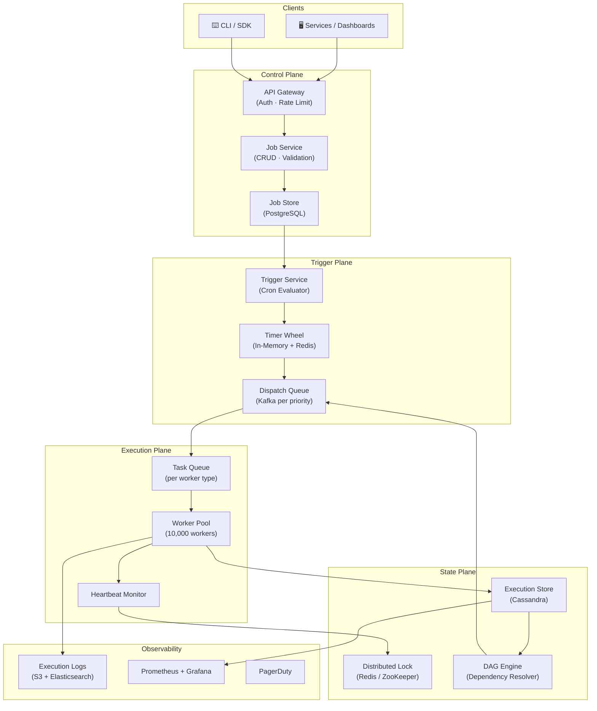
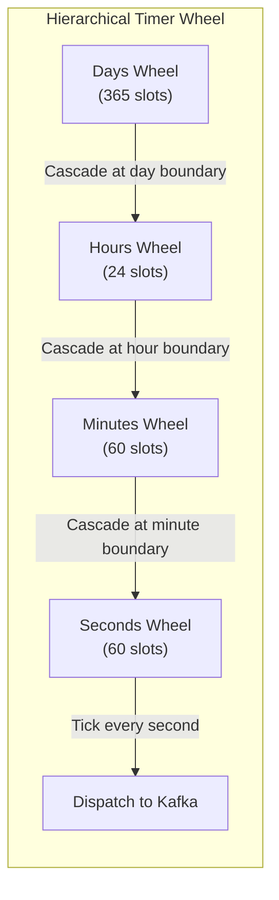
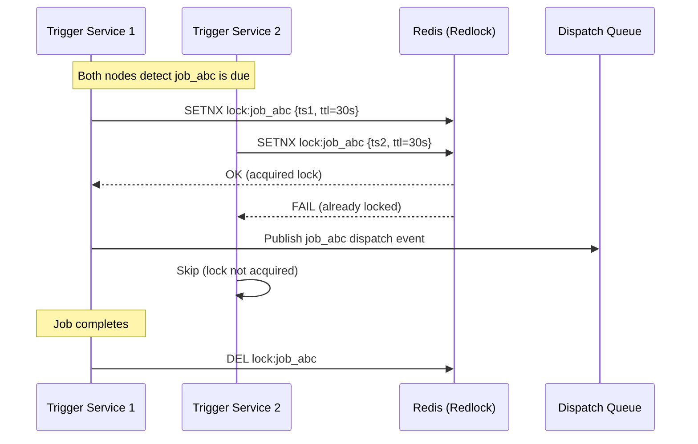
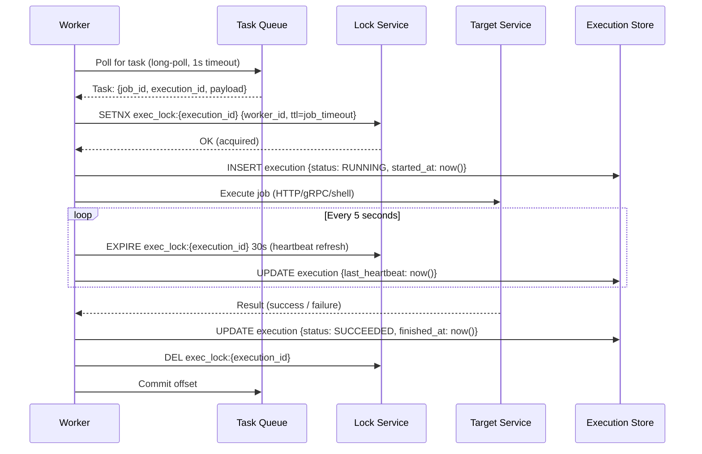
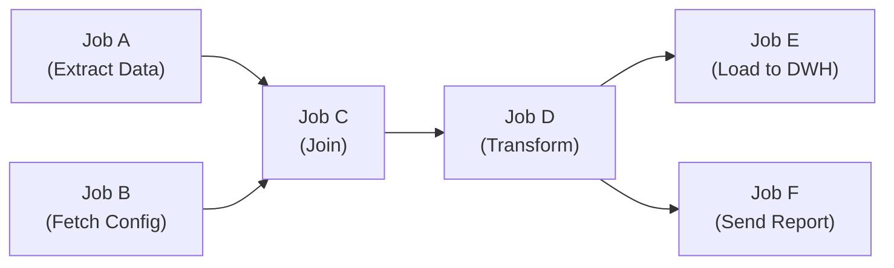
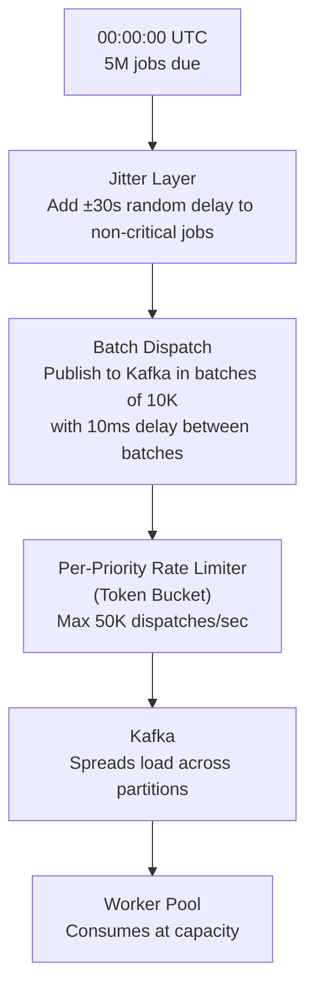
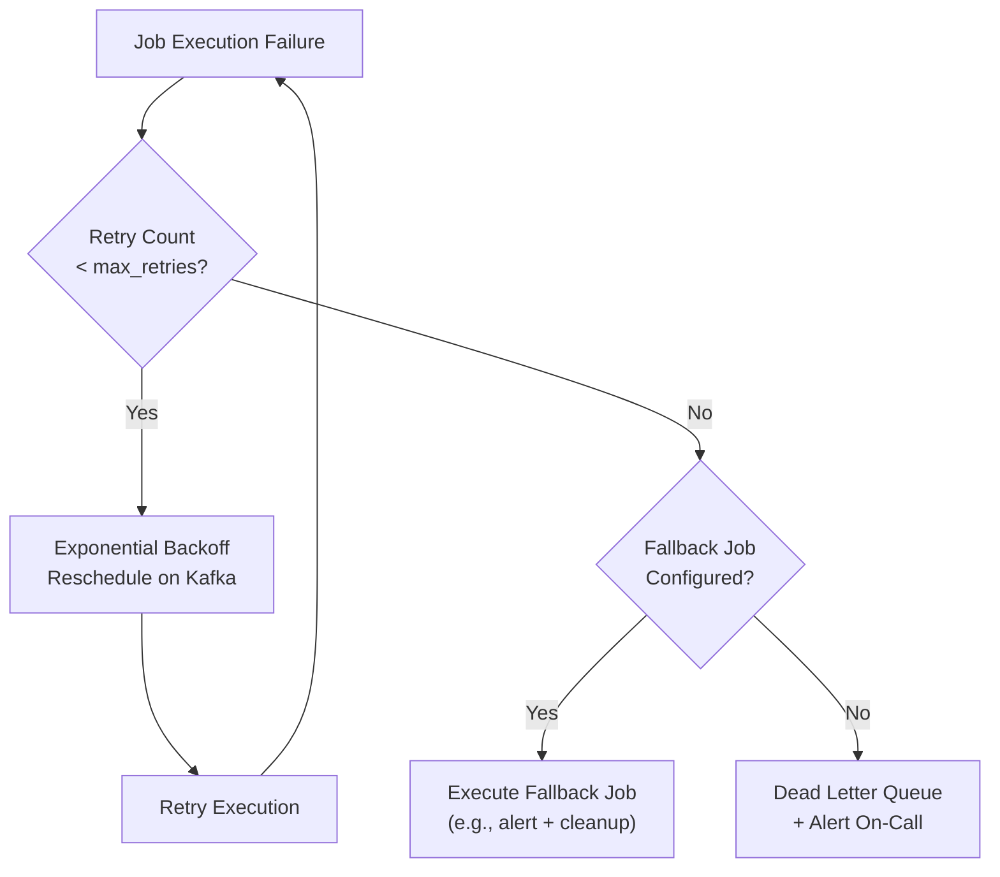
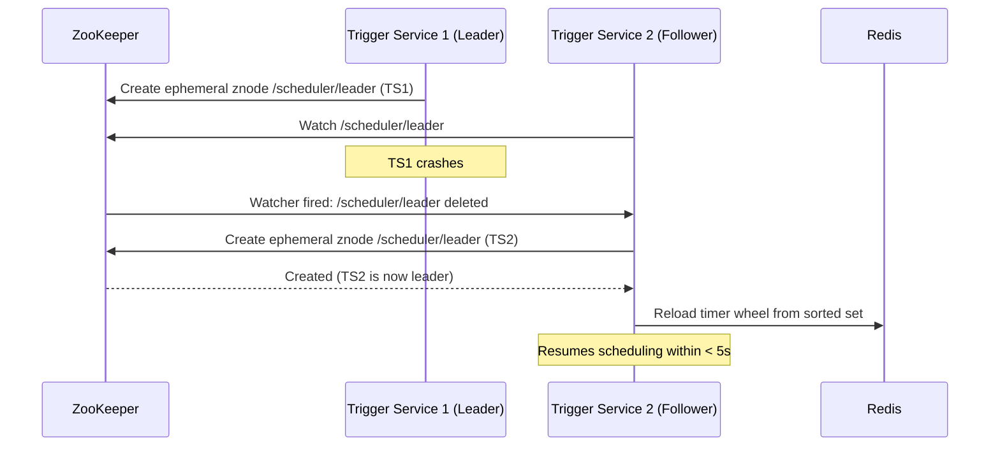
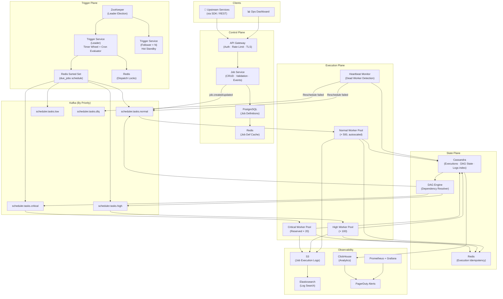

# Designing a Distributed Job Scheduler: The Engine Behind Every Cron at Scale

> **Difficulty:** Medium | **Category:** Infrastructure / Platform Service | **Companies:** Uber (Cadence/Temporal), Netflix (Conductor), Airbnb, LinkedIn (Azkaban), Apache Airflow, Quartz

---

## Introduction

A **Distributed Job Scheduler** is the system responsible for executing tasks at the right time, on the right worker, reliably — even across thousands of machines, datacenter failures, and network partitions. Every modern platform depends on one:

- Uber's billing jobs run every night, reconciling millions of rides
- Netflix generates personalized recommendations for 270M users every Sunday
- Instagram sends Discover Weekly notifications at 9 AM in every timezone
- Banks run regulatory compliance reports at month-end
- E-commerce platforms send abandoned cart emails 30 minutes after a user leaves

On the surface, a job scheduler sounds like "a smarter cron." In reality, it's one of the most demanding distributed systems problems you'll face:

- **Exactly-once execution** — a billing job that runs twice is a disaster
- **Fault tolerance** — workers crash mid-job; the job must resume, not restart
- **Ordering and dependencies** — "Run Job B only after Job A succeeds"
- **Scale** — millions of scheduled jobs, thousands of concurrent workers
- **Clock skew** — time is unreliable in distributed systems; "run at 10 AM" is harder than it sounds
- **Backpressure** — a burst of due jobs must not overwhelm the worker fleet

Real-world systems like **Temporal** (Uber's open-source evolution of Cadence) and **Netflix Conductor** solve exactly these problems in production. Understanding this design gives you deep insight into workflow orchestration, distributed coordination, and fault-tolerant execution patterns.

---

## Requirements Clarification

### Functional Requirements

- **One-time scheduling** — execute a job at a specific future time (e.g., "send email at 3 PM")
- **Recurring scheduling** — execute a job on a cron expression (e.g., "run every day at midnight")
- **Dependency-based scheduling** — execute Job B only after Job A (and C, D) complete successfully (DAG execution)
- **Job CRUD** — create, update, pause, resume, cancel, delete jobs
- **Worker registration** — workers register their capabilities; scheduler assigns compatible jobs
- **Job status & history** — track execution status: pending, running, succeeded, failed, retried
- **Retry policies** — configurable retry count, backoff strategy, failure handling
- **Distributed execution** — run job workers across a fleet; no single machine bottleneck
- **Job prioritization** — high-priority jobs run before low-priority ones when resources are contested
- **Timeouts** — kill stuck jobs that exceed their time limit
- **Idempotent execution** — re-running a job produces the same result as running it once

### Non-Functional Requirements

- **Exactly-once execution guarantee** — no job executes more than once in a given schedule window
- **High availability** — 99.99% uptime; scheduler must continue operating if individual nodes fail
- **Low scheduling latency** — a job due at T=0 must start executing within seconds, not minutes
- **Scalability** — support 10M+ scheduled jobs, 100K+ concurrent job executions
- **Observability** — full audit log of every job execution for debugging and compliance
- **Durability** — job definitions and execution state must survive complete datacenter restarts
- **Consistency** — two schedulers must never assign the same job to two different workers simultaneously

### Out of Scope

- Container/VM orchestration (Kubernetes does this)
- Real-time stream processing (Flink/Kafka Streams)
- Full workflow management UI (operational tooling)

---

## Capacity Estimation

### Scale Numbers

| Metric | Estimate |
|---|---|
| Total scheduled jobs | 10 million |
| Jobs triggered per day | 50 million |
| Jobs triggered per second (avg) | ~580/sec |
| Jobs triggered per second (peak) | ~50,000/sec (midnight cron burst) |
| Concurrent running jobs | ~100,000 |
| Worker nodes | ~10,000 |
| Job execution duration (avg) | 30 seconds |
| Job execution duration (p99) | 10 minutes |
| Job state updates per second | ~500,000/sec |

### The Midnight Burst Problem

The most critical capacity challenge: most recurring jobs are scheduled at "midnight" or "top of hour." At midnight:
- Every daily cron job fires simultaneously
- If 10M jobs have daily schedules → **massive burst at 00:00:00**

This is the thundering herd problem specific to schedulers. Every design decision around the trigger pipeline must account for it.

### Storage Estimation

**Job definitions:**
- 10M jobs × 2 KB per job definition = **20 GB** (fits in memory)

**Execution history:**
- 50M executions/day × 500 bytes per execution record = **25 GB/day**
- 90-day retention: **2.25 TB**

**Worker heartbeat state:**
- 10,000 workers × 500 bytes = **5 MB** (tiny, fully in-memory)

**Job execution logs:**
- 50M executions/day × avg 10 KB stdout/stderr = **500 GB/day**
- Stored in object storage (S3), not DB

---

## High-Level Architecture

A distributed job scheduler has five logical planes:

1. **Control plane** — accepts job definitions, manages job lifecycle
2. **Trigger plane** — determines which jobs are due and dispatches them
3. **Execution plane** — workers that actually run jobs
4. **State plane** — tracks job execution state durably
5. **Observability plane** — logs, metrics, alerting



---

## Core Components Deep Dive

### 1. Job Service (Control Plane)

The Job Service is the CRUD layer for job definitions. It handles:

- Accepting and validating job definitions (schedule, payload, retry policy, timeout)
- Storing job definitions durably in PostgreSQL
- Publishing `job.created` / `job.updated` / `job.deleted` events to Kafka for the Trigger Service to consume
- Exposing APIs for status queries, manual triggers, and cancellation

The Job Service is **stateless** — all state lives in PostgreSQL and can be horizontally scaled behind a load balancer.

### 2. Trigger Service — The Core Scheduling Engine

The Trigger Service is the most architecturally interesting component. It is responsible for **determining which jobs are due and dispatching them at the right time**.

**The fundamental challenge:** With 10M scheduled jobs, you cannot poll the database every second checking "which jobs are due now?" — that's 10M DB reads/sec.

**Solution: Hierarchical Timer Wheel**

A Timer Wheel is a data structure that represents time as a ring buffer. Each slot in the ring represents a time interval (e.g., 1 second). Jobs are placed in the slot corresponding to their next trigger time.

```
Timer Wheel (1-second resolution, 3600 slots for 1 hour):

Slot 0 [00:00]: [job_a, job_b, job_c]   ← current second
Slot 1 [00:01]: [job_d]
Slot 2 [00:02]: []
...
Slot 3599 [59:59]: [job_e, job_f]
```

Every second, the wheel advances one slot. All jobs in the current slot are dispatched. For jobs due more than 1 hour in the future, a hierarchical outer wheel (minutes/hours/days) cascades jobs down into the inner wheel as they approach.

**Why not just use `SELECT * FROM jobs WHERE next_run_at <= NOW()`?**
- At 10M jobs: slow, requires a full index scan even with indexing
- Doesn't scale to sub-second precision
- Creates database hotspot at trigger time
- Timer Wheel is O(1) per job dispatch vs. O(log N) for a sorted DB query



**Persistence:** The Timer Wheel is an in-memory structure but backed by Redis (sorted set: `ZADD due_jobs {timestamp} {job_id}`). On Trigger Service restart, it rehydrates from Redis.

### 3. Distributed Lock Service — Preventing Duplicate Execution

This is the **most critical correctness guarantee** in the system. When multiple Trigger Service nodes are running (for HA), they must not all dispatch the same job simultaneously.

**Solution: Leader election + distributed locks**



**Redlock algorithm** (Redis distributed lock):
- Acquire lock on N/2+1 Redis nodes simultaneously
- Lock is valid only if majority acquired in less than lock TTL
- Prevents split-brain scenarios where two nodes both believe they hold the lock

**Why not ZooKeeper?**
- ZooKeeper provides stronger consistency guarantees (ZAB protocol, sequential znodes)
- Better for **leader election** scenarios (one scheduler node is leader, all others are followers)
- Redis is better for **per-job locks** (millions of locks, sub-ms operations)
- Production systems often use **ZooKeeper for leader election** + **Redis for per-job locking**

### 4. Dispatch Queue (Kafka)

Once a job is triggered, it's published to a Kafka topic as a **task event**. Workers consume from this queue.

**Topic design:**

```
scheduler.tasks.critical    (SLA: start within 1s)   → 50 partitions
scheduler.tasks.high        (SLA: start within 5s)   → 100 partitions
scheduler.tasks.normal      (SLA: start within 30s)  → 200 partitions
scheduler.tasks.low         (SLA: start within 5min) → 50 partitions
```

**Why Kafka over a traditional queue (RabbitMQ)?**
- Kafka retains messages even after consumption — critical for replay on worker failure
- Consumer offset management gives fine-grained control over "at-least-once" delivery
- Kafka's partition model allows work-stealing without coordination overhead
- At 50,000 jobs/sec peak throughput, Kafka is the only option that won't bottleneck

### 5. Worker Pool — Execution Engine

Workers are the actual executors of jobs. Each worker:

1. **Polls** its assigned Kafka partition for task events
2. **Acquires a per-job execution lock** (Redis) — prevents duplicate execution if Kafka delivers twice
3. **Executes the job** (subprocess, HTTP call, or gRPC call to the target service)
4. **Reports status** to the Execution Store (Cassandra)
5. **Sends heartbeats** every 5 seconds while running
6. **Releases lock** and acknowledges Kafka offset on completion

**Worker types:**
- **Generic workers** — execute arbitrary code sandboxed in containers (Docker/gVisor)
- **HTTP workers** — call a webhook URL (simplest model; target service does the actual work)
- **gRPC workers** — call a specific RPC endpoint
- **Shell workers** — run a shell command (for ops/data jobs)



### 6. Heartbeat Monitor — Dead Worker Detection

Workers crash. The Heartbeat Monitor detects this and reassigns the job:

```
Monitor runs every 10 seconds:
  SELECT executions WHERE status = RUNNING AND last_heartbeat < NOW() - 30s

  For each stale execution:
    1. Check if execution lock in Redis is still held
    2. If lock expired (worker crashed) → mark execution as FAILED
    3. If retry_count < max_retries → reschedule on Kafka
    4. If max_retries exhausted → mark as PERMANENTLY_FAILED, alert
```

**Why 30 seconds for heartbeat timeout?**
- Workers heartbeat every 5 seconds
- 30-second timeout = 6 missed heartbeats before declaring dead
- Trades off: faster detection (lower timeout) vs. false positives from GC pauses or network blips

### 7. DAG Engine — Dependency Resolution

For workflows where jobs have dependencies (Job B runs after Job A), the DAG (Directed Acyclic Graph) Engine tracks upstream job completion and triggers downstream jobs.



**Implementation:**

```python
# On job completion event from Kafka:
def on_job_completed(job_id: str, status: str):
    if status != "SUCCEEDED":
        # Handle DAG failure: cancel downstream or mark failed
        handle_dag_failure(job_id)
        return

    # Find all jobs waiting on this job
    downstream_jobs = get_downstream_jobs(job_id)
    for downstream in downstream_jobs:
        # Check if ALL upstream dependencies are satisfied
        upstream_deps = get_upstream_deps(downstream.job_id)
        all_satisfied = all(dep.status == "SUCCEEDED" for dep in upstream_deps)
        if all_satisfied:
            dispatch(downstream.job_id)
```

**DAG state stored in Cassandra** — partitioned by `workflow_id` so all dependency checks for a workflow hit the same partition.

### 8. Execution Store (Cassandra)

Every job execution generates multiple state transitions (PENDING → RUNNING → SUCCEEDED/FAILED). At 50M executions/day with multiple state updates each, this is a write-heavy workload ideal for Cassandra.

### 9. Observability Pipeline

Every job execution streams logs to S3 (cheap, durable, queryable via Athena) and critical events to Elasticsearch for real-time search:

- Worker stdout/stderr → Fluentd → S3 (raw logs) + Elasticsearch (last 7 days)
- Execution state events → Kafka → ClickHouse (OLAP for aggregate queries: "how many jobs failed in the last hour?")
- Metrics → Prometheus: queue depth, execution latency p50/p99, worker utilization, retry rate

---

## Database Design

### Storage Layer Decisions

| Data | Store | Justification |
|---|---|---|
| Job definitions | PostgreSQL | Relational, ACID, low volume, complex queries |
| Execution records | Cassandra | Write-heavy, time-series, TTL, high throughput |
| Execution logs | S3 + Elasticsearch | Cheap bulk storage + searchable index |
| Timer state (next triggers) | Redis Sorted Set | O(log N) inserts, O(1) range queries by timestamp |
| Distributed locks | Redis | Sub-ms atomic operations, TTL-based expiry |
| Worker heartbeats | Redis | Ephemeral, 30s TTL per worker |
| DAG state | Cassandra | Co-locate per workflow_id, append-friendly |
| Analytics | ClickHouse | OLAP aggregates on execution history |

### Job Definition Schema (PostgreSQL)

```sql
CREATE TABLE jobs (
    job_id          UUID PRIMARY KEY DEFAULT gen_random_uuid(),
    name            TEXT NOT NULL,
    description     TEXT,
    job_type        TEXT NOT NULL,          -- http | grpc | shell | container
    schedule_type   TEXT NOT NULL,          -- one_time | cron | manual
    cron_expression TEXT,                   -- e.g., "0 0 * * *" (midnight daily)
    scheduled_at    TIMESTAMPTZ,            -- for one_time jobs
    timezone        TEXT DEFAULT 'UTC',
    payload         JSONB,                  -- job-specific config (URL, headers, etc.)
    priority        TEXT DEFAULT 'normal',  -- critical | high | normal | low
    timeout_seconds INT DEFAULT 3600,
    max_retries     INT DEFAULT 3,
    retry_backoff   TEXT DEFAULT 'exponential',  -- fixed | linear | exponential
    retry_delay_sec INT DEFAULT 60,
    is_active       BOOLEAN DEFAULT TRUE,
    created_by      TEXT NOT NULL,
    created_at      TIMESTAMPTZ DEFAULT NOW(),
    updated_at      TIMESTAMPTZ DEFAULT NOW(),
    next_run_at     TIMESTAMPTZ,            -- pre-computed, indexed
    last_run_at     TIMESTAMPTZ,
    tags            TEXT[]
);

CREATE INDEX idx_jobs_next_run ON jobs(next_run_at) WHERE is_active = TRUE;
CREATE INDEX idx_jobs_tags ON jobs USING GIN(tags);
```

### Execution Record Schema (Cassandra)

```sql
CREATE TABLE executions (
    job_id          UUID,
    execution_id    TIMEUUID,           -- time-based, naturally ordered
    worker_id       TEXT,
    status          TEXT,               -- pending | running | succeeded | failed | cancelled | timed_out
    trigger_type    TEXT,               -- scheduled | manual | retry | dag
    triggered_at    TIMESTAMP,
    started_at      TIMESTAMP,
    finished_at     TIMESTAMP,
    last_heartbeat  TIMESTAMP,
    retry_count     INT,
    exit_code       INT,
    error_message   TEXT,
    log_s3_url      TEXT,
    PRIMARY KEY (job_id, execution_id)
) WITH CLUSTERING ORDER BY (execution_id DESC)
  AND default_time_to_live = 7776000;  -- 90 days TTL

-- Query by time window (for monitoring dashboards):
CREATE TABLE executions_by_time (
    bucket          TEXT,               -- 'YYYY-MM-DD-HH' time bucket
    execution_id    TIMEUUID,
    job_id          UUID,
    status          TEXT,
    PRIMARY KEY (bucket, execution_id)
) WITH CLUSTERING ORDER BY (execution_id DESC)
  AND default_time_to_live = 604800;   -- 7 days
```

### DAG Schema (Cassandra)

```sql
CREATE TABLE dag_dependencies (
    workflow_id     UUID,
    job_id          UUID,
    depends_on      UUID,               -- upstream job_id
    PRIMARY KEY (workflow_id, job_id, depends_on)
);

CREATE TABLE dag_execution_state (
    workflow_run_id UUID,
    job_id          UUID,
    status          TEXT,
    updated_at      TIMESTAMP,
    PRIMARY KEY (workflow_run_id, job_id)
);
```

### Timer State (Redis Sorted Set)

```
Key:   due_jobs
Type:  Sorted Set
Score: Unix timestamp (seconds)
Member: job_id

ZADD due_jobs 1748307600 "job_abc123"    → schedule job for Unix timestamp
ZRANGEBYSCORE due_jobs 0 {now} LIMIT 0 1000  → fetch all jobs due now (batch of 1000)
ZREM due_jobs "job_abc123"               → remove after dispatching
```

The Trigger Service runs a tight loop: every 100ms, call `ZRANGEBYSCORE` for jobs due in the past 100ms. This gives sub-second dispatch latency without polling the main DB.

### Sharding Strategy

- **PostgreSQL (job definitions)**: Shard by `job_id` mod 32; 32 logical shards on 4 physical nodes. Low volume — 10M rows is manageable even on a single node.
- **Cassandra (executions)**: Natural partitioning by `job_id` — all executions for a job are co-located. For hot jobs (running every second), add a bucket suffix: `(job_id, bucket)` where `bucket = week_number`.
- **Redis (timer + locks)**: Redis Cluster with 16,384 hash slots. Timer sorted set is on a dedicated Redis node (not sharded — it must be a single sorted set for atomic range queries). Locks are sharded normally.

### Replication Strategy

- **PostgreSQL**: Synchronous replication to 1 standby (job definitions are critical, must not be lost); 2 async read replicas for status queries
- **Cassandra**: RF=3 across 3 AZs, `LOCAL_QUORUM` writes (2/3 must acknowledge execution status updates), `LOCAL_ONE` reads
- **Redis Timer Sorted Set**: Master + 1 replica; Redis Sentinel for automatic failover; RDB snapshot every 60 seconds

---

## API Design

### Create a Job

```http
POST /v1/jobs
Authorization: Bearer <api_key>
Content-Type: application/json

{
  "name": "daily-revenue-report",
  "description": "Generates daily revenue CSV and emails finance team",
  "job_type": "http",
  "schedule_type": "cron",
  "cron_expression": "0 6 * * *",       // 6 AM daily
  "timezone": "America/New_York",
  "payload": {
    "url": "https://reporting.internal/api/revenue-report",
    "method": "POST",
    "headers": { "X-Service-Token": "svc_token_xyz" },
    "body": { "output_format": "csv", "notify_email": "finance@company.com" }
  },
  "priority": "high",
  "timeout_seconds": 1800,
  "max_retries": 2,
  "retry_backoff": "exponential",
  "retry_delay_sec": 300,
  "tags": ["finance", "reporting"]
}

Response 201 Created:
{
  "job_id": "job_abc123",
  "name": "daily-revenue-report",
  "status": "active",
  "next_run_at": "2026-05-27T06:00:00-04:00",
  "created_at": "2026-05-26T10:00:00Z"
}
```

### Trigger a Job Manually

```http
POST /v1/jobs/{job_id}/trigger
Authorization: Bearer <api_key>
Content-Type: application/json

{
  "trigger_reason": "Manual trigger by on-call engineer",
  "payload_override": { "output_format": "json" }   // optional: override job payload
}

Response 202 Accepted:
{
  "execution_id": "exec_xyz789",
  "job_id": "job_abc123",
  "status": "pending",
  "triggered_at": "2026-05-26T10:05:00Z",
  "trigger_type": "manual"
}
```

### Get Execution Status

```http
GET /v1/executions/{execution_id}
Authorization: Bearer <api_key>

Response 200 OK:
{
  "execution_id": "exec_xyz789",
  "job_id": "job_abc123",
  "job_name": "daily-revenue-report",
  "status": "running",
  "worker_id": "worker-node-042",
  "trigger_type": "scheduled",
  "triggered_at": "2026-05-26T06:00:00Z",
  "started_at": "2026-05-26T06:00:02Z",
  "finished_at": null,
  "last_heartbeat": "2026-05-26T06:05:47Z",
  "retry_count": 0,
  "log_url": "https://logs.internal/executions/exec_xyz789"
}
```

### List Job Execution History

```http
GET /v1/jobs/{job_id}/executions?limit=20&status=failed&since=2026-05-01T00:00:00Z
Authorization: Bearer <api_key>

Response 200 OK:
{
  "executions": [
    {
      "execution_id": "exec_aaa111",
      "status": "failed",
      "started_at": "2026-05-26T06:00:02Z",
      "finished_at": "2026-05-26T06:00:15Z",
      "error_message": "Target service returned 503",
      "retry_count": 2
    }
  ],
  "total": 3,
  "next_cursor": "<opaque_token>"
}
```

### Create a DAG Workflow

```http
POST /v1/workflows
Authorization: Bearer <api_key>
Content-Type: application/json

{
  "name": "etl-pipeline",
  "schedule_type": "cron",
  "cron_expression": "0 2 * * *",
  "jobs": [
    { "job_id": "job_extract",   "depends_on": [] },
    { "job_id": "job_transform", "depends_on": ["job_extract"] },
    { "job_id": "job_load",      "depends_on": ["job_transform"] },
    { "job_id": "job_notify",    "depends_on": ["job_load"] }
  ],
  "on_failure": "stop"    // stop | continue | retry_failed_only
}

Response 201 Created:
{
  "workflow_id": "wf_def456",
  "name": "etl-pipeline",
  "job_count": 4,
  "next_run_at": "2026-05-27T02:00:00Z"
}
```

### Worker Registration (Internal gRPC)

```protobuf
service WorkerRegistry {
  rpc Register(RegisterRequest) returns (RegisterResponse);
  rpc Heartbeat(HeartbeatRequest) returns (HeartbeatResponse);
  rpc ReportCompletion(CompletionRequest) returns (CompletionResponse);
}

message RegisterRequest {
  string worker_id    = 1;
  repeated string capabilities = 2;  // ["http", "shell", "python-3.11"]
  int32 max_concurrent = 3;          // how many jobs this worker can run in parallel
  string region       = 4;
}

message HeartbeatRequest {
  string worker_id    = 1;
  string execution_id = 2;
  string status       = 3;           // RUNNING
  int64 timestamp     = 4;
}
```

---

## Scalability Challenges

### 1. The Midnight Thundering Herd

**Problem:** At 00:00:00 UTC, millions of daily cron jobs (`0 0 * * *`) become due simultaneously. The `ZRANGEBYSCORE` query returns 5M+ job IDs at once. Publishing 5M events to Kafka in one second overwhelms consumers.

**Solutions:**



- **Jitter:** Add a random ±30 seconds to non-SLA-critical jobs at scheduling time. A job meant for midnight actually runs between 23:59:30 and 00:00:30, spreading the burst 10×.
- **Staggered dispatch:** The Trigger Service dispatches in batches of 10K jobs with 10ms inter-batch delay → 5M jobs dispatched over 5 seconds, not 1.
- **Priority-aware throttling:** Critical jobs bypass throttling; low-priority jobs are rate-limited aggressively.

### 2. Hot Job Partitions in Cassandra

**Problem:** A job that runs every second generates 86,400 execution records per day. All stored in partition `(job_id)` → hot partition.

**Solution:** Bucket partitioning:

```sql
PRIMARY KEY ((job_id, week_bucket), execution_id)
-- week_bucket = 'YYYY-Www' (e.g., '2026-W21')
-- All high-frequency job executions spread across weekly buckets
-- Query: scatter-gather across last N weeks
```

Alternatively: cap high-frequency jobs (sub-minute intervals) to a **dedicated Cassandra keyspace** with higher replication and no compaction overhead.

### 3. Distributed Lock Contention

**Problem:** At 50K jobs/sec, the lock acquisition layer processes 50K `SETNX` operations/sec. With a 32-shard Redis Cluster, that's ~1,500 ops/sec per shard — well within Redis's capacity. But the lock release operations (DEL) add an equal load.

**Solution:**
- Lock keys expire naturally after `job_timeout` seconds → workers that crash don't hold locks forever
- **Optimistic locking**: For non-critical jobs, skip explicit pre-dispatch locking; instead, use an **idempotency key** embedded in the task payload. Worker checks: "has this execution_id been processed?" before starting work.
- Critical path locking only for **scheduling** (Trigger Service), not for **execution** (Worker) — reduces contention by 10×.

### 4. Clock Skew Between Scheduler Nodes

**Problem:** Trigger Service nodes run on different physical machines. Their clocks may differ by up to 500ms. A job due at 10:00:00.000 may be dispatched by TS1 at 09:59:59.700 and by TS2 at 10:00:00.200 — both believing they're first.

**Solutions:**
- **NTP synchronization** — all nodes sync to the same NTP source; clock skew < 10ms in practice
- **Logical clocks / hybrid logical clocks (HLC)** — don't rely on wall clock for sequencing; use HLC for ordering within the scheduler
- **Grace window** — the Redis timer sorted set uses `ZRANGEBYSCORE 0 {now + 500ms}` — jobs due within the next 500ms are proactively fetched, and the lock mechanism (SETNX) ensures only one Trigger Service node actually dispatches

### 5. Long-Running Job Starvation

**Problem:** The worker pool has 100 slots. A batch of 100 long-running jobs (each taking 30 minutes) occupy all slots. New high-priority jobs arriving are stuck in the queue for 30 minutes.

**Solutions:**
- **Dedicated worker pools per priority tier**: Critical jobs have a reserved pool (10 workers); normal jobs share the rest. Priority queues never starve critical work.
- **Job preemption** (advanced): A new CRITICAL job can preempt a NORMAL job — checkpoint the normal job's state, pause it, run the critical job, then resume. Requires jobs to be preemption-aware.
- **Worker autoscaling**: K8s HPA scales worker pods based on Kafka consumer lag. Long-running job burst → auto-scale workers.

### 6. Idempotency of Job Execution

**Problem:** A job runs successfully, but the worker crashes before committing the Kafka offset. Kafka redelivers the task event. The job runs again — possible duplicate side effects (double payment, double email).

**Solutions:**
- **Idempotency key in payload**: Job carries an `execution_id` (UUID). Worker checks Cassandra: "is execution_id already SUCCEEDED?" → skip if yes.
- **Idempotent job design**: The actual job (the target HTTP endpoint) must be idempotent. Pass the `execution_id` as a request header; the target service uses it as its own idempotency key.
- **Exactly-once via transactional outbox**: Worker writes execution result to Cassandra and Kafka offset commit in the same transaction (using Kafka transactions + Cassandra conditional writes).

---

## Scaling Strategies

### Horizontal Scaling of Stateless Components

- **Job Service** (CRUD API): Stateless, scale behind a load balancer; 10 instances handle all job definition reads/writes comfortably
- **Trigger Service**: Run N instances with leader election (ZooKeeper / etcd). Only the **leader** drives the timer wheel; followers are hot standby. On leader failure, a follower takes over in < 5 seconds.
- **Workers**: Stateless (per-job state in Redis + Cassandra). Scale horizontally via K8s HPA based on Kafka consumer lag. Target: lag < 5 seconds for normal priority.

### Partitioned Timer Wheels

For extreme scale (100M scheduled jobs), shard the timer wheel itself:

```
Shard by hash(job_id) % N_shards:
  Shard 0: manages timer wheel for job IDs 0-10M
  Shard 1: manages timer wheel for job IDs 10M-20M
  ...
  Each shard is a separate Trigger Service instance
  Each shard has its own Redis sorted set and Kafka topic range
```

This linearly scales trigger throughput — each shard is an independent scheduling unit.

### Kafka Consumer Lag-Based Autoscaling

```yaml
# Kubernetes HPA based on Kafka consumer lag (via KEDA)
apiVersion: keda.sh/v1alpha1
kind: ScaledObject
spec:
  scaleTargetRef:
    name: job-worker-deployment
  triggers:
    - type: kafka
      metadata:
        topic: scheduler.tasks.normal
        consumerGroup: normal-workers
        lagThreshold: "1000"    # Scale up if lag > 1000 messages
  minReplicaCount: 10
  maxReplicaCount: 500
```

Workers scale from 10 to 500 pods automatically based on queue depth.

### Caching Job Definitions

Job definitions are read on every execution by the Worker (to fetch timeout, retry policy, etc.):
- Cache in Redis: `job_def:{job_id}` → TTL 5 minutes
- Cache hit rate > 99% → PostgreSQL sees < 1% of read traffic
- On job update: write-through cache invalidation (update DB + DEL Redis key atomically)

---

## Reliability & Fault Tolerance

### Three-Layer Failure Handling



**Retry backoff strategies:**

```
fixed:        retry after 60s, 60s, 60s
linear:       retry after 60s, 120s, 180s
exponential:  retry after 60s, 240s, 960s (4× each time)
exponential+jitter: retry after 60s±30s, 240s±60s... (prevents synchronized retry storms)
```

**Why exponential backoff with jitter?** If 1,000 jobs fail simultaneously (e.g., target service goes down), fixed-interval retries cause a synchronized retry storm that overwhelms the recovering target. Jitter spreads retries over time.

### Leader Failover for Trigger Service



The timer wheel state lives in Redis (not in-process memory) — this is what makes leader failover fast. The new leader doesn't need to rebuild state; it reads Redis.

### Multi-Region Deployment

```mermaid
graph TB
    subgraph "Primary Region (US-East)"
        TS_P["Trigger Service\n(Leader)"]
        Workers_P["Worker Pool"]
        DB_P["PostgreSQL Primary\n+ Cassandra Ring"]
        Redis_P["Redis Cluster"]
    end
    subgraph "Secondary Region (US-West)"
        TS_S["Trigger Service\n(Standby)"]
        Workers_S["Worker Pool"]
        DB_S["PostgreSQL Standby\n+ Cassandra Ring"]
        Redis_S["Redis Cluster"]
    end

    DB_P <-->|Streaming Replication| DB_S
    TS_P -->|Active scheduling| Workers_P
    TS_S -->|Idle (monitoring)| Workers_S
    Note_1["On primary region failure:\nDNS failover → TS_S becomes leader\nRTO < 2 minutes"]
```

### Disaster Recovery

- **RPO (Recovery Point Objective):** < 30 seconds — Cassandra replication + PostgreSQL streaming WAL means at most 30 seconds of execution history loss
- **RTO (Recovery Time Objective):** < 2 minutes — leader election + timer wheel reload from Redis
- **Job definition recovery:** PostgreSQL backup to S3 (WAL archiving) + daily snapshots; job definitions are the most critical data to protect

---

## Security Considerations

### Authentication Between Services

- **API keys** with SHA-256 hashed storage in PostgreSQL; short-lived tokens (24h) issued via OAuth client credentials flow
- **mTLS** for internal service mesh communication (Worker ↔ Trigger Service ↔ Job Service)
- **Per-tenant isolation**: Multi-tenant schedulers must isolate job definitions and execution logs; shard by `tenant_id` with row-level security in PostgreSQL

### Authorization Model

```
Roles:
  scheduler:admin      → full CRUD on all jobs
  scheduler:operator   → trigger, pause, resume; read-only on job definitions
  scheduler:viewer     → read-only on jobs and executions
  scheduler:service    → programmatic API access (for upstream services)

Resource-level permissions:
  Job ownership: only the creating service/team can modify their jobs
  Cross-team reads: allowed for execution history (for debugging)
```

### Secure Job Payload Handling

Job payloads often contain sensitive data (API keys, database credentials for ETL jobs):
- **Encrypt payloads at rest** in PostgreSQL using AES-256 column-level encryption
- **Secrets management integration**: Instead of embedding secrets in payloads, store a reference: `"secret_ref": "vault://secret/db-credentials"` — Worker fetches at execution time from HashiCorp Vault
- **Never log payloads**: Execution logs must not contain job payload data (may include credentials)

### Preventing Scheduling Abuse

- **Rate limiting per tenant**: Max 1000 job creates/hour per API key
- **Resource quotas**: Max 100 concurrent executions per tenant; max 10M total jobs per tenant
- **Job sandbox isolation**: Generic workers run in gVisor (sandboxed container runtime) — prevents escape from job execution environment
- **Outbound network restrictions**: HTTP workers can only call pre-approved internal endpoints (allowlist); prevents SSRF via job payloads

### DDoS Protection

- API Gateway rate limiting: 1,000 requests/sec per API key
- Job trigger rate limiting: Burst of manual triggers from a compromised key cannot flood the dispatch queue — token bucket limiter per key in Redis
- Kafka topic ACLs: Only authorized Trigger Service nodes can publish to `scheduler.tasks.*` topics

---

## Tradeoffs & Alternatives

### Pull Model vs. Push Model for Workers

| | Pull (Worker polls queue) | Push (Scheduler sends to worker) |
|---|---|---|
| **Backpressure** | ✅ Natural (worker only polls when ready) | ❌ Scheduler must track worker capacity |
| **Worker failure** | ✅ Job stays in queue until worker ACKs | ❌ Job lost if push fails |
| **Complexity** | Low | High |
| **Latency** | Slightly higher (poll interval) | Lower (immediate push) |
| **Worker discovery** | Not needed | Scheduler must know worker addresses |

**Verdict:** Pull model wins for distributed schedulers. Workers pull from Kafka partitions only when they have capacity — natural backpressure with no central coordination.

### Database Choice: PostgreSQL vs. Cassandra for Jobs

| | PostgreSQL (job definitions) | Cassandra (executions) |
|---|---|---|
| **Consistency** | Strong (ACID) | Tunable (eventual) |
| **Query flexibility** | Full SQL, JOINs | Limited, key-based |
| **Write throughput** | ~50K writes/sec | Millions/sec |
| **Horizontal scale** | Complex sharding | Linear, native |
| **Use case** | 10M rows, complex queries | 50M writes/day, time-series |

Different data, different requirements, different stores. Don't force one database to do everything.

### Temporal vs. Custom Scheduler

Building a custom scheduler vs. adopting **Temporal** (open-source, battle-tested):

| | Custom Build | Temporal / Conductor |
|---|---|---|
| **Time to production** | 6-12 months | Days |
| **Exactly-once semantics** | Hard to get right | Built-in |
| **Workflow versioning** | Must build | Built-in |
| **Community/ecosystem** | None initially | Large, active |
| **Cost at scale** | Low (infra cost only) | Medium (Temporal Cloud) |
| **Customization** | Full | Limited |

**Recommendation:** Use Temporal for most use cases. Build custom only when Temporal's limitations (workflow complexity caps, latency, custom trigger types) cannot be worked around.

### Cron vs. Event-Driven Scheduling

Traditional schedulers are **time-driven** (run at 10 AM). Modern platforms increasingly use **event-driven scheduling** (run when event X occurs):

- **Time-driven**: ETL jobs, reports, billing runs, data exports
- **Event-driven**: "Send email 30 minutes after user abandons cart", "Retry payment 1 hour after failure"

A mature scheduler must support both. Event-driven scheduling is implemented as: "create a one-time delayed job when the trigger event arrives" — the scheduler becomes a **delay queue** in addition to a cron scheduler.

---

## Real-World Engineering Insights

### Uber's Cadence → Temporal

Uber built **Cadence** internally to orchestrate complex workflows (driver onboarding, trip lifecycle, payment processing). Key problems it solved:

- **Long-running workflows**: A workflow can run for days/weeks (e.g., "send reminder emails over 30 days until user completes onboarding") — Cadence persists the full workflow state in Cassandra
- **Workflow versioning**: When code changes, in-flight workflows continue on the old version; new workflows use the new version — no big-bang migrations
- **Activity retries**: Each "activity" (individual step) has its own retry policy, independent of the workflow

Uber open-sourced Cadence and later the creators founded Temporal.io, which became the industry standard.

### Netflix Conductor

Netflix built **Conductor** for orchestrating microservice workflows in their content production pipeline (encoding, QC, distribution). Key architectural choice: Conductor uses **Redis for the execution state machine** (fast state transitions) + **Elasticsearch for observability** (search execution history). The design prioritizes **execution throughput** over strong consistency — acceptable for media production workflows.

### LinkedIn Azkaban

LinkedIn's **Azkaban** is one of the oldest production-grade job schedulers. Originally built for Hadoop jobs, it pioneered the **DAG-based workflow model** now standard in the industry. Key lesson: LinkedIn found that the **UI and observability tools** are as important as the engine itself — engineers spend more time debugging failed workflows than writing them.

### Google Cloud Workflows vs. AWS Step Functions

Both cloud providers offer managed workflow orchestration:

- **AWS Step Functions**: JSON/YAML state machine definition; billed per state transition; excellent for AWS-native workflows
- **Google Cloud Workflows**: YAML-based; tight integration with GCP services

Key insight from both: **externalize state, not in worker memory**. Every state transition persists before the next step executes. This is what makes these services resilient to worker crashes — they're essentially implementing the write-ahead log (WAL) pattern for workflow execution.

---

## Final Architecture Diagram



---

## Key Takeaways

1. **The Timer Wheel is the right data structure for scheduling at scale.** O(1) dispatch per job, no database polling, sub-second precision. Back it with a Redis sorted set for persistence across restarts.

2. **Distributed locks (Redis SETNX / Redlock) prevent duplicate job dispatch.** Two Trigger Service nodes must never both dispatch the same job. Lock acquisition before dispatch is the correctness guarantee — not Kafka's delivery semantics.

3. **Separate the trigger plane from the execution plane.** The Trigger Service decides when jobs run; Workers decide how. These have fundamentally different scaling characteristics and failure modes.

4. **Leader election (ZooKeeper/etcd) for the Trigger Service, per-job locks (Redis) for execution.** Don't use ZooKeeper for high-frequency per-job locking — it can't handle millions of lock operations/sec.

5. **Jitter is not optional — it's correctness.** Without jitter on midnight cron jobs, you get a thundering herd that will overwhelm your dispatch pipeline every night at exactly 00:00:00.

6. **Idempotency must be designed into job execution, not bolted on.** Workers check "has this execution_id been processed?" before running. Target services must accept idempotency keys. Both layers must participate.

7. **Heartbeat monitoring with TTL-based lock expiry handles worker crashes elegantly.** No need for a central "liveness registry" — just let the lock expire and reschedule.

8. **PostgreSQL for job definitions, Cassandra for execution history.** Different volume, different access patterns, different consistency requirements. Don't force one database to serve both.

9. **Temporal/Conductor for workflow orchestration, custom scheduler for simple cron.** Know when to build vs. buy. Exactly-once workflow semantics are extremely hard to get right — battle-tested frameworks exist for a reason.

10. **The midnight burst problem never goes away — you manage it.** Jitter, pre-fan-out, priority isolation, and autoscaling are the four levers. Use all of them.

---

## Interview Tips

### Common Follow-Up Questions

> **"How do you guarantee exactly-once execution?"**
- Layer 1: Trigger Service acquires distributed lock before publishing to Kafka (no double dispatch)
- Layer 2: Worker checks `execution_id` in Cassandra before starting (no double execution)
- Layer 3: Target service accepts idempotency key in request header (no double side effects)
- True exactly-once requires all three layers — any single layer provides at-most-once or at-least-once

> **"How would you handle a job that's been running for 6 hours but has a 1-hour timeout?"**
- Heartbeat Monitor detects: `last_heartbeat + 30s < now()` AND `started_at + timeout < now()`
- Mark execution as TIMED_OUT in Cassandra
- Send SIGTERM to the worker process; SIGKILL after 30s if it doesn't stop
- Reschedule based on retry policy
- Alert if this is the 3rd timeout in 24 hours (likely a systemic issue)

> **"How would you support long-running workflows that span days or weeks?"**
- This is the Temporal/Cadence use case — use them
- If building custom: persist workflow state as a series of events in Cassandra (event sourcing)
- Each workflow step writes its result before starting the next — like a WAL for business logic
- Workflow replay: on crash, replay events from Cassandra to reconstruct current state

> **"How would you implement rate limiting for job execution? (e.g., max 10 concurrent runs of job_abc)"**
- Redis counter: `INCR job_concurrent:{job_id}` before starting; `DECR` on completion
- Worker checks: if current count >= job's `max_concurrency` → push task back to Kafka with delay
- TTL on the counter (job_timeout seconds) handles crashed workers

> **"How would you handle timezone-aware cron expressions?"**
- Store `timezone` with the job definition (e.g., "America/New_York")
- Trigger Service evaluates cron expression in the job's timezone using a library (Quartz, croniter)
- Next trigger time stored as UTC in Redis sorted set — all internal scheduling is UTC
- DST transitions: libraries handle this; e.g., "0 2 * * *" in a DST timezone may run at 1 AM or 3 AM on the transition day — document the behavior clearly

### What Interviewers Expect

- ✅ Immediately identify the "exactly-once execution" problem as the core challenge
- ✅ Explain the Timer Wheel (not "poll the DB every second")
- ✅ Discuss distributed locks for preventing duplicate dispatch
- ✅ Distinguish between trigger plane and execution plane
- ✅ Address the midnight thundering herd with jitter
- ✅ Explain heartbeat-based dead worker detection
- ✅ Discuss DAG dependency resolution for multi-step workflows
- ✅ Mention idempotency at both the worker and the target service level

### Mistakes Candidates Make

- ❌ Polling the database every second for due jobs — doesn't scale past 100K jobs
- ❌ Not addressing the thundering herd at midnight
- ❌ Conflating "at-least-once Kafka delivery" with "exactly-once job execution" — they're different
- ❌ Using a single database for both job definitions and execution history — different write patterns
- ❌ Not handling clock skew between scheduler nodes
- ❌ Forgetting that workers crash mid-execution — no heartbeat = no dead worker detection
- ❌ Designing a push model (scheduler pushes to workers) instead of pull model — loses backpressure
- ❌ No retry policy discussion — failed jobs must be retried with backoff
- ❌ No idempotency for job execution — doubled billing/emails on retry

---

*This design synthesizes architectural patterns from Temporal Engineering, Netflix Conductor, Uber Cadence, LinkedIn Azkaban, and distributed systems literature including "Designing Data-Intensive Applications" by Martin Kleppmann and the original Chubby and ZooKeeper papers.*
