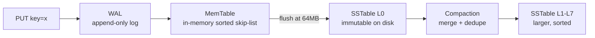
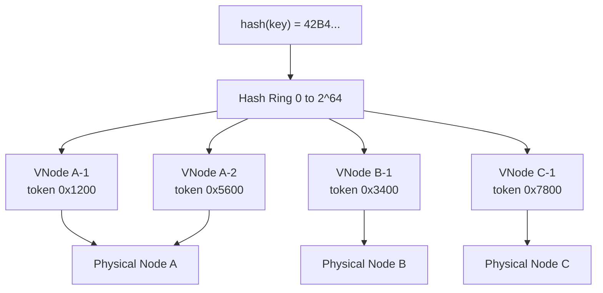
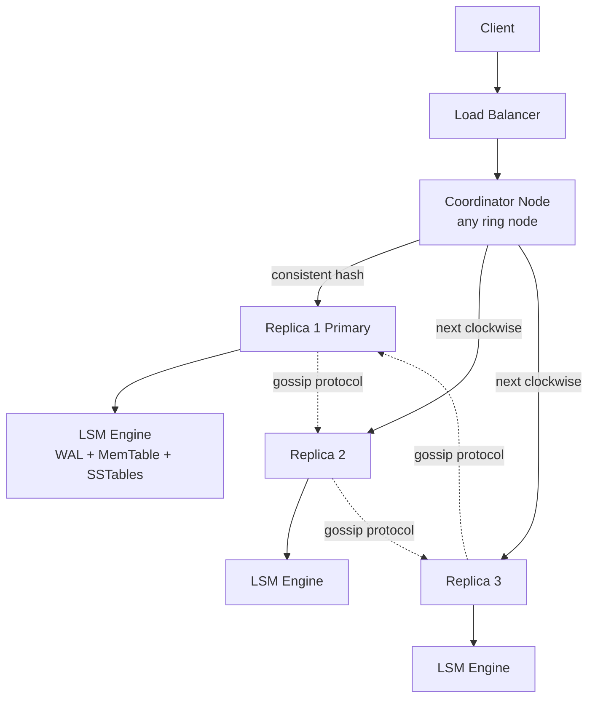
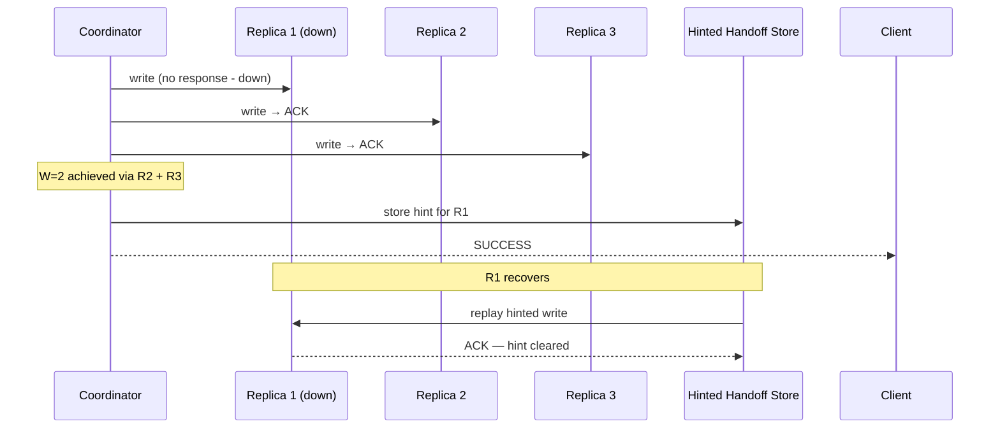
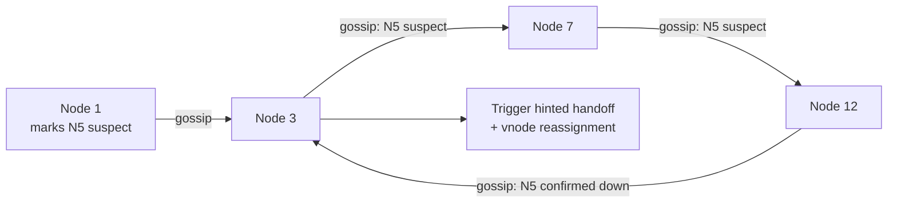
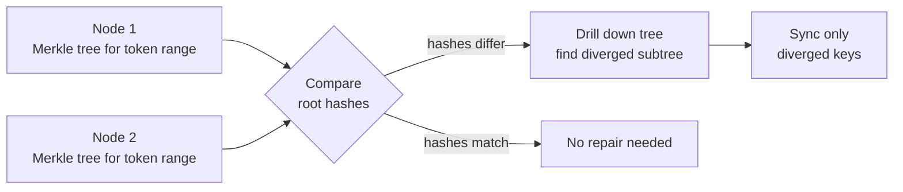

# Design a Distributed Key-Value Store

A distributed key-value store is the backbone of modern infrastructure — it powers session caches (Redis), configuration stores (etcd), shopping carts (DynamoDB), and distributed counters (Cassandra). The interface is minimal: `GET(key)`, `PUT(key, value)`, `DELETE(key)`. The engineering is not.

This is one of the most comprehensive system design questions asked at senior/staff level. It tests whether you understand consistent hashing, replication quorums, conflict resolution, storage engine internals, and fault tolerance — all in one question.

The challenge: design a system that is **highly available, durable, and fast** across thousands of nodes, without a single point of coordination.

---

## Functional Requirements

**In Scope:**
- `PUT(key, value)` — write or overwrite a key-value pair
- `GET(key)` — read the value for a key; return `NOT_FOUND` if absent
- `DELETE(key)` — remove a key-value pair
- **Tunable consistency:** clients can request strong consistency (quorum) or eventual consistency (best-effort) per operation
- Key TTL support — automatic expiry after a configured duration
- Keys and values are opaque byte arrays; max key size 4 KB; max value size 1 MB

**Out of Scope:**
- Range queries or secondary indexes (those require a different data model — Bigtable/DynamoDB Streams)
- Multi-key transactions (a single atomic operation spanning multiple keys)
- Full-text search or analytical queries
- Schema enforcement or data typing (the store is schema-free)

---

## Non-Functional Requirements

| Property | Target | Reasoning |
|---|---|---|
| **Read Latency** | p99 < 10ms (eventual), p99 < 30ms (strong) | Strong consistency requires quorum round-trips; eventual is served locally |
| **Write Latency** | p99 < 20ms (quorum W=2) | Writes go to multiple replicas; latency is bounded by the slowest quorum ACK |
| **Availability** | 99.999% — survive single-node and AZ failures | A KV store is critical infrastructure; it must absorb failures transparently |
| **Durability** | Zero data loss with RF=3 across AZs | Data must survive AZ-level failures |
| **Scalability** | Linear scale-out — add nodes, capacity grows | No centralized bottleneck; partitioning must be fully decentralized |
| **Consistency** | Tunable per request — strong or eventual | Different clients have different needs; one size does not fit all |
| **Scale** | 1 PB total data; 1M ops/sec peak | Production DynamoDB / Cassandra baseline |

**CAP tradeoff:** A distributed KV store must choose — under network partition, do you guarantee **consistency** (reject writes that can't reach quorum) or **availability** (accept writes that risk divergence)? This system offers both via **tunable consistency**: strong reads/writes are CP; eventual reads/writes are AP. Most systems default to AP and rely on the quorum setting to opt into CP behavior.

---

## Capacity Estimation

**Cluster sizing:**
- 1 PB data × RF=3 = 3 PB raw storage
- Node capacity: 10 TB NVMe per node → **~300 nodes** for storage
- At 1M ops/sec distributed across 300 nodes: ~3,300 ops/sec/node — trivial per node

**Memory (MemTable):**
- Each node: 64 GB RAM; MemTable uses 16 GB; remaining for OS + bloom filters + block cache
- MemTable flush threshold: 64 MB → **256 flushes/day per node** — routine compaction load

**Network:**
- RF=3: every write generates 3× network traffic (1 coordinator + 2 replica forwards)
- 1M writes/sec × 1 KB average value × 3 = **3 GB/sec cluster-wide write network** — distributes across node-to-node links

---

## Core Entities

| Entity | Purpose | Key Fields |
|---|---|---|
| **KeyValue** | The stored datum — immutable once written to SSTable | `key` (bytes), `value` (bytes), `timestamp` (HLC), `ttl`, `tombstone` (for deletes), `version_vector` |
| **Node** | A physical server in the cluster | `node_id`, `ip`, `port`, `tokens[]` (hash ring positions), `status` (up/down/leaving) |
| **VNode (Virtual Node)** | A token range owned by a physical node | `token` (uint64), `node_id`, `start_range`, `end_range` |
| **HintedHandoff** | A temporarily stored write for a down replica | `target_node_id`, `key`, `value`, `timestamp`, `retry_at` |
| **MerkleTree** | Per-node per-token-range digest for anti-entropy repair | `node_id`, `token_range`, `tree_root_hash`, `built_at` |

**Key design:** There is no "master" node. Every node is a peer. Any node can act as the **coordinator** for any request — it receives the client request, identifies the replicas responsible via consistent hashing, fans out the read/write, and returns the result. This is the Dynamo-style architecture.

---

## Databases and Database Design

The KV store *is* the database. The internal storage engine is what matters here.

### Storage Engine: LSM Tree (Log-Structured Merge Tree)

Relational databases use B-trees: good for reads, expensive for writes (random I/O). A KV store optimizes for **write throughput** — LSM trees convert random writes to sequential I/O.

**Write path:**



1. **WAL (Write-Ahead Log):** Sequential append to disk — crash-safe. If the node crashes, replay WAL to reconstruct MemTable.
2. **MemTable:** In-memory sorted data structure (skip-list or red-black tree). All writes are in-memory — this is why KV stores are fast for writes.
3. **SSTable (Sorted String Table):** When MemTable hits ~64 MB, it's flushed to an immutable SSTable on disk. SSTables are sorted by key, enabling binary search and range scans.
4. **Compaction:** Background process merges SSTables, removes deleted/overwritten keys, and reclaims disk space. This is what makes LSM trees usable long-term.

**Read path:**
1. Check MemTable (newest data — O(log N) in skip-list)
2. Check SSTable L0, L1, L2... in newest-first order
3. Each level: check **Bloom filter** first — if the filter says "definitely not here," skip the file entirely

```
Bloom filter: 1% false positive rate
For a missing key → skip ~99% of SSTables without any disk read
For hot keys that don't exist (common in caches): eliminates nearly all disk I/O
```

**Why LSM over B-tree:** B-tree writes are random I/O (update pages in-place). LSM converts all writes to sequential appends. On HDDs, sequential I/O is 100× faster. On NVMe SSDs, the gap narrows but LSM still wins for high write throughput because it batches I/O and avoids write amplification at the page level.

### Partitioning: Consistent Hashing with Virtual Nodes



- Keyspace is a 64-bit ring (0 to 2^64 - 1)
- Each physical node owns multiple **virtual nodes (vnodes)** — typically 150–256 per node
- A key is assigned to the first vnode clockwise from `hash(key)` on the ring
- Replicas: the next RF-1 nodes clockwise on the ring (from different physical nodes/AZs)

**Why vnodes:** Without vnodes, adding a new physical node only takes one contiguous slice of the ring — neighboring nodes shed load unevenly. With 256 vnodes per physical node, a new node's tokens are spread across the ring, ensuring every existing node sheds proportional load. Hot spots are naturally absorbed.

**Adding a node:** The new node claims vnodes (tokens) from existing nodes. Data for those token ranges migrates to the new node. Traffic shifts immediately; data migration is background.

### Replication Strategy

```
Replication Factor RF = 3
Each key is replicated to the primary replica and the next RF-1 replicas clockwise on the ring.

For AZ-aware placement:
  Replica 1 → AZ-A
  Replica 2 → AZ-B
  Replica 3 → AZ-C
```

- AZ-aware placement ensures losing one AZ doesn't drop below quorum
- Coordinator node is determined by which node the client connects to — any node in the cluster can coordinate any request

### Consistency Model: Quorum Reads and Writes

```
Quorum rule:  W + R > N  →  Strong consistency
              (writes acknowledged by W replicas; reads from R replicas)

RF = 3 (N = 3):
  Strong:      W=2, R=2  (2+2 > 3 ✓)
  Write-heavy: W=1, R=3  (fast writes, reads confirm all)
  Read-heavy:  W=3, R=1  (all replicas ack write; single replica read)
  Eventual:    W=1, R=1  (fastest; may read stale data)
```

- **Strong consistency (W=2, R=2):** Any read will see the most recent write because at least one of the R=2 read replicas must overlap with the W=2 write replicas
- **Eventual consistency (W=1, R=1):** Maximum availability and minimum latency; stale reads possible during replica lag

---

## API Design

**PUT — Write a key-value pair:**
```http
PUT /v1/keys/{key}
X-Consistency: quorum          // optional; default = eventual
X-TTL-Seconds: 3600            // optional; 0 = no expiry
X-Idempotency-Key: client-uuid // optional; prevents double-write on retry

{
  "value": "<base64-encoded bytes>"
}

200 OK
{
  "version":    "HLC:1748514720.003",
  "replicas_acked": 2
}
```

**GET — Read a value:**
```http
GET /v1/keys/{key}
X-Consistency: strong

200 OK
{
  "key":       "session:user-abc123",
  "value":     "<base64-encoded bytes>",
  "version":   "HLC:1748514720.003",
  "expires_at": "2026-05-29T11:32:00Z"
}

404 Not Found
{ "error": "key_not_found" }
```

**DELETE — Remove a key (tombstone write):**
```http
DELETE /v1/keys/{key}
X-Consistency: quorum

204 No Content
```

**Batch GET (multi-key read):**
```http
POST /v1/keys/batch-get
{
  "keys": ["session:abc", "cart:xyz", "user:123"],
  "consistency": "eventual"
}

200 OK
{
  "results": [
    { "key": "session:abc", "value": "...", "found": true  },
    { "key": "cart:xyz",    "value": null,  "found": false },
    { "key": "user:123",    "value": "...", "found": true  }
  ]
}
```

**Cluster health / node metadata (internal):**
```http
GET /internal/v1/ring

200 OK
{
  "nodes": [
    { "node_id": "node-01", "ip": "10.0.1.1", "status": "up",   "tokens": 256 },
    { "node_id": "node-02", "ip": "10.0.1.2", "status": "up",   "tokens": 256 },
    { "node_id": "node-03", "ip": "10.0.1.3", "status": "down", "tokens": 0   }
  ],
  "replication_factor": 3
}
```

---

## High-Level Design



**Request flow — PUT with W=2:**
1. Client sends `PUT(key, value)` to any node (the load balancer picks one)
2. That node becomes the **coordinator**: it hashes the key, identifies the 3 replica nodes from the ring
3. Coordinator sends the write to all 3 replicas in parallel
4. Once 2 replicas ACK (W=2 satisfied), coordinator returns success to client
5. The 3rd replica writes asynchronously — does not block the response

**Request flow — GET with R=2:**
1. Coordinator identifies 3 replicas for the key
2. Sends read requests to all 3 in parallel
3. Once 2 respond (R=2), returns the value with the **highest timestamp** to the client
4. If replicas disagree (different versions), coordinator initiates **read repair** to sync the stale replica

**Component responsibilities:**
| Component | Role |
|---|---|
| **Coordinator** | Routes requests; manages quorum; returns result to client; triggers repair |
| **LSM Engine** | Per-node write/read/delete; WAL, MemTable, SSTable, compaction |
| **Gossip Protocol** | Decentralized failure detection; propagates ring membership changes |
| **Hinted Handoff** | Stores writes for temporarily unreachable replicas; replays on recovery |
| **Anti-Entropy (Merkle)** | Background repair; detects and reconciles diverged replicas |

---

## Deep Dives

### 1. Consistent Hashing: Node Addition Without Full Reshuffling

**The problem:** Modulo hashing (`hash(key) % N`) remaps ~N-1/N keys when a node is added or removed — unacceptable for a live system, causing a massive data migration storm.

**Consistent hashing:** Only `1/N` of keys migrate when a node is added:

- New node claims a set of vnodes from existing nodes on the ring
- Only the keys whose token range now maps to the new node need to migrate
- All other keys stay on their current nodes — zero migration for them

**Hotspot problem with skewed keys:** Some keys are accessed orders of magnitude more than others (hot user accounts, trending items). Consistent hashing distributes load by *key count*, not *request rate*.

**Solutions:**
- **Adaptive token allocation:** Monitor request rate per vnode; if a vnode is hot, split it — assign its high-traffic portion to a new vnode on a different physical node. DynamoDB does this automatically.
- **Client-side caching:** Hot keys are cached client-side (in-process) with a short TTL. This reduces KV store read load for the hottest keys by 99%.

---

### 2. Replication and Quorum: Sloppy Quorum + Hinted Handoff

**The problem:** Under network partition or node failure, a strict quorum (`W=2, R=2` with RF=3) may be unable to satisfy the required number of ACKs — causing write failures even when the cluster is mostly healthy.

**Sloppy quorum:** When a target replica is unreachable, the coordinator writes to the next available node on the ring (not the intended replica) and attaches a **hint**: "please forward this to node X when it recovers."



- Sloppy quorum maintains write availability even during node failures
- **Tradeoff:** A strict quorum read (R=2) may not include the node that received the hint — the hint node is not in the "preference list" for the key. Sloppy quorum sacrifices strict consistency for availability. If you need strict consistency, you must disable sloppy quorum.

---

### 3. Conflict Resolution: Vector Clocks vs. Last-Write-Wins

**The problem:** With eventual consistency (W=1, R=1), two clients can concurrently write the same key to different replicas. When those replicas sync, which version wins?

**Last-Write-Wins (LWW):** The write with the higher timestamp wins. Simple to implement, but clocks across distributed nodes are not perfectly synchronized — a write from a node with a slow clock can be silently discarded.

```
Node A writes key "cart:123" at T=100 → value = [shoes, bag]
Node B writes key "cart:123" at T=99  → value = [shoes, hat]   (concurrent, different client)
Sync: T=100 wins → cart = [shoes, bag]   (hat is silently lost)
```

**Hybrid Logical Clocks (HLC):** Combine physical time with logical counters. Ensures `HLC(event A) < HLC(event B)` if A causally precedes B — more accurate than wall-clock timestamps. Used by CockroachDB, YugabyteDB.

**Vector Clocks:** Each value carries a version vector `{nodeId: counter}`. If two versions' vectors are non-comparable (neither dominates the other), it's a **true concurrent conflict** that requires application-level resolution.

```
Write 1: key "cart" → value=[shoes], clock={A:1}
Write 2: key "cart" → value=[hat],   clock={B:1}    (concurrent — neither saw the other)
On read: return BOTH versions; client merges → value=[shoes, hat]
```

- DynamoDB uses a simplified vector clock + application-level resolution (client receives multiple versions and picks)
- Cassandra uses LWW by default (simple but lossy)
- **Best choice for interviews:** LWW for simple non-critical data; vector clocks for shopping carts, collaborative data

**CRDTs (Conflict-free Replicated Data Types):** For counters, sets, and registers — mathematical structures that merge concurrent updates without conflicts. A distributed counter (increment-only) is a CRDT. Riak uses them heavily.

---

### 4. Failure Detection: Gossip Protocol

**The problem:** With 300 nodes, you can't have every node ping every other node — that's O(N²) health checks. A centralized health monitor is a SPOF.

**Gossip protocol:** Each node periodically picks a random peer and exchanges its view of the cluster (who's up, who's down, ring membership).



- **Phi Accrual Failure Detector:** Instead of binary up/down, each node computes a suspicion score (phi value) for its peers based on inter-arrival times of gossip messages. Phi > 8 = suspect; phi > 12 = dead. This reduces false positives from network blips.
- Failure information propagates in O(log N) gossip rounds — with 300 nodes, detected within ~8 gossip cycles
- **Tradeoff:** Gossip is probabilistic — a partitioned node might not be detected immediately. The phi threshold trades false-positive rate against detection latency.

---

### 5. Anti-Entropy Repair: Merkle Trees

**The problem:** Even with hinted handoff, long-duration node failures, hardware issues, or compaction bugs can cause replicas to silently diverge. A read repair only fixes keys that are actively read — cold keys can stay out-of-sync indefinitely.

**Solution — Merkle tree anti-entropy:**



- Each node builds a **Merkle tree** over each token range: leaf nodes are hashes of key-value pairs; internal nodes are hashes of children
- Two replicas for the same token range compare their Merkle root hashes
- If roots differ: binary search the tree to find the specific diverged subtree → sync only those keys
- Efficient: a full repair of 1M keys may only need to transmit 100 diverged keys if the Merkle comparison identifies the exact divergence

**Anti-entropy schedule:** Runs as a background process; checks each token range once per hour. Not on the critical path — this is eventual consistency's "catch-up" mechanism, not its real-time repair path (that's read repair).

---

### 6. Compaction Strategies and Write Amplification

**The problem:** LSM trees accumulate SSTables over time. Reads may need to check many SSTables (L0 can have many files after heavy writes). Compaction merges SSTables but causes **write amplification** — data is rewritten multiple times.

**Size-tiered compaction (Cassandra default):** When N small SSTables of similar size accumulate, merge them into one larger SSTable. Fast for write-heavy workloads; bad for read latency (many SSTables to search before compaction).

**Leveled compaction (LevelDB/RocksDB default):** SSTables are organized into levels (L0, L1, L2...); each level is 10× larger than the previous. Within each level, key ranges don't overlap. Reads need at most 1 SSTable per level → predictable read latency. Write amplification is higher (data moves across levels more often).

| Strategy | Write Amplification | Read Performance | Best For |
|---|---|---|---|
| Size-tiered | Low (~10×) | Worse (many L0 files) | Write-heavy workloads |
| Leveled | Higher (~30×) | Better (bounded SSTables per read) | Read-heavy workloads |

**Production choice:** Use leveled compaction for read-heavy KV stores (session cache, config store). Use size-tiered for write-heavy append-only data (time-series, event logs).

---

## Summary: Key Engineering Decisions

| Decision | Choice | Why |
|---|---|---|
| Partitioning | Consistent hashing + vnodes | O(1/N) key migration on topology change; even load distribution |
| Storage engine | LSM tree | Sequential write I/O; high write throughput; Bloom filters for fast reads |
| Replication | Synchronous quorum (tunable W/R) | Flexibility: strong consistency for critical data, eventual for performance |
| Failure handling | Sloppy quorum + hinted handoff | Write availability during partial failures without sacrificing durability |
| Conflict resolution | LWW with HLC (default) + vector clocks (opt-in) | Operational simplicity for most use cases; precision when needed |
| Failure detection | Gossip + phi accrual | Decentralized, scales to hundreds of nodes, tolerates transient blips |
| Background repair | Merkle tree anti-entropy | Efficiently identifies and syncs diverged replicas without full scans |

The core insight: **no single master node, no centralized lock, no shared state** — every node is a peer, every decision is local, and consistency emerges from quorum mathematics and background repair. This is what makes a distributed KV store both simple to reason about and genuinely difficult to build correctly.
