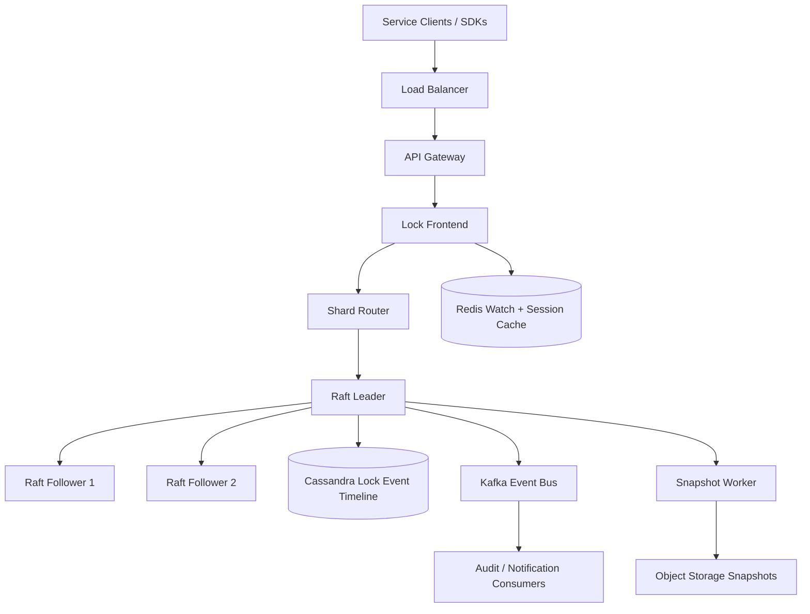
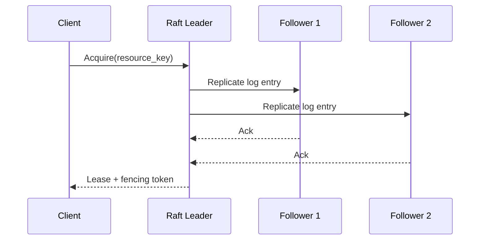
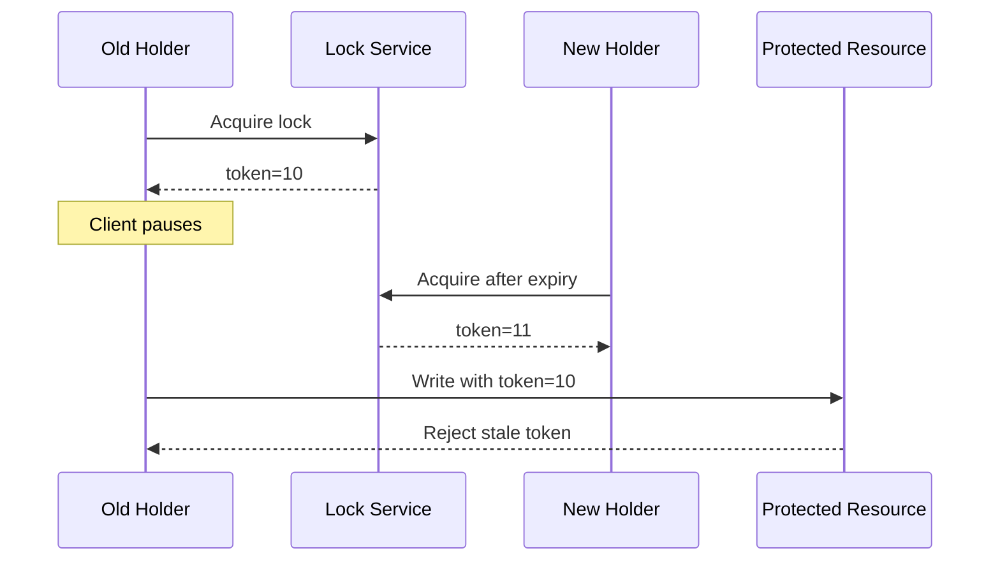
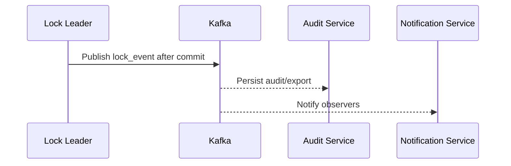
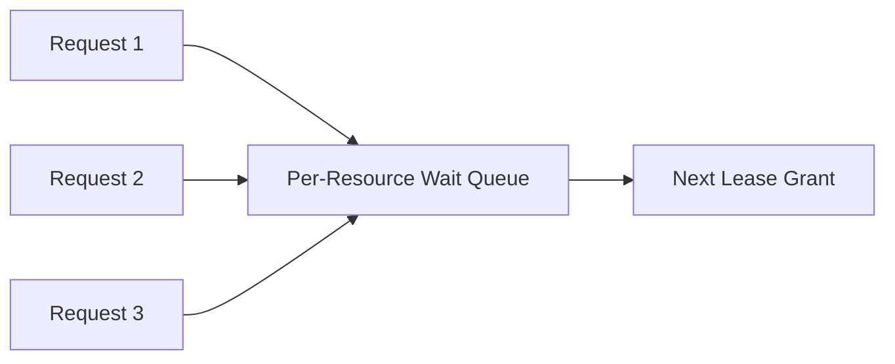
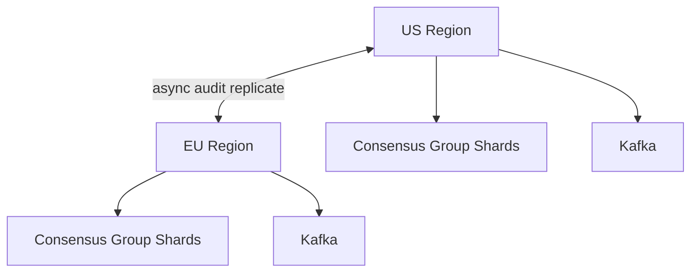

# Design Distributed Locking Service

Distributed locking is a classic system design interview problem because it looks deceptively simple but sits on top of the hardest distributed-systems guarantees: **linearizability, lease expiry, failure detection, and split-brain avoidance**. Teams use lock services for leader election, cron coordination, schema migration guards, inventory reservation workflows, and serialized access to shared resources. If the lock service is wrong, the rest of the platform can corrupt state even when every other component behaves correctly.

The surface looks simple: acquire a lock, do work, release it. The depth lies in quorum-based writes, lease renewal, fencing tokens, clock drift, watch delivery, fairness, and making sure a paused or partitioned client cannot continue acting as if it still owns a lock after the system has moved on.

---

## Functional Requirements

**In Scope:**
- Clients can acquire an exclusive lock on a named resource
- Locks are lease-based and expire automatically if not renewed
- The system returns a monotonic fencing token on successful acquisition
- Clients can renew, release, or inspect a lock
- Clients can wait or watch for lock state changes on a resource
- The service supports idempotent retries for acquire, renew, and release
- Operators can inspect lock state, holder, waiters, and audit history
- The system supports leader-election style usage for long-lived holders

**Out of Scope:**
- Arbitrary distributed transactions across many resources
- Full semaphore, condition-variable, or barrier primitives
- Rich configuration-store semantics for every key/value use case
- Human-facing collaboration workflows
- Exact fairness across every shard in the entire system

---

## Non-Functional Requirements

| Property | Target | Reasoning |
|---|---|---|
| **Acquire / Release Latency** | p99 < 50ms in-region | Lock operations sit on the critical path of other systems and must be fast |
| **Renew Latency** | p99 < 20ms in-region | Lease heartbeats are frequent and should be cheap |
| **Watch Propagation Latency** | p99 < 100ms for lock-state change events | Waiters and operators should observe lock turnover quickly |
| **Availability** | 99.99% for reads; writes available when quorum is healthy | A lock service is a shared dependency for many other control paths |
| **Safety** | Never grant the same exclusive lock to two live holders | This is the most important property of the entire service |
| **Durability** | No loss of committed lock state, fencing tokens, or audit events | Replaying stale lock state can corrupt downstream systems |
| **Consistency** | Linearizable for acquire, renew, and release; eventual for audit fanout and dashboards | Stale metrics are acceptable; split-brain lock ownership is not |
| **Scale** | 100K+ lock operations/sec, millions of active leases, millions of watched resources | Heartbeats and hot keys drive capacity more than raw data size |

**Key tradeoff:** the service prioritizes **safety over availability under partition**. If quorum is lost, it is better to reject new lock writes than to risk granting the same lock to multiple holders.

---

## Capacity Estimation

**Operation volume:**
- Assume **100K acquire/release operations/sec** at peak across all resources
- If the service manages **5M active leases** and clients renew every 10 seconds, renewals alone contribute **500K heartbeats/sec**
- Heartbeat traffic usually dominates write throughput more than fresh lock acquisitions do

**Hot-key behavior:**
- Most locks are lightly contended, but a few leader-election keys or hot resources may see very high contention
- The system must isolate hot keys so they do not degrade unrelated resources on the same cluster

**Data volume:**
- Lock metadata is tiny compared with media or document systems; the challenge is not bytes but correctness under concurrency
- Even with millions of resources, the durable state is typically GB to low-TB scale rather than PB scale
- Audit history and snapshots grow much faster than the live lock table itself

**Network profile:**
- Every write requires quorum replication, which means latency is shaped more by consensus RTT than by payload size
- Watch fanout can spike when a hot lock turns over and many waiters or watchers must be notified at once

---

## Core Entities

| Entity | Purpose | Key Fields | Relationships |
|---|---|---|---|
| **LockResource** | Named lockable entity | `resource_key`, `current_lease_id`, `current_owner_id`, `fencing_token`, `updated_at` | has at most one active holder at a time |
| **Lease** | Time-bounded ownership record | `lease_id`, `resource_key`, `owner_id`, `ttl_ms`, `expires_at`, `state` | belongs to one resource and one owner |
| **Session** | Liveness context for a client instance | `session_id`, `client_id`, `last_heartbeat_at`, `expires_at` | can own multiple leases |
| **LockRequest** | Pending or granted acquisition attempt | `request_id`, `resource_key`, `owner_id`, `requested_ttl_ms`, `requested_at`, `state` | may become a lease or remain queued |
| **FencingToken** | Monotonic grant sequence number | `resource_key`, `token_value`, `issued_at` | attached to every successful acquisition |
| **WatchSubscription** | Realtime change listener | `watch_id`, `resource_key`, `subscriber_id`, `created_at` | receives lock events for one resource |
| **LockEvent** | Durable audit and timeline record | `event_id`, `resource_key`, `event_type`, `lease_id`, `owner_id`, `created_at` | derived from committed lock-state transitions |
| **NamespaceQuota** | Optional fairness or rate-limiting envelope | `namespace_id`, `ops_budget`, `updated_at` | protects shared clusters from abuse |

**Critical modeling decisions:**
- `Lease` is time-bounded; locks are never assumed permanent. This is what lets the system recover from crashed clients.
- `FencingToken` is separate from lease expiry semantics. Even if an old client continues running after a pause, downstream systems can reject stale work by comparing tokens.
- `Session` is not the source of truth for lock ownership, but it is how the system tracks liveness and bulk expiration for a client instance.

---

## Databases and Database Design

### Storage Tier Decisions

| Data | Access Pattern | Engine | Why |
|---|---|---|---|
| Lock state, leases, session ownership, fencing tokens | linearizable writes, exact reads, tiny records, strict correctness | **Raft-based replicated state machine with WAL + RocksDB** | lock safety depends on consensus-backed linearizability |
| Lock event history and audit timeline | append-heavy writes, resource-scoped reads | **Cassandra / ScyllaDB** | efficient for long timelines and operational history at scale |
| Watch fanout hints, session heartbeats, hot routing cache, rate limits | sub-millisecond reads/writes, TTLs, hot keys | **Redis** | ideal for ephemeral watch and session helper state |
| Snapshots and backup images | immutable point-in-time snapshots | **Object Storage** | cheap and durable for Raft snapshots and backup exports |
| Audit, notification, and downstream consumer fanout | durable append-only stream | **Kafka** | decouples committed lock events from background consumers |

This is intentionally polyglot. A lock service needs **strongly consistent consensus state** for correctness, **cheap append-only history** for audit, **ephemeral helper state** for watches and rate limits, and **durable snapshots** for recovery.

### Schema 1 - Lock Resources (Logical State in the Consensus Store)

```sql
CREATE TABLE lock_resources (
  resource_key          TEXT PRIMARY KEY,
  current_lease_id      UUID,
  current_owner_id      TEXT,
  fencing_token         BIGINT NOT NULL,
  version               BIGINT NOT NULL,
  updated_at            TIMESTAMPTZ DEFAULT NOW()
);
```

This is a logical schema. In production, the row is typically stored inside a Raft-replicated state machine rather than in an external SQL server.

### Schema 2 - Leases (Logical State in the Consensus Store)

```sql
CREATE TABLE leases (
  lease_id              UUID PRIMARY KEY,
  resource_key          TEXT NOT NULL,
  owner_id              TEXT NOT NULL,
  session_id            UUID NOT NULL,
  ttl_ms                INT NOT NULL,
  expires_at            TIMESTAMPTZ NOT NULL,
  state                 VARCHAR(16) NOT NULL,
  created_at            TIMESTAMPTZ DEFAULT NOW()
);

CREATE INDEX idx_leases_resource_state
  ON leases (resource_key, state);
```

### Schema 3 - Wait Queue (Logical State in the Consensus Store)

```sql
CREATE TABLE lock_waiters (
  resource_key          TEXT NOT NULL,
  enqueue_seq           BIGINT NOT NULL,
  request_id            UUID NOT NULL,
  owner_id              TEXT NOT NULL,
  session_id            UUID NOT NULL,
  requested_ttl_ms      INT NOT NULL,
  requested_at          TIMESTAMPTZ DEFAULT NOW(),
  PRIMARY KEY (resource_key, enqueue_seq)
);
```

Queue order does not have to be globally perfect across the cluster, but per-resource ordering should be explicit and durable.

### Schema 4 - Sessions (Logical State in the Consensus Store)

```sql
CREATE TABLE sessions (
  session_id            UUID PRIMARY KEY,
  client_id             TEXT NOT NULL,
  last_heartbeat_at     TIMESTAMPTZ NOT NULL,
  expires_at            TIMESTAMPTZ NOT NULL,
  state                 VARCHAR(16) NOT NULL
);
```

### Schema 5 - Lock Event Timeline (Cassandra)

```sql
CREATE TABLE lock_events_by_resource (
  resource_key          TEXT,
  bucket_day            TEXT,
  created_at            TIMESTAMP,
  event_id              UUID,
  event_type            TEXT,
  lease_id              UUID,
  owner_id              TEXT,
  fencing_token         BIGINT,
  PRIMARY KEY ((resource_key, bucket_day), created_at, event_id)
) WITH CLUSTERING ORDER BY (created_at DESC, event_id DESC);
```

Daily buckets keep hot resources from generating unbounded audit partitions.

### Schema 6 - Watch Event Payload (Logical)

```json
{
  "event_id": "evt_123",
  "resource_key": "inventory:item:42",
  "event_type": "lock_acquired",
  "lease_id": "lease_456",
  "owner_id": "worker-9",
  "fencing_token": 812,
  "created_at": "2026-06-03T10:00:00Z"
}
```

This event is safe to fan out asynchronously because the lock decision was already committed in the consensus log before the watch notification exists.

### Sharding and Replication Strategy

| Store | Shard Key | Strategy | Replication |
|---|---|---|---|
| Consensus groups | `hash(resource_key)` | consistent hashing into multiple Raft groups | 3-5 voting replicas per group |
| Audit timeline | `(resource_key, bucket_day)` | consistent hashing across Cassandra nodes | RF=3, `LOCAL_QUORUM` writes |
| Redis | `resource_key`, `session_id`, `watch_id` | Redis Cluster | 1 replica per master |
| Kafka | `resource_key` or `namespace_id` | partitioned durable log | RF=3 |
| Snapshots | `cluster/shard/term/index` | object-store namespace | multi-AZ durable storage |

**Consistency model:**
- Linearizable for acquire, renew, release, and lock-state reads served from the consensus leader or quorum reads
- Eventual consistency for audit dashboards, watch fanout delivery, and downstream analytics

**Read/write patterns:**
- **Acquire path:** client request -> shard leader -> validate lease/session state -> increment fencing token -> replicate to quorum -> respond
- **Renew path:** session heartbeat or lease renewal -> leader validates ownership -> extends expiry -> quorum commit
- **Watch path:** committed lock event -> async fanout to watchers while durable audit is written separately

---

## API Design

**Acquire a lock:**
```http
POST /v1/locks/acquire
Authorization: Bearer <jwt>
Idempotency-Key: lock-6d7f-001

{
  "resource_key": "inventory:item:42",
  "owner_id": "worker-9",
  "ttl_ms": 15000,
  "wait": true
}

200 OK
{
  "state": "acquired",
  "lease_id": "lease_456",
  "fencing_token": 812,
  "expires_at": "2026-06-03T10:00:15Z"
}
```

**Renew a lease:**
```http
PATCH /v1/leases/lease_456
Authorization: Bearer <jwt>

{
  "ttl_ms": 15000
}

200 OK
{
  "lease_id": "lease_456",
  "expires_at": "2026-06-03T10:00:30Z"
}
```

**Release a lease:**
```http
POST /v1/leases/lease_456/release
Authorization: Bearer <jwt>
Idempotency-Key: release-8c2a-001

204 No Content
```

**Get lock state:**
```http
GET /v1/locks/inventory%3Aitem%3A42
Authorization: Bearer <jwt>

200 OK
{
  "resource_key": "inventory:item:42",
  "state": "held",
  "owner_id": "worker-9",
  "lease_id": "lease_456",
  "fencing_token": 812,
  "expires_at": "2026-06-03T10:00:30Z"
}
```

**Create a session:**
```http
POST /v1/sessions
Authorization: Bearer <jwt>

{
  "client_id": "worker-9",
  "ttl_ms": 30000
}

201 Created
{
  "session_id": "sess_111",
  "expires_at": "2026-06-03T10:00:30Z"
}
```

**Watch lock changes (SSE):**
```http
GET /v1/locks/inventory%3Aitem%3A42/stream
Authorization: Bearer <jwt>
Accept: text/event-stream
```
Production implementations often use gRPC streams or watches, but the important design point is the same: watch delivery is realtime convenience, not the source of truth for lock ownership.

---

## High-Level Design



**Component responsibilities:**

| Component | Role |
|---|---|
| **API Gateway** | Auth, routing, rate limiting, and request termination |
| **Lock Frontend** | Validates requests, enforces API semantics, and translates them into shard operations |
| **Shard Router** | Maps `resource_key` to the responsible consensus group |
| **Raft Leader / Followers** | Maintain linearizable lock state, leases, sessions, and fencing tokens |
| **Redis** | Holds watch fanout hints, hot session cache, and rate-limiting helpers |
| **Cassandra Lock Event Timeline** | Stores long-lived audit and operational history for lock transitions |
| **Kafka** | Durable fanout for audit, notifications, and downstream consumers |
| **Snapshot Worker** | Periodically snapshots consensus state for faster recovery |
| **Object Storage Snapshots** | Stores immutable backup images and point-in-time snapshots |

**Lock acquisition flow:**
1. Client -> `POST /v1/locks/acquire` -> API Gateway -> Lock Frontend
2. Shard Router sends the request to the consensus-group leader for that `resource_key`
3. Leader validates session and current lock state, assigns the next fencing token if the lock can be granted, and replicates the state change to quorum
4. Once the log entry commits, the client receives the lease and fencing token
5. Audit history and watch notifications are emitted asynchronously without changing the already-committed lock decision

---

## Deep Dives

### 1. Consensus: Required and Central

The hot path of a distributed lock service needs a linearizable consensus system. A plain cache or eventually consistent database is not sufficient because the core invariant is that two live holders must not both believe they own the same exclusive lock.

This is why production-grade lock services look more like **etcd**, **ZooKeeper**, or **Chubby** than like ordinary cache-backed key-value APIs. The service needs a replicated state machine with a leader, quorum writes, and durable ordering of state transitions.



**Why the problem happens:** lock ownership is a safety property, not just a caching problem.

**Why it becomes difficult at scale:**
- writes must survive node failures without split brain
- leadership changes and partitions can happen during high contention
- hot keys can concentrate traffic onto a small subset of shard leaders

**Production-grade solutions:**
- partition resources across multiple consensus groups rather than one global leader
- require quorum commit before acknowledging acquire, renew, or release
- serve linearizable reads from leaders or quorum reads where correctness matters
- prefer rejecting writes during quorum loss instead of risking double ownership

**Tradeoffs:** consensus adds latency and reduces write availability during quorum loss, but it is the right tradeoff for lock safety.

### 2. Fencing Tokens: TTL Alone Is Not Enough

Leases prevent dead clients from holding locks forever, but lease expiry by itself does not solve paused-client or delayed-network problems. A client might pause under GC or a long network partition, lose the lease, and then resume with stale assumptions. If downstream systems trust only the existence of a previous lock, stale work can still corrupt data.

Fencing tokens solve this by giving each successful acquisition a monotonically increasing token. Downstream protected systems reject operations with older tokens.



**Why the problem happens:** clocks, pauses, and partitions can make a client believe it still owns a lock after the service has already reassigned it.

**Why it becomes difficult at scale:**
- lease expiry alone depends on time, which is imperfect in distributed systems
- some clients or downstream systems are slow, stateful, or retry aggressively
- hot resources magnify the cost of every stale-write bug

**Production-grade solutions:**
- issue a strictly monotonic fencing token on each successful grant
- require downstream systems to compare incoming tokens and reject stale ones
- treat lease TTL as liveness recovery, not as the only safety mechanism
- document clearly that clients must not rely on lock ownership alone for correctness-critical side effects

**Tradeoffs:** fencing tokens require cooperation from downstream systems, but they are the only robust answer to paused-client stale writes.

### 3. Redis: Useful for Watches and Sessions, Not as Source of Truth

Redis is very useful in a lock service, but not as the authoritative lock holder for the safety-critical path. It is excellent for session helpers, watch fanout hints, rate limiting, and hot routing caches. It is a poor choice for the only source of truth when linearizable exclusivity is required across failures and partitions.

| Redis Use | Example Key | Why Redis Fits |
|---|---|---|
| **Session hint cache** | `session:sess_111` | session heartbeat lookups are hot and TTL-driven |
| **Watch fanout hint** | `watch:inventory:item:42` | helps route notifications cheaply |
| **Hot routing cache** | `shard:inventory:item:42` | avoids recomputing shard ownership on every call |
| **Rate limiting** | `rl:client:worker-9:acquire` | protects the lock frontend from abuse |

**Why the problem happens:** the service has lots of hot ephemeral state surrounding the core consensus path.

**Why it becomes difficult at scale:**
- hot lock keys create bursty watch and session traffic
- stale helper state must disappear quickly after disconnects or failover
- using Redis incorrectly as lock truth creates subtle split-brain risk under failures

**Production-grade solutions:**
- keep authoritative lock ownership in the consensus store only
- use Redis only for ephemeral helpers and performance layers
- expire watch/session helpers aggressively with TTLs
- rebuild helper state from the authoritative log or leader when Redis is empty or wrong

**Tradeoffs:** Redis improves latency and scalability around the edges, but it must never define correctness for lock ownership.

### 4. Kafka: Useful for Audit and Downstream Consumers, Not on the Hot Acquire Path

Kafka is useful in a distributed locking service, but not to decide whether a lock has been granted. The acquire path already has a consensus log. Kafka is valuable after commit for audit, notifications, ops pipelines, and downstream systems that want a durable stream of lock events.



**Why the problem happens:** lock state transitions are useful to many background consumers, but those consumers should not delay the lock holder.

**Why it becomes difficult at scale:**
- hot resources can generate bursts of acquire/release/renew events
- audit, notifications, and metrics have different SLAs
- replay matters after incidents because dashboards and exports are derived views

**Production-grade solutions:**
- publish events only after the lock state change is durably committed
- key Kafka partitions by `resource_key` or namespace to preserve local ordering where needed
- prioritize audit consumers over low-priority analytics when lag grows
- never place Kafka between the client and the consensus commit decision

**Tradeoffs:** Kafka improves decoupling and observability, but it is not a substitute for the lock service’s authoritative state machine.

### 5. Wait Queues, Fairness, and Hot Lock Keys

Contention is where lock services become tricky. If many clients fight for one resource, the system must decide how requests queue, how fairness is approximated, and how starvation is avoided without destroying throughput.



**Why the problem happens:** multiple clients may need serialized access to the same hot resource.

**Why it becomes difficult at scale:**
- strict FIFO fairness can reduce throughput if holders or waiters are slow or flaky
- one hot resource can dominate a shard leader and cause localized overload
- waiting clients need a scalable notification mechanism rather than busy polling

**Production-grade solutions:**
- maintain a per-resource wait queue with monotonic enqueue order inside the consensus group
- support non-blocking acquire for clients that prefer retry over waiting
- notify waiters through watches or backoff-aware polling instead of tight loops
- isolate or shard hot namespaces and apply per-client or per-namespace quotas when abuse appears

**Tradeoffs:** fairness improves predictability, but perfectly strict fairness everywhere can hurt throughput and availability under load.

### 6. Session Expiry, Clock Drift, and GC Pauses

Lease-based systems depend on time, but clocks are imperfect and clients pause unpredictably. A JVM stop-the-world pause, laptop suspend, or network hiccup can make a live client miss renewals even though it never intended to release the lock.

**Why the problem happens:** liveness in distributed systems is inferred indirectly through heartbeats and timeouts.

**Why it becomes difficult at scale:**
- clients live on diverse runtimes and network conditions
- aggressive TTLs reduce failover time but increase accidental expiry risk
- relying on client clocks directly is unsafe

**Production-grade solutions:**
- base lease expiry on server-side observed time, not client-reported time
- separate session heartbeats from lock operations so many leases can ride one live session when appropriate
- use conservative TTL defaults and renew well before expiry
- combine lease expiry with fencing tokens so stale resumed clients are still harmless downstream

**Tradeoffs:** short TTLs improve recovery speed, but they increase heartbeat load and sensitivity to pauses. The best setting depends on workload and downstream tolerance.

### 7. Watches, Streams, and Why WebSockets Are Optional

Clients often want to wait for a lock or observe leadership changes. The service therefore benefits from a watch or streaming interface. But the watch path is an optimization for timely notification, not the authoritative correctness mechanism.

**Why the problem happens:** busy polling under contention wastes capacity and adds latency to lock handoff.

**Why it becomes difficult at scale:**
- a hot resource can have many waiters and watchers
- reconnect storms happen when clients restart or leaders fail over
- dropped watch events must not corrupt client behavior

**Production-grade solutions:**
- use SSE, gRPC streams, or a lightweight watch protocol for lock-state notifications
- treat watches as hints tied to an authoritative resource version or fencing token
- require clients to re-read lock state after reconnect instead of assuming no events were missed
- throttle or batch watch fanout for very hot keys

**Tradeoffs:** streaming reduces contention and latency, but the correct design still depends on the linearizable acquire/read path rather than on perfect watch delivery.

### 8. Multi-Region Deployment and Split-Brain Avoidance

Lock services are often globally depended on, but cross-region latency makes consensus expensive. The usual design is to keep one consensus group per shard with a clear leadership and quorum policy, then decide carefully whether a lock namespace should be regional or global.



**Why the problem happens:** locks often protect resources with natural locality, but some workloads still span regions.

**Why it becomes difficult at scale:**
- cross-region consensus raises write latency sharply
- partial partitions create split-brain risk if leadership or ownership is ambiguous
- failover must not resurrect stale leaders or stale sessions

**Production-grade solutions:**
- keep lock ownership regional whenever the protected resource is regional
- use one clear quorum-backed leader per shard with fencing on term changes
- replicate audit and snapshots asynchronously across regions, but do not make all lock writes globally synchronous by default
- force explicit design review before using one global lock for multi-region critical workflows

**Tradeoffs:** regionalizing lock ownership reduces latency and blast radius, but truly global locks remain expensive and should be rare.

### 9. Architecture Evolution

| Stage | Design | Why It Breaks | Next Step |
|---|---|---|---|
| **1. MVP** | Single lock node with in-memory state and TTLs | crashes, restarts, and failover break safety immediately | add replicated consensus-backed state |
| **2. Growth** | Small Raft cluster with basic acquire/renew/release | hot keys, watch fanout, and audit needs stress the core path | add sharding, Redis helpers, and async event fanout |
| **3. Scale** | Multiple consensus groups, audit timeline, watch streams, snapshots | hot resources and noisy clients create localized contention | add quotas, better fairness, and hot-key isolation |
| **4. Global** | Regionalized lock shards with async audit replication | global locks become too slow and expensive | keep strong consistency local to the protected resource and minimize cross-region locks |

This is the interview pattern to emphasize: keep correctness in a consensus-backed core, keep helper systems off the safety path, and use fencing tokens so downstream systems remain safe even when clients pause or partitions occur.
