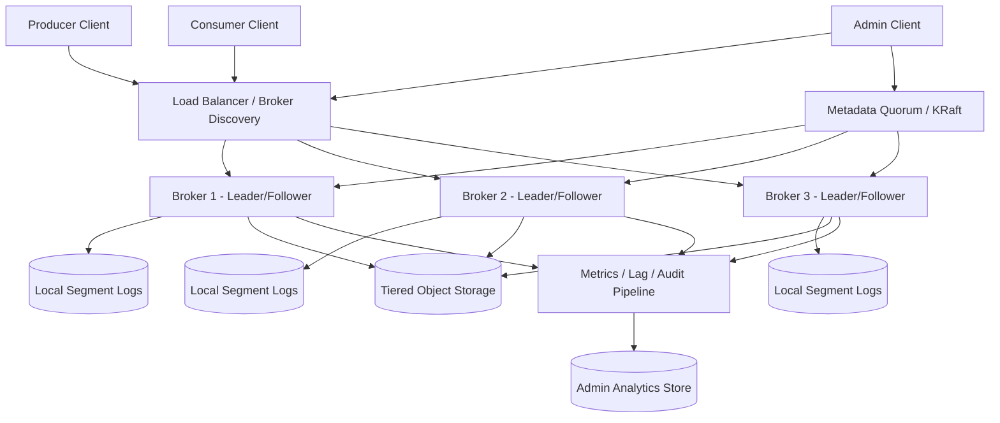
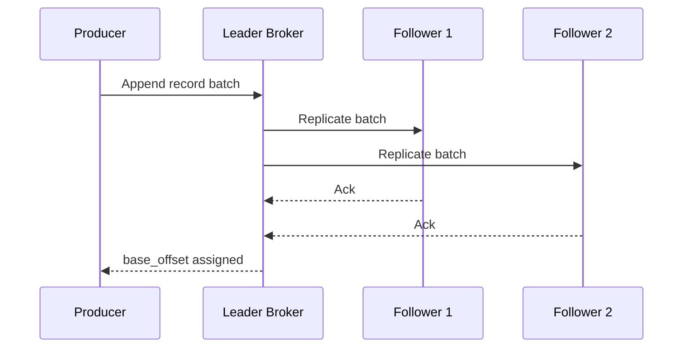
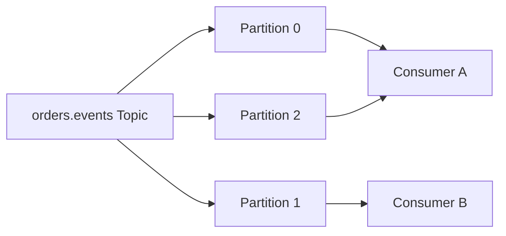
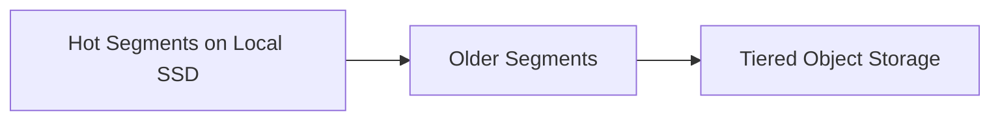
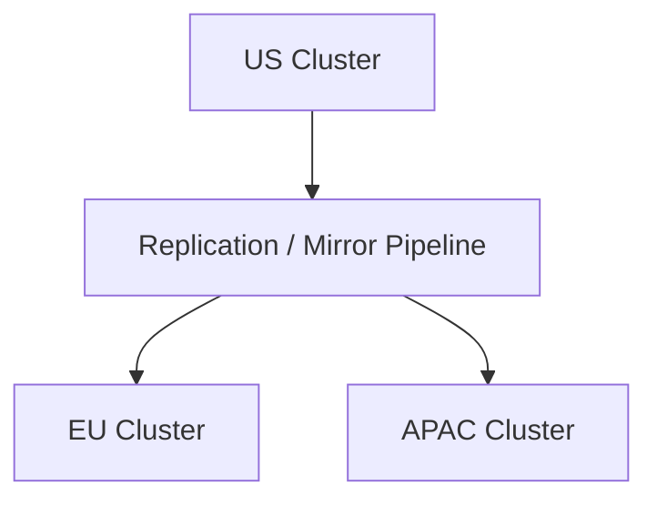

# Design Distributed Message Queue / Kafka

Designing a distributed message queue like Kafka is a classic system design interview problem because it sits at the center of modern data infrastructure. Producers want to publish events with high throughput and low latency. Consumers want to read those events independently, at their own pace, with predictable ordering guarantees. Platform teams want retention, replay, replication, durability, and operational simplicity. If the system gets partitioning or replication wrong, downstream applications lose data or see inconsistent order. If it gets throughput wrong, the queue becomes the bottleneck for the entire platform.

At a high level, the system has two distinct responsibilities. The first is the **data path**, where producers append records to partition logs and consumers fetch them sequentially with minimal coordination. The second is the **control path**, where the platform manages topics, partitions, leaders, consumer group membership, quotas, ACLs, retention, and failover. A good design keeps the data path append-only and simple, then lets the control plane handle metadata, balancing, and recovery without blocking normal reads and writes.

---

## Functional Requirements

**In Scope:**
- Producers can publish records to named topics
- Topics are partitioned for horizontal scale and per-partition ordering
- Consumers can fetch records from partitions and replay from older offsets
- Consumer groups split partitions across members and track committed offsets
- The system replicates data across brokers and elects leaders for each partition
- Operators can create topics, adjust retention, inspect lag, and rebalance partitions
- The platform supports log retention and optional log compaction policies
- Clients can discover brokers, leaders, topic metadata, and cluster health

**Out of Scope:**
- Full stream-processing execution like joins, windows, or SQL queries
- Cross-datacenter exactly-once semantics for every downstream system
- Arbitrary message routing by complex content-based rules
- Rich schema-registry implementation details beyond basic mention
- Human-facing workflow UIs beyond admin and metrics surfaces

---

## Non-Functional Requirements

| Property | Target | Reasoning |
|---|---|---|
| **Produce Latency** | p99 < 20ms in-region for acknowledged writes under normal load | queues often sit on hot application write paths |
| **Fetch Latency** | p99 < 50ms for active consumers with warm brokers | low lag matters for realtime pipelines |
| **Durability** | no loss of acknowledged records after broker failure within replica policy | downstream systems trust the queue as a source of durable replay |
| **Availability** | 99.99% for metadata and healthy partition leaders | the queue is a shared dependency for many services |
| **Ordering** | strict append order within one partition | many consumers depend on stable ordering semantics |
| **Scalability** | millions of records/sec and petabytes of retained log data | queues handle both realtime and historical replay workloads |
| **Isolation** | noisy topics or slow consumers should not degrade the entire cluster | multi-tenant queue platforms see strong workload skew |
| **Recovery** | leader failover in seconds without manual intervention | broker failure is normal at scale |

**Key tradeoff:** the platform prioritizes **high-throughput append-only partition logs with per-partition ordering** over globally ordered messaging. Global ordering would collapse throughput and make failover far more expensive.

---

## Capacity Estimation

**Traffic assumptions:**
- Assume **5M records/sec** across all topics at peak
- If the average record is **1 KB**, ingress alone is about **5 GB/sec**, not counting replication
- With replication factor **3**, internal network and disk write volume can easily exceed **15 GB/sec**

**Retention assumptions:**
- If the cluster retains **5 GB/sec** of logical ingress for **7 days**, retained logical data is about **3 PB**
- With replication factor **3**, raw stored bytes are much higher unless older segments are offloaded to tiered storage
- Retention and replay are often more important to capacity planning than pure QPS

**Consumer behavior:**
- Some consumers read near real time with small lag; others backfill from hours or days behind
- Replays create heavy sequential disk or object-store reads and can dominate operational cost during incidents
- Fetch load is often bursty because consumers poll in batches rather than continuously one message at a time

**Operational profile:**
- Topic skew is common: a few hot topics or partitions may carry most traffic
- Large record batches are better than tiny single-record writes because syscall and protocol overhead matter at very high throughput
- Partition count is a scaling lever, but too many tiny partitions also increase metadata and file-handle overhead

---

## Core Entities

| Entity | Purpose | Key Fields | Relationships |
|---|---|---|---|
| **Topic** | Named logical stream | `topic_name`, `partition_count`, `replication_factor`, `retention_policy` | owns many partitions |
| **Partition** | Ordered append-only log shard | `topic_name`, `partition_id`, `leader_broker_id`, `epoch`, `high_watermark` | belongs to one topic |
| **RecordBatch** | Unit of append and fetch | `base_offset`, `record_count`, `compressed`, `created_at` | stored inside one partition segment |
| **Segment** | Immutable on-disk log file slice | `segment_base_offset`, `size_bytes`, `created_at`, `index_key` | belongs to one partition |
| **Broker** | Storage and serving node | `broker_id`, `rack`, `state`, `last_heartbeat_at` | hosts many partition replicas |
| **Replica** | Partition copy on a broker | `topic_name`, `partition_id`, `broker_id`, `log_end_offset`, `in_sync` | one partition has many replicas |
| **ConsumerGroup** | Coordinated set of readers | `group_id`, `protocol_type`, `generation_id`, `state` | owns partition assignments |
| **CommittedOffset** | Durable consumer progress marker | `group_id`, `topic_name`, `partition_id`, `offset`, `metadata` | one row per group-partition |
| **ACLRule** | Authz rule for topic or cluster resource | `principal`, `resource_type`, `resource_name`, `operation` | applied at control plane and brokers |
| **QuotaPolicy** | Rate or byte budget for clients | `principal`, `produce_rate`, `fetch_rate`, `updated_at` | protects shared clusters |

**Critical modeling decisions:**
- `Partition` is the ordering boundary. Any guarantee stronger than per-partition order should be treated as an application-level concern.
- `RecordBatch` is the actual IO unit. Kafka-like systems are optimized around sequential batch append and sequential fetch, not individual message round-trips.
- `CommittedOffset` is separate from the partition log itself. This lets consumer groups progress independently without affecting producers or other consumers.

---

## Databases and Database Design

### Storage Tier Decisions

| Data | Access Pattern | Engine | Why |
|---|---|---|---|
| Partition logs and segment indexes | append-heavy sequential writes, sequential fetch, local leader serving | **Broker local disk (NVMe / SSD) with append-only files** | the hot data path is fundamentally a log-structured storage problem |
| Cluster metadata, leader assignments, topic configs, ACLs | low-latency consensus writes, exact reads | **Raft-based metadata quorum (KRaft-style)** | control-plane correctness needs consensus-backed state |
| Consumer offsets and transactional markers | append-heavy internal writes, group-scoped reads | **Internal replicated topics on brokers** | keeps progress tracking inside the same replicated log system |
| Hot quotas, auth caches, request shaping hints | low-latency reads, frequent refreshes | **Redis or in-memory broker caches** | optional helper layer for cluster-scale throttling and auth acceleration |
| Aged segments and cold retention | large immutable objects, infrequent replay | **Object Storage** | tiered storage reduces broker disk cost for long retention |
| Metrics, lag dashboards, and admin analytics | time-series and aggregation-heavy reads | **OLAP / metrics store** | operational visibility should not hit the metadata quorum or brokers directly |

This is intentionally polyglot. A Kafka-like queue needs **append-only local logs** for throughput, **consensus-backed metadata** for cluster correctness, **internal log topics** for offsets, and sometimes **cold object storage** for long retention. One generic database does not satisfy all of those constraints.

### Schema 1 - Topic Metadata (Logical View)

```sql
CREATE TABLE topics (
  topic_name              TEXT PRIMARY KEY,
  partition_count         INT NOT NULL,
  replication_factor      INT NOT NULL,
  cleanup_policy          VARCHAR(16) NOT NULL,
  retention_ms            BIGINT NOT NULL,
  created_at              TIMESTAMPTZ DEFAULT NOW()
);
```

This is a logical representation. In production, a Kafka-like system stores topic metadata inside a consensus-backed metadata log rather than in a general SQL table.

### Schema 2 - Partitions and Replica Placement (Logical View)

```sql
CREATE TABLE partitions (
  topic_name              TEXT NOT NULL,
  partition_id            INT NOT NULL,
  leader_broker_id        INT NOT NULL,
  leader_epoch            BIGINT NOT NULL,
  high_watermark          BIGINT NOT NULL,
  PRIMARY KEY (topic_name, partition_id)
);

CREATE TABLE partition_replicas (
  topic_name              TEXT NOT NULL,
  partition_id            INT NOT NULL,
  broker_id               INT NOT NULL,
  replica_role            VARCHAR(16) NOT NULL,
  log_end_offset          BIGINT NOT NULL,
  in_sync                 BOOLEAN NOT NULL,
  PRIMARY KEY (topic_name, partition_id, broker_id)
);
```

### Schema 3 - Consumer Group Offsets (Logical View)

```sql
CREATE TABLE committed_offsets (
  group_id                TEXT NOT NULL,
  topic_name              TEXT NOT NULL,
  partition_id            INT NOT NULL,
  committed_offset        BIGINT NOT NULL,
  metadata                TEXT,
  updated_at              TIMESTAMPTZ DEFAULT NOW(),
  PRIMARY KEY (group_id, topic_name, partition_id)
);
```

In production, this data is typically stored in an internal replicated topic rather than a relational table.

### Schema 4 - Segment Manifest (Logical View)

```sql
CREATE TABLE segment_manifests (
  topic_name              TEXT NOT NULL,
  partition_id            INT NOT NULL,
  segment_base_offset     BIGINT NOT NULL,
  segment_path            TEXT NOT NULL,
  size_bytes              BIGINT NOT NULL,
  created_at              TIMESTAMPTZ DEFAULT NOW(),
  PRIMARY KEY (topic_name, partition_id, segment_base_offset)
);
```

### Schema 5 - Record Batch (Logical Payload)

```json
{
  "topic": "orders.events",
  "partition": 3,
  "base_offset": 981274110,
  "compressed": true,
  "records": [
    {
      "key": "order_123",
      "timestamp": "2026-06-03T10:00:00Z",
      "headers": { "schema": "v3" },
      "value": "{...}"
    }
  ]
}
```

### Schema 6 - Tiered Segment Pointer (Logical Object Storage Record)

```json
{
  "topic": "orders.events",
  "partition": 3,
  "segment_base_offset": 980000000,
  "object_key": "tiered/orders.events/3/980000000.log",
  "checksum": "sha256:abc123"
}
```

### Sharding and Replication Strategy

| Store | Shard Key | Strategy | Replication |
|---|---|---|---|
| Partition logs | `(topic_name, partition_id)` | fixed partition assignment across brokers | replication factor 2-5 with one leader |
| Metadata quorum | metadata log keyspace | small odd-sized Raft quorum | 3 or 5 voters |
| Internal offset topics | `(group_id, partition)` | partitioned internal topics | same broker replication model as regular topics |
| Redis helper layer | `principal` or quota scope | Redis Cluster if used | 1 replica per master |
| Tiered storage | `topic/partition/segment` object namespace | object-store hierarchy | multi-AZ durable storage |

**Consistency model:**
- Strong consistency for metadata changes such as topic creation, leader election, and partition assignment
- Leader-based durability for records according to acknowledgment mode and in-sync replica policy
- Eventual visibility for cold-storage indexes, lag dashboards, and operational analytics

**Read/write patterns:**
- **Produce path:** leader append -> follower replication -> high watermark advance -> client acknowledgement
- **Fetch path:** consumer reads sequential batches from leader or eligible follower -> updates local progress -> optionally commits offset later
- **Control path:** metadata quorum elects leaders, updates configs, and drives reassignments without touching every data record

---

## API Design

**Create a topic:**
```http
POST /v1/topics
Authorization: Bearer <admin-jwt>

{
  "topic_name": "orders.events",
  "partition_count": 12,
  "replication_factor": 3,
  "cleanup_policy": "delete",
  "retention_ms": 604800000
}

201 Created
{
  "topic_name": "orders.events",
  "status": "ready"
}
```

**Produce a batch:**
```http
POST /v1/topics/orders.events/records
Authorization: Bearer <producer-jwt>
Idempotency-Key: prod-001

{
  "partition_key": "order_123",
  "acks": "all",
  "records": [
    {
      "key": "order_123",
      "headers": { "schema": "v3" },
      "value": { "order_id": "order_123", "status": "created" }
    }
  ]
}

200 OK
{
  "partition_id": 3,
  "base_offset": 981274110,
  "last_offset": 981274110
}
```

**Fetch records:**
```http
GET /v1/topics/orders.events/records?partition_id=3&offset=981274110&max_bytes=1048576&wait_ms=200
Authorization: Bearer <consumer-jwt>

200 OK
{
  "partition_id": 3,
  "high_watermark": 981274240,
  "records": [
    {
      "offset": 981274110,
      "key": "order_123",
      "value": { "order_id": "order_123", "status": "created" }
    }
  ]
}
```

**Commit consumer offsets:**
```http
POST /v1/consumer-groups/payments/offsets
Authorization: Bearer <consumer-jwt>

{
  "offsets": [
    {
      "topic_name": "orders.events",
      "partition_id": 3,
      "committed_offset": 981274111
    }
  ]
}

204 No Content
```

**Describe a consumer group:**
```http
GET /v1/consumer-groups/payments
Authorization: Bearer <admin-jwt>

200 OK
{
  "group_id": "payments",
  "generation_id": 42,
  "state": "stable",
  "members": 6,
  "lag": 12894
}
```

**Cluster event stream (optional SSE for admin):**
```http
GET /v1/admin/events/stream
Authorization: Bearer <admin-jwt>
Accept: text/event-stream
```
Real Kafka deployments typically use a custom binary protocol rather than HTTP, but the logical operations are the same. WebSockets are not required for the core data path; long-poll fetch or native streaming fetch is usually enough.

---

## High-Level Design



**Component responsibilities:**

| Component | Role |
|---|---|
| **Producer Client** | Batches records, chooses partition key, retries according to acknowledgement policy |
| **Consumer Client** | Fetches sequential batches, tracks progress, and commits offsets |
| **Broker** | Stores partition replicas, serves produce and fetch requests, and replicates logs |
| **Metadata Quorum / KRaft** | Owns topic configs, partition leadership, broker membership, and control-plane consensus |
| **Local Segment Logs** | Append-only partition storage optimized for sequential IO |
| **Tiered Object Storage** | Holds aged segments for long retention and cold replay |
| **Metrics / Lag Pipeline** | Builds consumer lag, broker health, quota, and operational dashboards |
| **Admin Analytics Store** | Serves historical cluster metrics and admin reports |

**Produce and consume flow:**
1. Producer fetches cluster metadata and maps its topic key to a partition leader
2. Producer sends a batched append request to the leader broker for that partition
3. Leader appends to its local log, replicates to followers, and advances the high watermark according to the acknowledgement policy
4. Consumer fetches sequential batches from its assigned partition leader or eligible replica starting from its current offset
5. Consumer processes records and later commits offsets through the internal offset topic or control API
6. Metadata quorum independently manages leader election, partition reassignment, and broker membership without changing the append-only data path semantics

---

## Deep Dives

### 1. Append-Only Partition Logs: Required and Central

The defining idea behind Kafka-like systems is the append-only log. Instead of deleting messages immediately after one consumer reads them, the system stores ordered partitions that many consumers can replay independently. This is what makes Kafka useful for both realtime delivery and historical backfill.



**Why the problem happens:** many downstream systems need the same event stream at different times and speeds.

**Why it becomes difficult at scale:**
- random write patterns destroy throughput on the hot path
- many small messages create heavy syscall and protocol overhead
- consumers need replay without interfering with producers or each other

**Production-grade solutions:**
- store data in append-only partition logs with sequential batch writes
- make partitions the boundary for ordering and scale-out
- separate data retention from consumer acknowledgement so replay remains possible
- use batching and compression aggressively to improve throughput and IO efficiency

**Tradeoffs:** append-only partition logs give huge throughput and replayability, but they do not provide global ordering across all messages.

### 2. Metadata Quorum and Leader Election

The data path is only half the story. The system also needs to know which brokers exist, which topics and partitions exist, who leads each partition, and when leaders should change. Older Kafka designs used ZooKeeper; newer designs use an internal Raft-based metadata quorum. Either way, the key idea is the same: control-plane truth must be strongly consistent.

**Why the problem happens:** without a consistent metadata source, clients and brokers will disagree on leaders and partition ownership.

**Why it becomes difficult at scale:**
- broker failures and restarts are normal
- partition reassignments and topic changes happen continuously in large clusters
- metadata fanout affects every producer and consumer client

**Production-grade solutions:**
- keep topic metadata, broker membership, and leader epochs in a consensus-backed metadata log
- elect new leaders deterministically and fence stale leaders using epoch numbers
- cache metadata on clients but refresh on leader change or `NOT_LEADER`-style responses
- keep the metadata quorum small and operationally simpler than the large broker fleet it manages

**Tradeoffs:** a strong metadata quorum simplifies correctness, but it becomes a critical control-plane dependency that must be carefully isolated and monitored.

### 3. Consumer Groups and Offset Management

Kafka-like systems decouple production from consumption by letting multiple consumer groups read the same topic independently. Within one group, partitions are assigned to members so work is balanced without duplicating processing. Offsets then become the durable record of each group’s progress.



**Why the problem happens:** many services want the same data stream, but one group usually wants partitioned parallel processing without duplicates.

**Why it becomes difficult at scale:**
- rebalances can pause consumption and increase lag
- slow consumers create backpressure and storage pressure
- offset commit strategy affects at-least-once versus at-most-once behavior

**Production-grade solutions:**
- store committed offsets durably in an internal replicated topic
- assign partitions by consumer group with cooperative or incremental rebalancing when possible
- use batching and asynchronous commits to reduce control-plane chatter
- expose lag metrics clearly so operators can distinguish healthy backlog from stuck consumers

**Tradeoffs:** consumer groups simplify scaling for subscribers, but rebalancing and offset semantics introduce subtle correctness choices for application developers.

### 4. Replication, ISR, and Acknowledgement Modes

Not every write guarantee costs the same. A producer that accepts leader-only acknowledgement gets lower latency but risks more data loss on leader failure. A producer that waits for all in-sync replicas gets higher durability but pays more network and replication latency.

**Why the problem happens:** distributed logs must balance throughput, latency, and durability.

**Why it becomes difficult at scale:**
- slow followers can shrink the in-sync replica set
- leader failure can happen during heavy produce bursts
- different topics have different business criticality and should not share one fixed durability mode

**Production-grade solutions:**
- support configurable acknowledgement modes such as leader-only or all in-sync replicas
- track the in-sync replica set and remove lagging replicas when necessary
- fence unclean leader election for critical topics to avoid acknowledged data loss
- let low-value telemetry topics trade durability for throughput while critical financial or audit topics use stronger policies

**Tradeoffs:** stronger acknowledgement improves safety but increases tail latency and sensitivity to follower lag.

### 5. Redis: Optional Helper, Not the Core Queue

Unlike some other system designs in this repo, Redis is not central to the Kafka data path. The queue already has a log-structured storage model optimized for append and fetch. Redis can still be useful for quota caches, auth caches, or admin-plane acceleration, but it should not sit between producers and brokers for the hot record path.

| Redis Use | Example Key | Why Redis Fits |
|---|---|---|
| **Quota cache** | `quota:principal:payments-service` | low-latency lookup for request throttling |
| **ACL cache** | `acl:topic:orders.events` | avoids hitting metadata storage on every request |
| **Broker health hint** | `broker:3:state` | operational convenience for dashboards or routing hints |

**Why the problem happens:** operators sometimes want ultra-fast helper state around the broker fleet.

**Why it becomes difficult at scale:**
- hot principals or tenants can cause repeated policy lookups
- stale auth or quota cache entries can create inconsistent enforcement
- placing Redis on the critical data path would add unnecessary failure coupling

**Production-grade solutions:**
- keep Redis or in-memory caches strictly as optional helpers for policy and control-plane acceleration
- never make broker append or fetch depend on Redis availability for correctness
- refresh helper caches from the metadata quorum or durable config sources
- prefer local broker caches over extra network hops when possible

**Tradeoffs:** helper caches can improve control-plane latency, but the log itself should remain self-sufficient and durable without them.

### 6. Hot Partitions, Skew, and Key Design

Kafka scales by partitions, but not all partitioning strategies are equal. If one partition key receives most traffic, one broker leader becomes hot while other partitions sit idle. This is one of the most common operational failures in large queue deployments.

**Why the problem happens:** business identifiers such as one celebrity user, one merchant, or one order stream can dominate traffic.

**Why it becomes difficult at scale:**
- ordering requirements often tempt teams to use low-cardinality keys
- hot partitions create leader CPU, disk, and network bottlenecks
- rebalancing only helps if the partition count and key distribution allow it

**Production-grade solutions:**
- choose partition keys with enough cardinality to spread load while preserving required local ordering
- over-partition moderately so clusters can rebalance leaders across brokers over time
- detect hot partitions and alert on skew in throughput, bytes, and lag
- use application-level sharding or compound keys when one business entity becomes too hot for one partition

**Tradeoffs:** more partitions increase scalability, but they also increase metadata size, open files, and consumer-group coordination overhead.

### 7. Retention, Compaction, and Tiered Storage

Kafka-like systems are useful because they retain data, but retention is also expensive. Some topics want time-based delete retention. Others want compaction so the latest value per key survives. Long retention pushes clusters toward tiered storage because keeping everything on local SSDs becomes too costly.



**Why the problem happens:** consumers need replay, audits need history, and state-sync topics need latest-value recovery.

**Why it becomes difficult at scale:**
- SSD cost grows quickly with long retention at high ingress rates
- compaction competes with foreground IO if not throttled carefully
- cold reads from object storage have very different latency from hot local reads

**Production-grade solutions:**
- support both delete-based retention and log compaction policies
- roll segments so cleanup and offload work on bounded file units
- offload aged segments to object storage while keeping hot recent data on brokers
- make consumers aware that cold replay may be slower than hot local reads

**Tradeoffs:** tiered storage cuts cost dramatically, but it complicates fetch logic and creates a two-tier latency profile for replay.

### 8. WebSockets: Not Needed for the Core Queue

Kafka-like systems do not require WebSockets. Producers and consumers are fundamentally streaming clients over a custom protocol or long-lived TCP connections. The queue is not a browser chat product. Admin dashboards may use SSE or WebSockets for metrics, but the queue itself is built around broker protocols and batching semantics.

**Why the problem happens:** people sometimes map all realtime systems to WebSockets by habit.

**Why it becomes difficult at scale:**
- browser-oriented protocols are a poor fit for broker-to-service streaming semantics
- the core challenge is sequential log replication and fetch efficiency, not UI push delivery
- introducing an extra translation layer can add latency and operational complexity without solving the real problem

**Production-grade solutions:**
- keep the core broker protocol optimized for long-lived produce and fetch sessions
- expose admin events separately if dashboards need realtime updates
- treat HTTP control APIs as convenience wrappers, not as the main high-throughput data plane
- reserve WebSockets for external visualization tools rather than core queue mechanics

**Tradeoffs:** avoiding WebSockets keeps the queue simpler and closer to its actual workload, but it means browser-native integrations usually need a gateway layer.

### 9. Multi-Region Replication and Disaster Recovery

Many organizations want one queue cluster to survive regional failures or replicate to other geographies. But synchronous multi-region replication can significantly increase producer latency and complicate leader election. Most deployments therefore keep one primary cluster per region and replicate asynchronously between regions.



**Why the problem happens:** downstream systems want regional locality and disaster recovery at the same time.

**Why it becomes difficult at scale:**
- synchronous cross-region replication adds large RTT to every write
- topic names, offsets, and consumer-group state may diverge across regions
- failover requires careful client rerouting and acceptance of possible lag or duplicate consumption

**Production-grade solutions:**
- keep regional clusters authoritative for local low-latency producers and consumers
- replicate important topics asynchronously to secondary regions for DR and cross-region processing
- treat offsets and consumer-group state as region-local unless a stricter design is explicitly required
- document failover semantics clearly because mirrored offsets are rarely a simple one-to-one mapping

**Tradeoffs:** regional clusters keep latency low and operations understandable, but global failover becomes an application-level coordination problem rather than a single magic switch.

### 10. Architecture Evolution

| Stage | Design | Why It Breaks | Next Step |
|---|---|---|---|
| **1. MVP** | Single broker with local append-only files | no replication, limited durability, and one box becomes the bottleneck | add partition replication and metadata coordination |
| **2. Growth** | Small replicated broker cluster with topic partitions | consumer lag, rebalances, and hot partitions start dominating operations | add better metadata quorum, quotas, and operational tooling |
| **3. Scale** | Large broker fleet, internal topics, tiered storage, and richer policies | metadata size, partition skew, and cross-region needs grow | add KRaft-style control plane, hot-partition controls, and regional replication |
| **4. Mature Platform** | Multi-cluster regional queues with strong observability and automation | complexity shifts to tenant isolation, retention economics, and disaster recovery | keep the data path simple while evolving policy, quotas, and control tooling independently |

This is the interview pattern to emphasize: keep the data path append-only and partitioned, keep control-plane truth strongly consistent, and let consumer groups, retention, compaction, and regional replication evolve around that durable log core.
