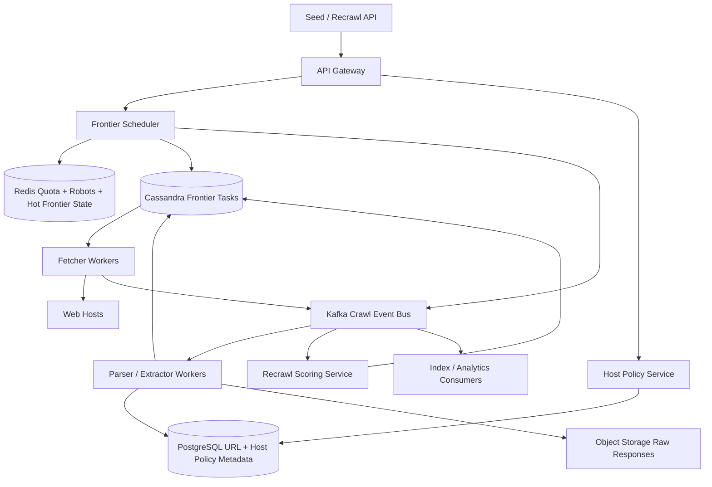
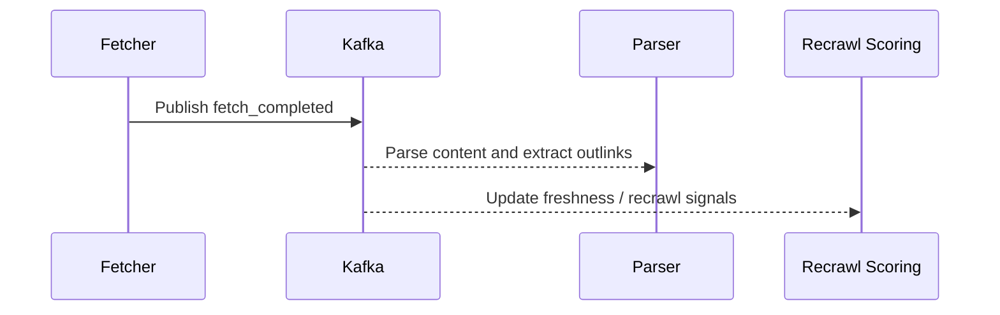
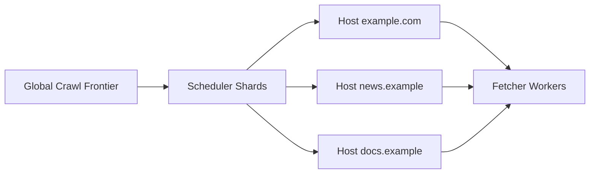
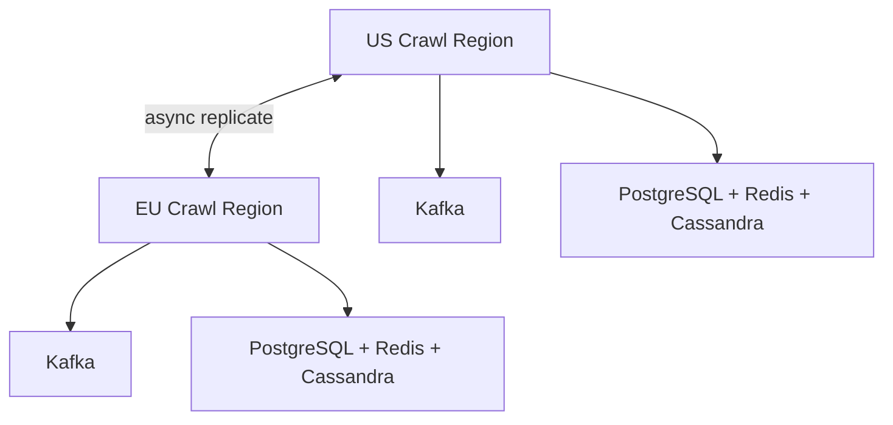

# Design Distributed Web Crawler

A distributed web crawler is a classic system design interview problem because it combines a massive write-heavy **URL discovery and fetch pipeline** with a read-heavy **indexing, deduplication, and recrawl scheduling system**. The crawler has to fetch billions of pages politely, avoid crawling the same content repeatedly, respect robots and host limits, and keep the frontier fresh enough for downstream search or analytics systems.

The surface looks simple: start with seed URLs, fetch pages, extract links, repeat. The depth lies in URL canonicalization, host-level politeness, crawl-frontier prioritization, duplicate detection, parser fanout, retry handling, content freshness, and keeping hot domains or abusive targets from destabilizing the whole system.

---

## Functional Requirements

**In Scope:**
- Accept seed URLs and crawl policies for domains or namespaces
- Fetch pages over HTTP/HTTPS and store raw response metadata
- Parse fetched pages, extract outlinks, and enqueue discovered URLs
- Respect `robots.txt`, crawl-delay, host-level concurrency, and blocklists
- Deduplicate URLs and content to avoid wasteful repeated crawling
- Maintain recrawl schedules based on freshness, change rate, and priority
- Expose crawl status, errors, and discovered-page metadata to internal consumers
- Support manual recrawl requests and domain-level throttling overrides

**Out of Scope:**
- Search ranking algorithms and serving-tier query execution
- Browser-grade JavaScript rendering for every page by default
- Full malware-scanning or content-classification model internals
- External public API monetization and billing systems
- Archival guarantees for every historical fetch forever

---

## Non-Functional Requirements

| Property | Target | Reasoning |
|---|---|---|
| **Fetch Throughput** | Millions of pages/minute at peak | Large-scale crawl coverage depends on sustained throughput |
| **Frontier Scheduling Latency** | p99 < 200ms to assign next eligible URL to a fetcher | Idle fetchers waste crawl capacity and freshness budget |
| **Robots / Politeness Correctness** | No host-level limit violations after a rule is accepted | Over-crawling hosts causes bans and bad ecosystem behavior |
| **Availability** | 99.99% for crawl scheduling and fetch orchestration | Stalled crawlers quickly create freshness gaps |
| **Durability** | No loss of accepted crawl tasks, fetch metadata, or committed discovered URLs | Restarting from scratch after failures is too expensive |
| **Consistency** | Strong for dedup keys, crawl frontier ownership, and robots/policy state; eventual for search indexing, recrawl scoring, and analytics | Slightly stale freshness scores are acceptable; duplicate frontier ownership is not |
| **Scale** | 100B+ discovered URLs, billions of fetches/day, millions of hosts | Both URL cardinality and host skew dominate the architecture |

**Key tradeoff:** the crawler prioritizes **polite, durable, and controlled crawling over raw maximum fetch speed**. A page fetched a bit later is acceptable. Violating host politeness, duplicating work massively, or losing frontier state is not.

---

## Capacity Estimation

**URL scale:**
- Assume the system has discovered **100B+ canonical URLs** over time
- Only a subset is active in the near-term frontier, but the dedup and metadata systems still need to reason about the full corpus
- URL discovery is bursty because one fetch can reveal hundreds or thousands of outlinks

**Fetch traffic:**
- Assume **5B fetches/day** across HTML, images, feeds, and metadata probes -> ~58K/sec average
- Peak fetch rate can be many times higher because frontier capacity is concentrated in work hours, high-priority domains, and recrawl bursts
- Bandwidth and DNS/TLS connection setup costs are major practical constraints, not just request count

**Parsing and link extraction:**
- Every successful HTML fetch generates parse work, metadata extraction, and often many new candidate URLs
- If average pages emit 50 usable outlinks, frontier writes can exceed fetch QPS by a large margin

**Storage:**
- Raw fetch metadata, parsed content summaries, dedup fingerprints, and crawl history quickly grow into PB-scale datasets
- The raw response bodies for all pages may be selectively retained, sampled, or TTL-managed depending on product goals

---

## Core Entities

| Entity | Purpose | Key Fields | Relationships |
|---|---|---|---|
| **CanonicalUrl** | Normalized logical URL identity | `url_id`, `canonical_url`, `host`, `scheme`, `path_hash`, `created_at` | referenced by frontier, fetch history, and link graph |
| **FrontierTask** | Scheduled crawl candidate | `task_id`, `url_id`, `priority`, `next_fetch_at`, `host_key`, `state` | owned by one scheduler shard |
| **HostPolicy** | Per-host crawl controls | `host_key`, `robots_etag`, `crawl_delay_ms`, `max_concurrency`, `blocked`, `updated_at` | affects frontier eligibility for that host |
| **FetchResult** | One fetch attempt outcome | `fetch_id`, `url_id`, `status_code`, `response_hash`, `fetched_at`, `latency_ms` | belongs to one canonical URL |
| **ParsedDocument** | Extracted structured representation | `doc_id`, `url_id`, `title`, `content_digest`, `language`, `parsed_at` | derived from a successful fetch |
| **OutlinkEdge** | Discovered link graph edge | `source_url_id`, `target_url_id`, `anchor_text`, `discovered_at` | connects parsed documents and URLs |
| **RecrawlScore** | Derived freshness priority | `url_id`, `score`, `reason`, `computed_at` | influences future frontier scheduling |
| **DomainQuota** | Budget and rate-limiting state | `host_key`, `tokens_available`, `refill_rate`, `updated_at` | shared by fetch schedulers and host policies |

**Critical modeling decisions:**
- `CanonicalUrl` is the deduplicated identity. Different syntactic URLs that normalize to the same canonical form should not produce independent long-term crawl records.
- `FrontierTask` is the crawl-control primitive. It is separate from parsed content and fetch history so scheduling logic does not rewrite document storage.
- `HostPolicy` and `DomainQuota` are authoritative crawl-governance state, not best-effort hints. Violating them is both a correctness and platform-risk issue.

---

## Databases and Database Design

### Storage Tier Decisions

| Data | Access Pattern | Engine | Why |
|---|---|---|---|
| URL metadata, host policies, crawl configuration | transactional writes, exact lookups, strong consistency | **PostgreSQL** | canonicalization metadata and policy changes need ACID guarantees |
| Crawl frontier and fetch history | append-heavy writes, host- or shard-scoped reads, large cardinality | **Cassandra / ScyllaDB** | efficient for high-volume scheduling and history timelines |
| Hot politeness tokens, frontier eligibility cache, robots cache | sub-millisecond reads/writes, TTLs, hot host keys | **Redis** | ideal for token buckets, short-lived host state, and active scheduler hints |
| Raw response blobs and parsed snapshots | large immutable artifacts, selective retention | **Object Storage** | cheap and scalable for raw fetch bodies or archived parses |
| URL/content search and internal query exploration | text lookup and metadata filtering | **OpenSearch / Elasticsearch** | useful for ops, analysis, and internal content lookup |
| Fetch, parse, recrawl, and indexing side effects | durable append-only stream | **Kafka** | decouples fetch completion from parsing, outlink extraction, and downstream consumers |

This is intentionally polyglot. A crawler has distinct workloads: **policy-correct metadata**, **massive frontier and history timelines**, **ephemeral hot host state**, and **large raw artifacts plus asynchronous parse pipelines**.

### Schema 1 - Canonical URLs (PostgreSQL)

```sql
CREATE TABLE canonical_urls (
  url_id               UUID PRIMARY KEY DEFAULT gen_random_uuid(),
  canonical_url        TEXT NOT NULL UNIQUE,
  host                 TEXT NOT NULL,
  scheme               VARCHAR(8) NOT NULL,
  path_hash            CHAR(64) NOT NULL,
  created_at           TIMESTAMPTZ DEFAULT NOW()
);

CREATE INDEX idx_canonical_urls_host ON canonical_urls (host);
```

### Schema 2 - Host Policies (PostgreSQL)

```sql
CREATE TABLE host_policies (
  host_key             TEXT PRIMARY KEY,
  robots_etag          TEXT,
  crawl_delay_ms       INT NOT NULL DEFAULT 1000,
  max_concurrency      INT NOT NULL DEFAULT 1,
  blocked              BOOLEAN NOT NULL DEFAULT FALSE,
  updated_at           TIMESTAMPTZ DEFAULT NOW()
);
```

### Schema 3 - Frontier Tasks (Cassandra)

```sql
CREATE TABLE frontier_tasks (
  shard_id             INT,
  host_key             TEXT,
  next_fetch_at        TIMESTAMP,
  task_id              UUID,
  url_id               UUID,
  priority             DOUBLE,
  state                TEXT,
  PRIMARY KEY ((shard_id, host_key), next_fetch_at, task_id)
) WITH CLUSTERING ORDER BY (next_fetch_at ASC, task_id ASC);
```

Partitioning by scheduler shard and host keeps task assignment local while preserving host-aware ordering.

### Schema 4 - Fetch History (Cassandra)

```sql
CREATE TABLE fetch_history (
  url_id               UUID,
  bucket_day           TEXT,
  fetched_at           TIMESTAMP,
  fetch_id             UUID,
  status_code          INT,
  response_hash        CHAR(64),
  latency_ms           INT,
  PRIMARY KEY ((url_id, bucket_day), fetched_at, fetch_id)
) WITH CLUSTERING ORDER BY (fetched_at DESC, fetch_id DESC);
```

### Schema 5 - Parsed Document Metadata (PostgreSQL)

```sql
CREATE TABLE parsed_documents (
  doc_id               UUID PRIMARY KEY DEFAULT gen_random_uuid(),
  url_id               UUID NOT NULL REFERENCES canonical_urls(url_id),
  title                TEXT,
  content_digest       CHAR(64) NOT NULL,
  language             VARCHAR(16),
  object_key           TEXT,
  parsed_at            TIMESTAMPTZ DEFAULT NOW()
);

CREATE INDEX idx_parsed_documents_url ON parsed_documents (url_id, parsed_at DESC);
```

### Schema 6 - Domain Quota State (Logical / Redis)

```json
{
  "key": "quota:example.com",
  "tokens_available": 3,
  "refill_rate_per_sec": 1,
  "max_tokens": 5,
  "last_refill_at": "2026-06-03T10:00:00Z"
}
```

Hot quota and politeness state changes constantly, so it belongs in Redis rather than the primary relational store.

### Sharding and Replication Strategy

| Store | Shard Key | Strategy | Replication |
|---|---|---|---|
| Canonical URLs / Host Policies | `host` or `url_id` | logical hash sharding after single-cluster growth | primary + read replicas |
| Frontier Tasks | `(shard_id, host_key)` | consistent hashing and host-aware partitioning | RF=3, `LOCAL_QUORUM` writes |
| Fetch History | `(url_id, bucket_day)` | consistent hashing across Cassandra nodes | RF=3 |
| Redis | `host_key`, `quota_key`, `robots_key` | Redis Cluster | 1 replica per master |
| Kafka | `host_key` or `url_id` | partitioned durable log | RF=3 |
| Raw Blobs | `host/date/url_hash` | object-store namespace | multi-AZ replicated |

**Consistency model:**
- Strong consistency for canonical URL dedup, frontier ownership, host policies, and blocklists
- Eventual consistency for search indexing, recrawl scoring, analytics, and content-derived features

**Read/write patterns:**
- **Scheduling path:** pick eligible host -> check quota and robots cache -> dequeue next frontier task -> hand it to fetcher
- **Fetch path:** HTTP fetch -> persist result metadata -> publish `fetch_completed` -> parse and outlink extraction follow asynchronously
- **Recrawl path:** history and change signals -> recompute recrawl score -> enqueue future frontier task without blocking the fetch loop

---

## API Design

**Submit seed URLs:**
```http
POST /v1/crawl/seeds
Authorization: Bearer <jwt>

{
  "seed_urls": [
    "https://example.com/",
    "https://example.com/blog/"
  ],
  "priority": "high"
}

202 Accepted
{
  "accepted": 2,
  "crawl_job_id": "job_123"
}
```

**Get crawl status for a URL:**
```http
GET /v1/crawl/urls/status?url=https://example.com/blog/post-1

200 OK
{
  "canonical_url": "https://example.com/blog/post-1",
  "last_status_code": 200,
  "last_fetched_at": "2026-06-03T09:58:00Z",
  "next_fetch_at": "2026-06-03T15:00:00Z"
}
```

**Request a recrawl:**
```http
POST /v1/crawl/recrawl
Authorization: Bearer <jwt>

{
  "url": "https://example.com/pricing",
  "priority_boost": 2.5
}

202 Accepted
{
  "canonical_url": "https://example.com/pricing",
  "state": "scheduled"
}
```

**Update host crawl policy:**
```http
PATCH /v1/crawl/hosts/example.com/policy
Authorization: Bearer <jwt>

{
  "max_concurrency": 2,
  "crawl_delay_ms": 1500,
  "blocked": false
}

200 OK
{
  "host_key": "example.com",
  "max_concurrency": 2,
  "crawl_delay_ms": 1500
}
```

**Fetch parsed document metadata:**
```http
GET /v1/crawl/documents/by-url?url=https://example.com/blog/post-1

200 OK
{
  "title": "Post 1",
  "content_digest": "sha256:abc123",
  "language": "en",
  "outlink_count": 37
}
```

**Operations event stream (SSE, optional):**
```http
GET /v1/crawl/ops/stream
Authorization: Bearer <jwt>
Accept: text/event-stream
```
Core crawling does not need client-facing WebSockets. An SSE stream is only useful for internal operations dashboards that want low-latency visibility into crawl lag, blocked hosts, or frontier pressure.

---

## High-Level Design



**Component responsibilities:**

| Component | Role |
|---|---|
| **API Gateway** | Auth, routing, rate limiting, and internal control-plane endpoints |
| **Frontier Scheduler** | Assigns eligible crawl tasks to fetchers while enforcing host politeness and priority |
| **Host Policy Service** | Stores and serves robots, crawl-delay, blocklists, and host concurrency settings |
| **Fetcher Workers** | Perform DNS, TLS, HTTP fetches, retry handling, and result emission |
| **Parser / Extractor Workers** | Parse content, extract metadata and outlinks, canonicalize URLs, and emit new tasks |
| **Recrawl Scoring Service** | Decides when and how aggressively pages should be crawled again |
| **Redis** | Holds hot host quota state, robots cache, and fast scheduler hints |
| **Cassandra Frontier Tasks** | Durable host-aware crawl frontier storage |
| **PostgreSQL URL + Host Policy Metadata** | Canonical URL metadata, crawl config, and policy state |
| **Kafka** | Durable backbone for fetch completion, parse results, recrawl, and indexing side effects |

**Crawl flow:**
1. Seed URLs or recrawl requests enter the Frontier Scheduler through the control-plane API
2. Scheduler checks host policy and quota state, then assigns eligible tasks to fetcher workers
3. Fetchers retrieve pages politely, persist fetch results, and publish completion events
4. Parser workers extract content and links, canonicalize new URLs, and enqueue discovered candidates back into the frontier
5. Recrawl scoring and downstream indexing happen asynchronously so they do not block the fetch loop

---

## Deep Dives

### 1. Kafka: Required for Fetch-to-Parse Pipelines

Kafka is required for a distributed crawler, but not because it stores the frontier itself. The hot fetch loop needs a durable event backbone between fetchers, parsers, recrawl scoring, and downstream indexing consumers. One successful fetch can trigger parsing, outlink extraction, dedup checks, raw-body archival, content classification, and analytics.

If fetchers synchronously invoked every downstream step before returning to the scheduler, throughput and fault tolerance would degrade quickly.



**Why the problem happens:** one fetch result has many downstream consumers that should not all sit inline in the fetch path.

**Why it becomes difficult at scale:**
- fetch bursts can create large parse and indexing spikes
- different consumers have very different latency and retry behavior
- replay is necessary after incidents because many outputs are derived state

**Production-grade solutions:**
- use topics such as `fetch.completed`, `parse.completed`, and `recrawl.recomputed`
- keep messages compact: URL IDs, host keys, fetch metadata, and storage keys, not huge raw bodies
- prioritize parse and frontier-updating consumers over low-priority analytics when lag grows
- retain Kafka long enough to replay downstream pipelines safely

**Tradeoffs:** Kafka adds operational overhead and eventual consistency for some derived views, but it protects the fetch loop and makes the pipeline recoverable.

### 2. Redis: Host Politeness, Robots Cache, and Hot Frontier State

Redis is required because scheduler decisions depend on very hot, ephemeral host state.

| Redis Use | Example Key | Why Redis Fits |
|---|---|---|
| **Host quota bucket** | `quota:example.com` | scheduler must check politeness tokens quickly |
| **Robots cache** | `robots:example.com` | repeated robots fetches are wasteful |
| **Hot frontier hint** | `frontier:shard:12:next_hosts` | helps fetchers avoid idle time |
| **Rate limiting** | `rl:operator:{user_id}:recrawl` | protects admin recrawl paths |

**Why the problem happens:** the crawler repeatedly makes small scheduling decisions keyed by host or domain.

**Why it becomes difficult at scale:**
- hot domains create concentrated scheduler pressure
- robots and quota state change over time and expire naturally
- too much scheduler latency leaves fetchers idle even when the frontier is large

**Production-grade solutions:**
- keep host token buckets and robots TTL caches in Redis
- separate durable policy state in PostgreSQL from hot scheduling state in Redis
- replenish quotas with predictable token-bucket logic rather than ad hoc sleeps in workers
- cache only active hosts and let cold hosts fall back to durable metadata reads

**Tradeoffs:** Redis provides excellent scheduler latency, but it must not become the only source of truth for crawl policy or dedup correctness.

### 3. Frontier Sharding, Scatter-Gather Fetching, and Host Fairness

The crawl frontier is not just a queue. It is a prioritized, host-constrained scheduling system. If the crawler naively dequeues the highest-priority URLs globally, it will hammer a few large domains and leave other hosts underutilized.



**Why the problem happens:** crawl priority and host politeness pull in opposite directions.

**Why it becomes difficult at scale:**
- some domains expose millions of URLs while others expose only a handful
- a few hot hosts can dominate priority queues and starve the long tail
- scheduler ownership must remain durable enough to survive worker failure without duplicate fetch storms

**Production-grade solutions:**
- shard the frontier by host-aware keys, not just raw URL hash
- choose eligible tasks by combining priority with host fairness and politeness availability
- lease tasks to fetchers for bounded intervals so failures do not permanently orphan work
- support requeue on timeout, but guard against duplicate inflight fetch explosions

**Tradeoffs:** host-aware fairness reduces raw throughput on the hottest domains, but it produces healthier global coverage and better ecosystem behavior.

### 4. Duplicate Detection, Canonicalization, and Content Fingerprinting

Crawlers waste enormous capacity without strong deduplication. The same logical page may appear with multiple query params, tracking tokens, or mirrored hostnames. Even after URL dedup, different URLs can still return identical content.

**Why the problem happens:** the web is messy, and syntactically different URLs often map to the same resource or content.

**Why it becomes difficult at scale:**
- canonicalization rules vary by site and are only partially inferable globally
- aggressive dedup can collapse genuinely distinct content if rules are too coarse
- content fingerprints and URL metadata must stay cheap enough for the hot path

**Production-grade solutions:**
- normalize scheme, default ports, fragments, path cleanup, and selected query parameters before creating `CanonicalUrl`
- maintain URL-level dedup on canonical form and content-level dedup on body fingerprints such as SimHash or strong hashes
- let canonical tags, redirects, and site-specific heuristics influence dedup decisions asynchronously
- keep content dedup advisory for crawl prioritization unless product requirements demand hard suppression

**Tradeoffs:** stronger dedup saves bandwidth and storage, but it increases false-merge risk and policy complexity.

### 5. WebSockets and Offline Delivery: Usually Not Required

Core crawling does not require WebSockets. Seeds, recrawl requests, status checks, and operations dashboards fit request-response APIs or optional SSE streams naturally. The crawler is fundamentally an asynchronous batch-and-stream pipeline, not an interactive realtime client product.

Offline delivery is also not a core backend concern here. Workers can resume from durable queues and logs; there is no user-facing offline sync experience to optimize for.

**Why the problem happens:** teams sometimes over-apply realtime infrastructure even when the system is mostly autonomous.

**Why it becomes difficult at scale:**
- persistent connections for every worker or dashboard add operational complexity without clear benefit
- most coordination already happens through durable storage and queues
- SSE/WebSockets do not solve the real problems of frontier durability or host politeness

**Production-grade solutions:**
- keep worker coordination on durable stores and Kafka
- use ordinary HTTP control-plane APIs for seeds, recrawl, and policy updates
- add SSE only for human-facing operational dashboards that need near-realtime visibility

**Tradeoffs:** avoiding unnecessary realtime infrastructure keeps the crawler simpler and easier to recover.

### 6. Hot Domains, Trap Pages, and Crawl Budget Protection

Not all URLs are equally valuable. Some domains publish endless calendars, faceted navigation traps, or auto-generated infinite spaces. A crawler without budget controls will waste capacity on low-value or adversarial surfaces.

**Why the problem happens:** the open web contains infinite URL patterns, hostile rate limits, and highly skewed domain value.

**Why it becomes difficult at scale:**
- hot domains and infinite traps can consume large portions of frontier capacity
- per-host failure modes differ widely: DNS issues, TLS errors, 429s, soft 404s, robots changes
- blindly recrawling unchanged pages wastes expensive bandwidth and parse budget

**Production-grade solutions:**
- maintain per-host and per-pattern crawl budgets with clear backoff policies
- detect crawl traps through URL-pattern heuristics, depth thresholds, and repeated low-value content fingerprints
- lower recrawl priority for unchanged pages and increase it for fast-changing high-value pages
- enforce operator overrides and emergency blocklists centrally

**Tradeoffs:** aggressive budget protection improves coverage and politeness, but it may occasionally delay discovery of some legitimate deep content.

### 7. Ordering, Freshness, and Recrawl Scheduling

The crawler has an ordering problem even without users clicking in real time. A page may be fetched successfully, then recrawled before the parser finishes the first version. A stale recrawl score can enqueue the wrong next-fetch time if newer fetch history has not been accounted for yet.

**Why the problem happens:** fetching, parsing, and recrawl scoring are asynchronous pipelines that observe state at different times.

**Why it becomes difficult at scale:**
- history, parser outputs, and freshness models update at different cadences
- out-of-order retries can arrive after fresher successful fetches
- multi-region or multi-shard replication introduces lag into policy and score propagation

**Production-grade solutions:**
- attach monotonic versions or `fetched_at` fencing to recrawl decisions
- ensure the scheduler uses the latest authoritative fetch outcome when multiple retries race
- publish recrawl updates as new frontier tasks rather than mutating history destructively
- accept eventual freshness optimization, but keep task ownership and dedup state strongly correct

**Tradeoffs:** perfect global freshness scoring is too expensive for the hot crawl loop. The practical design keeps the crawl core correct and lets recrawl optimization converge asynchronously.

### 8. Multi-Region Deployment, Backpressure, and Failure Recovery

Large crawlers run across regions for resilience and network locality. But they still need explicit ownership boundaries so the same host is not crawled aggressively from multiple regions by accident.



**Why the problem happens:** crawlers need both high availability and geographic reach, but duplicate work and policy divergence are expensive.

**Why it becomes difficult at scale:**
- cross-region latency hurts scheduler coordination if ownership is vague
- queue lag can grow during parse backlogs, host failures, or seed floods
- failover can create duplicate fetch storms if task leases and host ownership are not fenced carefully

**Production-grade solutions:**
- partition host ownership by shard or region so one active owner controls politeness for a host at a time
- replicate durable metadata and event streams asynchronously for recovery
- apply backpressure when parser lag or storage lag rises, preferring crawl correctness over maximum raw fetch throughput
- reissue task leases carefully after failover using expiration and fencing tokens

**Tradeoffs:** explicit ownership and backpressure reduce peak throughput, but they keep the crawler polite, recoverable, and economically efficient.

### 9. Architecture Evolution

| Stage | Design | Why It Breaks | Next Step |
|---|---|---|---|
| **1. MVP** | Single queue, a few fetchers, basic dedup table | host politeness, retries, and coverage degrade quickly | add host-aware scheduling and durable frontier storage |
| **2. Growth** | Separate frontier, fetch, parse, and metadata services | parse fanout and recrawl coupling slow the fetch loop | introduce Kafka and asynchronous downstream pipelines |
| **3. Scale** | Dedicated policy, recrawl, dedup, and analytics systems | hot domains, traps, and lagging consumers create instability | add stronger budget protection, backpressure, and regional ownership |
| **4. Global** | Multi-region crawler with replicated metadata and logs | exact global scheduling coordination is too expensive | keep strong correctness for host ownership and dedup, with eventual convergence for derived scores |

This is the interview pattern to emphasize: keep the fetch loop durable and polite, keep frontier ownership explicit, and push parsing, indexing, and recrawl optimization off the hot scheduling path.
