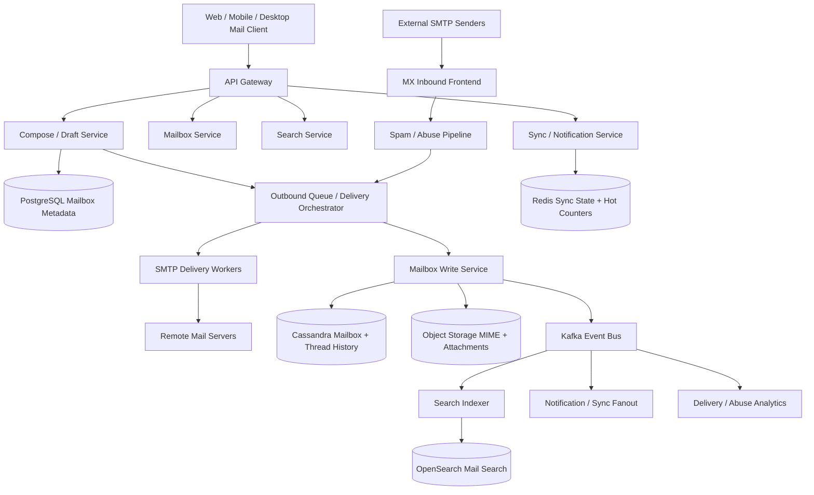
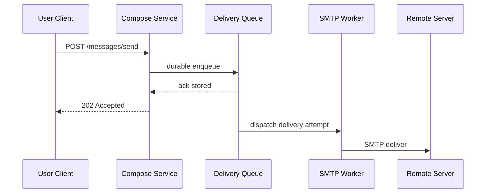
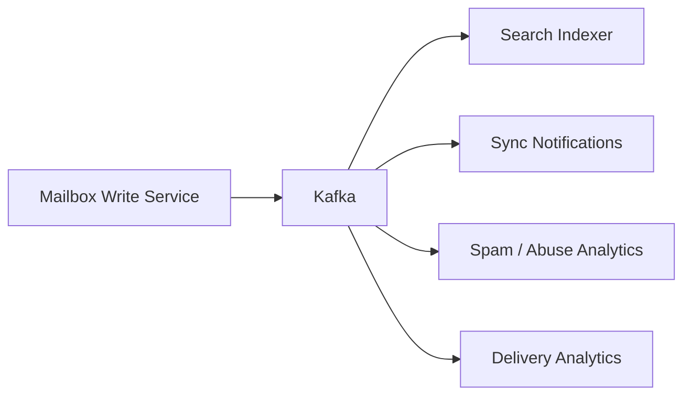
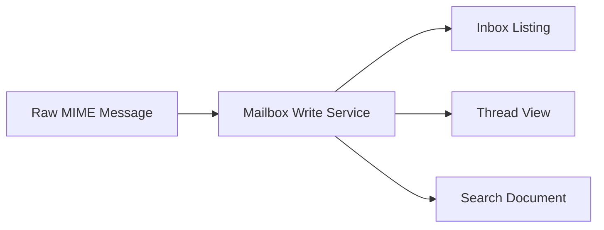
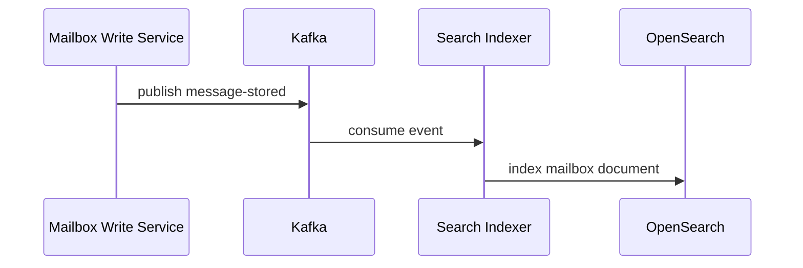
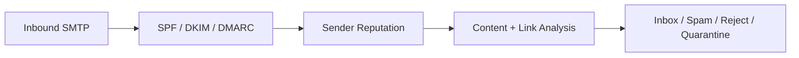
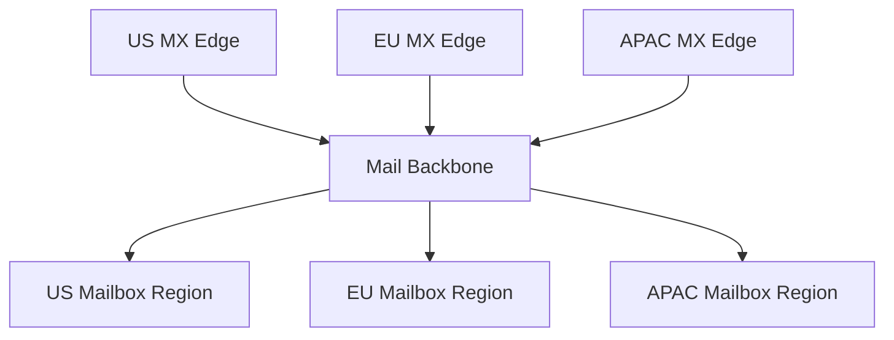

# Design Email System

Designing an email system is a classic system design interview problem because it combines store-and-forward delivery, durable mailbox storage, search, spam filtering, attachment handling, and large-scale asynchronous fanout. Users expect mail to arrive reliably, inboxes to load quickly, search to work across years of history, and attachments to open without delay. The difficult part is that email is not a single request-response workflow. One message can pass through composition, anti-abuse checks, outbound delivery, inbound MX handling, spam classification, mailbox indexing, thread grouping, notifications, and client sync before the user experiences it as "an email in my inbox."

At a high level, the system has three major workloads. The first is the **mail transport path**, where messages are submitted by users or received from external SMTP senders, then validated, queued, retried, and delivered. The second is the **mailbox path**, where messages are stored, threaded, labeled, searched, and synchronized to many clients. The third is the **platform path**, where spam and phishing detection, reputation systems, notifications, analytics, and abuse controls operate asynchronously. A good design keeps transport durable and retry-friendly, stores mailbox data in a form optimized for user-centric reads, and pushes expensive enrichment and indexing off the latency-critical send or inbox-load path.

---

## Functional Requirements

**In Scope:**
- Users can send, receive, reply to, forward, archive, and delete email messages
- The platform supports inboxes, folders or labels, unread state, drafts, and message threading
- The system handles inbound email from external SMTP senders and outbound delivery to external domains
- Users can attach files to emails and download attachments later
- Users can search mailbox history by sender, subject, keywords, labels, and time range
- The platform supports spam or phishing filtering and quarantine workflows
- Clients can sync mailbox changes across web, mobile, and desktop devices
- Operators can inspect delivery delays, bounce rates, spam-filter drift, hot mailboxes, and storage health

**Out of Scope:**
- Full calendar, contacts, and productivity-suite design beyond email-linked metadata
- Deep cryptographic design for end-to-end encrypted email between arbitrary external providers
- Full enterprise archive, e-discovery, and legal-hold workflows in depth
- Detailed anti-virus engine internals beyond acknowledging scanning as part of the pipeline
- Full mailing-list or marketing automation suite internals beyond standard email send and receive flows

---

## Non-Functional Requirements

| Property | Target | Reasoning |
|---|---|---|
| **Send API Latency** | p99 < 300ms to accept a message into the durable send queue | users expect compose and send to feel immediate even if final delivery is async |
| **Mailbox Read Latency** | p99 < 200ms for inbox page loads and message metadata fetches | inbox and thread navigation are the most common interactive reads |
| **Search Latency** | p95 < 2s for common mailbox search queries | search is a primary email workflow and must feel interactive |
| **Durability** | no acknowledged message should be lost in transit, storage, or sync pipelines | email is an authoritative record in many personal and business workflows |
| **Availability** | 99.99% for mailbox reads and send acceptance; degraded external delivery acceptable during remote outages | users must still access mailboxes even if some remote domains are slow |
| **Correctness** | no duplicate mailbox inserts or duplicate outbound sends under retries | retries are common across SMTP, client sync, and worker pipelines |
| **Scalability** | billions of messages/day with huge differences between small and large mailboxes | mailbox size and sending patterns are highly skewed |
| **Auditability** | delivery attempts, spam decisions, and user actions must be inspectable | support, abuse, and compliance workflows require traceability |

**Key tradeoff:** the system prioritizes **durable asynchronous mail transport and reliable mailbox consistency** over forcing every step into one synchronous request. Email users can tolerate delivery taking seconds or minutes in some cases, but they cannot tolerate lost mail or corrupted inbox state.

---

## Capacity Estimation

**Traffic assumptions:**
- Assume the platform handles **5B emails/day** across inbound and outbound traffic
- That is roughly **58K messages/sec average**, but global peaks can be **10x higher** during business hours or incident-driven mail bursts
- Many emails are multi-recipient, so one accepted send request can fan out into multiple outbound deliveries and mailbox writes

**Mailbox assumptions:**
- Assume **500M active accounts** with very uneven mailbox sizes
- Most users open their inbox repeatedly throughout the day, creating a read-heavy workload compared with message creation
- Enterprise users and high-volume support mailboxes can hold millions of messages and attachments over time

**Attachment assumptions:**
- Suppose the average message body and headers are small, but attachments dominate storage growth
- Large attachments may be tens of MB, while most messages have none at all
- Attachment blobs and raw MIME storage therefore require a very different cost model than mailbox metadata and search indexes

**Operational profile:**
- External SMTP delivery introduces unpredictable latency, greylisting, retries, and temporary failures
- Spam or phishing outbreaks can create sudden bursts of suspicious inbound traffic that stress filtering systems disproportionately
- Search and indexing load is correlated with mailbox growth and retention, not just current send volume

---

## Core Entities

| Entity | Purpose | Key Fields | Relationships |
|---|---|---|---|
| **UserAccount** | Email user identity | `user_id`, `primary_email`, `status`, `plan_tier` | owns one mailbox and many client sessions |
| **Mailbox** | Logical container for a user's messages | `mailbox_id`, `user_id`, `quota_bytes`, `status` | has labels, threads, and message references |
| **MessageEnvelope** | Transport-level email metadata | `message_id`, `from_address`, `recipient_list`, `subject`, `message_size` | points to raw MIME and delivery attempts |
| **MailboxMessageRef** | Per-mailbox placement of a message | `mailbox_id`, `message_id`, `folder`, `label_set`, `read_state` | links messages into inbox and thread views |
| **Thread** | Group of related email messages | `thread_id`, `mailbox_id`, `normalized_subject`, `latest_message_at` | contains many mailbox message refs |
| **Draft** | Unsent user-authored email | `draft_id`, `mailbox_id`, `to_list`, `subject`, `body_ref` | can become a send request |
| **AttachmentBlob** | Stored file or MIME part | `attachment_id`, `message_id`, `content_type`, `size_bytes`, `storage_key` | belongs to one message envelope |
| **DeliveryAttempt** | One outbound or inbound delivery action | `attempt_id`, `message_id`, `target_domain`, `status`, `next_retry_at` | belongs to a transport workflow |
| **SpamDecision** | Result of filtering or abuse analysis | `decision_id`, `message_id`, `policy`, `score`, `verdict` | influences mailbox placement |
| **SyncCursor** | Client mailbox sync checkpoint | `cursor_id`, `mailbox_id`, `client_id`, `last_seen_version` | supports incremental sync |

**Critical modeling decisions:**
- `MessageEnvelope` is separate from `MailboxMessageRef`. One logical email may need to appear in several recipient mailboxes, folders, or labels without duplicating the entire raw MIME body each time.
- `Thread` is mailbox-scoped because threading is partly user-specific. The same raw message can appear in different thread contexts across mailboxes.
- `DeliveryAttempt` is explicit because SMTP transport is retry-heavy and operationally important. Delivery state should not be inferred only from a message status flag.

---

## Databases and Database Design

### Storage Tier Decisions

| Data | Access Pattern | Engine | Why |
|---|---|---|---|
| Users, mailboxes, labels, drafts, send requests, quotas, transport metadata | transactional writes, exact reads, consistency-sensitive updates | **PostgreSQL / MySQL** | mailbox control-plane data and quotas need ACID semantics |
| Mailbox message refs, thread membership, sync history, delivery timelines | append-heavy writes, mailbox-scoped reads, cursor pagination | **Cassandra / ScyllaDB** | good fit for mailbox history and very large per-user timelines |
| Raw MIME bodies, attachments, generated previews | immutable large-object reads/writes | **Object Storage** | email payloads and attachments are better stored as blobs than rows |
| Search index for message bodies, subjects, senders, and labels | text search, filtering, ranking | **OpenSearch** | full-text mailbox search is not a transactional workload |
| Send queue, transport events, spam pipeline, indexing fanout, notifications | durable append-only backbone | **Kafka** | decouples message acceptance from many downstream consumers and supports replay |
| Unread counts, sync cursors, rate limits, short-lived locks | sub-millisecond reads/writes with TTLs | **Redis** | useful for hot counters and incremental sync helpers |

This is intentionally polyglot. An email system needs **strongly consistent control-plane metadata**, **large append-heavy mailbox histories**, **cheap blob storage for MIME and attachments**, **fast search**, and **durable asynchronous transport pipelines**. A single database would not serve all of those workloads efficiently.

### Schema 1 - Mailboxes and Labels (SQL)

```sql
CREATE TABLE mailboxes (
  mailbox_id                  UUID PRIMARY KEY DEFAULT gen_random_uuid(),
  user_id                     UUID NOT NULL UNIQUE,
  primary_email               VARCHAR(320) NOT NULL UNIQUE,
  quota_bytes                 BIGINT NOT NULL,
  status                      VARCHAR(16) NOT NULL,
  created_at                  TIMESTAMPTZ DEFAULT NOW()
);

CREATE TABLE mailbox_labels (
  label_id                    UUID PRIMARY KEY DEFAULT gen_random_uuid(),
  mailbox_id                  UUID NOT NULL REFERENCES mailboxes(mailbox_id),
  name                        VARCHAR(128) NOT NULL,
  system_label                BOOLEAN NOT NULL DEFAULT FALSE,
  created_at                  TIMESTAMPTZ DEFAULT NOW(),
  UNIQUE (mailbox_id, name)
);
```

### Schema 2 - Drafts and Outbound Requests (SQL)

```sql
CREATE TABLE drafts (
  draft_id                    UUID PRIMARY KEY DEFAULT gen_random_uuid(),
  mailbox_id                  UUID NOT NULL REFERENCES mailboxes(mailbox_id),
  subject                     TEXT,
  body_ref                    TEXT,
  created_at                  TIMESTAMPTZ DEFAULT NOW(),
  updated_at                  TIMESTAMPTZ DEFAULT NOW()
);

CREATE TABLE outbound_requests (
  request_id                  UUID PRIMARY KEY DEFAULT gen_random_uuid(),
  mailbox_id                  UUID NOT NULL REFERENCES mailboxes(mailbox_id),
  message_id                  UUID NOT NULL,
  idempotency_key             TEXT NOT NULL,
  status                      VARCHAR(24) NOT NULL,
  created_at                  TIMESTAMPTZ DEFAULT NOW(),
  UNIQUE (mailbox_id, idempotency_key)
);
```

### Schema 3 - Mailbox Messages by Mailbox (Cassandra)

```sql
CREATE TABLE mailbox_messages_by_mailbox (
  mailbox_id                   UUID,
  bucket_month                 TEXT,
  received_at                  TIMESTAMP,
  message_id                   UUID,
  thread_id                    UUID,
  folder_name                  TEXT,
  sender_email                 TEXT,
  subject                      TEXT,
  read_state                   BOOLEAN,
  label_set_json               TEXT,
  PRIMARY KEY ((mailbox_id, bucket_month), received_at, message_id)
) WITH CLUSTERING ORDER BY (received_at DESC, message_id DESC);
```

Monthly buckets keep mailbox scans bounded while preserving inbox-style reverse chronology.

### Schema 4 - Thread Messages by Thread (Cassandra)

```sql
CREATE TABLE thread_messages_by_thread (
  mailbox_id                   UUID,
  thread_id                    UUID,
  received_at                  TIMESTAMP,
  message_id                   UUID,
  sender_email                 TEXT,
  subject                      TEXT,
  body_preview                 TEXT,
  PRIMARY KEY ((mailbox_id, thread_id), received_at, message_id)
) WITH CLUSTERING ORDER BY (received_at ASC, message_id ASC);
```

### Schema 5 - Raw MIME Manifest (Object Storage JSON)

```json
{
  "message_id": "msg_123",
  "mime_ref": "s3://mail-raw/2026/06/03/msg_123.eml",
  "attachments": [
    {
      "attachment_id": "att_456",
      "storage_key": "s3://mail-attachments/2026/06/03/att_456.bin",
      "content_type": "application/pdf",
      "size_bytes": 1048576
    }
  ],
  "received_at": "2026-06-03T10:00:00Z"
}
```

### Schema 6 - Search Document (OpenSearch)

```json
{
  "mailbox_id": "mbx_123",
  "message_id": "msg_123",
  "thread_id": "thr_999",
  "sender": "alice@example.com",
  "subject": "Quarterly planning notes",
  "body_text": "Please review the attached deck...",
  "labels": ["inbox", "work"],
  "received_at": "2026-06-03T10:00:00Z"
}
```

### Schema 7 - Sync Cursor (Logical Redis Record)

```json
{
  "key": "sync:mailbox:mbx_123:client:web_456",
  "value": {
    "last_seen_version": 1828821,
    "expires_at": "2026-06-03T10:10:00Z"
  }
}
```

### Sharding and Replication Strategy

| Store | Shard Key | Strategy | Replication |
|---|---|---|---|
| SQL control plane | `mailbox_id` or user-region shard | logical mailbox shards as account volume grows | primary + replicas |
| Cassandra mailbox history | `(mailbox_id, bucket_month)` and `(mailbox_id, thread_id)` | consistent hashing across nodes | RF=3, `LOCAL_QUORUM` |
| Kafka | `message_id`, sender domain, or mailbox id depending on topic | partitioned durable log | RF=3 |
| Redis | `mailbox_id`, `client_id`, unread counter key | Redis Cluster | 1 replica per master |
| Object Storage | `message_id` and attachment namespace | immutable object storage with lifecycle rules | multi-AZ durable storage |
| OpenSearch | mailbox/date routing and replica shards | distributed search cluster | multi-node replicas |

**Consistency model:**
- Strong consistency for drafts, send acceptance, label definitions, quotas, and mailbox control-plane metadata
- Durable ordered append for transport and indexing events once they enter Kafka
- Eventual consistency for full-text search indexes, mailbox unread counters, notifications, and spam rescoring
- Best-effort low-latency consistency for sync cursors and hot cache state in Redis

**Read/write patterns:**
- **Send path:** user submits email -> durable send queue -> spam and policy checks -> outbound SMTP delivery attempts -> sent-folder mailbox write
- **Receive path:** inbound SMTP or internal delivery -> spam classification -> mailbox insertion -> search indexing -> client sync notification
- **Mailbox path:** inbox page loads from mailbox history store -> thread expansion from thread store -> raw MIME and attachments fetched from object storage

---

## API Design

**Create a draft:**
```http
POST /v1/drafts
Authorization: Bearer <jwt>
Idempotency-Key: draft-001

{
  "to": ["alice@example.com"],
  "subject": "Project status",
  "body_text": "Attaching the latest summary."
}

201 Created
{
  "draft_id": "drf_123",
  "status": "saved"
}
```

**Request attachment upload URL:**
```http
POST /v1/attachments/upload-url
Authorization: Bearer <jwt>

{
  "content_type": "application/pdf",
  "size_bytes": 1048576
}

200 OK
{
  "upload_url": "https://s3.amazonaws.com/...",
  "attachment_id": "att_456",
  "expires_in": 300
}
```

**Send an email:**
```http
POST /v1/messages/send
Authorization: Bearer <jwt>
Idempotency-Key: send-001

{
  "draft_id": "drf_123",
  "to": ["alice@example.com"],
  "cc": [],
  "bcc": [],
  "attachment_ids": ["att_456"]
}

202 Accepted
{
  "message_id": "msg_123",
  "status": "queued_for_delivery"
}
```

**Fetch inbox messages (cursor-paginated):**
```http
GET /v1/mailboxes/me/messages?folder=inbox&before=2026-06-03T10:00:00Z&limit=50
Authorization: Bearer <jwt>

200 OK
{
  "messages": [
    {
      "message_id": "msg_123",
      "thread_id": "thr_999",
      "sender": "alice@example.com",
      "subject": "Project status",
      "read": false,
      "received_at": "2026-06-03T09:59:55Z"
    }
  ],
  "next_cursor": "2026-06-03T09:59:55Z",
  "has_more": true
}
```

> Cursor-based pagination on `received_at` is preferred. Offset pagination (`?page=N`) becomes unstable and expensive for large continuously changing inboxes.

**Fetch a thread:**
```http
GET /v1/threads/thr_999
Authorization: Bearer <jwt>

200 OK
{
  "thread_id": "thr_999",
  "messages": [
    {
      "message_id": "msg_123",
      "sender": "alice@example.com",
      "subject": "Project status"
    }
  ]
}
```

**Search mailbox:**
```http
GET /v1/search?q=from:alice@example.com project&before=2026-06-03T10:00:00Z&limit=20
Authorization: Bearer <jwt>

200 OK
{
  "results": [
    {
      "message_id": "msg_123",
      "thread_id": "thr_999",
      "subject": "Project status"
    }
  ],
  "next_cursor": "res_020",
  "has_more": true
}
```

**Mailbox sync stream (optional SSE):**
```http
GET /v1/mailboxes/me/stream
Authorization: Bearer <jwt>
Accept: text/event-stream
```
The core email system does not require WebSockets for message delivery. REST or IMAP-like sync APIs handle mailbox reads, while optional SSE or IMAP IDLE style channels are enough for new-message notifications and unread-count refreshes. SMTP remains the backbone for inter-provider delivery.

---

## High-Level Design



**Component responsibilities:**

| Component | Role |
|---|---|
| **API Gateway** | Authentication, rate limiting, routing, and mailbox API validation |
| **MX Inbound Frontend** | Accepts inbound SMTP from external domains and performs protocol-level validation |
| **Compose / Draft Service** | Manages drafts, attachment references, and send request acceptance |
| **Outbound Queue / Delivery Orchestrator** | Manages send queueing, retry logic, remote domain routing, and bounce handling |
| **Spam / Abuse Pipeline** | Applies inbound and outbound abuse checks, reputation signals, and phishing detection |
| **SMTP Delivery Workers** | Deliver queued messages to external mail servers using SMTP with retries and backoff |
| **Mailbox Write Service** | Inserts mail into recipient mailboxes, updates thread state, and stores raw MIME references |
| **Cassandra Mailbox + Thread History** | Stores inbox listings, thread views, and mailbox-scoped message references |
| **Object Storage MIME + Attachments** | Stores raw MIME payloads and attachment blobs durably |
| **Kafka** | Durable fanout for indexing, sync notifications, analytics, and abuse workflows |
| **Search Indexer** | Builds and updates mailbox search documents |
| **Sync / Notification Service** | Pushes mailbox deltas and unread changes to clients |

**Send and receive flow:**
1. User sends an email through the compose API, which stores the draft state and accepts the send request into the outbound queue durably
2. Delivery orchestrator applies policy checks, then hands the message to SMTP workers for external delivery or to mailbox-write service for internal recipients
3. Inbound external mail enters through the MX frontend, passes through spam and abuse analysis, and then enters the same mailbox-write path
4. Mailbox-write service stores raw MIME and attachments, inserts mailbox message refs and thread membership, and publishes downstream events
5. Kafka fans out search indexing, notifications, analytics, and other asynchronous consumers without blocking transport acceptance
6. Clients read inbox and thread state from mailbox stores and receive lightweight sync updates through SSE or IMAP IDLE style mechanisms

---

## Deep Dives

### 1. SMTP Transport: Durable Queueing Is the Core Principle

Email delivery is fundamentally store-and-forward. Once the user presses send, the platform should not try to complete every remote-domain delivery synchronously before returning. Remote mail servers can be slow, greylist requests, or fail temporarily. The send path should acknowledge after durable enqueue, not after final network delivery.



**Why the problem happens:** external email delivery depends on systems the sender does not control.

**Why it becomes difficult at scale:**
- remote domains can respond slowly or reject temporarily
- one user-facing send can fan out to many recipients and domains
- delivery retries and bounces are normal rather than exceptional

**Production-grade solutions:**
- acknowledge user send requests only after durable queueing
- track delivery attempts explicitly with retry state, backoff, and remote-domain metadata
- separate internal recipient mailbox writes from external SMTP handoff so local delivery can stay fast
- persist bounce and final failure state cleanly for mailbox visibility and support workflows

**Tradeoffs:** asynchronous transport makes the send flow resilient, but it means visible final delivery can lag behind user action.

### 2. Kafka: Required and Central

Kafka is usually central in a large email system because one accepted message spawns many asynchronous tasks: spam scoring, search indexing, client notifications, analytics, threading updates, bounce processing, and abuse monitoring. Without a durable event backbone, the mailbox system becomes tightly coupled and difficult to replay safely.



**Why the problem happens:** accepted mail creates many downstream consumers with different SLAs and failure modes.

**Why it becomes difficult at scale:**
- indexing, sync, and analytics can lag independently
- spam rescoring or policy changes require replay of earlier signals
- large bursts from certain domains or incident traffic create uneven pressure

**Production-grade solutions:**
- publish immutable mailbox and transport events after authoritative writes succeed
- partition topics by `message_id`, mailbox id, or domain depending on ordering needs
- keep enough retention to recover outages and replay indexing or abuse pipelines
- isolate slow consumers so they do not block the core transport and mailbox path

**Tradeoffs:** Kafka adds operational overhead, but without it the system becomes harder to decouple, recover, and evolve.

### 3. Mailbox Storage: User-Centric Reads Need a Different Model Than SMTP Transport

SMTP is about moving a message between servers. The mailbox UI is about showing the user a clean inbox, thread view, unread counts, and labels. Those are different access patterns. Storing only raw MIME messages is not enough to build a fast mailbox product.



**Why the problem happens:** the transport representation of email is not the same as the mailbox-read representation.

**Why it becomes difficult at scale:**
- inbox loads and thread loads need mailbox-scoped ordering, not global message scans
- the same message may exist in many recipient mailboxes with different labels and read state
- years of mailbox history make naive scans too expensive

**Production-grade solutions:**
- store raw MIME once in object storage, but maintain mailbox-specific refs for inbox and thread views
- partition mailbox message history by mailbox and time bucket for predictable pagination
- build thread-specific read models separately from inbox listings
- keep label and unread state mailbox-local even when the underlying message payload is shared

**Tradeoffs:** denormalized mailbox refs improve read latency, but they increase write amplification on delivery.

### 4. Search: Full-Text Indexing Must Be Asynchronous and Replayable

Email search is a core product feature, but indexing every message synchronously during transport would slow down both inbound receipt and user send flows. Search indexing belongs on an asynchronous pipeline backed by durable events and a dedicated text-search store.



**Why the problem happens:** mailbox search needs body text, headers, labels, and attachment metadata indexed for fast lookup.

**Why it becomes difficult at scale:**
- messages are numerous and long-term retention is common
- updates such as label changes or deletions must be reflected in the search index too
- indexing attachments, OCR, or extracted text can be expensive

**Production-grade solutions:**
- keep search indexing fully asynchronous and event-driven
- store searchable text in a dedicated search cluster rather than scanning mailbox stores
- support replay so index rebuilds or mapping changes are practical
- separate search freshness SLAs from transport correctness so a delayed index does not mean lost mail

**Tradeoffs:** asynchronous indexing keeps the hot path fast, but search results can lag mailbox state slightly during heavy load or reindexing.

### 5. Attachments and Raw MIME Belong in Object Storage

Attachments and raw MIME blobs dominate storage growth in many email systems. Storing those payloads directly in the primary metadata database would be expensive and operationally awkward. Object storage is a better fit for immutable large payloads.

**Why the problem happens:** message bodies, inline images, and attachments are large and mostly immutable after send.

**Why it becomes difficult at scale:**
- attachment retention grows continuously over years of mailbox history
- downloads can be bursty when many clients open the same message across devices
- malware scanning and preview generation often operate on attachment blobs later

**Production-grade solutions:**
- store raw MIME and attachments in object storage with durable references from mailbox metadata
- generate secure download URLs or proxy downloads through authorized services
- keep preview extraction and malware scanning asynchronous where possible
- deduplicate identical attachment blobs only if the product’s privacy and operational model supports it safely

**Tradeoffs:** object storage lowers cost and improves durability, but it adds another hop for message rendering and attachment access.

### 6. Spam, Phishing, and Reputation Systems

An email system that does not control spam and phishing is unusable. Filtering is not a single classifier. It is a layered decision system that includes domain reputation, authentication checks, content analysis, link reputation, attachment scanning, and user feedback signals.



**Why the problem happens:** email is open by design, so abuse pressure is constant and adversarial.

**Why it becomes difficult at scale:**
- senders adapt quickly to reputation changes and content filters
- false positives hurt legitimate correspondence and trust
- some signals are cheap and synchronous while others are expensive and delayed

**Production-grade solutions:**
- combine protocol-authentication checks with reputation and content analysis
- keep high-recall filters on the inbound path for the most dangerous abuse patterns
- continuously update sender and domain reputation from historical behavior and user reports
- separate spam verdicts from permanent deletion when the product wants recovery or user override options

**Tradeoffs:** stronger filtering improves safety and usability, but it increases model complexity and the cost of false positives.

### 7. Redis: Sync State and Hot Counters, Not Mailbox Truth

Redis helps with unread counters, sync cursors, short-lived locks, and notification fanout hints, but it should not be the canonical truth for which messages are in a mailbox. If Redis disappears, the system should fall back to slower reads, not lose mailbox correctness.

| Redis Use | Example Key | Why Redis Fits |
|---|---|---|
| **Sync cursor** | `sync:mailbox:mbx_123:client:web_456` | hot incremental sync checkpoints are small and ephemeral |
| **Unread count cache** | `mailbox:mbx_123:unread` | frequently read UI counters benefit from caching |
| **Rate limiting** | `rl:send:user_123` | protects send APIs from abuse and compromised accounts |
| **Notification hint** | `notify:mailbox:mbx_123:last_event` | supports lightweight push and fanout coordination |

**Why the problem happens:** email clients poll or sync frequently, and the same counters are read constantly.

**Why it becomes difficult at scale:**
- hot mailboxes can create skewed cache pressure
- stale counters cause visible user confusion if invalidation is weak
- teams may accidentally trust cached values more than durable mailbox state

**Production-grade solutions:**
- keep SQL and mailbox history stores as the hard correctness boundary
- use Redis only for acceleration, sync convenience, and rate limits
- rebuild counters and cursors from durable mailbox events if cache state is lost
- invalidate or refresh hot counters after mailbox writes complete successfully

**Tradeoffs:** Redis reduces read latency and backend pressure, but over-reliance creates subtle consistency and recovery risks.

### 8. WebSockets: Usually Optional for Core Email

Email is not a chat system. The core product does not require full WebSocket delivery for each message. Most email clients work well with REST APIs, IMAP-like sync, and optional push channels such as SSE or IMAP IDLE for new mail notifications.

**Why the problem happens:** users want awareness of new mail, but the interaction pattern is primarily request-response and periodic sync.

**Why it becomes difficult at scale:**
- persistent sockets add statefulness without helping the underlying SMTP transport much
- many clients already support sync paradigms built around polling or long-lived mailbox-specific protocols
- mailbox updates are less latency-sensitive than chat messages in most workflows

**Production-grade solutions:**
- keep send, read, search, and label APIs on REST or IMAP-like protocols
- use SSE, push notifications, or IMAP IDLE for new-mail nudges and unread updates
- reserve WebSockets for specialized collaborative mailbox products only if necessary
- ensure every client can recover canonical state through idempotent sync APIs regardless of push-channel loss

**Tradeoffs:** avoiding WebSockets simplifies the platform, but some clients may see slightly slower update awareness without a push-style notification channel.

### 9. Multi-Region Serving and Deliverability Reputation

Email systems are global, but outbound reputation and data locality matter. Inbound SMTP should be accepted close to the network edge, while mailbox data and search often need regional strategies for performance and compliance. Outbound sending reputation can also be sensitive to IP pools and region-specific infrastructure.



**Why the problem happens:** senders and recipients are global, but storage, compliance, and network reputation are not uniform.

**Why it becomes difficult at scale:**
- cross-region mailbox access can hurt inbox and search latency
- outbound delivery reputation depends on IP and domain behavior over time
- regional outages should not cause inbound mail loss or duplicate transport processing

**Production-grade solutions:**
- accept SMTP at regional edges and route mail into durable queues quickly
- keep mailbox reads close to users when possible, with clear shard ownership per mailbox
- manage outbound IP pools and reputation signals per region or sending class explicitly
- design transport retries and de-duplication so failover does not double-deliver or double-store messages

**Tradeoffs:** multi-region improves resilience and user latency, but it complicates deliverability operations, shard ownership, and compliance boundaries.

### 10. Architecture Evolution

| Stage | Design | Why It Breaks | Next Step |
|---|---|---|---|
| **1. MVP** | Single database, simple send queue, raw MIME storage, and basic inbox views | mailbox growth, search, and spam complexity quickly overwhelm the stack | add asynchronous indexing, mailbox history store, and object storage |
| **2. Growth** | Dedicated SMTP ingress, Kafka, mailbox history, search cluster, and attachment blobs | hot mailboxes, spam outbreaks, and cross-device sync strain shared components | add Redis sync helpers, better sharding, and stronger abuse pipelines |
| **3. Scale** | Multi-region edges, sharded mailbox stores, reputation systems, and richer transport orchestration | operational complexity shifts to deliverability, search freshness, and cost control | isolate sender classes, improve replay, and harden regional failover |
| **4. Mature Email Platform** | Full mailbox backbone with durable transport, search, spam, storage, and sync subsystems | the hardest problems become abuse adaptation, compliance, and long-term cost | keep transport, mailbox, and indexing planes cleanly separated and evolve them independently |

This is the interview pattern to emphasize: acknowledge email send after durable queueing, keep mailbox reads optimized around user-centric inbox and thread views, store large MIME and attachments in object storage, use Kafka as the asynchronous backbone, keep search and spam pipelines replayable, and let Redis and push channels accelerate sync without becoming the source of mailbox truth.
