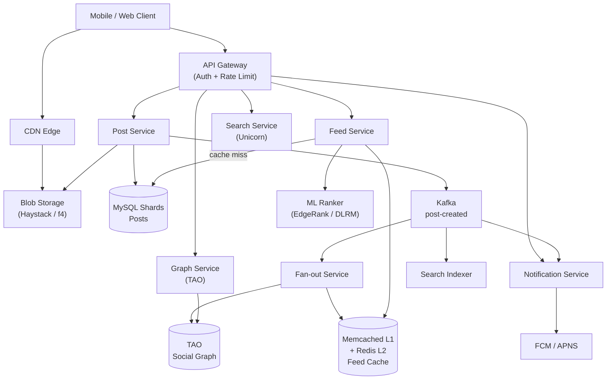
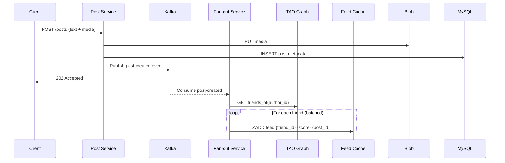
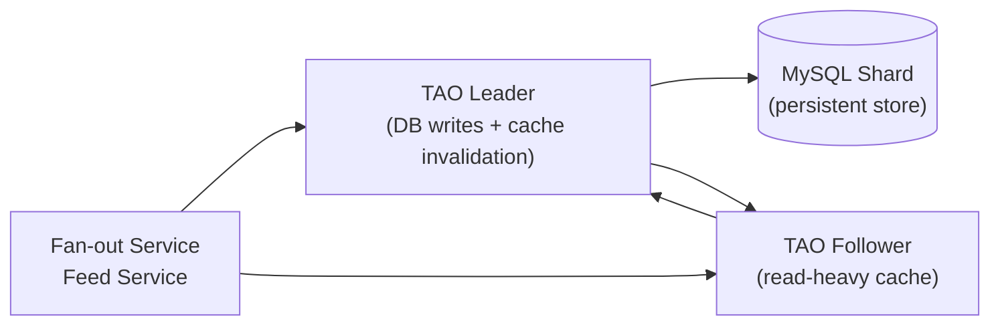
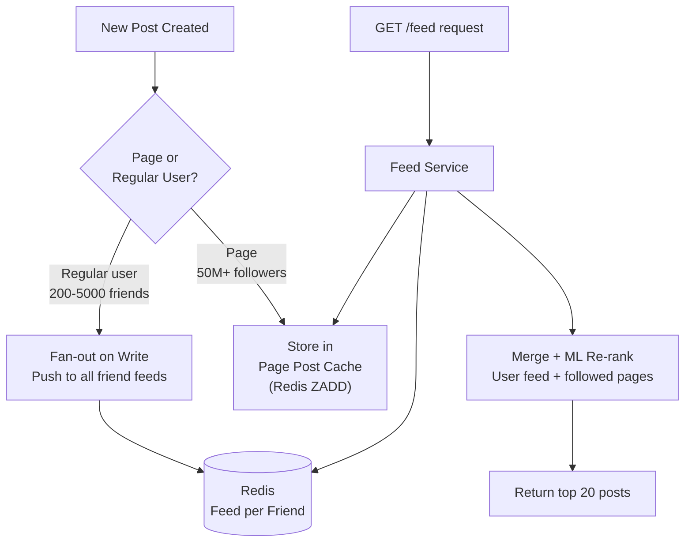
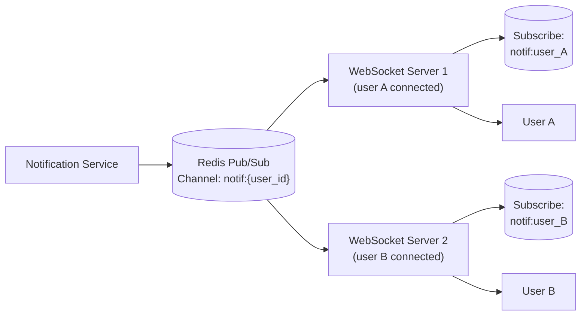
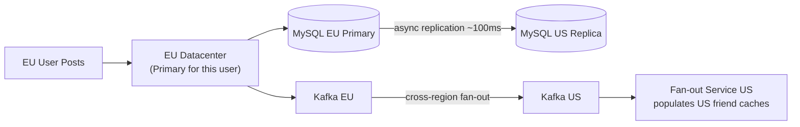

# Design Facebook

Facebook is the world's largest social network with **3 billion monthly active users**, **2 billion daily active users**, and more than **100 billion social connections** in its graph. Users post text and media, follow friends, and consume a personalized **News Feed** of posts from their network. At its core, Facebook is a social graph problem — but the real engineering challenge is the **News Feed**: generating a ranked, personalized timeline for 2 billion people in under 200ms, at all hours, without interruption.

This problem tests social graph storage at planetary scale, the fan-out problem taken to its absolute extreme (Cristiano Ronaldo has 400M followers), multi-tier caching, and the evolution from simple chronological feeds to ML-ranked relevance feeds.

---

## Functional Requirements

**In Scope:**
- Create a post (text, photos, videos, links)
- News Feed: personalized, ranked timeline of posts from friends and followed pages
- Friend requests: send, accept, reject; mutual friendship graph
- Like and react to posts (Like, Love, Haha, Wow, Sad, Angry)
- Comment on posts; nested replies
- Share a post (re-post to own timeline)
- Stories: ephemeral media visible for 24 hours
- Notifications: new friend request, like, comment, mention
- Search: find users, pages, groups, posts

**Out of Scope:**
- Marketplace (e-commerce)
- Facebook Groups deep feature set
- Facebook Ads targeting and serving pipeline
- Live Video infrastructure
- Facebook Messenger (separate deep dive — see WhatsApp/Messenger)
- Reels ML recommendation model design
- Content moderation pipeline

---

## Non-Functional Requirements

| Property | Target | Reasoning |
|---|---|---|
| **Feed Latency** | p99 < 200ms | Core UX metric; users abandon slow feeds instantly |
| **Post Publish Latency** | < 1s acknowledgment; async fan-out | The post creation ACK must be instant; fan-out takes time |
| **Availability** | 99.99% for feed reads and post creation | At 2B DAU, 0.01% downtime = 200K users affected per minute |
| **Consistency** | Eventual for like counts, feed ordering; strong for friendship graph | Stale like count is tolerable; wrong friend state corrupts the feed |
| **Durability** | Zero post or friendship loss | User content is permanent unless deleted by the user |
| **Notification Latency** | < 5s push delivery | Engagement drops sharply with delayed social signals |
| **Scale** | 2B DAU, 500M posts/day, 10B feed reads/day | Every architectural decision flows from these numbers |
| **Search Latency** | p99 < 300ms | Near-instant user and content search is a table-stakes expectation |

**The defining tradeoff:** Facebook's feed is the hardest fan-out problem in the industry. Instagram solved it with a celebrity threshold (fan-out on write for < 10K followers, fan-out on read for celebrities). Facebook's mutual friendship model — where both parties are friends, not just follower/followee — means the social graph is denser and harder to partition. Facebook uses a **hybrid fan-out** with an aggressive multi-tier cache hierarchy rather than a clean threshold rule.

---

## Capacity Estimation

**Posts:**
- 500M posts/day → ~5,800/sec average; ~17,400/sec peak (3×)
- Post size: 1KB text + optional media
- Photos: 300M photo uploads/day × 3MB average = **~900 TB/day** media ingestion
- Videos: 100M video uploads/day × 50MB average = **~5 PB/day** (transcoding reduces this ~70%)

**Feed reads:**
- 2B DAU × 5 feed opens/day = 10B reads/day → **~115,000 reads/sec**
- Each feed fetch returns 20 posts → 2.3B post-level lookups/sec
- Cache hit rate must be > 99% — at 115K reads/sec against a DB, you need caching at every tier

**Social graph:**
- 3B users × average 200 friends = **600B friendship edges**
- Friendship edge record: 16 bytes (two UUIDs) → ~9.6 TB — fits in distributed graph storage

**Reactions:**
- ~10B reactions/day → ~115,000 reactions/sec
- Each reaction: 50 bytes → 500 GB/day

**Storage:**
- TAO (Facebook's social graph store): ~100 TB of graph edges in memory across the cluster
- Media: exabyte-scale in blob storage (Haystack + f4)

---

## Core Entities

| Entity | Purpose | Key Fields |
|---|---|---|
| **User** | Account and profile | `user_id`, `name`, `email`, `phone`, `profile_pic_url`, `cover_photo_url`, `bio`, `created_at` |
| **Post** | A piece of content | `post_id`, `author_id`, `text`, `media_ids[]`, `privacy` (public/friends/only_me), `created_at`, `share_count`, `comment_count` |
| **Friendship** | Bidirectional social edge | `user_id_1`, `user_id_2`, `status` (pending/accepted/blocked), `created_at` — stored as two directed edges internally |
| **Reaction** | User reaction to a post or comment | `post_id`, `user_id`, `type` (like/love/haha/wow/sad/angry), `created_at` |
| **Comment** | Text reply on a post | `comment_id`, `post_id`, `parent_comment_id`, `author_id`, `text`, `created_at` |
| **Story** | Ephemeral 24h media | `story_id`, `user_id`, `media_url`, `created_at`, `expires_at` |
| **Feed** | Materialized ranked post list (cache only) | `user_id`, `ranked_post_ids[]` — Redis structure, not a DB table |
| **Notification** | Social signal event | `notif_id`, `recipient_id`, `actor_id`, `type`, `entity_id`, `read`, `created_at` |
| **Media** | Uploaded photo or video | `media_id`, `uploader_id`, `blob_url`, `type`, `width`, `height`, `duration_ms`, `created_at` |

**Critical modeling decisions:**
- Friendship is stored as **two directed edges** internally: `(A → B)` and `(B → A)`. This makes "get all friends of user X" a single partition scan rather than a two-way join. The cost is 2× storage — cheap at Facebook's scale for a 2× read speedup.
- `Feed` is **not a database table** — it is a materialized Redis structure computed by the Fan-out Service. It is ephemeral and re-computable.
- `Reaction` uses a composite primary key `(post_id, user_id)` with `INSERT IF NOT EXISTS` — reacting to the same post twice is idempotent. Reaction type changes are updates, not new inserts.
- `Post` privacy field is enforced at **read time** — the Fan-out Service respects privacy during feed population, but the Feed Service also re-validates privacy on render to handle retroactive privacy changes.

---

## Databases and Database Design

### Storage Tier Decisions

| Data | Access Pattern | Engine | Why |
|---|---|---|---|
| User profiles | Point reads, auth lookups | **MySQL (TAO-backed)** | Facebook runs MySQL under TAO; ACID; billions of user records sharded by `user_id` |
| Social graph (friendships, follows) | Adjacency list scans; edge existence checks | **TAO (MySQL + Memcached)** | Purpose-built graph cache; O(1) edge reads; 600B edges in memory-backed store |
| Post metadata | High write throughput; timeline reads | **MySQL (sharded)** | Facebook historically ran MySQL at scale; Cassandra for newer write-heavy paths |
| Reactions and comments | High write volume, eventual consistency fine | **MySQL (sharded) / Cassandra** | High throughput; partition by `post_id` |
| Precomputed feeds | Low-latency sorted reads, append/trim | **Memcached + Redis** | Memcached for large L1 feed cache; Redis Sorted Set for ranked feed with scores |
| Media blobs | Write-once, read-many, exabyte scale | **Haystack + f4 (Facebook's blob stores)** | Custom object storage; Haystack for hot media; f4 (RAID-based) for cold media |
| Stories (active) | TTL-driven expiry, per-user sorted reads | **Redis TTL + blob storage** | Zero-cost expiry; media durability via blob store |
| Search index | Full-text, entity resolution, autocomplete | **Unicorn (Facebook's search engine)** | Custom inverted index tuned for social search; handles billions of entities |
| Notifications | Fan-out writes, per-user reads | **MySQL / Cassandra** | High write throughput; partition by `recipient_id` |

### Schema 1 — Posts (MySQL, sharded by `author_id`)

```sql
CREATE TABLE posts (
  post_id     BIGINT UNSIGNED  NOT NULL AUTO_INCREMENT,
  author_id   BIGINT UNSIGNED  NOT NULL,
  text        TEXT,
  privacy     TINYINT          NOT NULL DEFAULT 1,  -- 0:public 1:friends 2:only_me
  created_at  DATETIME(3)      NOT NULL DEFAULT CURRENT_TIMESTAMP(3),
  deleted_at  DATETIME(3),
  share_count INT UNSIGNED     DEFAULT 0,
  PRIMARY KEY (post_id),
  KEY idx_author_created (author_id, created_at DESC)
) ENGINE=InnoDB;
```

Sharded by `author_id` using consistent hashing — all posts by the same user are co-located on the same shard, making "get user's timeline" a single shard scan.

### Schema 2 — Social Graph / Friendships (TAO / MySQL)

```sql
-- Edge store: each friendship is two directed rows
CREATE TABLE edges (
  id1      BIGINT UNSIGNED  NOT NULL,   -- source node (user)
  id2      BIGINT UNSIGNED  NOT NULL,   -- destination node (friend)
  etype    INT UNSIGNED     NOT NULL,   -- edge type: 1=friend, 2=follow, 3=blocked
  data     BLOB,                        -- edge metadata (timestamp, mutual friend count)
  time     DATETIME(3)      NOT NULL,
  PRIMARY KEY (id1, etype, id2),
  KEY idx_id2 (id2, etype, id1)
) ENGINE=InnoDB;
```

This is a simplified version of TAO's edge schema. Partitioned by `id1` — all outgoing edges for a user on one shard. The reverse index `idx_id2` enables "who follows me" queries on the same shard.

### Schema 3 — Reactions (MySQL, sharded by `post_id`)

```sql
CREATE TABLE reactions (
  post_id     BIGINT UNSIGNED  NOT NULL,
  user_id     BIGINT UNSIGNED  NOT NULL,
  type        TINYINT          NOT NULL,  -- 1:like 2:love 3:haha 4:wow 5:sad 6:angry
  created_at  DATETIME(3)      NOT NULL,
  PRIMARY KEY (post_id, user_id),
  KEY idx_user_reactions (user_id, created_at DESC)
) ENGINE=InnoDB;
```

`INSERT ... ON DUPLICATE KEY UPDATE type = VALUES(type)` handles reaction type changes atomically. Reaction counts are denormalized onto the `posts` table via async counter update — never computed by `COUNT(*)` at read time.

### Schema 4 — Comments (MySQL, sharded by `post_id`)

```sql
CREATE TABLE comments (
  comment_id        BIGINT UNSIGNED  NOT NULL AUTO_INCREMENT,
  post_id           BIGINT UNSIGNED  NOT NULL,
  parent_comment_id BIGINT UNSIGNED,           -- NULL for top-level; set for replies
  author_id         BIGINT UNSIGNED  NOT NULL,
  text              TEXT             NOT NULL,
  created_at        DATETIME(3)      NOT NULL,
  deleted_at        DATETIME(3),
  PRIMARY KEY (comment_id),
  KEY idx_post_comments (post_id, created_at ASC),
  KEY idx_parent_replies (parent_comment_id, created_at ASC)
) ENGINE=InnoDB;
```

### Schema 5 — Feed Cache (Memcached + Redis)

```
-- Memcached: L1 feed cache (large, fast)
key:  feed:{user_id}
val:  [post_id_1, post_id_2, ..., post_id_500]  (serialized list, ranked order)
TTL:  300 seconds (5 minutes)

-- Redis Sorted Set: ranked feed with ML score as sort key
ZADD feed:{user_id}  {relevance_score}  {post_id}
ZREVRANGE feed:{user_id}  0  19   -- top 20 posts
ZREMRANGEBYRANK feed:{user_id}  0  -501   -- trim to max 500 entries
EXPIRE feed:{user_id}  86400   -- 24-hour TTL
```

### Sharding and Replication

| Store | Shard Key | Strategy | Replication |
|---|---|---|---|
| MySQL (posts) | `author_id` | Consistent hashing; 1000+ shards | Primary + 2 replicas; semi-sync replication |
| MySQL (reactions, comments) | `post_id` | Consistent hashing | Primary + 2 replicas |
| TAO (social graph) | `id1` (source node) | Consistent hashing across TAO servers | Leader + follower caches per region |
| Memcached (feed L1) | `user_id` | Consistent hashing | No replication (cache — rebuild on miss) |
| Redis (feed L2) | `user_id` | Redis Cluster hash slots | 1 replica per shard |
| Blob (Haystack/f4) | Content-hash | Custom erasure coding | Reed-Solomon across datacenters |

---

## API Design

**Create a post:**
```http
POST /v1/posts
Authorization: Bearer <token>
Content-Type: multipart/form-data

{ text: "Beautiful sunset today!", media_ids: ["media_abc"], privacy: "friends" }

202 Accepted
{
  "post_id": "post_xyz",
  "author_id": "user_abc",
  "created_at": "2026-05-29T10:00:00Z",
  "status": "processing"   -- media attached; async transcoding
}
```

**Get News Feed (cursor-paginated):**
```http
GET /v1/feed?limit=20&cursor=eyJ0...
Authorization: Bearer <token>

200 OK
{
  "posts": [
    {
      "post_id": "post_xyz",
      "author": { "user_id": "user_abc", "name": "Alice", "profile_pic": "..." },
      "text": "Beautiful sunset today!",
      "media": [{ "url": "https://static.fb.com/media_abc.jpg", "type": "photo" }],
      "reaction_counts": { "like": 120, "love": 34, "haha": 5 },
      "comment_count": 18,
      "created_at": "...",
      "relevance_score": 0.94
    }
  ],
  "next_cursor": "eyJ0c3..."
}
```

**React to a post (idempotent):**
```http
PUT /v1/posts/{post_id}/reactions
Authorization: Bearer <token>

{ "type": "love" }

200 OK
{ "post_id": "post_xyz", "your_reaction": "love", "total_reactions": 159 }
// INSERT ON DUPLICATE KEY UPDATE — changing reaction type is an upsert
```

**Send a friend request:**
```http
POST /v1/users/{user_id}/friend-request
Authorization: Bearer <token>

204 No Content
// Creates pending edge (A → B, status=pending); sends notification to B
```

**Accept a friend request:**
```http
PUT /v1/friend-requests/{requester_id}/accept
Authorization: Bearer <token>

204 No Content
// Creates two confirmed edges (A→B, B→A); triggers feed backfill for new friend's recent posts
```

**Get comments (cursor-paginated):**
```http
GET /v1/posts/{post_id}/comments?limit=20&cursor=...

200 OK
{
  "comments": [
    {
      "comment_id": "cmt_abc",
      "author": { "user_id": "...", "name": "Bob" },
      "text": "Stunning!",
      "replies_count": 3,
      "created_at": "..."
    }
  ],
  "next_cursor": "..."
}
```

---

## High-Level Design



**Component responsibilities:**

| Component | Role |
|---|---|
| **API Gateway** | OAuth token validation, request routing, rate limiting, geo-routing to nearest DC |
| **Post Service** | Accepts post creation; writes metadata to MySQL; uploads media to Haystack; publishes `post-created` to Kafka |
| **Feed Service** | Reads precomputed feed from Memcached/Redis; falls back to on-demand graph pull on cold miss; calls ML Ranker |
| **Fan-out Service** | Kafka consumer; reads poster's friend list from TAO; pushes `post_id` into each friend's feed cache |
| **Graph Service (TAO)** | Reads/writes social graph edges; serves adjacency list queries for friend lists, follower counts, mutual friends |
| **ML Ranker** | Scores candidate posts with EdgeRank/DLRM signals; reorders feed from chronological to relevance-ranked |
| **Notification Service** | Kafka consumer; aggregates and delivers push via FCM/APNS; manages in-app notification inbox |
| **Search Indexer** | Kafka consumer; indexes new posts into Unicorn for full-text and entity search |
| **CDN** | Serves all media (photos, videos, stories) from edge nodes; Blob storage is the origin |

---

## Deep Dives

### 1. Kafka: The Event Bus for All Write Amplification

Every post creation triggers **four independent downstream reactions** with different latency and reliability requirements:

| Consumer | What It Does | SLA |
|---|---|---|
| **Fan-out Service** | Writes `post_id` to all friends' feed caches | < 30s |
| **Notification Service** | Sends like/comment/share push notifications | < 5s |
| **Search Indexer** | Indexes post content into Unicorn | < 60s |
| **Analytics Pipeline** | Streams to data warehouse | Minutes |

Without Kafka, Post Service would serially call all four — a slow Search Indexer under heavy load stalls post creation for every user. Kafka completely decouples the write path.



**Topic design:** `post-created` is partitioned by `author_id`. All posts from the same user land on the same partition — preserving per-user ordering for fan-out. Fan-out workers own specific partition ranges and process them independently.

**Backpressure:** A viral post from a user with 5,000 friends generates 5,000 cache writes. Kafka absorbs the burst — fan-out workers process at their own pace without blocking the Post Service. Alert when consumer lag exceeds 30 seconds.

**Replay:** Kafka's 7-day retention means if the ML Ranker's model is updated, you can replay `post-created` events to rebuild feed scores from a new model without touching the production database.

---

### 2. TAO: Facebook's Social Graph at Scale

TAO (The Associations and Objects) is Facebook's purpose-built, distributed data store for the social graph. It is not a generic database — it is a **graph cache + persistence layer** specifically optimized for the two queries that dominate social applications:

1. **Object lookup:** `GET user:{user_id}` → profile metadata
2. **Association list:** `GET friends_of(user_id)` → list of `(friend_id, edge_data)` tuples

**Architecture:**



- **TAO Leader:** Proxies all writes to MySQL; invalidates follower caches on write
- **TAO Follower:** In-memory read cache for its region; serves 99%+ of reads from memory; fetches from Leader on cache miss
- **MySQL:** Durable persistent store; only accessed on TAO cache miss (rare)

**Why not just Memcached:** Pure Memcached requires application-level graph traversal — fetch friend list, then for each friend fetch their recent posts. TAO understands graph primitives (`assoc_get`, `assoc_range`, `assoc_count`) and handles the traversal internally, batching MySQL reads when necessary. It also provides **association counts** (friend count, follower count) with O(1) reads via denormalized counters.

**Consistency model:** TAO provides **read-your-writes consistency** within a region — a user who just added a friend sees that friend in their friend list immediately, because their TAO follower is updated synchronously. Cross-region consistency is eventual — a friend in another region may not see the new connection for a few seconds.

---

### 3. Redis and Memcached: The Multi-Tier Feed Cache

Facebook uses **both** Memcached and Redis for the feed cache — they serve different roles.

**L1 — Memcached: Raw Feed List**

Memcached stores the raw ranked list of `post_id`s for each user's feed:
```
key:   feed:{user_id}
value: [post_id_1, post_id_2, ..., post_id_500]
TTL:   5 minutes
```

Memcached is chosen here because:
- It is simpler and faster than Redis for pure key-value at this scale
- Feed lists are large blobs — Memcached handles large values better than Redis
- 5-minute TTL means feeds are "fresh enough" without continuous invalidation

**L2 — Redis Sorted Set: Ranked Feed with Score**

Redis stores the scored feed where the sort key is the ML relevance score:
```
ZADD feed:{user_id}  0.94  post_id_1
ZADD feed:{user_id}  0.87  post_id_2
ZREVRANGE feed:{user_id}  0  19   -- top 20 posts for current session
EXPIRE feed:{user_id}  86400       -- 24-hour TTL
```

Redis is used here because `ZADD` supports sorted inserts by score — the Fan-out Service can push a new post with its relevance score and the set auto-sorts it into the correct position. Memcached's list would require a full rewrite to insert mid-list.

**Cache population strategy:**

| Event | Cache Action |
|---|---|
| New post by friend | Fan-out Service: `ZADD feed:{each_friend} {score} {post_id}` |
| New friendship accepted | Backfill recent 20 posts of new friend into requester's feed |
| Feed request (cache hit) | `ZREVRANGE feed:{user_id} 0 19` from Redis → 200 OK |
| Feed request (cold miss) | On-demand: query MySQL for friend list → fetch recent posts → populate Redis → return |
| Post deleted | `ZREM feed:{all_friends} {post_id}` (async, best-effort) |
| User inactive > 7 days | EXPIRE evicts the feed key; cold start on re-activation |

**Cache invalidation — the hard parts:**

- **Post deletion:** Removing a deleted post from millions of friends' feed caches is a fan-out of DEL operations — expensive. Production approach: soft-delete the post in MySQL; the Feed Service filters deleted posts at render time using a `deleted_at` check. Redis eventually evicts via TTL.
- **Privacy change:** User changes post from "Friends" to "Only Me." All friends' feed caches may contain this post. Same approach: privacy is re-checked at render time, not invalidated eagerly.
- **Reaction count updates:** Not in the feed cache — reaction counts are stored separately and fetched by the Feed Service at render time. Using `HINCRBY` on a separate `post_stats:{post_id}` Redis Hash avoids read-modify-write races.

```
HINCRBY post_stats:{post_id}  like_count  1       -- atomic increment
HGET    post_stats:{post_id}  like_count           -- single field read
```

---

### 4. Fan-out at Facebook Scale: The Friends-of-Friends Problem

Facebook's mutual friendship model makes fan-out harder than Twitter/Instagram's follow model. The average Facebook user has 200 friends; a power user has 5,000. There are no "celebrities" in the traditional sense — Facebook caps friends at 5,000 — but **Pages** can have hundreds of millions of followers, reintroducing the celebrity problem.

**Three scenarios:**

| Poster Type | Followers | Fan-out Strategy |
|---|---|---|
| Regular user | 200 friends | Fan-out on write: push to all 200 friends' Redis feeds immediately |
| Power user | 5,000 friends | Fan-out on write with worker batching: 5,000 Redis writes in 50 batches of 100 |
| Page (celebrity) | 50M+ followers | Fan-out on read: store post in page-post cache; merge at feed read time |



**Fan-out batching:** The Fan-out Service does not write one Redis command per friend. It pipelines `ZADD` commands in batches of 100 using Redis PIPELINE — 200 friends → 2 pipeline calls. This reduces round-trip overhead by 100× at the cost of a few milliseconds of buffer time.

**Write amplification math:** At peak, 17,400 posts/sec × 200 average friends = **3.48M Redis writes/sec** from fan-out alone. Redis Cluster distributes this across shards. Each Redis primary handles ~100K writes/sec comfortably → 35 primary shards needed just for feed fan-out.

---

### 5. WebSocket and Real-Time: Messenger Lite Pattern

While full Messenger is a separate system, Facebook's core features require real-time delivery for notifications and live like/comment counts on posts.

**Challenge:** 2B users, each with a persistent WebSocket to a notification server. At any moment, ~200M users are active simultaneously.

**Architecture:**



- 200M concurrent connections at 50K connections/server → **4,000 WebSocket servers**
- Redis Pub/Sub handles the cross-server fan-out: Notification Service publishes once; the server holding the user's connection receives and delivers
- Mobile clients that disconnect fall back to APNs/FCM push within 30 seconds

**Long-polling fallback for older clients:** Clients that don't support WebSocket use long-polling. The server holds the request open for 30 seconds; if a notification arrives, it responds immediately. If not, it responds with an empty `204` and the client re-polls. WebSocket adoption is > 95% on modern clients — long-polling is a small minority.

---

### 6. Multi-Region Deployment and Consistency

Facebook operates across multiple regions (US, EU, APAC) with tens of data centers.

**The fundamental consistency challenge:** A user in Europe posts a photo. Friends in the US should see it within 30 seconds. But the US data centers are 80ms away from EU. Synchronous replication would add 80ms to every post creation.

**Facebook's approach — async replication with cache-first reads:**



- **Write path:** EU user's post is written to the EU MySQL primary first — sub-100ms ACK to client
- **Replication:** MySQL binlog streams asynchronously to US replicas (~100–200ms lag)
- **Fan-out:** EU Kafka event streams cross-region to US Kafka; US Fan-out Service populates US friend caches from the cross-region event — not from US MySQL (which may not have the row yet)
- **Tradeoff:** US friends see the post within 1–3 seconds via cache; if they query MySQL directly before replication completes, they see stale data. Facebook's architecture routes reads to cache-first — the replication window is invisible to users

**User data residency (GDPR):** EU users' personal data is stored in EU data centers. Friend graph edges involving EU users are replicated globally (edge metadata is not personal data under GDPR), but profile data stays in EU. This requires geo-aware sharding where `user_id` encodes the home region.

---

### 7. Rate Limiting and Abuse Prevention

At 115K feed reads/sec and 17,400 post creations/sec, even a small fraction of abusive clients can overwhelm the system.

**Layered rate limiting:**

| Layer | Mechanism | Limit | Why |
|---|---|---|---|
| **API Gateway** | Token bucket per `user_id` in Redis | 300 API calls/min | Block credential stuffing, scraping bots |
| **Post Service** | Sliding window per `user_id` | 5 posts/hour | Prevent spam posting |
| **Fan-out Service** | Concurrency limit per worker | Max 500 fan-out writes/sec/worker | Prevent a single viral post from monopolizing fan-out workers |
| **Reaction API** | `INSERT ON DUPLICATE KEY` idempotency | 1 reaction per (user, post) | Database-level dedup; no rate limit needed |
| **Comment API** | Sliding window per `user_id` | 10 comments/min per post | Prevent comment flooding |

**Sliding window implementation in Redis:**
```
ZADD rl:posts:{user_id}  {now_ms}  {uuid}
ZREMRANGEBYSCORE rl:posts:{user_id}  0  {now_ms - 3600000}  -- remove entries older than 1 hour
count = ZCARD rl:posts:{user_id}
if count > 5: return 429 Too Many Requests
EXPIRE rl:posts:{user_id}  3600
```

**Abuse pattern detection:** Beyond per-user limits, Facebook runs behavioral anomaly detection: a user who posts 4 posts in 59 minutes (just under the hourly limit) but each receives 0 engagements is likely a spammer. This runs as an async ML pipeline on the `post-created` Kafka topic — not on the hot path.

---

## Summary: Key Architectural Decisions

| Decision | Choice | Core Reason |
|---|---|---|
| Social graph storage | TAO (MySQL + in-memory cache) | Purpose-built for graph queries; O(1) adjacency list reads at 600B edges |
| Feed cache | Memcached L1 (raw list) + Redis L2 (scored ZADD) | Two tiers for different access patterns: bulk read vs. scored insert |
| Fan-out model | Write for regular users; read for Pages | Pages break pure write fan-out; hybrid is the only viable path |
| Kafka | Required for all post-creation downstream work | Four independent consumers with different SLAs; decoupling is mandatory |
| Post deletion/privacy | Soft-delete + render-time filter | Eager cache invalidation across millions of friends' feeds is infeasible |
| Reaction counting | Redis HINCRBY (atomic increment) | Read-modify-write race on like counts is a classic distributed systems bug |
| Multi-region replication | Async MySQL binlog + cross-region Kafka | Synchronous replication would add 80–200ms to every write; async gives eventual consistency with cache-first reads |
| WebSocket scaling | Redis Pub/Sub fan-out across 4,000 servers | Stateless WebSocket servers; Redis handles cross-server notification routing |
| Rate limiting | Redis sliding window sorted set | Accurate, sub-ms enforcement; `ZREMRANGEBYSCORE` automatically prunes old entries |
