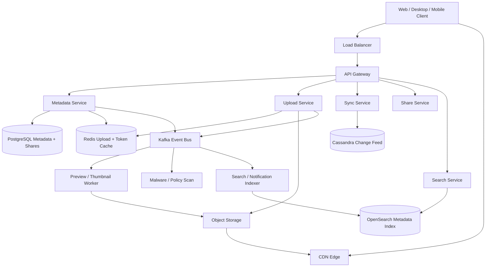
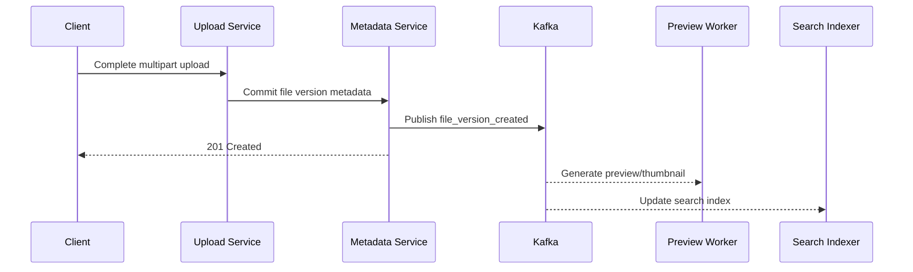
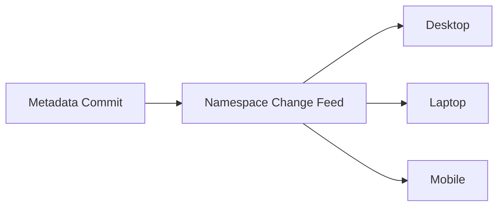
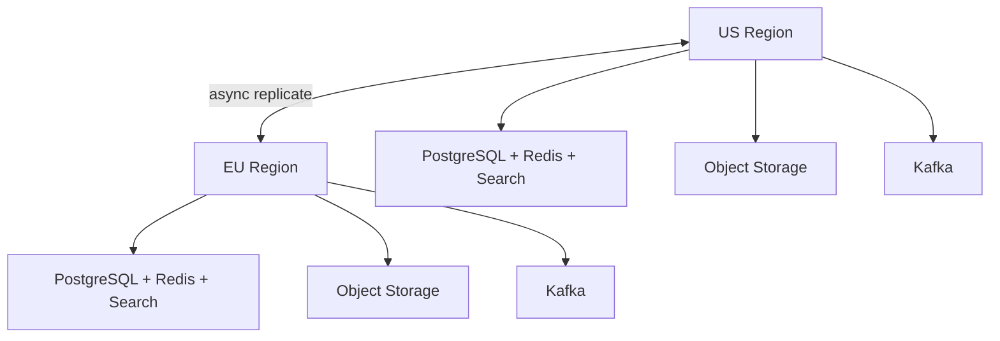

# Design File Sharing System

Dropbox- or Google Drive-style file sharing is a classic system design interview problem because it combines a read-heavy metadata and download platform with a durability-critical **upload, versioning, and cross-device sync pipeline**. Users expect uploads to resume, shared links to work instantly, recent changes to appear across devices quickly, and file history to survive crashes, retries, and regional outages.

The surface looks simple: upload a file, share a link, and access it from another device. The depth lies in chunked uploads, metadata correctness, folder permissions, conflict handling, sync feeds, hot shared links, large-file delivery, and deciding which operations need strong consistency versus eventual background propagation.

---

## Functional Requirements

**In Scope:**
- Users can create folders, upload files, rename, move, and delete them
- Users can download files and request byte ranges for large objects
- Users can share files or folders with other users or via time-limited links
- The system maintains file version history and allows restoring an older version
- Multiple user devices can sync changes using a cursor-based change feed
- Uploads are resumable for large files and unstable networks
- Users can search files by name and path metadata
- The platform generates previews and thumbnails asynchronously for supported file types

**Out of Scope:**
- Live collaborative document editing internals
- Virus-scanning model details and malware classification internals
- Desktop filesystem driver implementation details
- Enterprise DLP, legal hold, and retention policy engines
- Full backup-product semantics for entire machines

---

## Non-Functional Requirements

| Property | Target | Reasoning |
|---|---|---|
| **Metadata Latency** | p99 < 150ms for common reads/writes | Folder listing, rename, move, and share actions must feel immediate |
| **Download Start Latency** | p99 < 200ms to issue signed URL or stream headers | Users should begin large downloads quickly even if transfer takes longer |
| **Sync Freshness** | Most devices see committed changes within 2-5s | Cross-device consistency is a core product expectation |
| **Availability** | 99.99% for metadata and download flows | File access is often business-critical |
| **Durability** | No loss of acknowledged file versions or metadata mutations | Users assume uploaded data is safe once accepted |
| **Consistency** | Strong for metadata, permissions, and version creation; eventual for search, previews, and notifications | A slightly stale search result is acceptable; duplicate versions or broken ACLs are not |
| **Scale** | 100M+ users, billions of files, PB to EB-class storage growth | The storage and metadata planes scale very differently |

**Key tradeoff:** the system prioritizes **durable versioned storage over perfectly fresh secondary views everywhere**. A preview appearing a little later is acceptable. Losing an acknowledged upload or serving the wrong permission state is not.

---

## Capacity Estimation

**User and file scale:**
- Assume **100M monthly active users** and **20M daily active users**
- If each user stores 100 files on average, the system already manages **10B files**
- Teams, backups, media assets, and version history push real file-version count much higher than logical file count

**Upload and download traffic:**
- Assume **1B uploads/day** across all sizes, from tiny documents to multi-GB videos
- Average file size is highly skewed; many small files exist, but a small share of large media files dominates bytes stored and transferred
- Peak upload QPS can exceed **50K/sec**, while download/QPS is often much higher because one popular shared file may be downloaded many times

**Storage:**
- Logical file bytes can quickly reach **tens of PB** and continue growing with versions, previews, and replication
- The metadata footprint is much smaller than blob storage, but metadata correctness dictates most user-visible behavior

**Sync traffic:**
- Multi-device users and shared folders create continuous sync polling or streaming traffic
- Change feeds are usually tiny compared with blobs, but they are latency-sensitive and high fanout for shared namespaces

---

## Core Entities

| Entity | Purpose | Key Fields | Relationships |
|---|---|---|---|
| **User** | Account identity and owner of content | `user_id`, `email`, `display_name`, `created_at` | owns namespaces, files, and shares |
| **Namespace** | Logical root for personal or team storage | `namespace_id`, `owner_user_id`, `type`, `created_at` | contains folders, files, and change feeds |
| **Folder** | Hierarchical organization unit | `folder_id`, `namespace_id`, `parent_folder_id`, `name`, `updated_at` | contains files and child folders |
| **File** | Stable logical file identity | `file_id`, `namespace_id`, `parent_folder_id`, `name`, `latest_version_id`, `updated_at` | has many file versions |
| **FileVersion** | Immutable uploaded content version | `version_id`, `file_id`, `size_bytes`, `content_hash`, `object_key`, `created_at` | belongs to one file |
| **ShareGrant** | Access control edge or share link | `share_id`, `target_type`, `target_id`, `principal_id`, `role`, `expires_at` | grants access to users or link tokens |
| **UploadSession** | Resumable upload state | `upload_id`, `namespace_id`, `target_folder_id`, `expected_size`, `state`, `created_at` | collects parts before commit |
| **NamespaceChange** | Ordered sync event | `change_seq`, `namespace_id`, `entity_type`, `entity_id`, `change_type`, `created_at` | drives device catch-up and shared-folder sync |

**Critical modeling decisions:**
- `File` is the stable user-facing identity, while `FileVersion` is immutable content. Renaming a file should not rewrite historical versions.
- `NamespaceChange` is an ordered sync feed for one namespace. Devices sync off that feed rather than scanning folder trees repeatedly.
- `UploadSession` is mutable and short-lived, so it should not be treated like durable canonical file metadata.

---

## Databases and Database Design

### Storage Tier Decisions

| Data | Access Pattern | Engine | Why |
|---|---|---|---|
| Users, namespaces, folders, files, versions, share grants | transactional writes, exact lookups, strong consistency | **PostgreSQL** | metadata correctness and permission changes need ACID guarantees |
| Sync change log | append-heavy writes, ordered reads by namespace | **Cassandra / ScyllaDB** | efficient high-volume timeline reads for device catch-up |
| Upload sessions, hot folder caches, signed-download tokens, rate limits | sub-millisecond reads/writes, TTLs, hot keys | **Redis** | ideal for resumable upload state and ephemeral access metadata |
| Blob contents, thumbnails, previews | immutable large objects, read-heavy | **Object Storage + CDN** | scalable and cost-effective for file bytes |
| File search index | metadata search by name/path and filters | **OpenSearch / Elasticsearch** | ideal for text and path-prefix queries |
| Preview generation, indexing, notifications, audit streams | durable append-only stream | **Kafka** | decouples metadata commit from background consumers |

This is intentionally polyglot. File sharing has at least four distinct workloads: **transactionally correct metadata**, **append-only sync feeds**, **ephemeral upload state**, and **massive blob storage**.

### Schema 1 - Namespaces, Folders, and Files (PostgreSQL)

```sql
CREATE TABLE namespaces (
  namespace_id         UUID PRIMARY KEY DEFAULT gen_random_uuid(),
  owner_user_id        UUID NOT NULL,
  type                 VARCHAR(16) NOT NULL,
  created_at           TIMESTAMPTZ DEFAULT NOW()
);

CREATE TABLE folders (
  folder_id            UUID PRIMARY KEY DEFAULT gen_random_uuid(),
  namespace_id         UUID NOT NULL REFERENCES namespaces(namespace_id),
  parent_folder_id     UUID REFERENCES folders(folder_id),
  name                 TEXT NOT NULL,
  updated_at           TIMESTAMPTZ DEFAULT NOW()
);

CREATE TABLE files (
  file_id              UUID PRIMARY KEY DEFAULT gen_random_uuid(),
  namespace_id         UUID NOT NULL REFERENCES namespaces(namespace_id),
  parent_folder_id     UUID REFERENCES folders(folder_id),
  name                 TEXT NOT NULL,
  latest_version_id    UUID,
  deleted_at           TIMESTAMPTZ,
  updated_at           TIMESTAMPTZ DEFAULT NOW()
);

CREATE INDEX idx_files_folder_name
  ON files (parent_folder_id, name);
```

### Schema 2 - File Versions (PostgreSQL)

```sql
CREATE TABLE file_versions (
  version_id           UUID PRIMARY KEY DEFAULT gen_random_uuid(),
  file_id              UUID NOT NULL REFERENCES files(file_id),
  size_bytes           BIGINT NOT NULL,
  content_hash         CHAR(64) NOT NULL,
  object_key           TEXT NOT NULL,
  created_by           UUID NOT NULL,
  created_at           TIMESTAMPTZ DEFAULT NOW()
);

CREATE INDEX idx_file_versions_file_created
  ON file_versions (file_id, created_at DESC);
```

### Schema 3 - Share Grants (PostgreSQL)

```sql
CREATE TABLE share_grants (
  share_id              UUID PRIMARY KEY DEFAULT gen_random_uuid(),
  target_type           VARCHAR(16) NOT NULL,
  target_id             UUID NOT NULL,
  principal_id          UUID,
  role                  VARCHAR(16) NOT NULL,
  link_token_hash       CHAR(64),
  expires_at            TIMESTAMPTZ,
  created_at            TIMESTAMPTZ DEFAULT NOW()
);

CREATE INDEX idx_share_grants_target
  ON share_grants (target_type, target_id);
```

### Schema 4 - Namespace Change Feed (Cassandra)

```sql
CREATE TABLE namespace_changes (
  namespace_id         UUID,
  bucket_day           TEXT,
  change_seq           BIGINT,
  entity_type          TEXT,
  entity_id            UUID,
  change_type          TEXT,
  payload_json         TEXT,
  PRIMARY KEY ((namespace_id, bucket_day), change_seq)
) WITH CLUSTERING ORDER BY (change_seq ASC);
```

Day buckets prevent one very active namespace from producing an unbounded partition while preserving ordered change replay.

### Schema 5 - Upload Session State (Logical / Redis)

```json
{
  "key": "upload:upl_456",
  "namespace_id": "ns_123",
  "target_folder_id": "fld_root",
  "expected_size": 524288000,
  "parts_received": [1, 2, 3],
  "multipart_upload_id": "s3_upload_xyz",
  "expires_in": 86400
}
```

Upload state changes frequently and expires naturally, so it belongs in Redis rather than the primary metadata store.

### Schema 6 - Search Document (Logical)

```json
{
  "file_id": "file_789",
  "namespace_id": "ns_123",
  "path": "/team/designs/logo.png",
  "name": "logo.png",
  "mime_type": "image/png",
  "size_bytes": 1258291,
  "updated_at": "2026-06-03T10:00:00Z"
}
```

The search document is denormalized deliberately so metadata search does not require transactional joins on the critical path.

### Sharding and Replication Strategy

| Store | Shard Key | Strategy | Replication |
|---|---|---|---|
| Metadata (PostgreSQL) | `namespace_id` or `file_id` | logical hash sharding after single-cluster growth | primary + read replicas |
| Change Feed (Cassandra) | `(namespace_id, bucket_day)` | consistent hashing across Cassandra nodes | RF=3, `LOCAL_QUORUM` writes |
| Redis | `upload_id`, `namespace_id`, `token_id` | Redis Cluster | 1 replica per master |
| Search Index | namespace/path shard ranges | shard and replica fanout | 2-3 serving replicas |
| Kafka | `namespace_id` or `file_id` | partitioned durable log | RF=3 |
| Blob Storage | `object_key` namespace | object-store replication | multi-AZ or multi-region replicated |

**Consistency model:**
- Strong consistency for metadata, permissions, version creation, and rename/move/delete operations
- Eventual consistency for previews, search indexing, notifications, and audit-derived views

**Read/write patterns:**
- **Upload path:** create upload session -> direct multipart upload to object storage -> commit metadata transaction -> publish background events
- **Download path:** metadata authorization -> signed URL or proxied range start -> CDN/object storage serves bytes
- **Sync path:** device calls change feed with last cursor -> receives ordered namespace changes -> updates local state incrementally

---

## API Design

**List folder contents:**
```http
GET /v1/namespaces/ns_123/folders/fld_root/items?cursor=eyJuYW1lIjoibG9nby5wbmcifQ==&limit=50

200 OK
{
  "items": [
    {
      "type": "file",
      "file_id": "file_789",
      "name": "logo.png",
      "size_bytes": 1258291,
      "updated_at": "2026-06-03T10:00:00Z"
    }
  ],
  "next_cursor": "eyJuYW1lIjoibm90ZXMudHh0In0=",
  "has_more": true
}
```

> Cursor-based pagination on stable folder ordering. Offset pagination (`?page=N`) becomes expensive and unstable for deep folders and continuously mutating namespaces.

**Initiate resumable upload:**
```http
POST /v1/uploads
Authorization: Bearer <jwt>

{
  "namespace_id": "ns_123",
  "parent_folder_id": "fld_root",
  "file_name": "video-demo.mp4",
  "size_bytes": 524288000,
  "content_type": "video/mp4"
}

201 Created
{
  "upload_id": "upl_456",
  "part_size_bytes": 8388608,
  "multipart_upload_id": "s3_upload_xyz"
}
```

**Complete upload and create a file version:**
```http
POST /v1/uploads/upl_456/complete
Authorization: Bearer <jwt>
Idempotency-Key: upload-6d7f-001

{
  "parts": [
    { "part_number": 1, "etag": "etag1" },
    { "part_number": 2, "etag": "etag2" }
  ],
  "content_hash": "sha256:abc123"
}

201 Created
{
  "file_id": "file_789",
  "version_id": "ver_4",
  "state": "committed"
}
```

**Download a file version:**
```http
GET /v1/files/file_789/versions/ver_4/download
Authorization: Bearer <jwt>

200 OK
{
  "download_url": "https://cdn.files.example/o/ns_123/file_789/ver_4?sig=...",
  "expires_in": 300
}
```

**Share a file or folder:**
```http
POST /v1/shares
Authorization: Bearer <jwt>

{
  "target_type": "folder",
  "target_id": "fld_root",
  "principal_id": "user_999",
  "role": "viewer"
}

201 Created
{
  "share_id": "shr_123",
  "role": "viewer"
}
```

**Sync changes since a cursor:**
```http
GET /v1/namespaces/ns_123/changes?after_seq=1042&limit=200
Authorization: Bearer <jwt>

200 OK
{
  "changes": [
    {
      "change_seq": 1043,
      "entity_type": "file",
      "entity_id": "file_789",
      "change_type": "version_created"
    }
  ],
  "next_after_seq": 1043,
  "has_more": false
}
```

**Change notification stream (SSE):**
```http
GET /v1/namespaces/ns_123/stream
Authorization: Bearer <jwt>
Accept: text/event-stream
```
Core file upload and download stay request-response. SSE or long polling is useful for low-latency sync hints, but devices should still recover from a durable cursor-based change feed rather than relying only on realtime push.

---

## High-Level Design



**Component responsibilities:**

| Component | Role |
|---|---|
| **API Gateway** | Auth, routing, rate limiting, and request termination |
| **Metadata Service** | File, folder, namespace, share, and version metadata management |
| **Upload Service** | Resumable upload session creation, part tracking, and final commit coordination |
| **Sync Service** | Serves ordered namespace change feeds and realtime sync hints |
| **Share Service** | Share-link creation, ACL checks, and permission evaluation |
| **Search Service** | Metadata search by file name, path, and namespace scope |
| **Redis** | Upload sessions, hot folder caches, signed-token cache, and rate-limit state |
| **Kafka** | Durable backbone for previews, scanning, notifications, indexing, and audit streams |
| **Object Storage + CDN** | Serves file blobs, thumbnails, previews, and range downloads |
| **Cassandra Change Feed** | Durable ordered sync timeline per namespace |

**Upload and sync flow:**
1. Client -> `POST /v1/uploads` -> Upload Service creates a resumable upload session and returns multipart parameters
2. Client uploads file parts directly to object storage, then calls `POST /complete`
3. Metadata Service commits the new file version transactionally, updates `latest_version_id`, and writes a namespace change event
4. Kafka fanout triggers preview generation, search indexing, notifications, and policy scans asynchronously
5. Other devices call the sync feed or receive SSE hints, then apply the ordered namespace changes locally

---

## Deep Dives

### 1. Kafka: Required for Background Work, Not for Blob Bytes

Kafka is useful in a file-sharing system, but not for transporting file bytes. Upload and download data should flow directly between clients and object storage or CDN as much as possible. Kafka is required because one committed file version has many downstream side effects: preview generation, search indexing, notifications, auditing, retention workflows, and malware scanning.

If the upload commit path synchronously waited for every downstream consumer before acknowledging success, user-visible upload latency would become fragile immediately.



**Why the problem happens:** one upload completion affects many derived systems beyond the primary metadata transaction.

**Why it becomes difficult at scale:**
- large ingest bursts create preview and indexing backlogs
- different consumers have very different SLAs and retry semantics
- replay matters after incidents because many downstream views are derived, not canonical

**Production-grade solutions:**
- use topics such as `file.version_created`, `file.deleted`, and `share.updated`
- keep messages small: IDs, hashes, object keys, namespace IDs, and versions, not file bytes
- prioritize security scanning and indexing consumers over low-priority analytics when lag grows
- retain Kafka long enough to replay derived pipelines after outages

**Tradeoffs:** Kafka adds operational cost and eventual consistency for secondary views, but it keeps metadata commit fast and reliable.

### 2. Redis: Resumable Uploads, Hot Metadata, and Access Tokens

Redis is required because file sharing has a large amount of short-lived state that should not burden the primary metadata database.

| Redis Use | Example Key | Why Redis Fits |
|---|---|---|
| **Upload session state** | `upload:upl_456` | multipart upload progress is mutable and TTL-driven |
| **Hot folder cache** | `folder:fld_root:list:v42` | repeated folder opens should not always hit PostgreSQL |
| **Signed-download token cache** | `dl:token_abc` | short-lived access checks need fast lookups |
| **Rate limiting** | `rl:user:{user_id}:upload_init` | protects expensive upload and search paths |

**Why the problem happens:** upload coordination, recent folder views, and secure access tokens are all high-churn, low-latency workloads.

**Why it becomes difficult at scale:**
- very active team folders become hot metadata keys
- abandoned upload sessions need automatic cleanup
- shared links can create sudden bursts of access-token validation traffic

**Production-grade solutions:**
- keep resumable-upload manifests and TTL-driven upload state in Redis
- cache only hot folder listings and metadata summaries, not every long-tail tree walk
- version cache keys by folder or namespace metadata generation when practical
- coalesce misses and keep token TTLs short to reduce abuse impact

**Tradeoffs:** Redis dramatically improves latency, but it introduces staleness windows that are acceptable for caches, not for canonical permissions.

### 3. Chunked Uploads, Content Hashing, and Deduplication

Large uploads and flaky networks make chunking mandatory. A user uploading a 5 GB video should not restart from byte zero after a transient disconnect.

Content hashing also matters because duplicate bytes are common across versions, shared files, and repeated uploads.

**Why the problem happens:** networks fail, files are large, and users retry often.

**Why it becomes difficult at scale:**
- multipart upload state has to survive client reconnects
- duplicate retries can create duplicate committed versions without careful idempotency
- naive full-file dedup or block dedup increases metadata complexity and GC pressure

**Production-grade solutions:**
- use direct multipart upload to object storage with resumable part tracking
- require idempotent completion using an `Idempotency-Key` plus content hash
- store immutable version metadata only after the object store confirms completion
- start with whole-file dedup by content hash, then move to block-level dedup only if product economics justify the extra complexity

**Tradeoffs:** chunked upload and content hashing improve reliability and cost, but block-level dedup adds complexity in reference counting, garbage collection, and hot metadata paths.

### 4. Sync Feeds, Ordering, and Conflict Handling

Cross-device sync is a control-plane problem, not a blob-transfer problem. Devices need a durable, ordered description of metadata changes so they can converge without repeatedly scanning every folder.

The key difficulty is ordering. Rename, move, delete, share, and version-creation operations can happen across multiple devices and shared users in quick succession.



**Why the problem happens:** users expect all devices to converge on the same logical namespace quickly and deterministically.

**Why it becomes difficult at scale:**
- shared namespaces fan changes out to many devices and users
- devices reconnect after being offline and may miss long spans of changes
- concurrent edits to metadata can produce user-visible conflicts if not modeled carefully

**Production-grade solutions:**
- assign an ordered `change_seq` per namespace or shard so devices can catch up incrementally
- keep rename/move/delete/version-create operations transactional with their emitted change event
- use last-writer-wins only for clearly safe metadata fields; for conflicting uploads create sibling versions or conflict copies when necessary
- let realtime hints improve freshness, but rely on the durable cursor feed for correctness

**Tradeoffs:** explicit sync feeds make convergence tractable, but they require careful cursor design, retention, and backfill behavior.

### 5. WebSockets, SSE, and Offline Devices

Core file sharing does not require WebSockets for correctness. Upload, download, folder listing, and share management fit standard request-response APIs. Devices can sync accurately with periodic polling against a durable cursor feed.

But low-latency sync feels better with push hints. SSE, long polling, or lightweight WebSocket notifications can wake clients when a namespace changes.

**Why the problem happens:** users want fast propagation across devices, but clients are often offline or backgrounded.

**Why it becomes difficult at scale:**
- many devices are idle most of the time, so permanent connections can be wasteful
- reconnect storms happen after network loss or app restarts
- a push-only design breaks down when a client misses events during disconnects

**Production-grade solutions:**
- keep correctness on the durable change-feed API
- use SSE or long polling for low-latency change hints where product value justifies it
- reconnect with the last known cursor rather than trusting volatile push delivery
- keep offline sync bounded and resumable instead of assuming permanent connectivity

**Tradeoffs:** push improves freshness, but the durable cursor feed is what preserves correctness and recoverability.

### 6. Hot Shared Links, Viral Files, and Download Fanout

Most files are private or lightly used. A few shared links become extremely hot, especially for public downloads, marketing assets, or classroom materials.

**Why the problem happens:** one shared file can suddenly receive global download traffic far above normal user behavior.

**Why it becomes difficult at scale:**
- repeated authorization checks can pound metadata services
- range requests for large media create complex access patterns
- popular files can saturate origin bandwidth if CDN strategy is weak

**Production-grade solutions:**
- serve bytes from CDN and object storage directly, not from metadata servers
- cache access decisions or use short-lived signed URLs so the control plane is not hit for every byte range
- support HTTP range requests natively for large files and media seeking
- isolate public-link traffic from authenticated metadata paths when possible

**Tradeoffs:** aggressive CDN use makes downloads cheap and fast, but it requires careful signed-URL design and cache invalidation on permission changes.

### 7. Multi-Region Replication, Durability, and Recovery

File sharing is global, but metadata correctness still matters more than globally perfect freshness for every derived subsystem. Upload bytes, metadata, and change feeds should survive regional failures without making every request synchronous across the planet.



**Why the problem happens:** users upload from everywhere, expect low latency, and still need disaster recovery.

**Why it becomes difficult at scale:**
- synchronously coordinating every metadata change across regions hurts latency
- blob replication, search indexing, and preview generation all complete at different speeds
- a region failure during upload or version commit can leave incomplete or orphaned state without careful fencing

**Production-grade solutions:**
- make the metadata commit authoritative in one region or shard owner, then replicate asynchronously to secondary regions
- keep upload completion idempotent so retries after failover do not create duplicate versions
- replicate blobs across storage classes or regions based on durability objectives
- accept short-lived cross-region freshness lag for previews and search while preserving strong correctness for committed metadata in the owning shard

**Tradeoffs:** asynchronous replication is cheaper and faster than global serial writes, but it requires explicit recovery workflows and consistency boundaries.

### 8. Architecture Evolution

| Stage | Design | Why It Breaks | Next Step |
|---|---|---|---|
| **1. MVP** | Single metadata DB, simple object store, no resumable uploads | large files, retries, and sync latency become painful quickly | add multipart uploads and ordered change feeds |
| **2. Growth** | Separate metadata, object storage, Redis upload state, and search | previews, notifications, and indexing couple too tightly to the hot path | introduce Kafka background pipelines |
| **3. Scale** | Dedicated sync feed, CDN-backed download path, sharded metadata | hot shared links and huge namespaces create hotspots | add stronger caching, namespace partitioning, and hot-link isolation |
| **4. Global** | Multi-region metadata replicas and replicated object storage | exact global freshness becomes too expensive | keep strong consistency only for canonical metadata writes |

This is the interview pattern to emphasize: keep file bytes off the control plane, keep metadata and version creation correct, and let search, previews, and notifications evolve asynchronously around the durable core.
