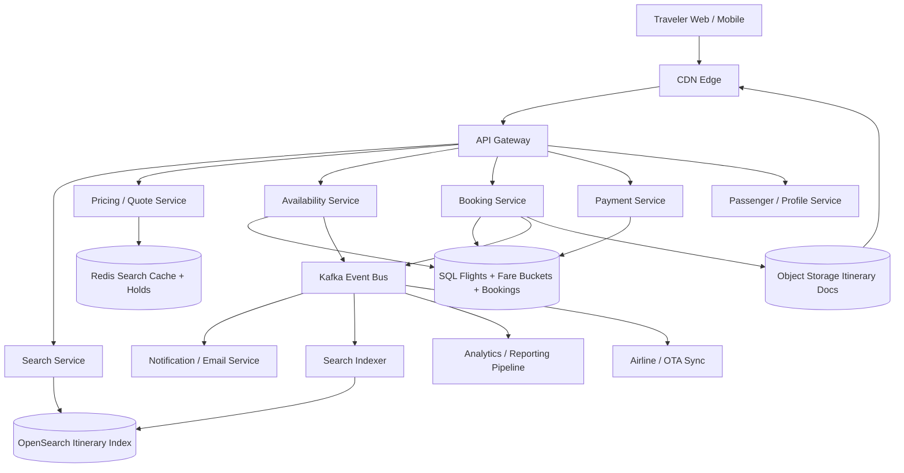
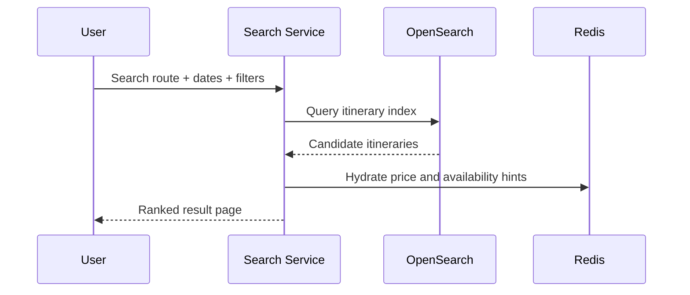
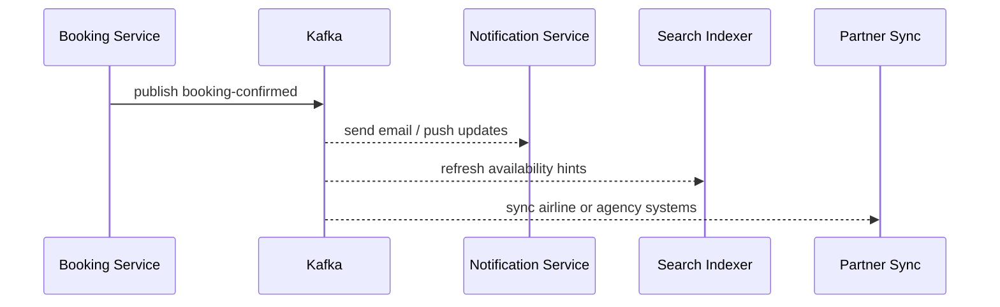
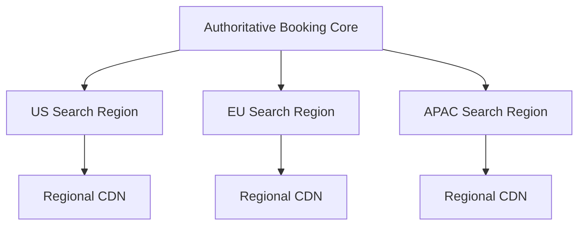

# Design Flight Booking System

Designing a flight booking system is a classic system design interview problem because it combines a search-heavy marketplace with correctness-critical inventory and payment workflows. Travelers expect fast search by origin, destination, dates, price, and airline. Airlines and OTAs expect inventory, fare buckets, schedules, taxes, and booking status to stay consistent across concurrent requests. The difficult part is that search wants broad caching and denormalized indexes, while booking must prevent overselling the same seat inventory or fare bucket under contention.

At a high level, the system has two very different workloads. The first is the **search and browse path**, where users search routes, compare itineraries, inspect fare rules, and browse many results quickly. The second is the **booking path**, where the system must validate current inventory, create a short-lived hold, authorize payment, commit a reservation, and notify downstream systems. A good design keeps the search path cache-heavy and approximate, while making the booking path strongly consistent at the flight-instance and fare-bucket level.

---

## Functional Requirements

**In Scope:**
- Users can search one-way and round-trip itineraries by origin, destination, dates, passengers, and cabin class
- The platform supports direct and connecting itineraries with fare and schedule details
- Users can inspect flight details, baggage rules, fare conditions, and price breakdowns
- The system can create a short-lived reservation hold before payment completion
- Users can confirm a booking and receive a durable PNR or booking reference
- The platform stores passengers, payments, cancellations, and booking-status updates
- Operators can inspect flight availability, booking failures, payment callback lag, and hot-route pressure
- The system supports schedule and price updates from airline inventory feeds or internal admin tools

**Out of Scope:**
- Airport check-in and boarding-pass generation internals
- Loyalty-program calculation and partner redemptions
- Full airline operations such as crew scheduling or aircraft maintenance
- Detailed fraud modeling and manual chargeback workflows
- Revenue-management model internals for dynamic yield optimization

---

## Non-Functional Requirements

| Property | Target | Reasoning |
|---|---|---|
| **Search Latency** | p99 < 300ms for route and date searches | users refine searches repeatedly and abandon slow travel flows quickly |
| **Price Quote Freshness** | inventory and fare validation within seconds | stale fare or availability data directly causes booking frustration |
| **Booking Commit Latency** | p99 < 500ms before external payment-provider round-trips | booking intent should feel reliable and deterministic |
| **Inventory Correctness** | never confirm more seats in a fare bucket than the airline exposes | overselling flight inventory destroys trust and creates expensive recovery work |
| **Durability** | no loss of confirmed bookings, holds, or payment callbacks | travel bookings are money- and schedule-critical |
| **Availability** | 99.99% for search and browse; 99.9% for booking writes | discovery must stay up broadly, but booking correctness matters more than absolute write uptime |
| **Scalability** | millions of search requests/day and large spikes around holidays or route launches | browse traffic dominates; hot routes create localized contention |
| **Isolation** | one hot route, airline, or agency partner should not degrade the entire platform | traffic skew is common in travel systems |

**Key tradeoff:** the platform prioritizes **fast search and cheap browse reads** while preserving **strong consistency for inventory holds and booking commits**. Search indexes and caches can lag slightly, but confirmed reservations cannot exceed authoritative seat inventory.

---

## Capacity Estimation

**Traffic assumptions:**
- Assume **50M search queries/day** across web, mobile, metasearch, and partner APIs
- That is about **580 searches/sec average**, but peaks during evenings, sales, or holiday periods can easily be **10x to 20x higher**
- Search amplification is high because users often change dates, sort orders, passenger count, and filters several times before booking

**Booking assumptions:**
- Assume **2M booking attempts/day** and a smaller subset of successful bookings
- Booking writes are much lower volume than searches, but each booking is more expensive because it needs fare validation, hold creation, payment authorization, and durable reservation state
- Hot routes can experience strong contention on a small number of flight instances and fare buckets

**Inventory assumptions:**
- Assume **200K active flight instances/day** across airlines and dates being sold
- Each flight instance may expose multiple fare buckets per cabin class, making the sellable inventory model more complex than a simple seat count
- Search often works off denormalized availability hints, but booking must validate against authoritative availability state

**Operational profile:**
- Public holidays, route sales, weather disruptions, and airline schedule changes create sudden localized spikes
- Price or schedule feed refreshes can fan out into search reindexing, cache invalidation, analytics, notifications, and partner sync work

---

## Core Entities

| Entity | Purpose | Key Fields | Relationships |
|---|---|---|---|
| **Airline** | Carrier definition | `airline_id`, `iata_code`, `name`, `status` | owns many flights |
| **Airport** | Searchable origin or destination | `airport_code`, `city_code`, `timezone`, `geo_point` | referenced by routes and flight instances |
| **FlightDefinition** | Recurring scheduled flight template | `flight_id`, `airline_id`, `flight_number`, `origin`, `destination`, `status` | generates many dated flight instances |
| **FlightInstance** | Sellable flight on a specific date | `instance_id`, `flight_id`, `departure_at`, `arrival_at`, `aircraft_type`, `status` | has inventory buckets and bookings |
| **FareBucket** | Bookable inventory and price band | `bucket_id`, `instance_id`, `cabin_class`, `fare_code`, `available_qty`, `price_cents` | belongs to one flight instance |
| **Itinerary** | One or more flight legs offered together | `itinerary_id`, `search_id`, `leg_ids`, `price_quote`, `expires_at` | may become a reservation hold |
| **ReservationHold** | Short-lived inventory hold during checkout | `hold_id`, `itinerary_id`, `user_id`, `expires_at`, `state` | becomes a booking or expires |
| **Booking / PNR** | Confirmed reservation | `booking_id`, `pnr_code`, `user_id`, `status`, `total_cents`, `created_at` | has passengers, payments, and itinerary legs |
| **Passenger** | Traveler identity attached to booking | `passenger_id`, `booking_id`, `full_name`, `dob`, `document_ref` | belongs to one booking |
| **PaymentTransaction** | Payment authorization or capture | `payment_id`, `booking_id`, `provider`, `amount_cents`, `status`, `provider_ref` | linked to one booking |

**Critical modeling decisions:**
- `FareBucket` rather than the raw seat map is often the booking unit for airline inventory. Booking correctness should validate against whatever the source-of-truth sellable inventory model actually is.
- `ReservationHold` is separate from `Booking`. This allows the system to protect inventory during payment authorization without permanently committing the sale first.
- `Itinerary` is usually a short-lived pricing artifact because fares and availability can change between search and purchase.

---

## Databases and Database Design

### Storage Tier Decisions

| Data | Access Pattern | Engine | Why |
|---|---|---|---|
| Airlines, airports, flights, instances, fare buckets, holds, bookings, payments | transactional writes, exact reads, inventory correctness | **PostgreSQL / MySQL** | the booking core needs ACID semantics and consistent updates |
| Flight and itinerary search | full-text, geo-aware airport search, faceting, time and price filtering | **OpenSearch** | search is denormalized and filter-heavy rather than highly transactional |
| Search cache, quote cache, short-lived holds, rate limits | sub-millisecond reads/writes, TTLs, hot-route keys | **Redis** | ideal for ephemeral state and repeated browse workloads |
| Booking timelines, notification history, partner callback logs | append-heavy writes, booking or airline scoped reads | **Cassandra / ScyllaDB** | useful for large, time-ordered operational histories |
| Booking events, schedule updates, search refresh, partner sync, analytics | durable append-only backbone | **Kafka** | decouples booking correctness from many asynchronous side effects |
| Ticket PDFs, itinerary exports, static assets | large immutable objects | **Object Storage + CDN** | keeps non-core binary assets off the application tier |

This is intentionally polyglot. A flight-booking platform needs **transactional inventory and bookings**, **denormalized search**, **ephemeral holds and cache state**, **durable downstream fanout**, and **cheap asset storage**. One storage engine does not serve all of those workloads efficiently.

### Schema 1 - Flights and Flight Instances (SQL)

```sql
CREATE TABLE flight_definitions (
  flight_id                UUID PRIMARY KEY DEFAULT gen_random_uuid(),
  airline_id               UUID NOT NULL,
  flight_number            VARCHAR(16) NOT NULL,
  origin_airport_code      CHAR(3) NOT NULL,
  destination_airport_code CHAR(3) NOT NULL,
  status                   VARCHAR(16) NOT NULL,
  created_at               TIMESTAMPTZ DEFAULT NOW()
);

CREATE TABLE flight_instances (
  instance_id              UUID PRIMARY KEY DEFAULT gen_random_uuid(),
  flight_id                UUID NOT NULL REFERENCES flight_definitions(flight_id),
  departure_at             TIMESTAMPTZ NOT NULL,
  arrival_at               TIMESTAMPTZ NOT NULL,
  aircraft_type            VARCHAR(32),
  status                   VARCHAR(16) NOT NULL,
  created_at               TIMESTAMPTZ DEFAULT NOW()
);

CREATE INDEX idx_flight_instances_route_time
  ON flight_instances (departure_at, status);
```

### Schema 2 - Fare Buckets and Availability (SQL)

```sql
CREATE TABLE fare_buckets (
  bucket_id                UUID PRIMARY KEY DEFAULT gen_random_uuid(),
  instance_id              UUID NOT NULL REFERENCES flight_instances(instance_id),
  cabin_class              VARCHAR(16) NOT NULL,
  fare_code                VARCHAR(16) NOT NULL,
  available_qty            INT NOT NULL,
  base_price_cents         BIGINT NOT NULL,
  currency                 VARCHAR(8) NOT NULL,
  updated_at               TIMESTAMPTZ DEFAULT NOW()
);

CREATE INDEX idx_fare_buckets_instance_cabin
  ON fare_buckets (instance_id, cabin_class, fare_code);
```

### Schema 3 - Holds and Bookings (SQL)

```sql
CREATE TABLE reservation_holds (
  hold_id                  UUID PRIMARY KEY DEFAULT gen_random_uuid(),
  user_id                  UUID NOT NULL,
  itinerary_hash           TEXT NOT NULL,
  total_cents              BIGINT NOT NULL,
  expires_at               TIMESTAMPTZ NOT NULL,
  state                    VARCHAR(16) NOT NULL,
  created_at               TIMESTAMPTZ DEFAULT NOW()
);

CREATE TABLE bookings (
  booking_id               UUID PRIMARY KEY DEFAULT gen_random_uuid(),
  pnr_code                 VARCHAR(12) NOT NULL UNIQUE,
  user_id                  UUID NOT NULL,
  hold_id                  UUID REFERENCES reservation_holds(hold_id),
  status                   VARCHAR(24) NOT NULL,
  total_cents              BIGINT NOT NULL,
  created_at               TIMESTAMPTZ DEFAULT NOW()
);
```

### Schema 4 - Booking Timeline (Cassandra)

```sql
CREATE TABLE booking_events_by_booking (
  booking_id               UUID,
  bucket_day               TEXT,
  created_at               TIMESTAMP,
  event_id                 UUID,
  event_type               TEXT,
  actor_type               TEXT,
  metadata_json            TEXT,
  PRIMARY KEY ((booking_id, bucket_day), created_at, event_id)
) WITH CLUSTERING ORDER BY (created_at DESC, event_id DESC);
```

Daily buckets keep very active booking histories bounded and replay-friendly.

### Schema 5 - Search Document (OpenSearch)

```json
{
  "itinerary_key": "SFO-JFK-2026-08-10-Y",
  "origin": "SFO",
  "destination": "JFK",
  "departure_date": "2026-08-10",
  "stops": 0,
  "airlines": ["UA"],
  "price_hint_cents": 28900,
  "availability_hint": true,
  "duration_minutes": 332
}
```

### Schema 6 - Hold Token (Logical Redis Record)

```json
{
  "key": "hold:itinerary:abc123:user_456",
  "value": {
    "hold_id": "hold_789",
    "expires_at": "2026-06-03T10:05:00Z",
    "status": "active"
  }
}
```

Short-lived hold tokens help the checkout path stay fast, but authoritative inventory must still live in the transactional store.

### Sharding and Replication Strategy

| Store | Shard Key | Strategy | Replication |
|---|---|---|---|
| SQL booking core | `instance_id` or `airline_id` with route-aware partitioning | many logical database shards as airline and route count grows | primary + replicas, tighter replication on booking-critical paths |
| OpenSearch | route, date, or market routing key | distributed search shards with replicas | multi-node replicated clusters |
| Redis | `search_key`, `instance_id`, `user_id` | Redis Cluster | 1 replica per master |
| Cassandra | `(booking_id, bucket_day)` or airline-scoped event keys | consistent hashing across nodes | RF=3, `LOCAL_QUORUM` |
| Kafka | `booking_id`, `instance_id`, or `airline_id` depending on topic | partitioned durable log | RF=3 |
| Object Storage | `booking_id` or `pnr_code` namespace | regional bucket + CDN | multi-AZ durable storage |

**Consistency model:**
- Strong consistency for fare-bucket updates, hold creation, booking confirmation, and payment-state transitions that affect sellable inventory
- Eventual consistency for search refresh, reporting, notification fanout, and partner sync
- Best-effort low-latency consistency for cached quotes and search-result hints

**Read/write patterns:**
- **Search path:** route/date query -> OpenSearch candidate retrieval -> cache or pricing-hint enrichment -> paginated itinerary cards
- **Booking path:** validate authoritative bucket inventory -> create short-lived hold -> authorize payment -> create booking -> decrement durable inventory -> publish events
- **Schedule update path:** airline feed update -> SQL commit -> Kafka event -> search reindex, cache invalidation, partner notifications, analytics

---

## API Design

**Search flights:**
```http
GET /v1/search/flights?origin=SFO&destination=JFK&departure_date=2026-08-10&return_date=2026-08-14&adults=1&cabin_class=economy&cursor=srch_100&limit=20

200 OK
{
  "itineraries": [
    {
      "itinerary_id": "itn_123",
      "price_hint_cents": 28900,
      "currency": "USD",
      "stops": 0,
      "airlines": ["UA"]
    }
  ],
  "next_cursor": "srch_101",
  "has_more": true
}
```

> Cursor-based pagination is preferred for itinerary search. Offset pagination (`?page=N`) becomes unstable and expensive for large, constantly changing route results.

**Get itinerary details and quote:**
```http
GET /v1/itineraries/itn_123

200 OK
{
  "itinerary_id": "itn_123",
  "segments": [
    {
      "flight_number": "UA123",
      "origin": "SFO",
      "destination": "JFK"
    }
  ],
  "fare_quote_cents": 28900,
  "quote_expires_at": "2026-06-03T10:05:00Z"
}
```

**Create a reservation hold:**
```http
POST /v1/reservation-holds
Authorization: Bearer <jwt>
Idempotency-Key: hold-001

{
  "itinerary_id": "itn_123",
  "passengers": [
    {
      "first_name": "Ava",
      "last_name": "Singh"
    }
  ]
}

201 Created
{
  "hold_id": "hold_789",
  "expires_at": "2026-06-03T10:05:00Z",
  "total_cents": 28900
}
```

**Confirm a booking:**
```http
POST /v1/bookings
Authorization: Bearer <jwt>
Idempotency-Key: booking-001

{
  "hold_id": "hold_789",
  "payment_method_id": "pm_555"
}

201 Created
{
  "booking_id": "bkg_999",
  "pnr_code": "Q7M2L9",
  "status": "confirmed"
}
```

**Handle payment authorization callback:**
```http
POST /v1/payments/provider-callback
Content-Type: application/json

{
  "provider": "stripe",
  "provider_ref": "pi_123",
  "booking_id": "bkg_999",
  "status": "authorized"
}

202 Accepted
```

**List bookings for a user:**
```http
GET /v1/users/me/bookings?before=2026-06-03T10:00:00Z&limit=20
Authorization: Bearer <jwt>

200 OK
{
  "bookings": [
    {
      "booking_id": "bkg_999",
      "pnr_code": "Q7M2L9",
      "status": "confirmed",
      "total_cents": 28900
    }
  ],
  "next_cursor": "2026-06-03T09:55:00Z",
  "has_more": true
}
```

**Booking status stream (optional SSE):**
```http
GET /v1/users/me/bookings/stream
Authorization: Bearer <jwt>
Accept: text/event-stream
```
Flight search and booking do not require WebSockets for the core product. SSE or polling is usually enough for booking-status updates, while most client behavior remains request-response plus asynchronous notifications.

---

## High-Level Design



**Component responsibilities:**

| Component | Role |
|---|---|
| **API Gateway** | Authentication, throttling, routing, and partner/client request validation |
| **Search Service** | Handles route, date, and filter search over a denormalized itinerary index |
| **Pricing / Quote Service** | Computes or validates displayed fares, taxes, and quote expirations |
| **Availability Service** | Validates current flight-instance and fare-bucket inventory and creates holds |
| **Booking Service** | Creates durable bookings, enforces idempotency, and advances booking state |
| **Payment Service** | Integrates with payment providers and processes callbacks |
| **Passenger / Profile Service** | Stores traveler details and reusable passenger metadata |
| **Redis** | Search cache, quote cache, hold tokens, and rate limits |
| **SQL Flights + Fare Buckets + Bookings** | Source of truth for schedules, inventory, holds, bookings, and payments |
| **Kafka** | Durable fanout for search refresh, notifications, analytics, and partner sync |
| **Search Indexer** | Rebuilds itinerary documents and availability hints for search |
| **Object Storage Itinerary Docs** | Stores itinerary exports and related binary assets |

**Search and booking flow:**
1. User searches routes and dates through Search Service backed by OpenSearch and cache-friendly quote hints
2. User opens itinerary details and receives a fresh price quote and rule summary
3. User starts booking; Availability Service validates authoritative fare buckets and creates a short-lived hold
4. Payment Service authorizes payment while the hold is active
5. Booking Service creates the durable PNR or booking record, decrements authoritative inventory, and stores payment state
6. Kafka publishes downstream events for notifications, search freshness, analytics, and airline or partner sync without slowing the booking commit path

---

## Deep Dives

### 1. Search: Route and Date Discovery Are Central

The first major problem in a flight-booking system is search. Users search by origin, destination, departure date, return date, number of passengers, stops, baggage, airline, and price. A normalized booking database is not the right place to answer that repeatedly at scale. Search needs a denormalized itinerary or segment index that can respond quickly to route and filter queries.



**Why the problem happens:** users explore many possibilities before booking and expect each refinement to be fast.

**Why it becomes difficult at scale:**
- route and date searches fan out across many flight instances and fare buckets
- prices and availability change frequently, so a fully exact live query is expensive
- market events and holidays create strong hot-route skew

**Production-grade solutions:**
- maintain a denormalized itinerary or segment search index keyed by route, date, and filterable attributes
- keep cached price and availability hints in Redis for hot queries
- treat search as approximate and revalidate exact price and inventory during hold creation
- separate search ranking from booking correctness so the browse path remains fast even under large catalogs

**Tradeoffs:** fast search improves conversion, but it accepts short windows where displayed itineraries are no longer truly bookable at the shown fare.

### 2. Inventory Correctness: Holds and Fare Buckets Matter Most

The hardest correctness problem is preventing oversell. Airlines often expose availability by fare bucket rather than by exact seat map to the booking system. Multiple users can attempt the same itinerary and fare simultaneously. If the platform confirms more inventory than exists, the aftermath is expensive and user-hostile.


**Why the problem happens:** inventory is scarce, time-bound, and often contested heavily on popular flights.

**Why it becomes difficult at scale:**
- multiple passengers and multi-leg itineraries multiply contention points
- payment authorization creates a time gap between user intent and final booking confirmation
- airline-side updates can race with OTA-side booking requests

**Production-grade solutions:**
- validate inventory against authoritative fare-bucket state in the transactional store
- create short-lived holds instead of long database transactions during payment processing
- make booking confirmation idempotent so callback or client retries do not create duplicate PNRs
- serialize or carefully partition inventory writes by `instance_id` or `bucket_id`

**Tradeoffs:** holds reduce oversell risk, but they add expiration complexity and can temporarily hide inventory from other users when payment later fails.

### 3. Kafka: Valuable for Side Effects, Not for Booking Decisions

Kafka is extremely useful in a flight-booking system, but it should not decide whether a booking exists. That decision belongs in the transactional booking core. Kafka becomes valuable immediately after commit for notifications, search refresh, partner sync, analytics, refund workflows, and operational reporting.



**Why the problem happens:** one booking creates many downstream side effects with different SLAs.

**Why it becomes difficult at scale:**
- external systems such as airline feeds or partner callbacks can be slow or flaky
- booking spikes often coincide with search spikes and marketing events
- replay matters after bugs, outages, or schema evolution in derived systems

**Production-grade solutions:**
- publish immutable booking and schedule-change events only after the core SQL commit succeeds
- partition Kafka by `booking_id`, `instance_id`, or `airline_id` depending on downstream ordering needs
- keep search indexing, analytics, and partner notifications off the critical booking path
- support replay and dead-letter handling for unstable external consumers

**Tradeoffs:** Kafka improves resilience and decoupling, but it must remain downstream of authoritative booking truth rather than inserted into the decision path.

### 4. Redis: Search Cache, Quote Cache, and Holds

Redis is especially useful in travel systems because many hot reads are naturally ephemeral: popular search results, cached quotes, short-lived booking holds, and rate limits. But Redis should not be the durable source of record for flight availability or bookings.

| Redis Use | Example Key | Why Redis Fits |
|---|---|---|
| **Search cache** | `search:SFO:JFK:2026-08-10:economy:v3` | route and date queries repeat heavily |
| **Quote cache** | `quote:itn_123` | avoids recomputing short-lived taxes and fare summaries repeatedly |
| **Hold token** | `hold:itinerary:abc123:user_456` | checkout holds need strict TTL-based expiration |
| **Rate limiting** | `rl:user:usr_456:booking` | protects hot-booking flows and partner APIs |

**Why the problem happens:** browse traffic is read-heavy and many pieces of state are naturally short-lived.

**Why it becomes difficult at scale:**
- hot routes and sales create concentrated cache pressure
- stale quote or availability hints can mislead users if treated as authoritative
- leaked holds can strand inventory temporarily if not expired correctly

**Production-grade solutions:**
- use Redis only for acceleration and ephemeral holds, never as the sole inventory truth
- keep TTLs short and always revalidate against SQL during booking confirmation
- cache only coarse search or quote surfaces, not final booking decisions
- shard or isolate hot-market keys when route-specific pressure grows large

**Tradeoffs:** Redis lowers browse latency substantially, but it adds invalidation complexity and must be paired with authoritative revalidation.

### 5. Price Quotes, Taxes, and Fare Volatility

Flight search is not only about inventory; it is also about pricing. Taxes, fees, cabin rules, baggage, carrier-imposed surcharges, and itinerary changes can all change the total. Search wants to show a cheap fast answer, while booking wants an exact number that can survive payment authorization.

**Why the problem happens:** airfare pricing is volatile and often rule-heavy.

**Why it becomes difficult at scale:**
- quote computation depends on itinerary shape, passenger mix, taxes, and sometimes partner rules
- prices can change between search and checkout as fare buckets move
- users are extremely sensitive to last-minute price drift or hidden fees

**Production-grade solutions:**
- store coarse price hints in search documents for browsing and compute authoritative totals during hold creation
- stamp quotes with explicit expiry timestamps so the UX matches system guarantees
- separate fare-rule calculation from raw schedule search so caches remain effective
- log quote versions and mismatch causes for debugging and supplier reconciliation

**Tradeoffs:** exact pricing everywhere would slow search too much, so the system accepts short-lived quote windows and revalidation at booking time.

### 6. WebSockets: Usually Optional for Core Booking Flows

The core flight-booking experience does not require WebSockets. Search, quote retrieval, hold creation, booking, and payment callbacks all fit naturally into request-response APIs. Admin dashboards or booking-status updates may benefit from SSE, but the main system does not depend on bidirectional realtime sessions.

**Why the problem happens:** many products feel realtime to users even though their core flows are not socket-driven.

**Why it becomes difficult at scale:**
- persistent connections add statefulness and reconnect complexity without helping search or booking correctness much
- most reservation updates tolerate small delays through polling, push notifications, or SSE
- supplier and payment integrations are asynchronous anyway

**Production-grade solutions:**
- keep search and booking APIs stateless and cache-friendly
- use SSE or push notifications for booking-status updates when useful
- keep supplier integration and booking events on Kafka or webhooks rather than live sockets
- reserve WebSockets for separate realtime products if needed, not the default travel path

**Tradeoffs:** avoiding WebSockets simplifies scaling and mobile reliability, at the cost of slightly less immediate status updates in some secondary flows.

### 7. Hot Routes, Holiday Spikes, and Contention

Air travel demand is highly seasonal and route-local. One holiday weekend, flash sale, or weather disruption can make a small set of flights extremely hot. Those routes create search hotspots, quote churn, hold contention, and payment bursts at the same time.

**Why the problem happens:** travel demand clusters around dates, routes, and public events rather than spreading evenly.

**Why it becomes difficult at scale:**
- a few fare buckets can become the bottleneck even when global cluster utilization looks healthy
- booking retries during failures amplify pressure on exactly the already-hot inventory
- search caches, partner feeds, and notifications all spike around the same routes

**Production-grade solutions:**
- partition caches and inventory writes by flight instance or route so hotspots stay local
- apply per-route or per-partner throttles during sales or disruption periods
- pre-warm hot search caches and route documents ahead of known peaks
- monitor inventory contention, hold expiry rates, and booking retry storms as first-class SLOs

**Tradeoffs:** hotspot isolation improves resilience, but it adds operational complexity and may fragment capacity planning.

### 8. Multi-Region Serving and Authoritative Write Domains

Flight search should be global and low-latency, but booking correctness still needs a clear source of truth. That usually means globally distributed read planes and caches, with more tightly controlled authoritative write domains for inventory and booking commits.



**Why the problem happens:** travelers want local performance, but fare-bucket updates and bookings need coordinated writes.

**Why it becomes difficult at scale:**
- cross-region booking writes increase latency and failure coordination cost
- regional caches naturally lag behind supplier or inventory updates
- failover must avoid duplicate bookings or duplicate payment captures

**Production-grade solutions:**
- serve search and itinerary details from regional infrastructure close to users
- keep booking-critical writes in one authoritative domain per inventory shard or airline partition
- use idempotency keys and provider references to survive retries and regional failovers safely
- prioritize fast propagation of inventory and fare changes into regional search caches and indexes

**Tradeoffs:** full global strong consistency is too expensive for the browse path, so the system accepts read-side lag while keeping booking truth tightly controlled.

### 9. Architecture Evolution

| Stage | Design | Why It Breaks | Next Step |
|---|---|---|---|
| **1. MVP** | Single relational app with flights, search, and bookings together | search and price lookup quickly overwhelm the booking core | split search, add caches, and move side effects async |
| **2. Growth** | Separate search, booking, payment, and notification services | fare volatility, hold contention, and partner sync become bottlenecks | add Redis quotes and holds, Kafka fanout, and search indexing |
| **3. Scale** | Multi-cluster read plane with dedicated booking core and partner pipelines | hot routes and regional spikes stress shared caches and inventory shards | isolate hotspots, improve partitioning, and regionalize reads |
| **4. Mature Travel Platform** | Global search plane with strong booking core and robust partner integration | complexity shifts to operations, supplier reconciliation, and disruption handling | keep booking truth small and evolve search, analytics, and integrations independently |

This is the interview pattern to emphasize: keep search broad, indexed, and cached; keep booking correctness narrow and transactional; use Kafka for downstream fanout; and let Redis, OpenSearch, and regional caches scale the rest of the travel experience around that core.
