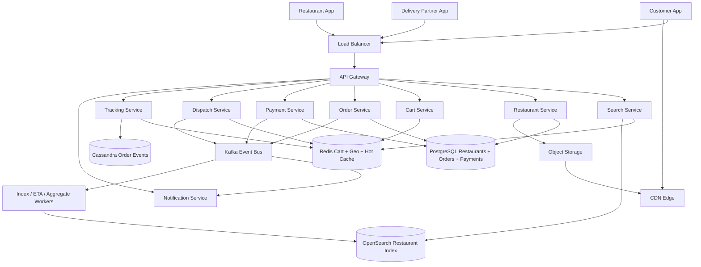
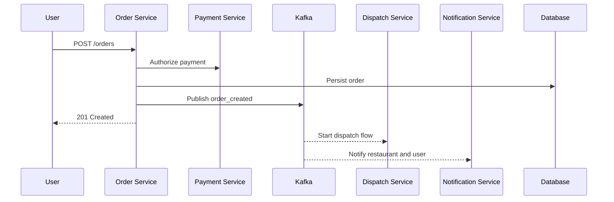
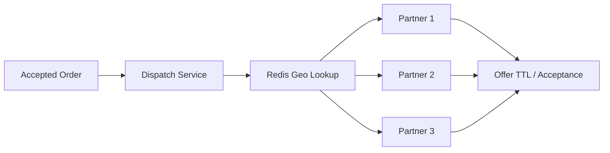
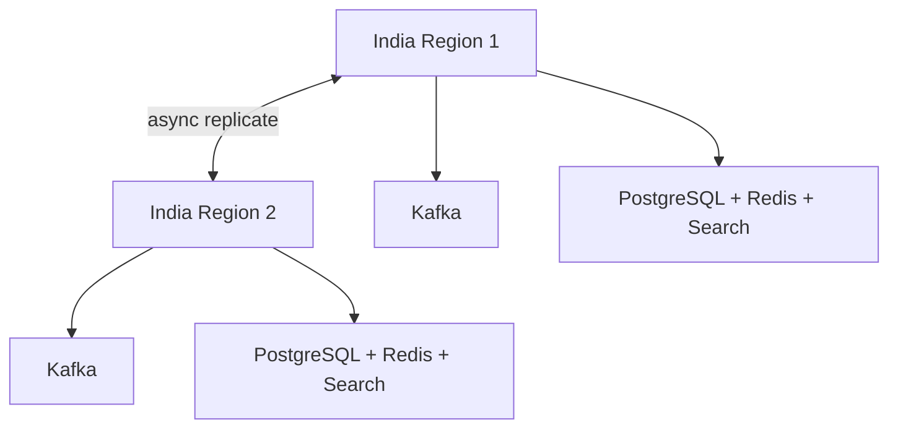

# Design Food Delivery / Swiggy / Zomato

Food delivery platforms like Swiggy and Zomato are strong system design interview problems because they combine a read-heavy **local marketplace** with a correctness-critical **ordering, payments, dispatch, and live-tracking pipeline**. Users expect restaurant discovery, menus, ETAs, coupons, checkout, and order tracking to feel instant, while the system must still avoid duplicate orders, bad assignments, and inconsistent payment state.

The surface looks simple: search for food, add items to cart, place an order, and track it. The depth lies in search freshness, cart correctness, idempotent order creation, partner dispatch fanout, real-time order state updates, and handling lunch/dinner spikes in a few dense cities without overloading the whole platform.

---

## Functional Requirements

**In Scope:**
- Users can search nearby restaurants by cuisine, dish, rating, price, and delivery ETA
- Users can view restaurant pages, menus, fees, offers, and availability
- Users can add items to cart, apply coupons, choose address, and place an order
- The system supports prepaid and cash-on-delivery orders
- Restaurants can accept or reject orders and update menu availability
- Delivery partners receive order offers, accept assignments, and send location heartbeats
- Users can track order status from placed -> accepted -> picked up -> delivered
- The system sends notifications for order state changes

**Out of Scope:**
- Grocery or dark-store quick commerce internals
- Ad ranking and sponsored restaurant placement
- Deep fraud-model training and abuse-detection internals
- Full warehouse, procurement, and restaurant POS integrations
- Autonomous route optimization and map-provider internals

---

## Non-Functional Requirements

| Property | Target | Reasoning |
|---|---|---|
| **Search Latency** | p99 < 200ms | Restaurant discovery is the top-of-funnel path and must feel immediate |
| **Order Placement Latency** | p99 < 2s excluding external bank latency | Checkout must feel fast without compromising correctness |
| **Tracking Update Latency** | < 2-3s for state and location refresh | Users and restaurants expect near-real-time visibility |
| **Availability** | 99.99% for search and order creation | Search and checkout outages directly hit revenue |
| **Durability** | No lost orders, payment records, or delivery state transitions | Duplicate or missing orders are unacceptable |
| **Consistency** | Strong for cart->order conversion, payment capture, and order state; eventual for search ranking, ETA, and restaurant popularity | Slight ETA drift is acceptable; double charging or duplicate orders is not |
| **Scale** | Tens of millions of users, millions of orders/day, large city spikes | Lunch, dinner, rain, and festival surges dominate architecture |

**Key tradeoff:** the platform prioritizes **order correctness over perfectly fresh derived views**. An ETA that is stale by a minute is acceptable. A duplicated order, inconsistent payment state, or lost dispatch assignment is not.

---

## Capacity Estimation

**Search and browse traffic:**
- Assume **20M DAU** and **100M restaurant/menu searches per day** -> ~1.2K/sec average
- Lunch, dinner, rain, and festival spikes can push search above **15K/sec**
- Autocomplete, restaurant page loads, and menu fetches add more read amplification than final orders suggest

**Order traffic:**
- Assume **10M orders/day** -> ~115/sec average
- Peak traffic is far from uniform and can exceed **1-2K order creates/sec** during concentrated meal windows
- Each order creates multiple downstream events: payment, restaurant notification, dispatch, tracking, refund, and analytics

**Delivery tracking:**
- Assume **200K active delivery partners** at peak
- If each partner sends one heartbeat every 5 seconds, the platform handles **40K location updates/sec**
- These writes are continuous and city-skewed, unlike order creation which is bursty

**Storage:**
- Orders, payments, and order items fit in the tens of TB range over time
- Menus and restaurant metadata are comparatively small
- Location history, event logs, and images grow much faster and push long-term storage far higher than the transactional dataset alone

---

## Core Entities

| Entity | Purpose | Key Fields | Relationships |
|---|---|---|---|
| **User** | End-customer identity | `user_id`, `name`, `phone`, `default_address_id`, `created_at` | owns carts and places orders |
| **Restaurant** | Marketplace listing and fulfillment source | `restaurant_id`, `name`, `lat`, `lng`, `status`, `average_rating`, `updated_at` | has menu items and receives orders |
| **MenuItem** | Purchasable catalog unit | `item_id`, `restaurant_id`, `name`, `price_minor`, `is_available`, `category` | belongs to one restaurant |
| **Cart** | Mutable pre-checkout basket | `cart_id`, `user_id`, `restaurant_id`, `subtotal_minor`, `coupon_code`, `updated_at` | contains cart items and becomes an order |
| **Order** | Canonical purchase record | `order_id`, `user_id`, `restaurant_id`, `state`, `total_minor`, `payment_state`, `created_at` | has order items, payment, and delivery assignment |
| **DeliveryPartner** | Rider identity and operational state | `partner_id`, `name`, `vehicle_type`, `status`, `current_city_id` | accepts delivery assignments |
| **DeliveryAssignment** | Link between order and partner | `assignment_id`, `order_id`, `partner_id`, `state`, `accepted_at` | belongs to one order and one partner |
| **Payment** | Payment authorization/capture/refund state | `payment_id`, `order_id`, `provider`, `provider_ref`, `state`, `updated_at` | belongs to one order |
| **OrderEvent** | Append-only order lifecycle event | `order_id`, `event_type`, `payload`, `created_at` | drives tracking, analytics, and recovery |

**Critical modeling decisions:**
- `Cart` is mutable, but `Order` is immutable enough to support audit, reconciliation, and refunds. The system stores a checkout snapshot rather than reading live menu state later.
- `DeliveryAssignment` is separate from `Order` because partner offers, acceptance, reassignment, and cancellation are operational workflows of their own.
- `OrderEvent` is derived from authoritative state transitions and is used for fanout, analytics, and replay. It is not the only source of truth for order status.

---

## Databases and Database Design

### Storage Tier Decisions

| Data | Access Pattern | Engine | Why |
|---|---|---|---|
| Users, restaurants, menus, orders, payments | transactional writes, exact lookups, financial correctness | **PostgreSQL** | ACID guarantees matter for checkout, payment state, and order lifecycle |
| Restaurant discovery and dish search | text + filter + geo search, top-K ranking | **OpenSearch / Elasticsearch** | ideal for cuisine, dish, rating, fee, and ETA filters near a location |
| Carts, sessions, coupons, hot restaurant cache, live partner location | sub-millisecond reads/writes, TTLs, hot keys | **Redis** | perfect for mutable carts, geo lookups, rate limits, and hot caches |
| Order event timeline and tracking history | append-heavy writes, order-scoped reads | **Cassandra / ScyllaDB** | efficient for time-series order events and high write throughput |
| Images and static media | immutable blobs, read-heavy | **Object Storage + CDN** | scalable and cheap for restaurant images and menu photos |
| Order, payment, dispatch, and notification side effects | durable append-only stream | **Kafka** | decouples checkout from downstream consumers and supports replay |

This is intentionally polyglot. Food delivery has at least four very different workloads: **financially correct transactions**, **geo/text search**, **hot mutable session state**, and **append-only operational events**. One database is a bad fit for all of them.

### Schema 1 - Restaurants (PostgreSQL)

```sql
CREATE TABLE restaurants (
  restaurant_id       UUID PRIMARY KEY DEFAULT gen_random_uuid(),
  name                TEXT NOT NULL,
  lat                 DOUBLE PRECISION NOT NULL,
  lng                 DOUBLE PRECISION NOT NULL,
  status              VARCHAR(16) NOT NULL DEFAULT 'active',
  average_rating      DECIMAL(3,2) DEFAULT 0,
  delivery_fee_minor  INT NOT NULL DEFAULT 0,
  updated_at          TIMESTAMPTZ DEFAULT NOW()
);

CREATE INDEX idx_restaurants_status ON restaurants (status);
```

The source-of-truth restaurant row is transactional, but it is not the primary serving path for nearby search once the system reaches scale.

### Schema 2 - Menu Items (PostgreSQL)

```sql
CREATE TABLE menu_items (
  item_id              UUID PRIMARY KEY DEFAULT gen_random_uuid(),
  restaurant_id        UUID NOT NULL REFERENCES restaurants(restaurant_id),
  name                 TEXT NOT NULL,
  category             VARCHAR(64),
  price_minor          INT NOT NULL,
  is_available         BOOLEAN NOT NULL DEFAULT TRUE,
  updated_at           TIMESTAMPTZ DEFAULT NOW()
);

CREATE INDEX idx_menu_items_restaurant ON menu_items (restaurant_id, is_available);
```

### Schema 3 - Orders and Order Items (PostgreSQL)

```sql
CREATE TABLE orders (
  order_id             UUID PRIMARY KEY DEFAULT gen_random_uuid(),
  user_id              UUID NOT NULL,
  restaurant_id        UUID NOT NULL REFERENCES restaurants(restaurant_id),
  state                VARCHAR(24) NOT NULL,
  payment_state        VARCHAR(24) NOT NULL,
  total_minor          INT NOT NULL,
  delivery_address_id  UUID NOT NULL,
  idempotency_key      VARCHAR(128) UNIQUE NOT NULL,
  created_at           TIMESTAMPTZ DEFAULT NOW()
);

CREATE TABLE order_items (
  order_id             UUID NOT NULL REFERENCES orders(order_id),
  line_no              INT NOT NULL,
  item_id              UUID NOT NULL,
  item_name_snapshot   TEXT NOT NULL,
  price_minor_snapshot INT NOT NULL,
  quantity             INT NOT NULL,
  PRIMARY KEY (order_id, line_no)
);
```

Snapshotting item name and price into `order_items` preserves checkout correctness even if the live menu changes later.

### Schema 4 - Payments (PostgreSQL)

```sql
CREATE TABLE payments (
  payment_id           UUID PRIMARY KEY DEFAULT gen_random_uuid(),
  order_id             UUID NOT NULL UNIQUE REFERENCES orders(order_id),
  provider             VARCHAR(32) NOT NULL,
  provider_ref         VARCHAR(128),
  state                VARCHAR(24) NOT NULL,
  amount_minor         INT NOT NULL,
  updated_at           TIMESTAMPTZ DEFAULT NOW()
);

CREATE INDEX idx_payments_provider_ref ON payments (provider, provider_ref);
```

### Schema 5 - Order Timeline (Cassandra)

```sql
CREATE TABLE order_events (
  order_id             UUID,
  created_at           TIMESTAMP,
  event_id             UUID,
  event_type           TEXT,
  payload_json         TEXT,
  PRIMARY KEY (order_id, created_at, event_id)
) WITH CLUSTERING ORDER BY (created_at ASC, event_id ASC);
```

This is optimized for the main read path: reconstruct the lifecycle of one order without doing cross-order scans.

### Schema 6 - Restaurant Search Document (Logical)

```json
{
  "restaurant_id": "rest_123",
  "name": "Biryani House",
  "cuisines": ["biryani", "north indian"],
  "location": { "lat": 12.9716, "lon": 77.5946 },
  "average_rating": 4.5,
  "delivery_fee_minor": 2500,
  "eta_minutes": 28,
  "is_open": true,
  "updated_at": "2026-06-03T10:00:00Z"
}
```

This denormalized document is what search actually queries. It avoids live joins across restaurants, menu tables, offers, and delivery metadata on the critical path.

### Sharding and Replication Strategy

| Store | Shard Key | Strategy | Replication |
|---|---|---|---|
| Orders / Payments | `order_id` | logical hash sharding after single-cluster growth | primary + read replicas |
| Restaurants / Menu | `restaurant_id` | logical sharding by restaurant | primary + read replicas |
| Search Index | city/geo shard + replicas | fanout by geographic bucket and term distribution | 2-3 serving replicas |
| Redis | `user_id`, `city_id`, `partner_id` | Redis Cluster | 1 replica per master |
| Order Events | `order_id` | consistent hashing | RF=3, `LOCAL_QUORUM` writes |
| Kafka | `order_id` or `city_id` | partitioned durable log | RF=3 |

**Consistency model:**
- Strong consistency for checkout, payment state, restaurant acceptance, and order state transitions
- Eventual consistency for search ranking, ETA refresh, restaurant popularity, and analytics

**Read/write patterns:**
- **Discovery path:** location + query -> Redis head cache -> OpenSearch -> restaurant summary enrichment
- **Checkout path:** cart snapshot -> PostgreSQL order + payment write -> Kafka -> restaurant, dispatch, notification consumers
- **Tracking path:** partner heartbeats -> Redis geo/live state -> streamed order updates -> Cassandra timeline for history

---

## API Design

**Search restaurants:**
```http
GET /v1/search?lat=12.9716&lng=77.5946&q=biryani&sort=eta&cursor=eyJzY29yZSI6MTIzLjQ1fQ==&limit=20

200 OK
{
  "items": [
    {
      "restaurant_id": "rest_123",
      "name": "Biryani House",
      "average_rating": 4.5,
      "eta_minutes": 28,
      "delivery_fee_minor": 2500,
      "is_open": true
    }
  ],
  "next_cursor": "eyJzY29yZSI6MTE4LjIyfQ==",
  "has_more": true
}
```

> Cursor-based pagination on ranking and geo cursor. Offset pagination (`?page=N`) becomes unstable and expensive for distributed search and changing ETAs.

**Get restaurant menu:**
```http
GET /v1/restaurants/rest_123/menu

200 OK
{
  "restaurant_id": "rest_123",
  "name": "Biryani House",
  "items": [
    {
      "item_id": "item_1",
      "name": "Chicken Dum Biryani",
      "price_minor": 32900,
      "is_available": true
    }
  ]
}
```

**Add item to cart:**
```http
POST /v1/carts/cart_456/items
Authorization: Bearer <jwt>

{
  "restaurant_id": "rest_123",
  "item_id": "item_1",
  "quantity": 2
}

200 OK
{
  "cart_id": "cart_456",
  "subtotal_minor": 65800,
  "item_count": 2
}
```

**Place order:**
```http
POST /v1/orders
Authorization: Bearer <jwt>
Idempotency-Key: order-6d7f-001

{
  "cart_id": "cart_456",
  "restaurant_id": "rest_123",
  "address_id": "addr_9",
  "payment_method": "upi"
}

201 Created
{
  "order_id": "ord_789",
  "state": "created",
  "payment_state": "authorized",
  "amount_minor": 71200
}
```

**Payment provider callback:**
```http
POST /v1/payments/callback

{
  "provider": "razorpay",
  "provider_ref": "pay_123",
  "status": "captured",
  "order_id": "ord_789"
}

204 No Content
```

**Delivery partner location heartbeat:**
```http
PUT /v1/delivery-partners/partner_42/location
Authorization: Bearer <jwt>

{
  "lat": 12.9731,
  "lng": 77.5969,
  "heading": 180,
  "sent_at": "2026-06-03T10:04:00Z"
}

204 No Content
```

**Track order stream (SSE):**
```http
GET /v1/orders/ord_789/stream
Authorization: Bearer <jwt>
Accept: text/event-stream
```
Live tracking and order-state push are good fits for SSE or WebSockets. Restaurant discovery and checkout remain standard request-response APIs.

---

## High-Level Design



**Component responsibilities:**

| Component | Role |
|---|---|
| **API Gateway** | Auth, routing, rate limiting, locale and city steering |
| **Search Service** | Restaurant discovery, filtering, ranking, and pagination |
| **Restaurant Service** | Restaurant metadata, menu reads, and availability views |
| **Cart Service** | Mutable cart operations, coupon application, and checkout snapshot assembly |
| **Order Service** | Creates orders, advances canonical state machine, and persists order records |
| **Payment Service** | Authorizes, captures, refunds, and reconciles payment state |
| **Dispatch Service** | Finds nearby partners, issues delivery offers, and finalizes assignment |
| **Tracking Service** | Ingests partner heartbeats and serves live order tracking updates |
| **Kafka** | Durable event backbone for order lifecycle, dispatch, and notifications |
| **Redis** | Carts, live partner geo state, head-query cache, hot restaurant cache, rate limits |

**Order placement and delivery flow:**
1. Customer App -> `POST /v1/orders` -> API Gateway -> Order Service
2. Order Service validates the cart snapshot, writes `orders` and `order_items` transactionally, coordinates payment authorization, and publishes `order.created`
3. Restaurant App receives the new order and accepts or rejects it
4. On acceptance, Dispatch Service looks up nearby available partners in Redis geo state and fans out delivery offers
5. Once a partner accepts, Tracking Service ingests heartbeats and streams state and location updates to the customer until delivery completes

---

## Deep Dives

### 1. Kafka: Required for Order Lifecycle Side Effects

Kafka is required for a food-delivery platform, but not because search needs it. Search and checkout initiation must stay synchronous and low latency. Kafka is required because one successful order triggers many downstream actions: restaurant notification, dispatch, ETA refresh, customer notifications, loyalty, refunds, and analytics.

If Order Service synchronously called every downstream system before acknowledging the write, checkout latency would become fragile immediately.



**Why the problem happens:** a single checkout creates multiple side effects owned by different services.

**Why it becomes difficult at scale:**
- lunch and dinner spikes produce sudden event bursts
- payment, dispatch, and notification systems have different latency and retry behavior
- duplicate callbacks and retries are unavoidable on flaky mobile networks

**Production-grade solutions:**
- use topics such as `order.created`, `order.accepted`, `partner.assigned`, `order.delivered`, and `payment.updated`
- publish from a transactional outbox so the canonical order write and the emitted event cannot silently diverge
- keep messages small: IDs, states, timestamps, and version numbers, not full cart blobs
- prioritize dispatch and payment consumers ahead of analytics when lag grows

**Tradeoffs:** Kafka adds operational cost and eventual consistency for derived views, but it keeps checkout stable and gives replay for recovery.

### 2. Redis: Carts, Geo State, and Hot Restaurants

Redis is required because food delivery has both hot mutable session state and hot geo lookups.

| Redis Use | Example Key | Why Redis Fits |
|---|---|---|
| **Cart storage** | `cart:user_123` | carts are mutable, short-lived, and read frequently during checkout |
| **Partner geo index** | `geo:partners:blr_central` | nearby-partner lookup must be fast during dispatch |
| **Restaurant cache** | `rest:rest_123` | popular menus and summaries are read repeatedly |
| **Rate limiting** | `rl:user:{user_id}:order_create` | protects checkout and search from abuse |

**Why the problem happens:** users mutate carts repeatedly, and dispatch needs fast access to the current set of nearby delivery partners.

**Why it becomes difficult at scale:**
- cart and geo keys are hot in dense cities during meal windows
- restaurant status or menu availability changes can invalidate many cached views
- stampedes on a popular restaurant page can spill into PostgreSQL and OpenSearch

**Production-grade solutions:**
- keep carts in Redis but snapshot them into PostgreSQL at checkout time
- maintain partner live state in Redis GEO with TTL heartbeats so stale partners disappear automatically
- cache only hot restaurant/menu views and popular head queries, not every long-tail combination
- use stale-while-revalidate where slight staleness is acceptable for discovery

**Tradeoffs:** Redis improves checkout and dispatch latency dramatically, but the platform must accept short-lived staleness outside the transactional order record.

### 3. Dispatch Fanout and Nearby Partner Assignment

Dispatch is a fanout problem. Once an order is accepted by the restaurant, the system has to find a nearby available partner quickly without spamming the entire city.



**Why the problem happens:** one order may have many nearby candidates, but only one should finally accept the assignment.

**Why it becomes difficult at scale:**
- city density varies sharply, so candidate pools are huge downtown and sparse in low-density areas
- repeated offer expiry and reassignment can delay delivery significantly
- blasting too many partners reduces acceptance quality and creates noisy partner UX

**Production-grade solutions:**
- query nearby partners by geo cell or radius and score by distance, load, acceptance rate, and current route compatibility
- send offers in small waves with short TTLs instead of broadcasting to everyone
- reserve assignment with compare-and-set semantics so two partners cannot win the same order
- fall back to expanded radius or surge mechanisms when the first waves fail

**Tradeoffs:** tighter offer waves reduce noise and improve control, but they can slightly increase assignment latency in sparse areas.

### 4. WebSockets, SSE, and Real-Time Order Tracking

Unlike pure marketplace search, food delivery actually benefits from real-time channels for the tracking phase. Customers want status changes and live rider movement. Restaurants want operational updates. Delivery partners need assignment offers and state transitions quickly.

But that does not mean the whole product must be WebSocket-first. Search, menus, cart operations, and checkout remain simpler as request-response APIs.

**Why the problem happens:** users care much more about real-time visibility after checkout than before it.

**Why it becomes difficult at scale:**
- partner apps produce steady heartbeat traffic
- reconnect storms happen on flaky mobile networks
- live maps create more downstream fanout than the canonical order write itself

**Production-grade solutions:**
- use HTTP or gRPC for partner heartbeats into Tracking Service
- use SSE or WebSockets for customer-facing order streams and restaurant dashboards
- downsample or smooth location updates for customers instead of rendering every raw heartbeat
- expire idle tracking streams once the order reaches a terminal state

**Tradeoffs:** real-time infrastructure is justified for order tracking, but not for the entire application surface.

### 5. Ordering, Idempotency, Payment Callbacks, and Sagas

Food delivery has a correctness problem, not just a scale problem. Users retry checkout, banks resend callbacks, restaurants reject paid orders, and riders can cancel after assignment. Without an explicit state machine, the platform quickly ends up with double charges or ambiguous order state.

**Why the problem happens:** checkout depends on multiple distributed systems that can succeed, fail, or retry independently.

**Why it becomes difficult at scale:**
- mobile retry behavior creates duplicate `POST /orders` attempts
- payment gateways send duplicate or delayed webhook callbacks
- restaurant rejection after payment authorization requires compensation or refund

**Production-grade solutions:**
- require `Idempotency-Key` on order creation and store it in the `orders` table
- model order states explicitly: `created -> accepted -> preparing -> picked_up -> delivered` with terminal branches for `rejected` and `cancelled`
- use payment states separately from order states so `payment_refunded` does not overload the delivery lifecycle
- implement saga-style compensation: if payment succeeds but restaurant rejects, emit refund workflow instead of trying to roll back history

**Tradeoffs:** more explicit state handling adds code and operational complexity, but it prevents the most expensive class of business bugs.

### 6. Hot Partitions, City Spikes, and Restaurant Hotspots

Food delivery traffic is not uniform. Lunch and dinner windows, rain, sports events, and city-center density create strong regional hotspots. A few restaurants can become extremely hot when featured or discounted.

**Why the problem happens:** real-world demand is synchronized by geography and time-of-day.

**Why it becomes difficult at scale:**
- city-specific search and dispatch traffic spikes much harder than global averages suggest
- one popular restaurant can generate extreme reads on menu pages and order writes in a short window
- partner availability can drop sharply in one locality while neighboring areas stay healthy

**Production-grade solutions:**
- partition dispatch and restaurant search by city or geo bucket
- cache hot menus and restaurant summaries aggressively
- apply restaurant-level throttles or temporary overload controls when kitchens are saturated
- scale dispatch workers and geo caches based on local demand, not global QPS alone

**Tradeoffs:** localized controls add operational complexity, but they are necessary because city-level skew dominates the workload.

### 7. Multi-Region Deployment, Queue Backpressure, and Rate Limiting

The platform should operate close to users because search, checkout, and dispatch are latency-sensitive. But it does not need synchronous global coordination for every derived event.



**Why the problem happens:** city-driven traffic is large, bursty, and latency-sensitive, while analytics and secondary consumers are not.

**Why it becomes difficult at scale:**
- cross-region hops hurt search, checkout, and dispatch latency
- queue lag can grow during meal spikes or payment-provider incidents
- search, coupon, and checkout endpoints are attractive targets for scraping and abuse

**Production-grade solutions:**
- route users to the nearest healthy region and keep city dispatch local to that region
- replicate canonical order data asynchronously where business recovery objectives require it
- when Kafka lag rises, prioritize payment, dispatch, and notification consumers over analytics
- use Redis-backed token buckets for search, coupon apply, order create, and partner heartbeat endpoints

**Tradeoffs:** slight cross-region freshness lag is much cheaper than globally synchronized order side effects.

### 8. Architecture Evolution

| Stage | Design | Why It Breaks | Next Step |
|---|---|---|---|
| **1. MVP** | Single SQL database, synchronous checkout, no dedicated dispatch service | search, carts, and delivery state overload one stack quickly | add search index, Redis carts, and explicit order service |
| **2. Growth** | Separate search, cart, and order services with Redis and OpenSearch | synchronous side effects make checkout fragile | introduce Kafka and asynchronous restaurant/dispatch/notification consumers |
| **3. Scale** | Dedicated dispatch and tracking services with geo caches | meal spikes, city skew, and hot restaurants create local hotspots | add geo partitioning, local scaling, and backpressure controls |
| **4. Regional** | Multi-region serving with async replication and event replay | exact global synchronization is too expensive | keep strong consistency only for canonical order/payment state |

This is the interview pattern to emphasize: start simple, isolate correctness-critical state first, and only then evolve the search, dispatch, and tracking paths that hit scale bottlenecks.
